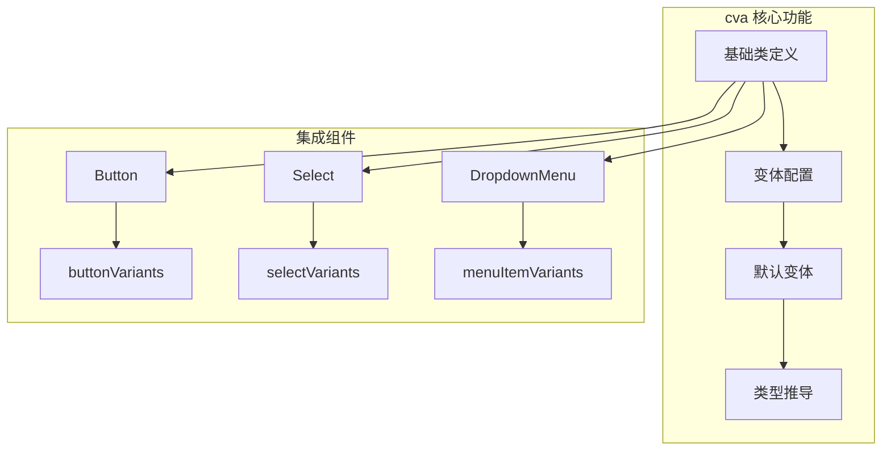
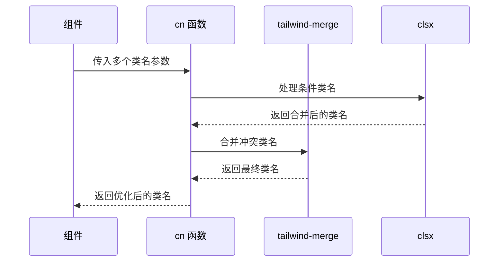
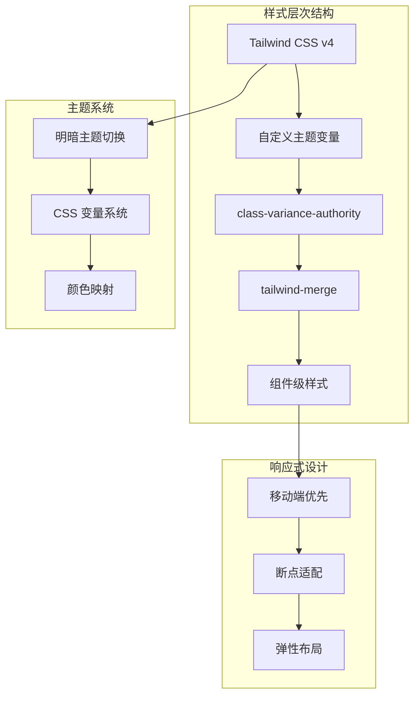
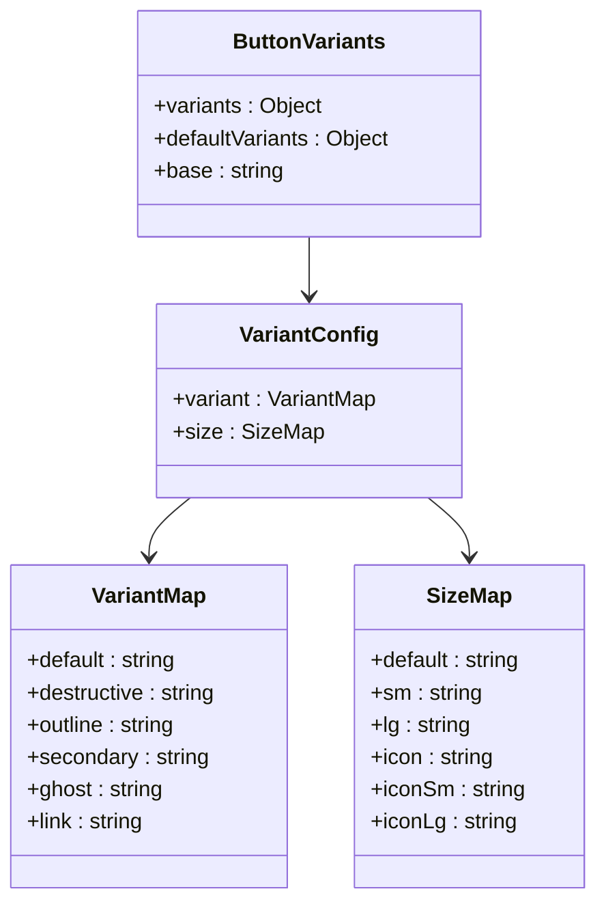
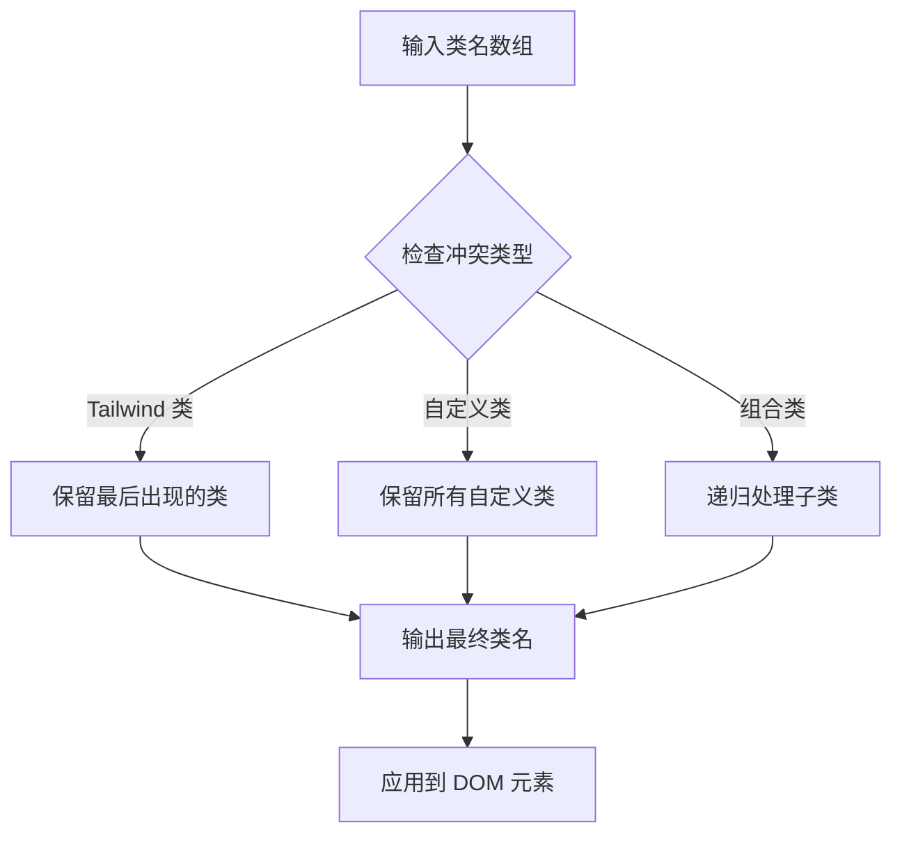
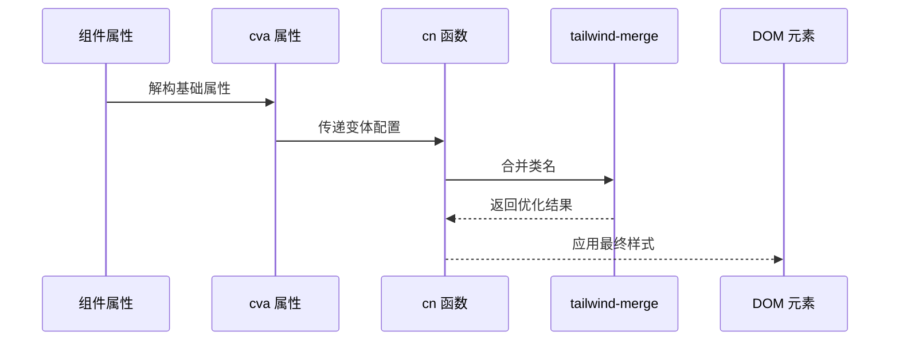
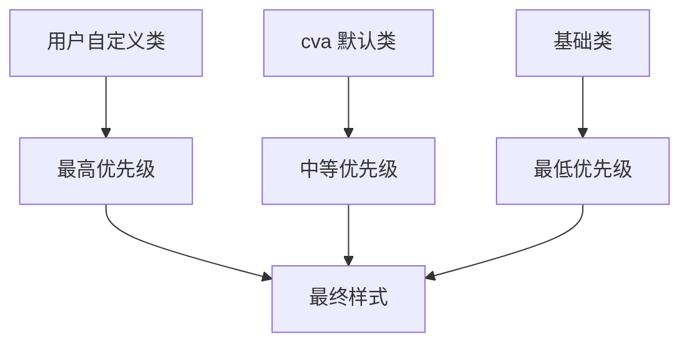

# UI组件样式体系

<cite>
**本文档中引用的文件**
- [button.tsx](file://src/components/ui/button.tsx)
- [card.tsx](file://src/components/ui/card.tsx)
- [input.tsx](file://src/components/ui/input.tsx)
- [dialog.tsx](file://src/components/ui/dialog.tsx)
- [select.tsx](file://src/components/ui/select.tsx)
- [switch.tsx](file://src/components/ui/switch.tsx)
- [slider.tsx](file://src/components/ui/slider.tsx)
- [dropdown-menu.tsx](file://src/components/ui/dropdown-menu.tsx)
- [form.tsx](file://src/components/ui/form.tsx)
- [tooltip.tsx](file://src/components/ui/tooltip.tsx)
- [globals.css](file://src/app/globals.css)
- [tailwind.config.ts](file://tailwind.config.ts)
- [utils.ts](file://src/lib/utils.ts)
- [package.json](file://package.json)
</cite>

## 目录
1. [项目概述](#项目概述)
2. [核心依赖分析](#核心依赖分析)
3. [样式架构设计](#样式架构设计)
4. [class-variance-authority (cva) 样式系统](#class-variance-authority-cva-样式系统)
5. [tailwind-merge 类名合并机制](#tailwind-merge-类名合并机制)
6. [组件样式实现模式](#组件样式实现模式)
7. [主题化与样式覆盖](#主题化与样式覆盖)
8. [最佳实践指南](#最佳实践指南)
9. [故障排除](#故障排除)
10. [总结](#总结)

## 项目概述

本项目是一个基于 Next.js 16 和 Radix UI primitives 构建的现代化 UI 组件库，采用了先进的样式架构设计。项目的核心特色在于结合了 `class-variance-authority` (cva) 的变体系统和 `tailwind-merge` 的智能类名合并机制，为开发者提供了灵活且可维护的组件样式解决方案。

### 技术栈概览

- **前端框架**: Next.js 16.0.4
- **UI 原语**: @radix-ui/primitives 系列组件
- **样式系统**: Tailwind CSS v4 + 自定义主题变量
- **样式工具**: class-variance-authority (0.7.1) + tailwind-merge (3.4.0)
- **图标库**: Lucide React (0.554.0)
- **表单处理**: react-hook-form + zod 验证

**章节来源**
- [package.json](file://package.json#L11-L56)
- [tailwind.config.ts](file://tailwind.config.ts#L1-L39)

## 核心依赖分析

### class-variance-authority (cva)

`class-variance-authority` 是项目样式系统的核心，它提供了类型安全的组件变体定义机制。



**图表来源**
- [button.tsx](file://src/components/ui/button.tsx#L7-L37)
- [select.tsx](file://src/components/ui/select.tsx#L27-L41)

### tailwind-merge 合并机制

`tailwind-merge` 提供了智能的类名冲突解决能力，确保样式的一致性和可预测性。



**图表来源**
- [utils.ts](file://src/lib/utils.ts#L4-L6)

**章节来源**
- [package.json](file://package.json#L28-L39)
- [utils.ts](file://src/lib/utils.ts#L1-L7)

## 样式架构设计

### 整体架构图



**图表来源**
- [globals.css](file://src/app/globals.css#L6-L44)
- [tailwind.config.ts](file://tailwind.config.ts#L6-L36)

### 主题变量系统

项目采用 CSS 自定义属性作为主题变量的基础，支持明暗主题的无缝切换：

| 变量类别 | 示例变量 | 默认值 | 暗色主题值 |
|---------|---------|--------|-----------|
| 基础颜色 | `--color-primary` | `oklch(0 0 0)` | `oklch(0.922 0 0)` |
| 背景系统 | `--color-background` | `oklch(1 0 0)` | `oklch(0.145 0 0)` |
| 边框系统 | `--color-border` | `oklch(0.922 0 0)` | `oklch(1 0 0 / 10%)` |
| 强调色 | `--color-destructive` | `oklch(0.577 0.245 27.325)` | `oklch(0.704 0.191 22.216)` |

**章节来源**
- [globals.css](file://src/app/globals.css#L46-L113)

## class-variance-authority (cva) 样式系统

### cva 基本概念

`class-variance-authority` 提供了一种声明式的组件变体定义方式，允许开发者以类型安全的方式管理组件的多种样式变体。

### Button 组件的变体系统

Button 组件展示了 cva 的典型应用模式：



**图表来源**
- [button.tsx](file://src/components/ui/button.tsx#L7-L37)

### 变体配置详解

#### 基础类 (Base Classes)
所有变体共享的基础样式：
- `inline-flex items-center justify-center`: 基础布局
- `gap-2 whitespace-nowrap`: 间距和文本处理
- `rounded-lg text-sm font-medium`: 圆角、字体大小和字重
- `transition-all`: 过渡动画
- `disabled:pointer-events-none disabled:opacity-50`: 禁用状态
- `[&_svg]:pointer-events-none`: SVG 图标交互控制

#### 变体类 (Variant Classes)
不同变体的具体样式定义：

| 变体类型 | 默认样式 | 状态类 | 特殊处理 |
|---------|---------|--------|---------|
| default | `bg-primary text-primary-foreground` | `hover:bg-primary/90` | 带阴影效果 |
| destructive | `bg-destructive text-white` | `hover:bg-destructive/90` | 深色背景 |
| outline | `border border-input bg-background` | `hover:bg-accent hover:text-accent-foreground` | 边框样式 |
| secondary | `bg-secondary text-secondary-foreground` | `hover:bg-secondary/80` | 次要强调 |
| ghost | `hover:bg-accent hover:text-accent-foreground` | `text-muted-foreground hover:text-foreground` | 透明背景 |
| link | `text-primary underline-offset-4` | `hover:underline` | 文本链接 |

#### 尺寸类 (Size Classes)
预定义的尺寸变体：

| 尺寸 | 高度 | 内边距 | 图标间距 |
|------|------|--------|---------|
| default | `h-9` | `px-4 py-2` | `has-[>svg]:px-3` |
| sm | `h-8 rounded-md` | `px-3` | `has-[>svg]:px-2.5` |
| lg | `h-10 rounded-md` | `px-6` | `has-[>svg]:px-4` |
| icon | `size-9` | 固定 | 固定 |
| icon-sm | `size-8` | 固定 | 固定 |
| icon-lg | `size-10` | 固定 | 固定 |

**章节来源**
- [button.tsx](file://src/components/ui/button.tsx#L7-L37)

## tailwind-merge 类名合并机制

### 合并策略

`tailwind-merge` 实现了智能的类名冲突解决算法，确保样式的一致性和可预测性。



### 使用示例

在组件中，`cn` 函数的使用模式：

```typescript
// 基础用法
className={cn(
  "base-class",
  condition && "conditional-class",
  variantClasses
)}

// 复杂场景
className={cn(
  baseStyles,
  variant === "primary" && "primary-variant",
  size === "large" && "large-size",
  className // 用户自定义类
)}
```

**章节来源**
- [utils.ts](file://src/lib/utils.ts#L4-L6)

## 组件样式实现模式

### 模板组件模式

大多数组件都遵循统一的样式实现模板：



### 不同组件的样式特点

#### 表单组件 (Input)
- **焦点状态**: `focus-visible:border-primary focus-visible:ring-2 focus-visible:ring-primary/5`
- **无效状态**: `aria-invalid:ring-destructive/20 dark:aria-invalid:ring-destructive/40 aria-invalid:border-destructive`
- **禁用状态**: `disabled:pointer-events-none disabled:cursor-not-allowed disabled:opacity-50`

#### 对话框组件 (Dialog)
- **动画系统**: `data-[state=open]:animate-in data-[state=closed]:animate-out`
- **过渡效果**: `data-[state=closed]:fade-out-0 data-[state=open]:fade-in-0`
- **定位系统**: `fixed top-[50%] left-[50%] translate-x-[-50%] translate-y-[-50%]`

#### 下拉菜单组件 (DropdownMenu)
- **状态指示**: `data-[state=open]:bg-accent data-[state=open]:text-accent-foreground`
- **图标处理**: `[&_svg]:pointer-events-none [&_svg]:shrink-0`
- **响应式布局**: `grid auto-rows-min grid-rows-[auto_auto]`

**章节来源**
- [input.tsx](file://src/components/ui/input.tsx#L10-L14)
- [dialog.tsx](file://src/components/ui/dialog.tsx#L62-L65)
- [dropdown-menu.tsx](file://src/components/ui/dropdown-menu.tsx#L76-L79)

## 主题化与样式覆盖

### 安全的主题化方法

#### 方法一：CSS 变量覆盖
```css
/* 在全局样式中覆盖特定变量 */
.custom-theme {
  --color-primary: #your-custom-color;
  --color-background: #your-custom-bg;
  --color-border: #your-custom-border;
}
```

#### 方法二：组件级样式覆盖
```typescript
// 通过 className 参数覆盖样式
<Button 
  className="bg-blue-500 hover:bg-blue-600"
  variant="default"
/>
```

#### 方法三：cva 扩展
```typescript
// 创建新的变体配置
const extendedButtonVariants = cva(
  buttonVariants(), // 基于现有变体
  {
    variants: {
      // 添加新的变体
      brand: {
        primary: "bg-brand-primary text-white",
        secondary: "bg-brand-secondary text-brand-foreground",
      }
    }
  }
)
```

### 样式优先级规则



### 响应式设计策略

#### 断点系统
- **移动端**: `md:text-sm` - 从中等屏幕开始使用小号字体
- **弹性布局**: `flex flex-col gap-6` - 垂直堆叠布局
- **容器系统**: `container mx-auto px-4` - 居中内容区域

#### 视觉反馈系统
- **焦点状态**: `focus-visible:border-ring focus-visible:ring-ring/50`
- **悬停状态**: `hover:bg-accent hover:text-accent-foreground`
- **激活状态**: `data-[state=checked]:bg-primary`

**章节来源**
- [globals.css](file://src/app/globals.css#L115-L135)
- [button.tsx](file://src/components/ui/button.tsx#L8)

## 最佳实践指南

### 组件开发最佳实践

#### 1. 类名组织原则
```typescript
// 推荐：按功能分组
className={cn(
  "base-layout",           // 基础布局
  "base-spacing",          // 基础间距
  variantClasses,          // 变体样式
  sizeClasses,             // 尺寸样式
  stateClasses,            // 状态样式
  className                // 用户自定义
)}
```

#### 2. 状态类管理
```typescript
// 推荐：使用数据属性而非 CSS 类
className={cn(
  "[&:not(:disabled)]:cursor-pointer",
  "[&:disabled]:opacity-50",
  "[&:active]:scale-95"
)}
```

#### 3. 动画系统
```typescript
// 推荐：使用 Radix UI 的内置动画
className={cn(
  "data-[state=open]:animate-in",
  "data-[state=closed]:animate-out",
  "data-[state=closed]:fade-out-0",
  "data-[state=open]:fade-in-0"
)}
```

### 性能优化建议

#### 1. 类名缓存
```typescript
// 避免在渲染循环中重复计算
const buttonClasses = useMemo(() => 
  cn(baseClasses, variantClasses), 
  [variantClasses]
)
```

#### 2. 条件渲染优化
```typescript
// 推荐：使用逻辑运算符而非三元表达式
className={cn(
  baseClass,
  condition && "conditional-class",
  anotherCondition && "another-class"
)}
```

#### 3. 样式拆分
```typescript
// 推荐：将复杂样式拆分为独立函数
const getVariantClasses = (variant: string) => {
  switch (variant) {
    case 'primary': return 'bg-primary text-white';
    case 'secondary': return 'bg-secondary text-secondary-foreground';
    default: return '';
  }
}
```

### 可访问性考虑

#### 1. 键盘导航
```typescript
// 确保所有交互元素都可以通过键盘访问
className={cn(
  "outline-none focus-visible:ring-2 focus-visible:ring-ring",
  "focus-visible:ring-offset-2 focus-visible:ring-offset-background"
)}
```

#### 2. 屏幕阅读器支持
```typescript
// 提供适当的 ARIA 属性
<div
  role="button"
  aria-label="关闭对话框"
  aria-describedby="close-description"
>
```

#### 3. 颜色对比度
```typescript
// 确保足够的颜色对比度
className={cn(
  "text-foreground",        // 主要文字
  "text-muted-foreground", // 次要文字
  "bg-background"          // 背景
)}
```

## 故障排除

### 常见问题及解决方案

#### 1. 样式不生效
**问题**: 组件样式没有正确应用
**原因**: 
- 类名拼写错误
- CSS 变量未定义
- tailwind-merge 冲突

**解决方案**:
```typescript
// 检查类名拼写
className={cn(
  "correct-class-name", // 确保拼写正确
  invalidClassName      // 删除无效类名
)}

// 检查 CSS 变量
console.log(getComputedStyle(document.body).getPropertyValue('--color-primary'))
```

#### 2. 样式冲突
**问题**: 多个样式规则相互冲突
**解决方案**:
```typescript
// 使用更具体的选择器
className={cn(
  "!important-class", // 强制覆盖
  "specific-class"    // 更具体的类名
)}
```

#### 3. 主题切换失效
**问题**: 明暗主题切换不生效
**解决方案**:
```css
/* 确保 CSS 变量正确设置 */
:root {
  --color-primary: oklch(0 0 0);
}

.dark {
  --color-primary: oklch(0.922 0 0);
}
```

#### 4. 动画性能问题
**问题**: 动画卡顿或不流畅
**解决方案**:
```typescript
// 限制动画范围
className={cn(
  "will-change-transform", // 提高性能
  "transition-all duration-200 ease-in-out"
)}
```

### 调试技巧

#### 1. 开发者工具检查
```javascript
// 在浏览器中检查最终应用的类名
const element = document.querySelector('[data-slot="button"]');
console.log(element.className);
```

#### 2. 样式追踪
```typescript
// 添加调试类名
className={cn(
  "debug-border", // 添加红色边框便于调试
  baseClasses,
  variantClasses
)}
```

#### 3. 性能监控
```typescript
// 监控类名计算性能
const startTime = performance.now();
const classes = cn(baseClasses, variantClasses);
const endTime = performance.now();
console.log(`Class calculation took ${endTime - startTime} milliseconds`);
```

## 总结

本项目展示了一个现代化的 UI 组件库样式架构，通过以下关键技术实现了高度可维护和可扩展的样式系统：

### 核心优势

1. **类型安全**: class-variance-authority 提供了完整的 TypeScript 支持
2. **智能合并**: tailwind-merge 确保类名冲突的优雅解决
3. **主题化友好**: 基于 CSS 变量的主题系统支持动态切换
4. **性能优化**: 智能的类名缓存和合并策略
5. **可访问性**: 完善的键盘导航和屏幕阅读器支持

### 设计理念

- **模块化**: 每个组件都有清晰的样式边界
- **可组合**: 通过类名组合实现复杂的样式效果
- **可扩展**: 支持向后兼容的样式扩展
- **一致性**: 统一的样式命名和组织原则

### 未来发展方向

1. **设计令牌系统**: 考虑引入更专业的设计令牌管理
2. **CSS-in-JS**: 探索 styled-components 或 emotion 的集成
3. **自动化测试**: 建立样式变更的自动化测试流程
4. **性能监控**: 实施样式的性能基准测试

这种架构不仅满足了当前的开发需求，也为未来的功能扩展和技术演进奠定了坚实的基础。通过持续的优化和改进，这个样式系统将继续为开发者提供高效、可靠、美观的组件体验。