# 全局样式定义

<cite>
**本文档中引用的文件**
- [globals.css](file://src/app/globals.css)
- [zIndex.ts](file://src/lib/zIndex.ts)
- [tailwind.config.ts](file://tailwind.config.ts)
- [layout.tsx](file://src/app/layout.tsx)
- [button.tsx](file://src/components/ui/button.tsx)
- [card.tsx](file://src/components/ui/card.tsx)
- [CustomNode.tsx](file://src/components/flow/CustomNode.tsx)
- [package.json](file://package.json)
- [postcss.config.mjs](file://postcss.config.mjs)
</cite>

## 目录
1. [简介](#简介)
2. [项目结构概览](#项目结构概览)
3. [CSS重置与基础设置](#css重置与基础设置)
4. [自定义CSS变量系统](#自定义css变量系统)
5. [Tailwind集成架构](#tailwind集成架构)
6. [深色模式支持](#深色模式支持)
7. [全局z-index层级管理](#全局z-index层级管理)
8. [自定义工具类与样式](#自定义工具类与样式)
9. [React Flow集成样式](#react-flow集成样式)
10. [样式扩展指南](#样式扩展指南)
11. [第三方样式冲突处理](#第三方样式冲突处理)
12. [最佳实践建议](#最佳实践建议)

## 简介

Flash Flow SaaS应用采用了一套精心设计的全局样式系统，该系统基于现代CSS技术栈构建，集成了Tailwind CSS框架和自定义CSS变量系统。这套样式系统为整个应用提供了统一的视觉基础，确保了跨组件的一致性和可维护性。

核心特性包括：
- 基于OKLCH色彩空间的现代化颜色系统
- 完整的深色模式支持
- 中心化的z-index层级管理
- 与Tailwind CSS的无缝集成
- 针对React Flow的专门样式定制

## 项目结构概览

全局样式系统的组织结构体现了模块化和可维护性的设计理念：

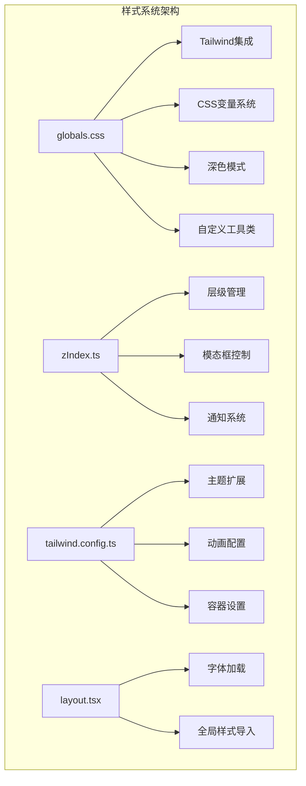

**图表来源**
- [globals.css](file://src/app/globals.css#L1-L201)
- [zIndex.ts](file://src/lib/zIndex.ts#L1-L24)
- [tailwind.config.ts](file://tailwind.config.ts#L1-L39)
- [layout.tsx](file://src/app/layout.tsx#L1-L31)

**章节来源**
- [globals.css](file://src/app/globals.css#L1-L201)
- [zIndex.ts](file://src/lib/zIndex.ts#L1-L24)
- [tailwind.config.ts](file://tailwind.config.ts#L1-L39)

## CSS重置与基础设置

### 核心重置策略

全局样式文件采用了现代化的CSS重置方法，通过Tailwind的`@layer base`指令定义基础样式规则：

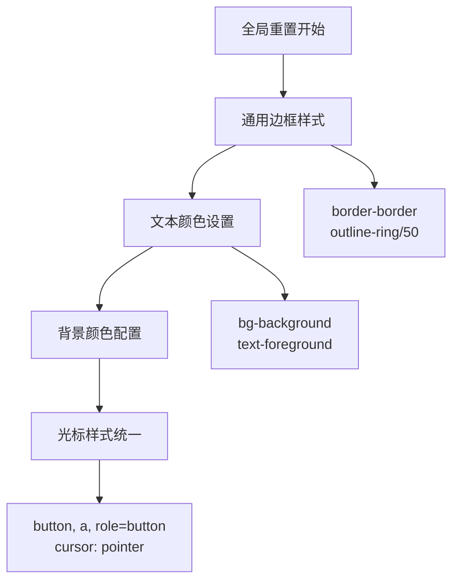

**图表来源**
- [globals.css](file://src/app/globals.css#L115-L135)

### 基础排版设置

系统通过CSS变量和Tailwind类实现了统一的基础排版：

| 属性 | 默认值 | 深色模式 | 说明 |
|------|--------|----------|------|
| 字体系列 | `var(--font-inter)` | `var(--font-inter)` | 使用Inter字体作为主要字体 |
| 行高 | 自动计算 | 自动计算 | 基于字体大小自动调整 |
| 字体大小 | 基准16px | 基准16px | 支持响应式字体缩放 |
| 字重 | 400-600 | 400-600 | 支持粗体和常规字重 |

### 全局光标样式

为了提升用户体验，系统为所有可点击元素设置了统一的指针光标：

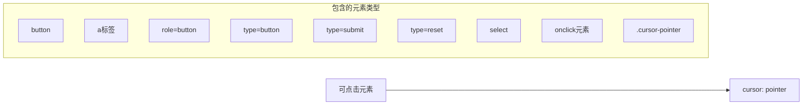

**图表来源**
- [globals.css](file://src/app/globals.css#L124-L135)

**章节来源**
- [globals.css](file://src/app/globals.css#L115-L135)

## 自定义CSS变量系统

### 变量命名规范

系统采用语义化的CSS变量命名体系，确保变量的可读性和一致性：

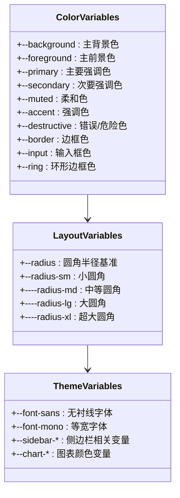

**图表来源**
- [globals.css](file://src/app/globals.css#L6-L44)

### OKLCH色彩系统

项目采用先进的OKLCH色彩空间，提供更准确的颜色感知和更好的对比度：

| 颜色类别 | 浅色模式值 | 深色模式值 | 应用场景 |
|----------|------------|------------|----------|
| 背景色 | `oklch(1 0 0)` | `oklch(0.145 0 0)` | 页面主背景 |
| 前景色 | `oklch(0.145 0 0)` | `oklch(0.985 0 0)` | 主要文本 |
| 主色调 | `oklch(0 0 0)` | `oklch(0.922 0 0)` | 按钮、链接 |
| 柔和色 | `oklch(0.97 0 0)` | `oklch(0.269 0 0)` | 辅助文本 |
| 错误色 | `oklch(0.577 0.245 27.325)` | `oklch(0.704 0.191 22.216)` | 错误提示 |

### 圆角系统

通过动态计算实现灵活的圆角尺寸：

```mermaid
graph TD
A[--radius: 0.75rem] --> B[--radius-sm: calc(var(--radius) - 4px)]
A --> C[--radius-md: calc(var(--radius) - 2px)]
A --> D[--radius-lg: var(--radius)]
A --> E[--radius-xl: calc(var(--radius) + 4px)]
B --> F["小圆角: 5px<br/>(0.75rem - 4px)"]
C --> G["中圆角: 7px<br/>(0.75rem - 2px)"]
D --> H["大圆角: 12px<br/>(0.75rem)"]
E --> I["超大圆角: 16px<br/>(0.75rem + 4px)"]
```

**图表来源**
- [globals.css](file://src/app/globals.css#L40-L43)

**章节来源**
- [globals.css](file://src/app/globals.css#L6-L44)

## Tailwind集成架构

### 主题配置扩展

Tailwind配置文件展示了系统的主题扩展策略：

```mermaid
classDiagram
class TailwindConfig {
+darkMode : "class"
+content : ["./src/**/*.{ts,tsx}"]
+theme.extend : ThemeExtensions
}
class ThemeExtensions {
+colors : ColorDefinitions
+borderRadius : BorderRadius
+container : ContainerSettings
+keyframes : AnimationKeyframes
+animation : AnimationDefinitions
}
class ColorDefinitions {
+primary : {DEFAULT, foreground}
+chart-* : 动态图表颜色
}
class BorderRadius {
+xl : "0.75rem"
}
class ContainerSettings {
+center : true
+padding : "2rem"
+screens : {"2xl" : "1400px"}
}
TailwindConfig --> ThemeExtensions
ThemeExtensions --> ColorDefinitions
ThemeExtensions --> BorderRadius
ThemeExtensions --> ContainerSettings
```

**图表来源**
- [tailwind.config.ts](file://tailwind.config.ts#L3-L38)

### 自定义变体系统

系统定义了专门的深色模式变体：

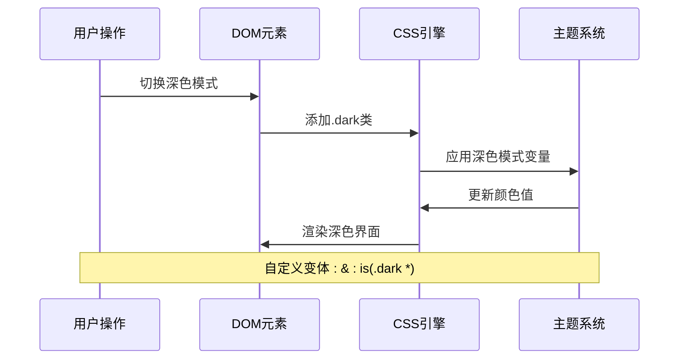

**图表来源**
- [globals.css](file://src/app/globals.css#L4-L5)

### 动画系统

Tailwind配置包含了自定义动画支持：

| 动画名称 | 持续时间 | 描述 |
|----------|----------|------|
| shimmer | 2秒无限循环 | 光泽效果动画 |
| fade-in | 默认 | 淡入效果 |
| slide-up | 默认 | 向上滑动 |

**章节来源**
- [tailwind.config.ts](file://tailwind.config.ts#L1-L39)

## 深色模式支持

### 模式切换机制

系统通过CSS变量和类名切换实现深色模式：

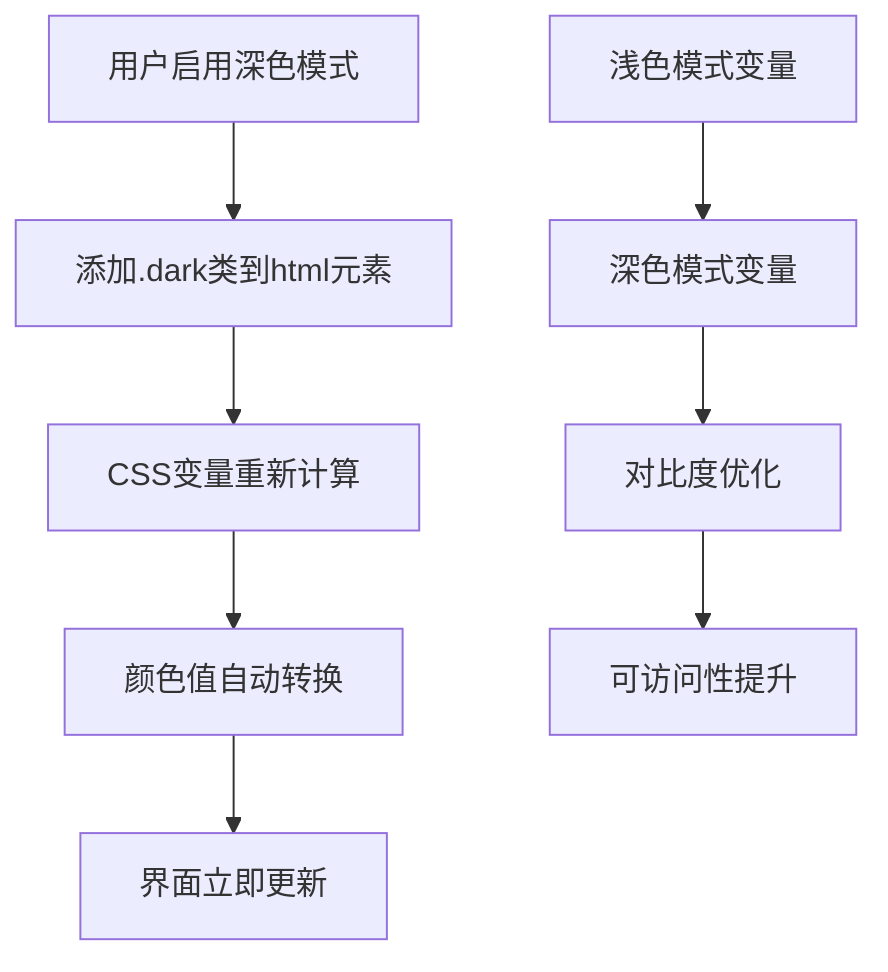

**图表来源**
- [globals.css](file://src/app/globals.css#L81-L113)

### 颜色映射关系

深色模式下的颜色映射遵循对比度和可读性原则：

| 浅色模式 | 深色模式 | 对比度改善 |
|----------|----------|------------|
| `oklch(1 0 0)` | `oklch(0.145 0 0)` | 从白色到深灰色 |
| `oklch(0.145 0 0)` | `oklch(0.985 0 0)` | 从深灰到白色 |
| `oklch(0.97 0 0)` | `oklch(0.269 0 0)` | 从浅灰到深灰 |
| `oklch(0.708 0 0)` | `oklch(0.556 0 0)` | 从浅蓝到深蓝 |

### 透明度处理

深色模式中的透明度值经过特别优化：

```mermaid
graph LR
A[浅色模式透明度] --> B[10%不透明度]
A --> C[15%不透明度]
D[深色模式透明度] --> E[10%半透明]
D --> F[15%半透明]
style E fill:#2d3748
style F fill:#2d3748
```

**图表来源**
- [globals.css](file://src/app/globals.css#L97-L98)

**章节来源**
- [globals.css](file://src/app/globals.css#L81-L113)

## 全局z-index层级管理

### 层级系统设计

zIndex.ts文件定义了清晰的层级管理系统，防止z-index冲突：

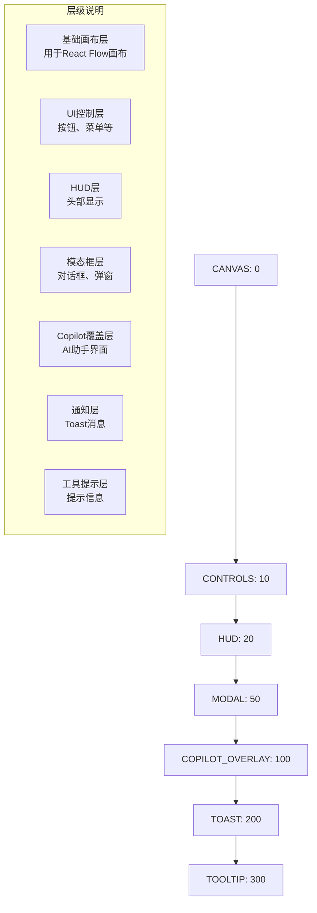

**图表来源**
- [zIndex.ts](file://src/lib/zIndex.ts#L6-L21)

### 类型安全保证

系统通过TypeScript确保z-index值的类型安全：

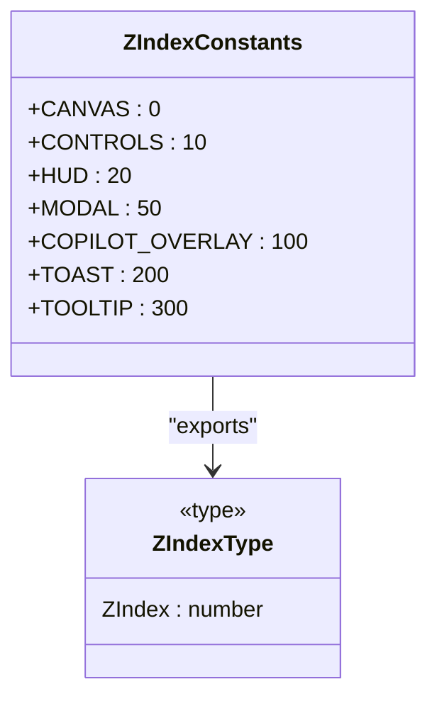

**图表来源**
- [zIndex.ts](file://src/lib/zIndex.ts#L23-L24)

### 扩展策略

新的层级可以通过以下方式添加：

1. 在Z_INDEX对象中添加新常量
2. 更新ZIndex类型定义
3. 确保数值递增且间隔合理

**章节来源**
- [zIndex.ts](file://src/lib/zIndex.ts#L1-L24)

## 自定义工具类与样式

### 背景图案系统

系统提供了两种预设的背景图案：

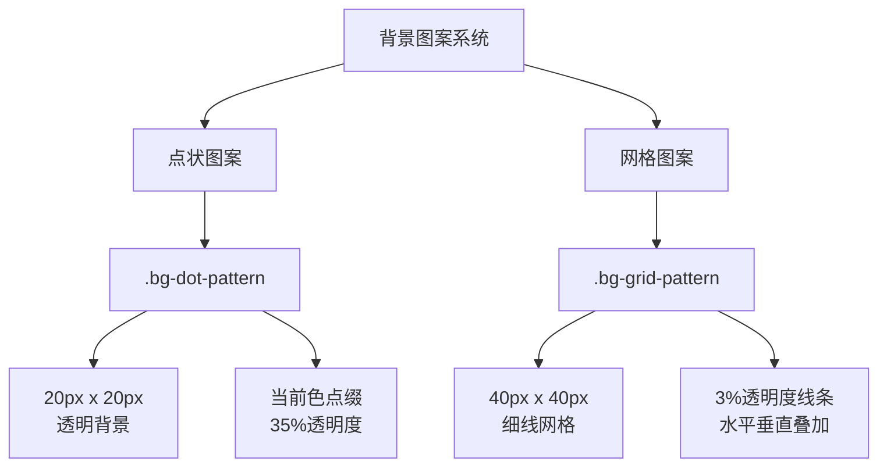

**图表来源**
- [globals.css](file://src/app/globals.css#L138-L151)

### 滚动条定制

针对特定组件的滚动条进行了精细定制：

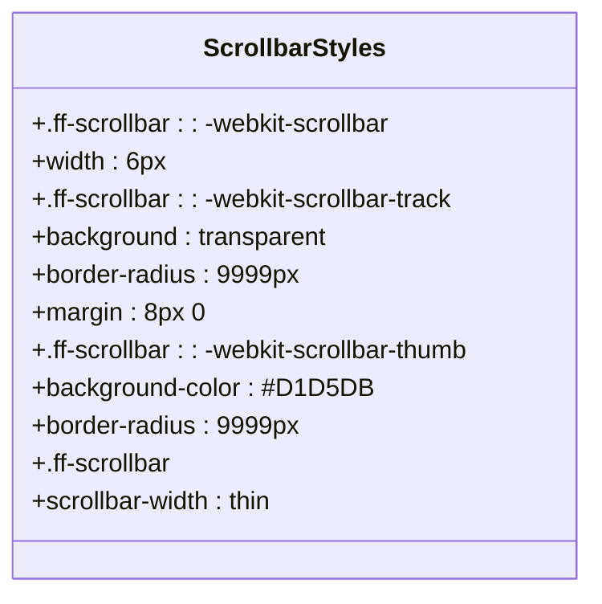

**图表来源**
- [globals.css](file://src/app/globals.css#L154-L174)

### 工具类分类

| 类别 | 示例 | 用途 |
|------|------|------|
| 背景图案 | `.bg-dot-pattern` | 设计辅助背景 |
| 背景图案 | `.bg-grid-pattern` | 网格辅助背景 |
| 滚动条 | `.ff-scrollbar` | 统一滚动条样式 |

**章节来源**
- [globals.css](file://src/app/globals.css#L138-L174)

## React Flow集成样式

### 节点外观定制

针对React Flow组件进行了专门的样式定制：

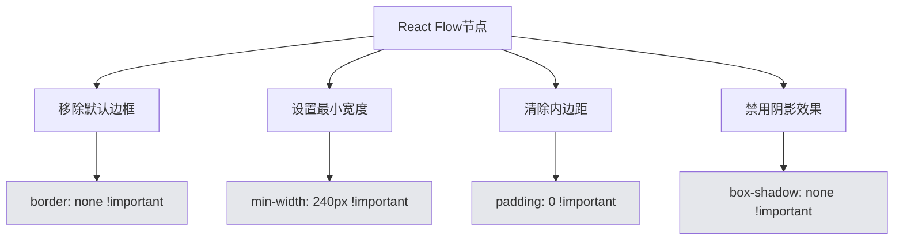

**图表来源**
- [globals.css](file://src/app/globals.css#L180-L201)

### 全局样式覆盖

系统通过CSS变量和选择器优先级实现全局覆盖：

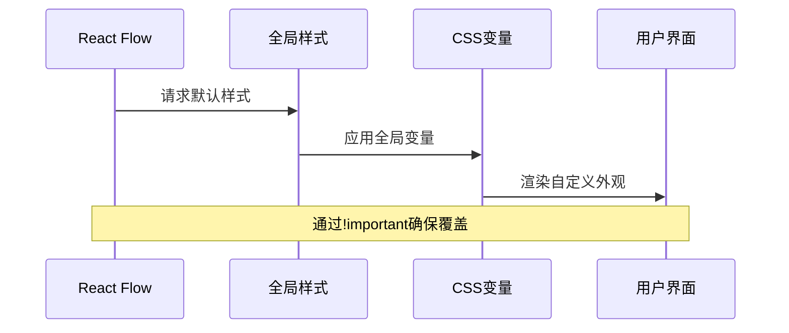

**图表来源**
- [globals.css](file://src/app/globals.css#L189-L192)

### 交互状态处理

系统移除了React Flow的默认交互效果：

| 效果类型 | 默认行为 | 自定义行为 |
|----------|----------|------------|
| 选中状态 | 显示阴影 | 禁用阴影 |
| 悬停效果 | 淡灰边框 | 禁用边框 |
| 选择框 | 默认阴影 | 自定义样式 |

**章节来源**
- [globals.css](file://src/app/globals.css#L176-L201)

## 样式扩展指南

### 安全扩展原则

为了保持组件封装性，扩展全局样式应遵循以下原则：

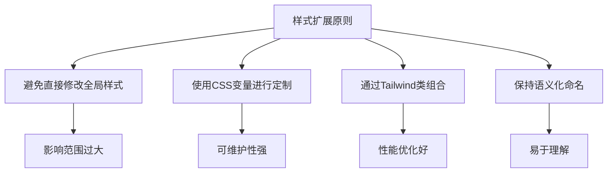

### 推荐的扩展方式

1. **CSS变量扩展**：通过修改CSS变量值来定制主题
2. **Tailwind类组合**：利用现有的工具类进行组合
3. **自定义组件样式**：在组件级别定义专用样式
4. **PostCSS插件**：通过构建时处理添加特殊功能

### 性能考虑

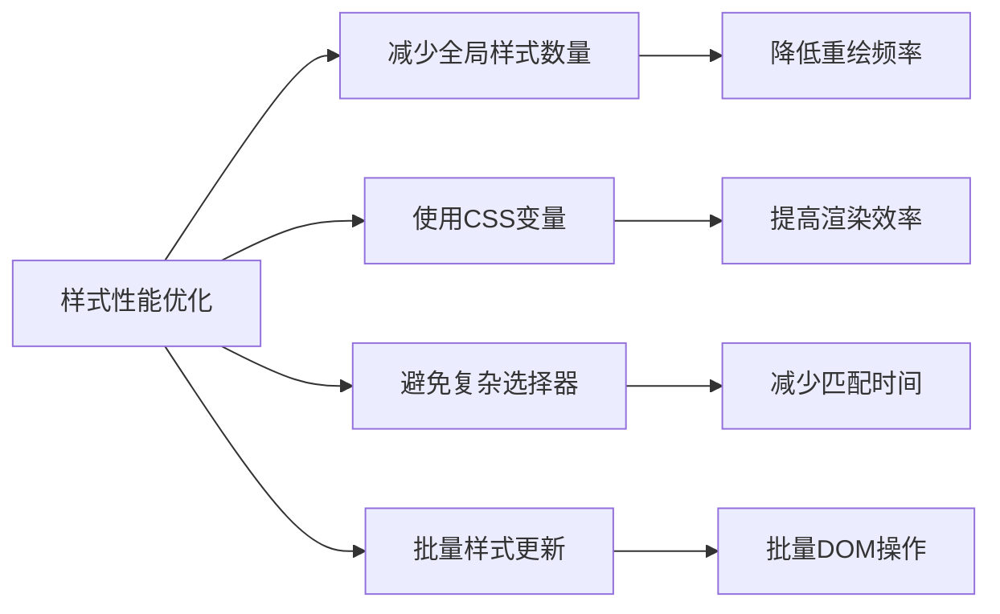

## 第三方样式冲突处理

### 冲突检测策略

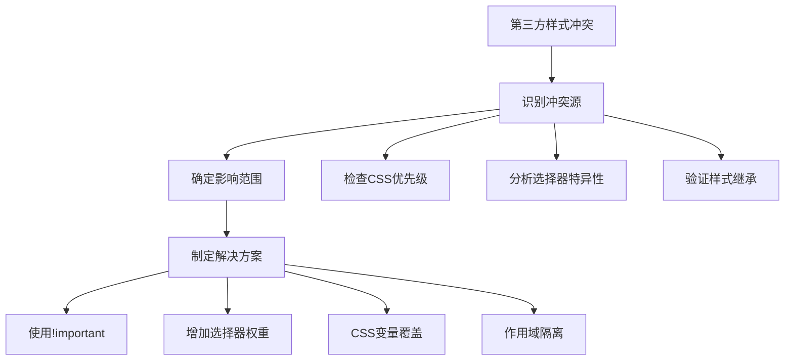

### 解决方案矩阵

| 冲突类型 | 解决方案 | 实施难度 | 推荐程度 |
|----------|----------|----------|----------|
| 全局重置冲突 | CSS变量覆盖 | 低 | 高 |
| 组件样式冲突 | 选择器权重提升 | 中 | 中 |
| 动画冲突 | 时间轴分离 | 高 | 低 |
| 字体冲突 | 字体堆叠 | 低 | 高 |

### 隔离策略

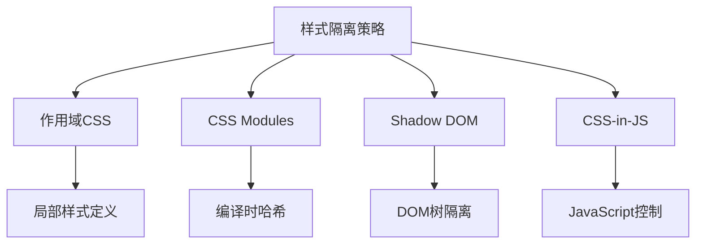

## 最佳实践建议

### 开发阶段

1. **样式模块化**：将样式按功能模块组织
2. **变量集中管理**：通过CSS变量统一管理颜色和间距
3. **测试覆盖**：确保样式在不同设备和浏览器上的兼容性
4. **性能监控**：定期检查样式加载和渲染性能

### 维护阶段

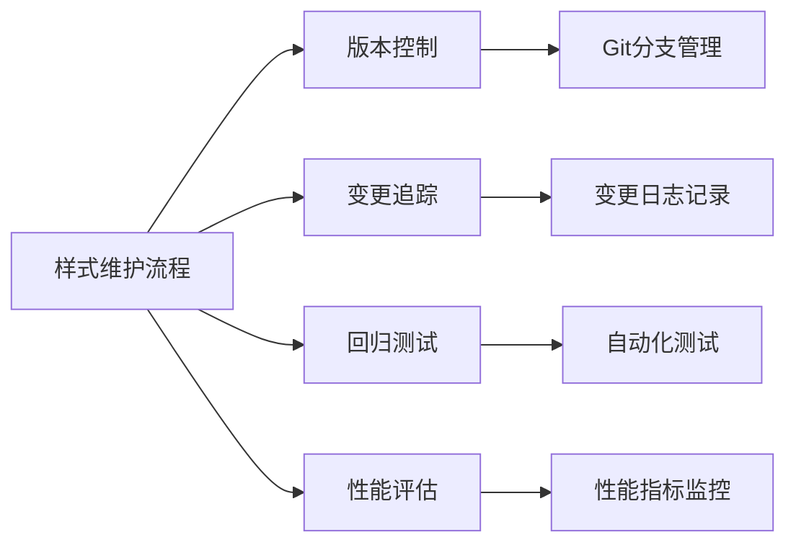

### 团队协作

1. **样式规范**：制定统一的命名和组织规范
2. **代码审查**：建立样式变更的审查流程
3. **文档维护**：及时更新样式系统的使用文档
4. **培训支持**：为团队成员提供样式系统培训

### 未来发展方向

```mermaid
mindmap
root((样式系统演进))
现代化
CSS-in-JS
PostCSS增强
构建时优化
性能
样式分割
按需加载
缓存策略
可访问性
颜色对比度
交互反馈
键盘导航
开发体验
实时预览
错误检测
自动修复
```

这套全局样式系统为Flash Flow SaaS应用提供了坚实的设计基础，通过现代化的技术栈和严谨的架构设计，确保了应用的视觉一致性和开发的可维护性。随着项目的不断发展，这套样式系统将继续演进，为用户提供更好的体验。