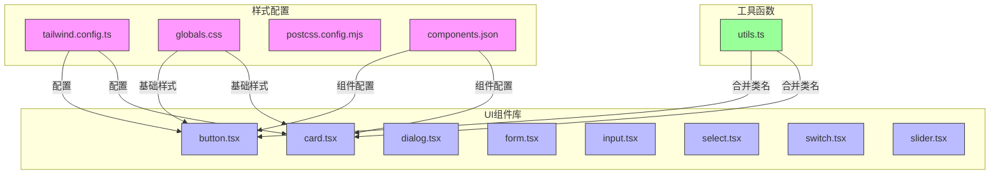
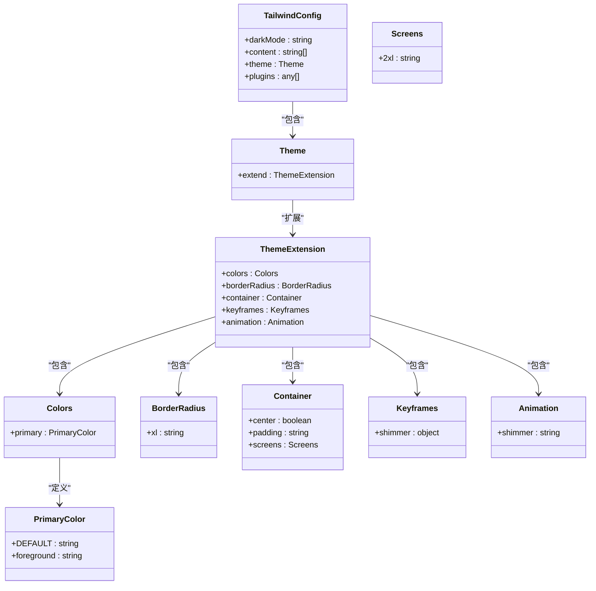
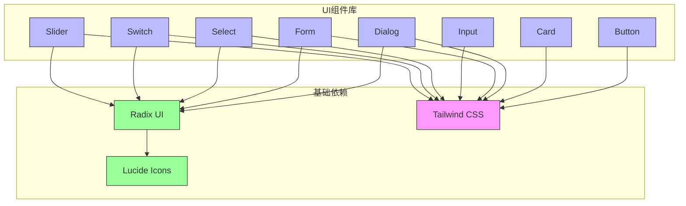
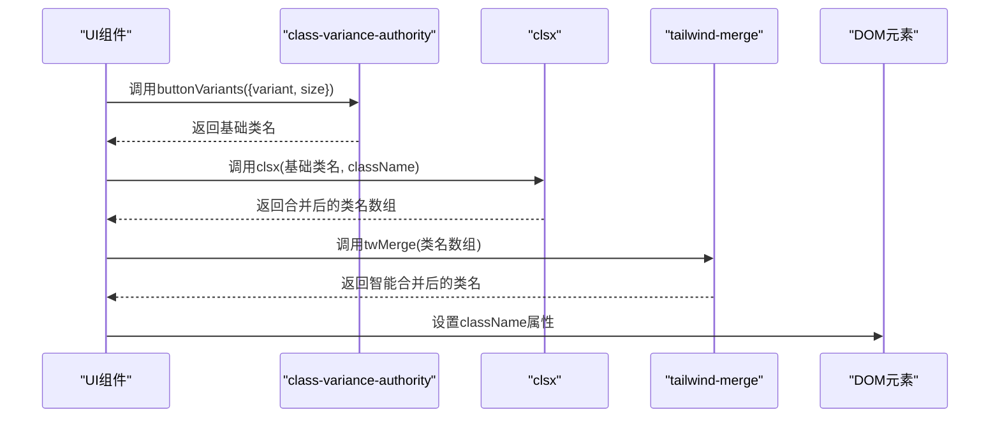
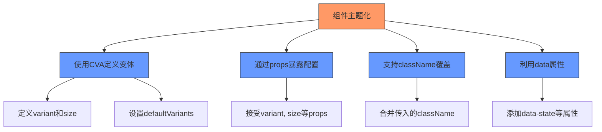

# 样式策略与设计系统

<cite>
**本文档中引用的文件**  
- [tailwind.config.ts](file://tailwind.config.ts)
- [globals.css](file://src/app/globals.css)
- [components.json](file://components.json)
- [postcss.config.mjs](file://postcss.config.mjs)
- [button.tsx](file://src/components/ui/button.tsx)
- [card.tsx](file://src/components/ui/card.tsx)
- [dialog.tsx](file://src/components/ui/dialog.tsx)
- [form.tsx](file://src/components/ui/form.tsx)
- [input.tsx](file://src/components/ui/input.tsx)
- [select.tsx](file://src/components/ui/select.tsx)
- [switch.tsx](file://src/components/ui/switch.tsx)
- [slider.tsx](file://src/components/ui/slider.tsx)
- [utils.ts](file://src/lib/utils.ts)
</cite>

## 目录
1. [项目结构](#项目结构)
2. [Tailwind CSS 配置](#tailwind-css-配置)
3. [全局样式定义](#全局样式定义)
4. [设计系统与UI组件库](#设计系统与ui组件库)
5. [可复用样式变体实现](#可复用样式变体实现)
6. [主题定制与暗色模式](#主题定制与暗色模式)
7. [响应式断点设置](#响应式断点设置)
8. [样式覆盖与组件主题化最佳实践](#样式覆盖与组件主题化最佳实践)

## 项目结构

项目采用基于Next.js的现代前端架构，样式系统核心文件位于根目录和`src/app`目录下。UI组件库遵循shadcn/ui的设计模式，集中存放在`src/components/ui`目录中，通过别名`@/components/ui`进行引用。



**图示来源**  
- [tailwind.config.ts](file://tailwind.config.ts)
- [globals.css](file://src/app/globals.css)
- [components.json](file://components.json)
- [utils.ts](file://src/lib/utils.ts)

**本节来源**  
- [tailwind.config.ts](file://tailwind.config.ts)
- [globals.css](file://src/app/globals.css)
- [components.json](file://components.json)

## Tailwind CSS 配置

项目的Tailwind CSS配置通过`tailwind.config.ts`文件进行定义，采用了现代化的配置方式，支持深色模式、自定义颜色和动画效果。

配置中关键设置包括：
- **深色模式**：采用`class`策略，通过`.dark`类切换主题
- **内容扫描**：配置了源文件路径，确保生成正确的CSS类
- **主题扩展**：自定义了主色调、边框半径、容器样式和动画效果



**图示来源**  
- [tailwind.config.ts](file://tailwind.config.ts)

**本节来源**  
- [tailwind.config.ts](file://tailwind.config.ts)

## 全局样式定义

全局样式在`src/app/globals.css`文件中定义，采用了CSS自定义属性（CSS Variables）和现代CSS特性，为整个应用提供了统一的视觉基础。

全局样式系统包含以下关键部分：
- **CSS变量定义**：在`:root`和`.dark`选择器中定义了完整的调色板
- **主题系统**：通过`@theme inline`定义了主题变量映射
- **基础样式层**：使用`@layer base`设置了全局重置样式
- **实用样式层**：使用`@layer utilities`定义了可复用的实用类

```mermaid
graph TD
A[全局样式] --> B[CSS变量]
A --> C[主题系统]
A --> D[基础样式]
A --> E[实用样式]
B --> F[:root 变量]
B --> G[.dark 变量]
F --> H[背景色]
F --> I[前景色]
F --> J[主色调]
G --> K[深色背景]
G --> L[深色前景]
G --> M[深色主色调]
C --> N[@theme inline]
N --> O[变量映射]
O --> P[--color-background]
O --> Q[--color-foreground]
O --> R[--color-primary]
D --> S[@layer base]
S --> T[全局边框]
S --> U[全局轮廓]
S --> V[body样式]
E --> W[@layer utilities]
W --> X[点状背景]
W --> Y[网格背景]
W --> Z[滚动条样式]
style A fill:#f96,stroke:#333
style B fill:#69f,stroke:#333
style C fill:#69f,stroke:#333
style D fill:#69f,stroke:#333
style E fill:#69f,stroke:#333
```

**图示来源**  
- [globals.css](file://src/app/globals.css)

**本节来源**  
- [globals.css](file://src/app/globals.css)

## 设计系统与UI组件库

项目采用了基于shadcn/ui的UI组件库设计模式，通过`components.json`配置文件进行管理，实现了高度一致的设计系统。

设计系统特点包括：
- **组件化架构**：所有UI组件封装在`src/components/ui`目录中
- **别名系统**：通过`@/components/ui`等别名简化导入路径
- **样式一致性**：所有组件遵循相同的视觉语言和交互模式
- **可访问性**：组件内置了ARIA属性和键盘导航支持



**图示来源**  
- [components.json](file://components.json)
- [button.tsx](file://src/components/ui/button.tsx)
- [card.tsx](file://src/components/ui/card.tsx)
- [dialog.tsx](file://src/components/ui/dialog.tsx)

**本节来源**  
- [components.json](file://components.json)
- [button.tsx](file://src/components/ui/button.tsx)
- [card.tsx](file://src/components/ui/card.tsx)
- [dialog.tsx](file://src/components/ui/dialog.tsx)

## 可复用样式变体实现

项目通过`class-variance-authority`和`tailwind-merge`库实现了强大的可复用样式变体系统，确保了组件样式的灵活性和一致性。

### class-variance-authority 实现

`class-variance-authority`（CVA）用于定义组件的样式变体，如按钮的`variant`和`size`属性。以按钮组件为例：

```mermaid
classDiagram
class ButtonVariants {
+cva()
+variants : object
+defaultVariants : object
}
class Button {
+className : string
+variant : string
+size : string
+asChild : boolean
+props : any
}
class Utils {
+cn() : string
}
Button --> ButtonVariants : "使用"
Button --> Utils : "使用"
ButtonVariants -->|定义| Button : "样式变体"
Utils -->|合并| Button : "类名"
note right of ButtonVariants
定义了按钮的样式变体：
- variant : default, destructive, outline, secondary, ghost, link
- size : default, sm, lg, icon, icon-sm, icon-lg
- defaultVariants : variant="default", size="default"
end note
note right of Button
组件接收variant、size等属性
通过cva生成对应的Tailwind类名
使用cn函数合并类名
end note
```

**图示来源**  
- [button.tsx](file://src/components/ui/button.tsx)
- [utils.ts](file://src/lib/utils.ts)

### tailwind-merge 实现

`tailwind-merge`用于智能合并Tailwind CSS类名，解决类名冲突问题，确保最终样式的正确性。



**图示来源**  
- [button.tsx](file://src/components/ui/button.tsx)
- [utils.ts](file://src/lib/utils.ts)

**本节来源**  
- [button.tsx](file://src/components/ui/button.tsx)
- [utils.ts](file://src/lib/utils.ts)

## 主题定制与暗色模式

项目实现了完整的主题定制系统，支持深色模式切换，通过CSS变量和Tailwind配置实现了灵活的主题管理。

### 主题系统架构

```mermaid
graph TD
A[主题系统] --> B[CSS变量]
A --> C[Tailwind配置]
A --> D[深色模式]
B --> E[:root 变量]
B --> F[.dark 变量]
B --> G[@theme inline]
E --> H[浅色主题值]
F --> I[深色主题值]
G --> J[变量映射]
C --> K[tailwind.config.ts]
K --> L[colors.primary]
K --> M[darkMode: "class"]
D --> N[暗类切换]
N --> O[JavaScript切换]
N --> P[用户偏好]
style A fill:#f96,stroke:#333
style B fill:#69f,stroke:#333
style C fill:#69f,stroke:#333
style D fill:#69f,stroke:#333
```

### 主题变量映射

项目通过`@theme inline`规则将CSS变量映射到Tailwind的语义化命名空间，实现了主题的统一管理：

```css
@theme inline {
  --color-background: var(--background);
  --color-foreground: var(--foreground);
  --color-primary: var(--primary);
  --color-primary-foreground: var(--primary-foreground);
  /* ...其他变量映射 */
}
```

这种设计使得Tailwind的`bg-background`、`text-foreground`等类名能够自动响应主题变化。

**图示来源**  
- [globals.css](file://src/app/globals.css)
- [tailwind.config.ts](file://tailwind.config.ts)

**本节来源**  
- [globals.css](file://src/app/globals.css)
- [tailwind.config.ts](file://tailwind.config.ts)

## 响应式断点设置

项目通过Tailwind CSS的响应式设计系统实现了完整的响应式布局，支持多种屏幕尺寸的适配。

### 断点配置

在`tailwind.config.ts`中通过`container`属性配置了响应式断点：

```typescript
container: {
  center: true,
  padding: "2rem",
  screens: {
    "2xl": "1400px",
  },
}
```

### 响应式实践

UI组件中广泛使用了Tailwind的响应式前缀，如`md:`、`sm:`等，实现不同屏幕尺寸下的样式调整。以输入框组件为例：

```mermaid
classDiagram
class Input {
+className : string
+type : string
+props : any
}
note right of Input
输入框组件的样式包含：
- 基础样式：border-input, rounded-xl, shadow-sm
- 文本样式：text-base, md : text-sm
- 状态样式：focus-visible : border-primary, aria-invalid : border-destructive
- 响应式：md : text-sm 在中等及以上屏幕使用小号字体
end note
```

**图示来源**  
- [tailwind.config.ts](file://tailwind.config.ts)
- [input.tsx](file://src/components/ui/input.tsx)

**本节来源**  
- [tailwind.config.ts](file://tailwind.config.ts)
- [input.tsx](file://src/components/ui/input.tsx)

## 样式覆盖与组件主题化最佳实践

项目提供了一套完整的样式覆盖和组件主题化最佳实践，确保了设计系统的灵活性和可维护性。

### 样式覆盖策略

1. **优先使用类名覆盖**：通过`className`属性覆盖组件样式
2. **利用数据属性**：使用`data-*`属性实现条件样式
3. **避免!important**：通过CSS优先级和Tailwind的排序规则管理样式冲突

### 组件主题化实践



### 最佳实践总结

1. **保持一致性**：遵循设计系统规范，确保UI一致性
2. **优先组合**：优先使用现有组件组合，而非创建新组件
3. **语义化类名**：使用语义化的类名，提高代码可读性
4. **响应式优先**：从移动设备开始设计，逐步增强
5. **主题友好**：确保组件在浅色和深色模式下都有良好的视觉效果

**图示来源**  
- [button.tsx](file://src/components/ui/button.tsx)
- [card.tsx](file://src/components/ui/card.tsx)
- [utils.ts](file://src/lib/utils.ts)

**本节来源**  
- [button.tsx](file://src/components/ui/button.tsx)
- [card.tsx](file://src/components/ui/card.tsx)
- [utils.ts](file://src/lib/utils.ts)