# 样式配置

<cite>
**本文档中引用的文件**
- [tailwind.config.ts](file://tailwind.config.ts)
- [package.json](file://package.json)
- [src/app/globals.css](file://src/app/globals.css)
- [postcss.config.mjs](file://postcss.config.mjs)
- [src/components/ui/button.tsx](file://src/components/ui/button.tsx)
- [src/components/ui/card.tsx](file://src/components/ui/card.tsx)
- [src/components/ui/switch.tsx](file://src/components/ui/switch.tsx)
- [src/lib/utils.ts](file://src/lib/utils.ts)
</cite>

## 目录
1. [项目概述](#项目概述)
2. [Tailwind CSS配置架构](#tailwind-css配置架构)
3. [核心配置分析](#核心配置分析)
4. [主题系统设计](#主题系统设计)
5. [插件集成与扩展](#插件集成与扩展)
6. [设计系统一致性](#设计系统一致性)
7. [暗色模式策略](#暗色模式策略)
8. [性能优化考量](#性能优化考量)
9. [最佳实践指南](#最佳实践指南)
10. [故障排除](#故障排除)

## 项目概述

本项目采用现代化的Tailwind CSS v4配置，结合class-variance-authority (CVA) 和 tw-animate-css 插件，构建了一个功能完整的设计系统。项目使用Next.js 16框架，通过TypeScript提供类型安全的样式开发体验。

### 技术栈概览

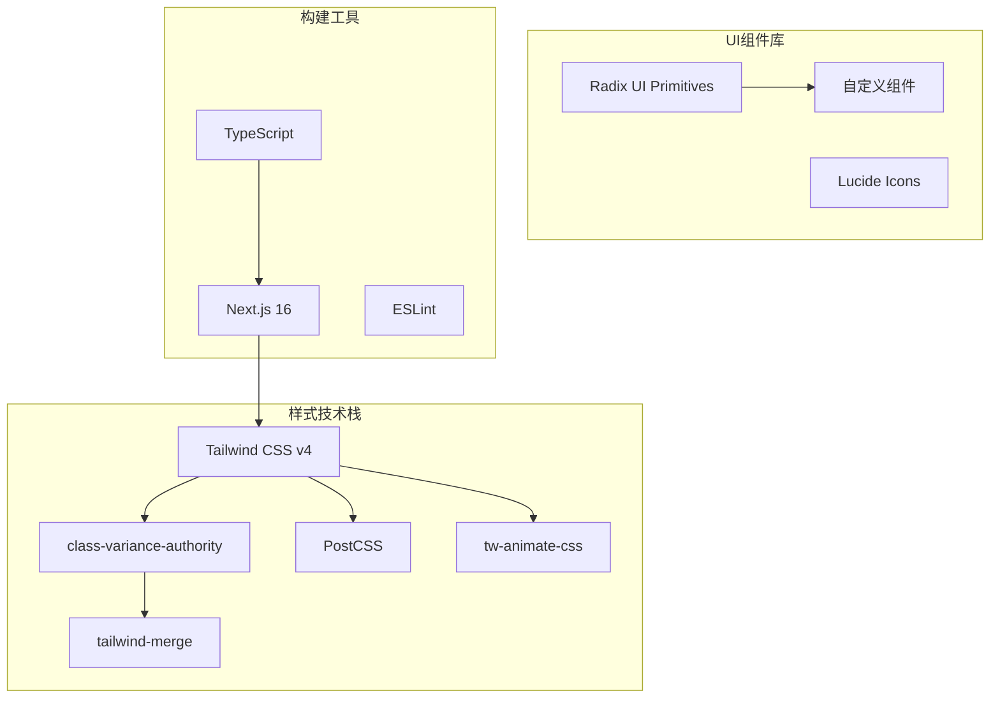

**图表来源**
- [tailwind.config.ts](file://tailwind.config.ts#L1-L39)
- [package.json](file://package.json#L12-L41)

## Tailwind CSS配置架构

### 配置文件结构

项目的核心配置位于 `tailwind.config.ts` 文件中，该文件采用了TypeScript类型安全的配置方式：

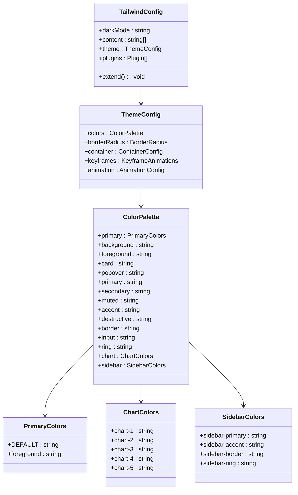

**图表来源**
- [tailwind.config.ts](file://tailwind.config.ts#L3-L38)

**章节来源**
- [tailwind.config.ts](file://tailwind.config.ts#L1-L39)

### 内容扫描配置

配置文件中的 `content` 数组定义了Tailwind需要扫描的文件范围，确保只处理实际使用的样式：

- **源码目录**: `./src/**/*.{ts,tsx}` - 扫描所有TypeScript和TypeScript JSX文件
- **组件目录**: `./components/**/*.{ts,tsx}` - 扫描独立组件文件
- **页面目录**: `./pages/**/*.{ts,tsx}` - 扫描Next.js页面文件

这种精确的扫描策略有助于优化构建性能，避免不必要的样式生成。

## 核心配置分析

### 主题扩展配置

#### 颜色系统扩展

项目在默认颜色系统基础上添加了自定义的主色调配置：

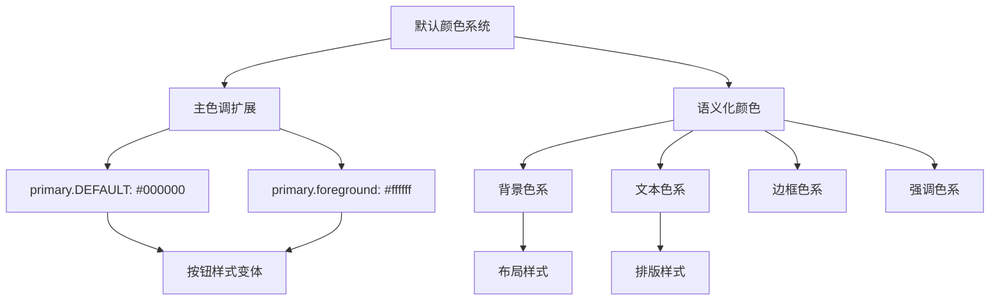

**图表来源**
- [tailwind.config.ts](file://tailwind.config.ts#L8-L12)

#### 圆角半径定制

项目扩展了默认的圆角半径配置，添加了 `xl` 尺寸：

- **默认圆角**: 继承Tailwind默认的 `rounded-lg` 等标准尺寸
- **扩展圆角**: 新增 `rounded-xl: 0.75rem` 用于特定组件的圆角需求

#### 容器配置

容器配置提供了响应式布局的基础：

- **居中对齐**: `center: true` - 默认内容居中显示
- **内边距**: `padding: "2rem"` - 提供充足的内边距空间
- **最大宽度**: `screens: { "2xl": "1400px" }` - 定义2xl屏幕的最大宽度

**章节来源**
- [tailwind.config.ts](file://tailwind.config.ts#L7-L32)

### 动画系统配置

#### 关键帧动画

项目配置了自定义的 `shimmer` 动画效果：

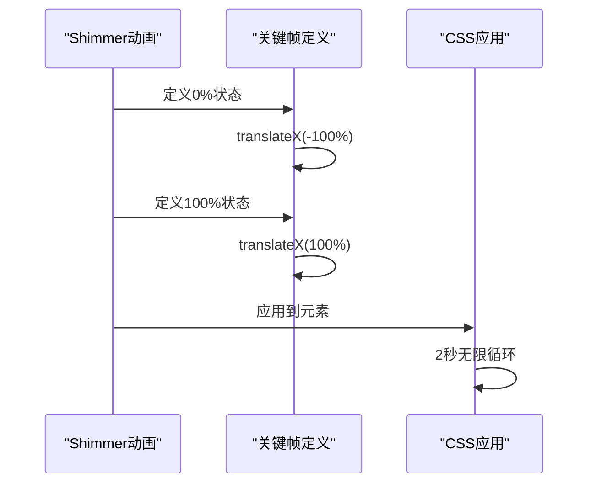

**图表来源**
- [tailwind.config.ts](file://tailwind.config.ts#L24-L32)

#### 动画配置

- **动画名称**: `shimmer` - 用于加载状态的闪烁效果
- **持续时间**: `2s` - 平滑的动画过渡
- **循环播放**: `infinite` - 持续播放的动画效果

**章节来源**
- [tailwind.config.ts](file://tailwind.config.ts#L24-L32)

## 主题系统设计

### CSS变量系统

项目采用了基于CSS自定义属性的主题系统，通过 `globals.css` 实现全局主题管理：

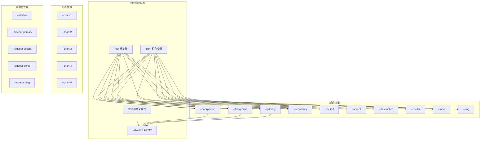

**图表来源**
- [src/app/globals.css](file://src/app/globals.css#L6-L44)
- [src/app/globals.css](file://src/app/globals.css#L46-L113)

### 颜色空间选择

项目使用OKLCH颜色空间替代传统的RGB/HEX格式：

- **OKLCH优势**: 更符合人眼感知的颜色模型，提供更好的颜色一致性
- **明度控制**: 使用 `oklch(l c h)` 格式，其中 `l` 表示亮度
- **色相保持**: `c` 表示饱和度，`h` 表示色相角度

### 暗色模式变量映射

系统为亮色和暗色模式分别定义了完整的颜色变量集：

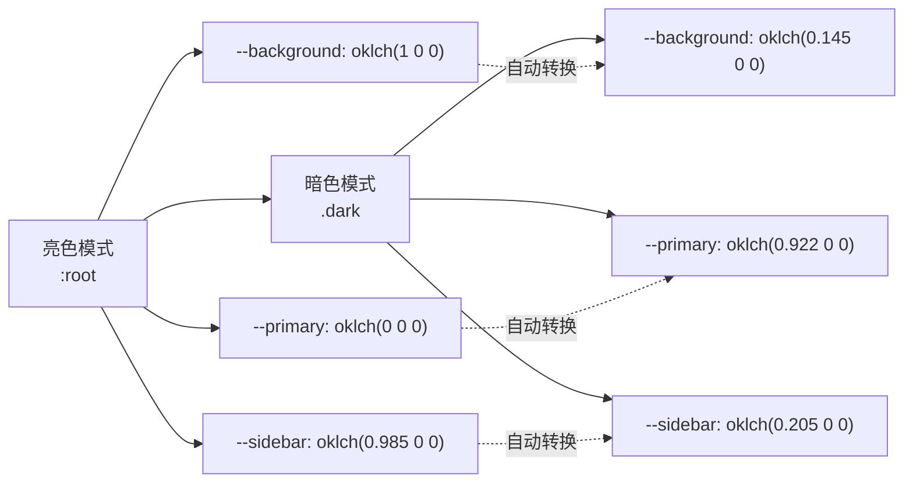

**图表来源**
- [src/app/globals.css](file://src/app/globals.css#L46-L113)

**章节来源**
- [src/app/globals.css](file://src/app/globals.css#L1-L201)

## 插件集成与扩展

### class-variance-authority集成

项目集成了class-variance-authority (CVA) 库，用于创建类型安全的组件变体系统：

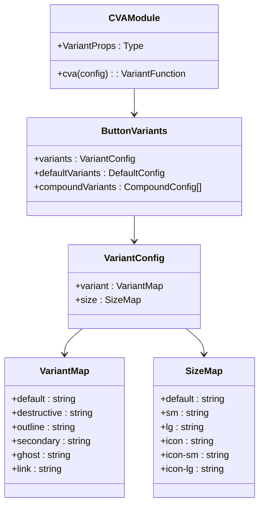

**图表来源**
- [src/components/ui/button.tsx](file://src/components/ui/button.tsx#L7-L37)

### tw-animate-css集成

项目引入了tw-animate-css插件，提供预定义的CSS动画效果：

- **动画库**: 基于Animate.css的动画集合
- **集成方式**: 通过PostCSS插件自动注入
- **使用场景**: 页面过渡、元素进入/退出动画

### tailwind-merge优化

项目使用tailwind-merge库优化类名合并：

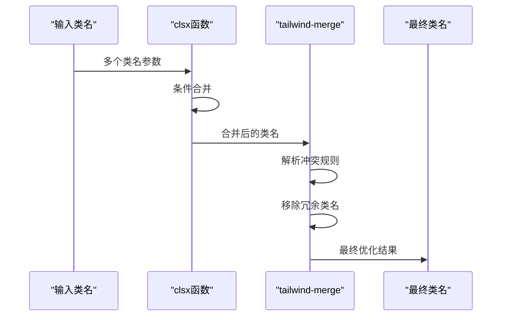

**图表来源**
- [src/lib/utils.ts](file://src/lib/utils.ts#L4-L6)

**章节来源**
- [src/components/ui/button.tsx](file://src/components/ui/button.tsx#L1-L61)
- [src/lib/utils.ts](file://src/lib/utils.ts#L1-L7)

## 设计系统一致性

### 组件样式规范

项目通过统一的样式规范确保设计系统的一致性：

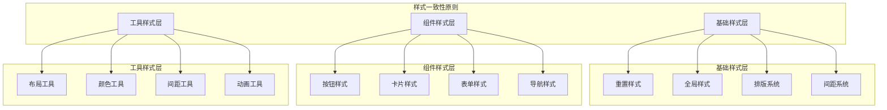

### 响应式设计策略

项目采用移动优先的响应式设计方法：

- **断点系统**: 基于Tailwind默认断点，支持移动端到桌面端的完整覆盖
- **弹性布局**: 使用Flexbox和Grid系统实现灵活的布局方案
- **间距适配**: 通过相对单位和媒体查询确保在不同设备上的良好体验

### 可访问性支持

系统内置了多种可访问性特性：

- **焦点状态**: 明确的键盘导航焦点指示
- **对比度**: 符合WCAG标准的颜色对比度
- **语义化**: 正确的HTML语义和ARIA属性
- **动画控制**: 减少动画的用户偏好支持

**章节来源**
- [src/components/ui/card.tsx](file://src/components/ui/card.tsx#L1-L93)
- [src/components/ui/switch.tsx](file://src/components/ui/switch.tsx#L1-L31)

## 暗色模式策略

### darkMode配置

项目配置了 `darkMode: "class"` 策略，通过CSS类名控制暗色模式：

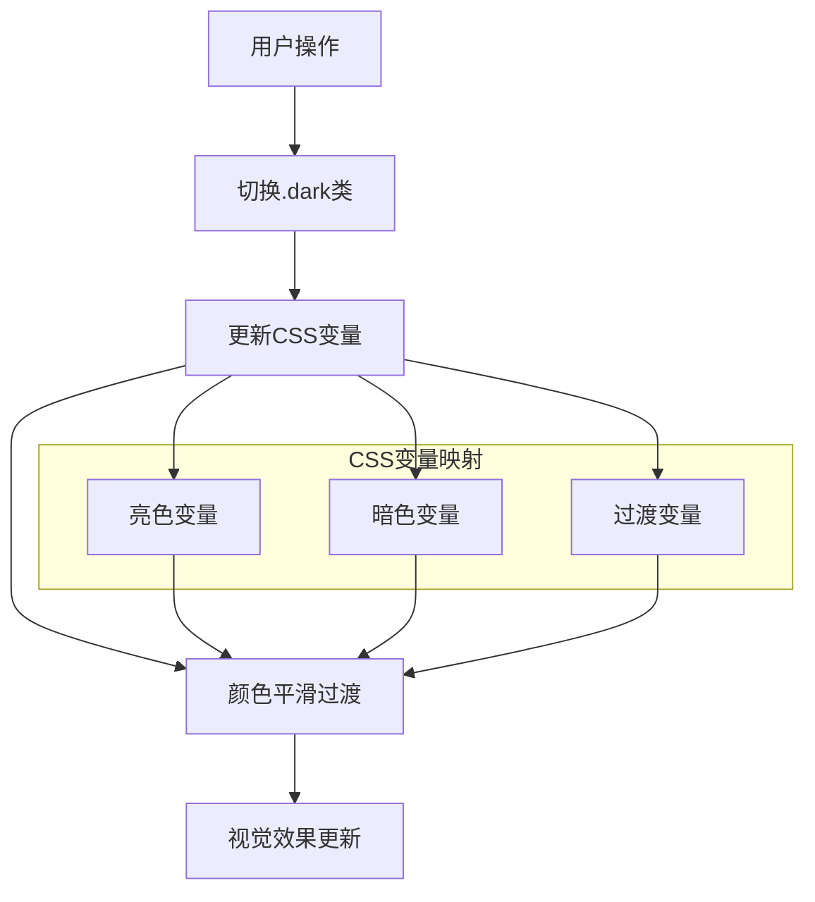

**图表来源**
- [tailwind.config.ts](file://tailwind.config.ts#L4)
- [src/app/globals.css](file://src/app/globals.css#L81-L113)

### 暗色模式实现机制

#### CSS自定义选择器

项目使用了自定义的暗色模式选择器：

```css
@custom-variant dark (&:is(.dark *));
```

这个选择器允许在暗色模式下应用特定的样式变体，而不需要重复定义整个样式规则。

#### 颜色变量系统

暗色模式通过CSS变量系统实现无缝切换：

- **变量命名**: 与亮色模式相同的变量名
- **值映射**: 自动从亮色模式变量映射到暗色模式变量
- **渐进过渡**: 利用CSS过渡效果实现平滑的颜色变化

### 动态主题切换

系统支持运行时的主题切换，无需页面刷新：

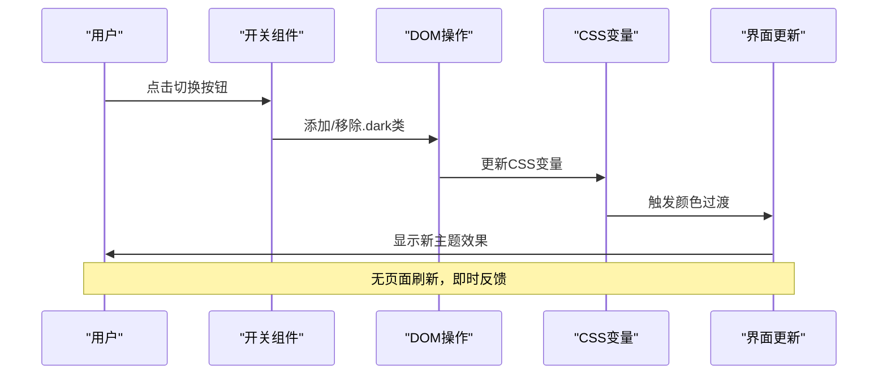

**图表来源**
- [src/components/ui/switch.tsx](file://src/components/ui/switch.tsx#L8-L30)

**章节来源**
- [tailwind.config.ts](file://tailwind.config.ts#L4)
- [src/app/globals.css](file://src/app/globals.css#L4-L5)
- [src/app/globals.css](file://src/app/globals.css#L81-L113)

## 性能优化考量

### 构建性能优化

#### 内容扫描优化

项目通过精确的内容扫描配置优化构建性能：

- **目标明确**: 只扫描实际使用的文件
- **排除冗余**: 排除测试文件和配置文件
- **增量更新**: 支持增量编译和热重载

#### CSS变量优化

CSS变量系统提供了以下性能优势：

- **内存效率**: 单一变量定义，多处复用
- **计算优化**: 浏览器原生CSS变量计算
- **缓存友好**: 变量变更不影响其他样式

### 运行时性能

#### 类名合并优化

tailwind-merge库提供了高效的类名合并算法：

- **冲突检测**: 快速识别和解决类名冲突
- **冗余移除**: 自动移除重复和冲突的类名
- **性能优化**: O(n)复杂度的合并算法

#### 动画性能

项目使用CSS硬件加速的动画：

- **transform动画**: 利用GPU加速的变换动画
- **opacity动画**: 透明度变化的高性能动画
- **复合层**: 合理使用will-change属性优化渲染

**章节来源**
- [tailwind.config.ts](file://tailwind.config.ts#L5)
- [src/lib/utils.ts](file://src/lib/utils.ts#L4-L6)

## 最佳实践指南

### 安全扩展默认主题

#### 颜色系统扩展

在扩展颜色系统时遵循以下原则：

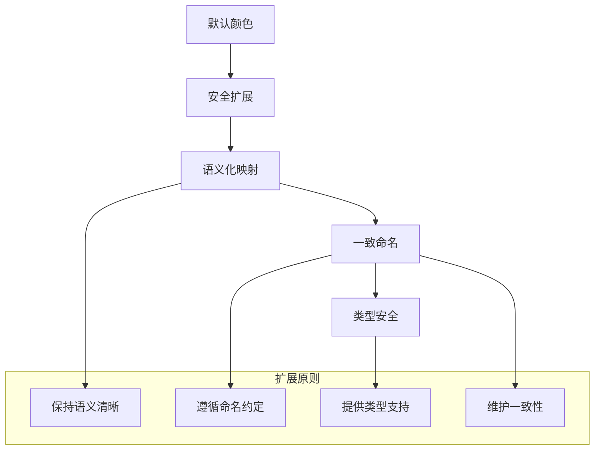

#### 圆角和间距扩展

- **圆角扩展**: 在现有系统基础上添加新的尺寸，避免完全替换
- **间距扩展**: 使用Tailwind默认的间距比例，保持视觉一致性
- **断点扩展**: 基于现有断点系统添加新的屏幕尺寸

### 与外部UI库协同工作

#### Radix UI集成

项目与Radix UI Primitives的良好集成：

- **槽位系统**: 使用data-slot属性标记组件区域
- **样式隔离**: 通过CSS变量实现样式隔离
- **主题兼容**: 支持与主设计系统的主题同步

#### 图标系统集成

- **Lucide Icons**: 使用矢量图标库提供一致的图标体验
- **尺寸标准化**: 统一的图标尺寸规范
- **颜色适配**: 图标颜色自动适应主题变化

### 组件开发最佳实践

#### 使用class-variance-authority

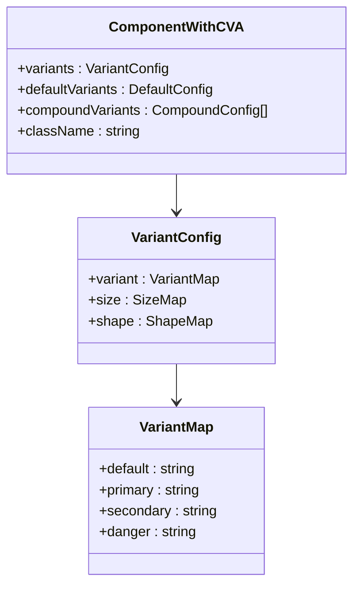

**图表来源**
- [src/components/ui/button.tsx](file://src/components/ui/button.tsx#L10-L35)

#### 样式组合模式

- **条件组合**: 使用clsx进行条件类名组合
- **默认样式**: 提供合理的默认样式
- **可扩展性**: 允许外部传入自定义样式

**章节来源**
- [src/components/ui/button.tsx](file://src/components/ui/button.tsx#L1-L61)
- [src/lib/utils.ts](file://src/lib/utils.ts#L1-L7)

## 故障排除

### 常见问题及解决方案

#### 样式不生效

**问题描述**: 自定义样式或主题变量不生效

**排查步骤**:
1. 检查CSS变量是否正确定义
2. 验证暗色模式类名是否正确添加
3. 确认PostCSS配置是否正确
4. 检查样式优先级问题

**解决方案**:
- 使用浏览器开发者工具检查CSS变量值
- 确保CSS变量在正确的选择器范围内
- 验证Tailwind配置文件的语法正确性

#### 构建性能问题

**问题描述**: Tailwind构建速度过慢

**优化措施**:
1. 精确配置content数组，避免扫描不必要的文件
2. 使用purge配置排除未使用的样式
3. 考虑使用Tailwind JIT模式
4. 优化CSS变量的使用频率

#### 暗色模式切换异常

**问题描述**: 暗色模式切换不生效或效果异常

**排查方法**:
1. 检查CSS变量的定义和命名
2. 验证暗色模式类名的添加逻辑
3. 确认CSS变量的继承关系
4. 测试不同浏览器的兼容性

**章节来源**
- [src/app/globals.css](file://src/app/globals.css#L1-L201)
- [postcss.config.mjs](file://postcss.config.mjs#L1-L7)

### 调试技巧

#### CSS变量调试

使用浏览器开发者工具的Elements面板检查CSS变量：

```css
/* 检查当前主题的变量值 */
:root {
  --background: var(--background);
  --foreground: var(--foreground);
  --primary: var(--primary);
}

/* 检查暗色模式下的变量值 */
.dark {
  --background: var(--background);
  --foreground: var(--foreground);
  --primary: var(--primary);
}
```

#### 组件样式调试

利用data-slot属性进行组件样式调试：

```html
<!-- 检查组件的各个部分 -->
<div data-slot="button">
  <div data-slot="button-icon"></div>
  <div data-slot="button-label"></div>
</div>
```

通过这些调试技巧，可以快速定位和解决样式相关的问题，确保设计系统的稳定性和一致性。