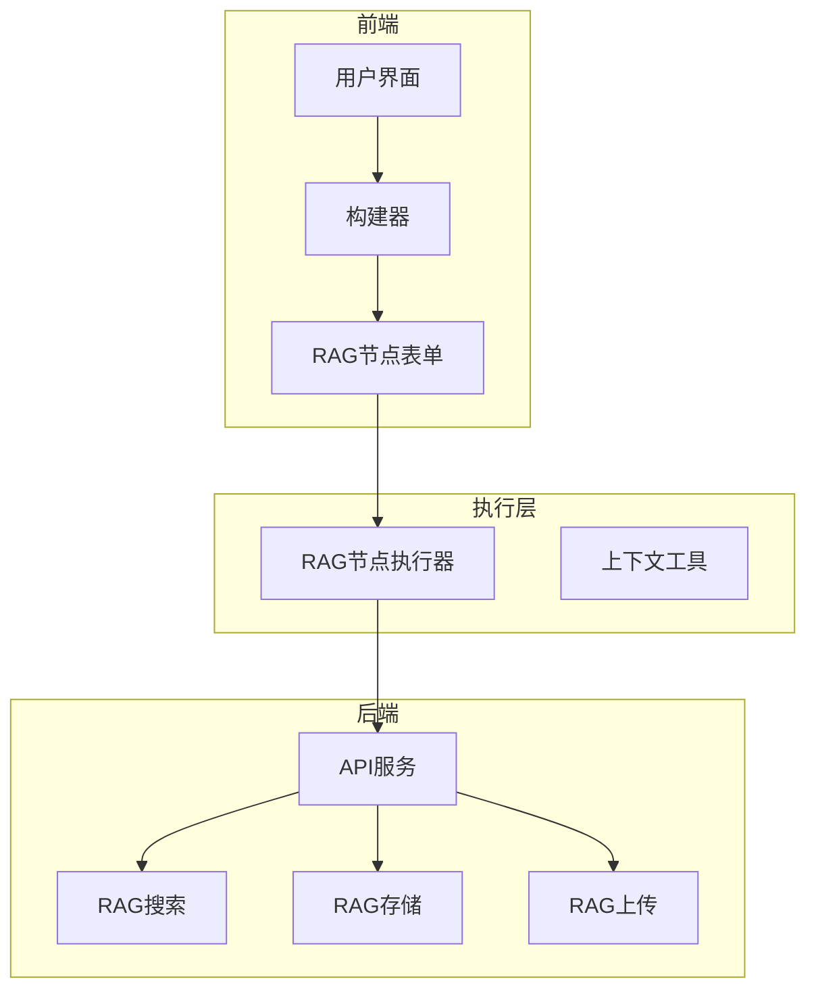
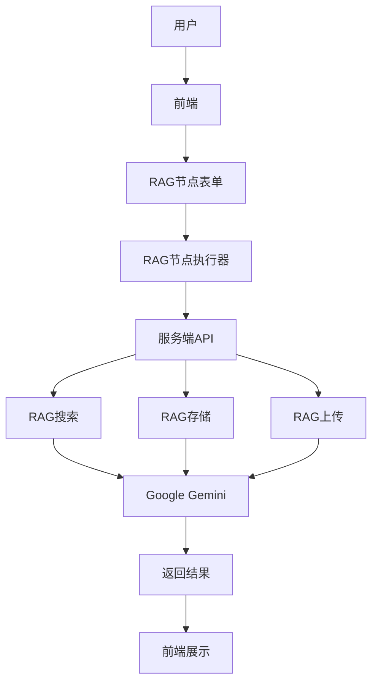
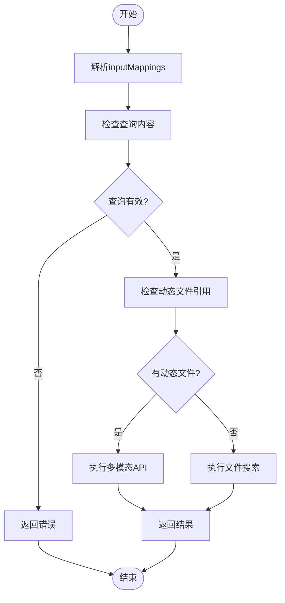
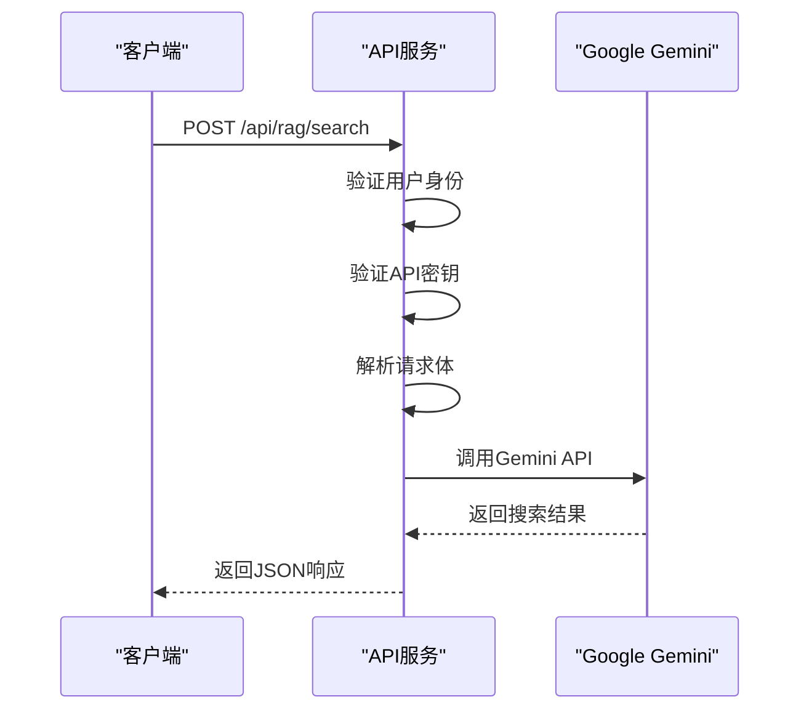
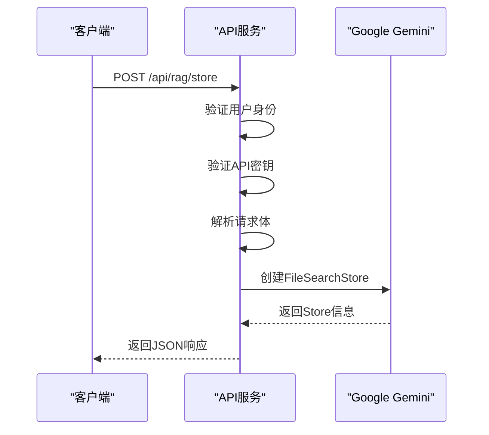
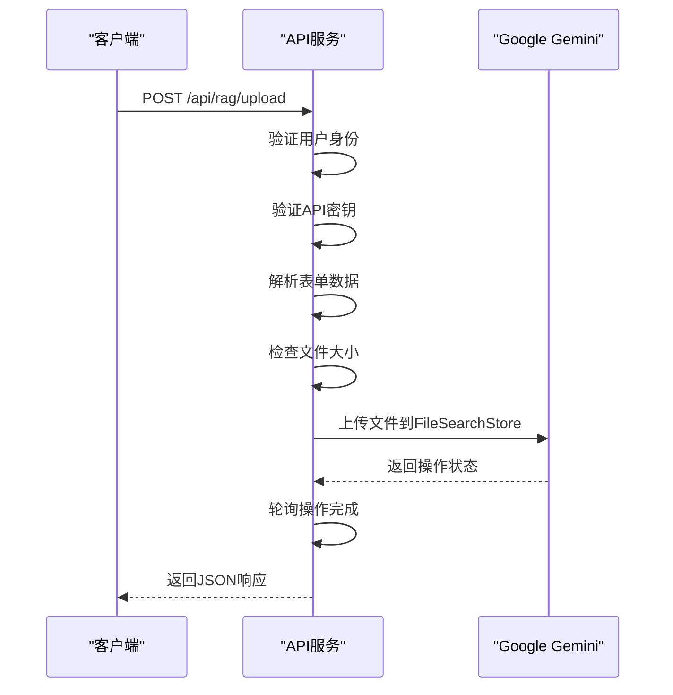
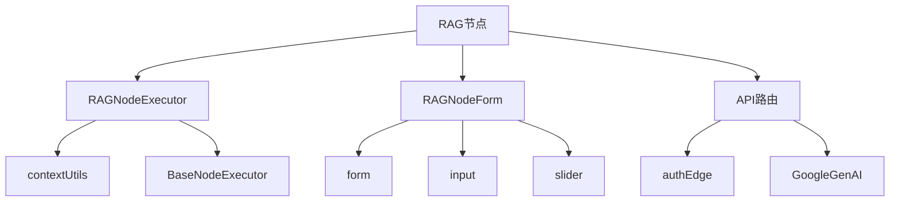

# RAG系统

<cite>
**本文档引用的文件**  
- [RAGNodeExecutor.ts](file://src/store/executors/RAGNodeExecutor.ts)
- [route.ts](file://src/app/api/rag/search/route.ts)
- [route.ts](file://src/app/api/rag/store/route.ts)
- [route.ts](file://src/app/api/rag/upload/route.ts)
- [RAGNodeForm.tsx](file://src/components/builder/node-forms/RAGNodeForm.tsx)
- [flow.ts](file://src/types/flow.ts)
- [rag节点详情.md](file://rag节点详情.md)
- [README.md](file://README.md)
</cite>

## 目录
1. [简介](#简介)
2. [项目结构](#项目结构)
3. [核心组件](#核心组件)
4. [架构概述](#架构概述)
5. [详细组件分析](#详细组件分析)
6. [依赖分析](#依赖分析)
7. [性能考虑](#性能考虑)
8. [故障排除指南](#故障排除指南)
9. [结论](#结论)

## 简介
RAG（检索增强生成）系统是Flash Flow平台中的一个关键功能，它允许用户通过自然语言描述来创建和执行复杂的工作流。该系统支持静态和动态两种模式的文档检索，利用Google Gemini的能力进行语义搜索，并能处理多种文件格式。RAG节点可以与输入、LLM、输出等其他节点无缝集成，实现从文件上传到智能问答的全流程自动化。

## 项目结构
Flash Flow项目的RAG相关组件主要分布在以下几个目录中：
- `src/app/api/rag/`：包含RAG功能的服务端API路由。
- `src/store/executors/`：包含RAG节点执行器的实现。
- `src/components/builder/node-forms/`：包含RAG节点表单的UI组件。
- `src/types/flow.ts`：定义了RAG节点的数据结构。



**图示来源**
- [RAGNodeForm.tsx](file://src/components/builder/node-forms/RAGNodeForm.tsx)
- [RAGNodeExecutor.ts](file://src/store/executors/RAGNodeExecutor.ts)
- [route.ts](file://src/app/api/rag/search/route.ts)
- [route.ts](file://src/app/api/rag/store/route.ts)
- [route.ts](file://src/app/api/rag/upload/route.ts)

**章节来源**
- [README.md](file://README.md)
- [project_structure](file://project_structure)

## 核心组件
RAG系统的核心组件包括RAG节点执行器、服务端API以及节点表单。这些组件共同协作，实现了从用户输入到文档检索再到结果输出的完整流程。

**章节来源**
- [RAGNodeExecutor.ts](file://src/store/executors/RAGNodeExecutor.ts)
- [route.ts](file://src/app/api/rag/search/route.ts)
- [RAGNodeForm.tsx](file://src/components/builder/node-forms/RAGNodeForm.tsx)

## 架构概述
RAG系统的架构分为前端、后端和执行层三个部分。前端负责用户交互和表单展示，后端提供API服务，执行层则负责具体的节点执行逻辑。



**图示来源**
- [RAGNodeForm.tsx](file://src/components/builder/node-forms/RAGNodeForm.tsx)
- [RAGNodeExecutor.ts](file://src/store/executors/RAGNodeExecutor.ts)
- [route.ts](file://src/app/api/rag/search/route.ts)
- [route.ts](file://src/app/api/rag/store/route.ts)
- [route.ts](file://src/app/api/rag/upload/route.ts)

## 详细组件分析
### RAG节点执行器分析
RAG节点执行器是RAG系统的核心逻辑部分，负责解析输入、选择执行模式并调用相应的API。

#### 类图
```mermaid
classDiagram
class RAGNodeExecutor {
+execute(node : AppNode, context : FlowContext, mockData? : Record<string, unknown>) : Promise~ExecutionResult~
-resolveQuery(queryTemplate : string | undefined, context : FlowContext) : string
-resolveDynamicFiles(filesTemplate : string | undefined, context : FlowContext) : { name : string; url : string; type? : string }[] | null
-executeWithMultimodal(query : string, files : { name : string; url : string; type? : string }[]) : Promise~Record<string, unknown>~
-executeWithFileSearch(query : string, ragData : RAGNodeData) : Promise~Record<string, unknown>~
}
RAGNodeExecutor --|> BaseNodeExecutor : 继承
```

**图示来源**
- [RAGNodeExecutor.ts](file://src/store/executors/RAGNodeExecutor.ts)

#### 执行流程


**图示来源**
- [RAGNodeExecutor.ts](file://src/store/executors/RAGNodeExecutor.ts)

**章节来源**
- [RAGNodeExecutor.ts](file://src/store/executors/RAGNodeExecutor.ts)

### 服务端API分析
服务端API提供了RAG功能的三个主要接口：搜索、创建存储和上传文件。

#### 搜索API


**图示来源**
- [route.ts](file://src/app/api/rag/search/route.ts)

#### 创建存储API


**图示来源**
- [route.ts](file://src/app/api/rag/store/route.ts)

#### 上传文件API


**图示来源**
- [route.ts](file://src/app/api/rag/upload/route.ts)

**章节来源**
- [route.ts](file://src/app/api/rag/search/route.ts)
- [route.ts](file://src/app/api/rag/store/route.ts)
- [route.ts](file://src/app/api/rag/upload/route.ts)

## 依赖分析
RAG系统依赖于多个外部服务和内部组件，确保了其功能的完整性和可靠性。



**图示来源**
- [RAGNodeExecutor.ts](file://src/store/executors/RAGNodeExecutor.ts)
- [RAGNodeForm.tsx](file://src/components/builder/node-forms/RAGNodeForm.tsx)
- [route.ts](file://src/app/api/rag/search/route.ts)
- [route.ts](file://src/app/api/rag/store/route.ts)
- [route.ts](file://src/app/api/rag/upload/route.ts)

**章节来源**
- [RAGNodeExecutor.ts](file://src/store/executors/RAGNodeExecutor.ts)
- [RAGNodeForm.tsx](file://src/components/builder/node-forms/RAGNodeForm.tsx)
- [route.ts](file://src/app/api/rag/search/route.ts)
- [route.ts](file://src/app/api/rag/store/route.ts)
- [route.ts](file://src/app/api/rag/upload/route.ts)

## 性能考虑
RAG系统在设计时充分考虑了性能因素，特别是在文件上传和搜索响应时间方面。通过使用边缘运行时（edge runtime）和节点运行时（nodejs runtime）的合理分配，优化了不同操作的执行效率。此外，系统还实现了超时机制和错误处理，以确保在高负载情况下的稳定运行。

## 故障排除指南
当RAG系统出现问题时，可以从以下几个方面进行排查：
1. **API密钥配置**：确保Gemini API密钥已正确配置。
2. **文件大小限制**：检查上传的文件是否超过100MB的限制。
3. **网络连接**：确认客户端与服务器之间的网络连接正常。
4. **权限验证**：确保用户已通过身份验证。
5. **日志查看**：检查服务端日志，查找具体的错误信息。

**章节来源**
- [route.ts](file://src/app/api/rag/search/route.ts)
- [route.ts](file://src/app/api/rag/store/route.ts)
- [route.ts](file://src/app/api/rag/upload/route.ts)

## 结论
RAG系统作为Flash Flow平台的重要组成部分，为用户提供了一种高效、便捷的方式来创建和执行基于文档检索的工作流。通过静态和动态两种模式的支持，结合强大的前端UI和可靠的后端服务，RAG系统能够满足各种复杂场景的需求。未来，可以通过进一步优化搜索算法和增加更多文件格式支持，提升系统的整体性能和用户体验。