# 可视化构建系统深度解析

<cite>
**本文档引用的文件**
- [FlowCanvas.tsx](file://src/components/flow/FlowCanvas.tsx)
- [LaunchCard.tsx](file://src/components/builder/LaunchCard.tsx)
- [flowStore.ts](file://src/store/flowStore.ts)
- [CustomNode.tsx](file://src/components/flow/CustomNode.tsx)
- [nodeActions.ts](file://src/store/actions/nodeActions.ts)
- [edgeActions.ts](file://src/store/actions/edgeActions.ts)
- [cycleDetection.ts](file://src/store/utils/cycleDetection.ts)
- [layoutAlgorithm.ts](file://src/store/utils/layoutAlgorithm.ts)
- [initialState.ts](file://src/store/constants/initialState.ts)
- [ControlDock.tsx](file://src/components/builder/ControlDock.tsx)
- [BrainBar.tsx](file://src/components/builder/BrainBar.tsx)
- [page.tsx](file://src/app/builder/page.tsx)
- [nodeDefaults.ts](file://src/store/utils/nodeDefaults.ts)
- [ContextHUD.tsx](file://src/components/builder/ContextHUD.tsx)
- [Sidebar.tsx](file://src/components/flow/Sidebar.tsx)
- [flow.ts](file://src/types/flow.ts)
</cite>

## 目录
1. [系统概述](#系统概述)
2. [核心架构设计](#核心架构设计)
3. [FlowCanvas组件详解](#flowcanvas组件详解)
4. [LaunchCard组件分析](#launchcard组件分析)
5. [Zustand状态管理系统](#zustand状态管理系统)
6. [节点注册与拖拽机制](#节点注册与拖拽机制)
7. [交互模式与事件处理](#交互模式与事件处理)
8. [循环检测与自动布局](#循环检测与自动布局)
9. [常见问题解决方案](#常见问题解决方案)
10. [总结](#总结)

## 系统概述

Flash Flow是一个基于React和TypeScript构建的可视化工作流构建系统，采用现代化的前端技术栈，提供了完整的流程设计、编辑和部署能力。系统的核心特色包括：

- **基于@xyflow/react的画布引擎**：提供强大的节点拖拽、连接和布局功能
- **Zustand状态管理**：轻量级的状态管理方案，确保UI与业务逻辑的实时同步
- **智能节点系统**：支持多种类型的节点（输入、LLM、RAG、HTTP、输出等）
- **AI驱动的流程生成**：内置Copilot功能，支持自然语言生成和修改流程
- **实时预览与调试**：提供完整的开发和调试体验

## 核心架构设计

系统采用分层架构设计，清晰分离表现层、业务逻辑层和数据层：

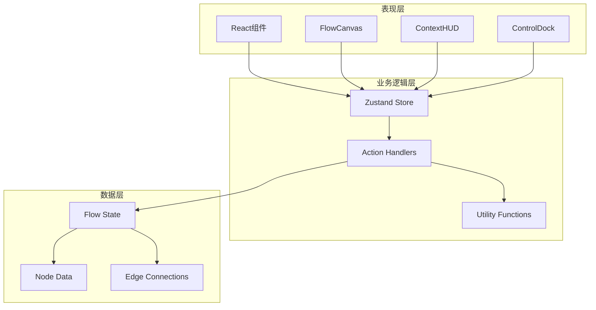

**图表来源**
- [FlowCanvas.tsx](file://src/components/flow/FlowCanvas.tsx#L1-L82)
- [flowStore.ts](file://src/store/flowStore.ts#L1-L131)
- [ContextHUD.tsx](file://src/components/builder/ContextHUD.tsx#L1-L317)

**章节来源**
- [FlowCanvas.tsx](file://src/components/flow/FlowCanvas.tsx#L1-L82)
- [flowStore.ts](file://src/store/flowStore.ts#L1-L131)
- [page.tsx](file://src/app/builder/page.tsx#L1-L208)

## FlowCanvas组件详解

FlowCanvas是整个可视化构建系统的核心画布组件，基于@xyflow/react构建，提供了完整的节点画布功能。

### 组件架构与功能

FlowCanvas组件实现了以下核心功能：

1. **节点渲染与管理**：使用自定义节点类型渲染不同类型的节点
2. **拖拽添加节点**：支持从侧边栏拖拽节点到画布
3. **连接边管理**：提供直观的节点间连接功能
4. **交互模式控制**：支持选择模式和平移模式的切换
5. **背景网格显示**：提供视觉参考网格

### 核心实现细节

```mermaid
classDiagram
class FlowCanvas {
+nodes : AppNode[]
+edges : AppEdge[]
+interactionMode : "select" | "pan"
+onNodesChange(changes)
+onEdgesChange(changes)
+onConnect(connection)
+onDragOver(event)
+onDrop(event)
+setSelectedNode(id)
+addNode(type, position)
}
class CustomNode {
+id : string
+type : NodeKind
+data : AppNodeData
+position : {x, y}
+render()
}
class ReactFlow {
+nodes : Node[]
+edges : Edge[]
+nodeTypes : object
+onNodesChange()
+onEdgesChange()
+onConnect()
+fitView()
+panOnScroll()
+selectionMode()
}
FlowCanvas --> ReactFlow : "封装"
ReactFlow --> CustomNode : "渲染"
FlowCanvas --> CustomNode : "管理"
```

**图表来源**
- [FlowCanvas.tsx](file://src/components/flow/FlowCanvas.tsx#L10-L18)
- [CustomNode.tsx](file://src/components/flow/CustomNode.tsx#L29-L187)

### 拖拽机制实现

系统通过HTML5 Drag and Drop API实现节点的拖拽添加功能：

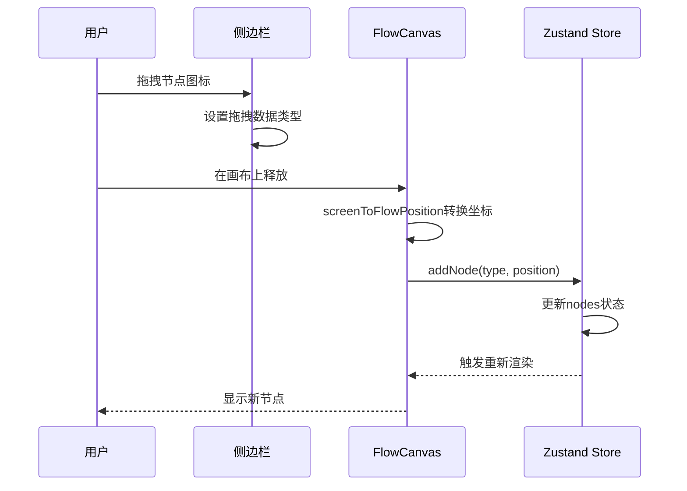

**图表来源**
- [FlowCanvas.tsx](file://src/components/flow/FlowCanvas.tsx#L23-L36)
- [Sidebar.tsx](file://src/components/flow/Sidebar.tsx#L8-L28)

**章节来源**
- [FlowCanvas.tsx](file://src/components/flow/FlowCanvas.tsx#L1-L82)
- [Sidebar.tsx](file://src/components/flow/Sidebar.tsx#L1-L98)

## LaunchCard组件分析

LaunchCard组件负责在流程构建完成后显示应用启动入口，提供了流畅的用户体验和明确的行动指引。

### 组件功能特性

1. **状态监控**：监听流程执行状态，仅在"completed"状态下显示
2. **动画效果**：使用Framer Motion实现平滑的进入和退出动画
3. **应用启动**：提供一键跳转到应用页面的功能
4. **视觉反馈**：通过渐变背景和阴影效果提升视觉层次感

### 实现原理

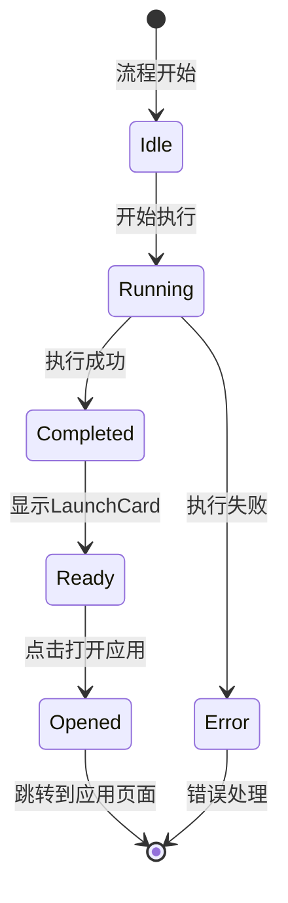

**图表来源**
- [LaunchCard.tsx](file://src/components/builder/LaunchCard.tsx#L8-L56)
- [flowStore.ts](file://src/store/flowStore.ts#L34-L46)

### 状态同步机制

LaunchCard通过Zustand状态管理实现实时的状态同步：

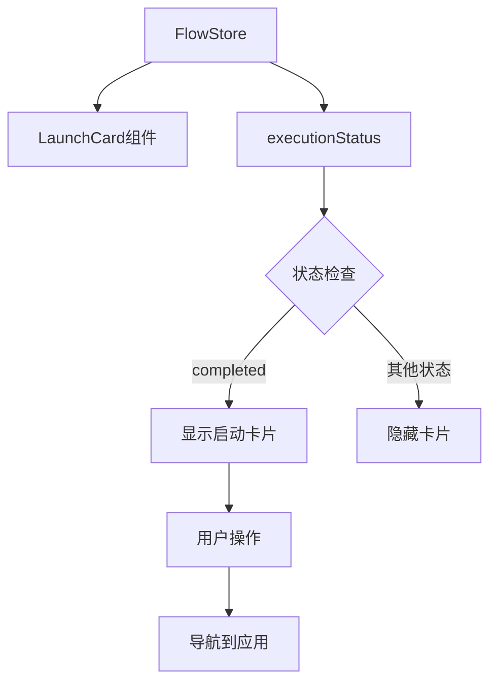

**图表来源**
- [LaunchCard.tsx](file://src/components/builder/LaunchCard.tsx#L9-L15)
- [flowStore.ts](file://src/store/flowStore.ts#L116-L126)

**章节来源**
- [LaunchCard.tsx](file://src/components/builder/LaunchCard.tsx#L1-L56)
- [flowStore.ts](file://src/store/flowStore.ts#L116-L126)

## Zustand状态管理系统

系统采用Zustand作为状态管理解决方案，通过模块化的action设计实现了清晰的状态管理架构。

### 状态结构设计

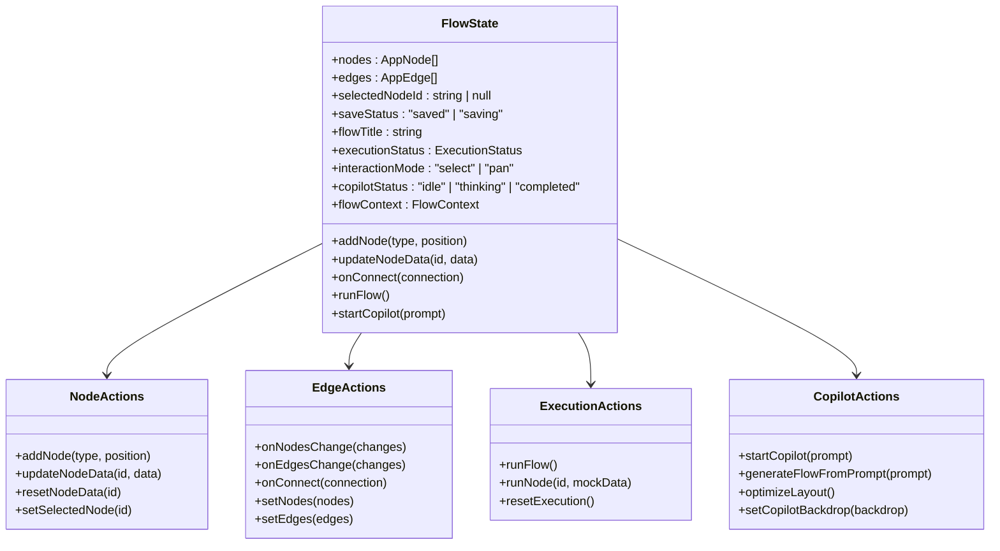

**图表来源**
- [flowStore.ts](file://src/store/flowStore.ts#L17-L131)
- [flow.ts](file://src/types/flow.ts#L84-L153)

### 状态更新流程

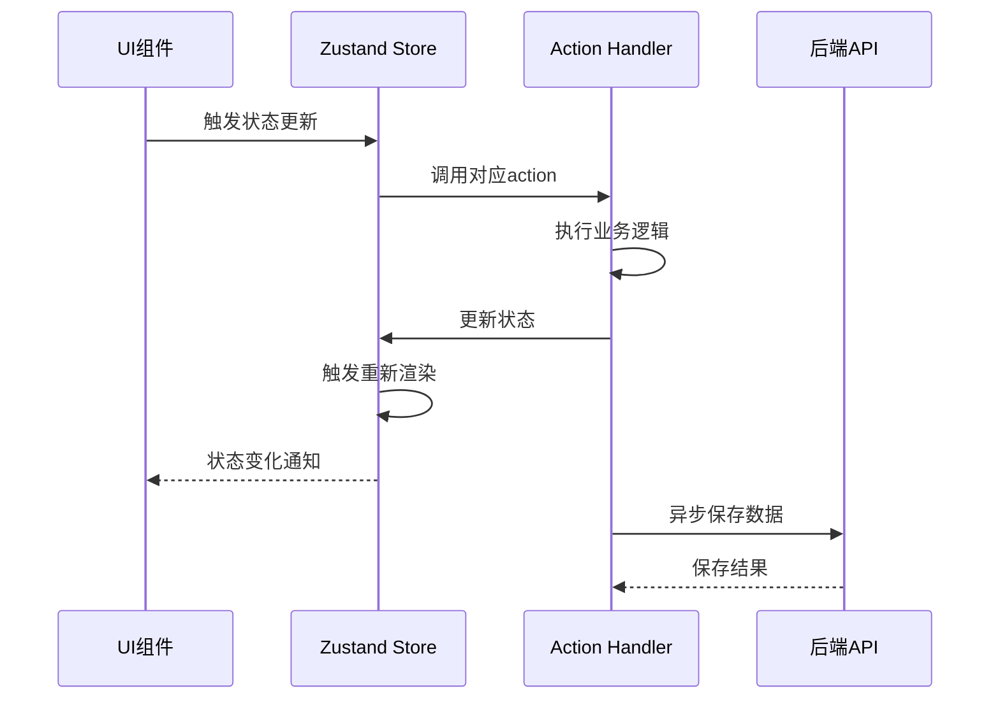

**图表来源**
- [flowStore.ts](file://src/store/flowStore.ts#L17-L131)
- [nodeActions.ts](file://src/store/actions/nodeActions.ts#L5-L93)

### 数据持久化机制

系统实现了智能的自动保存机制，确保用户数据的安全性：

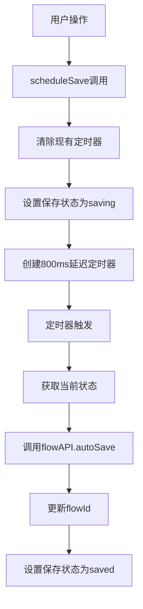

**图表来源**
- [flowStore.ts](file://src/store/flowStore.ts#L50-L74)

**章节来源**
- [flowStore.ts](file://src/store/flowStore.ts#L1-L131)
- [initialState.ts](file://src/store/constants/initialState.ts#L1-L32)

## 节点注册与拖拽机制

系统通过模块化的设计实现了灵活的节点注册和拖拽机制，支持多种节点类型的动态添加。

### 节点类型系统

系统定义了六种核心节点类型，每种类型都有特定的数据结构和行为：

| 节点类型 | 功能描述 | 默认配置 | 特殊属性 |
|---------|---------|---------|---------|
| input | 输入节点 | 文本输入框 | 支持多行文本 |
| llm | 大语言模型节点 | 豆包模型，温度0.7 | 支持系统提示词 |
| rag | 知识检索节点 | 无文件 | 支持文件上传 |
| output | 输出节点 | 文本输出框 | 支持格式化输出 |
| http | HTTP请求节点 | GET方法，空URL | 支持多种HTTP方法 |
| branch | 分支节点 | 无特殊配置 | 支持条件判断 |

### 拖拽注册流程

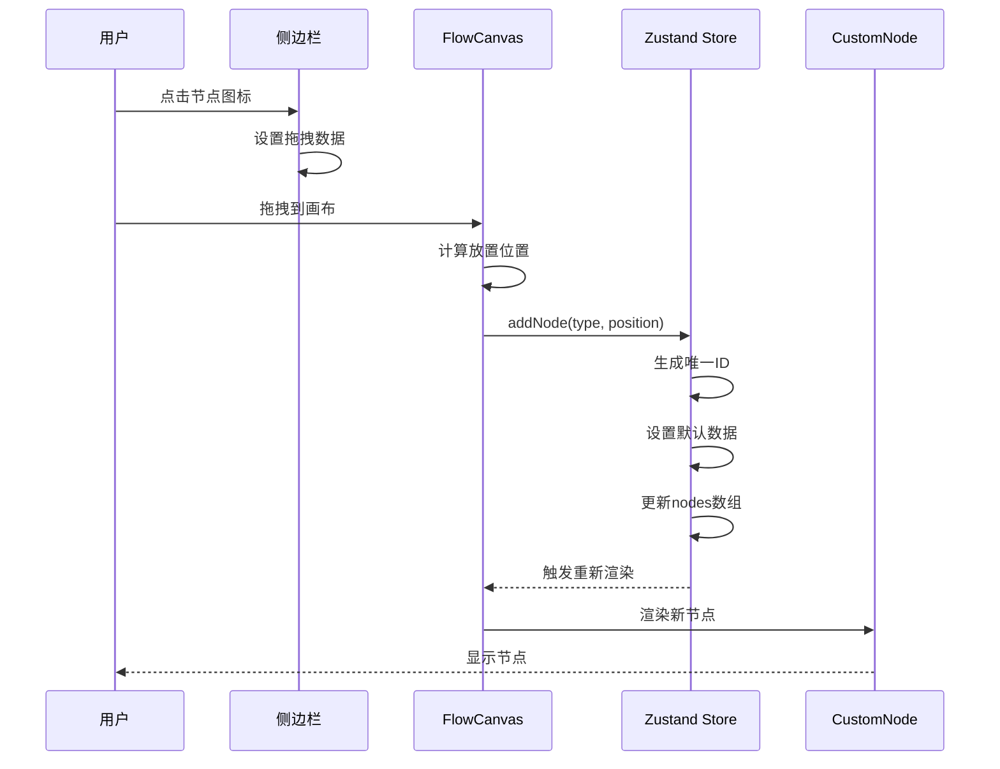

**图表来源**
- [nodeActions.ts](file://src/store/actions/nodeActions.ts#L5-L20)
- [Sidebar.tsx](file://src/components/flow/Sidebar.tsx#L8-L28)

### 节点验证机制

系统实现了严格的节点数据验证，确保数据的完整性和正确性：

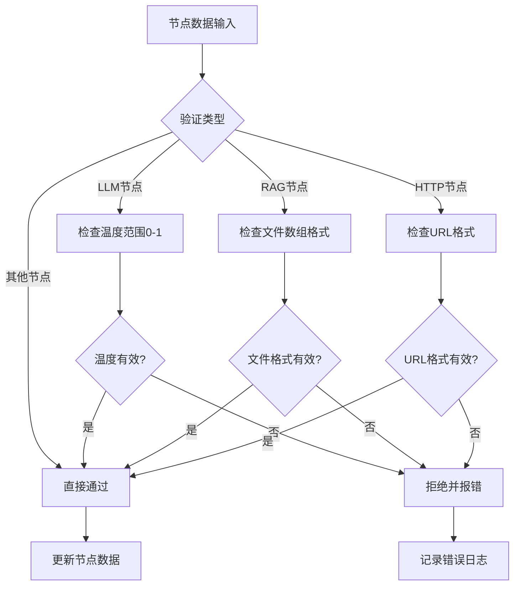

**图表来源**
- [nodeActions.ts](file://src/store/actions/nodeActions.ts#L25-L67)
- [nodeDefaults.ts](file://src/store/utils/nodeDefaults.ts#L6-L16)

**章节来源**
- [nodeActions.ts](file://src/store/actions/nodeActions.ts#L1-L93)
- [nodeDefaults.ts](file://src/store/utils/nodeDefaults.ts#L1-L17)
- [Sidebar.tsx](file://src/components/flow/Sidebar.tsx#L1-L98)

## 交互模式与事件处理

系统提供了两种主要的交互模式："选择模式"和"平移模式"，并通过智能的事件处理机制确保流畅的用户体验。

### 交互模式切换

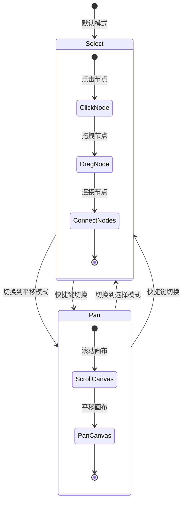

**图表来源**
- [ControlDock.tsx](file://src/components/builder/ControlDock.tsx#L56-L88)
- [FlowCanvas.tsx](file://src/components/flow/FlowCanvas.tsx#L52-L57)

### 事件处理架构

系统通过分层的事件处理架构实现了复杂的交互逻辑：

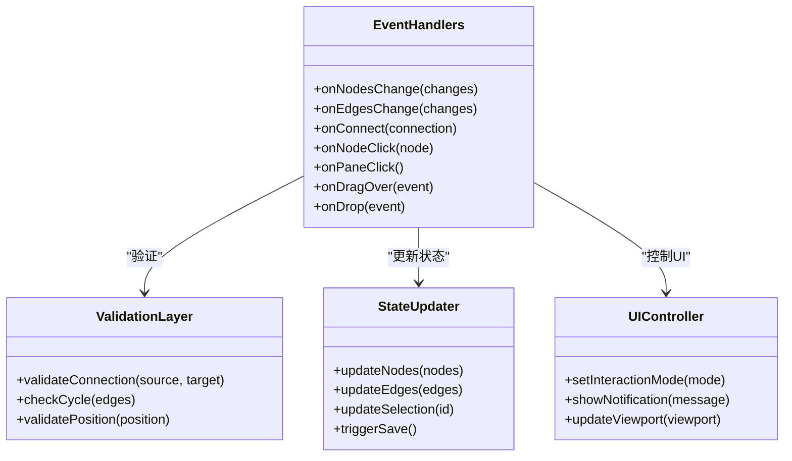

**图表来源**
- [edgeActions.ts](file://src/store/actions/edgeActions.ts#L12-L80)
- [FlowCanvas.tsx](file://src/components/flow/FlowCanvas.tsx#L44-L51)

### 连接边验证机制

系统实现了多层次的连接验证，确保流程的正确性：

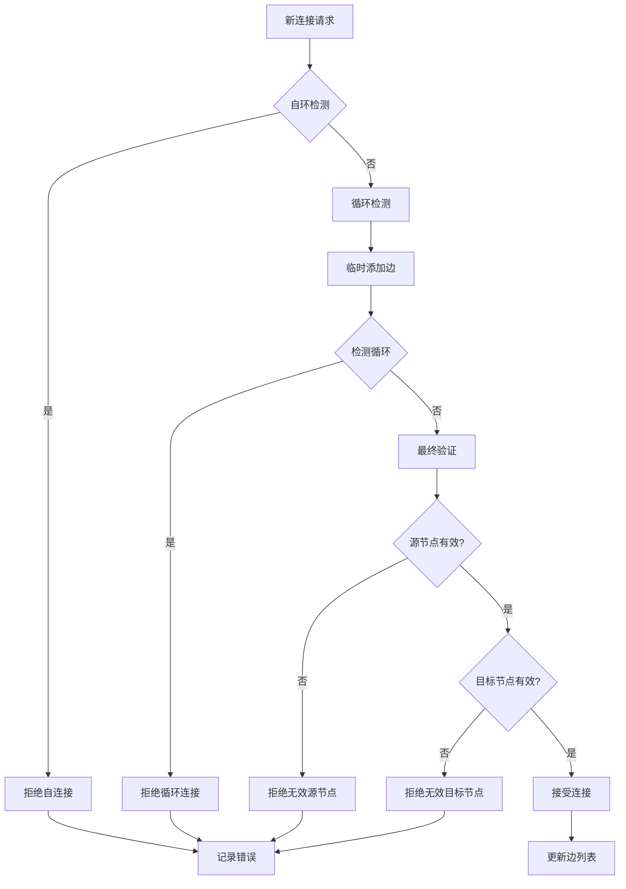

**图表来源**
- [edgeActions.ts](file://src/store/actions/edgeActions.ts#L46-L67)
- [cycleDetection.ts](file://src/store/utils/cycleDetection.ts#L13-L33)

**章节来源**
- [ControlDock.tsx](file://src/components/builder/ControlDock.tsx#L1-L228)
- [FlowCanvas.tsx](file://src/components/flow/FlowCanvas.tsx#L23-L51)
- [edgeActions.ts](file://src/store/actions/edgeActions.ts#L1-L80)

## 循环检测与自动布局

系统集成了先进的算法来确保流程的正确性和美观性，包括循环检测和自动布局功能。

### 循环检测算法

系统使用深度优先搜索(DFS)算法来检测流程中的循环依赖：

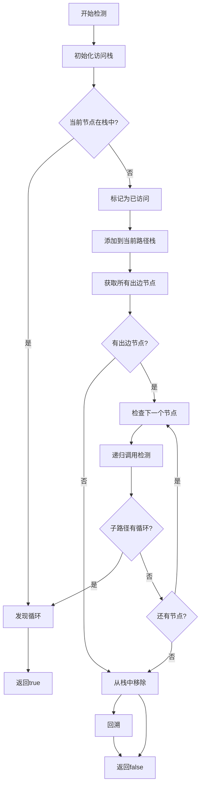

**图表来源**
- [cycleDetection.ts](file://src/store/utils/cycleDetection.ts#L13-L33)

### 自动布局算法

系统采用Dagre算法实现智能的节点布局，支持水平和垂直两种布局方向：

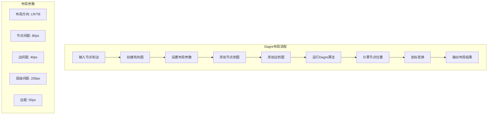

**图表来源**
- [layoutAlgorithm.ts](file://src/store/utils/layoutAlgorithm.ts#L11-L67)

### 布局算法对比

| 布局类型 | 方向 | 适用场景 | 优势 | 参数配置 |
|---------|------|---------|------|---------|
| 水平布局(LR) | 左到右 | 标准流程设计 | 节点紧凑排列，适合长流程 | ranksep: 200, nodesep: 80 |
| 垂直布局(TB) | 上到下 | 分支较多的流程 | 减少横向空间占用 | ranksep: 150, nodesep: 80 |

**章节来源**
- [cycleDetection.ts](file://src/store/utils/cycleDetection.ts#L1-L34)
- [layoutAlgorithm.ts](file://src/store/utils/layoutAlgorithm.ts#L1-L120)

## 常见问题解决方案

在实际使用过程中，用户可能遇到各种问题，系统提供了完善的解决方案。

### 节点重叠问题

**问题描述**：多个节点放置在同一位置导致无法区分

**解决方案**：
1. **自动偏移**：系统会自动为新添加的节点计算偏移位置
2. **手动调整**：通过拖拽移动节点位置
3. **布局优化**：使用自动布局功能重新排列节点

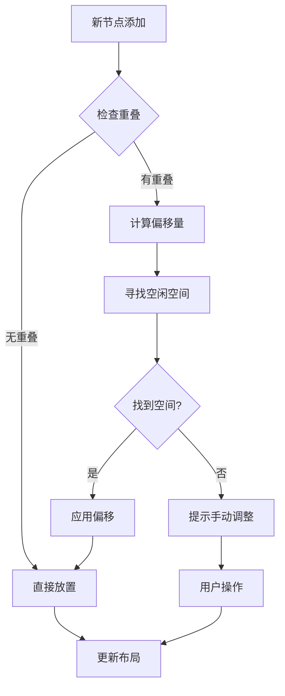

### 连接失败问题

**问题描述**：尝试连接节点时出现连接失败的情况

**常见原因及解决**：
1. **自环连接**：节点不能连接到自身
   - 解决：避免直接连接同一节点
   - 提示：系统会自动检测并拒绝自环连接

2. **循环依赖**：连接会导致流程循环
   - 解决：系统会自动检测循环并拒绝连接
   - 提示：可以通过重新设计流程避免循环

3. **无效连接**：源节点或目标节点不存在
   - 解决：检查节点是否被删除或移动
   - 提示：系统会验证连接的有效性

### 性能优化策略

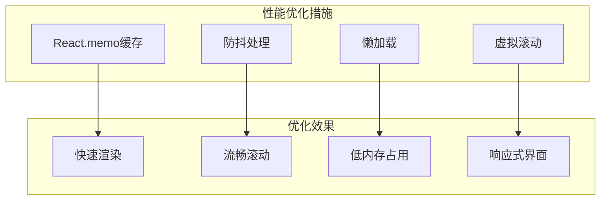

### 调试与故障排除

系统提供了完整的调试工具和故障排除机制：

1. **节点调试**：支持单个节点的独立调试
2. **执行历史**：查看节点的执行历史和输出
3. **错误追踪**：详细的错误信息和堆栈跟踪
4. **状态检查**：实时查看流程状态和数据流

**章节来源**
- [edgeActions.ts](file://src/store/actions/edgeActions.ts#L46-L67)
- [layoutAlgorithm.ts](file://src/store/utils/layoutAlgorithm.ts#L11-L67)
- [ContextHUD.tsx](file://src/components/builder/ContextHUD.tsx#L298-L316)

## 总结

Flash Flow可视化构建系统通过精心设计的架构和丰富的功能特性，为用户提供了强大而易用的工作流设计体验。系统的核心优势包括：

### 技术优势
- **现代化技术栈**：基于React、TypeScript和Zustand，确保代码质量和开发效率
- **高性能渲染**：通过React.memo和优化的事件处理机制保证流畅的用户体验
- **智能算法集成**：循环检测和自动布局算法确保流程的正确性和美观性

### 功能特色
- **直观的可视化界面**：FlowCanvas提供直观的节点拖拽和连接功能
- **丰富的节点类型**：支持输入、输出、LLM、RAG、HTTP等多种节点类型
- **AI驱动的流程生成**：BrainBar提供自然语言生成和修改流程的能力
- **实时状态同步**：Zustand状态管理确保UI与业务逻辑的实时同步

### 用户体验
- **流畅的交互**：支持拖拽、连接、缩放等多种交互方式
- **智能的辅助功能**：自动布局、循环检测等辅助功能提升使用效率
- **完善的调试工具**：提供节点调试、执行历史等调试功能

该系统不仅满足了专业开发者的需求，也为普通用户提供了易于上手的可视化编程体验，是现代Web应用开发的理想选择。