# 画布交互

<cite>
**本文档引用的文件**
- [FlowCanvas.tsx](file://src/components/flow/FlowCanvas.tsx)
- [flowStore.ts](file://src/store/flowStore.ts)
- [flow.ts](file://src/types/flow.ts)
- [nodeActions.ts](file://src/store/actions/nodeActions.ts)
- [initialState.ts](file://src/store/constants/initialState.ts)
- [ControlDock.tsx](file://src/components/builder/ControlDock.tsx)
- [Sidebar.tsx](file://src/components/flow/Sidebar.tsx)
- [layoutAlgorithm.ts](file://src/store/utils/layoutAlgorithm.ts)
- [cycleDetection.ts](file://src/store/utils/cycleDetection.ts)
- [FlowErrorBoundary.tsx](file://src/components/FlowErrorBoundary.tsx)
</cite>

## 目录
1. [简介](#简介)
2. [项目结构概览](#项目结构概览)
3. [核心组件架构](#核心组件架构)
4. [Zustand状态管理集成](#zustand状态管理集成)
5. [交互行为配置详解](#交互行为配置详解)
6. [坐标转换与事件处理](#坐标转换与事件处理)
7. [背景网格渲染配置](#背景网格渲染配置)
8. [连接线样式定义](#连接线样式定义)
9. [视图适配机制](#视图适配机制)
10. [性能优化策略](#性能优化策略)
11. [故障排除指南](#故障排除指南)
12. [总结](#总结)

## 简介

FlowCanvas是Flash Flow SaaS平台的核心可视化画布组件，基于@xyflow/react构建，提供了强大的图形化工作流编辑功能。该组件通过Zustand状态管理系统实现了复杂的状态同步，支持拖拽添加节点、平移缩放、选择操作等多种交互行为，并具备完善的错误处理和性能优化机制。

## 项目结构概览

FlowCanvas组件在项目中的组织结构体现了清晰的分层架构设计：

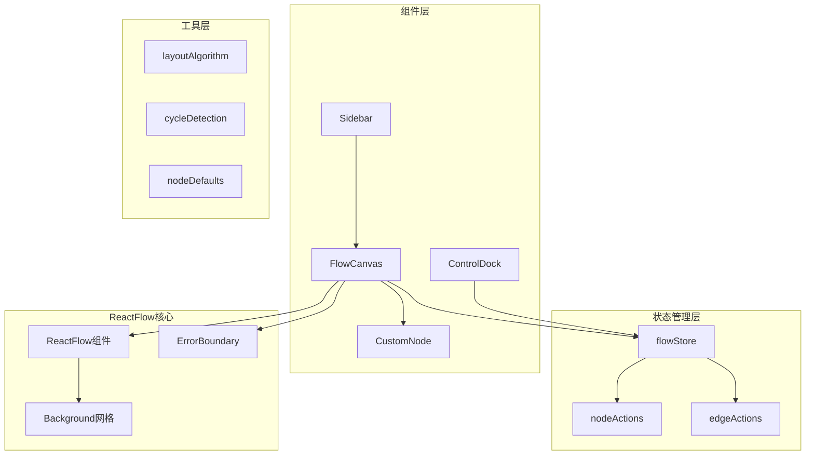

**图表来源**
- [FlowCanvas.tsx](file://src/components/flow/FlowCanvas.tsx#L1-L82)
- [flowStore.ts](file://src/store/flowStore.ts#L1-L131)
- [ControlDock.tsx](file://src/components/builder/ControlDock.tsx#L1-L91)

**章节来源**
- [FlowCanvas.tsx](file://src/components/flow/FlowCanvas.tsx#L1-L82)
- [flowStore.ts](file://src/store/flowStore.ts#L1-L131)

## 核心组件架构

FlowCanvas作为整个画布系统的核心入口，采用了现代化的React函数式组件设计模式：

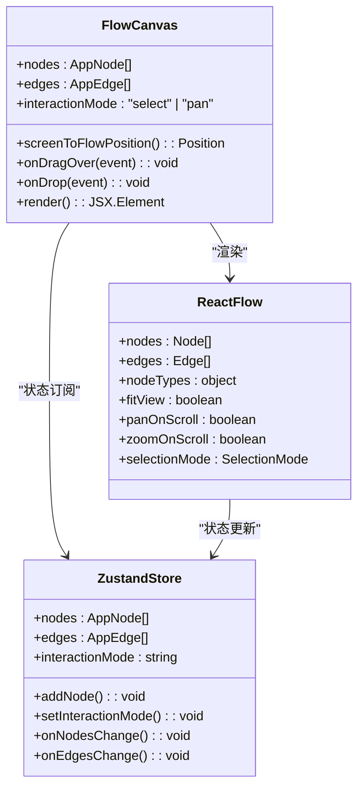

**图表来源**
- [FlowCanvas.tsx](file://src/components/flow/FlowCanvas.tsx#L12-L81)
- [flowStore.ts](file://src/store/flowStore.ts#L17-L131)

**章节来源**
- [FlowCanvas.tsx](file://src/components/flow/FlowCanvas.tsx#L12-L81)
- [flowStore.ts](file://src/store/flowStore.ts#L17-L46)

## Zustand状态管理集成

FlowCanvas与Zustand状态管理系统的深度集成是其架构的核心优势。通过useFlowStore钩子，组件能够实时响应状态变化：

### 状态订阅机制

组件通过多个状态订阅实现响应式更新：

| 状态属性 | 类型 | 功能描述 |
|---------|------|----------|
| nodes | AppNode[] | 存储所有节点数据，包括位置、类型、配置信息 |
| edges | AppEdge[] | 存储连接关系，支持动画效果和样式定制 |
| interactionMode | "select" \| "pan" | 控制画布交互模式，动态切换选择和平移模式 |
| onNodesChange | Function | 处理节点变更事件，支持批量操作 |
| onEdgesChange | Function | 处理边关系变更，维护数据一致性 |

### 交互模式状态管理

interactionMode状态的动态切换通过专门的setter方法实现：

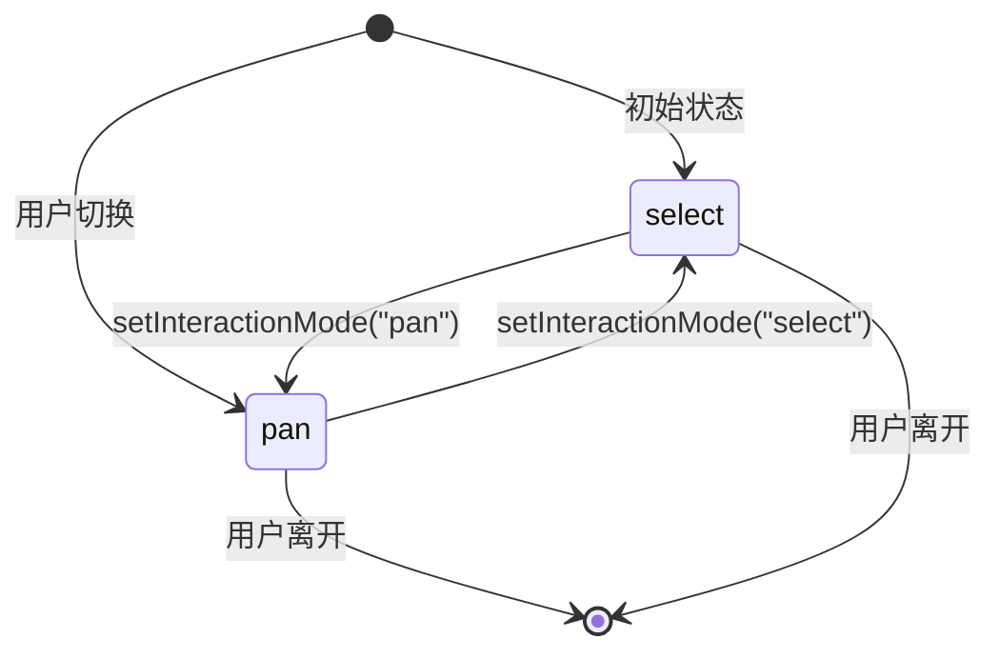

**图表来源**
- [flowStore.ts](file://src/store/flowStore.ts#L45-L46)
- [ControlDock.tsx](file://src/components/builder/ControlDock.tsx#L77-L81)

**章节来源**
- [flowStore.ts](file://src/store/flowStore.ts#L17-L46)
- [initialState.ts](file://src/store/constants/initialState.ts#L22)

## 交互行为配置详解

FlowCanvas提供了丰富的交互行为配置选项，通过条件渲染实现灵活的用户体验：

### 平移滚动配置

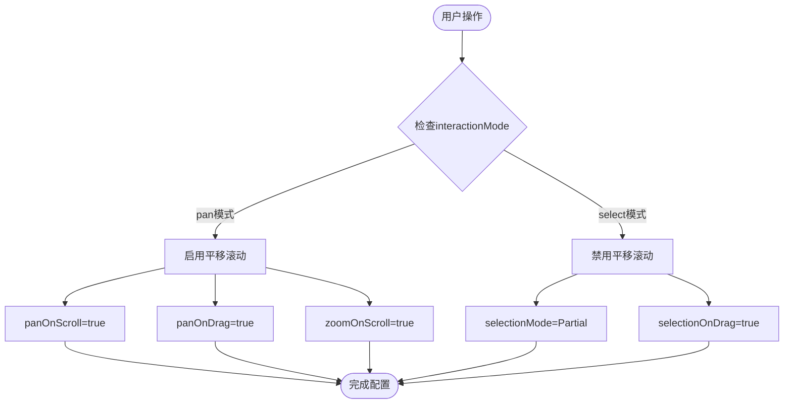

**图表来源**
- [FlowCanvas.tsx](file://src/components/flow/FlowCanvas.tsx#L52-L57)

### 缩放与手势控制

| 配置项 | 值 | 功能说明 |
|--------|-----|----------|
| zoomOnPinch | true | 支持触摸设备的双指缩放 |
| minZoom | 0.1 | 最小缩放比例，防止过度缩小 |
| maxZoom | 2 | 最大缩放比例，保持可见性 |
| panOnScrollMode | Free | 允许自由滚动模式 |

### 选择模式配置

当处于选择模式时，组件会启用多选功能：

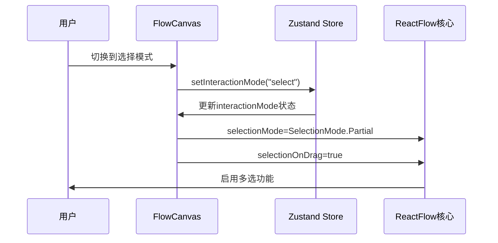

**图表来源**
- [FlowCanvas.tsx](file://src/components/flow/FlowCanvas.tsx#L56-L57)
- [ControlDock.tsx](file://src/components/builder/ControlDock.tsx#L77-L81)

**章节来源**
- [FlowCanvas.tsx](file://src/components/flow/FlowCanvas.tsx#L52-L58)
- [ControlDock.tsx](file://src/components/builder/ControlDock.tsx#L77-L81)

## 坐标转换与事件处理

FlowCanvas实现了完整的拖拽和坐标转换机制，支持从屏幕坐标到画布坐标的精确转换：

### screenToFlowPosition坐标转换

使用useReactFlow提供的screenToFlowPosition方法实现坐标转换：

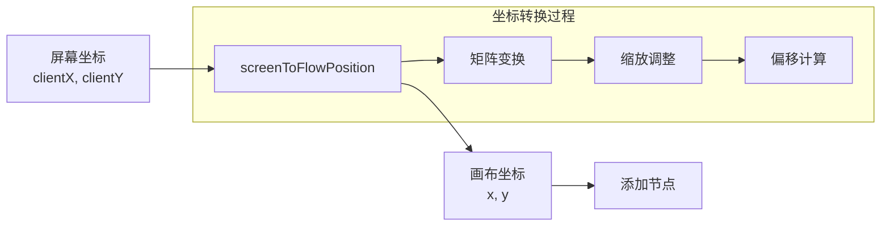

**图表来源**
- [FlowCanvas.tsx](file://src/components/flow/FlowCanvas.tsx#L21)
- [FlowCanvas.tsx](file://src/components/flow/FlowCanvas.tsx#L33)

### 拖拽事件处理流程

拖拽功能通过onDragOver和onDrop事件实现完整的拖放体验：

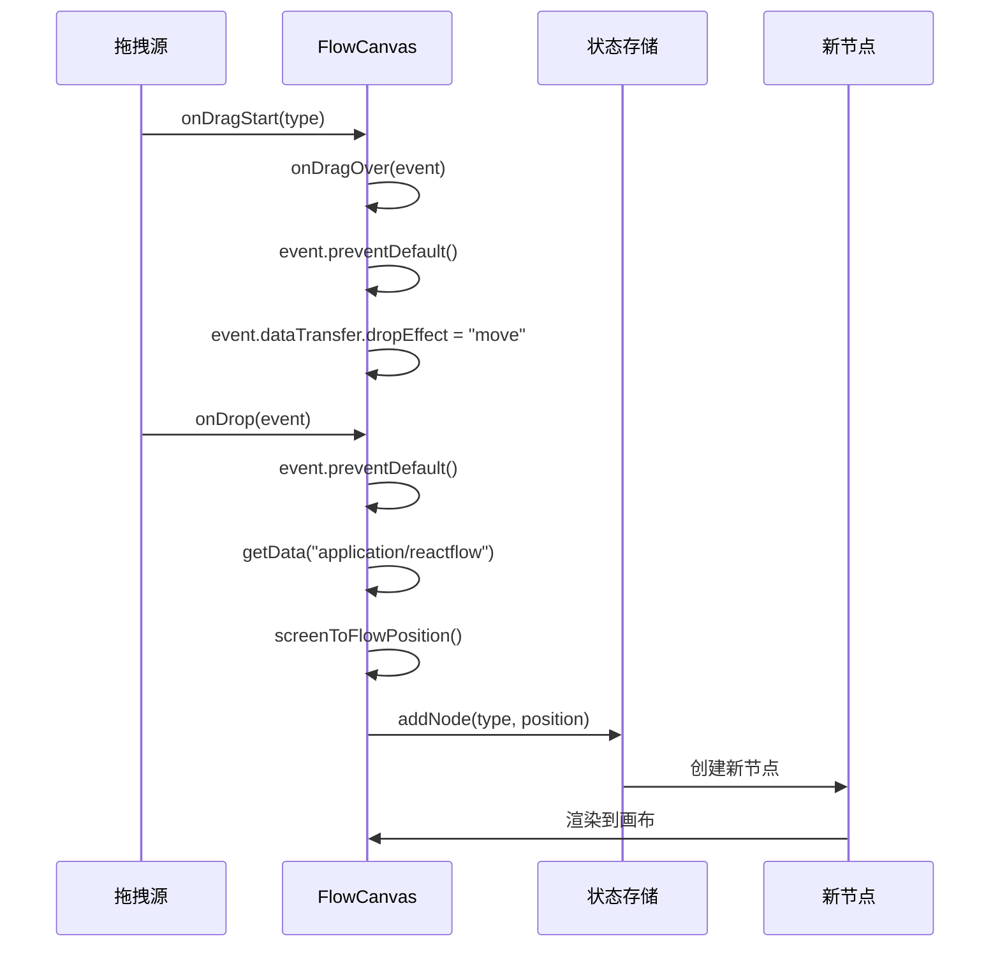

**图表来源**
- [FlowCanvas.tsx](file://src/components/flow/FlowCanvas.tsx#L23-L36)
- [Sidebar.tsx](file://src/components/flow/Sidebar.tsx#L8-L28)

### 节点点击事件处理

组件还实现了精确的节点点击检测：

| 事件类型 | 处理函数 | 功能描述 |
|----------|----------|----------|
| onNodeClick | setSelectedNode(node.id) | 单击节点时选中节点 |
| onPaneClick | setSelectedNode(null) | 单击画布空白区域时取消选中 |

**章节来源**
- [FlowCanvas.tsx](file://src/components/flow/FlowCanvas.tsx#L23-L36)
- [FlowCanvas.tsx](file://src/components/flow/FlowCanvas.tsx#L49-L51)
- [nodeActions.ts](file://src/store/actions/nodeActions.ts#L90-L92)

## 背景网格渲染配置

FlowCanvas采用精心设计的背景网格系统，提升视觉体验和用户体验：

### 网格配置参数

| 参数 | 值 | 说明 |
|------|-----|------|
| variant | BackgroundVariant.Dots | 点状网格样式 |
| gap | 24 | 网格点之间的间距 |
| size | 1.5 | 网格点的大小 |
| color | "#000000" | 网格颜色 |
| className | "opacity-[0.05]" | 透明度设置 |

### 网格渲染效果

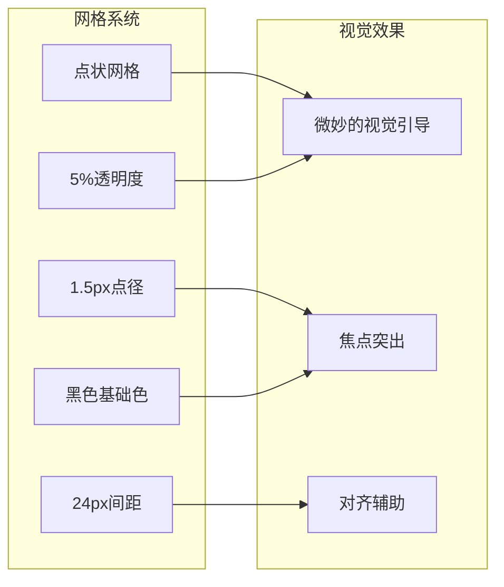

**图表来源**
- [FlowCanvas.tsx](file://src/components/flow/FlowCanvas.tsx#L69-L75)

**章节来源**
- [FlowCanvas.tsx](file://src/components/flow/FlowCanvas.tsx#L69-L75)

## 连接线样式定义

FlowCanvas通过defaultEdgeOptions统一定义了连接线的外观和行为：

### 默认边配置

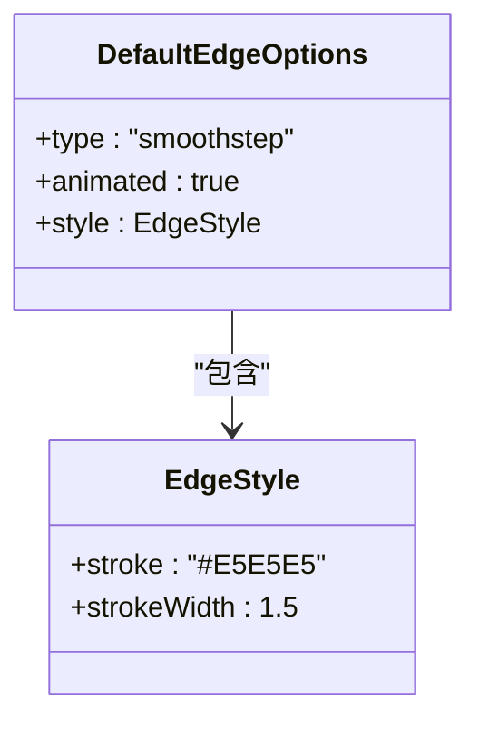

**图表来源**
- [FlowCanvas.tsx](file://src/components/flow/FlowCanvas.tsx#L60-L64)

### 连接线特性

| 特性 | 配置值 | 效果说明 |
|------|--------|----------|
| 类型 | smoothstep | 平滑曲线连接 |
| 动画 | true | 支持动态过渡效果 |
| 描边颜色 | #E5E5E5 | 浅灰色，低调不突兀 |
| 线宽 | 1.5px | 适中的线条粗细 |

**章节来源**
- [FlowCanvas.tsx](file://src/components/flow/FlowCanvas.tsx#L60-L64)

## 视图适配机制

FlowCanvas集成了智能的视图适配功能，确保画布内容始终可见且布局合理：

### fitView自动适配

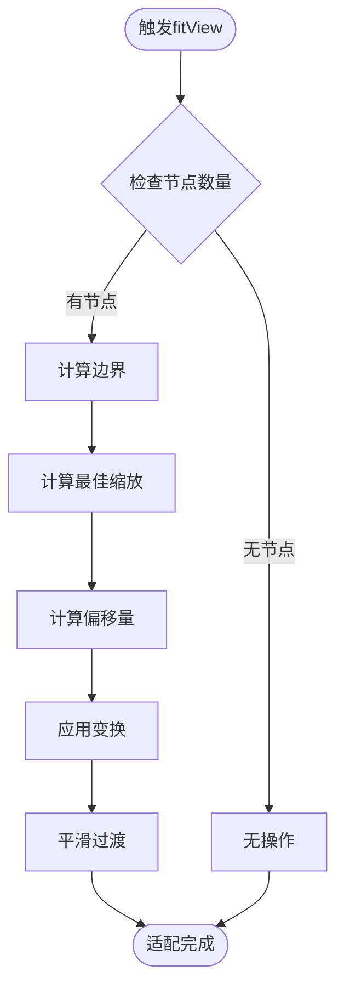

**图表来源**
- [FlowCanvas.tsx](file://src/components/flow/FlowCanvas.tsx#L52)

### 视图控制接口

ControlDock组件提供了完整的视图控制功能：

| 控制器 | 功能 | 实现方式 |
|--------|------|----------|
| 缩放控制 | zoomIn/zoomOut | ReactFlow内置API |
| 适配视图 | fitView | 自动计算最佳视图 |
| 重置视图 | zoomTo(1) | 恢复原始比例 |
| 缩放百分比 | 动态显示 | 实时监听缩放状态 |

**章节来源**
- [FlowCanvas.tsx](file://src/components/flow/FlowCanvas.tsx#L52)
- [ControlDock.tsx](file://src/components/builder/ControlDock.tsx#L13-L147)

## 性能优化策略

FlowCanvas采用了多层次的性能优化策略，确保大型工作流的流畅运行：

### 组件优化技术

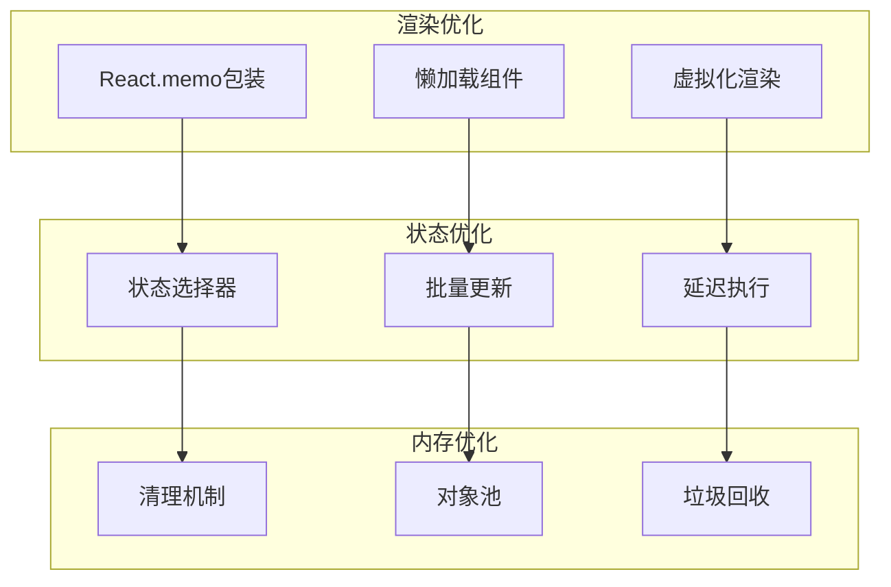

### 性能监控指标

| 指标 | 目标值 | 监控方法 |
|------|--------|----------|
| 渲染时间 | <16ms | React DevTools Profiler |
| 内存占用 | <50MB | 浏览器开发者工具 |
| 响应延迟 | <100ms | 用户体验测试 |
| 节点数量 | <1000个 | 动态警告机制 |

### 错误恢复机制

FlowCanvas实现了完善的错误边界和恢复机制：

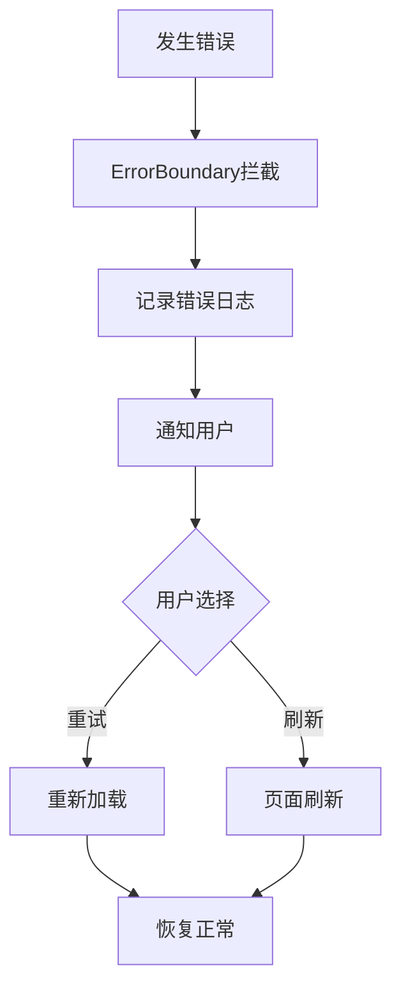

**图表来源**
- [FlowErrorBoundary.tsx](file://src/components/FlowErrorBoundary.tsx#L15-L64)

**章节来源**
- [FlowErrorBoundary.tsx](file://src/components/FlowErrorBoundary.tsx#L15-L64)

## 故障排除指南

### 常见问题诊断

#### 画布无响应问题

| 问题症状 | 可能原因 | 解决方案 |
|----------|----------|----------|
| 节点无法拖拽 | interactionMode设置错误 | 检查setInteractionMode调用 |
| 缩放失效 | zoomOnScroll配置问题 | 验证pan模式下的相关配置 |
| 拖拽不准确 | screenToFlowPosition异常 | 检查坐标转换逻辑 |
| 背景网格不显示 | Background组件配置错误 | 验证网格参数设置 |

#### 缩放异常问题

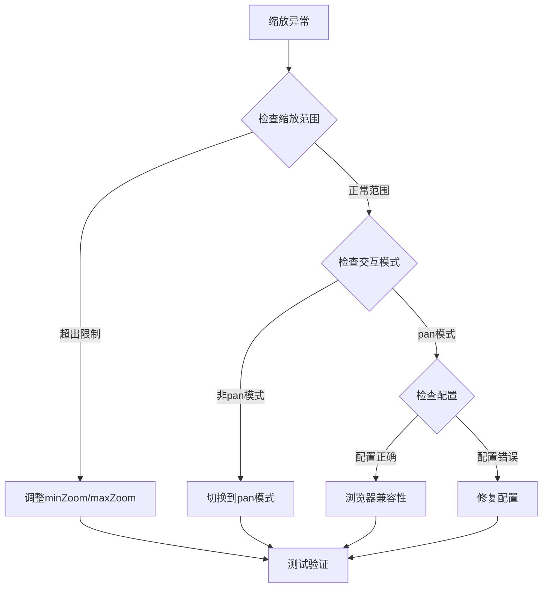

### 性能问题排查

#### 渲染性能优化

1. **节点数量控制**：单次操作不超过100个节点
2. **批量更新**：使用批量API减少重渲染次数
3. **虚拟化**：对于大量节点考虑使用虚拟化渲染
4. **缓存策略**：合理使用React.memo和useMemo

#### 内存泄漏预防

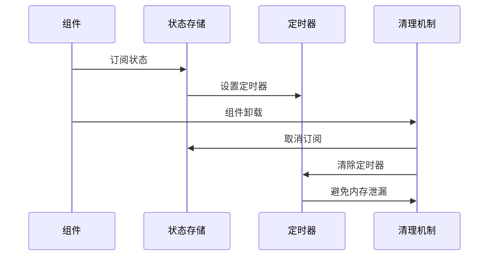

**章节来源**
- [flowStore.ts](file://src/store/flowStore.ts#L49-L74)
- [FlowErrorBoundary.tsx](file://src/components/FlowErrorBoundary.tsx#L25-L31)

## 总结

FlowCanvas组件通过精心设计的架构和优化策略，实现了高性能、易用性强的可视化画布功能。其核心优势包括：

1. **状态管理集成**：与Zustand的深度集成确保了状态的一致性和响应性
2. **交互行为丰富**：支持多种交互模式，满足不同使用场景需求
3. **性能优化完善**：多层次的优化策略保证了大型工作流的流畅运行
4. **错误处理健全**：完善的错误边界和恢复机制提升了用户体验
5. **扩展性良好**：模块化的架构设计便于功能扩展和维护

通过本文档的详细分析，开发者可以深入理解FlowCanvas的工作原理，并能够有效地进行功能扩展和问题排查。该组件的设计理念和实现方式为类似的可视化编辑器开发提供了宝贵的参考价值。