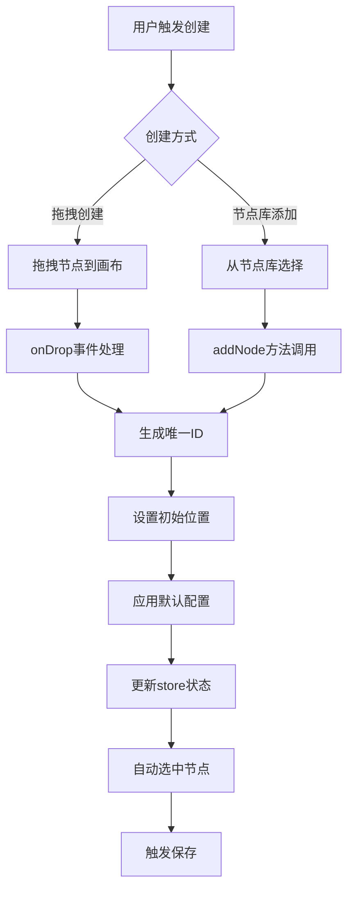
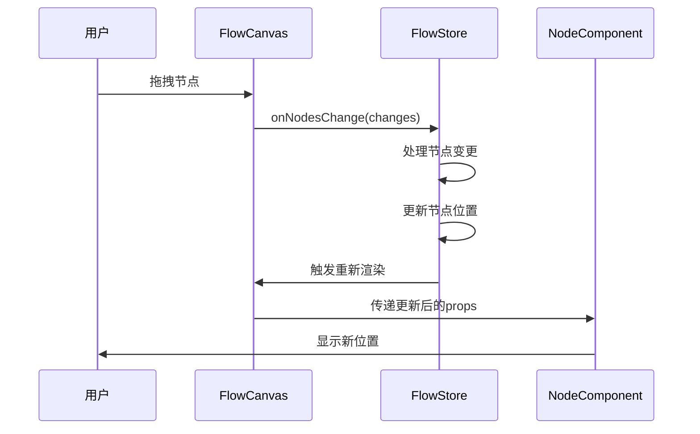
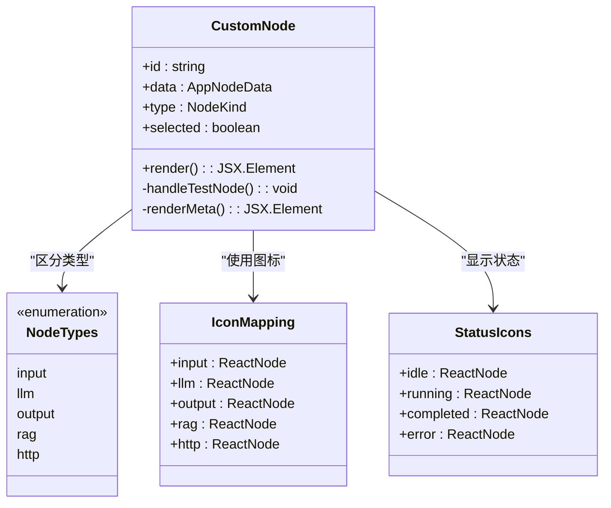
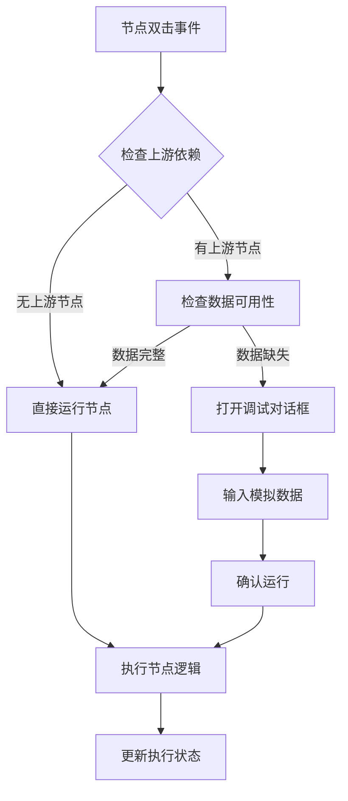
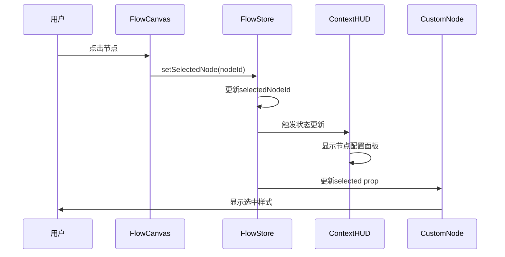

# 节点操作

<cite>
**本文档引用的文件**
- [CustomNode.tsx](file://src/components/flow/CustomNode.tsx)
- [nodeActions.ts](file://src/store/actions/nodeActions.ts)
- [BrainBar.tsx](file://src/components/builder/BrainBar.tsx)
- [FlowCanvas.tsx](file://src/components/flow/FlowCanvas.tsx)
- [flowStore.ts](file://src/store/flowStore.ts)
- [NodeDebugDialog.tsx](file://src/components/flow/NodeDebugDialog.tsx)
- [ContextHUD.tsx](file://src/components/builder/ContextHUD.tsx)
- [nodeDefaults.ts](file://src/store/utils/nodeDefaults.ts)
- [flow.ts](file://src/types/flow.ts)
- [initialState.ts](file://src/store/constants/initialState.ts)
</cite>

## 目录
1. [简介](#简介)
2. [节点生命周期管理](#节点生命周期管理)
3. [节点类型与渲染机制](#节点类型与渲染机制)
4. [节点交互功能](#节点交互功能)
5. [节点状态管理](#节点状态管理)
6. [问题诊断与解决方案](#问题诊断与解决方案)
7. [最佳实践指南](#最佳实践指南)
8. [总结](#总结)

## 简介

Flash Flow 是一个基于 React 和 React Flow 构建的可视化节点编辑器，提供了完整的节点生命周期管理机制。系统支持多种节点类型（输入、LLM、RAG、HTTP、输出），并通过拖拽操作实现节点的快速创建和布局调整。本文档详细阐述了节点从创建到销毁的完整生命周期，以及相关的状态同步、验证和调试机制。

## 节点生命周期管理

### 节点创建机制

节点的创建通过多种方式实现，主要包括拖拽创建和节点库添加两种主要途径。



**图表来源**
- [FlowCanvas.tsx](file://src/components/flow/FlowCanvas.tsx#L28-L35)
- [nodeActions.ts](file://src/store/actions/nodeActions.ts#L9-L20)

#### 拖拽创建流程

拖拽创建是系统的核心交互方式，通过 HTML5 Drag and Drop API 实现：

1. **拖拽准备阶段**：用户在节点库中选择特定类型的节点
2. **数据传输**：将节点类型信息存储在 `dataTransfer` 对象中
3. **位置计算**：使用 `screenToFlowPosition` 将屏幕坐标转换为画布坐标
4. **节点实例化**：调用 `addNode` 方法创建新的节点实例

**章节来源**
- [FlowCanvas.tsx](file://src/components/flow/FlowCanvas.tsx#L23-L35)

#### 节点库添加机制

节点库提供了预定义的节点模板，支持快速添加常用节点类型：

```mermaid
classDiagram
class BrainBar {
+addNode(type, position)
+setLibraryOpen(boolean)
+executeModification(instruction)
-handleModify()
-confirmGenerate()
}
class NodeTile {
+label : string
+onSelect : function
+render()
}
class NodeCreation {
+type : NodeKind
+position : {x, y}
+data : Partial~AppNodeData~
+createNode()
}
BrainBar --> NodeTile : "包含"
BrainBar --> NodeCreation : "触发"
NodeTile --> NodeCreation : "调用"
```

**图表来源**
- [BrainBar.tsx](file://src/components/builder/BrainBar.tsx#L243-L249)
- [nodeActions.ts](file://src/store/actions/nodeActions.ts#L9-L20)

**章节来源**
- [BrainBar.tsx](file://src/components/builder/BrainBar.tsx#L237-L251)

### 节点位置变更监听

系统通过 `onNodesChange` 回调函数实时监听节点位置变化，确保界面状态与数据状态保持同步。



**图表来源**
- [FlowCanvas.tsx](file://src/components/flow/FlowCanvas.tsx#L44-L45)
- [edgeActions.ts](file://src/store/actions/edgeActions.ts#L16-L32)

**章节来源**
- [FlowCanvas.tsx](file://src/components/flow/FlowCanvas.tsx#L44-L45)
- [edgeActions.ts](file://src/store/actions/edgeActions.ts#L16-L32)

### 节点删除与清理

当节点被删除时，系统会自动清理相关的边连接，防止孤立边的存在。

**章节来源**
- [edgeActions.ts](file://src/store/actions/edgeActions.ts#L17-L28)

## 节点类型与渲染机制

### CustomNode 组件架构

`CustomNode` 是所有节点的统一容器组件，根据不同的节点类型渲染相应的视觉元素和交互功能。



**图表来源**
- [CustomNode.tsx](file://src/components/flow/CustomNode.tsx#L12-L25)
- [CustomNode.tsx](file://src/components/flow/CustomNode.tsx#L29-L82)

### 节点类型渲染策略

系统根据不同节点类型采用差异化的渲染策略：

#### LLM 节点渲染
- 显示模型名称和温度设置
- 提供系统提示词配置区域
- 支持运行状态指示

#### HTTP 节点渲染
- 显示请求方法和URL
- 提供URL验证功能
- 支持请求状态监控

#### RAG 节点渲染
- 显示已上传文件数量
- 提供文件上传功能
- 支持文件列表展示

#### 输入/输出节点渲染
- 显示文本内容预览
- 支持多行文本编辑
- 提供内容格式化显示

**章节来源**
- [CustomNode.tsx](file://src/components/flow/CustomNode.tsx#L42-L82)

### 双击事件与调试对话框联动

节点的双击事件与调试对话框形成联动机制，为用户提供便捷的调试入口。



**图表来源**
- [CustomNode.tsx](file://src/components/flow/CustomNode.tsx#L84-L105)
- [NodeDebugDialog.tsx](file://src/components/flow/NodeDebugDialog.tsx#L18-L28)

**章节来源**
- [CustomNode.tsx](file://src/components/flow/CustomNode.tsx#L84-L105)
- [NodeDebugDialog.tsx](file://src/components/flow/NodeDebugDialog.tsx#L18-L28)

## 节点交互功能

### 选中状态同步机制

系统通过 `setSelectedNode` 方法实现节点选中状态的全局同步：



**图表来源**
- [FlowCanvas.tsx](file://src/components/flow/FlowCanvas.tsx#L50-L51)
- [nodeActions.ts](file://src/store/actions/nodeActions.ts#L91-L92)

**章节来源**
- [FlowCanvas.tsx](file://src/components/flow/FlowCanvas.tsx#L50-L51)
- [nodeActions.ts](file://src/store/actions/nodeActions.ts#L91-L92)

### 节点配置面板

ContextHUD 组件提供了节点配置的集中管理界面，支持实时编辑和验证。

**章节来源**
- [ContextHUD.tsx](file://src/components/builder/ContextHUD.tsx#L41-L81)

## 节点状态管理

### store 中的节点操作

系统通过专门的 action 函数管理节点的各种操作：

```mermaid
classDiagram
class NodeActions {
+addNode(type, position, data)
+updateNodeData(id, data)
+resetNodeData(id)
+setSelectedNode(id)
}
class ValidationRules {
+llm_temperature_range : 0-1
+http_url_format : valid_URL
+rag_files_array : Array
}
class DefaultValues {
+input_default : {text : "", status : "idle"}
+llm_default : {model : "doubao-seed-1-6-flash-250828", temperature : 0.7}
+http_default : {method : "GET", url : "https : //api.example.com"}
}
NodeActions --> ValidationRules : "应用验证"
NodeActions --> DefaultValues : "使用默认值"
```

**图表来源**
- [nodeActions.ts](file://src/store/actions/nodeActions.ts#L5-L92)
- [nodeDefaults.ts](file://src/store/utils/nodeDefaults.ts#L6-L16)

### 节点更新机制

节点数据的更新遵循严格的验证规则，确保数据的完整性和一致性：

#### 温度参数验证
- LLM 节点的 temperature 参数必须在 0-1 范围内
- 超出范围的值会被拒绝并记录错误

#### URL 格式验证
- HTTP 节点的 URL 必须符合标准 URL 格式
- 使用 JavaScript URL 构造函数进行验证

#### 文件数组验证
- RAG 节点的 files 参数必须是数组类型
- 空值或非数组类型会被拒绝

**章节来源**
- [nodeActions.ts](file://src/store/actions/nodeActions.ts#L32-L60)

### 节点重置功能

系统提供节点重置功能，允许用户将节点恢复到默认配置状态。

**章节来源**
- [nodeActions.ts](file://src/store/actions/nodeActions.ts#L73-L92)

## 问题诊断与解决方案

### 节点拖拽失效问题

**问题表现**：
- 节点无法通过拖拽方式添加到画布
- 控制台出现 drag 事件相关错误

**可能原因**：
1. `onDragOver` 事件未正确阻止默认行为
2. `dataTransfer` 数据格式不正确
3. `screenToFlowPosition` 坐标转换失败

**解决方案**：
```typescript
// 确保正确处理 drag 事件
const onDragOver = useCallback((event: React.DragEvent) => {
    event.preventDefault();
    event.dataTransfer.dropEffect = "move";
}, []);

const onDrop = useCallback((event: React.DragEvent) => {
    event.preventDefault();
    const type = event.dataTransfer.getData("application/reactflow");
    if (!type) return;
    const pos = screenToFlowPosition({ x: event.clientX, y: event.clientY });
    addNode(type as NodeKind, pos);
}, [screenToFlowPosition, addNode]);
```

**章节来源**
- [FlowCanvas.tsx](file://src/components/flow/FlowCanvas.tsx#L23-L36)

### 状态不同步问题

**问题表现**：
- 节点选中状态与界面显示不一致
- 节点配置更改后未及时反映在界面上

**解决方案**：
1. 确保 `onNodesChange` 正确处理所有节点变更
2. 在 `useEffect` 中监听节点状态变化
3. 使用正确的状态更新模式

**章节来源**
- [edgeActions.ts](file://src/store/actions/edgeActions.ts#L16-L32)

### 调试对话框问题

**问题表现**：
- 调试对话框无法正常打开
- 模拟数据验证失败

**解决方案**：
1. 检查 `debugNodeId` 是否正确设置
2. 验证 JSON 格式是否正确
3. 确保 `confirmDebugRun` 方法正确处理异常

**章节来源**
- [NodeDebugDialog.tsx](file://src/components/flow/NodeDebugDialog.tsx#L18-L28)

## 最佳实践指南

### 自定义节点扩展

要扩展系统支持新的节点类型，需要遵循以下步骤：

1. **定义节点类型**：在 `NodeKind` 类型中添加新类型
2. **实现节点组件**：创建对应的节点渲染组件
3. **添加默认配置**：在 `nodeDefaults.ts` 中定义默认值
4. **更新验证规则**：在 `nodeActions.ts` 中添加验证逻辑
5. **集成到UI**：在节点库和上下文面板中添加支持

### 性能优化建议

1. **使用 React.memo**：对节点组件使用记忆化避免不必要的重渲染
2. **批量更新**：合并多个状态更新减少重渲染次数
3. **懒加载**：对于复杂的节点配置界面使用懒加载
4. **虚拟化**：对于大量节点的场景考虑使用虚拟化技术

### 错误处理策略

1. **输入验证**：在用户输入时进行实时验证
2. **异常捕获**：在异步操作中添加适当的错误处理
3. **用户反馈**：提供清晰的错误信息和解决建议
4. **状态回滚**：在操作失败时能够回滚到之前的状态

### 可访问性考虑

1. **键盘导航**：确保所有交互功能可以通过键盘访问
2. **屏幕阅读器**：为节点添加适当的ARIA标签
3. **高对比度**：提供高对比度的主题选项
4. **焦点管理**：合理管理焦点状态避免混乱

## 总结

Flash Flow 的节点操作机制提供了一个完整、灵活且易于扩展的节点管理系统。通过拖拽创建、状态同步、类型化渲染和智能调试等功能，系统能够满足复杂工作流编辑的需求。系统的模块化设计使得扩展新的节点类型变得简单，而完善的验证和错误处理机制确保了系统的稳定性和用户体验。

开发者在使用和扩展这个系统时，应该重点关注状态同步的一致性、性能优化的平衡以及用户体验的连续性。通过遵循本文档提供的最佳实践，可以构建出更加健壮和用户友好的节点编辑器应用。