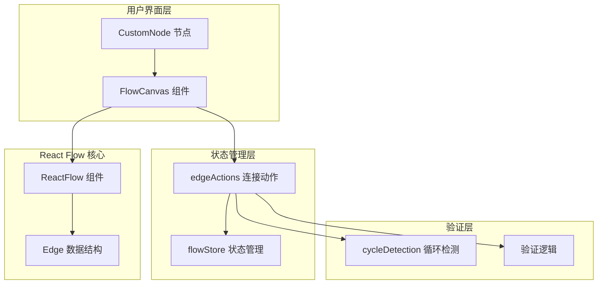
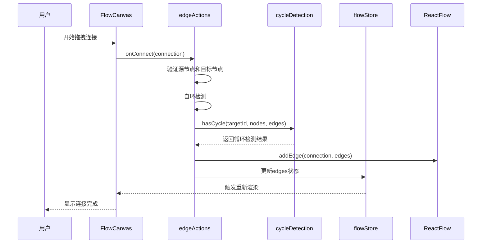
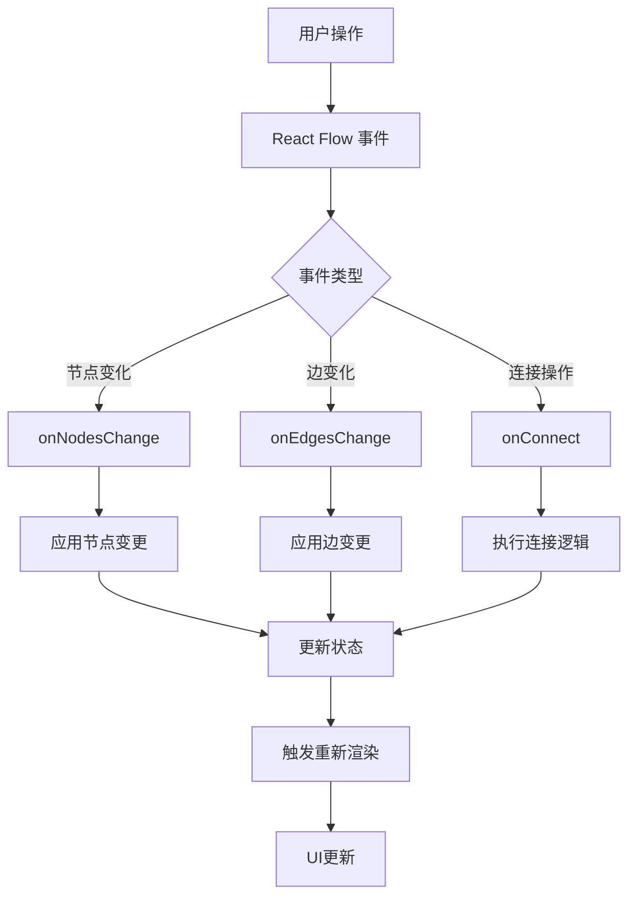
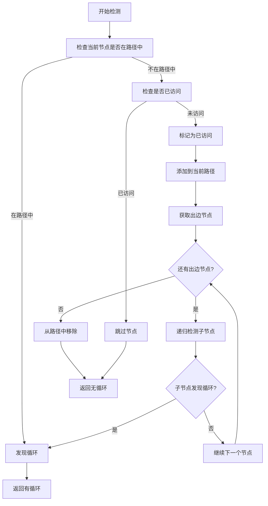
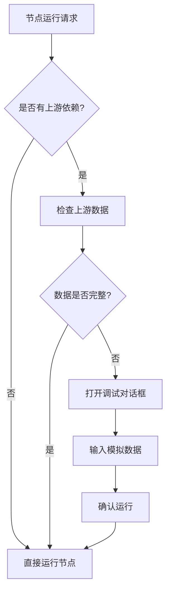

# 连接逻辑

<cite>
**本文档引用的文件**
- [edgeActions.ts](file://src/store/actions/edgeActions.ts)
- [flowStore.ts](file://src/store/flowStore.ts)
- [FlowCanvas.tsx](file://src/components/flow/FlowCanvas.tsx)
- [flow.ts](file://src/types/flow.ts)
- [cycleDetection.ts](file://src/store/utils/cycleDetection.ts)
- [CustomNode.tsx](file://src/components/flow/CustomNode.tsx)
- [initialState.ts](file://src/store/constants/initialState.ts)
- [NodeDebugDialog.tsx](file://src/components/flow/NodeDebugDialog.tsx)
- [layoutAlgorithm.ts](file://src/store/utils/layoutAlgorithm.ts)
</cite>

## 目录
1. [概述](#概述)
2. [连接机制架构](#连接机制架构)
3. [onConnect回调详解](#onconnect回调详解)
4. [edges状态管理](#edges状态管理)
5. [循环检测机制](#循环检测机制)
6. [视觉效果配置](#视觉效果配置)
7. [连接调试与故障排除](#连接调试与故障排除)
8. [连接样式自定义](#连接样式自定义)
9. [最佳实践与优化建议](#最佳实践与优化建议)

## 概述

Flash Flow 的连接逻辑基于 React Flow 库构建，提供了强大的节点间连接功能。系统通过严格的验证机制确保工作流的有向无环性（DAG），同时提供丰富的视觉效果和交互体验。连接逻辑的核心在于 `onConnect` 回调的执行流程，它负责处理节点间的连接请求、验证连接的有效性，并维护整个工作流的状态一致性。

## 连接机制架构

### 核心组件关系



**图表来源**
- [FlowCanvas.tsx](file://src/components/flow/FlowCanvas.tsx#L12-L81)
- [flowStore.ts](file://src/store/flowStore.ts#L17-L127)
- [edgeActions.ts](file://src/store/actions/edgeActions.ts#L12-L79)

### 连接流程架构



**图表来源**
- [edgeActions.ts](file://src/store/actions/edgeActions.ts#L46-L67)
- [cycleDetection.ts](file://src/store/utils/cycleDetection.ts#L13-L33)

**章节来源**
- [edgeActions.ts](file://src/store/actions/edgeActions.ts#L1-L80)
- [flowStore.ts](file://src/store/flowStore.ts#L17-L127)

## onConnect回调详解

### 回调函数实现

`onConnect` 是连接逻辑的核心入口点，它接收来自 React Flow 的连接对象并执行完整的验证和处理流程。

### 连接验证步骤

#### 1. 基础验证
```typescript
// 验证源节点和目标节点存在
const src = nodes.find((n: AppNode) => n.id === connection.source);
const tgt = nodes.find((n: AppNode) => n.id === connection.target);
if (!src || !tgt) return;
```

#### 2. 自环检测
```typescript
// 防止节点连接到自身
if (connection.source === connection.target) {
    console.warn("Cannot connect node to itself");
    return;
}
```

#### 3. 循环检测
```typescript
// 创建临时边集合进行循环检测
const tempEdges = addEdge(connection, edges);
if (hasCycle(connection.target, nodes, tempEdges)) {
    console.error("Cycle detected! Connection rejected.");
    return;
}
```

### 状态更新机制

当连接验证通过后，系统会执行以下操作：

1. **状态更新**：使用 `set({ edges: tempEdges })` 更新全局状态
2. **持久化保存**：调用 `get().scheduleSave()` 触发自动保存机制
3. **UI响应**：React Flow 自动更新可视化表示

**章节来源**
- [edgeActions.ts](file://src/store/actions/edgeActions.ts#L46-L67)

## edges状态管理

### 双向绑定机制

React Flow 采用单向数据流模式，通过事件回调实现状态的双向绑定：



**图表来源**
- [FlowCanvas.tsx](file://src/components/flow/FlowCanvas.tsx#L43-L46)
- [edgeActions.ts](file://src/store/actions/edgeActions.ts#L16-L41)

### 状态同步策略

#### 节点变更处理
```typescript
// 删除节点时自动清理相关边
const deletedNodeIds = changes
    .filter((c) => c.type === 'remove')
    .map((c) => c.id);

if (deletedNodeIds.length > 0) {
    set((state: any) => ({
        nodes: applyNodeChanges(changes, state.nodes) as AppNode[],
        edges: state.edges.filter(
            (e: AppEdge) => !deletedNodeIds.includes(e.source) && !deletedNodeIds.includes(e.target)
        ),
    }));
}
```

#### 边变更处理
```typescript
// 直接应用边变更
set({ edges: applyEdgeChanges(changes, get().edges) });
```

### 状态持久化

系统实现了智能的自动保存机制：

```typescript
// 防抖延迟保存
saveTimer = setTimeout(async () => {
    const currentState = get();
    const data = {
        nodes: currentState.nodes,
        edges: currentState.edges
    };
    const id = await flowAPI.autoSave(currentState.currentFlowId, title, data);
    set({ currentFlowId: id, saveStatus: "saved" });
}, 800);
```

**章节来源**
- [edgeActions.ts](file://src/store/actions/edgeActions.ts#L16-L41)
- [flowStore.ts](file://src/store/flowStore.ts#L50-L74)

## 循环检测机制

### 深度优先搜索算法

系统使用深度优先搜索（DFS）算法检测有向图中的循环，确保工作流的有向无环性。

### 检测算法实现



**图表来源**
- [cycleDetection.ts](file://src/store/utils/cycleDetection.ts#L13-L33)

### 循环检测核心逻辑

```typescript
export function hasCycle(
    nodeId: string,
    nodes: AppNode[],
    edges: AppEdge[],
    visited = new Set<string>(),
    stack = new Set<string>()
): boolean {
    // 如果节点在当前路径中，发现循环
    if (stack.has(nodeId)) return true;
    // 如果节点已完全访问，无需重复检查
    if (visited.has(nodeId)) return false;

    visited.add(nodeId);
    stack.add(nodeId);

    const outgoers = getOutgoers({ id: nodeId } as AppNode, nodes, edges);
    for (const out of outgoers) {
        if (hasCycle(out.id, nodes, edges, visited, stack)) return true;
    }

    stack.delete(nodeId);
    return false;
}
```

### 循环检测的应用场景

1. **实时连接验证**：每次尝试新连接时立即检测
2. **动态图结构调整**：移动或删除节点时重新验证
3. **导入外部数据**：加载工作流时验证完整性

**章节来源**
- [cycleDetection.ts](file://src/store/utils/cycleDetection.ts#L1-L34)
- [edgeActions.ts](file://src/store/actions/edgeActions.ts#L58-L64)

## 视觉效果配置

### defaultEdgeOptions配置详解

React Flow 提供了丰富的连接线视觉效果配置选项：

```typescript
defaultEdgeOptions={{
    type: 'smoothstep',           // 连接线类型
    animated: true,              // 动画效果
    style: {                     // 基础样式
        stroke: '#E5E5E5',
        strokeWidth: 1.5,
    },
}}
```

### 连接线类型对比

| 类型 | 特点 | 适用场景 |
|------|------|----------|
| `straight` | 直线连接，简单明了 | 简单线性流程 |
| `step` | 折线连接，可控制拐点 | 需要明确转折的复杂流程 |
| `smoothstep` | 平滑曲线连接（默认） | 大多数工作流场景 |
| `bezier` | 贝塞尔曲线，更平滑 | 高质量视觉效果 |

### 动画效果配置

```typescript
// 启用动画效果
animated: true,

// 动画参数（可通过CSS自定义）
.react-flow__edge.animated {
    stroke-dasharray: 10;
    animation: dashdraw 1s linear infinite;
}
```

### 自定义样式示例

```typescript
// 高亮选中连接
.react-flow__edge.selected {
    stroke: '#3B82F6';
    stroke-width: 2.5;
}

// 错误状态连接
.react-flow__edge.invalid {
    stroke: '#EF4444';
    animation: blink 1s infinite;
}
```

**章节来源**
- [FlowCanvas.tsx](file://src/components/flow/FlowCanvas.tsx#L60-L64)

## 连接调试与故障排除

### 常见连接问题及解决方案

#### 1. 连接线不显示

**可能原因**：
- 节点坐标超出可视范围
- 连接线样式被覆盖
- React Flow 容器尺寸异常

**调试方法**：
```typescript
// 检查节点位置
console.log('节点位置:', nodes.map(n => ({ id: n.id, position: n.position })));

// 检查连接线配置
console.log('默认连接线配置:', defaultEdgeOptions);

// 验证容器尺寸
const container = document.querySelector('.react-flow');
console.log('容器尺寸:', container?.clientWidth, container?.clientHeight);
```

#### 2. 连接失败

**错误日志分析**：
```typescript
// 自环检测失败
console.warn("Cannot connect node to itself");

// 循环检测失败
console.error("Cycle detected! Connection rejected.");

// 节点不存在
// 返回值为空，无错误提示
```

**解决方案**：
```typescript
// 添加连接前验证
const validateConnection = (connection) => {
    const src = nodes.find(n => n.id === connection.source);
    const tgt = nodes.find(n => n.id === connection.target);
    
    if (!src || !tgt) {
        console.error('连接失败：节点不存在');
        return false;
    }
    
    if (connection.source === connection.target) {
        console.error('连接失败：不能连接到自身');
        return false;
    }
    
    return true;
};
```

#### 3. 性能问题

**大数据量连接优化**：
```typescript
// 实现连接线虚拟化
const VirtualizedEdge = ({ sourceX, sourceY, targetX, targetY }) => {
    // 只渲染可见区域内的连接线
    if (!isVisible(sourceX, sourceY, targetX, targetY)) {
        return null;
    }
    
    return <Edge {...props} />;
};

// 减少不必要的重新渲染
React.memo(VirtualizedEdge);
```

### 调试工具集成

#### 节点调试对话框

系统提供了专门的调试对话框来处理节点间的依赖关系：



**图表来源**
- [CustomNode.tsx](file://src/components/flow/CustomNode.tsx#L84-L104)
- [NodeDebugDialog.tsx](file://src/components/flow/NodeDebugDialog.tsx#L1-L69)

#### 调试对话框功能

1. **JSON格式验证**：确保输入数据格式正确
2. **实时错误提示**：连接失败时提供具体错误信息
3. **模拟数据输入**：为上游缺失的数据提供测试数据

**章节来源**
- [edgeActions.ts](file://src/store/actions/edgeActions.ts#L52-L64)
- [NodeDebugDialog.tsx](file://src/components/flow/NodeDebugDialog.tsx#L20-L28)

## 连接样式自定义

### 基于节点类型的条件样式

```typescript
// 根据节点类型动态调整连接样式
const getEdgeStyle = (sourceType: NodeKind, targetType: NodeKind) => {
    const baseStyle = {
        stroke: '#E5E5E5',
        strokeWidth: 1.5,
    };

    // 输入到处理节点：绿色连接线
    if (sourceType === 'input' && ['llm', 'rag', 'http'].includes(targetType)) {
        return { ...baseStyle, stroke: '#10B981' };
    }

    // 处理节点到输出：蓝色连接线
    if (['llm', 'rag', 'http'].includes(sourceType) && targetType === 'output') {
        return { ...baseStyle, stroke: '#3B82F6' };
    }

    // 错误连接：红色连接线
    return { ...baseStyle, stroke: '#EF4444', strokeDasharray: '5,5' };
};
```

### 动态状态样式

```typescript
// 基于连接状态的样式变化
const EdgeWithStatus = ({ data, source, target }) => {
    const edgeStatus = useFlowStore((s) => {
        const edge = s.edges.find(e => e.source === source && e.target === target);
        return edge?.status;
    });

    const style = useMemo(() => {
        switch (edgeStatus) {
            case 'pending':
                return { stroke: '#FBBF24', animation: 'pulse 2s infinite' };
            case 'success':
                return { stroke: '#10B981', strokeWidth: 2 };
            case 'error':
                return { stroke: '#EF4444', strokeDasharray: '5,5' };
            default:
                return { stroke: '#E5E5E5' };
        }
    }, [edgeStatus]);

    return <Edge {...props} style={style} />;
};
```

### 交互增强效果

```typescript
// 鼠标悬停效果
.react-flow__edge:hover {
    stroke-width: 2.5;
    filter: drop-shadow(0 0 5px rgba(59, 130, 246, 0.5));
}

// 选中状态效果
.react-flow__edge.selected {
    stroke-width: 3;
    stroke: #3B82F6;
    filter: drop-shadow(0 0 8px rgba(59, 130, 246, 0.8));
}

// 连接预览效果
.react-flow__connectionline {
    stroke: #3B82F6;
    stroke-width: 2;
    animation: glow 1.5s infinite alternate;
}
```

**章节来源**
- [CustomNode.tsx](file://src/components/flow/CustomNode.tsx#L162-L179)
- [globals.css](file://src/app/globals.css#L176-L201)

## 最佳实践与优化建议

### 连接性能优化

#### 1. 大规模工作流优化
```typescript
// 实现连接线节流
const throttleConnections = (() => {
    let pendingConnections = [];
    let timeoutId = null;

    return (connection) => {
        pendingConnections.push(connection);
        
        if (!timeoutId) {
            timeoutId = setTimeout(() => {
                processConnections(pendingConnections);
                pendingConnections = [];
                timeoutId = null;
            }, 100);
        }
    };
})();

// 批量处理连接请求
const processConnections = (connections) => {
    connections.forEach(conn => {
        // 批量验证和处理
        if (isValidConnection(conn)) {
            batchAddEdge(conn);
        }
    });
};
```

#### 2. 内存管理
```typescript
// 清理不再使用的连接线资源
const cleanupUnusedEdges = (activeNodes, edges) => {
    const activeNodeIds = new Set(activeNodes.map(n => n.id));
    
    return edges.filter(edge => {
        return activeNodeIds.has(edge.source) && 
               activeNodeIds.has(edge.target);
    });
};
```

### 用户体验优化

#### 1. 连接预览增强
```typescript
// 实现智能连接预览
const ConnectionPreview = ({ sourceNode, targetPosition }) => {
    const isValidConnection = useMemo(() => {
        return validatePotentialConnection(sourceNode, targetPosition);
    }, [sourceNode, targetPosition]);

    return (
        <div className={`connection-preview ${isValidConnection ? 'valid' : 'invalid'}`}>
            {isValidConnection ? '✓ 可连接' : '✗ 无效连接'}
        </div>
    );
};
```

#### 2. 连接指导提示
```typescript
// 基于节点类型的连接指导
const getConnectionGuidance = (sourceType, targetType) => {
    const guidanceMap = {
        'input': {
            'llm': '输入数据流向LLM节点',
            'rag': '输入数据流向RAG节点',
            'http': '输入数据流向HTTP节点'
        },
        'llm': {
            'output': 'LLM结果输出到输出节点'
        },
        'rag': {
            'output': 'RAG结果输出到输出节点'
        }
    };

    return guidanceMap[sourceType]?.[targetType] || '请检查节点类型兼容性';
};
```

### 错误处理与恢复

#### 1. 连接失败回滚
```typescript
// 实现连接失败时的状态回滚
const safeConnect = async (connection) => {
    try {
        // 保存当前状态
        const previousState = { nodes: [...nodes], edges: [...edges] };
        
        // 尝试连接
        await onConnect(connection);
        
        // 连接成功，清除回滚状态
        return true;
    } catch (error) {
        // 连接失败，恢复到之前状态
        set({ nodes: previousState.nodes, edges: previousState.edges });
        console.error('连接失败，已回滚:', error);
        return false;
    }
};
```

#### 2. 数据完整性检查
```typescript
// 连接后的完整性验证
const validateConnectionIntegrity = (newEdge) => {
    const sourceNode = nodes.find(n => n.id === newEdge.source);
    const targetNode = nodes.find(n => n.id === newEdge.target);
    
    if (!sourceNode || !targetNode) {
        throw new Error('连接的节点不存在');
    }
    
    // 检查节点类型兼容性
    if (!isNodeTypeCompatible(sourceNode.type, targetNode.type)) {
        throw new Error('节点类型不兼容');
    }
    
    return true;
};
```

### 监控与分析

#### 1. 连接统计
```typescript
// 记录连接统计数据
const trackConnectionMetrics = (connection) => {
    const metrics = {
        sourceType: nodes.find(n => n.id === connection.source)?.type,
        targetType: nodes.find(n => n.id === connection.target)?.type,
        timestamp: new Date(),
        duration: performance.now()
    };
    
    // 发送到分析服务
    analytics.track('connection_created', metrics);
};
```

#### 2. 性能监控
```typescript
// 监控连接操作性能
const monitoredConnect = (connection) => {
    const startTime = performance.now();
    
    try {
        const result = onConnect(connection);
        const endTime = performance.now();
        
        // 记录性能指标
        performance.mark('connection-end');
        performance.measure('connection-duration', 'connection-start', 'connection-end');
        
        return result;
    } catch (error) {
        console.error('连接操作失败:', error);
        throw error;
    }
};
```

这些最佳实践和优化建议可以帮助开发者构建更加稳定、高效和用户友好的连接系统，确保在各种使用场景下都能提供优秀的用户体验。