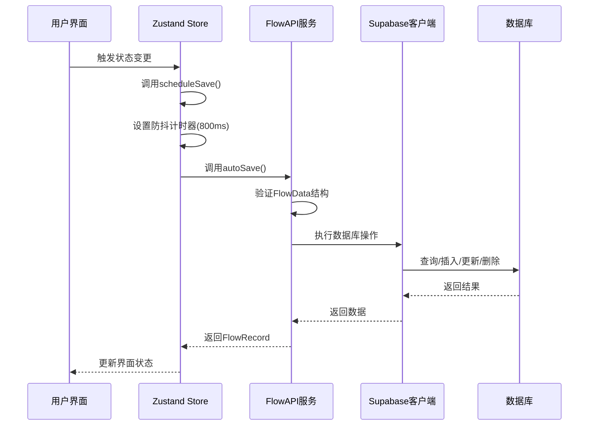
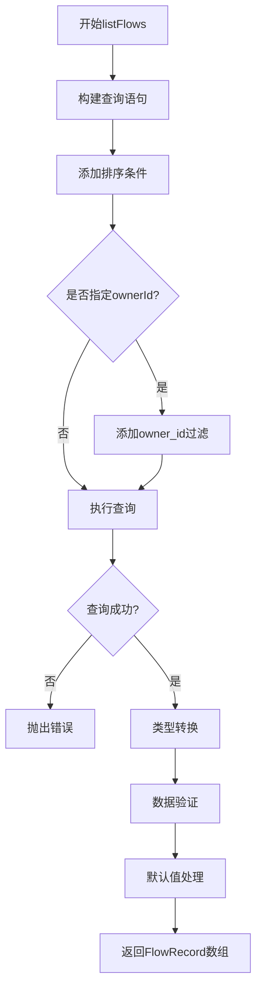
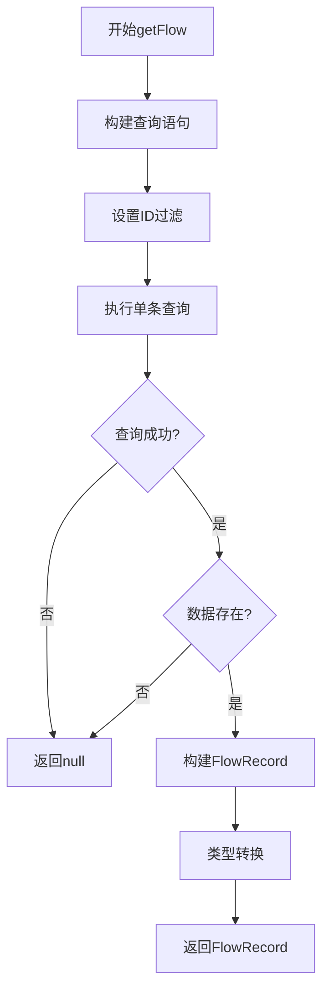
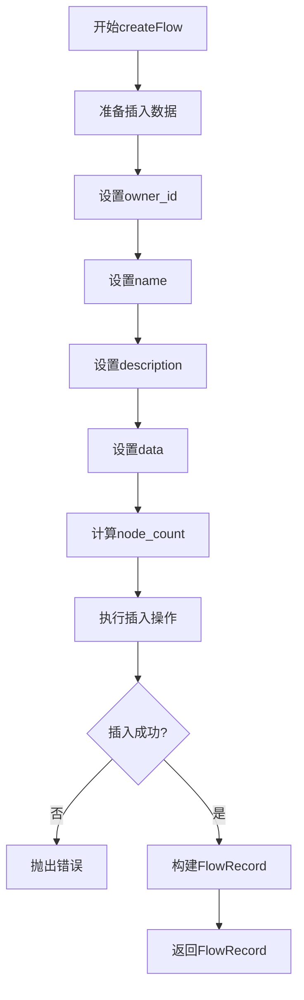
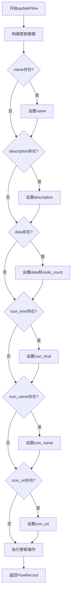
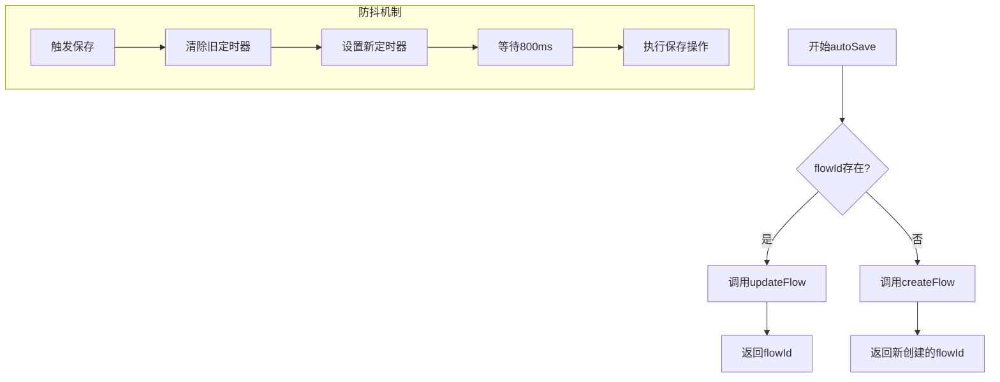
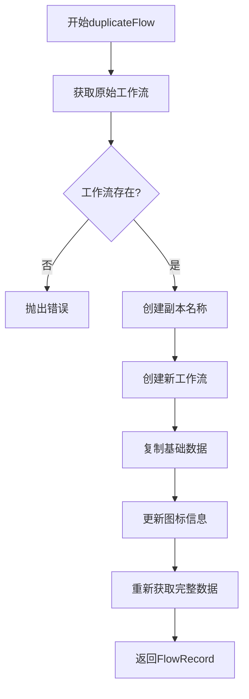
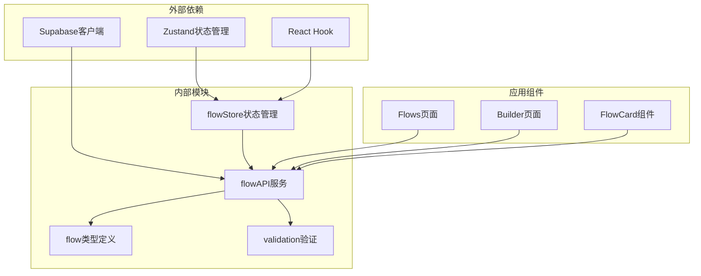

# 前端数据服务

<cite>
**本文档引用的文件**
- [flowAPI.ts](file://src/services/flowAPI.ts)
- [flow.ts](file://src/types/flow.ts)
- [database.ts](file://src/types/database.ts)
- [supabase.ts](file://src/lib/supabase.ts)
- [flowStore.ts](file://src/store/flowStore.ts)
- [validation.ts](file://src/utils/validation.ts)
- [flows/page.tsx](file://src/app/flows/page.tsx)
- [builder/page.tsx](file://src/app/builder/page.tsx)
</cite>

## 目录
1. [简介](#简介)
2. [项目结构](#项目结构)
3. [核心组件](#核心组件)
4. [架构概览](#架构概览)
5. [详细组件分析](#详细组件分析)
6. [依赖关系分析](#依赖关系分析)
7. [性能考虑](#性能考虑)
8. [故障排除指南](#故障排除指南)
9. [结论](#结论)

## 简介

flowAPI服务模块是Flash Flow SaaS平台的核心数据服务，负责管理所有与Flow（工作流）相关的数据库操作。该服务采用TypeScript构建，提供了完整的CRUD操作接口，包括listFlows、getFlow、createFlow、updateFlow、deleteFlow、autoSave和duplicateFlow等核心方法。服务通过封装Supabase客户端实现了统一的数据访问层，同时与Zustand状态管理系统紧密集成，提供高效的防抖自动保存功能。

## 项目结构

flowAPI服务模块在项目中的组织结构如下：

```mermaid
graph TB
subgraph "服务层"
A[flowAPI.ts] --> B[supabase.ts]
A --> C[flow.ts 类型定义]
A --> D[database.ts 数据库类型]
end
subgraph "状态管理层"
E[flowStore.ts] --> A
F[nodeActions.ts] --> E
G[edgeActions.ts] --> E
H[executionActions.ts] --> E
end
subgraph "应用层"
I[flows/page.tsx] --> A
J[builder/page.tsx] --> A
K[builder/[id]/page.tsx] --> A
end
subgraph "工具层"
L[validation.ts] --> C
M[utils.ts] --> A
end
```

**图表来源**
- [flowAPI.ts](file://src/services/flowAPI.ts#L1-L240)
- [flowStore.ts](file://src/store/flowStore.ts#L1-L131)
- [supabase.ts](file://src/lib/supabase.ts#L1-L18)

**章节来源**
- [flowAPI.ts](file://src/services/flowAPI.ts#L1-L240)
- [flowStore.ts](file://src/store/flowStore.ts#L1-L131)

## 核心组件

### FlowAPI服务类

FlowAPI是整个数据服务的核心，提供了以下主要功能：

1. **数据查询操作**
   - `listFlows()`：获取当前用户的所有工作流列表
   - `getFlow(id)`：根据ID获取单个工作流详情

2. **数据变更操作**
   - `createFlow()`：创建新的工作流
   - `updateFlow()`：更新现有工作流
   - `deleteFlow()`：删除指定工作流

3. **高级功能**
   - `autoSave()`：智能保存功能，支持新建和更新
   - `duplicateFlow()`：工作流复制功能

### 类型安全系统

服务采用了严格的类型安全机制：

- **FlowRecord类型**：表示数据库中的工作流记录
- **FlowData类型**：包含节点和边的工作流数据结构
- **数据库类型映射**：通过Supabase Schema自动生成的类型定义

**章节来源**
- [flowAPI.ts](file://src/services/flowAPI.ts#L10-L239)
- [flow.ts](file://src/types/flow.ts#L59-L77)

## 架构概览

flowAPI服务采用分层架构设计，确保了良好的可维护性和扩展性：



**图表来源**
- [flowStore.ts](file://src/store/flowStore.ts#L50-L74)
- [flowAPI.ts](file://src/services/flowAPI.ts#L211-L224)

## 详细组件分析

### listFlows方法分析

listFlows方法负责获取当前用户的所有工作流列表，其实现特点包括：



**图表来源**
- [flowAPI.ts](file://src/services/flowAPI.ts#L14-L69)

#### 数据验证机制

服务实现了多层次的数据验证：

1. **运行时类型检查**：确保FlowData结构正确
2. **默认值保护**：为null字段提供默认值
3. **降级处理**：当数据损坏时提供安全的回退方案

**章节来源**
- [flowAPI.ts](file://src/services/flowAPI.ts#L14-L69)

### getFlow方法分析

getFlow方法提供单个工作流的详细信息获取：



**图表来源**
- [flowAPI.ts](file://src/services/flowAPI.ts#L75-L101)

#### 错误处理策略

getFlow方法采用渐进式错误处理：

1. **查询错误捕获**：记录错误但不中断流程
2. **空数据处理**：优雅处理不存在的情况
3. **类型安全保证**：确保返回类型的一致性

**章节来源**
- [flowAPI.ts](file://src/services/flowAPI.ts#L75-L101)

### createFlow方法分析

createFlow方法负责创建工作流，具有以下特性：



**图表来源**
- [flowAPI.ts](file://src/services/flowAPI.ts#L107-L142)

#### 数据完整性保证

createFlow方法确保数据完整性：

1. **必需字段验证**：强制要求name字段
2. **类型安全转换**：将FlowData转换为JSON兼容格式
3. **自动计数**：根据节点数量自动计算node_count

**章节来源**
- [flowAPI.ts](file://src/services/flowAPI.ts#L107-L142)

### updateFlow方法分析

updateFlow方法提供灵活的工作流更新功能：



**图表来源**
- [flowAPI.ts](file://src/services/flowAPI.ts#L148-L193)

#### 可选字段处理

updateFlow方法支持部分更新，通过以下机制实现：

1. **条件字段设置**：仅更新提供的字段
2. **null值处理**：允许清空图标字段
3. **动态计数**：根据更新后的数据重新计算节点数量

**章节来源**
- [flowAPI.ts](file://src/services/flowAPI.ts#L148-L193)

### autoSave方法分析

autoSave方法是服务的核心功能之一，实现了智能的自动保存策略：



**图表来源**
- [flowAPI.ts](file://src/services/flowAPI.ts#L211-L224)
- [flowStore.ts](file://src/store/flowStore.ts#L50-L74)

#### 防抖保存策略

autoSave方法与Zustand store紧密集成，实现了高效的防抖保存：

1. **800毫秒延迟**：避免频繁保存操作
2. **定时器管理**：及时清理过期的保存请求
3. **状态同步**：实时更新保存状态

**章节来源**
- [flowAPI.ts](file://src/services/flowAPI.ts#L211-L224)
- [flowStore.ts](file://src/store/flowStore.ts#L50-L74)

### duplicateFlow方法分析

duplicateFlow方法提供工作流复制功能：



**图表来源**
- [flowAPI.ts](file://src/services/flowAPI.ts#L227-L238)

#### 复制完整性保证

duplicateFlow方法确保复制过程的完整性：

1. **数据一致性**：保持原始工作流的所有属性
2. **名称规范**：自动添加"Copy"后缀
3. **元数据保留**：复制图标和其他元数据

**章节来源**
- [flowAPI.ts](file://src/services/flowAPI.ts#L227-L238)

## 依赖关系分析

flowAPI服务的依赖关系体现了清晰的分层架构：



**图表来源**
- [flowAPI.ts](file://src/services/flowAPI.ts#L1-L4)
- [flowStore.ts](file://src/store/flowStore.ts#L1-L4)

### 服务层与状态管理的协作

flowAPI服务与Zustand状态管理系统的协作关系：

1. **数据流向**：状态管理驱动数据操作
2. **事件响应**：用户交互触发自动保存
3. **状态同步**：数据库变更反映到UI状态

**章节来源**
- [flowStore.ts](file://src/store/flowStore.ts#L1-L131)

## 性能考虑

### 数据库优化策略

1. **查询优化**：使用索引和适当的查询条件
2. **批量操作**：减少不必要的数据库往返
3. **缓存策略**：利用浏览器缓存和状态管理缓存

### 防抖机制优化

autoSave方法的防抖机制在性能和用户体验之间取得了平衡：

- **延迟时间**：800毫秒的延迟足够让用户完成输入
- **内存管理**：及时清理定时器避免内存泄漏
- **并发控制**：防止同时多个保存操作

## 故障排除指南

### 常见问题及解决方案

#### 数据验证错误

**问题**：FlowData结构不正确导致解析失败
**解决方案**：
1. 检查节点和边的数据结构
2. 验证必需字段的存在性
3. 使用默认值处理缺失字段

#### 自动保存失败

**问题**：autoSave方法执行失败
**解决方案**：
1. 检查网络连接状态
2. 验证用户认证状态
3. 查看控制台错误日志

#### 类型安全问题

**问题**：类型转换错误或类型不匹配
**解决方案**：
1. 使用严格模式编译
2. 添加类型断言
3. 实现类型守卫函数

**章节来源**
- [flowAPI.ts](file://src/services/flowAPI.ts#L36-L54)
- [flowStore.ts](file://src/store/flowStore.ts#L70-L73)

## 结论

flowAPI服务模块展现了现代Web应用中数据服务的最佳实践。通过以下关键特性，该服务为Flash Flow SaaS平台提供了稳定可靠的数据访问能力：

1. **类型安全**：完整的TypeScript类型系统确保了代码的健壮性
2. **错误处理**：多层次的错误处理机制提供了良好的用户体验
3. **性能优化**：防抖保存和查询优化提升了应用性能
4. **可维护性**：清晰的分层架构便于后续开发和维护

该服务不仅满足了当前的功能需求，还为未来的扩展奠定了坚实的基础。通过与Zustand状态管理系统的深度集成，实现了高效的状态同步和用户体验优化。整体架构体现了现代前端开发的最佳实践，为类似项目提供了有价值的参考。