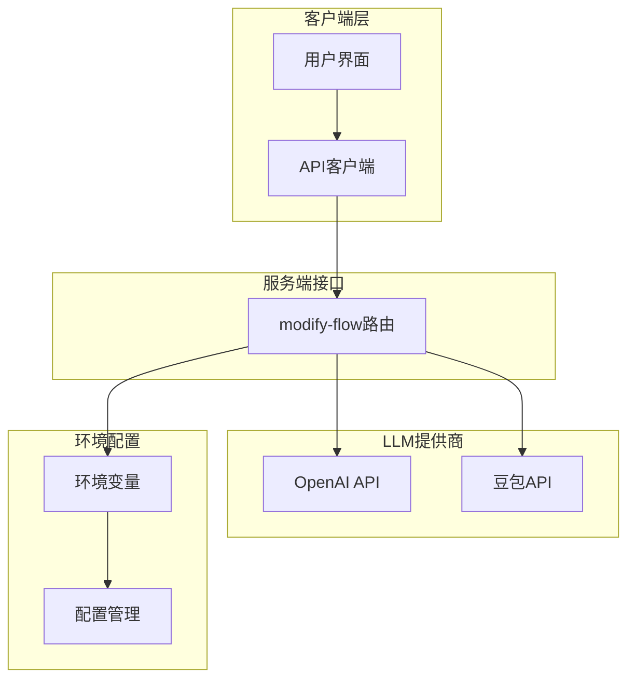
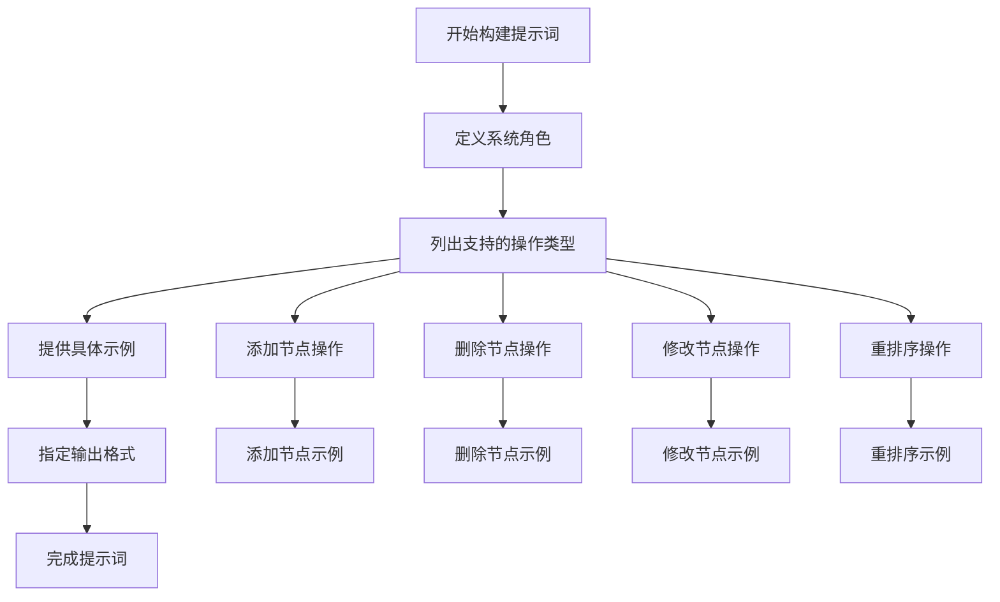
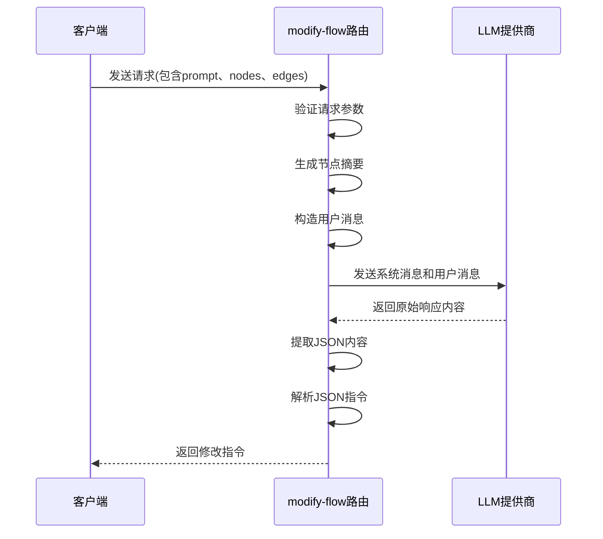
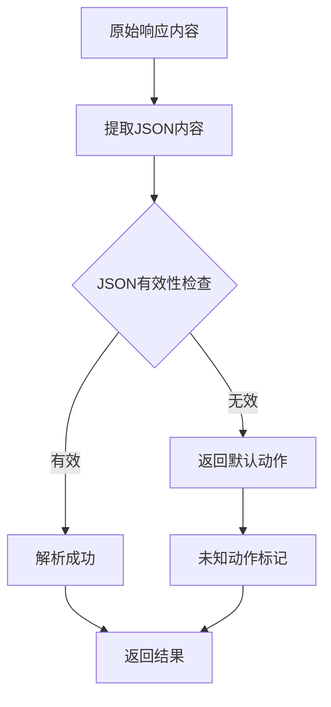

# /api/modify-flow 接口详细API文档

<cite>
**本文档中引用的文件**
- [route.ts](file://src/app/api/modify-flow/route.ts)
- [BrainBar.tsx](file://src/components/builder/BrainBar.tsx)
- [flow.ts](file://src/types/flow.ts)
- [validation.ts](file://src/utils/validation.ts)
- [copilotActions.ts](file://src/store/actions/copilotActions.ts)
- [run-node/route.ts](file://src/app/api/run-node/route.ts)
- [plan/route.ts](file://src/app/api/plan/route.ts)
- [package.json](file://package.json)
</cite>

## 目录
1. [简介](#简介)
2. [接口概述](#接口概述)
3. [请求规范](#请求规范)
4. [响应格式](#响应格式)
5. [LLM集成架构](#llm集成架构)
6. [系统提示词设计](#系统提示词设计)
7. [消息构造流程](#消息构造流程)
8. [API调用实现](#api调用实现)
9. [响应解析机制](#响应解析机制)
10. [错误处理机制](#错误处理机制)
11. [环境变量配置](#环境变量配置)
12. [安全考虑](#安全考虑)
13. [使用示例](#使用示例)
14. [故障排除指南](#故障排除指南)

## 简介

`/api/modify-flow` 是 Flash Flow SaaS 平台的核心API接口，专门用于处理工作流修改指令的生成。该接口通过自然语言描述自动生成对应的工作流节点操作指令，支持添加、删除、修改和重排序四种基本操作类型。接口采用RESTful设计，支持OpenAI和豆包(Doubao)两大LLM提供商，为用户提供智能化的工作流编辑体验。

## 接口概述

### 基本信息

| 属性 | 值 |
|------|-----|
| HTTP方法 | POST |
| 请求URL | `/api/modify-flow` |
| 内容类型 | `application/json` |
| 返回格式 | JSON对象 |

### 功能特性

- **智能指令生成**：基于自然语言描述生成工作流修改指令
- **多LLM支持**：兼容OpenAI GPT系列和豆包大模型
- **多种操作类型**：支持节点添加、删除、修改和重排序
- **实时响应**：快速返回处理结果，提升用户体验
- **错误恢复**：完善的错误处理和降级机制

## 请求规范

### 请求头

```http
Content-Type: application/json
```

### 请求体结构

| 字段名 | 类型 | 必填 | 描述 |
|--------|------|------|------|
| `prompt` | string | 是 | 用户描述的工作流修改需求 |
| `currentNodes` | Array | 是 | 当前工作流中的节点数组 |
| `currentEdges` | Array | 是 | 当前工作流中的边数组 |

#### 节点对象结构

```typescript
interface Node {
    id: string;
    type: NodeKind;
    position: { x: number; y: number };
    data: {
        label?: string;
        [key: string]: unknown;
    };
}
```

#### 边对象结构

```typescript
interface Edge {
    id: string;
    source: string;
    target: string;
    label?: string;
}
```

### 请求体示例

```json
{
    "prompt": "在第一个LLM节点后面添加一个RAG节点",
    "currentNodes": [
        {
            "id": "llm-1",
            "type": "llm",
            "position": { "x": 100, "y": 100 },
            "data": {
                "label": "LLM节点",
                "model": "gpt-4",
                "systemPrompt": "处理用户查询"
            }
        },
        {
            "id": "output-1",
            "type": "output",
            "position": { "x": 400, "y": 100 },
            "data": {
                "label": "输出节点",
                "text": "处理结果"
            }
        }
    ],
    "currentEdges": [
        {
            "id": "edge-1",
            "source": "llm-1",
            "target": "output-1"
        }
    ]
}
```

**节来源**
- [route.ts](file://src/app/api/modify-flow/route.ts#L4-L11)
- [flow.ts](file://src/types/flow.ts#L44-L51)

## 响应格式

### 成功响应

当请求成功时，接口返回包含修改指令的JSON对象：

```json
{
    "action": "add",
    "target": "llm-1",
    "position": "after",
    "nodeType": "rag",
    "nodeData": {
        "label": "RAG节点",
        "files": []
    }
}
```

### 响应字段说明

| 字段名 | 类型 | 描述 |
|--------|------|------|
| `action` | string | 操作类型：add、delete、modify、reorder |
| `target` | string | 目标节点ID或描述 |
| `nodeType` | string | 节点类型（仅适用于add操作） |
| `nodeData` | object | 新节点的数据配置（仅适用于add操作） |
| `position` | string | 位置关系：before、after（适用于add和reorder操作） |
| `changes` | object | 要修改的字段（仅适用于modify操作） |

### 支持的操作类型

#### 1. 添加节点 (add)
```json
{
    "action": "add",
    "nodeType": "llm",
    "target": "llm-1",
    "position": "after",
    "nodeData": {
        "model": "gpt-4",
        "systemPrompt": "处理用户查询",
        "temperature": 0.7
    }
}
```

#### 2. 删除节点 (delete)
```json
{
    "action": "delete",
    "target": "llm-2"
}
```

#### 3. 修改节点 (modify)
```json
{
    "action": "modify",
    "target": "llm-1",
    "changes": {
        "model": "gpt-4",
        "temperature": 0.5
    }
}
```

#### 4. 重排序节点 (reorder)
```json
{
    "action": "reorder",
    "target": "llm-1",
    "position": "before",
    "referenceNode": "llm-2"
}
```

**节来源**
- [route.ts](file://src/app/api/modify-flow/route.ts#L15-L38)

## LLM集成架构

Flash Flow平台采用模块化的LLM集成架构，支持多种大语言模型提供商：



**图表来源**
- [route.ts](file://src/app/api/modify-flow/route.ts#L12-L13)
- [run-node/route.ts](file://src/app/api/run-node/route.ts#L12-L13)

### 架构特点

1. **统一接口抽象**：无论使用哪种LLM提供商，都通过相同的接口进行调用
2. **动态提供商切换**：运行时根据环境变量自动选择合适的LLM服务
3. **配置驱动**：通过环境变量控制LLM提供商和模型参数
4. **错误隔离**：各LLM提供商的错误不会相互影响

**节来源**
- [route.ts](file://src/app/api/modify-flow/route.ts#L53-L84)

## 系统提示词设计

系统提示词是LLM指令生成的核心，精心设计的提示词确保生成的指令准确且符合预期：

### 提示词结构



**图表来源**
- [route.ts](file://src/app/api/modify-flow/route.ts#L15-L38)

### 关键设计要素

#### 1. 角色定位
- 明确LLM作为"工作流修改助手"的角色
- 强调需要返回JSON格式的修改指令

#### 2. 操作类型定义
详细说明每种操作类型的语法和必需参数：

| 操作类型 | 必需字段 | 可选字段 | 示例 |
|----------|----------|----------|------|
| add | nodeType, nodeData, target, position | - | `{action: "add", nodeType: "rag", ...}` |
| delete | target | - | `{action: "delete", target: "llm-2"}` |
| modify | target, changes | - | `{action: "modify", target: "llm-1", changes: {...}}` |
| reorder | target, position, referenceNode | - | `{action: "reorder", ...}` |

#### 3. 输出格式约束
- 严格要求返回JSON格式
- 禁止额外的解释性文本
- 提供具体的JSON结构示例

**节来源**
- [route.ts](file://src/app/api/modify-flow/route.ts#L15-L38)

## 消息构造流程

消息构造是将用户输入转换为LLM可理解格式的关键步骤：



**图表来源**
- [route.ts](file://src/app/api/modify-flow/route.ts#L40-L49)

### 节点摘要生成

系统将当前工作流中的节点信息转换为简洁的摘要格式：

```typescript
// 示例节点摘要格式
const nodesSummary = `
1. input (id: input-1, label: 输入节点)
2. llm (id: llm-1, label: LLM节点)
3. output (id: output-1, label: 输出节点)
`;
```

### 用户消息构建

用户消息包含完整的上下文信息：

```typescript
const userMsg = `
用户修改需求: ${prompt}

当前流程节点:
${nodesSummary}
`;
```

**节来源**
- [route.ts](file://src/app/api/modify-flow/route.ts#L40-L49)

## API调用实现

### OpenAI集成

对于OpenAI提供商，使用官方SDK进行API调用：

```typescript
// OpenAI客户端初始化
const client = new OpenAI({ apiKey: process.env.OPENAI_API_KEY || "" });

// 创建聊天完成请求
const completion = await client.chat.completions.create({
    model: "gpt-4o-mini",
    temperature: 0.1,
    messages: [
        { role: "system", content: system },
        { role: "user", content: userMsg }
    ]
});

// 获取响应内容
content = completion.choices?.[0]?.message?.content || "{}";
```

### 豆包集成

对于豆包提供商，使用HTTP API进行调用：

```typescript
// 豆包API调用
const resp = await fetch("https://ark.cn-beijing.volces.com/api/v3/chat/completions", {
    method: "POST",
    headers: {
        "Content-Type": "application/json",
        Authorization: `Bearer ${apiKey}`
    },
    body: JSON.stringify({
        model: model,
        messages: [
            { role: "system", content: system },
            { role: "user", content: userMsg }
        ],
        temperature: 0.1
    })
});

// 解析响应
const data = (await resp.json()) as { choices?: { message?: { content?: string } }[] };
content = data?.choices?.[0]?.message?.content || "{}";
```

**节来源**
- [route.ts](file://src/app/api/modify-flow/route.ts#L53-L84)

## 响应解析机制

为了确保返回结果的可靠性，系统实现了多层解析保护机制：



**图表来源**
- [route.ts](file://src/app/api/modify-flow/route.ts#L86-L96)

### JSON提取策略

系统使用正则表达式从LLM响应中提取JSON内容：

```typescript
// 提取JSON内容
let jsonText = content;
const match = content.match(/\{[\s\S]*\}/);
if (match) jsonText = match[0];

// 默认返回未知动作
let instruction: any = {};
try {
    instruction = JSON.parse(jsonText);
} catch {
    instruction = { action: "unknown" };
}
```

### 错误恢复机制

当JSON解析失败时，系统自动返回默认的"unknown"动作，确保接口的稳定性。

**节来源**
- [route.ts](file://src/app/api/modify-flow/route.ts#L86-L96)

## 错误处理机制

### 参数验证错误 (400)

当请求缺少必要字段时，返回400错误：

```typescript
if (!prompt || !currentNodes || !currentEdges) {
    return NextResponse.json({ error: "Missing required fields" }, { status: 400 });
}
```

### 服务器内部错误 (500)

当处理过程中发生异常时，返回500错误：

```typescript
catch (e) {
    console.error("Modify flow error:", e);
    return NextResponse.json({ error: "Failed to process modification" }, { status: 500 });
}
```

### LLM调用错误处理

- **网络超时**：设置合理的超时时间，避免长时间等待
- **API密钥无效**：优雅降级，提供默认响应
- **响应格式异常**：使用JSON提取机制确保解析成功

**节来源**
- [route.ts](file://src/app/api/modify-flow/route.ts#L9-L11)
- [route.ts](file://src/app/api/modify-flow/route.ts#L99-L102)

## 环境变量配置

### 核心配置项

| 环境变量 | 描述 | 默认值 | 示例 |
|----------|------|--------|------|
| `LLM_PROVIDER` | LLM提供商选择 | "openai" | "openai" \| "doubao" |
| `OPENAI_API_KEY` | OpenAI API密钥 | - | sk-... |
| `DOUBAO_API_KEY` | 豆包API密钥 | - | doubao-... |
| `DOUBAO_MODEL` | 豆包模型名称 | "doubao-pro-128k" | "doubao-pro-128k" |

### 配置示例

```bash
# OpenAI配置
LLM_PROVIDER=openai
OPENAI_API_KEY=sk-your-openai-api-key

# 豆包配置
LLM_PROVIDER=doubao
DOUBAO_API_KEY=doubao-your-doubao-api-key
DOUBAO_MODEL=doubao-pro-128k
```

### 配置加载机制

```typescript
const provider = (process.env.LLM_PROVIDER || "openai").toLowerCase();
const apiKey = provider === "doubao" 
    ? process.env.DOUBAO_API_KEY || ""
    : process.env.OPENAI_API_KEY || "";
```

**节来源**
- [route.ts](file://src/app/api/modify-flow/route.ts#L12-L13)
- [route.ts](file://src/app/api/modify-flow/route.ts#L53-L56)

## 安全考虑

### API密钥保护

1. **环境变量存储**：敏感信息存储在环境变量中，不在代码库中明文保存
2. **访问权限控制**：限制对环境变量的访问权限
3. **密钥轮换**：支持定期更换API密钥

### 输入验证

虽然当前实现主要依赖于LLM的输出验证，但建议增强输入验证：

```typescript
// 建议的输入验证（待实现）
const validateRequest = (body: any) => {
    if (!body.prompt || typeof body.prompt !== 'string') {
        throw new Error('Invalid prompt');
    }
    if (!Array.isArray(body.currentNodes)) {
        throw new Error('Invalid nodes array');
    }
    if (!Array.isArray(body.currentEdges)) {
        throw new Error('Invalid edges array');
    }
};
```

### 输出过滤

- **JSON提取**：防止恶意的非JSON响应
- **内容审查**：可考虑添加内容过滤机制
- **速率限制**：防止滥用API调用

### 认证授权

当前实现未包含认证机制，建议在生产环境中添加：

```typescript
// 建议的认证检查（待实现）
const isAuthenticated = async (req: Request) => {
    const authHeader = req.headers.get('Authorization');
    // 实现JWT或其他认证机制
    return authHeader?.startsWith('Bearer ') || false;
};
```

**节来源**
- [route.ts](file://src/app/api/modify-flow/route.ts#L12-L13)
- [plan/route.ts](file://src/app/api/plan/route.ts#L17-L48)

## 使用示例

### 基本使用场景

#### 场景1：添加节点
```javascript
const response = await fetch('/api/modify-flow', {
    method: 'POST',
    headers: { 'Content-Type': 'application/json' },
    body: JSON.stringify({
        prompt: '在第一个LLM节点后面添加一个RAG节点',
        currentNodes: [...],
        currentEdges: [...]
    })
});

const instruction = await response.json();
// 结果: { action: 'add', nodeType: 'rag', target: 'llm-1', position: 'after', ... }
```

#### 场景2：删除节点
```javascript
const response = await fetch('/api/modify-flow', {
    method: 'POST',
    headers: { 'Content-Type': 'application/json' },
    body: JSON.stringify({
        prompt: '删除第二个LLM节点',
        currentNodes: [...],
        currentEdges: [...]
    })
});

const instruction = await response.json();
// 结果: { action: 'delete', target: 'llm-2' }
```

#### 场景3：修改节点属性
```javascript
const response = await fetch('/api/modify-flow', {
    method: 'POST',
    headers: { 'Content-Type': 'application/json' },
    body: JSON.stringify({
        prompt: '把第一个LLM的模型改为gpt-4',
        currentNodes: [...],
        currentEdges: [...]
    })
});

const instruction = await response.json();
// 结果: { action: 'modify', target: 'llm-1', changes: { model: 'gpt-4' } }
```

### 前端集成示例

```typescript
// 在BrainBar组件中的使用
const handleModify = async () => {
    if (!prompt.trim()) return;
    setIsGenerating(true);
    
    try {
        const resp = await fetch("/api/modify-flow", {
            method: "POST",
            headers: { "Content-Type": "application/json" },
            body: JSON.stringify({
                prompt,
                currentNodes: nodes,
                currentEdges: edges,
            }),
        });
        
        const instruction = await resp.json();
        executeModification(instruction);
        setPrompt("");
    } catch (e) {
        console.error("Modification failed:", e);
    } finally {
        setIsGenerating(false);
    }
};
```

**节来源**
- [BrainBar.tsx](file://src/components/builder/BrainBar.tsx#L38-L62)

## 故障排除指南

### 常见问题及解决方案

#### 1. API密钥配置错误

**症状**：收到401或403错误
**原因**：API密钥未正确配置或无效
**解决方案**：
- 检查环境变量是否正确设置
- 验证API密钥的有效性
- 确认密钥具有相应的访问权限

#### 2. LLM响应格式异常

**症状**：返回的指令格式不正确
**原因**：LLM未能遵循JSON格式要求
**解决方案**：
- 检查系统提示词是否清晰明确
- 调整temperature参数（当前为0.1）
- 提供更具体的示例

#### 3. 节点ID匹配失败

**症状**：target字段无法识别节点
**原因**：节点ID格式不一致或不存在
**解决方案**：
- 确保节点ID唯一且格式正确
- 检查节点列表是否包含所有相关节点
- 验证节点ID与实际工作流一致

#### 4. 网络连接问题

**症状**：请求超时或网络错误
**原因**：网络不稳定或API服务不可用
**解决方案**：
- 检查网络连接状态
- 验证API服务端点地址
- 实现重试机制

### 调试技巧

#### 1. 启用详细日志
```typescript
console.log("Processing modify flow request");
console.log("Provider:", provider);
console.log("System prompt length:", system.length);
console.log("User message length:", userMsg.length);
```

#### 2. 验证输入数据
```typescript
console.log("Current nodes:", currentNodes.length);
console.log("Current edges:", currentEdges.length);
console.log("Prompt:", prompt);
```

#### 3. 检查LLM响应
```typescript
console.log("Raw LLM response:", content);
console.log("Extracted JSON:", jsonText);
console.log("Parsed instruction:", instruction);
```

### 性能优化建议

1. **缓存机制**：对于相似的修改请求，可以考虑缓存结果
2. **批量处理**：支持一次性处理多个修改请求
3. **异步处理**：对于复杂请求，可以采用异步处理模式
4. **资源限制**：设置合理的请求频率限制

**节来源**
- [route.ts](file://src/app/api/modify-flow/route.ts#L99-L102)

## 总结

`/api/modify-flow` 接口是Flash Flow平台智能化工作流编辑的核心组件，通过集成先进的LLM技术，为用户提供了直观、高效的可视化编程体验。该接口具备以下核心优势：

1. **智能化指令生成**：通过自然语言理解，将用户的口头描述转化为精确的代码指令
2. **多提供商支持**：灵活适配不同的LLM服务，确保服务的高可用性
3. **完善的错误处理**：多层次的错误检测和恢复机制，保证系统的稳定性
4. **安全可靠的架构**：采用环境变量管理敏感信息，实施必要的安全措施

随着AI技术的不断发展，该接口将继续演进，为用户提供更加智能、便捷的工作流编辑体验。