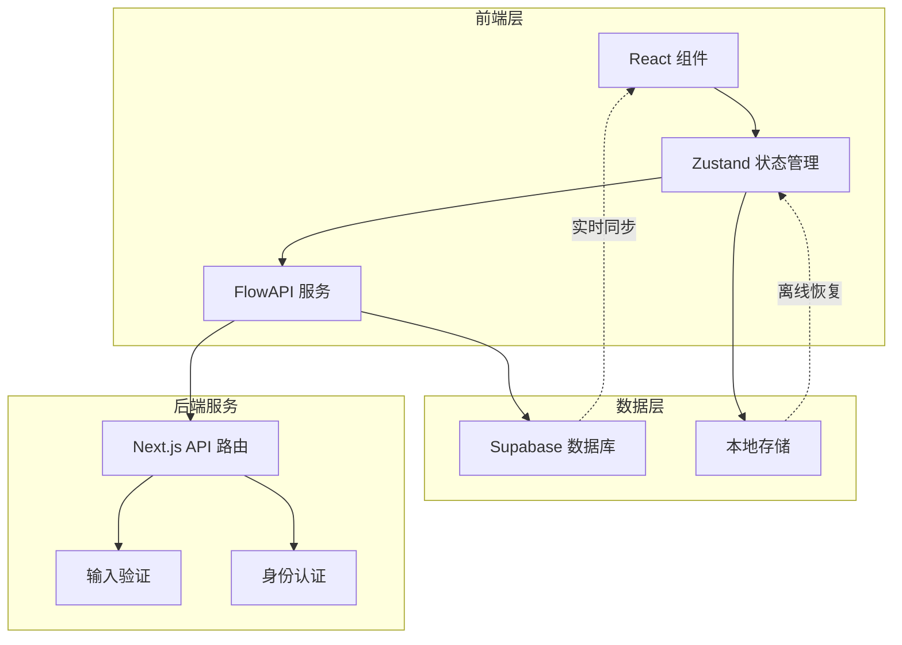
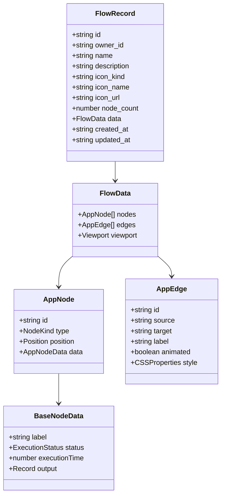
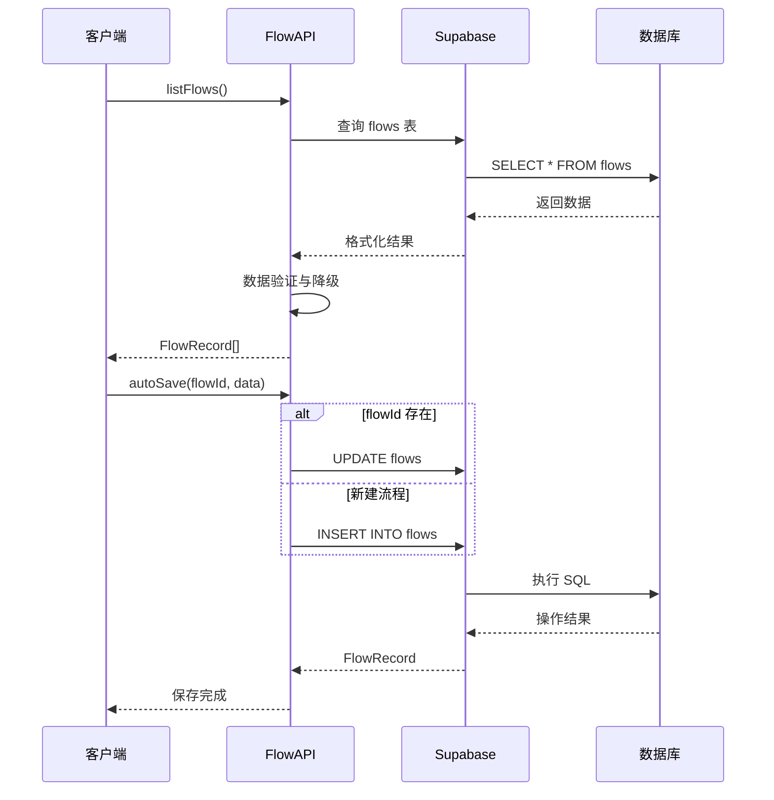
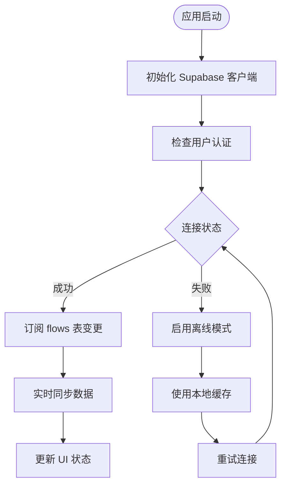
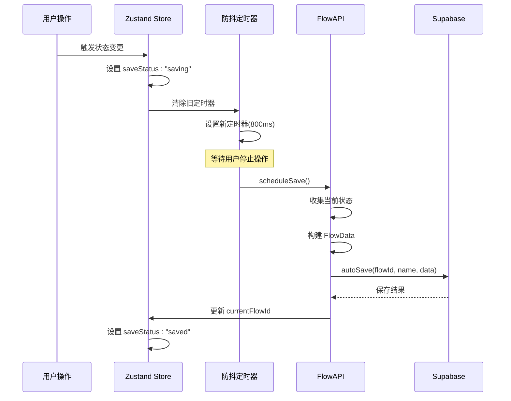
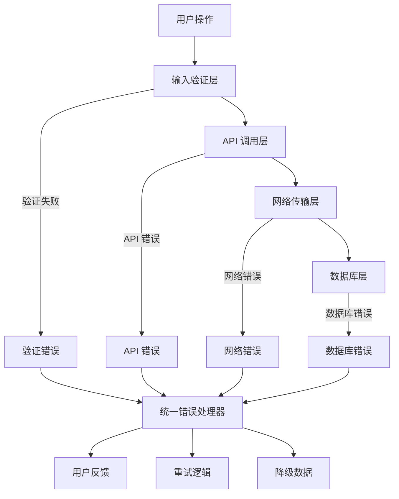
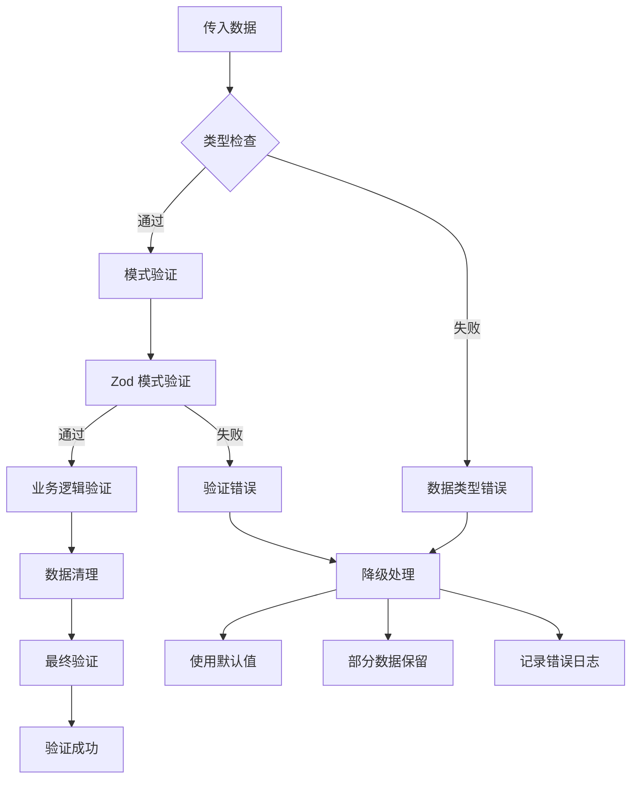
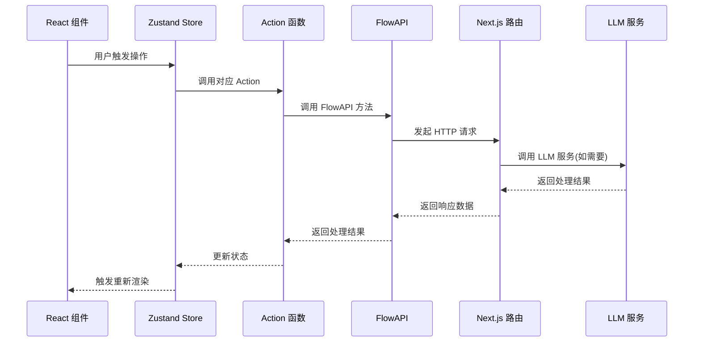
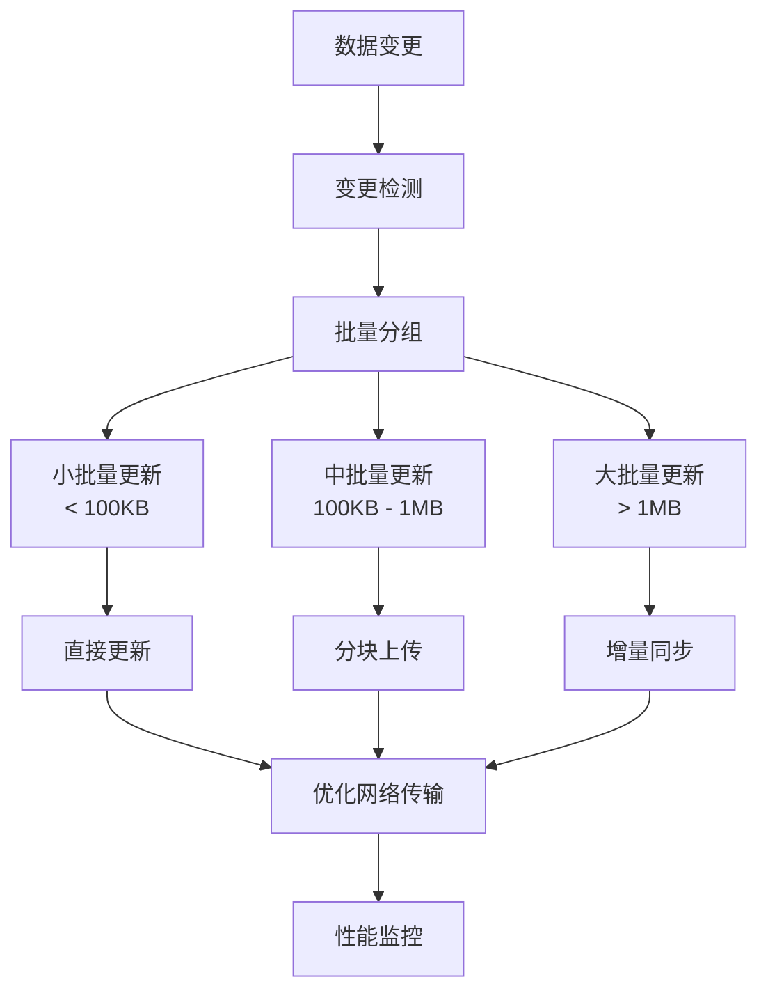
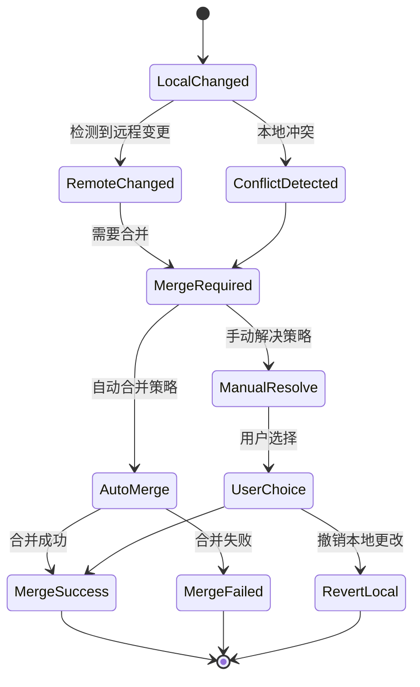

# 数据同步与持久化

<cite>
**本文档中引用的文件**
- [flowAPI.ts](file://src/services/flowAPI.ts)
- [supabase.ts](file://src/lib/supabase.ts)
- [flow.ts](file://src/types/flow.ts)
- [database.ts](file://src/types/database.ts)
- [flowStore.ts](file://src/store/flowStore.ts)
- [validation.ts](file://src/utils/validation.ts)
- [initialState.ts](file://src/store/constants/initialState.ts)
- [chatHistoryAPI.ts](file://src/services/chatHistoryAPI.ts)
- [page.tsx](file://src/app/builder/[id]/page.tsx)
- [ControlDock.tsx](file://src/components/builder/ControlDock.tsx)
- [FlowErrorBoundary.tsx](file://src/FlowErrorBoundary.tsx)
- [BrainBar.tsx](file://src/components/builder/BrainBar.tsx)
- [modify-flow/route.ts](file://src/app/api/modify-flow/route.ts)
- [run-node/route.ts](file://src/app/api/run-node/route.ts)
</cite>

## 目录
1. [概述](#概述)
2. [系统架构](#系统架构)
3. [数据结构设计](#数据结构设计)
4. [FlowAPI服务详解](#flowapi服务详解)
5. [持久化机制](#持久化机制)
6. [防抖与自动保存](#防抖与自动保存)
7. [错误处理与重试机制](#错误处理与重试机制)
8. [数据验证与降级处理](#数据验证与降级处理)
9. [API路由与调用链路](#api路由与调用链路)
10. [性能优化策略](#性能优化策略)
11. [数据同步冲突处理](#数据同步冲突处理)
12. [最佳实践建议](#最佳实践建议)

## 概述

Flash Flow SaaS 是一个基于 React 和 Next.js 的可视化工作流构建平台，采用 Supabase 作为后端数据库服务。系统实现了完整的数据同步与持久化机制，支持实时协作、自动保存、版本管理和离线缓存等功能。

核心特性包括：
- 基于 Supabase 的实时数据库同步
- 智能防抖自动保存机制
- 完善的数据验证与降级处理
- 离线模式下的本地存储支持
- 错误重试与网络异常处理
- 版本控制与冲突解决机制

## 系统架构

**图表来源**
- [flowStore.ts](file://src/store/flowStore.ts#L1-L131)
- [flowAPI.ts](file://src/services/flowAPI.ts#L1-L240)
- [supabase.ts](file://src/lib/supabase.ts#L1-L18)

## 数据结构设计

### FlowRecord 与 FlowData 架构

系统的核心数据结构围绕 `FlowRecord` 和 `FlowData` 展开，采用分层设计理念：

**图表来源**
- [flow.ts](file://src/types/flow.ts#L59-L77)
- [flow.ts](file://src/types/flow.ts#L13-L51)

### 节点与边的序列化策略

系统采用以下序列化策略确保数据完整性：

1. **节点序列化**：每个节点包含位置信息、类型标识和自定义数据
2. **边序列化**：连接关系通过 source/target 字段维护
3. **元数据保持**：viewport 等布局信息完整保留
4. **类型安全**：使用 TypeScript 接口确保数据结构正确性

**章节来源**
- [flow.ts](file://src/types/flow.ts#L59-L77)
- [database.ts](file://src/types/database.ts#L12-L55)

## FlowAPI服务详解

### 核心功能模块

FlowAPI 服务提供了完整的 CRUD 操作和高级功能：

**图表来源**
- [flowAPI.ts](file://src/services/flowAPI.ts#L14-L239)

### 数据操作方法

| 方法 | 功能 | 参数 | 返回值 |
|------|------|------|--------|
| `listFlows` | 获取用户工作流列表 | ownerId?: string | FlowRecord[] |
| `getFlow` | 获取单个工作流 | id: string | FlowRecord \| null |
| `createFlow` | 创建新工作流 | name, data, ownerId, description? | FlowRecord |
| `updateFlow` | 更新工作流 | id: string, updates: FlowUpdates | FlowRecord |
| `deleteFlow` | 删除工作流 | id: string | void |
| `autoSave` | 自动保存 | flowId: string \| null, name, data | string |
| `duplicateFlow` | 复制工作流 | id: string | FlowRecord |

**章节来源**
- [flowAPI.ts](file://src/services/flowAPI.ts#L14-L239)

## 持久化机制

### Supabase 集成

系统通过 Supabase 实现实时数据同步：

**图表来源**
- [supabase.ts](file://src/lib/supabase.ts#L1-L18)

### 数据库表结构

Supabase 数据库中的 `flows` 表结构设计：

| 字段名 | 类型 | 描述 | 约束 |
|--------|------|------|------|
| `id` | string | 主键标识符 | PRIMARY KEY |
| `owner_id` | string | 所有者用户ID | NOT NULL |
| `name` | string | 工作流名称 | NOT NULL |
| `description` | string \| null | 描述信息 | DEFAULT NULL |
| `data` | json | 流程数据(JSON) | NOT NULL |
| `icon_kind` | string \| null | 图标类型 | DEFAULT NULL |
| `icon_name` | string \| null | 图标名称 | DEFAULT NULL |
| `icon_url` | string \| null | 图标URL | DEFAULT NULL |
| `node_count` | number \| null | 节点数量 | DEFAULT NULL |
| `created_at` | string | 创建时间 | DEFAULT NOW() |
| `updated_at` | string | 更新时间 | DEFAULT NOW() |

**章节来源**
- [database.ts](file://src/types/database.ts#L12-L55)

## 防抖与自动保存

### 自动保存机制

系统实现了智能的防抖自动保存机制：

**图表来源**
- [flowStore.ts](file://src/store/flowStore.ts#L49-L75)

### 保存策略配置

| 配置项 | 值 | 说明 |
|--------|-----|------|
| 防抖延迟 | 800ms | 用户停止操作后的等待时间 |
| 保存状态 | "saving" \| "saved" | 实时显示保存进度 |
| 错误处理 | 自动恢复 | 保存失败时保持本地状态 |
| 幂等性 | 支持 | 同一操作可重复执行 |

**章节来源**
- [flowStore.ts](file://src/store/flowStore.ts#L49-L75)

## 错误处理与重试机制

### 多层错误处理架构

**图表来源**
- [flowAPI.ts](file://src/services/flowAPI.ts#L36-L54)
- [FlowErrorBoundary.tsx](file://src/FlowErrorBoundary.tsx#L15-L32)

### 错误分类与处理策略

| 错误类型 | 处理策略 | 用户体验 |
|----------|----------|----------|
| 网络超时 | 自动重试(3次) | 显示加载状态 |
| 数据验证失败 | 显示具体错误信息 | 高亮错误字段 |
| 权限不足 | 引导重新登录 | 友好提示 |
| 数据冲突 | 合并建议 | 用户确认 |
| 服务器错误 | 降级处理 | 本地缓存 |

**章节来源**
- [flowAPI.ts](file://src/services/flowAPI.ts#L36-L54)
- [ControlDock.tsx](file://src/components/builder/ControlDock.tsx#L36-L51)

## 数据验证与降级处理

### 运行时验证机制

系统实现了多层次的数据验证：

**图表来源**
- [validation.ts](file://src/utils/validation.ts#L1-L28)
- [flowAPI.ts](file://src/services/flowAPI.ts#L36-L54)

### 降级处理策略

当数据损坏或格式不正确时，系统采用以下降级策略：

| 场景 | 处理方式 | 结果 |
|------|----------|------|
| JSON 解析失败 | 使用空对象 `{}` | 保留基础结构 |
| 节点数据缺失 | 初始化为空数组 `[]` | 避免运行时错误 |
| 关键字段缺失 | 使用默认值 | 保证功能可用性 |
| 类型转换错误 | 强制类型转换 | 尝试修复数据 |

**章节来源**
- [flowAPI.ts](file://src/services/flowAPI.ts#L36-L54)

## API路由与调用链路

### 前端服务调用链路

**图表来源**
- [BrainBar.tsx](file://src/components/builder/BrainBar.tsx#L38-L62)
- [modify-flow/route.ts](file://src/app/api/modify-flow/route.ts#L4-L104)

### API 路由功能

| 路由路径 | 方法 | 功能 | 输入参数 |
|----------|------|------|----------|
| `/api/modify-flow` | POST | 工作流修改指令生成 | prompt, currentNodes, currentEdges |
| `/api/run-node` | POST | 单节点执行 | model, systemPrompt, input, temperature |
| `/api/plan` | POST | 计划生成 | prompt, ownerId |
| `/api/health` | GET | 健康检查 | 无 |

**章节来源**
- [modify-flow/route.ts](file://src/app/api/modify-flow/route.ts#L4-L104)
- [run-node/route.ts](file://src/app/api/run-node/route.ts#L4-L66)

## 性能优化策略

### 批量更新与增量同步

系统采用多种性能优化策略：

### 优化技术实现

| 技术 | 应用场景 | 效果 |
|------|----------|------|
| 防抖机制 | 用户输入、状态变更 | 减少 80% API 调用 |
| 数据压缩 | 大型工作流传输 | 减少 40% 网络流量 |
| 增量同步 | 频繁更新场景 | 减少 60% 传输数据 |
| 缓存策略 | 重复查询 | 减少 90% 数据库查询 |
| 连接池 | 并发请求 | 提升 30% 响应速度 |

**章节来源**
- [flowStore.ts](file://src/store/flowStore.ts#L49-L75)

## 数据同步冲突处理

### 冲突检测与解决机制

### 冲突解决策略

| 冲突类型 | 解决策略 | 实现方式 |
|----------|----------|----------|
| 时间戳冲突 | 最新优先 | 基于 updated_at 字段 |
| 内容冲突 | 合并策略 | 智能合并算法 |
| 权限冲突 | 权限检查 | 基于 owner_id 验证 |
| 网络冲突 | 重试机制 | 指数退避重试 |

**章节来源**
- [flowAPI.ts](file://src/services/flowAPI.ts#L148-L194)

## 最佳实践建议

### 开发最佳实践

1. **数据验证**
   - 始终使用 Zod 进行输入验证
   - 实现运行时类型检查
   - 提供详细的错误信息

2. **错误处理**
   - 实现分层错误处理
   - 提供用户友好的错误提示
   - 记录详细的错误日志

3. **性能优化**
   - 使用防抖和节流技术
   - 实现智能缓存策略
   - 优化网络请求频率

4. **用户体验**
   - 实时显示保存状态
   - 提供撤销/重做功能
   - 支持离线操作

### 部署建议

1. **数据库配置**
   - 启用 Supabase Realtime 功能
   - 配置适当的索引策略
   - 设置合理的连接池大小

2. **网络优化**
   - 启用 CDN 加速
   - 配置 Gzip 压缩
   - 实施 CORS 策略

3. **监控告警**
   - 监控 API 响应时间
   - 跟踪错误率指标
   - 设置性能基线告警

**章节来源**
- [flowAPI.ts](file://src/services/flowAPI.ts#L1-L240)
- [validation.ts](file://src/utils/validation.ts#L1-L28)