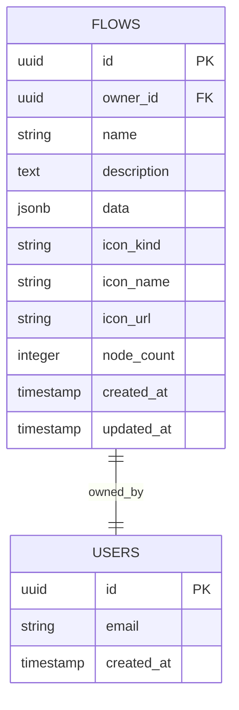
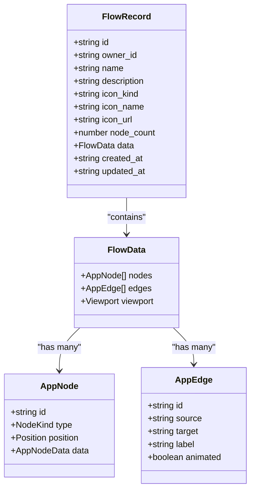
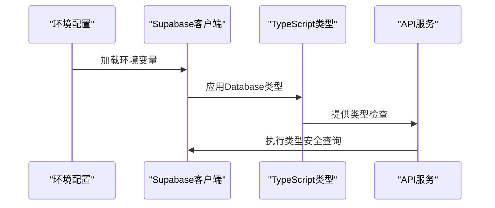
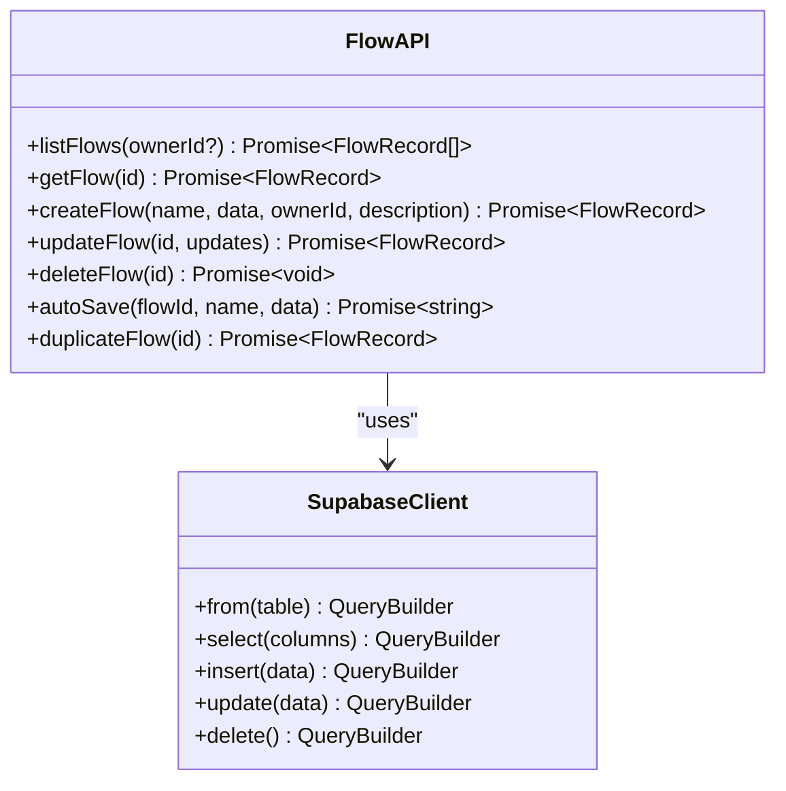
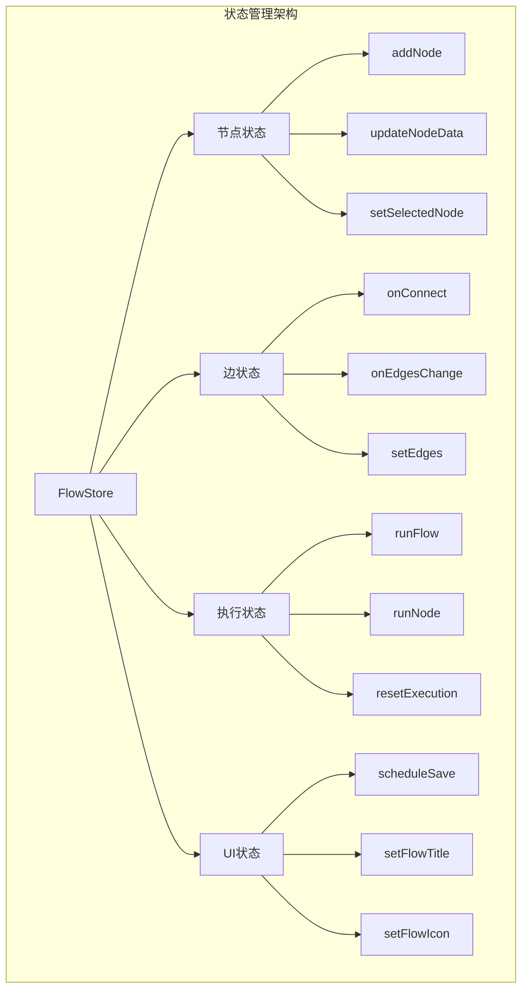
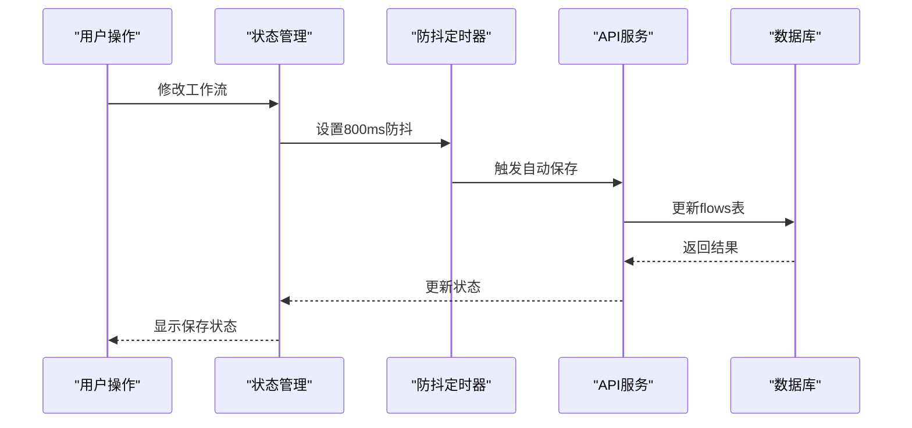
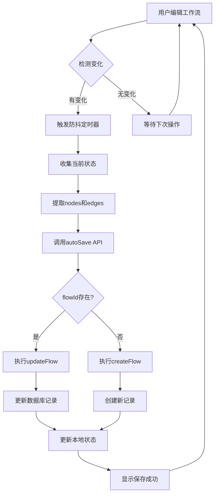
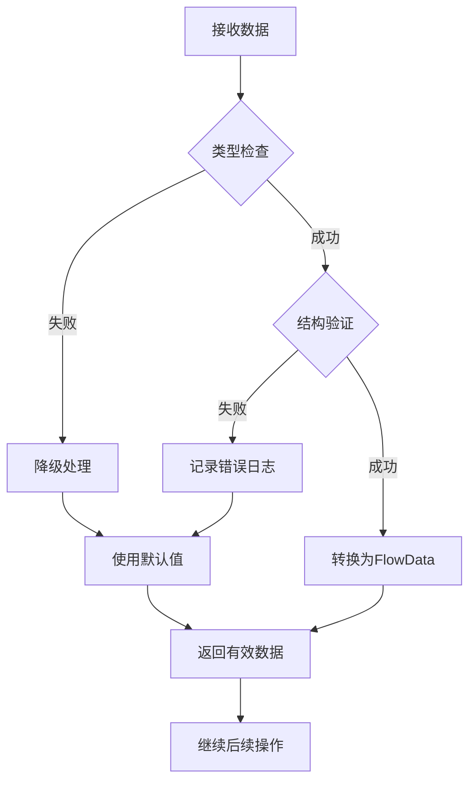
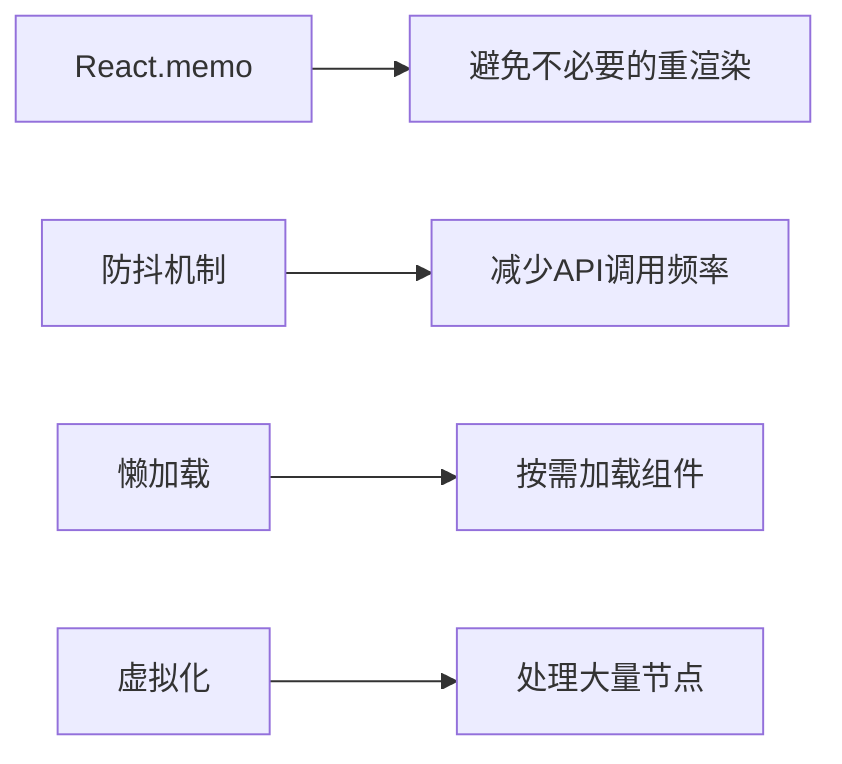

# 数据模型与持久化

<cite>
**本文档引用的文件**
- [src/types/database.ts](file://src/types/database.ts)
- [src/types/flow.ts](file://src/types/flow.ts)
- [src/lib/supabase.ts](file://src/lib/supabase.ts)
- [src/services/flowAPI.ts](file://src/services/flowAPI.ts)
- [src/store/flowStore.ts](file://src/store/flowStore.ts)
- [src/app/flows/page.tsx](file://src/app/flows/page.tsx)
- [src/app/builder/[id]/page.tsx](file://src/app/builder/[id]/page.tsx)
- [src/components/flow/CustomNode.tsx](file://src/components/flow/CustomNode.tsx)
</cite>

## 目录
1. [简介](#简介)
2. [Supabase数据库架构](#supabase数据库架构)
3. [核心数据模型](#核心数据模型)
4. [FlowData结构详解](#flowdata结构详解)
5. [类型安全实现](#类型安全实现)
6. [数据库操作接口](#数据库操作接口)
7. [前端状态管理](#前端状态管理)
8. [数据持久化流程](#数据持久化流程)
9. [错误处理与验证](#错误处理与验证)
10. [性能优化策略](#性能优化策略)

## 简介

Flash Flow SaaS是一个基于React和Next.js构建的工作流可视化编辑器，采用Supabase作为后端数据库服务。系统通过精心设计的数据模型实现了复杂的工作流图形结构的存储、检索和管理，支持多种节点类型和动态连接关系。

本文档详细阐述了系统的核心数据模型设计，包括Supabase数据库的flows表结构、FlowData的JSON存储格式、类型安全的TypeScript实现，以及完整的数据持久化流程。

## Supabase数据库架构

### flows表结构设计

系统使用Supabase的PostgreSQL数据库存储工作流数据，核心的flows表具有以下字段定义：



**图表来源**
- [src/types/database.ts](file://src/types/database.ts#L12-L25)

### 字段详细说明

| 字段名 | 类型 | 描述 | 约束 |
|--------|------|------|------|
| `id` | UUID | 主键标识符，自动生成 | PRIMARY KEY |
| `owner_id` | UUID | 工作者ID，关联用户认证 | NOT NULL |
| `name` | VARCHAR(255) | 工作流名称 | NOT NULL |
| `description` | TEXT | 工作流描述信息 | NULLABLE |
| `data` | JSONB | 存储节点和边的完整工作流数据 | NOT NULL |
| `icon_kind` | VARCHAR(50) | 图标类型（emoji/lucide/image） | NULLABLE |
| `icon_name` | VARCHAR(255) | 图标名称或标识符 | NULLABLE |
| `icon_url` | TEXT | 自定义图标URL | NULLABLE |
| `node_count` | INTEGER | 节点数量统计 | NULLABLE |
| `created_at` | TIMESTAMP | 创建时间戳 | DEFAULT NOW() |
| `updated_at` | TIMESTAMP | 更新时间戳 | DEFAULT NOW() |

**章节来源**
- [src/types/database.ts](file://src/types/database.ts#L12-L25)

## 核心数据模型

### FlowRecord接口定义

系统定义了FlowRecord接口来统一表示数据库中的工作流记录：



**图表来源**
- [src/types/flow.ts](file://src/types/flow.ts#L65-L77)
- [src/types/flow.ts](file://src/types/flow.ts#L59-L63)

### 节点类型系统

系统支持六种核心节点类型，每种类型都有特定的数据结构：

| 节点类型 | 接口定义 | 主要属性 | 用途描述 |
|----------|----------|----------|----------|
| `input` | InputNodeData | `text: string` | 输入数据节点 |
| `llm` | LLMNodeData | `model: string`, `systemPrompt: string`, `temperature: number` | 大语言模型节点 |
| `rag` | RAGNodeData | `files: FileInfo[]` | 检索增强生成节点 |
| `output` | OutputNodeData | `text: string` | 输出结果节点 |
| `branch` | BaseNodeData | `label: string` | 条件分支节点 |
| `http` | HttpNodeData | `method: string`, `url: string` | HTTP请求节点 |

**章节来源**
- [src/types/flow.ts](file://src/types/flow.ts#L3-L9)
- [src/types/flow.ts](file://src/types/flow.ts#L13-L42)

## FlowData结构详解

### JSON存储格式设计

FlowData采用JSON格式存储整个工作流的图形结构，包含节点数组和边数组：

```mermaid
graph TB
subgraph "FlowData JSON结构"
A[FlowData] --> B[nodes: AppNode[]]
A --> C[edges: AppEdge[]]
A --> D[viewport?: Viewport]
B --> E[Node 1]
B --> F[Node 2]
B --> G[Node N]
C --> H[Edge 1]
C --> I[Edge 2]
C --> J[Edge M]
E --> K[基础属性]
E --> L[类型特定数据]
K --> M[id: string]
K --> N[position: {x, y}]
K --> O[data: NodeData]
L --> P[LLM: model, prompt, temp]
L --> Q[RAG: files, embeddings]
L --> R[HTTP: method, url]
end
```

**图表来源**
- [src/types/flow.ts](file://src/types/flow.ts#L59-L63)

### 节点数据结构

每个节点包含以下核心信息：

```typescript
interface AppNode {
  id: string;           // 唯一标识符
  type: NodeKind;       // 节点类型
  position: {           // 位置坐标
    x: number;
    y: number;
  };
  data: AppNodeData;    // 节点配置数据
}
```

### 边数据结构

边连接节点形成工作流图：

```typescript
interface AppEdge {
  id: string;           // 唯一标识符
  source: string;       // 源节点ID
  target: string;       // 目标节点ID
  label?: string;       // 边标签
  animated?: boolean;   // 是否动画显示
  style?: CSSProperties;// 样式配置
}
```

**章节来源**
- [src/types/flow.ts](file://src/types/flow.ts#L46-L51)

## 类型安全实现

### Supabase客户端配置

系统通过类型安全的方式配置Supabase客户端：



**图表来源**
- [src/lib/supabase.ts](file://src/lib/supabase.ts#L12)

### 类型映射关系

系统建立了完整的类型映射体系：

| 前端类型 | 数据库类型 | 映射方式 | 验证机制 |
|----------|------------|----------|----------|
| FlowRecord | flows.Row | 直接映射 | 运行时验证 |
| FlowData | flows.data | JSON序列化 | 结构验证 |
| AppNode | 节点对象 | 类型断言 | 编译时检查 |
| AppEdge | 边对象 | 类型断言 | 编译时检查 |

**章节来源**
- [src/lib/supabase.ts](file://src/lib/supabase.ts#L1-L18)
- [src/types/database.ts](file://src/types/database.ts#L9-L58)

## 数据库操作接口

### flowAPI服务层设计

系统提供了完整的数据库操作接口，封装了所有CRUD操作：



**图表来源**
- [src/services/flowAPI.ts](file://src/services/flowAPI.ts#L10-L240)

### 查询操作详解

系统支持多种查询模式：

1. **列表查询**：按更新时间排序，可过滤所有者
2. **单条查询**：精确匹配ID，返回完整记录
3. **创建操作**：自动计算节点数量，设置时间戳
4. **更新操作**：部分更新，支持图标字段的null值处理
5. **删除操作**：级联删除相关数据

**章节来源**
- [src/services/flowAPI.ts](file://src/services/flowAPI.ts#L14-L240)

## 前端状态管理

### Zustand状态架构

系统使用Zustand管理复杂的状态逻辑：



**图表来源**
- [src/store/flowStore.ts](file://src/store/flowStore.ts#L17-L131)

### 自动保存机制

系统实现了智能的自动保存功能：



**图表来源**
- [src/store/flowStore.ts](file://src/store/flowStore.ts#L50-L74)

**章节来源**
- [src/store/flowStore.ts](file://src/store/flowStore.ts#L17-L131)

## 数据持久化流程

### 完整的保存流程

系统实现了从用户操作到数据库存储的完整流程：



**图表来源**
- [src/store/flowStore.ts](file://src/store/flowStore.ts#L50-L74)
- [src/services/flowAPI.ts](file://src/services/flowAPI.ts#L211-L224)

### 数据同步策略

系统采用乐观锁策略确保数据一致性：

1. **版本控制**：通过updated_at字段跟踪版本
2. **冲突检测**：比较本地和服务器版本
3. **合并策略**：优先保留最新修改
4. **回滚机制**：保存失败时恢复到上一个有效状态

**章节来源**
- [src/services/flowAPI.ts](file://src/services/flowAPI.ts#L211-L224)

## 错误处理与验证

### 运行时验证机制

系统实现了多层次的验证机制：



**图表来源**
- [src/services/flowAPI.ts](file://src/services/flowAPI.ts#L37-L54)

### 错误恢复策略

系统针对不同类型的错误采用相应的恢复策略：

| 错误类型 | 恢复策略 | 用户体验 |
|----------|----------|----------|
| 数据损坏 | 使用默认空工作流 | 继续编辑 |
| 网络异常 | 本地缓存重试 | 稍后重试提示 |
| 权限不足 | 引导重新登录 | 认证流程 |
| 数据冲突 | 合并最近修改 | 冲突解决界面 |

**章节来源**
- [src/services/flowAPI.ts](file://src/services/flowAPI.ts#L37-L54)

## 性能优化策略

### 数据压缩与索引

系统通过以下策略优化数据库性能：

1. **JSONB存储**：利用PostgreSQL的JSONB类型进行高效存储
2. **部分索引**：对常用查询字段建立索引
3. **查询优化**：使用LIMIT和OFFSET进行分页
4. **缓存策略**：前端缓存常用数据

### 前端性能优化



**图表来源**
- [src/components/flow/CustomNode.tsx](file://src/components/flow/CustomNode.tsx#L28-L40)

### 内存管理

系统实现了智能的内存管理策略：

1. **状态分割**：将大型状态拆分为独立模块
2. **垃圾回收**：及时清理不再使用的数据
3. **引用优化**：避免深层嵌套的对象引用
4. **批量操作**：合并多个小操作为批量操作

**章节来源**
- [src/components/flow/CustomNode.tsx](file://src/components/flow/CustomNode.tsx#L28-L40)

## 总结

Flash Flow SaaS通过精心设计的数据模型和完善的类型安全体系，实现了复杂工作流图形的高效存储和管理。系统采用JSONB格式存储图形数据，结合Supabase的强类型支持，确保了数据的一致性和可靠性。通过智能的自动保存机制和完善的错误处理策略，系统为用户提供了流畅的使用体验。

这种设计不仅保证了系统的可扩展性，还为未来的功能增强奠定了坚实的基础。开发者可以基于现有的类型定义轻松添加新的节点类型和功能特性，而无需担心数据模型的兼容性问题。