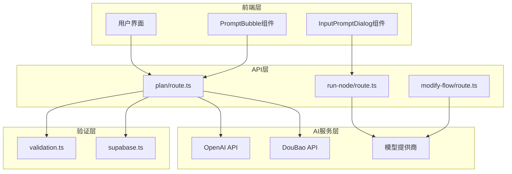
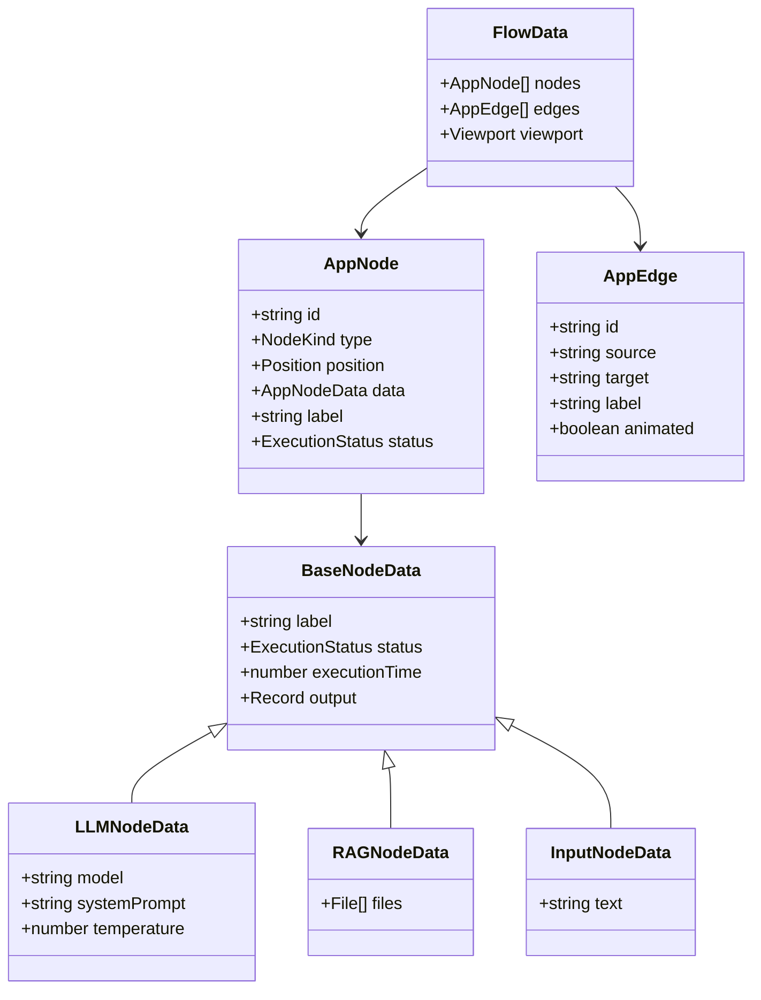
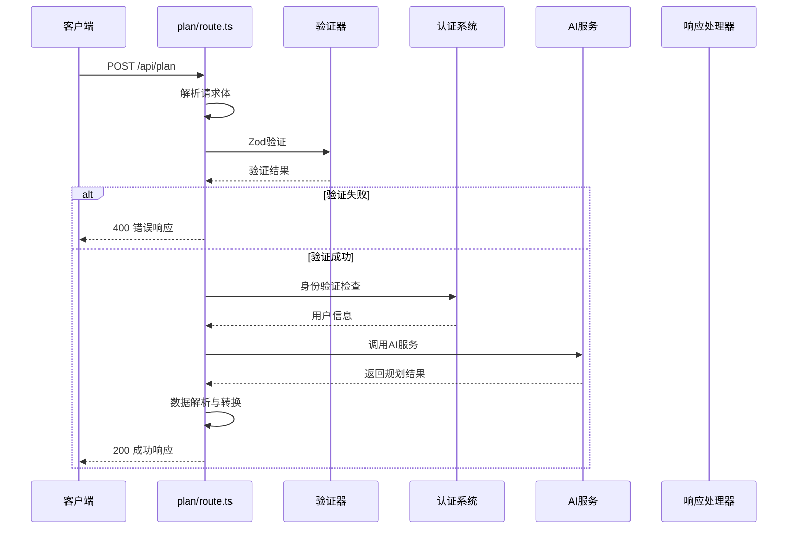
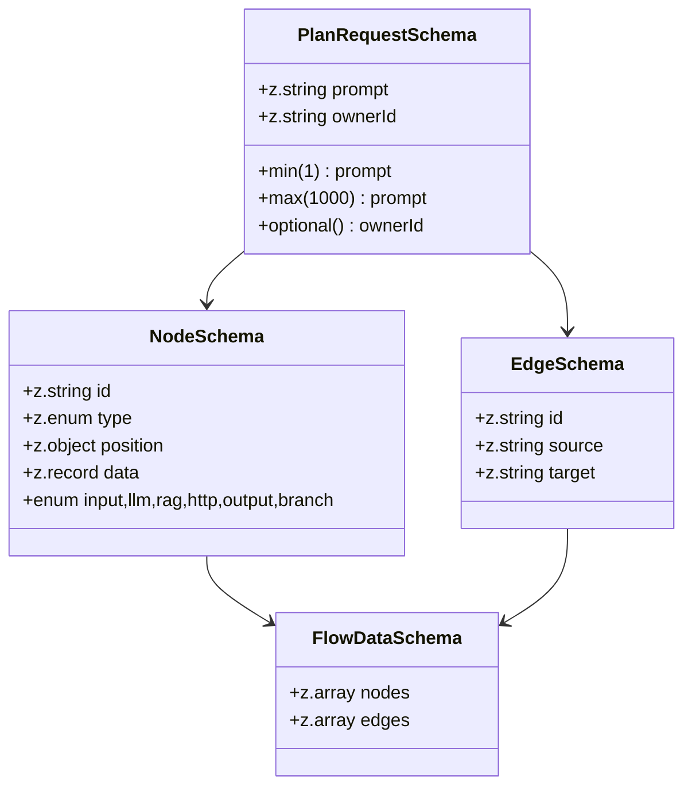
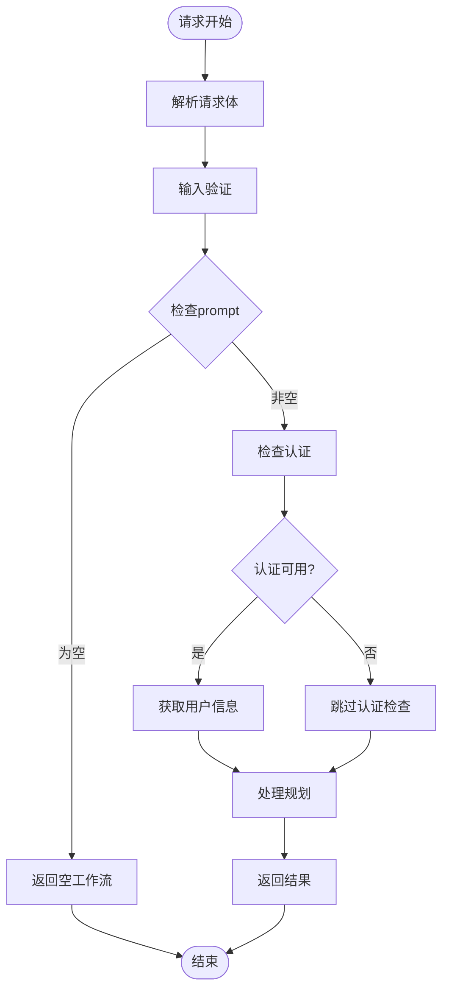
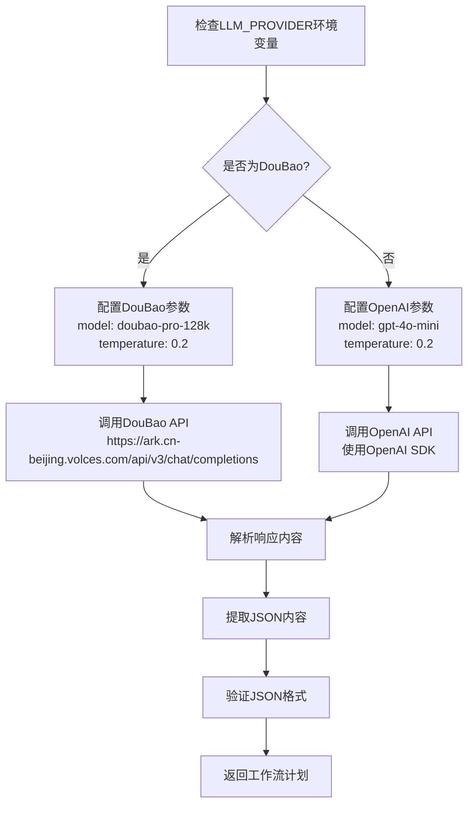
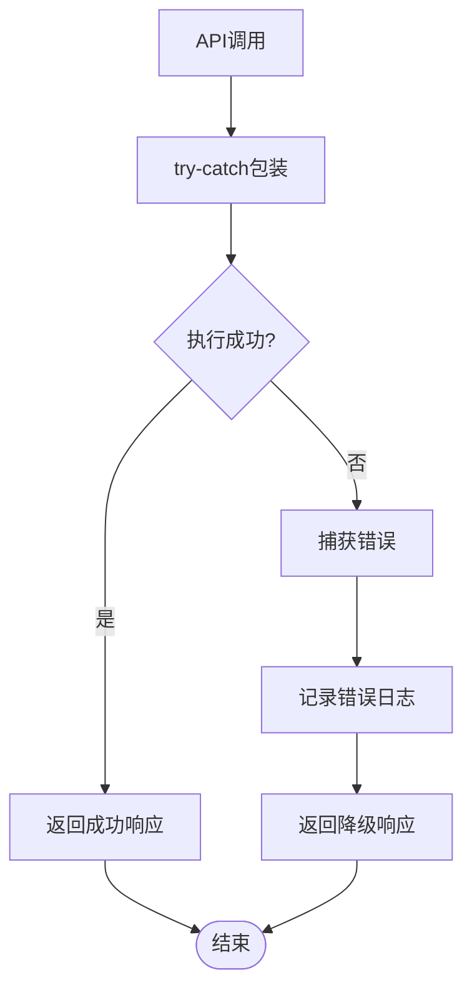
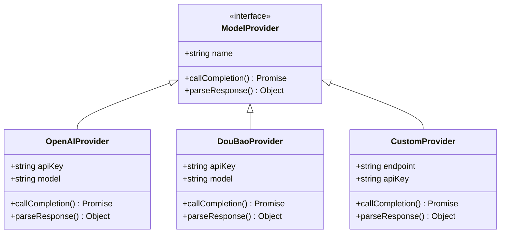

# AI集成

<cite>
**本文档中引用的文件**
- [src/app/api/plan/route.ts](file://src/app/api/plan/route.ts)
- [src/utils/validation.ts](file://src/utils/validation.ts)
- [src/lib/supabase.ts](file://src/lib/supabase.ts)
- [src/types/flow.ts](file://src/types/flow.ts)
- [src/app/api/run-node/route.ts](file://src/app/api/run-node/route.ts)
- [src/app/api/modify-flow/route.ts](file://src/app/api/modify-flow/route.ts)
- [src/components/ui/prompt-bubble.tsx](file://src/components/ui/prompt-bubble.tsx)
- [src/components/flow/InputPromptDialog.tsx](file://src/components/flow/InputPromptDialog.tsx)
</cite>

## 目录
1. [简介](#简介)
2. [项目架构概览](#项目架构概览)
3. [核心组件分析](#核心组件分析)
4. [API接口详细分析](#api接口详细分析)
5. [输入验证机制](#输入验证机制)
6. [身份识别与认证](#身份识别与认证)
7. [AI服务调用逻辑](#ai服务调用逻辑)
8. [错误处理与响应格式](#错误处理与响应格式)
9. [扩展性设计](#扩展性设计)
10. [性能考虑](#性能考虑)
11. [故障排除指南](#故障排除指南)
12. [总结](#总结)

## 简介

Flash Flow SaaS 是一个基于Next.js构建的工作流自动化平台，其AI集成功能通过 `/api/plan` 接口实现智能工作流规划。该接口作为AI规划入口，能够根据用户提供的自然语言描述生成结构化的节点和边数据，支持多种AI模型供应商，并具备完善的输入验证、身份认证和错误处理机制。

## 项目架构概览

系统采用分层架构设计，主要包含前端界面层、API路由层和AI服务层：

**图表来源**
- [src/app/api/plan/route.ts](file://src/app/api/plan/route.ts#L1-L123)
- [src/utils/validation.ts](file://src/utils/validation.ts#L1-L28)
- [src/lib/supabase.ts](file://src/lib/supabase.ts#L1-L18)

## 核心组件分析

### 工作流数据结构

系统定义了完整的工作流数据结构，支持多种节点类型：

**图表来源**
- [src/types/flow.ts](file://src/types/flow.ts#L1-L153)

**章节来源**
- [src/types/flow.ts](file://src/types/flow.ts#L1-L153)

## API接口详细分析

### /api/plan 接口架构

`/api/plan` 接口作为AI规划入口，遵循RESTful设计原则，提供以下功能特性：

**图表来源**
- [src/app/api/plan/route.ts](file://src/app/api/plan/route.ts#L6-L123)

### 请求处理流程

接口处理流程包含以下关键步骤：

1. **请求解析**：解析JSON请求体
2. **输入验证**：使用Zod进行严格验证
3. **身份检查**：验证用户身份（待完善）
4. **AI调用**：根据配置调用相应AI服务
5. **结果处理**：解析和标准化输出

**章节来源**
- [src/app/api/plan/route.ts](file://src/app/api/plan/route.ts#L6-L123)

## 输入验证机制

### Zod Schema定义

系统使用Zod库实现强类型验证，确保输入数据的完整性和安全性：

**图表来源**
- [src/utils/validation.ts](file://src/utils/validation.ts#L1-L28)

### 验证规则详解

| 字段 | 类型 | 验证规则 | 错误消息 |
|------|------|----------|----------|
| prompt | string | min(1), max(1000) | "Prompt cannot be empty", "Prompt is too long" |
| ownerId | string | optional() | 可选字段，忽略后端使用认证用户 |

**章节来源**
- [src/utils/validation.ts](file://src/utils/validation.ts#L1-L28)

## 身份识别与认证

### 当前认证状态

系统在认证方面存在改进空间：

**图表来源**
- [src/app/api/plan/route.ts](file://src/app/api/plan/route.ts#L17-L49)

### 认证集成预留

代码中预留了完整的认证集成方案：

- 使用 `supabase.auth.getUser()` 进行用户验证
- 支持会话令牌传递
- 提供401未授权响应
- 支持ownerId字段的未来扩展

**章节来源**
- [src/app/api/plan/route.ts](file://src/app/api/plan/route.ts#L17-L49)

## AI服务调用逻辑

### 多模型供应商支持

系统设计支持多种AI模型供应商，具备良好的扩展性：

**图表来源**
- [src/app/api/plan/route.ts](file://src/app/api/plan/route.ts#L51-L118)

### AI提示词工程

系统实现了精心设计的提示词模板：

| 系统提示词部分 | 内容描述 | 目标 |
|----------------|----------|------|
| 角色定义 | 工作流规划器 | 明确AI角色定位 |
| 输出要求 | 严格JSON格式 | 确保可解析性 |
| 节点类型限制 | input, llm, rag, http, output | 控制节点种类 |
| 边关系验证 | 必须引用有效节点ID | 保证图结构正确 |
| 参数范围控制 | temperature [0,1] | 优化生成质量 |

**章节来源**
- [src/app/api/plan/route.ts](file://src/app/api/plan/route.ts#L52-L68)

## 错误处理与响应格式

### 错误响应码体系

系统定义了完整的错误响应码体系：

| HTTP状态码 | 场景 | 响应格式 |
|------------|------|----------|
| 400 | 输入验证失败 | `{ error: "Invalid input", details: ValidationError }` |
| 200 | AI服务异常 | `{ nodes: [], edges: [] }` |
| 500 | 其他服务器错误 | `{ error: "Execution failed", details: errorMessage }` |

### 错误处理策略

**图表来源**
- [src/app/api/plan/route.ts](file://src/app/api/plan/route.ts#L119-L122)

**章节来源**
- [src/app/api/plan/route.ts](file://src/app/api/plan/route.ts#L119-L122)

## 扩展性设计

### 多模型供应商路由

系统设计支持未来的模型供应商扩展：

### 扩展点设计

1. **环境变量配置**：`LLM_PROVIDER` 动态切换
2. **模型映射**：不同供应商的模型名称映射
3. **错误处理**：统一的错误处理接口
4. **响应标准化**：统一的响应格式

**章节来源**
- [src/app/api/plan/route.ts](file://src/app/api/plan/route.ts#L51-L52)

## 性能考虑

### 响应时间优化

系统在多个层面考虑性能优化：

1. **输入验证前置**：快速失败机制
2. **条件文件获取**：仅在认证通过时获取文件
3. **JSON解析优化**：正则表达式提取JSON内容
4. **降级策略**：AI服务失败时返回空工作流

### 并发处理能力

- 单个请求独立处理
- 不同AI供应商的并发调用
- 异步处理避免阻塞

## 故障排除指南

### 常见问题诊断

| 问题类型 | 症状 | 解决方案 |
|----------|------|----------|
| 输入验证失败 | 400错误，提示字段无效 | 检查prompt长度和格式 |
| 认证失败 | 401未授权 | 验证Supabase配置 |
| AI服务超时 | 响应缓慢或失败 | 检查API密钥和网络连接 |
| JSON解析错误 | 返回空工作流 | 检查AI输出格式 |

### 调试建议

1. **启用详细日志**：在开发环境中开启详细错误信息
2. **环境变量检查**：验证所有必要的API密钥
3. **网络连通性测试**：确保AI服务端点可达
4. **输入数据验证**：使用最小有效输入测试

**章节来源**
- [src/app/api/plan/route.ts](file://src/app/api/plan/route.ts#L119-L122)

## 总结

Flash Flow SaaS 的AI集成功能展现了现代Web应用中AI服务集成的最佳实践。通过 `/api/plan` 接口，系统实现了：

1. **完整的输入验证链**：使用Zod确保数据完整性
2. **灵活的身份认证机制**：支持多种认证方式
3. **多供应商AI服务支持**：OpenAI和DouBao的无缝切换
4. **健壮的错误处理**：多层次的错误恢复策略
5. **良好的扩展性设计**：为未来功能扩展预留空间

该实现不仅满足了当前的功能需求，更为系统的长期发展奠定了坚实的技术基础。通过持续的优化和扩展，该AI集成模块将成为Flash Flow SaaS平台的核心竞争力之一。