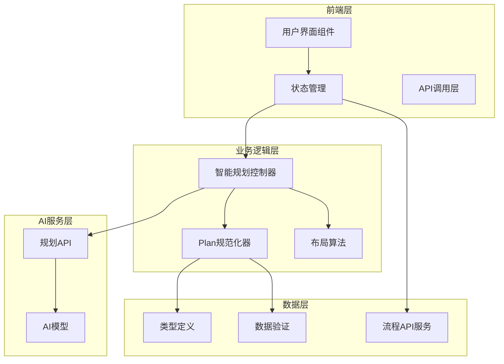
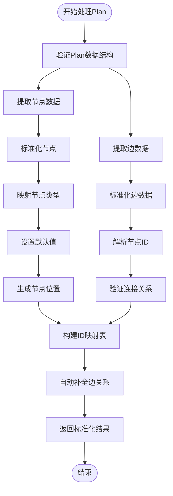
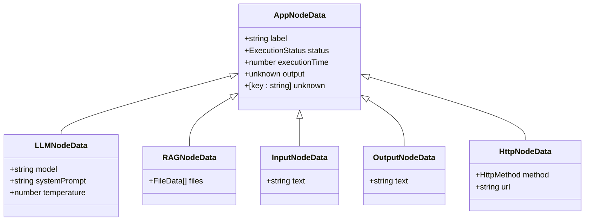
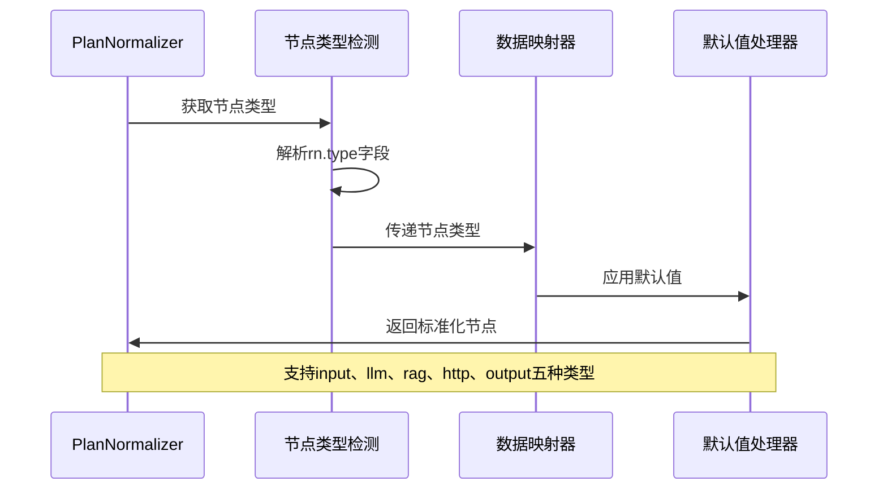
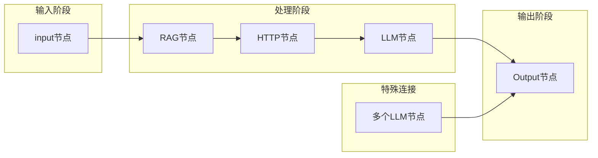
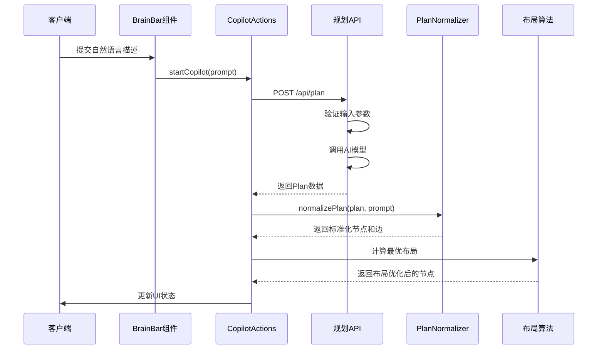
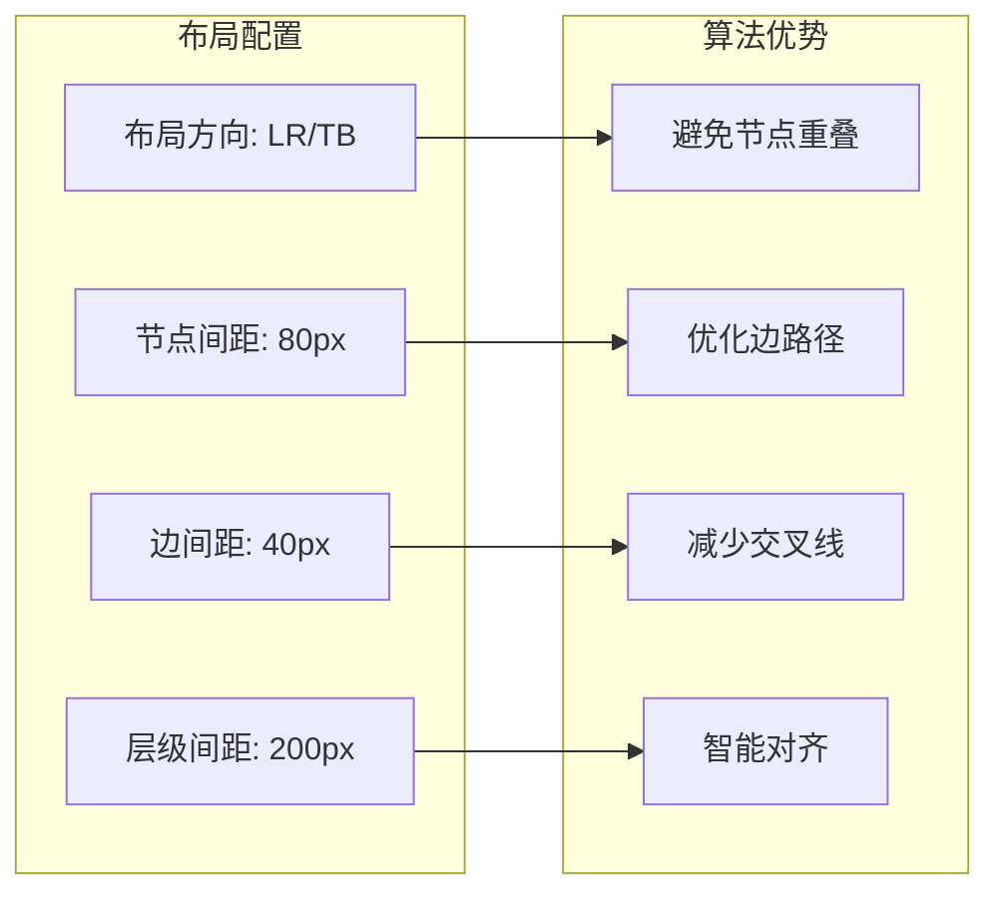
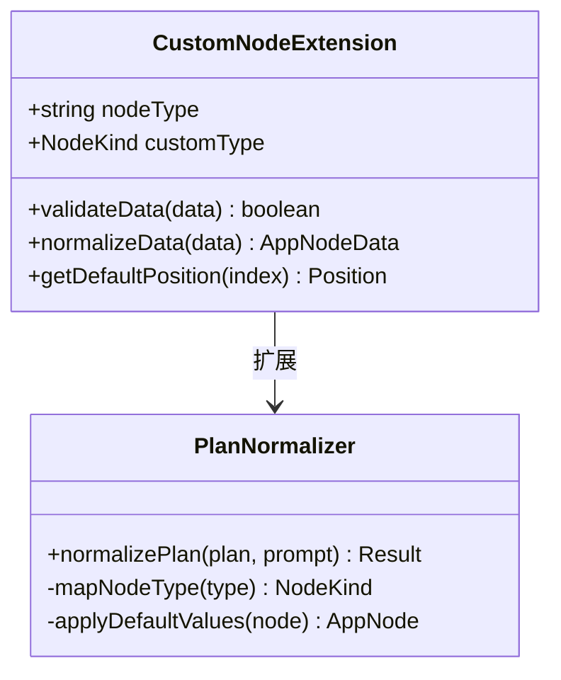

# 智能规划系统详细分析文档

<cite>
**本文档中引用的文件**
- [planNormalizer.ts](file://src/store/utils/planNormalizer.ts)
- [flow.ts](file://src/types/flow.ts)
- [route.ts](file://src/app/api/plan/route.ts)
- [validation.ts](file://src/utils/validation.ts)
- [copilotActions.ts](file://src/store/actions/copilotActions.ts)
- [layoutAlgorithm.ts](file://src/store/utils/layoutAlgorithm.ts)
- [BrainBar.tsx](file://src/components/builder/BrainBar.tsx)
- [flowAPI.ts](file://src/services/flowAPI.ts)
</cite>

## 目录
1. [简介](#简介)
2. [项目架构概览](#项目架构概览)
3. [PlanNormalizer核心模块](#plannormalizer核心模块)
4. [数据类型与接口设计](#数据类型与接口设计)
5. [节点类型映射机制](#节点类型映射机制)
6. [边缘连接自动补全](#边缘连接自动补全)
7. [API响应处理流程](#api响应处理流程)
8. [布局算法集成](#布局算法集成)
9. [自定义节点扩展策略](#自定义节点扩展策略)
10. [性能优化与最佳实践](#性能优化与最佳实践)
11. [故障排除指南](#故障排除指南)
12. [总结](#总结)

## 简介

智能规划系统是一个基于AI的工作流生成平台，通过自然语言描述自动生成可视化的业务流程。该系统的核心组件planNormalizer负责将AI生成的原始Plan结构转换为可视化工作流所需的标准化节点与边数据结构。

系统采用前后端分离架构，前端使用Next.js和React构建用户界面，后端提供RESTful API服务。AI规划功能通过OpenAI或豆包大模型实现，支持多种节点类型的智能识别和连接关系自动推断。

## 项目架构概览

系统采用模块化架构设计，主要分为以下几个层次：

**图表来源**
- [BrainBar.tsx](file://src/components/builder/BrainBar.tsx#L1-L50)
- [copilotActions.ts](file://src/store/actions/copilotActions.ts#L1-L35)
- [planNormalizer.ts](file://src/store/utils/planNormalizer.ts#L1-L40)

**章节来源**
- [BrainBar.tsx](file://src/components/builder/BrainBar.tsx#L1-L281)
- [copilotActions.ts](file://src/store/actions/copilotActions.ts#L1-L58)

## PlanNormalizer核心模块

PlanNormalizer是整个智能规划系统的核心转换器，负责将AI生成的非结构化Plan数据转换为标准化的工作流节点和边数据结构。

### 核心功能架构

**图表来源**
- [planNormalizer.ts](file://src/store/utils/planNormalizer.ts#L45-L130)

### 主要数据结构

PlanNormalizer处理的核心数据结构包括：

| 数据类型 | 描述 | 字段说明 |
|---------|------|----------|
| PlanNodeData | 计划节点数据 | 包含label、text、model、temperature等字段 |
| PlanNode | 计划节点 | 包含id、type、position、data等属性 |
| PlanEdge | 计划边 | 包含source、target、sourceId、targetId等 |
| Plan | 完整计划 | 包含title、nodes、edges三个主要部分 |

**章节来源**
- [planNormalizer.ts](file://src/store/utils/planNormalizer.ts#L5-L39)

## 数据类型与接口设计

系统采用强类型设计，确保数据结构的一致性和安全性。

### 类型定义体系

**图表来源**
- [flow.ts](file://src/types/flow.ts#L13-L44)

### 节点类型枚举

系统支持以下六种节点类型：

| 节点类型 | 功能描述 | 主要用途 |
|---------|----------|----------|
| input | 输入节点 | 接收用户输入或外部数据 |
| llm | 大语言模型节点 | 执行AI推理和文本生成 |
| rag | 检索增强生成节点 | 基于知识库进行信息检索 |
| http | HTTP请求节点 | 调用外部API服务 |
| output | 输出节点 | 显示最终结果 |
| branch | 分支节点 | 控制流程分支逻辑 |

**章节来源**
- [flow.ts](file://src/types/flow.ts#L3-L9)

## 节点类型映射机制

PlanNormalizer实现了智能的节点类型映射机制，能够根据AI生成的数据自动识别并转换为对应的标准节点类型。

### 映射逻辑实现

**图表来源**
- [planNormalizer.ts](file://src/store/utils/planNormalizer.ts#L49-L82)

### 具体映射规则

#### LLM节点映射
- **默认模型**: doubao-seed-1-6-flash-250828（豆包模型）
- **默认温度**: 0.7
- **系统提示词**: 自动生成基于用户提示的任务指令
- **标签处理**: 优先使用data.label，其次使用label，最后使用类型大写

#### RAG节点映射
- **文件处理**: 支持字符串和对象两种文件格式
- **文件对象结构**: name、size、type、url字段
- **默认标签**: 使用节点类型名称

#### HTTP节点映射
- **HTTP方法**: GET、POST、PUT、DELETE、PATCH
- **URL处理**: 支持动态URL配置
- **默认方法**: GET

**章节来源**
- [planNormalizer.ts](file://src/store/utils/planNormalizer.ts#L58-L80)

## 边缘连接自动补全

当AI生成的Plan缺少明确的连接关系时，PlanNormalizer会自动构建默认的连接链，确保工作流的完整性。

### 默认连接链生成算法

**图表来源**
- [planNormalizer.ts](file://src/store/utils/planNormalizer.ts#L112-L125)

### 自动补全策略

系统按照以下优先级顺序构建连接链：

1. **输入节点优先**: 首先连接所有input节点
2. **RAG节点处理**: 按顺序连接所有RAG节点
3. **HTTP节点处理**: 按顺序连接所有HTTP节点  
4. **LLM节点处理**: 按顺序连接所有LLM节点
5. **输出节点连接**: 最后连接到output节点

对于多个LLM节点的情况，系统会建立从每个LLM节点到最终输出节点的直接连接。

**章节来源**
- [planNormalizer.ts](file://src/store/utils/planNormalizer.ts#L104-L126)

## API响应处理流程

系统通过RESTful API接收AI生成的Plan数据，并进行标准化处理。

### API调用流程

**图表来源**
- [copilotActions.ts](file://src/store/actions/copilotActions.ts#L8-L35)
- [route.ts](file://src/app/api/plan/route.ts#L6-L122)

### 错误处理机制

系统实现了完善的错误处理机制：

| 错误类型 | 处理策略 | 用户反馈 |
|---------|----------|----------|
| 输入验证失败 | 返回400状态码，显示具体错误信息 | 表单验证错误提示 |
| AI模型调用失败 | 返回空的节点和边数组 | 显示"生成失败，请重试" |
| 数据解析错误 | 使用默认值继续处理 | 继续执行但记录日志 |
| 网络连接超时 | 显示加载状态，提供重试按钮 | 网络连接提示 |

**章节来源**
- [route.ts](file://src/app/api/plan/route.ts#L11-L122)
- [copilotActions.ts](file://src/store/actions/copilotActions.ts#L31-L35)

## 布局算法集成

PlanNormalizer与Dagre布局算法深度集成，提供智能的节点位置优化。

### 布局算法特性

**图表来源**
- [layoutAlgorithm.ts](file://src/store/utils/layoutAlgorithm.ts#L11-L67)

### 布局优化策略

系统支持两种主要布局方向：

1. **水平布局 (LR)**: 从左到右的流程布局，适合大多数业务流程
2. **垂直布局 (TB)**: 从上到下的层次布局，适合组织架构图等

布局算法考虑了以下因素：
- 节点尺寸标准化（260×120像素）
- 边的路径优化
- 层级间的合理间距
- 图形边界处理

**章节来源**
- [layoutAlgorithm.ts](file://src/store/utils/layoutAlgorithm.ts#L1-L120)

## 自定义节点扩展策略

系统提供了灵活的扩展机制，支持添加新的节点类型。

### 扩展接口设计

**图表来源**
- [planNormalizer.ts](file://src/store/utils/planNormalizer.ts#L49-L82)

### 扩展步骤指南

1. **定义新节点类型**: 在NodeKind枚举中添加新类型
2. **实现数据验证**: 创建对应的验证规则
3. **扩展映射逻辑**: 在normalizePlan函数中添加类型处理
4. **更新默认值**: 为新类型设置合理的默认配置
5. **测试集成**: 验证新节点在各种场景下的表现

### 最佳实践建议

- **保持向后兼容**: 新节点类型不应破坏现有功能
- **提供默认配置**: 确保新节点有合理的默认行为
- **完善错误处理**: 实现健壮的错误处理机制
- **文档化扩展**: 为新节点类型编写使用文档

**章节来源**
- [flow.ts](file://src/types/flow.ts#L3-L9)

## 性能优化与最佳实践

### 性能优化策略

1. **懒加载处理**: 对大型Plan数据采用分批处理
2. **缓存机制**: 缓存常用的节点映射结果
3. **批量操作**: 合并多个节点的布局计算
4. **内存管理**: 及时清理不再使用的临时数据

### 最佳实践指南

- **输入验证**: 在处理前严格验证Plan数据结构
- **错误恢复**: 实现优雅的降级处理机制
- **用户体验**: 提供清晰的操作反馈和进度指示
- **调试支持**: 添加详细的日志记录和调试信息

### 限制与约束

系统在以下方面存在限制：

| 限制类型 | 具体限制 | 影响范围 |
|---------|----------|----------|
| 节点数量 | 单个流程最多支持100个节点 | 性能影响 |
| 连接复杂度 | 不支持循环依赖检测 | 流程正确性 |
| 文件大小 | RAG节点文件大小限制 | 功能可用性 |
| API调用频率 | AI模型调用频率限制 | 响应速度 |

**章节来源**
- [planNormalizer.ts](file://src/store/utils/planNormalizer.ts#L104-L126)

## 故障排除指南

### 常见问题及解决方案

#### Plan数据格式错误
**症状**: normalizePlan函数抛出类型错误
**原因**: AI生成的Plan数据不符合预期结构
**解决**: 检查API响应数据结构，添加数据验证逻辑

#### 节点位置异常
**症状**: 节点重叠或位置超出可视区域
**原因**: 布局算法参数配置不当
**解决**: 调整Dagre布局参数，增加边界检查

#### 连接关系丢失
**症状**: 节点间缺少连接线
**原因**: 自动补全机制未能正确识别连接关系
**解决**: 手动添加连接，或改进连接识别逻辑

#### 性能问题
**症状**: 大型Plan处理缓慢
**原因**: 数据量过大或算法复杂度过高
**解决**: 实现数据分页，优化算法性能

### 调试技巧

1. **启用详细日志**: 在开发环境中开启详细的调试信息
2. **数据快照**: 保存关键处理阶段的数据状态
3. **单元测试**: 为每个转换步骤编写单元测试
4. **性能监控**: 监控关键操作的执行时间

**章节来源**
- [planNormalizer.ts](file://src/store/utils/planNormalizer.ts#L128-L130)

## 总结

PlanNormalizer模块是智能规划系统的核心组件，它成功地 bridging 了AI生成的非结构化Plan数据与可视化工作流之间的鸿沟。通过精心设计的节点类型映射机制、智能的边缘连接自动补全算法，以及与Dagre布局算法的深度集成，该模块实现了从自然语言描述到标准化工作流数据的无缝转换。

系统的主要优势包括：

1. **智能化处理**: 能够自动识别和转换多种节点类型
2. **容错性强**: 在数据不完整或格式错误时仍能提供合理的默认行为
3. **扩展性好**: 支持自定义节点类型的灵活扩展
4. **性能优异**: 采用高效的算法和优化策略
5. **用户体验佳**: 提供直观的操作界面和及时的反馈机制

未来的发展方向可能包括：
- 支持更复杂的连接关系识别
- 增强多语言和多模态输入处理
- 优化大规模数据的处理性能
- 扩展更多的节点类型和功能

这个模块的设计充分体现了现代软件工程的最佳实践，为智能工作流系统的实际应用奠定了坚实的基础。