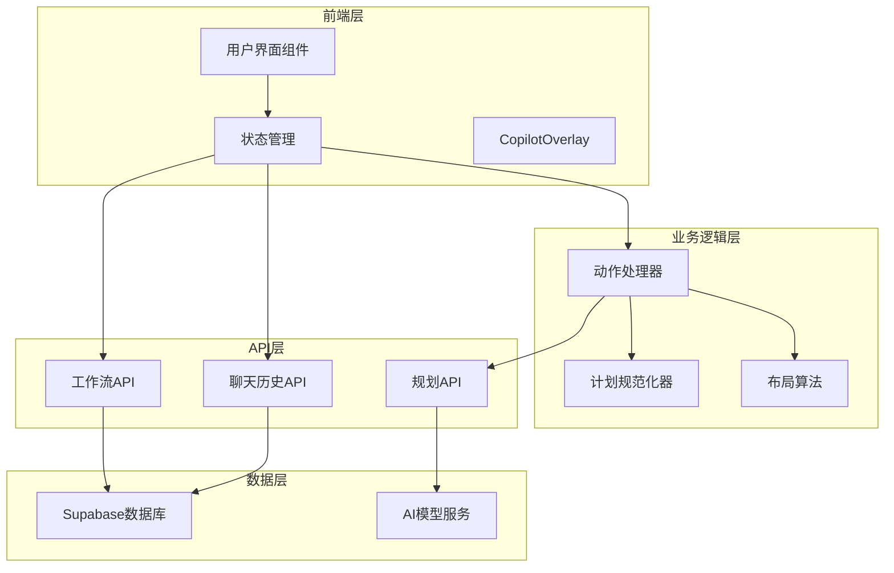
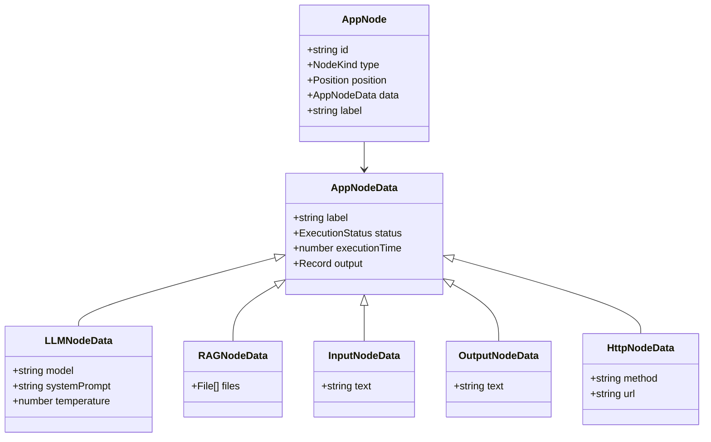
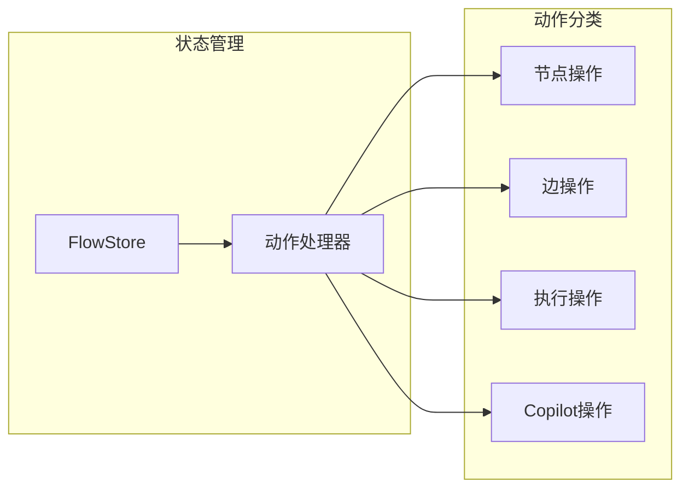
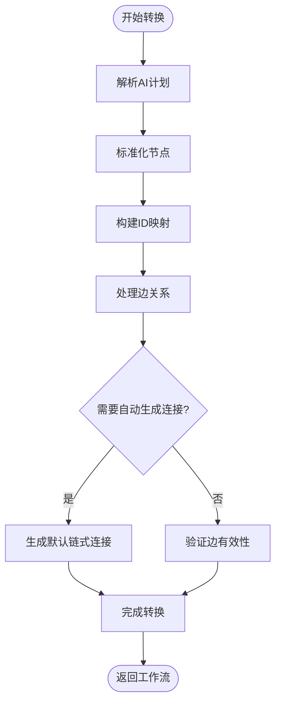
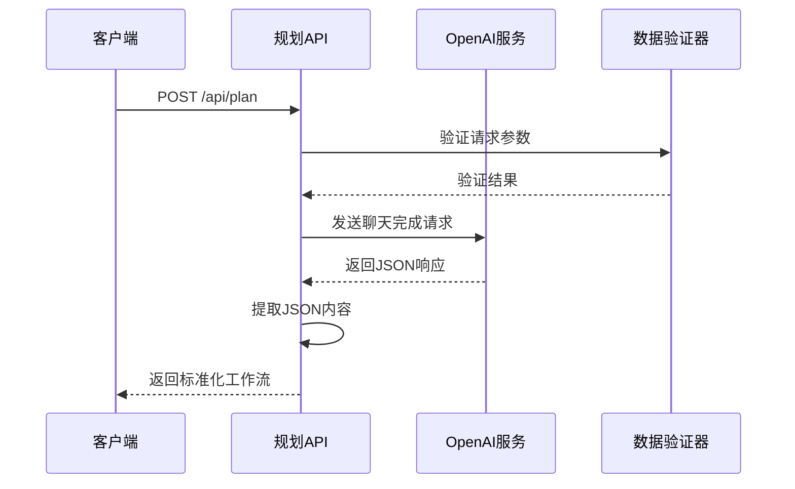
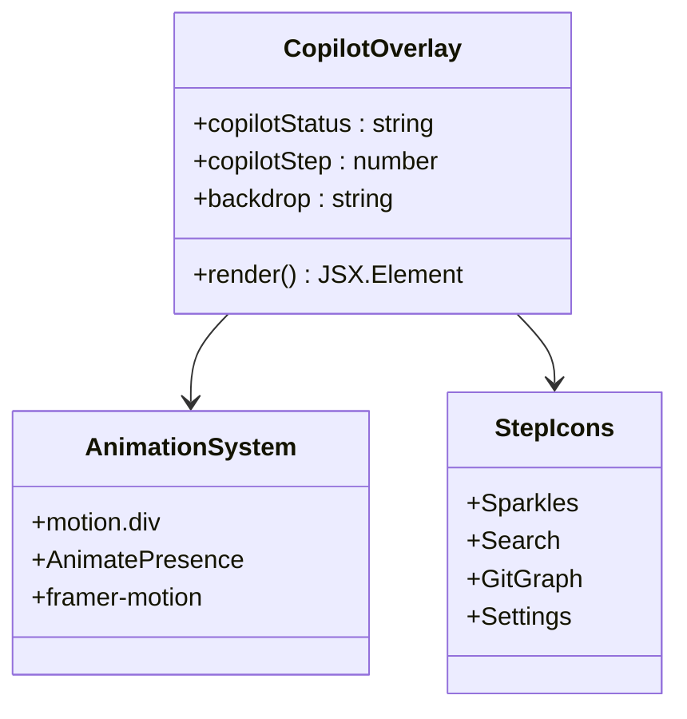
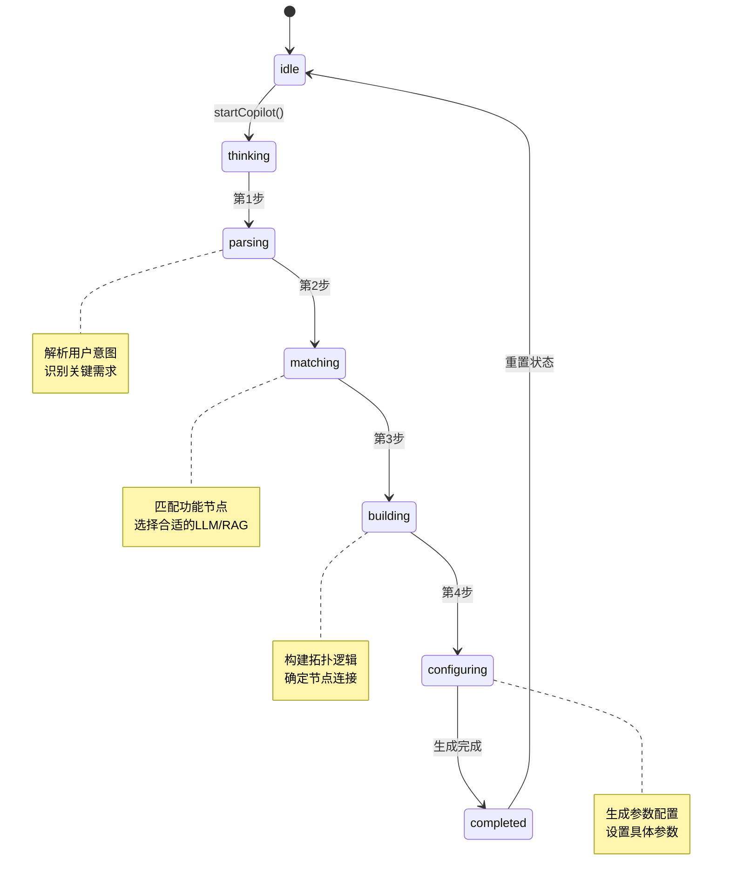
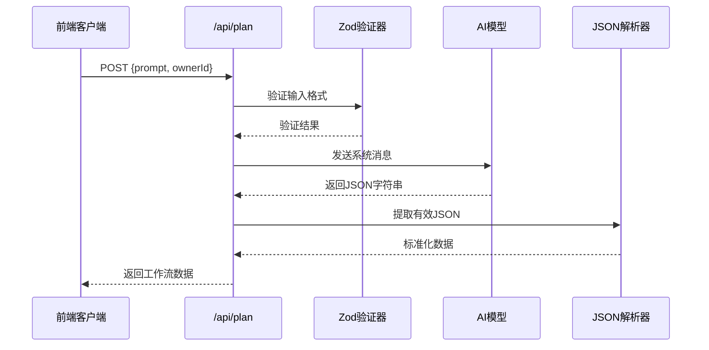
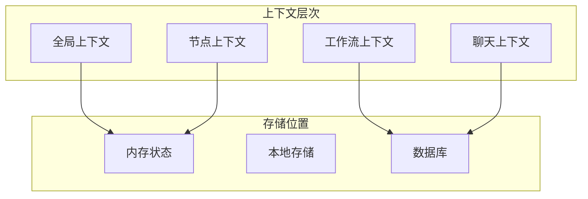

# 智能辅助功能

<cite>
**本文档中引用的文件**
- [planNormalizer.ts](file://src/store/utils/planNormalizer.ts)
- [CopilotOverlay.tsx](file://src/components/flow/CopilotOverlay.tsx)
- [route.ts](file://src/app/api/plan/route.ts)
- [copilotActions.ts](file://src/store/actions/copilotActions.ts)
- [copilotSteps.ts](file://src/store/constants/copilotSteps.ts)
- [flow.ts](file://src/types/flow.ts)
- [flowStore.ts](file://src/store/flowStore.ts)
- [validation.ts](file://src/utils/validation.ts)
- [initialState.ts](file://src/store/constants/initialState.ts)
- [flowAPI.ts](file://src/services/flowAPI.ts)
- [layoutAlgorithm.ts](file://src/store/utils/layoutAlgorithm.ts)
- [chatHistoryAPI.ts](file://src/services/chatHistoryAPI.ts)
</cite>

## 目录
1. [简介](#简介)
2. [项目架构概览](#项目架构概览)
3. [核心组件分析](#核心组件分析)
4. [智能规划与辅助生成功能](#智能规划与辅助生成功能)
5. [CopilotOverlay交互设计](#copilotoverlay交互设计)
6. [API接口与上下文管理](#api接口与上下文管理)
7. [高级配置与扩展](#高级配置与扩展)
8. [性能考虑](#性能考虑)
9. [故障排除指南](#故障排除指南)
10. [总结](#总结)

## 简介

Flash Flow 是一个基于React和Next.js构建的可视化工作流设计器，集成了智能辅助功能来帮助用户快速生成复杂的工作流。该系统的核心特性包括：

- **智能规划引擎**：通过自然语言描述自动生成工作流节点和连接
- **Copilot辅助系统**：提供实时的AI驱动工作流生成体验
- **多模型支持**：支持OpenAI和豆包（DouBao）等多种AI模型
- **上下文感知**：维护工作流执行上下文和聊天历史
- **自动布局优化**：使用Dagre算法自动优化节点布局

## 项目架构概览

系统采用分层架构设计，主要分为以下几个层次：



**图表来源**
- [flowStore.ts](file://src/store/flowStore.ts#L1-L131)
- [copilotActions.ts](file://src/store/actions/copilotActions.ts#L1-L59)
- [route.ts](file://src/app/api/plan/route.ts#L1-L123)

**章节来源**
- [flowStore.ts](file://src/store/flowStore.ts#L1-L131)
- [flow.ts](file://src/types/flow.ts#L1-L153)

## 核心组件分析

### 数据类型定义

系统定义了完整的工作流数据结构，支持多种节点类型：



**图表来源**
- [flow.ts](file://src/types/flow.ts#L1-L153)

### 状态管理架构

系统使用Zustand进行状态管理，实现了模块化的动作处理器：



**图表来源**
- [flowStore.ts](file://src/store/flowStore.ts#L17-L32)

**章节来源**
- [flow.ts](file://src/types/flow.ts#L1-L153)
- [flowStore.ts](file://src/store/flowStore.ts#L1-L131)

## 智能规划与辅助生成功能

### planNormalizer工具详解

planNormalizer是系统的核心转换器，负责将AI生成的JSON计划转换为可执行的工作流结构：

#### 核心功能特性

1. **类型安全的数据转换**：确保AI输出符合预期的数据结构
2. **节点类型适配**：支持input、llm、rag、http、output五种节点类型
3. **智能边连接**：自动建立节点间的连接关系
4. **默认值填充**：为缺失字段提供合理的默认值

#### 转换流程



**图表来源**
- [planNormalizer.ts](file://src/store/utils/planNormalizer.ts#L45-L130)

#### 节点类型处理

不同节点类型的处理逻辑：

| 节点类型 | 处理逻辑 | 默认配置 |
|---------|---------|---------|
| input | 提取文本内容作为输入 | 空文本 |
| llm | 配置模型、温度、系统提示词 | doubao-seed-1-6-flash-250828, 0.7, 用户意图驱动 |
| rag | 处理文件上传和知识库 | 空文件列表 |
| http | 配置HTTP方法和URL | GET, 空URL |
| output | 提取处理结果 | 空文本 |

**章节来源**
- [planNormalizer.ts](file://src/store/utils/planNormalizer.ts#L1-L130)

### AI模型集成

系统支持多种AI模型提供商：

#### OpenAI集成



**图表来源**
- [route.ts](file://src/app/api/plan/route.ts#L98-L108)

#### 豆包模型支持

系统通过环境变量配置支持豆包模型：

- **模型名称**：doubao-pro-128k（可配置）
- **API端点**：https://ark.cn-beijing.volces.com/api/v3/chat/completions
- **认证方式**：Bearer Token
- **温度设置**：0.2（较低以获得更准确的结果）

**章节来源**
- [route.ts](file://src/app/api/plan/route.ts#L1-L123)

## CopilotOverlay交互设计

### 组件架构

CopilotOverlay提供了直观的AI生成进度指示器：



**图表来源**
- [CopilotOverlay.tsx](file://src/components/flow/CopilotOverlay.tsx#L1-L64)

### 交互流程

Copilot系统的工作流程分为四个阶段：



**图表来源**
- [copilotSteps.ts](file://src/store/constants/copilotSteps.ts#L1-L7)
- [copilotActions.ts](file://src/store/actions/copilotActions.ts#L8-L34)

### 动画效果设计

组件使用Framer Motion实现流畅的动画效果：

- **入场动画**：透明度从0到1，持续0.5秒
- **图标动画**：缩放从0.8到1，弹簧效果
- **文字动画**：垂直位移和透明度变化
- **加载指示器**：三个圆点的弹跳动画

**章节来源**
- [CopilotOverlay.tsx](file://src/components/flow/CopilotOverlay.tsx#L1-L64)
- [copilotSteps.ts](file://src/store/constants/copilotSteps.ts#L1-L7)

## API接口与上下文管理

### 规划API设计

规划API是整个智能辅助系统的核心入口：

#### 请求响应格式



**图表来源**
- [route.ts](file://src/app/api/plan/route.ts#L6-L118)

#### 错误处理策略

系统实现了多层次的错误处理：

1. **输入验证**：使用Zod确保请求格式正确
2. **网络错误**：捕获API调用异常
3. **JSON解析错误**：处理AI返回的无效JSON
4. **降级处理**：返回空工作流而非抛出异常

#### 上下文管理机制

系统通过多个层面维护上下文信息：



**图表来源**
- [flow.ts](file://src/types/flow.ts#L79-L82)
- [chatHistoryAPI.ts](file://src/services/chatHistoryAPI.ts#L1-L94)

**章节来源**
- [route.ts](file://src/app/api/plan/route.ts#L1-L123)
- [validation.ts](file://src/utils/validation.ts#L1-L28)
- [chatHistoryAPI.ts](file://src/services/chatHistoryAPI.ts#L1-L94)

## 高级配置与扩展

### 提示词模板定制

系统支持灵活的提示词配置：

#### 系统提示词结构

```typescript
// 基础提示词模板
const systemPromptTemplate = `
你是一个工作流规划器。根据用户描述生成一个严格的 JSON（只返回 JSON）。
返回结构必须包含: { title: string, nodes: [], edges: [] }。
title: 根据用户意图生成的简短流程标题。
节点类型只能是: input, llm, rag, http, output。
必须生成合理的 edges。edge.source/edge.target 必须引用节点 id。
`;

// 模型特定提示词
const modelSpecificPrompts = {
    doubao: "使用豆包模型的特定提示词配置",
    openai: "使用GPT模型的特定提示词配置"
};
```

#### 温度和参数调优

不同场景下的参数建议：

| 场景 | 温度值 | 用途 | 示例 |
|------|--------|------|------|
| 代码生成 | 0.1-0.3 | 需要精确输出 | 自动生成代码节点 |
| 文本处理 | 0.3-0.5 | 平衡创造性和准确性 | 文本分析和处理 |
| 内容创作 | 0.6-0.8 | 鼓励创造性输出 | 报告生成和摘要 |
| 数据分析 | 0.2-0.4 | 结果可预测性高 | 数据清洗和转换 |

### 新模型服务商扩展

#### 扩展接口定义

```typescript
interface LLMProvider {
    name: string;
    endpoint: string;
    apiKeyEnv: string;
    defaultModel: string;
    temperatureRange: [number, number];
    supportsFiles?: boolean;
    supportsStreaming?: boolean;
}

const supportedProviders: LLMProvider[] = [
    {
        name: "openai",
        endpoint: "https://api.openai.com/v1/chat/completions",
        apiKeyEnv: "OPENAI_API_KEY",
        defaultModel: "gpt-4o-mini",
        temperatureRange: [0, 1],
        supportsFiles: true
    },
    {
        name: "doubao",
        endpoint: "https://ark.cn-beijing.volces.com/api/v3/chat/completions",
        apiKeyEnv: "DOUBAO_API_KEY",
        defaultModel: "doubao-pro-128k",
        temperatureRange: [0, 1]
    }
];
```

#### 扩展步骤

1. **添加提供商配置**：在环境变量中添加新的API密钥
2. **更新路由逻辑**：在API路由中添加新的提供商分支
3. **更新类型定义**：扩展PlanNodeData类型以支持新模型特有字段
4. **测试集成**：验证新模型的兼容性和性能

### 布局算法优化

系统使用Dagre算法进行自动布局：

#### 布局配置选项

```typescript
const layoutConfig = {
    rankdir: 'LR',      // 方向：左到右
    nodesep: 80,        // 节点间距
    edgesep: 40,        // 边间距
    ranksep: 200,       // 层级间距
    marginx: 50,        // 左右边距
    marginy: 50         // 上下边距
};
```

#### 布局模式

- **水平布局**（LR）：默认布局方向，适合大多数工作流
- **垂直布局**（TB）：特殊场景下的垂直排列
- **自适应布局**：根据节点数量动态调整

**章节来源**
- [route.ts](file://src/app/api/plan/route.ts#L51-L69)
- [layoutAlgorithm.ts](file://src/store/utils/layoutAlgorithm.ts#L1-L119)

## 性能考虑

### 异步处理优化

系统采用多种策略优化性能：

1. **防抖保存**：使用setTimeout防抖自动保存操作
2. **懒加载**：按需加载大型依赖库（如Dagre）
3. **并发控制**：限制同时进行的API请求数量
4. **缓存策略**：缓存常用的AI模型响应

### 内存管理

- **状态清理**：及时清理不再使用的状态数据
- **事件监听器**：在组件卸载时移除事件监听器
- **定时器管理**：清除不必要的定时器

### 网络优化

- **请求合并**：将多个小请求合并为批量请求
- **压缩传输**：启用gzip压缩减少传输数据量
- **CDN加速**：静态资源使用CDN分发

## 故障排除指南

### 常见问题及解决方案

#### AI生成失败

**症状**：CopilotOverlay显示但无法生成工作流

**可能原因**：
1. API密钥配置错误
2. 网络连接问题
3. 输入提示过长或格式不正确

**解决步骤**：
1. 检查环境变量配置
2. 验证网络连接
3. 简化输入提示
4. 查看浏览器控制台错误信息

#### 布局混乱

**症状**：生成的工作流节点位置不正确

**可能原因**：
1. 节点数据结构不完整
2. 边连接关系错误
3. 布局算法参数不当

**解决步骤**：
1. 检查节点和边的数据完整性
2. 验证连接关系的有效性
3. 调整布局算法参数
4. 使用手动布局功能

#### 性能问题

**症状**：界面响应缓慢或卡顿

**可能原因**：
1. 状态数据过大
2. 频繁的状态更新
3. 大量的DOM操作

**解决步骤**：
1. 优化状态结构
2. 减少不必要的状态更新
3. 使用虚拟化技术处理大量节点
4. 启用浏览器开发者工具分析性能瓶颈

**章节来源**
- [copilotActions.ts](file://src/store/actions/copilotActions.ts#L30-L34)
- [layoutAlgorithm.ts](file://src/store/utils/layoutAlgorithm.ts#L11-L67)

## 总结

Flash Flow的智能辅助功能通过精心设计的架构实现了从自然语言到可执行工作流的无缝转换。系统的主要优势包括：

1. **智能化程度高**：能够理解复杂的自然语言描述并生成合理的工作流
2. **用户体验优秀**：通过CopilotOverlay提供直观的进度反馈
3. **扩展性强**：支持多种AI模型和服务商
4. **稳定性好**：完善的错误处理和降级机制
5. **性能优异**：优化的布局算法和异步处理

该系统为非技术用户提供了一个强大的工作流设计工具，大大降低了自动化流程设计的门槛，同时为技术用户提供了灵活的定制和扩展能力。随着AI技术的不断发展，该系统具备良好的演进基础，可以持续改进和扩展其智能辅助能力。