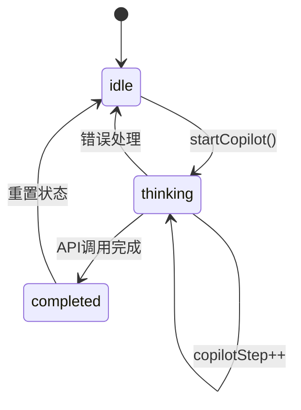
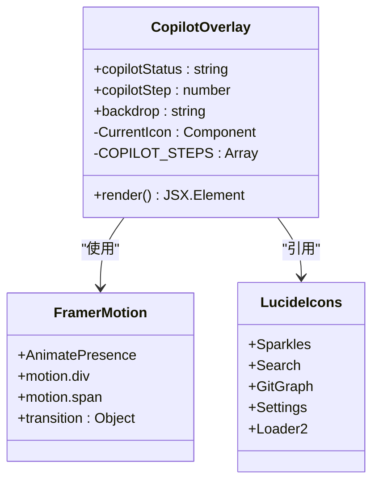
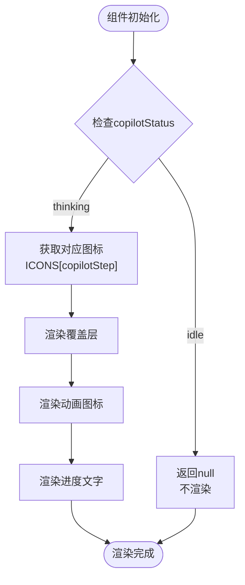
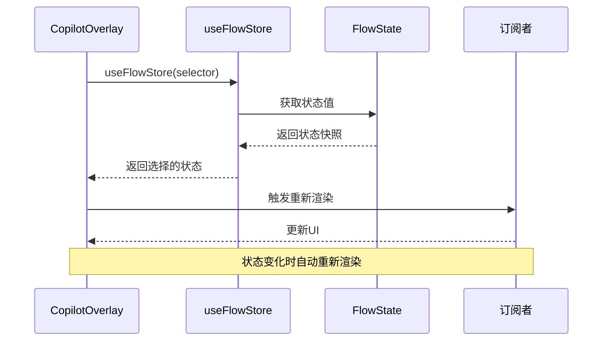
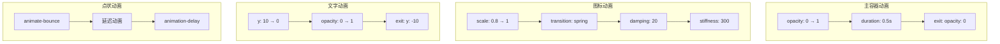
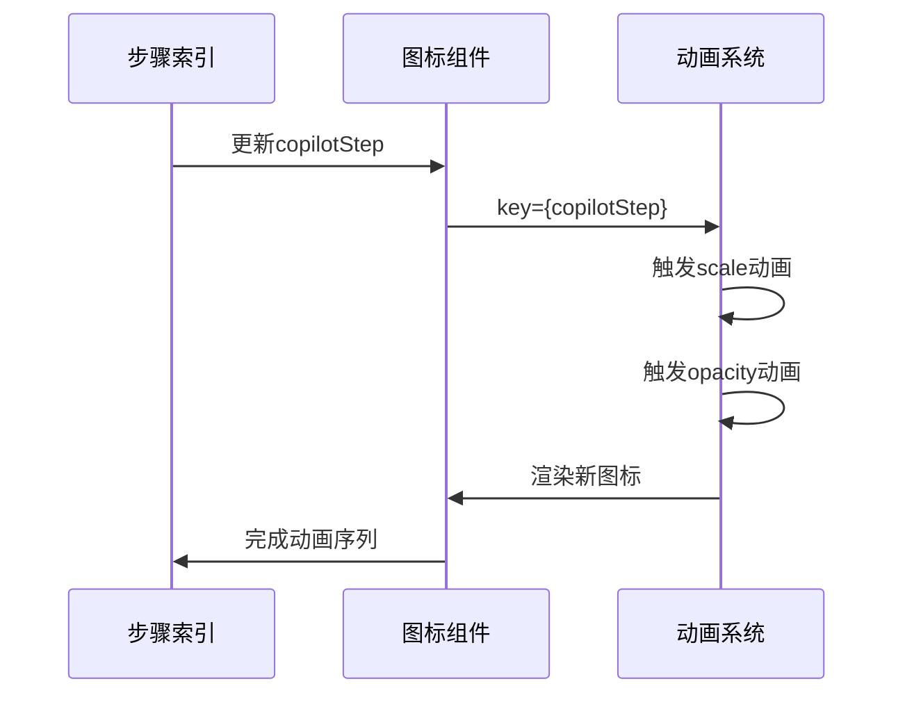
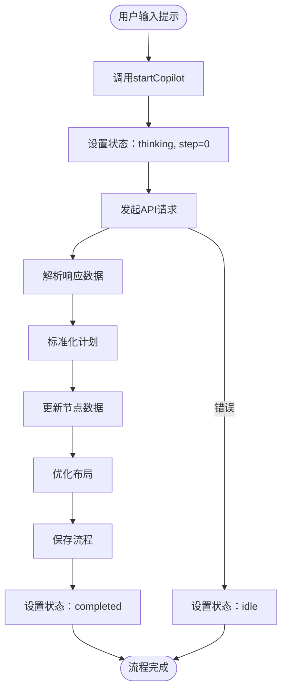
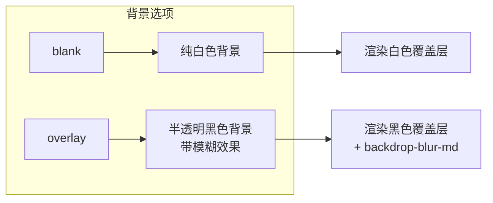
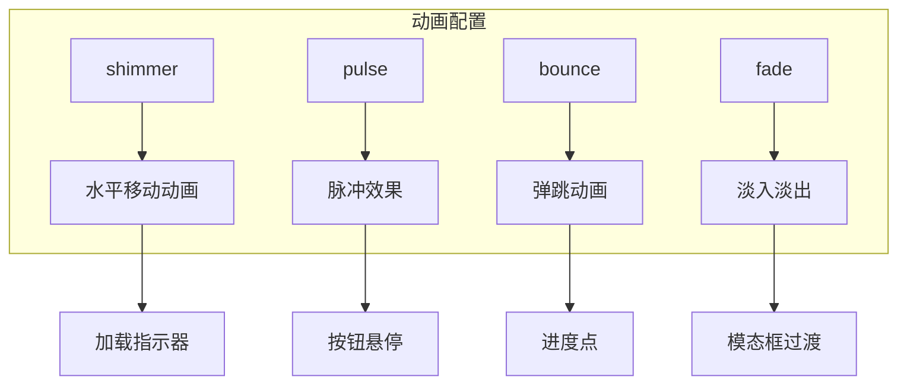
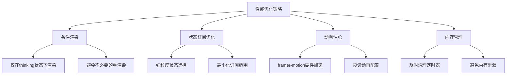

# 用户交互

<cite>
**本文档中引用的文件**
- [CopilotOverlay.tsx](file://src/components/flow/CopilotOverlay.tsx)
- [copilotActions.ts](file://src/store/actions/copilotActions.ts)
- [flowStore.ts](file://src/store/flowStore.ts)
- [copilotSteps.ts](file://src/store/constants/copilotSteps.ts)
- [initialState.ts](file://src/store/constants/initialState.ts)
- [flow.ts](file://src/types/flow.ts)
- [globals.css](file://src/app/globals.css)
- [LaunchCard.tsx](file://src/components/builder/LaunchCard.tsx)
- [InputPromptDialog.tsx](file://src/components/flow/InputPromptDialog.tsx)
- [prompt-bubble.tsx](file://src/components/ui/prompt-bubble.tsx)
</cite>

## 目录
1. [概述](#概述)
2. [UI状态机架构](#ui状态机架构)
3. [核心组件分析](#核心组件分析)
4. [状态订阅机制](#状态订阅机制)
5. [动画系统详解](#动画系统详解)
6. [用户交互流程](#用户交互流程)
7. [CSS变量定制方案](#css变量定制方案)
8. [性能优化策略](#性能优化策略)
9. [故障排除指南](#故障排除指南)
10. [总结](#总结)

## 概述

CopilotOverlay组件是Flash Flow SaaS平台中负责AI生成流程可视化的重要组件。它通过基于React状态机的设计模式，实现了从用户触发AI生成到最终完成的完整视觉反馈流程。该组件采用framer-motion动画库，结合zustand状态管理，为用户提供流畅的交互体验。

## UI状态机架构

### 状态结构设计

CopilotOverlay的状态机基于三个核心状态变量构建：

**图表来源**
- [flowStore.ts](file://src/store/flowStore.ts#L100-L101)
- [initialState.ts](file://src/store/constants/initialState.ts#L24-L26)

### 状态转换机制

状态机遵循严格的转换规则：

| 当前状态 | 触发条件 | 下一状态 | 动作描述 |
|---------|---------|---------|---------|
| idle | copilotStatus !== "thinking" | 渲染结束 | 组件不渲染任何内容 |
| thinking | copilotStatus === "thinking" | 渲染加载动画 | 显示进度指示器和文字 |
| thinking | copilotStep变化 | 更新动画 | 切换图标和文本 |
| completed | API调用成功 | 状态更新 | 流程完成 |

**章节来源**
- [CopilotOverlay.tsx](file://src/components/flow/CopilotOverlay.tsx#L14-L16)
- [copilotActions.ts](file://src/store/actions/copilotActions.ts#L8-L34)

## 核心组件分析

### CopilotOverlay组件结构

**图表来源**
- [CopilotOverlay.tsx](file://src/components/flow/CopilotOverlay.tsx#L1-L63)

### 组件渲染逻辑

组件采用条件渲染模式，只有在特定状态下才进行渲染：

**图表来源**
- [CopilotOverlay.tsx](file://src/components/flow/CopilotOverlay.tsx#L14-L63)

**章节来源**
- [CopilotOverlay.tsx](file://src/components/flow/CopilotOverlay.tsx#L9-L63)

## 状态订阅机制

### useFlowStore订阅模式

useFlowStore采用函数式订阅模式，实现细粒度的状态更新：

**图表来源**
- [flowStore.ts](file://src/store/flowStore.ts#L17-L19)

### 状态选择器模式

组件使用多个状态选择器实现独立的状态监听：

| 状态属性 | 选择器函数 | 用途 |
|---------|-----------|------|
| copilotStatus | `(s) => s.copilotStatus` | 控制整体可见性 |
| copilotStep | `(s) => s.copilotStep` | 控制动画切换 |
| backdrop | `(s) => s.copilotBackdrop` | 控制背景样式 |

**章节来源**
- [CopilotOverlay.tsx](file://src/components/flow/CopilotOverlay.tsx#L10-L12)
- [flowStore.ts](file://src/store/flowStore.ts#L17-L19)

## 动画系统详解

### framer-motion动画配置

组件使用多层次的动画系统，实现复杂的视觉效果：

**图表来源**
- [CopilotOverlay.tsx](file://src/components/flow/CopilotOverlay.tsx#L21-L60)

### 图标动画序列

图标动画采用序列化的方式，确保每个步骤的视觉连贯性：

**图表来源**
- [CopilotOverlay.tsx](file://src/components/flow/CopilotOverlay.tsx#L31-L36)

### 文字打字机动画

文字区域包含三个跳动的圆点，形成经典的"..."效果：

| 圆点 | 动画延迟 | 颜色 | 用途 |
|-----|---------|-----|------|
| 第一个 | -0.3s | 黑色/40% | 最早开始 |
| 第二个 | -0.15s | 黑色/40% | 中间开始 |
| 第三个 | 0s | 黑色/40% | 最晚开始 |

**章节来源**
- [CopilotOverlay.tsx](file://src/components/flow/CopilotOverlay.tsx#L52-L56)

## 用户交互流程

### startCopilot流程详解

用户触发AI生成的完整流程：

**图表来源**
- [copilotActions.ts](file://src/store/actions/copilotActions.ts#L8-L34)

### 步骤状态映射

COPILOT_STEPS常量定义了四个关键步骤：

| 步骤索引 | 文本描述 | 图标类型 | 功能含义 |
|---------|---------|---------|---------|
| 0 | 正在解析用户意图... | sparkles | 意图识别阶段 |
| 1 | 正在匹配功能节点... | search | 节点匹配阶段 |
| 2 | 正在构建拓扑逻辑... | flow | 逻辑构建阶段 |
| 3 | 正在生成参数配置... | settings | 参数生成阶段 |

**章节来源**
- [copilotSteps.ts](file://src/store/constants/copilotSteps.ts#L1-L6)
- [copilotActions.ts](file://src/store/actions/copilotActions.ts#L8-L34)

### 背景遮罩控制

组件支持两种背景样式：

**图表来源**
- [CopilotOverlay.tsx](file://src/components/flow/CopilotOverlay.tsx#L26)

**章节来源**
- [copilotActions.ts](file://src/store/actions/copilotActions.ts#L48-L49)
- [CopilotOverlay.tsx](file://src/components/flow/CopilotOverlay.tsx#L26)

## CSS变量定制方案

### 全局主题变量

系统提供了丰富的CSS自定义属性，支持深度定制：

| 变量名称 | 默认值 | 用途 | 自定义建议 |
|---------|-------|------|----------|
| --background | oklch(1 0 0) | 背景颜色 | 根据品牌色调整 |
| --foreground | oklch(0.145 0 0) | 前景色 | 对比度优化 |
| --primary | oklch(0 0 0) | 主色调 | 强调色定制 |
| --card | oklch(1 0 0) | 卡片背景 | 浅色主题 |
| --popover | oklch(1 0 0) | 弹出层背景 | 透明度调整 |

### 动画关键帧定义

系统内置了多种动画关键帧：

**图表来源**
- [globals.css](file://src/app/globals.css#L6-L201)
- [tailwind.config.ts](file://src/tailwind.config.ts#L24-L32)

### 组件级样式定制

CopilotOverlay的样式可以通过以下方式定制：

| 样式类 | 作用域 | 可定制属性 | 示例 |
|-------|-------|-----------|------|
| 固定定位 | 整体布局 | z-index, inset | 调整层级 |
| 背景样式 | 蒙层 | background, backdrop-filter | 更改透明度 |
| 图标容器 | 图标区域 | width, height, border-radius | 调整尺寸 |
| 文字区域 | 文本显示 | font-size, color, spacing | 字体定制 |

**章节来源**
- [globals.css](file://src/app/globals.css#L1-L201)
- [CopilotOverlay.tsx](file://src/components/flow/CopilotOverlay.tsx#L26-L56)

## 性能优化策略

### 渲染优化

组件采用了多项性能优化措施：

### 动画性能配置

动画系统采用高性能配置：

| 配置项 | 值 | 性能影响 | 优化理由 |
|-------|---|---------|---------|
| transition.type | spring | 硬件加速 | GPU优化 |
| transition.stiffness | 300 | 高刚度 | 减少计算 |
| transition.damping | 20 | 适中阻尼 | 平滑效果 |
| duration | 0.5s | 短时间 | 快速响应 |

**章节来源**
- [CopilotOverlay.tsx](file://src/components/flow/CopilotOverlay.tsx#L34-L35)

## 故障排除指南

### 常见问题诊断

| 问题症状 | 可能原因 | 解决方案 |
|---------|---------|---------|
| 加载动画不显示 | copilotStatus未正确设置 | 检查startCopilot调用 |
| 图标不切换 | copilotStep索引越界 | 验证步骤数组长度 |
| 动画卡顿 | 过度渲染或动画冲突 | 检查状态订阅 |
| 背景样式异常 | CSS变量未定义 | 检查全局样式 |

### 调试技巧

1. **状态监控**：使用浏览器开发工具监控useFlowStore状态变化
2. **动画调试**：启用framer-motion的调试模式查看动画性能
3. **网络请求**：检查API调用是否正常返回预期数据
4. **错误边界**：确保错误处理逻辑正确执行

**章节来源**
- [copilotActions.ts](file://src/store/actions/copilotActions.ts#L31-L34)

## 总结

CopilotOverlay组件展现了现代React应用中状态机设计的最佳实践。通过zustand状态管理和framer-motion动画库的结合，实现了流畅的用户交互体验。组件的模块化设计使其易于维护和扩展，而完善的CSS变量系统则提供了强大的定制能力。

该组件的成功在于：
- **清晰的状态机设计**：明确的三状态转换逻辑
- **高效的动画系统**：基于硬件加速的流畅动画
- **灵活的样式定制**：完整的CSS变量体系
- **优秀的用户体验**：渐进式的信息反馈机制

这种设计模式可以作为其他类似组件开发的参考模板，特别是在需要复杂状态管理和动画效果的场景中。