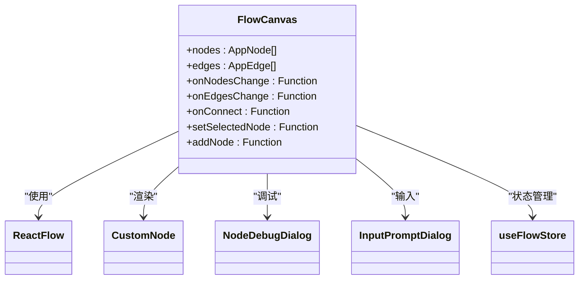
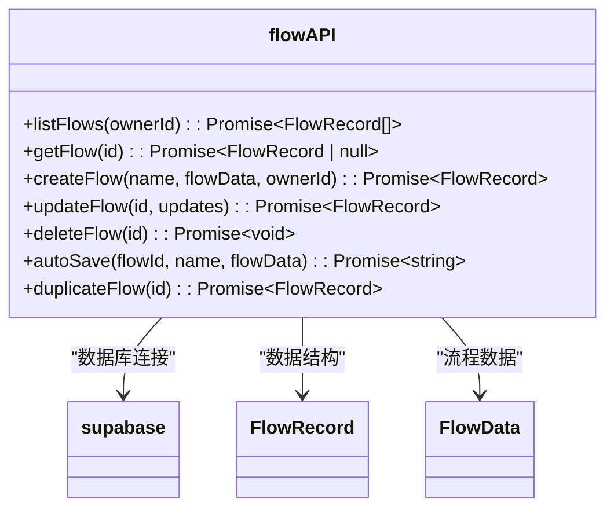
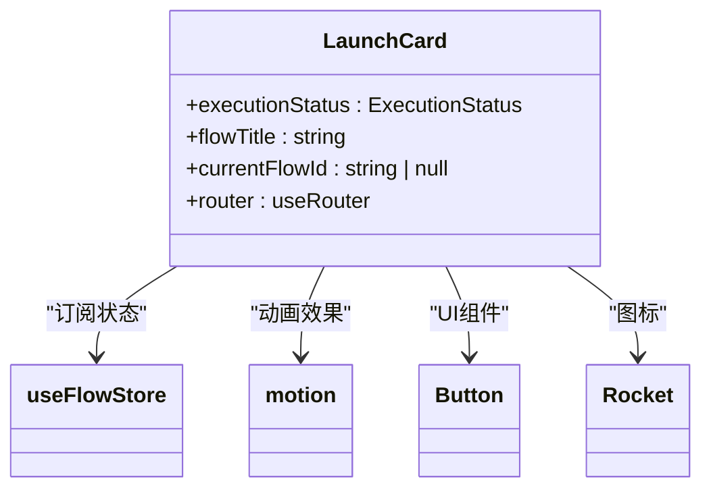
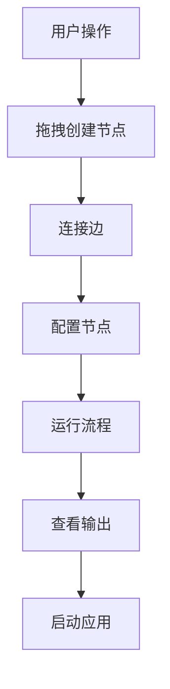
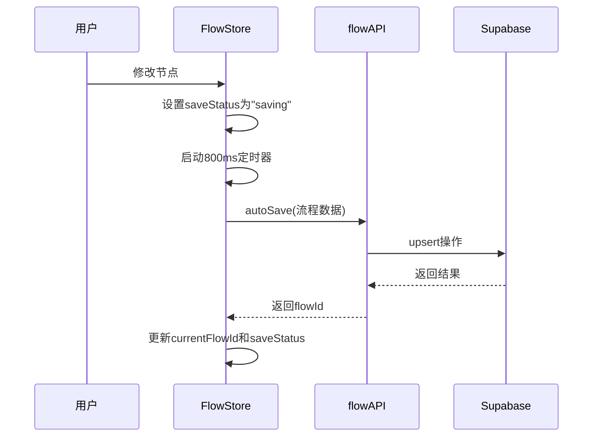
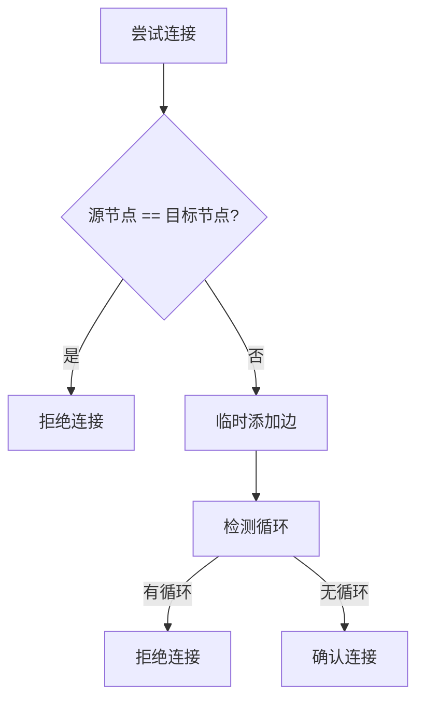
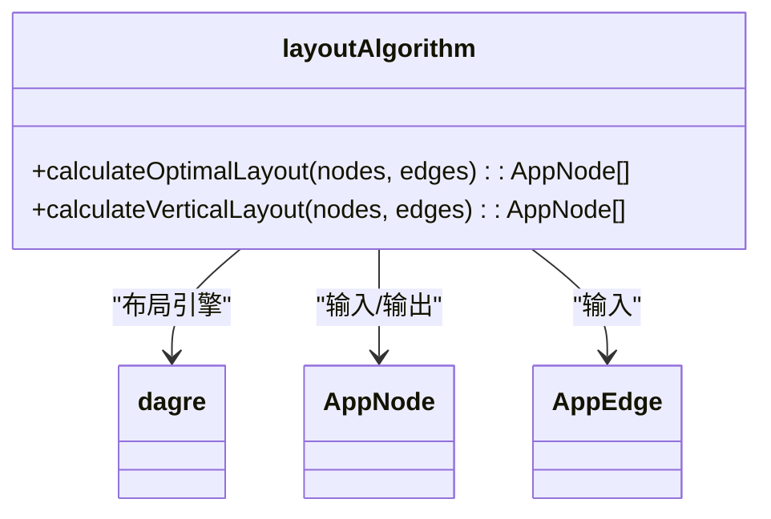
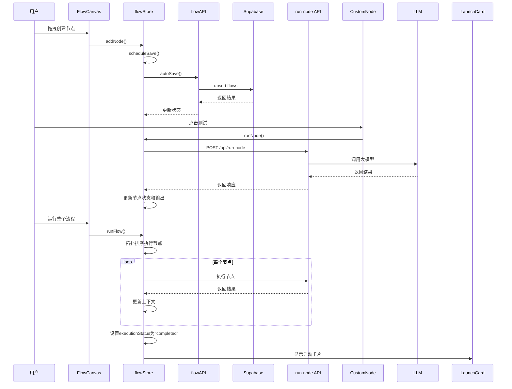

# 核心功能详解

<cite>
**本文档引用的文件**
- [FlowCanvas.tsx](file://src/components/flow/FlowCanvas.tsx)
- [flowAPI.ts](file://src/services/flowAPI.ts)
- [planNormalizer.ts](file://src/store/utils/planNormalizer.ts)
- [LaunchCard.tsx](file://src/components/builder/LaunchCard.tsx)
- [flowStore.ts](file://src/store/flowStore.ts)
- [layoutAlgorithm.ts](file://src/store/utils/layoutAlgorithm.ts)
- [cycleDetection.ts](file://src/store/utils/cycleDetection.ts)
- [CustomNode.tsx](file://src/components/flow/CustomNode.tsx)
- [nodeActions.ts](file://src/store/actions/nodeActions.ts)
- [edgeActions.ts](file://src/store/actions/edgeActions.ts)
- [executionActions.ts](file://src/store/actions/executionActions.ts)
- [route.ts](file://src/app/api/run-node/route.ts)
- [route.ts](file://src/app/api/modify-flow/route.ts)
- [page.tsx](file://src/app/builder/[id]/page.tsx)
- [flow.ts](file://src/types/flow.ts)
</cite>

## 目录
1. [项目结构](#项目结构)
2. [可视化画布（FlowCanvas）](#可视化画布flowcanvas)
3. [流程持久化（flowAPI）](#流程持久化flowapi)
4. [智能规划（planNormalizer）](#智能规划plannormalizer)
5. [节点启动机制（LaunchCard）](#节点启动机制launchcard)
6. [用户交互流程](#用户交互流程)
7. [关键技术点](#关键技术点)
8. [功能交互流程图](#功能交互流程图)

## 项目结构

该平台采用Next.js框架构建，主要目录结构如下：
- `src/app/`：应用路由和页面
- `src/components/`：UI组件
- `src/store/`：状态管理
- `src/services/`：API服务
- `src/types/`：类型定义
- `src/utils/`：工具函数

**Section sources**
- [FlowCanvas.tsx](file://src/components/flow/FlowCanvas.tsx)
- [flowAPI.ts](file://src/services/flowAPI.ts)
- [planNormalizer.ts](file://src/store/utils/planNormalizer.ts)
- [LaunchCard.tsx](file://src/components/builder/LaunchCard.tsx)

## 可视化画布（FlowCanvas）

可视化画布是用户创建和编辑工作流的核心界面，基于React Flow库实现。用户可以通过拖拽创建节点、连接边，并实时查看流程状态。



**Diagram sources**
- [FlowCanvas.tsx](file://src/components/flow/FlowCanvas.tsx)
- [CustomNode.tsx](file://src/components/flow/CustomNode.tsx)

**Section sources**
- [FlowCanvas.tsx](file://src/components/flow/FlowCanvas.tsx#L1-L82)
- [CustomNode.tsx](file://src/components/flow/CustomNode.tsx#L1-L187)

## 流程持久化（flowAPI）

流程持久化服务负责与Supabase数据库交互，实现工作流的增删改查和自动保存功能。



**Diagram sources**
- [flowAPI.ts](file://src/services/flowAPI.ts#L1-L240)
- [flow.ts](file://src/types/flow.ts#L65-L77)

**Section sources**
- [flowAPI.ts](file://src/services/flowAPI.ts#L1-L240)
- [flowStore.ts](file://src/store/flowStore.ts#L50-L74)

## 智能规划（planNormalizer）

智能规划功能将LLM返回的非结构化计划数据转换为标准的工作流节点和边，实现从自然语言到可视化流程的转换。

```mermaid
classDiagram
class planNormalizer {
+normalizePlan(plan, prompt) : { nodes : AppNode[], edges : AppEdge[] }
}
planNormalizer --> Plan : "输入"
planNormalizer --> AppNode : "输出"
planNormalizer --> AppEdge : "输出"
planNormalizer --> nanoid : "ID生成"
```

**Diagram sources**
- [planNormalizer.ts](file://src/store/utils/planNormalizer.ts#L1-L130)
- [flow.ts](file://src/types/flow.ts#L46-L47)

**Section sources**
- [planNormalizer.ts](file://src/store/utils/planNormalizer.ts#L1-L130)

## 节点启动机制（LaunchCard）

节点启动机制通过LaunchCard组件实现，当工作流执行完成后，会显示一个浮动卡片，允许用户一键启动生成的应用。



**Diagram sources**
- [LaunchCard.tsx](file://src/components/builder/LaunchCard.tsx#L1-L56)
- [flowStore.ts](file://src/store/flowStore.ts#L95-L96)

**Section sources**
- [LaunchCard.tsx](file://src/components/builder/LaunchCard.tsx#L1-L56)

## 用户交互流程

用户通过以下步骤创建和运行工作流：
1. 在画布上拖拽创建节点
2. 连接节点形成工作流
3. 配置节点参数
4. 运行工作流
5. 查看执行结果



**Diagram sources**
- [FlowCanvas.tsx](file://src/components/flow/FlowCanvas.tsx#L23-L37)
- [CustomNode.tsx](file://src/components/flow/CustomNode.tsx#L85-L105)
- [executionActions.ts](file://src/store/actions/executionActions.ts#L23-L180)

**Section sources**
- [FlowCanvas.tsx](file://src/components/flow/FlowCanvas.tsx#L23-L37)
- [CustomNode.tsx](file://src/components/flow/CustomNode.tsx#L85-L105)

## 关键技术点

### 自动保存机制
系统通过debounce技术实现自动保存，用户操作后800毫秒内无新操作则触发保存。



**Diagram sources**
- [flowStore.ts](file://src/store/flowStore.ts#L50-L74)
- [flowAPI.ts](file://src/services/flowAPI.ts#L211-L224)

### 循环检测
在连接节点时，系统会检测是否形成循环，避免无限执行。



**Diagram sources**
- [edgeActions.ts](file://src/store/actions/edgeActions.ts#L46-L67)
- [cycleDetection.ts](file://src/store/utils/cycleDetection.ts#L1-L34)

### 布局算法
使用Dagre算法自动计算节点布局，优化工作流的可视化效果。



**Diagram sources**
- [layoutAlgorithm.ts](file://src/store/utils/layoutAlgorithm.ts#L1-L120)
- [flowStore.ts](file://src/store/flowStore.ts#L129)

**Section sources**
- [layoutAlgorithm.ts](file://src/store/utils/layoutAlgorithm.ts#L1-L120)

## 功能交互流程图



**Diagram sources**
- [FlowCanvas.tsx](file://src/components/flow/FlowCanvas.tsx)
- [flowStore.ts](file://src/store/flowStore.ts)
- [flowAPI.ts](file://src/services/flowAPI.ts)
- [executionActions.ts](file://src/store/actions/executionActions.ts)
- [route.ts](file://src/app/api/run-node/route.ts)
- [LaunchCard.tsx](file://src/components/builder/LaunchCard.tsx)

**Section sources**
- [FlowCanvas.tsx](file://src/components/flow/FlowCanvas.tsx#L1-L82)
- [flowStore.ts](file://src/store/flowStore.ts#L17-L131)
- [flowAPI.ts](file://src/services/flowAPI.ts#L1-L240)
- [executionActions.ts](file://src/store/actions/executionActions.ts#L1-L291)
- [route.ts](file://src/app/api/run-node/route.ts#L1-L66)
- [LaunchCard.tsx](file://src/components/builder/LaunchCard.tsx#L1-L56)