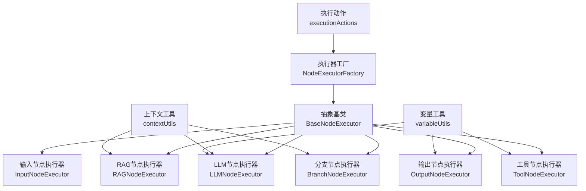
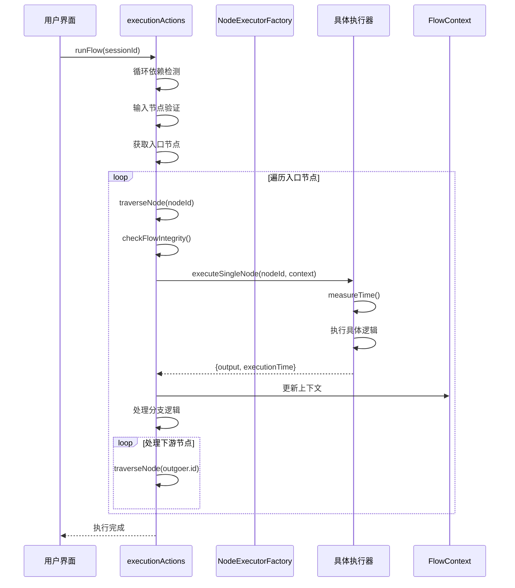
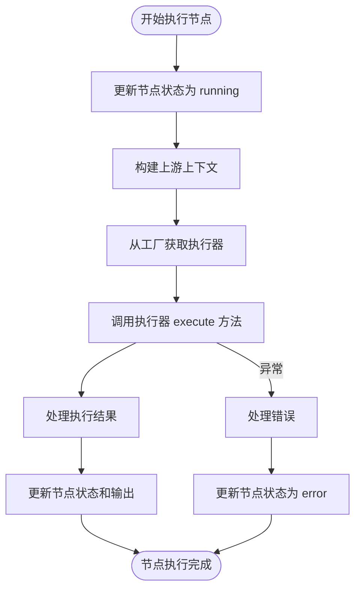
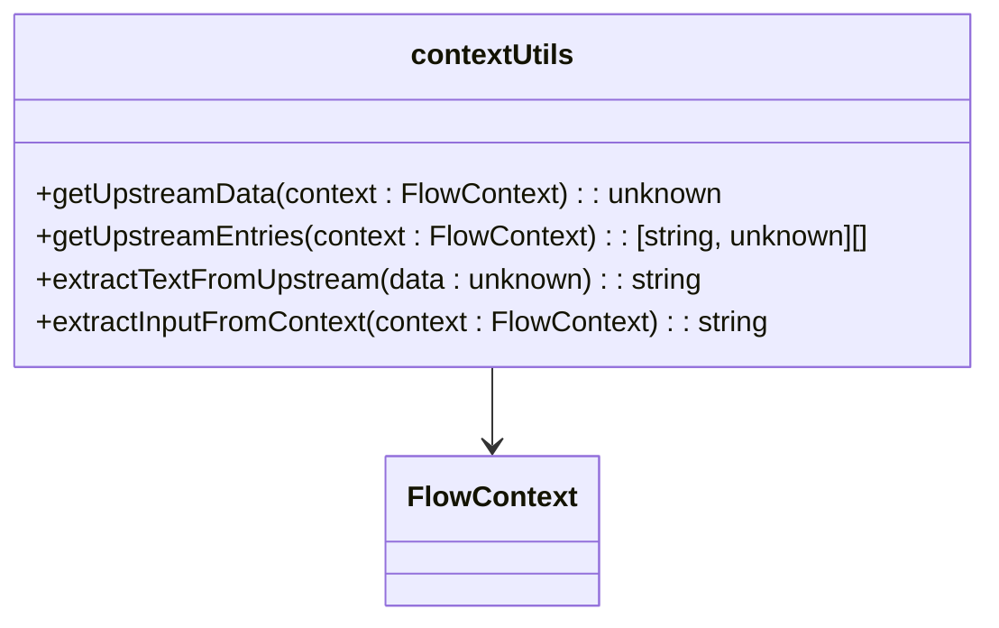
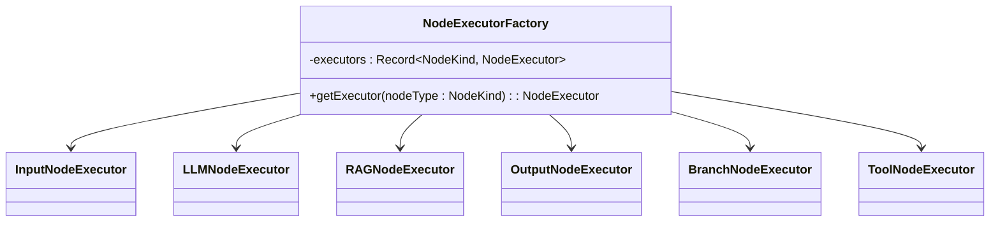
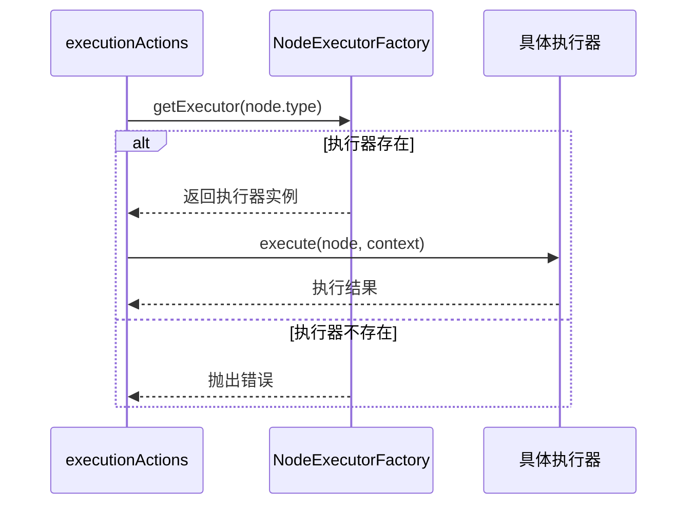
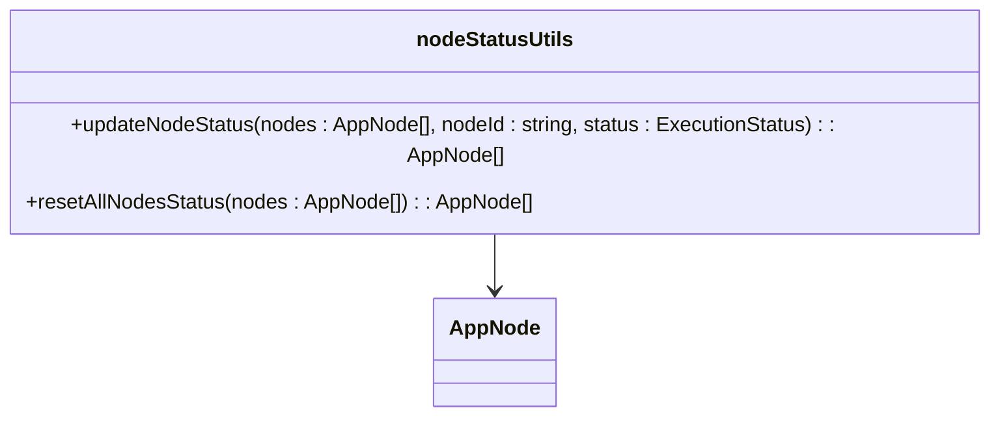

# 模块化执行器架构

<cite>
**本文档引用的文件**  
- [BaseNodeExecutor.ts](file://src/store/executors/BaseNodeExecutor.ts)
- [NodeExecutorFactory.ts](file://src/store/executors/NodeExecutorFactory.ts)
- [executionActions.ts](file://src/store/actions/executionActions.ts)
- [InputNodeExecutor.ts](file://src/store/executors/InputNodeExecutor.ts)
- [LLMNodeExecutor.ts](file://src/store/executors/LLMNodeExecutor.ts)
- [RAGNodeExecutor.ts](file://src/store/executors/RAGNodeExecutor.ts)
- [OutputNodeExecutor.ts](file://src/store/executors/OutputNodeExecutor.ts)
- [BranchNodeExecutor.ts](file://src/store/executors/BranchNodeExecutor.ts)
- [ToolNodeExecutor.ts](file://src/store/executors/ToolNodeExecutor.ts)
- [contextUtils.ts](file://src/store/executors/contextUtils.ts)
- [executorConfig.ts](file://src/store/constants/executorConfig.ts)
- [variableUtils.ts](file://src/store/executors/utils/variableUtils.ts)
</cite>

## 目录
1. [简介](#简介)
2. [执行器架构概览](#执行器架构概览)
3. [核心执行器组件](#核心执行器组件)
4. [执行流程分析](#执行流程分析)
5. [上下文与数据流管理](#上下文与数据流管理)
6. [执行器工厂模式](#执行器工厂模式)
7. [节点类型执行逻辑](#节点类型执行逻辑)
8. [错误处理与状态管理](#错误处理与状态管理)
9. [配置与工具函数](#配置与工具函数)
10. [总结](#总结)

## 简介

模块化执行器架构是 Flash Flow 可视化 AI 工作流编排平台的核心执行引擎。该架构采用面向对象的设计模式，通过抽象基类、具体实现类和工厂模式，实现了不同类型节点的可扩展、可维护的执行机制。每个节点类型都有独立的执行器，负责处理该节点的业务逻辑、数据输入输出和状态管理。

**Section sources**
- [BaseNodeExecutor.ts](file://src/store/executors/BaseNodeExecutor.ts)
- [NodeExecutorFactory.ts](file://src/store/executors/NodeExecutorFactory.ts)

## 执行器架构概览

Flash Flow 的执行器架构采用分层设计，主要包括以下几个核心组件：

- **抽象基类**：`BaseNodeExecutor` 定义了所有执行器的公共接口和基础功能
- **具体执行器**：每种节点类型都有对应的执行器实现，如 `InputNodeExecutor`、`LLMNodeExecutor` 等
- **执行器工厂**：`NodeExecutorFactory` 负责根据节点类型创建和管理具体的执行器实例
- **执行动作**：`executionActions` 封装了工作流的执行逻辑，协调各个执行器的调用



**Diagram sources**
- [BaseNodeExecutor.ts](file://src/store/executors/BaseNodeExecutor.ts)
- [NodeExecutorFactory.ts](file://src/store/executors/NodeExecutorFactory.ts)
- [executionActions.ts](file://src/store/actions/executionActions.ts)

**Section sources**
- [BaseNodeExecutor.ts](file://src/store/executors/BaseNodeExecutor.ts)
- [NodeExecutorFactory.ts](file://src/store/executors/NodeExecutorFactory.ts)
- [executionActions.ts](file://src/store/actions/executionActions.ts)

## 核心执行器组件

### 抽象基类设计

`BaseNodeExecutor` 是所有节点执行器的抽象基类，定义了统一的执行接口和基础功能。它实现了 `NodeExecutor` 接口，强制所有子类实现 `execute` 方法。

```mermaid
classDiagram
class NodeExecutor {
<<interface>>
+execute(node : AppNode, context : FlowContext, mockData? : Record) : Promise~ExecutionResult~
}
class BaseNodeExecutor {
+execute(node : AppNode, context : FlowContext, mockData? : Record) : Promise~ExecutionResult~
-measureTime~T~(fn : () => Promise~T~) : Promise~{result : T, time : number}~
-delay(ms : number) : Promise~void~
}
class ExecutionResult {
+output : Record~string, unknown~
+executionTime : number
}
NodeExecutor <|.. BaseNodeExecutor
BaseNodeExecutor <|-- InputNodeExecutor
BaseNodeExecutor <|-- LLMNodeExecutor
BaseNodeExecutor <|-- RAGNodeExecutor
BaseNodeExecutor <|-- OutputNodeExecutor
BaseNodeExecutor <|-- BranchNodeExecutor
BaseNodeExecutor <|-- ToolNodeExecutor
```

**Diagram sources**
- [BaseNodeExecutor.ts](file://src/store/executors/BaseNodeExecutor.ts)

**Section sources**
- [BaseNodeExecutor.ts](file://src/store/executors/BaseNodeExecutor.ts)

### 执行器接口与结果

执行器通过 `ExecutionResult` 接口返回执行结果，包含输出数据和执行时间。这种设计使得所有执行器的返回值具有一致的结构，便于上层逻辑处理。

**Section sources**
- [BaseNodeExecutor.ts](file://src/store/executors/BaseNodeExecutor.ts)

## 执行流程分析

### 工作流执行流程

工作流的执行由 `executionActions` 中的 `runFlow` 方法协调，采用深度优先遍历的方式执行节点。



**Diagram sources**
- [executionActions.ts](file://src/store/actions/executionActions.ts)

**Section sources**
- [executionActions.ts](file://src/store/actions/executionActions.ts)

### 单节点执行流程

单个节点的执行流程包括状态更新、上下文构建、执行器调用和结果处理等步骤。



**Diagram sources**
- [executionActions.ts](file://src/store/actions/executionActions.ts)

**Section sources**
- [executionActions.ts](file://src/store/actions/executionActions.ts)

## 上下文与数据流管理

### 上下文传递机制

执行器通过 `FlowContext` 对象在节点间传递数据，每个节点的输出都会被添加到上下文中，供下游节点使用。

```mermaid
classDiagram
class FlowContext {
+_meta : {flowId : string, sessionId : string}
+[nodeId : string] : Record~string, unknown~
}
class AppNode {
+id : string
+type : NodeKind
+data : NodeData
}
class AppEdge {
+source : string
+target : string
+sourceHandle : string
}
FlowContext --> AppNode : 包含节点输出
AppEdge --> AppNode : 连接节点
```

**Diagram sources**
- [executionActions.ts](file://src/store/actions/executionActions.ts)

**Section sources**
- [executionActions.ts](file://src/store/actions/executionActions.ts)

### 上下文工具函数

`contextUtils.ts` 提供了处理上下文数据的工具函数，包括获取上游数据、提取文本内容等。



**Diagram sources**
- [contextUtils.ts](file://src/store/executors/contextUtils.ts)

**Section sources**
- [contextUtils.ts](file://src/store/executors/contextUtils.ts)

## 执行器工厂模式

### 工厂实现

`NodeExecutorFactory` 采用单例模式，预创建所有类型的执行器实例，通过 `getExecutor` 方法根据节点类型返回对应的执行器。



**Diagram sources**
- [NodeExecutorFactory.ts](file://src/store/executors/NodeExecutorFactory.ts)

**Section sources**
- [NodeExecutorFactory.ts](file://src/store/executors/NodeExecutorFactory.ts)

### 工厂使用流程



**Diagram sources**
- [NodeExecutorFactory.ts](file://src/store/executors/NodeExecutorFactory.ts)
- [executionActions.ts](file://src/store/actions/executionActions.ts)

## 节点类型执行逻辑

### 输入节点执行器

`InputNodeExecutor` 负责处理输入节点的执行逻辑，提取用户输入的数据。

**Section sources**
- [InputNodeExecutor.ts](file://src/store/executors/InputNodeExecutor.ts)

### LLM节点执行器

`LLMNodeExecutor` 处理大语言模型节点的执行，包括变量替换、对话记忆、配额检查等功能。

**Section sources**
- [LLMNodeExecutor.ts](file://src/store/executors/LLMNodeExecutor.ts)

### RAG节点执行器

`RAGNodeExecutor` 实现检索增强生成功能，通过 Gemini File Search API 进行语义搜索。

**Section sources**
- [RAGNodeExecutor.ts](file://src/store/executors/RAGNodeExecutor.ts)

### 输出节点执行器

`OutputNodeExecutor` 处理输出节点的执行，支持多种输出模式。

**Section sources**
- [OutputNodeExecutor.ts](file://src/store/executors/OutputNodeExecutor.ts)

### 分支节点执行器

`BranchNodeExecutor` 实现条件分支逻辑，通过安全表达式求值器评估条件。

**Section sources**
- [BranchNodeExecutor.ts](file://src/store/executors/BranchNodeExecutor.ts)

### 工具节点执行器

`ToolNodeExecutor` 负责执行外部工具，如网页搜索、计算器等。

**Section sources**
- [ToolNodeExecutor.ts](file://src/store/executors/ToolNodeExecutor.ts)

## 错误处理与状态管理

### 错误处理机制

执行器通过 try-catch 捕获异常，并将错误信息返回给上层调用者。

**Section sources**
- [BaseNodeExecutor.ts](file://src/store/executors/BaseNodeExecutor.ts)
- [executionActions.ts](file://src/store/actions/executionActions.ts)

### 状态管理

节点执行状态通过 `nodeStatusUtils` 进行管理，包括更新和重置状态。



**Diagram sources**
- [nodeStatusUtils.ts](file://src/store/utils/nodeStatusUtils.ts)

**Section sources**
- [nodeStatusUtils.ts](file://src/store/utils/nodeStatusUtils.ts)

## 配置与工具函数

### 执行器配置

`executorConfig.ts` 定义了执行器的配置常量，如默认延迟、模型名称等。

**Section sources**
- [executorConfig.ts](file://src/store/constants/executorConfig.ts)

### 变量工具

`variableUtils.ts` 提供了变量收集和扁平化处理的工具函数。

**Section sources**
- [variableUtils.ts](file://src/store/executors/utils/variableUtils.ts)

## 总结

模块化执行器架构通过清晰的分层设计和面向对象的实现，为 Flash Flow 平台提供了强大而灵活的执行能力。该架构具有以下特点：

- **可扩展性**：通过工厂模式和抽象基类，可以轻松添加新的节点类型
- **可维护性**：每个执行器职责单一，代码易于理解和维护
- **一致性**：统一的接口和数据结构，确保了执行流程的一致性
- **安全性**：通过安全表达式求值器和配额检查，保障了系统的安全运行

这种架构设计不仅满足了当前的功能需求，也为未来的功能扩展提供了坚实的基础。