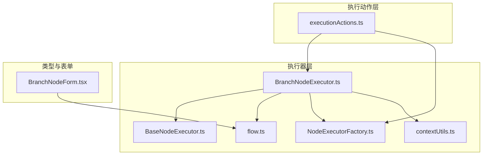
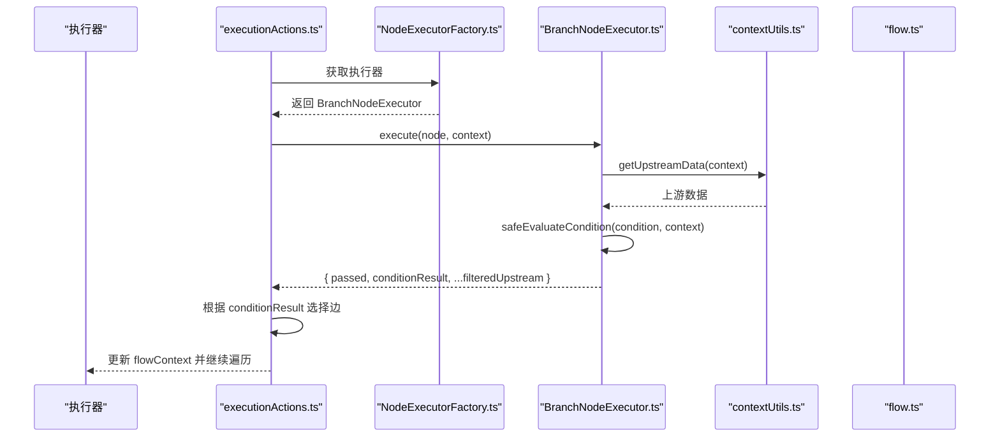
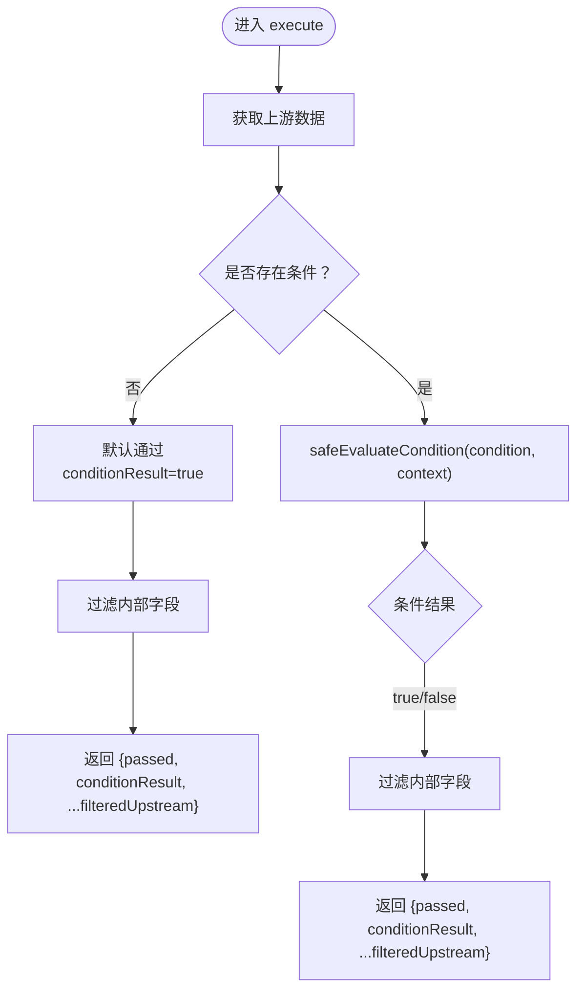
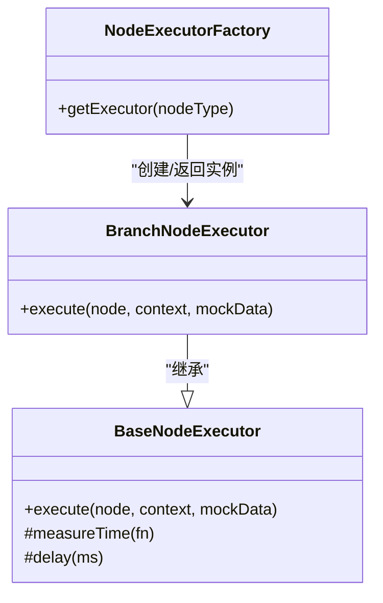
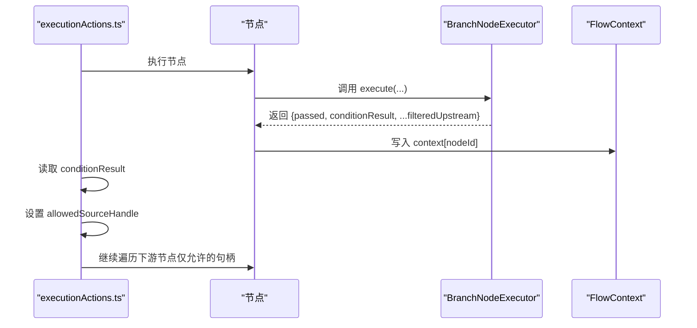
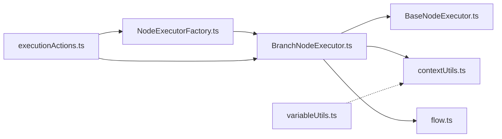

# BranchNodeExecutor 增强

<cite>
**本文引用的文件列表**
- [BranchNodeExecutor.ts](file://src/store/executors/BranchNodeExecutor.ts)
- [BaseNodeExecutor.ts](file://src/store/executors/BaseNodeExecutor.ts)
- [NodeExecutorFactory.ts](file://src/store/executors/NodeExecutorFactory.ts)
- [contextUtils.ts](file://src/store/executors/contextUtils.ts)
- [variableUtils.ts](file://src/store/executors/utils/variableUtils.ts)
- [flow.ts](file://src/types/flow.ts)
- [executionActions.ts](file://src/store/actions/executionActions.ts)
- [BranchNodeForm.tsx](file://src/components/builder/node-forms/BranchNodeForm.tsx)
- [README.md](file://README.md)
- [节点详情.MD](file://节点详情.MD)
</cite>

## 目录
1. [简介](#简介)
2. [项目结构](#项目结构)
3. [核心组件](#核心组件)
4. [架构总览](#架构总览)
5. [详细组件分析](#详细组件分析)
6. [依赖关系分析](#依赖关系分析)
7. [性能考量](#性能考量)
8. [故障排查指南](#故障排查指南)
9. [结论](#结论)
10. [附录](#附录)

## 简介
本文件围绕 BranchNodeExecutor 的“增强”进行系统化技术文档梳理，重点解释其在表达式安全求值、上游数据透传、执行上下文与流程控制中的关键实现，以及与工厂类、执行动作、类型定义、表单配置等模块的协同关系。目标是帮助开发者在不深入源码的情况下理解其设计动机、运行机制与扩展点，并提供可操作的优化建议与排障指引。

## 项目结构
- 执行器层位于 src/store/executors，包含基础抽象、具体执行器与工具函数。
- 类型定义位于 src/types/flow，统一约束节点类型、数据结构与上下文。
- 执行动作位于 src/store/actions，负责遍历节点、构建上下文、分支选择与错误处理。
- 表单配置位于 src/components/builder/node-forms，提供 Branch 节点的条件输入界面。
- 文档与说明位于 README.md 与 节点详情.MD，提供高层功能说明与执行逻辑要点。

图表来源
- [BranchNodeExecutor.ts](file://src/store/executors/BranchNodeExecutor.ts#L1-L236)
- [contextUtils.ts](file://src/store/executors/contextUtils.ts#L1-L124)
- [NodeExecutorFactory.ts](file://src/store/executors/NodeExecutorFactory.ts#L1-L28)
- [flow.ts](file://src/types/flow.ts#L1-L309)
- [executionActions.ts](file://src/store/actions/executionActions.ts#L1-L248)
- [BranchNodeForm.tsx](file://src/components/builder/node-forms/BranchNodeForm.tsx#L1-L51)

章节来源
- [BranchNodeExecutor.ts](file://src/store/executors/BranchNodeExecutor.ts#L1-L236)
- [executionActions.ts](file://src/store/actions/executionActions.ts#L1-L248)
- [flow.ts](file://src/types/flow.ts#L1-L309)

## 核心组件
- BranchNodeExecutor：实现分支节点的安全表达式求值与上游数据透传，输出包含 conditionResult 与过滤后的上游数据。
- BaseNodeExecutor：提供统一的执行接口与计时能力。
- NodeExecutorFactory：集中管理各节点类型的执行器实例。
- contextUtils：提供上游数据提取、文本提取与上下文字段过滤等工具。
- variableUtils：变量扁平化与收集，支持节点标签/ID 前缀引用。
- executionActions：流程执行入口，负责拓扑遍历、上下文构建、分支选择与错误处理。
- BranchNodeForm：分支节点表单，提供条件输入与节点名称引用说明。

章节来源
- [BranchNodeExecutor.ts](file://src/store/executors/BranchNodeExecutor.ts#L1-L236)
- [BaseNodeExecutor.ts](file://src/store/executors/BaseNodeExecutor.ts#L1-L26)
- [NodeExecutorFactory.ts](file://src/store/executors/NodeExecutorFactory.ts#L1-L28)
- [contextUtils.ts](file://src/store/executors/contextUtils.ts#L1-L124)
- [variableUtils.ts](file://src/store/executors/utils/variableUtils.ts#L1-L139)
- [executionActions.ts](file://src/store/actions/executionActions.ts#L1-L248)
- [BranchNodeForm.tsx](file://src/components/builder/node-forms/BranchNodeForm.tsx#L1-L51)

## 架构总览
BranchNodeExecutor 的增强主要体现在以下方面：
- 表达式安全求值：通过白名单正则与受控解析，仅允许有限方法与比较操作，避免注入风险。
- 上游数据透传：在过滤内部字段后，将上游输出原样透传，便于下游节点直接消费。
- 执行上下文集成：利用 _meta.nodeLabels 与节点标签/ID 进行节点名解析，提升表达式可读性。
- 流程控制联动：executionActions 在分支节点处依据 conditionResult 选择边的目标句柄，实现条件分支。

图表来源
- [executionActions.ts](file://src/store/actions/executionActions.ts#L186-L227)
- [NodeExecutorFactory.ts](file://src/store/executors/NodeExecutorFactory.ts#L1-L28)
- [BranchNodeExecutor.ts](file://src/store/executors/BranchNodeExecutor.ts#L192-L236)
- [contextUtils.ts](file://src/store/executors/contextUtils.ts#L1-L15)
- [flow.ts](file://src/types/flow.ts#L1-L309)

## 详细组件分析

### BranchNodeExecutor 增强点与实现
- 安全表达式求值器
  - 仅支持白名单方法与比较操作，包括字符串方法（includes/startsWith/endsWith）、数值比较（>, >=, <, <=）、严格相等/不等、属性访问与 length 访问。
  - 通过正则解析表达式，提取节点名与路径，结合上下文与 _meta.nodeLabels 进行节点定位。
  - 对比较值进行安全解析，支持布尔、数字与去引号字符串。
- 上游数据透传与过滤
  - 透传上游输出时过滤以“_”开头的内部字段，避免泄露上下文元数据。
  - 若上游为非对象，包装为 { value: upstream } 以保证下游一致性。
- 默认条件行为
  - 未配置条件时，默认通过并返回 true，保持流程连通性。
- 执行计时
  - 继承 BaseNodeExecutor 的 measureTime，记录执行耗时。

图表来源
- [BranchNodeExecutor.ts](file://src/store/executors/BranchNodeExecutor.ts#L192-L236)
- [contextUtils.ts](file://src/store/executors/contextUtils.ts#L1-L15)

章节来源
- [BranchNodeExecutor.ts](file://src/store/executors/BranchNodeExecutor.ts#L1-L236)

### BaseNodeExecutor 与 NodeExecutorFactory
- BaseNodeExecutor
  - 定义统一接口与计时/延迟辅助方法，为各节点执行器提供一致的生命周期与性能度量能力。
- NodeExecutorFactory
  - 集中注册 input/llm/rag/output/branch/tool 执行器，按节点类型返回对应实例，便于执行动作层统一调度。

图表来源
- [BaseNodeExecutor.ts](file://src/store/executors/BaseNodeExecutor.ts#L1-L26)
- [NodeExecutorFactory.ts](file://src/store/executors/NodeExecutorFactory.ts#L1-L28)
- [BranchNodeExecutor.ts](file://src/store/executors/BranchNodeExecutor.ts#L192-L236)

章节来源
- [BaseNodeExecutor.ts](file://src/store/executors/BaseNodeExecutor.ts#L1-L26)
- [NodeExecutorFactory.ts](file://src/store/executors/NodeExecutorFactory.ts#L1-L28)

### 执行动作与分支选择
- executionActions.runFlow
  - 构建包含 _meta.nodeLabels 的 FlowContext，以便表达式解析节点名。
  - 遍历节点执行，将每个节点输出写回 context[nodeId]。
  - 分支节点执行后，读取 conditionResult 决定允许的源句柄（true/false），仅向该方向传播。
  - 错误捕获与状态更新，确保执行失败时能反馈错误信息。

图表来源
- [executionActions.ts](file://src/store/actions/executionActions.ts#L186-L227)
- [BranchNodeExecutor.ts](file://src/store/executors/BranchNodeExecutor.ts#L192-L236)

章节来源
- [executionActions.ts](file://src/store/actions/executionActions.ts#L110-L248)

### 类型与表单配置
- flow.ts
  - 定义 BranchNodeData 的 condition 字段，约束 Branch 节点的条件表达式。
  - FlowContext 规范上下文键值对，_meta 保留元数据（含 nodeLabels）。
- BranchNodeForm.tsx
  - 提供 label 与 condition 输入项，提示使用“节点名.字段名”的引用方式，降低表达式编写门槛。

章节来源
- [flow.ts](file://src/types/flow.ts#L143-L146)
- [BranchNodeForm.tsx](file://src/components/builder/node-forms/BranchNodeForm.tsx#L1-L51)

## 依赖关系分析
- 执行器依赖
  - BranchNodeExecutor 依赖 BaseNodeExecutor（接口与计时）、contextUtils（上游数据与过滤）、flow.ts（类型约束）。
- 工厂与动作
  - NodeExecutorFactory 为执行动作层提供统一入口；executionActions.runFlow 负责流程遍历与分支选择。
- 变量系统
  - variableUtils 与 contextUtils 协同，前者负责变量扁平化与优先级，后者负责文本提取与字段过滤，共同支撑表达式解析与输出一致性。

图表来源
- [BranchNodeExecutor.ts](file://src/store/executors/BranchNodeExecutor.ts#L1-L236)
- [BaseNodeExecutor.ts](file://src/store/executors/BaseNodeExecutor.ts#L1-L26)
- [contextUtils.ts](file://src/store/executors/contextUtils.ts#L1-L124)
- [variableUtils.ts](file://src/store/executors/utils/variableUtils.ts#L1-L139)
- [NodeExecutorFactory.ts](file://src/store/executors/NodeExecutorFactory.ts#L1-L28)
- [executionActions.ts](file://src/store/actions/executionActions.ts#L1-L248)
- [flow.ts](file://src/types/flow.ts#L1-L309)

章节来源
- [BranchNodeExecutor.ts](file://src/store/executors/BranchNodeExecutor.ts#L1-L236)
- [executionActions.ts](file://src/store/actions/executionActions.ts#L1-L248)
- [variableUtils.ts](file://src/store/executors/utils/variableUtils.ts#L1-L139)

## 性能考量
- 计时与延迟
  - BaseNodeExecutor.measureTime 提供毫秒级执行耗时统计，便于监控与优化。
  - delay 方法可用于节流或模拟异步，但 BranchNodeExecutor 未使用。
- 表达式解析成本
  - safeEvaluateCondition 使用正则与字符串匹配，复杂度与表达式长度线性相关；建议保持表达式简洁，避免深层嵌套。
- 上游数据过滤
  - 过滤以“_”开头字段的开销较小，但在高并发或大数据量时仍应避免不必要的冗余输出。
- 遍历与分支选择
  - executionActions.runFlow 对每个节点执行一次 evaluate，分支节点额外进行 conditionResult 判断；整体复杂度与节点数线性相关。

章节来源
- [BaseNodeExecutor.ts](file://src/store/executors/BaseNodeExecutor.ts#L1-L26)
- [BranchNodeExecutor.ts](file://src/store/executors/BranchNodeExecutor.ts#L1-L236)
- [executionActions.ts](file://src/store/actions/executionActions.ts#L186-L227)

## 故障排查指南
- 表达式不生效或返回 false
  - 检查表达式格式是否符合白名单规则（字符串方法、数值比较、严格相等/不等、属性访问）。
  - 确认节点名与路径正确，节点名支持中文与英文，且需与上下文中的 nodeId 或 _meta.nodeLabels 匹配。
  - 若上游数据为非对象，将被包装为 { value: upstream }，注意表达式引用的字段名。
- 分支未按预期走
  - 检查 conditionResult 是否为期望值；executionActions 会依据该值选择 true/false 句柄。
  - 确保 FlowContext 中存在 _meta.nodeLabels，以便节点名解析。
- 上游数据缺失或包含内部字段
  - 上游数据透传时已过滤“_”开头字段；若下游需要某些内部元数据，请确认是否应放入业务输出而非内部字段。
- 执行报错
  - executionActions.runFlow 捕获异常并设置 executionStatus 为 error，查看 executionError 获取错误信息。

章节来源
- [BranchNodeExecutor.ts](file://src/store/executors/BranchNodeExecutor.ts#L1-L236)
- [executionActions.ts](file://src/store/actions/executionActions.ts#L229-L248)
- [contextUtils.ts](file://src/store/executors/contextUtils.ts#L1-L124)

## 结论
BranchNodeExecutor 的增强以“安全表达式求值 + 上游数据透传 + 执行上下文集成 + 流程控制联动”为核心，既保证了表达式的可控性与安全性，又提升了分支决策的灵活性与可维护性。配合 NodeExecutorFactory 的统一调度与 executionActions 的流程控制，形成清晰、可扩展的执行链路。建议在实际使用中：
- 保持表达式简洁，遵循白名单规则；
- 合理命名节点，确保 _meta.nodeLabels 与表达式引用一致；
- 关注执行耗时与上游数据体积，必要时在上游节点精简输出；
- 利用表单与文档说明，降低使用者的学习成本。

## 附录
- 参考文档
  - README.md：项目概览与节点能力说明。
  - 节点详情.MD：分支节点执行逻辑与表达式支持清单。

章节来源
- [README.md](file://README.md#L144-L158)
- [节点详情.MD](file://节点详情.MD#L524-L635)