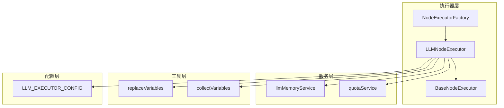
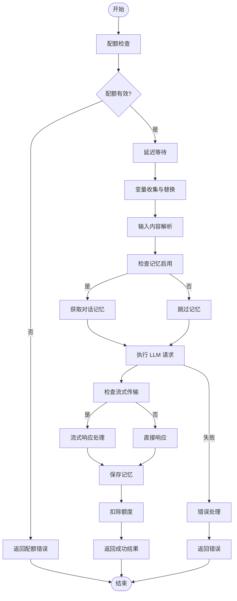
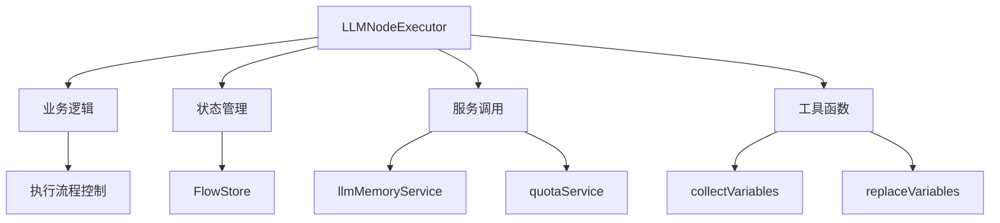
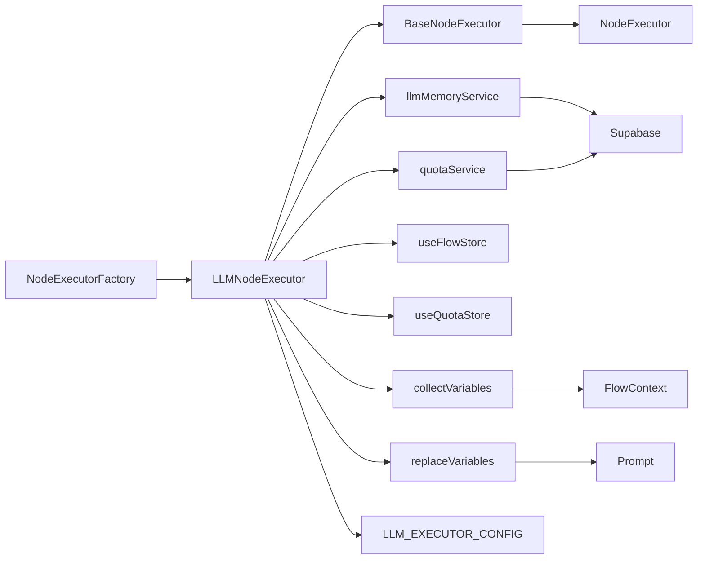

# LLMNodeExecutor 重构

<cite>
**本文档引用的文件**   
- [LLMNodeExecutor.ts](file://src/store/executors/LLMNodeExecutor.ts)
- [BaseNodeExecutor.ts](file://src/store/executors/BaseNodeExecutor.ts)
- [NodeExecutorFactory.ts](file://src/store/executors/NodeExecutorFactory.ts)
- [flow.ts](file://src/types/flow.ts)
- [variableUtils.ts](file://src/store/executors/utils/variableUtils.ts)
- [promptParser.ts](file://src/lib/promptParser.ts)
- [llmMemoryService.ts](file://src/services/llmMemoryService.ts)
- [quotaService.ts](file://src/services/quotaService.ts)
- [executorConfig.ts](file://src/store/constants/executorConfig.ts)
- [LLMNodeForm.tsx](file://src/components/builder/node-forms/LLMNodeForm.tsx)
- [run-node-stream/route.ts](file://src/app/api/run-node-stream/route.ts)
</cite>

## 目录
1. [简介](#简介)
2. [项目结构](#项目结构)
3. [核心组件](#核心组件)
4. [架构概述](#架构概述)
5. [详细组件分析](#详细组件分析)
6. [依赖分析](#依赖分析)
7. [性能考虑](#性能考虑)
8. [故障排除指南](#故障排除指南)
9. [结论](#结论)

## 简介
LLMNodeExecutor 是 Flash Flow SaaS 应用中的核心执行器，负责处理 LLM（大语言模型）节点的执行逻辑。该组件实现了完整的执行流程，包括配额检查、变量替换、对话记忆管理、流式响应处理和额度扣减等功能。本重构文档旨在深入分析其设计模式、执行流程和与其他系统的集成方式。

## 项目结构
LLMNodeExecutor 位于应用的执行器层，是节点执行体系的重要组成部分。它与其他执行器共同构成了基于工厂模式的可扩展执行器架构。



**图表来源**
- [LLMNodeExecutor.ts](file://src/store/executors/LLMNodeExecutor.ts)
- [BaseNodeExecutor.ts](file://src/store/executors/BaseNodeExecutor.ts)
- [NodeExecutorFactory.ts](file://src/store/executors/NodeExecutorFactory.ts)
- [llmMemoryService.ts](file://src/services/llmMemoryService.ts)
- [quotaService.ts](file://src/services/quotaService.ts)
- [promptParser.ts](file://src/lib/promptParser.ts)
- [variableUtils.ts](file://src/store/executors/utils/variableUtils.ts)
- [executorConfig.ts](file://src/store/constants/executorConfig.ts)

**章节来源**
- [LLMNodeExecutor.ts](file://src/store/executors/LLMNodeExecutor.ts)
- [project_structure](file://project_structure)

## 核心组件
LLMNodeExecutor 是一个继承自 BaseNodeExecutor 的具体执行器，实现了 LLM 节点的完整执行逻辑。它通过组合多种服务和工具来完成复杂的执行任务，包括配额管理、对话记忆、变量处理和流式响应等功能。

**章节来源**
- [LLMNodeExecutor.ts](file://src/store/executors/LLMNodeExecutor.ts)
- [BaseNodeExecutor.ts](file://src/store/executors/BaseNodeExecutor.ts)

## 架构概述
LLMNodeExecutor 采用分层架构设计，将不同的职责分离到独立的模块中。这种设计提高了代码的可维护性和可测试性，同时也便于功能的扩展和修改。

```mermaid
graph TD
A[LLMNodeExecutor] --> B[配额检查]
A --> C[变量处理]
A --> D[对话记忆]
A --> E[流式执行]
A --> F[额度扣减]
B --> G[quotaService]
C --> H[collectVariables]
C --> I[replaceVariables]
D --> J[llmMemoryService]
E --> K[/api/run-node-stream]
F --> G
H --> L[FlowContext]
I --> M[System Prompt]
```

**图表来源**
- [LLMNodeExecutor.ts](file://src/store/executors/LLMNodeExecutor.ts)
- [quotaService.ts](file://src/services/quotaService.ts)
- [llmMemoryService.ts](file://src/services/llmMemoryService.ts)
- [variableUtils.ts](file://src/store/executors/utils/variableUtils.ts)
- [promptParser.ts](file://src/lib/promptParser.ts)
- [run-node-stream/route.ts](file://src/app/api/run-node-stream/route.ts)

## 详细组件分析
LLMNodeExecutor 的实现包含了多个关键功能模块，每个模块都负责特定的执行任务。这些模块协同工作，确保 LLM 节点能够正确、安全地执行。

### LLMNodeExecutor 分析
LLMNodeExecutor 的执行流程可以分为多个阶段，每个阶段都有明确的职责和处理逻辑。

#### 执行流程分析


**图表来源**
- [LLMNodeExecutor.ts](file://src/store/executors/LLMNodeExecutor.ts#L43-L193)

#### 类关系分析
```mermaid
classDiagram
class LLMNodeExecutor {
+execute(node, context, mockData) Promise~ExecutionResult~
-checkQuota(effectiveMockData) Promise~ExecutionResult | null~
-resolveInputContent(context, globalFlowContext, isUserFacingLLM, effectiveMockData) string
-fetchMemory(flowId, memoryNodeId, sessionId, maxTurns, inputContent) Promise~ConversationMessage[]~
-saveMemory(flowId, memoryNodeId, sessionId, role, content, maxTurns) Promise~void~
-incrementQuota() Promise~void~
}
class BaseNodeExecutor {
<<abstract>>
+execute(node, context, mockData) Promise~ExecutionResult~
+measureTime(fn) Promise~{result, time}~
+delay(ms) Promise~void~
}
LLMNodeExecutor --|> BaseNodeExecutor : 继承
LLMNodeExecutor --> "1" llmMemoryService : 使用
LLMNodeExecutor --> "1" quotaService : 使用
LLMNodeExecutor --> "1" useFlowStore : 使用
LLMNodeExecutor --> "1" useQuotaStore : 使用
LLMNodeExecutor --> "1" collectVariables : 使用
LLMNodeExecutor --> "1" replaceVariables : 使用
```

**图表来源**
- [LLMNodeExecutor.ts](file://src/store/executors/LLMNodeExecutor.ts)
- [BaseNodeExecutor.ts](file://src/store/executors/BaseNodeExecutor.ts)

**章节来源**
- [LLMNodeExecutor.ts](file://src/store/executors/LLMNodeExecutor.ts)
- [BaseNodeExecutor.ts](file://src/store/executors/BaseNodeExecutor.ts)

### 概念概述
LLMNodeExecutor 的设计体现了现代前端应用中常见的模式：组合式设计、依赖注入和关注点分离。通过将不同的功能分解到独立的服务中，代码的可维护性和可测试性得到了显著提升。



## 依赖分析
LLMNodeExecutor 与多个系统组件存在依赖关系，这些依赖关系构成了其功能实现的基础。



**图表来源**
- [LLMNodeExecutor.ts](file://src/store/executors/LLMNodeExecutor.ts)
- [BaseNodeExecutor.ts](file://src/store/executors/BaseNodeExecutor.ts)
- [NodeExecutorFactory.ts](file://src/store/executors/NodeExecutorFactory.ts)
- [llmMemoryService.ts](file://src/services/llmMemoryService.ts)
- [quotaService.ts](file://src/services/quotaService.ts)
- [variableUtils.ts](file://src/store/executors/utils/variableUtils.ts)
- [promptParser.ts](file://src/lib/promptParser.ts)
- [executorConfig.ts](file://src/store/constants/executorConfig.ts)

**章节来源**
- [LLMNodeExecutor.ts](file://src/store/executors/LLMNodeExecutor.ts)
- [BaseNodeExecutor.ts](file://src/store/executors/BaseNodeExecutor.ts)
- [NodeExecutorFactory.ts](file://src/store/executors/NodeExecutorFactory.ts)

## 性能考虑
LLMNodeExecutor 在设计时考虑了多个性能相关的问题，包括执行时间测量、流式响应处理和配额管理等。这些设计确保了用户体验的流畅性和系统的稳定性。

## 故障排除指南
当 LLMNodeExecutor 出现问题时，可以从以下几个方面进行排查：

1. **配额检查失败**：检查用户是否登录，以及配额服务是否正常工作
2. **对话记忆问题**：验证 flowId、sessionId 和 memoryNodeId 是否正确传递
3. **变量替换失败**：检查变量名称是否正确，以及上下文数据是否完整
4. **流式响应中断**：检查网络连接和 API 端点的可用性
5. **额度扣减失败**：验证用户身份和配额服务的更新逻辑

**章节来源**
- [LLMNodeExecutor.ts](file://src/store/executors/LLMNodeExecutor.ts)
- [quotaService.ts](file://src/services/quotaService.ts)
- [llmMemoryService.ts](file://src/services/llmMemoryService.ts)

## 结论
LLMNodeExecutor 的重构工作展示了良好的软件设计原则，包括单一职责原则、依赖倒置原则和开闭原则。通过将不同的功能分解到独立的模块中，代码的可维护性和可扩展性得到了显著提升。未来的改进方向可以包括更精细的错误处理、更灵活的配置管理和更完善的测试覆盖。