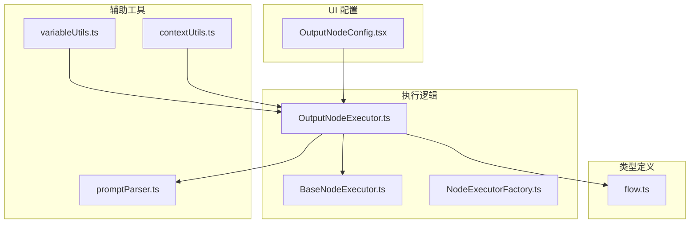
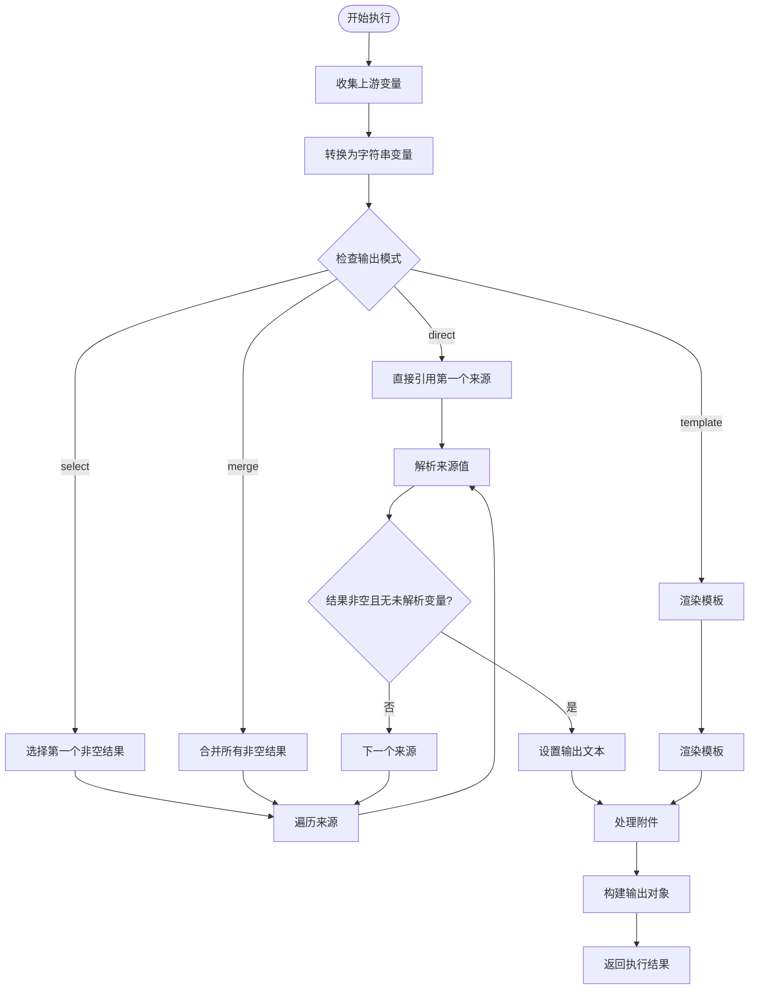
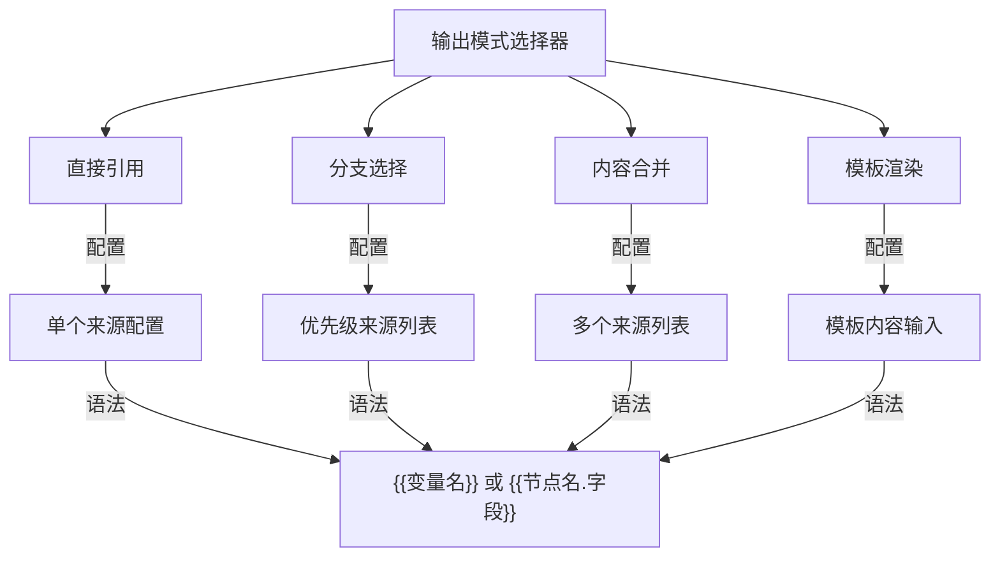
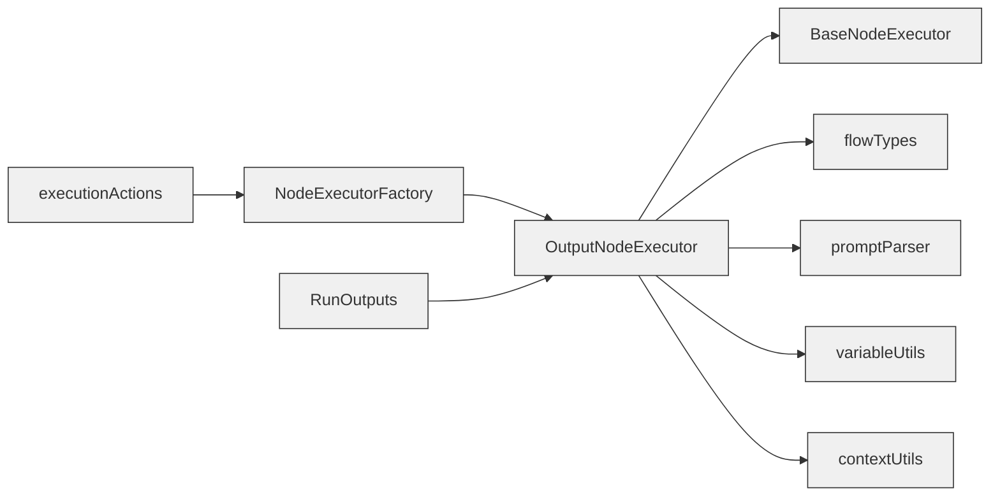

# OutputNodeExecutor 增强

<cite>
**本文档引用文件**  
- [OutputNodeExecutor.ts](file://src/store/executors/OutputNodeExecutor.ts)
- [BaseNodeExecutor.ts](file://src/store/executors/BaseNodeExecutor.ts)
- [NodeExecutorFactory.ts](file://src/store/executors/NodeExecutorFactory.ts)
- [flow.ts](file://src/types/flow.ts)
- [promptParser.ts](file://src/lib/promptParser.ts)
- [OutputNodeConfig.tsx](file://src/components/builder/context-hud/OutputNodeConfig.tsx)
- [RunOutputs.tsx](file://src/components/run/RunOutputs.tsx)
- [executionActions.ts](file://src/store/actions/executionActions.ts)
- [variableUtils.ts](file://src/store/executors/utils/variableUtils.ts)
- [contextUtils.ts](file://src/store/executors/contextUtils.ts)
</cite>

## 目录
1. [简介](#简介)
2. [项目结构](#项目结构)
3. [核心组件](#核心组件)
4. [架构概述](#架构概述)
5. [详细组件分析](#详细组件分析)
6. [依赖分析](#依赖分析)
7. [性能考虑](#性能考虑)
8. [故障排除指南](#故障排除指南)
9. [结论](#结论)

## 简介
OutputNodeExecutor 是 Flash Flow 工作流系统中的关键组件，负责处理输出节点的执行逻辑。该执行器支持多种输出模式，包括直接引用、分支选择、内容合并和模板渲染，能够灵活地从上游节点收集数据并生成最终输出。通过变量解析和附件处理机制，OutputNodeExecutor 实现了强大的数据整合能力，为用户提供了多样化的输出配置选项。

## 项目结构
项目采用模块化设计，主要分为应用层、组件层、执行器层和类型定义层。输出节点相关功能分布在多个目录中，包括执行逻辑、UI 配置和类型定义。



**图示来源**  
- [OutputNodeExecutor.ts](file://src/store/executors/OutputNodeExecutor.ts)
- [BaseNodeExecutor.ts](file://src/store/executors/BaseNodeExecutor.ts)
- [NodeExecutorFactory.ts](file://src/store/executors/NodeExecutorFactory.ts)
- [flow.ts](file://src/types/flow.ts)
- [promptParser.ts](file://src/lib/promptParser.ts)
- [OutputNodeConfig.tsx](file://src/components/builder/context-hud/OutputNodeConfig.tsx)
- [variableUtils.ts](file://src/store/executors/utils/variableUtils.ts)
- [contextUtils.ts](file://src/store/executors/contextUtils.ts)

**本节来源**  
- [OutputNodeExecutor.ts](file://src/store/executors/OutputNodeExecutor.ts)
- [flow.ts](file://src/types/flow.ts)

## 核心组件
OutputNodeExecutor 作为核心执行组件，继承自 BaseNodeExecutor，实现了输出节点的执行逻辑。它通过多种模式处理上游数据，支持静态值和变量引用，并能处理附件。执行器利用 NodeExecutorFactory 进行注册，确保在工作流执行时能够被正确调用。

**本节来源**  
- [OutputNodeExecutor.ts](file://src/store/executors/OutputNodeExecutor.ts)
- [NodeExecutorFactory.ts](file://src/store/executors/NodeExecutorFactory.ts)

## 架构概述
OutputNodeExecutor 采用策略模式实现多种输出模式，通过统一的 execute 方法处理不同场景。执行器从上游节点收集变量，支持节点标签和 ID 前缀的变量引用，确保变量命名的唯一性和可读性。同时，执行器能够处理附件来源，提取文件信息并构建输出对象。

```mermaid
classDiagram
class BaseNodeExecutor {
<<abstract>>
+execute(node : AppNode, context : FlowContext, mockData? : Record<string, unknown>) : Promise<ExecutionResult>
+measureTime(fn : () => Promise<T>) : Promise<{ result : T; time : number }>
+delay(ms : number) : Promise<void>
}
class OutputNodeExecutor {
+execute(node : AppNode, context : FlowContext, mockData? : Record<string, unknown>) : Promise<ExecutionResult>
}
class NodeExecutorFactory {
+getExecutor(nodeType : NodeKind) : NodeExecutor
}
OutputNodeExecutor --|> BaseNodeExecutor
NodeExecutorFactory --> OutputNodeExecutor
```

**图示来源**  
- [OutputNodeExecutor.ts](file://src/store/executors/OutputNodeExecutor.ts)
- [BaseNodeExecutor.ts](file://src/store/executors/BaseNodeExecutor.ts)
- [NodeExecutorFactory.ts](file://src/store/executors/NodeExecutorFactory.ts)

## 详细组件分析

### OutputNodeExecutor 分析
OutputNodeExecutor 实现了四种输出模式：直接引用、分支选择、内容合并和模板渲染。每种模式都有特定的使用场景和配置要求。

#### 执行流程分析


**图示来源**  
- [OutputNodeExecutor.ts](file://src/store/executors/OutputNodeExecutor.ts)

#### 模式配置分析


**图示来源**  
- [OutputNodeConfig.tsx](file://src/components/builder/context-hud/OutputNodeConfig.tsx)

**本节来源**  
- [OutputNodeExecutor.ts](file://src/store/executors/OutputNodeExecutor.ts)
- [OutputNodeConfig.tsx](file://src/components/builder/context-hud/OutputNodeConfig.tsx)

### 变量处理机制
OutputNodeExecutor 通过 collectDirectUpstreamVariables 函数收集上游变量，支持原始值类型保留和带前缀的变量引用。

```mermaid
classDiagram
class collectDirectUpstreamVariables {
+collectDirectUpstreamVariables(context : FlowContext, allNodes : AppNode[]) : Record<string, unknown>
}
class resolveSource {
+resolveSource(source : ContentSource, variables : Record<string, unknown>, stringVariables : Record<string, string>) : string
}
class resolveAttachments {
+resolveAttachments(attachments : AttachmentSource[] | undefined, variables : Record<string, unknown>) : { name : string; url : string; type? : string }[]
}
class valueToString {
+valueToString(value : unknown) : string
}
OutputNodeExecutor --> collectDirectUpstreamVariables
OutputNodeExecutor --> resolveSource
OutputNodeExecutor --> resolveAttachments
OutputNodeExecutor --> valueToString
```

**图示来源**  
- [OutputNodeExecutor.ts](file://src/store/executors/OutputNodeExecutor.ts)

**本节来源**  
- [OutputNodeExecutor.ts](file://src/store/executors/OutputNodeExecutor.ts)

## 依赖分析
OutputNodeExecutor 依赖多个核心组件和工具函数，形成了完整的执行链条。



**图示来源**  
- [OutputNodeExecutor.ts](file://src/store/executors/OutputNodeExecutor.ts)
- [BaseNodeExecutor.ts](file://src/store/executors/BaseNodeExecutor.ts)
- [flow.ts](file://src/types/flow.ts)
- [promptParser.ts](file://src/lib/promptParser.ts)
- [variableUtils.ts](file://src/store/executors/utils/variableUtils.ts)
- [contextUtils.ts](file://src/store/executors/contextUtils.ts)
- [NodeExecutorFactory.ts](file://src/store/executors/NodeExecutorFactory.ts)
- [executionActions.ts](file://src/store/actions/executionActions.ts)
- [RunOutputs.tsx](file://src/components/run/RunOutputs.tsx)

## 性能考虑
OutputNodeExecutor 的性能主要体现在变量收集和解析效率上。通过一次性收集所有上游变量并缓存字符串版本，避免了重复计算。执行时间测量功能提供了性能监控能力，有助于识别性能瓶颈。

## 故障排除指南
常见问题包括配置错误、变量解析失败和附件处理异常。确保输出模式与配置相匹配，检查变量语法是否正确，验证附件来源的变量名是否存在。

**本节来源**  
- [OutputNodeExecutor.ts](file://src/store/executors/OutputNodeExecutor.ts)

## 结论
OutputNodeExecutor 作为 Flash Flow 系统的关键组件，提供了灵活强大的输出处理能力。通过多种输出模式和完善的变量处理机制，满足了不同场景下的需求。其模块化设计和清晰的依赖关系使得维护和扩展更加容易。