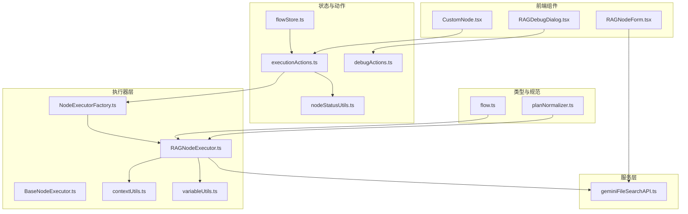
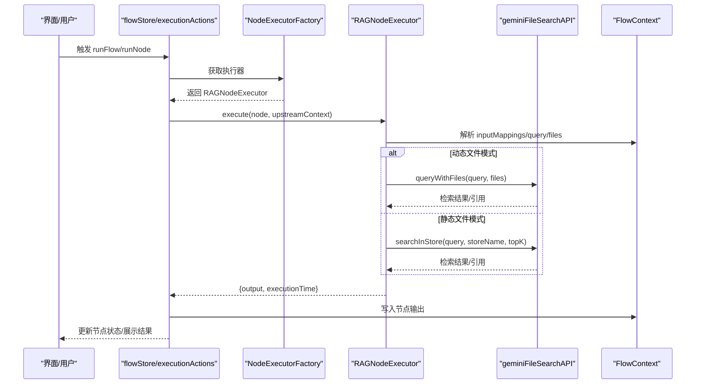
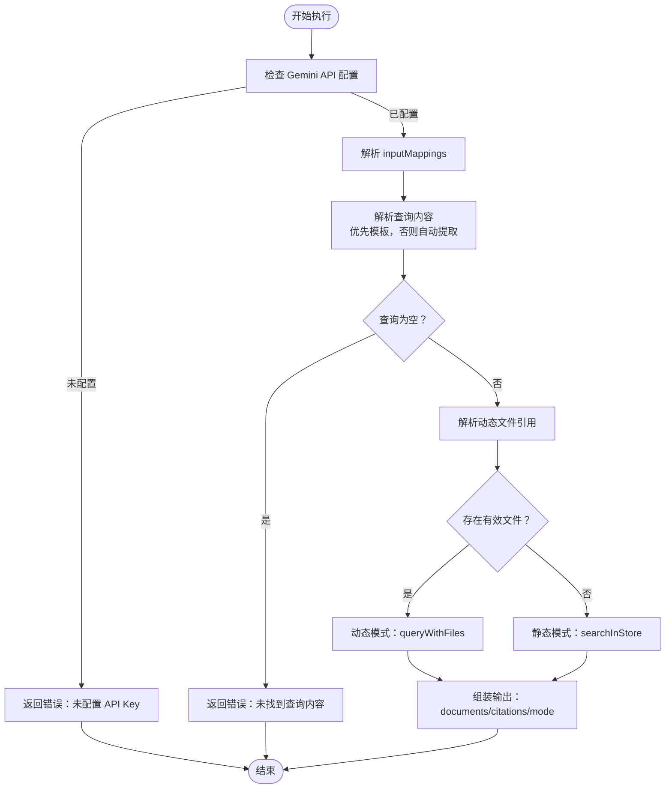
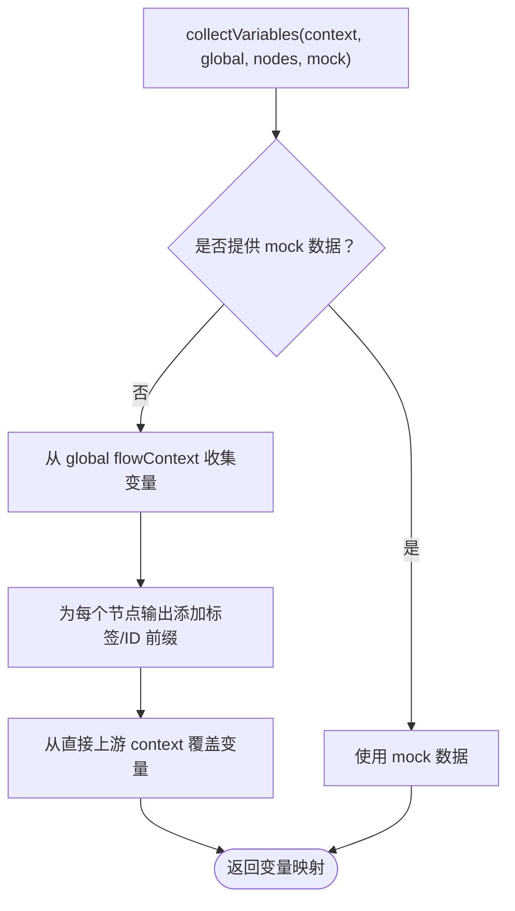
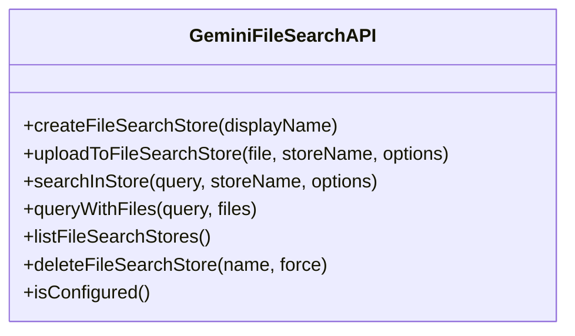
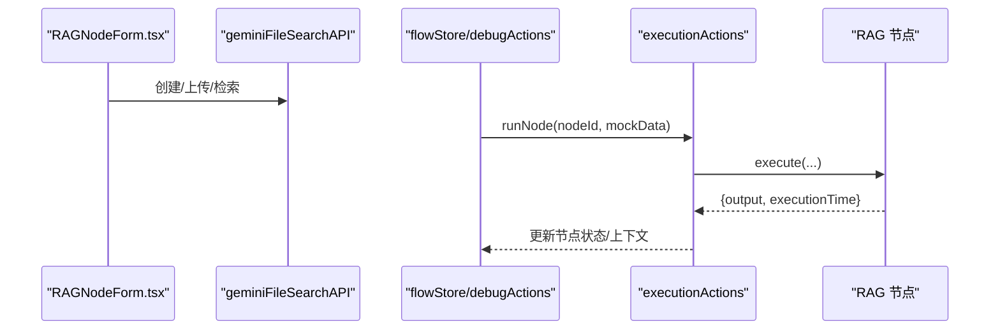
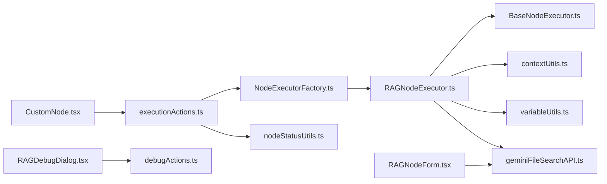

# RAGNodeExecutor 增强

<cite>
**本文引用的文件**
- [RAGNodeExecutor.ts](file://src/store/executors/RAGNodeExecutor.ts)
- [BaseNodeExecutor.ts](file://src/store/executors/BaseNodeExecutor.ts)
- [NodeExecutorFactory.ts](file://src/store/executors/NodeExecutorFactory.ts)
- [geminiFileSearchAPI.ts](file://src/services/geminiFileSearchAPI.ts)
- [contextUtils.ts](file://src/store/executors/contextUtils.ts)
- [variableUtils.ts](file://src/store/executors/utils/variableUtils.ts)
- [flowStore.ts](file://src/store/flowStore.ts)
- [executionActions.ts](file://src/store/actions/executionActions.ts)
- [RAGNodeForm.tsx](file://src/components/builder/node-forms/RAGNodeForm.tsx)
- [RAGDebugDialog.tsx](file://src/components/flow/RAGDebugDialog.tsx)
- [CustomNode.tsx](file://src/components/flow/CustomNode.tsx)
- [flow.ts](file://src/types/flow.ts)
- [planNormalizer.ts](file://src/store/utils/planNormalizer.ts)
- [nodeStatusUtils.ts](file://src/store/utils/nodeStatusUtils.ts)
- [debugActions.ts](file://src/store/actions/debugActions.ts)
</cite>

## 目录
1. [简介](#简介)
2. [项目结构](#项目结构)
3. [核心组件](#核心组件)
4. [架构总览](#架构总览)
5. [详细组件分析](#详细组件分析)
6. [依赖关系分析](#依赖关系分析)
7. [性能考量](#性能考量)
8. [故障排查指南](#故障排查指南)
9. [结论](#结论)
10. [附录](#附录)

## 简介
本文件围绕 RAGNodeExecutor 的增强与优化展开，系统梳理其执行流程、变量解析机制、动态/静态两种检索模式、与 Gemini File Search API 的集成、以及前端 Builder 与调试对话框的协同。目标是帮助开发者快速理解 RAG 节点的工作原理与最佳实践，并提供可操作的优化建议与排障指引。

## 项目结构
RAGNodeExecutor 位于执行器层，配合工厂模式与执行动作，贯穿 Flow 的构建、运行与调试阶段；服务层负责与 Gemini API 交互；前端组件负责节点表单与调试弹窗。

图表来源
- [RAGNodeExecutor.ts](file://src/store/executors/RAGNodeExecutor.ts#L1-L242)
- [BaseNodeExecutor.ts](file://src/store/executors/BaseNodeExecutor.ts#L1-L26)
- [NodeExecutorFactory.ts](file://src/store/executors/NodeExecutorFactory.ts#L1-L28)
- [geminiFileSearchAPI.ts](file://src/services/geminiFileSearchAPI.ts#L1-L393)
- [contextUtils.ts](file://src/store/executors/contextUtils.ts#L1-L124)
- [variableUtils.ts](file://src/store/executors/utils/variableUtils.ts#L1-L139)
- [flowStore.ts](file://src/store/flowStore.ts#L1-L49)
- [executionActions.ts](file://src/store/actions/executionActions.ts#L1-L285)
- [debugActions.ts](file://src/store/actions/debugActions.ts#L1-L144)
- [nodeStatusUtils.ts](file://src/store/utils/nodeStatusUtils.ts#L1-L42)
- [RAGNodeForm.tsx](file://src/components/builder/node-forms/RAGNodeForm.tsx#L1-L271)
- [RAGDebugDialog.tsx](file://src/components/flow/RAGDebugDialog.tsx#L1-L40)
- [CustomNode.tsx](file://src/components/flow/CustomNode.tsx#L227-L257)
- [flow.ts](file://src/types/flow.ts#L1-L309)
- [planNormalizer.ts](file://src/store/utils/planNormalizer.ts#L62-L90)

章节来源
- [flowStore.ts](file://src/store/flowStore.ts#L1-L49)
- [executionActions.ts](file://src/store/actions/executionActions.ts#L1-L285)

## 核心组件
- RAGNodeExecutor：实现 RAG 节点的执行逻辑，支持“静态文件模式”（File Search Store）与“动态文件模式”（多模态直传），内置变量模板解析与错误处理。
- BaseNodeExecutor：统一的执行器抽象，提供计时与延迟能力。
- NodeExecutorFactory：节点执行器工厂，按节点类型返回对应执行器实例。
- geminiFileSearchAPI：封装 Google Gemini File Search 与多模态 API，提供创建 Store、上传文件、检索与直接查询等能力。
- contextUtils/variableUtils：变量模板解析与变量收集，支撑 inputMappings 的灵活引用。
- 执行动作与状态：flowStore/executionActions 负责构建上下文、拓扑遍历、节点状态更新与错误处理。
- Builder 表单与调试对话框：RAGNodeForm 负责知识库配置与文件上传；RAGDebugDialog 与 debugActions 协助调试。

章节来源
- [RAGNodeExecutor.ts](file://src/store/executors/RAGNodeExecutor.ts#L1-L242)
- [BaseNodeExecutor.ts](file://src/store/executors/BaseNodeExecutor.ts#L1-L26)
- [NodeExecutorFactory.ts](file://src/store/executors/NodeExecutorFactory.ts#L1-L28)
- [geminiFileSearchAPI.ts](file://src/services/geminiFileSearchAPI.ts#L1-L393)
- [contextUtils.ts](file://src/store/executors/contextUtils.ts#L1-L124)
- [variableUtils.ts](file://src/store/executors/utils/variableUtils.ts#L1-L139)
- [executionActions.ts](file://src/store/actions/executionActions.ts#L1-L285)
- [RAGNodeForm.tsx](file://src/components/builder/node-forms/RAGNodeForm.tsx#L1-L271)
- [RAGDebugDialog.tsx](file://src/components/flow/RAGDebugDialog.tsx#L1-L40)
- [debugActions.ts](file://src/store/actions/debugActions.ts#L1-L144)

## 架构总览
RAGNodeExecutor 的执行链路如下：
- 执行入口由执行动作触发，构建 FlowContext 并按拓扑顺序执行节点。
- RAGNodeExecutor 依据 inputMappings 解析查询与文件引用，决定走静态检索或动态多模态。
- 通过 geminiFileSearchAPI 与 Gemini API 交互，返回检索结果与引用信息。
- 执行结果写回 FlowContext，节点状态更新为 completed 或 error。

图表来源
- [executionActions.ts](file://src/store/actions/executionActions.ts#L1-L285)
- [NodeExecutorFactory.ts](file://src/store/executors/NodeExecutorFactory.ts#L1-L28)
- [RAGNodeExecutor.ts](file://src/store/executors/RAGNodeExecutor.ts#L74-L242)
- [geminiFileSearchAPI.ts](file://src/services/geminiFileSearchAPI.ts#L190-L313)

## 详细组件分析

### RAGNodeExecutor 执行逻辑与增强点
- 变量模板解析
  - 支持形如 {{节点标签.字段}}、{{节点ID.字段}}、{{字段名}} 的多级路径解析，兼容数组索引与嵌套字段。
  - 通过上下文 _meta.nodeLabels 实现标签到 ID 的映射，提升引用灵活性。
- 查询内容解析
  - 优先使用 inputMappings.query 模板解析；若为空则回退到从上游提取文本。
- 动态文件模式
  - 从 inputMappings.files 解析上游文件数组，过滤有效文件（含 url），调用多模态 API 直接处理。
- 静态文件模式
  - 依赖预配置的 File Search Store 与上传文件，调用检索接口并返回引用信息。
- 错误处理与输出
  - 统一返回 { query, documents, citations, documentCount, mode } 结构；异常时返回 { error }。
  - 计时统计 executionTime，便于性能监控。

图表来源
- [RAGNodeExecutor.ts](file://src/store/executors/RAGNodeExecutor.ts#L74-L242)
- [contextUtils.ts](file://src/store/executors/contextUtils.ts#L1-L124)

章节来源
- [RAGNodeExecutor.ts](file://src/store/executors/RAGNodeExecutor.ts#L1-L242)
- [contextUtils.ts](file://src/store/executors/contextUtils.ts#L1-L124)

### 变量解析与收集（variableUtils）
- flattenObject：将上游节点输出扁平化为可引用变量，支持节点标签前缀与节点 ID 前缀，同时支持自定义输出变量。
- collectVariables：优先使用调试 Mock 数据；否则合并全局 flowContext 与直接上游上下文，确保直接上游优先级更高。

图表来源
- [variableUtils.ts](file://src/store/executors/utils/variableUtils.ts#L1-L139)

章节来源
- [variableUtils.ts](file://src/store/executors/utils/variableUtils.ts#L1-L139)

### 与 Gemini API 的集成
- 静态检索：searchInStore，支持 topK 与可选 metadataFilter。
- 动态多模态：queryWithFiles，支持从 URL 加载文件并直接调用模型生成内容。
- Store 生命周期：创建、上传、轮询处理进度、列举与删除。

图表来源
- [geminiFileSearchAPI.ts](file://src/services/geminiFileSearchAPI.ts#L1-L393)

章节来源
- [geminiFileSearchAPI.ts](file://src/services/geminiFileSearchAPI.ts#L1-L393)

### Builder 表单与调试
- RAGNodeForm：自动创建 File Search Store、上传文件、分块与重叠配置、返回结果数设置。
- RAGDebugDialog：调试模式下输入查询，confirm 后通过 debugActions 调用 runNode 并写入 mock 输入。

图表来源
- [RAGNodeForm.tsx](file://src/components/builder/node-forms/RAGNodeForm.tsx#L1-L271)
- [debugActions.ts](file://src/store/actions/debugActions.ts#L70-L101)
- [executionActions.ts](file://src/store/actions/executionActions.ts#L251-L285)

章节来源
- [RAGNodeForm.tsx](file://src/components/builder/node-forms/RAGNodeForm.tsx#L1-L271)
- [RAGDebugDialog.tsx](file://src/components/flow/RAGDebugDialog.tsx#L1-L40)
- [debugActions.ts](file://src/store/actions/debugActions.ts#L70-L101)

## 依赖关系分析
- 执行器依赖
  - RAGNodeExecutor 依赖 BaseNodeExecutor（计时）、geminiFileSearchAPI（检索/多模态）、contextUtils（自动提取）、variableUtils（变量收集）。
  - NodeExecutorFactory 统一管理节点执行器实例。
- 执行动作依赖
  - executionActions 负责拓扑遍历、上下文构建、节点状态更新与错误处理。
- 前端组件依赖
  - RAGNodeForm 依赖 geminiFileSearchAPI 与 UI 组件；RAGDebugDialog 依赖 debugActions 与 flowStore。

图表来源
- [RAGNodeExecutor.ts](file://src/store/executors/RAGNodeExecutor.ts#L1-L242)
- [BaseNodeExecutor.ts](file://src/store/executors/BaseNodeExecutor.ts#L1-L26)
- [NodeExecutorFactory.ts](file://src/store/executors/NodeExecutorFactory.ts#L1-L28)
- [geminiFileSearchAPI.ts](file://src/services/geminiFileSearchAPI.ts#L1-L393)
- [contextUtils.ts](file://src/store/executors/contextUtils.ts#L1-L124)
- [variableUtils.ts](file://src/store/executors/utils/variableUtils.ts#L1-L139)
- [executionActions.ts](file://src/store/actions/executionActions.ts#L1-L285)
- [nodeStatusUtils.ts](file://src/store/utils/nodeStatusUtils.ts#L1-L42)
- [RAGNodeForm.tsx](file://src/components/builder/node-forms/RAGNodeForm.tsx#L1-L271)
- [RAGDebugDialog.tsx](file://src/components/flow/RAGDebugDialog.tsx#L1-L40)
- [debugActions.ts](file://src/store/actions/debugActions.ts#L1-L144)
- [CustomNode.tsx](file://src/components/flow/CustomNode.tsx#L227-L257)

章节来源
- [executionActions.ts](file://src/store/actions/executionActions.ts#L1-L285)
- [NodeExecutorFactory.ts](file://src/store/executors/NodeExecutorFactory.ts#L1-L28)

## 性能考量
- 计时与统计
  - BaseNodeExecutor.measureTime 统计单节点执行耗时，便于性能监控与优化。
- 检索参数
  - topK 控制返回结果数量，影响响应速度与召回质量；合理设置可平衡性能与效果。
- 文件分块与重叠
  - 分块大小与重叠 token 数影响检索精度与处理时间；建议根据文档类型与长度调整。
- 并发与锁
  - 执行锁避免并发冲突；拓扑遍历保证节点按依赖顺序执行，减少无效重算。

章节来源
- [BaseNodeExecutor.ts](file://src/store/executors/BaseNodeExecutor.ts#L1-L26)
- [geminiFileSearchAPI.ts](file://src/services/geminiFileSearchAPI.ts#L190-L240)
- [RAGNodeForm.tsx](file://src/components/builder/node-forms/RAGNodeForm.tsx#L220-L267)
- [executionActions.ts](file://src/store/actions/executionActions.ts#L1-L285)

## 故障排查指南
- 常见错误与定位
  - API Key 未配置：检查环境变量 NEXT_PUBLIC_GEMINI_API_KEY；确认 isConfigured 返回 true。
  - 未找到查询内容：确认上游节点输出或 inputMappings.query 模板正确；必要时使用调试对话框输入。
  - 未配置知识库或知识库为空：在 Builder 中创建 File Search Store 并上传文件；检查 fileSearchStoreName 与 files。
  - 动态文件解析失败：确认 inputMappings.files 引用的上游节点输出包含有效文件对象（含 url）。
- 调试建议
  - 使用 RAGDebugDialog 输入查询，confirm 后通过 debugActions.runNode 执行，观察输出与错误信息。
  - 在 CustomNode 中直接点击 RAG 节点打开调试弹窗，便于快速验证。
- 状态与上下文
  - 节点状态更新由 nodeStatusUtils 统一处理；执行动作在异常时设置 error 状态并保留错误信息。
  - FlowContext 保存每个节点的输出，便于后续节点引用。

章节来源
- [RAGNodeExecutor.ts](file://src/store/executors/RAGNodeExecutor.ts#L74-L242)
- [RAGDebugDialog.tsx](file://src/components/flow/RAGDebugDialog.tsx#L1-L40)
- [debugActions.ts](file://src/store/actions/debugActions.ts#L70-L101)
- [nodeStatusUtils.ts](file://src/store/utils/nodeStatusUtils.ts#L1-L42)
- [executionActions.ts](file://src/store/actions/executionActions.ts#L1-L285)

## 结论
RAGNodeExecutor 通过清晰的执行器抽象、灵活的变量解析与双模式检索策略，实现了对静态知识库与动态文件的统一处理。结合 Builder 表单与调试对话框，开发者可以在不同场景下高效配置与验证 RAG 节点。建议在生产环境中：
- 明确区分静态与动态模式，按需配置 topK、分块与重叠参数；
- 使用调试对话框与 Mock 数据快速验证 inputMappings；
- 关注 API Key 与网络稳定性，完善错误提示与重试策略。

## 附录
- 类型与规范
  - flow.ts 定义了节点类型、执行状态、上下文结构与调试输入格式。
  - planNormalizer.ts 将导入的计划节点规范化为 AppNodeData，便于统一处理。

章节来源
- [flow.ts](file://src/types/flow.ts#L1-L309)
- [planNormalizer.ts](file://src/store/utils/planNormalizer.ts#L62-L90)