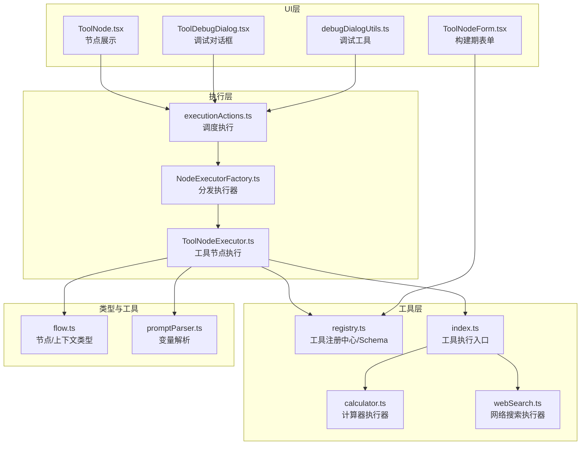
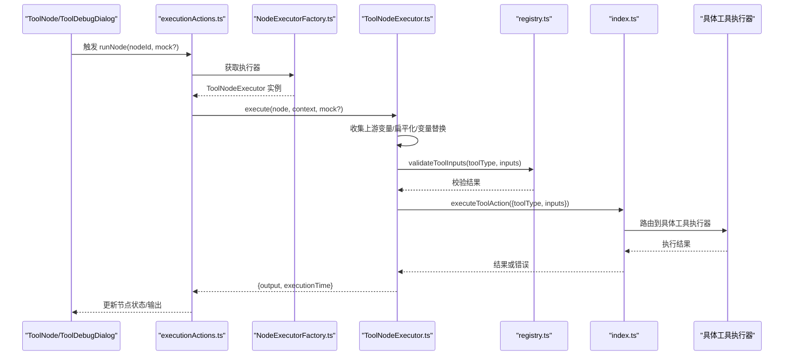
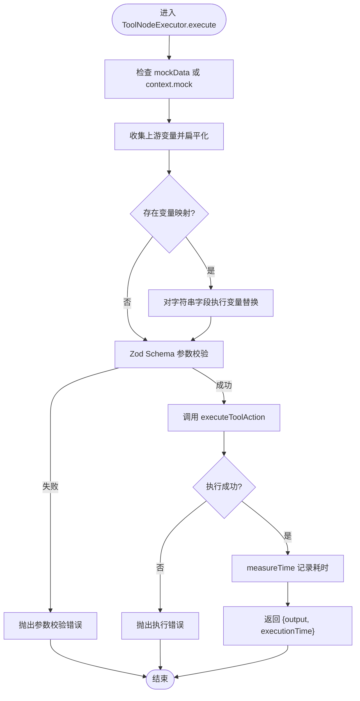
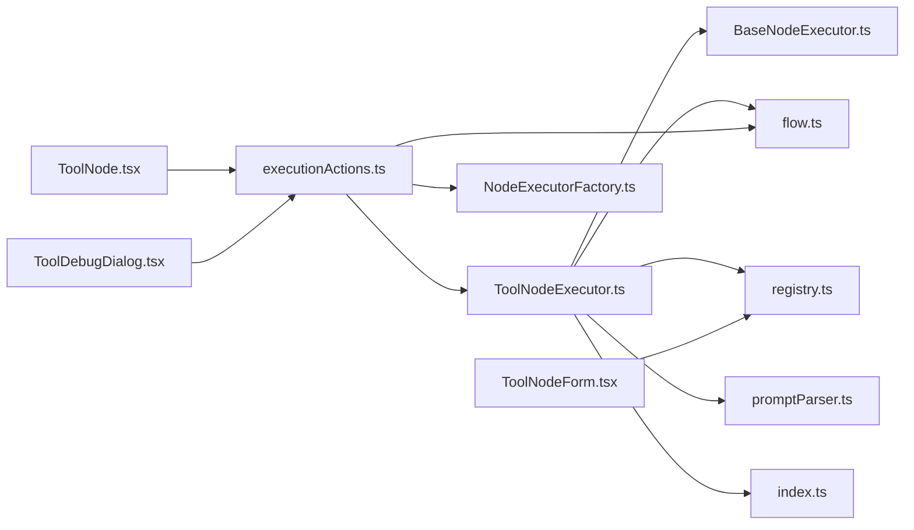

# ToolNodeExecutor 增强

<cite>
**本文引用的文件列表**
- [ToolNodeExecutor.ts](file://src/store/executors/ToolNodeExecutor.ts)
- [BaseNodeExecutor.ts](file://src/store/executors/BaseNodeExecutor.ts)
- [NodeExecutorFactory.ts](file://src/store/executors/NodeExecutorFactory.ts)
- [executionActions.ts](file://src/store/actions/executionActions.ts)
- [flow.ts](file://src/types/flow.ts)
- [registry.ts](file://src/lib/tools/registry.ts)
- [promptParser.ts](file://src/lib/promptParser.ts)
- [index.ts](file://src/app/actions/tools/index.ts)
- [calculator.ts](file://src/app/actions/tools/executors/calculator.ts)
- [webSearch.ts](file://src/app/actions/tools/executors/webSearch.ts)
- [ToolNode.tsx](file://src/components/flow/nodes/ToolNode.tsx)
- [ToolDebugDialog.tsx](file://src/components/flow/ToolDebugDialog.tsx)
- [ToolNodeForm.tsx](file://src/components/builder/node-forms/ToolNodeForm.tsx)
- [debugDialogUtils.ts](file://src/store/utils/debugDialogUtils.ts)
- [executorConfig.ts](file://src/store/constants/executorConfig.ts)
</cite>

## 目录
1. [简介](#简介)
2. [项目结构与定位](#项目结构与定位)
3. [核心组件与职责](#核心组件与职责)
4. [架构总览](#架构总览)
5. [详细组件分析](#详细组件分析)
6. [依赖关系分析](#依赖关系分析)
7. [性能与可靠性考量](#性能与可靠性考量)
8. [故障排查指南](#故障排查指南)
9. [结论与建议](#结论与建议)
10. [附录：增强方案清单](#附录增强方案清单)

## 简介
本文围绕 ToolNodeExecutor 的现有实现进行系统性分析，并结合仓库中的工具注册中心、执行动作、调试对话框与节点组件，提出可落地的增强建议。重点聚焦于：
- 上游变量收集与变量替换的健壮性
- 参数校验与错误传播路径
- 执行时序与性能度量
- 调试体验与可配置性
- 可扩展性与工具生态治理

## 项目结构与定位
ToolNodeExecutor 位于执行器层，负责“工具节点”的执行编排；其上层由执行动作协调，下层依赖工具注册中心与具体工具执行器。UI 层通过调试对话框与节点表单提供参数配置入口。



图表来源
- [executionActions.ts](file://src/store/actions/executionActions.ts#L1-L248)
- [NodeExecutorFactory.ts](file://src/store/executors/NodeExecutorFactory.ts#L1-L27)
- [ToolNodeExecutor.ts](file://src/store/executors/ToolNodeExecutor.ts#L1-L155)
- [registry.ts](file://src/lib/tools/registry.ts#L1-L229)
- [index.ts](file://src/app/actions/tools/index.ts#L1-L82)
- [calculator.ts](file://src/app/actions/tools/executors/calculator.ts#L1-L34)
- [webSearch.ts](file://src/app/actions/tools/executors/webSearch.ts#L1-L54)
- [flow.ts](file://src/types/flow.ts#L1-L309)
- [promptParser.ts](file://src/lib/promptParser.ts#L1-L89)
- [ToolNode.tsx](file://src/components/flow/nodes/ToolNode.tsx#L1-L114)
- [ToolDebugDialog.tsx](file://src/components/flow/ToolDebugDialog.tsx#L1-L148)
- [ToolNodeForm.tsx](file://src/components/builder/node-forms/ToolNodeForm.tsx#L1-L176)
- [debugDialogUtils.ts](file://src/store/utils/debugDialogUtils.ts#L1-L157)

章节来源
- [ToolNodeExecutor.ts](file://src/store/executors/ToolNodeExecutor.ts#L1-L155)
- [executionActions.ts](file://src/store/actions/executionActions.ts#L1-L248)
- [registry.ts](file://src/lib/tools/registry.ts#L1-L229)

## 核心组件与职责
- ToolNodeExecutor：负责收集上游输出变量、变量替换、参数校验、调用工具执行入口并记录执行耗时。
- NodeExecutorFactory：按节点类型分发执行器实例。
- executionActions：流程编排、节点状态更新、错误捕获与传播。
- registry：集中管理工具类型、描述、图标与 Zod Schema，提供参数校验。
- index.ts：工具执行入口，路由到具体工具执行器。
- ToolNode/ToolDebugDialog/ToolNodeForm：UI 层参数配置与调试入口。
- promptParser：变量提取与替换工具。
- debugDialogUtils：调试对话框通用状态与动作工厂，含 Tool 参数配置判断。

章节来源
- [ToolNodeExecutor.ts](file://src/store/executors/ToolNodeExecutor.ts#L1-L155)
- [NodeExecutorFactory.ts](file://src/store/executors/NodeExecutorFactory.ts#L1-L27)
- [executionActions.ts](file://src/store/actions/executionActions.ts#L1-L248)
- [registry.ts](file://src/lib/tools/registry.ts#L1-L229)
- [index.ts](file://src/app/actions/tools/index.ts#L1-L82)
- [promptParser.ts](file://src/lib/promptParser.ts#L1-L89)
- [ToolNode.tsx](file://src/components/flow/nodes/ToolNode.tsx#L1-L114)
- [ToolDebugDialog.tsx](file://src/components/flow/ToolDebugDialog.tsx#L1-L148)
- [ToolNodeForm.tsx](file://src/components/builder/node-forms/ToolNodeForm.tsx#L1-L176)
- [debugDialogUtils.ts](file://src/store/utils/debugDialogUtils.ts#L1-L157)

## 架构总览
ToolNodeExecutor 的执行链路如下：



图表来源
- [executionActions.ts](file://src/store/actions/executionActions.ts#L1-L248)
- [NodeExecutorFactory.ts](file://src/store/executors/NodeExecutorFactory.ts#L1-L27)
- [ToolNodeExecutor.ts](file://src/store/executors/ToolNodeExecutor.ts#L1-L155)
- [registry.ts](file://src/lib/tools/registry.ts#L1-L229)
- [index.ts](file://src/app/actions/tools/index.ts#L1-L82)

## 详细组件分析

### ToolNodeExecutor 执行流程与增强点
- 上游变量收集与扁平化
  - 从直接上游 context 与全局 flowContext 收集输出，递归扁平化对象，生成多级引用键（如无前缀、节点标签前缀、节点 ID 前缀），并合并自定义输出变量。
  - 建议增强：对数组序列化采用更稳健策略（当前为 JSON.stringify），并在 UI 层提供数组/对象输入时的可视化提示。
- 变量替换
  - 仅对字符串类型的输入进行变量替换，避免破坏非字符串结构。
  - 建议增强：提供“变量未命中”告警开关，或在调试面板中高亮未替换变量。
- 参数校验
  - 使用工具注册中心的 Zod Schema 进行二次校验，确保执行前参数合法。
  - 建议增强：将校验失败的字段与消息映射到 UI，便于快速修复。
- 执行与计时
  - 通过 measureTime 记录执行耗时；工具执行入口返回 success/error，失败时抛出异常。
  - 建议增强：对超时场景增加可配置的超时阈值与中断能力。
- 错误传播
  - 执行失败会抛出异常，由上层执行动作捕获并更新节点状态为 error。
  - 建议增强：区分“参数错误”与“执行错误”，分别给出不同 UI 表达与重试策略。



图表来源
- [ToolNodeExecutor.ts](file://src/store/executors/ToolNodeExecutor.ts#L1-L155)
- [registry.ts](file://src/lib/tools/registry.ts#L1-L229)
- [index.ts](file://src/app/actions/tools/index.ts#L1-L82)

章节来源
- [ToolNodeExecutor.ts](file://src/store/executors/ToolNodeExecutor.ts#L1-L155)

### 执行入口与工具路由
- index.ts 作为工具执行入口，先做参数校验，再根据 toolType 路由到具体执行器。
- 具体执行器示例：
  - calculator：使用 mathjs 安全求值。
  - webSearch：调用 Tavily API，需配置环境变量。
- 建议增强：为每个工具执行器增加超时控制、重试策略与错误码映射，便于 UI 展示与用户理解。

章节来源
- [index.ts](file://src/app/actions/tools/index.ts#L1-L82)
- [calculator.ts](file://src/app/actions/tools/executors/calculator.ts#L1-L34)
- [webSearch.ts](file://src/app/actions/tools/executors/webSearch.ts#L1-L54)

### 调试与参数配置
- ToolDebugDialog.tsx：基于工具 Schema 动态渲染输入字段，支持必填/选填提示，确认后将简单 key-value 传入执行。
- ToolNodeForm.tsx：构建期表单，动态渲染工具输入字段；当前注释说明“移除动态输入字段”，参数主要通过调试对话框或上游变量注入。
- debugDialogUtils.ts：提供 isToolNodeParametersConfigured 判断，用于 UI 决策是否直接运行或打开调试面板。
- 建议增强：在 ToolNodeForm 中保留动态输入字段，但以只读或预设方式呈现，同时允许在调试面板覆盖；完善“变量引用”占位提示。

章节来源
- [ToolDebugDialog.tsx](file://src/components/flow/ToolDebugDialog.tsx#L1-L148)
- [ToolNodeForm.tsx](file://src/components/builder/node-forms/ToolNodeForm.tsx#L1-L176)
- [debugDialogUtils.ts](file://src/store/utils/debugDialogUtils.ts#L1-L157)

### 类关系图（代码级）
```mermaid
classDiagram
class BaseNodeExecutor {
+execute(node, context, mockData) Promise~ExecutionResult~
#measureTime(fn) Promise~{result,time}~
#delay(ms) Promise~void~
}
class ToolNodeExecutor {
+execute(node, context, mockData) Promise~ExecutionResult~
}
class NodeExecutorFactory {
+getExecutor(nodeType) NodeExecutor
}
BaseNodeExecutor <|-- ToolNodeExecutor
NodeExecutorFactory --> ToolNodeExecutor : "创建/分发"
```

图表来源
- [BaseNodeExecutor.ts](file://src/store/executors/BaseNodeExecutor.ts#L1-L25)
- [ToolNodeExecutor.ts](file://src/store/executors/ToolNodeExecutor.ts#L1-L155)
- [NodeExecutorFactory.ts](file://src/store/executors/NodeExecutorFactory.ts#L1-L27)

## 依赖关系分析
- 执行器依赖
  - ToolNodeExecutor 依赖 BaseNodeExecutor（计时/延时）、flow 类型、工具注册中心、变量解析器、执行动作入口。
- 工具生态
  - registry.ts 统一管理工具 Schema，index.ts 负责路由与二次校验，具体执行器在各自模块内实现。
- UI 交互
  - ToolNode.tsx 与 ToolDebugDialog.tsx 协作完成参数配置与触发执行；ToolNodeForm.tsx 与 registry.ts 协作完成构建期配置。
- 执行动作
  - executionActions.ts 负责节点状态更新、错误捕获与传播、上下文拼装与下游遍历。



图表来源
- [ToolNodeExecutor.ts](file://src/store/executors/ToolNodeExecutor.ts#L1-L155)
- [BaseNodeExecutor.ts](file://src/store/executors/BaseNodeExecutor.ts#L1-L25)
- [flow.ts](file://src/types/flow.ts#L1-L309)
- [registry.ts](file://src/lib/tools/registry.ts#L1-L229)
- [promptParser.ts](file://src/lib/promptParser.ts#L1-L89)
- [index.ts](file://src/app/actions/tools/index.ts#L1-L82)
- [executionActions.ts](file://src/store/actions/executionActions.ts#L1-L248)
- [ToolNode.tsx](file://src/components/flow/nodes/ToolNode.tsx#L1-L114)
- [ToolDebugDialog.tsx](file://src/components/flow/ToolDebugDialog.tsx#L1-L148)
- [ToolNodeForm.tsx](file://src/components/builder/node-forms/ToolNodeForm.tsx#L1-L176)

## 性能与可靠性考量
- 计时与延迟
  - ToolNodeExecutor 使用 measureTime 记录执行耗时；BaseNodeExecutor 提供 delay 辅助，可用于演示或节流。
  - 建议：对外暴露可配置的默认延迟常量（参考其他节点配置），便于统一治理。
- 并发与锁
  - 执行动作中存在_executionLock，避免并发执行导致状态错乱。
- 超时与重试
  - 当前未见显式的超时与重试机制。建议为工具执行器增加：
    - 超时阈值（可配置）
    - 失败重试次数与退避策略
    - 执行阶段细分（校验/请求/解析）以便统计与告警

章节来源
- [BaseNodeExecutor.ts](file://src/store/executors/BaseNodeExecutor.ts#L1-L25)
- [executorConfig.ts](file://src/store/constants/executorConfig.ts#L1-L29)
- [executionActions.ts](file://src/store/actions/executionActions.ts#L1-L248)

## 故障排查指南
- 参数校验失败
  - 现象：抛出“参数验证失败”错误。
  - 排查：检查 ToolDebugDialog 中必填项是否填写；确认变量替换后值是否满足 Schema。
- 工具执行失败
  - 现象：抛出“Tool execution failed”或具体错误信息。
  - 排查：检查环境变量（如 Tavily API Key）；查看工具执行器日志；确认网络连通性。
- 节点状态异常
  - 现象：节点状态停留在 running 或 error。
  - 排查：确认 executionActions 是否捕获异常并更新状态；检查节点是否被删除或上下文不一致。

章节来源
- [ToolNodeExecutor.ts](file://src/store/executors/ToolNodeExecutor.ts#L1-L155)
- [index.ts](file://src/app/actions/tools/index.ts#L1-L82)
- [executionActions.ts](file://src/store/actions/executionActions.ts#L1-L248)

## 结论与建议
- 现状总结
  - ToolNodeExecutor 已具备完善的变量收集、替换与参数校验能力，并通过 measureTime 记录执行耗时。
  - 调试体验良好，UI 与执行层配合紧密。
- 增强建议（优先级排序）
  1) 参数校验增强
     - 将校验失败的字段与消息映射到 UI，便于快速修复。
     - 提供“变量未命中”告警开关与可视化高亮。
  2) 执行稳定性增强
     - 为工具执行器增加超时与重试策略；细化执行阶段统计。
  3) 可配置性增强
     - 将默认延迟等常量外置到配置文件，便于统一治理。
  4) 构建期体验增强
     - 在 ToolNodeForm 中保留动态输入字段，提供只读/预设与调试覆盖能力。
  5) 错误分类与重试
     - 明确区分参数错误与执行错误，分别给出不同 UI 表达与重试策略。
  6) 可观测性
     - 在执行动作中记录关键事件（开始/结束/错误），便于日志与监控。

## 附录：增强方案清单
- 参数校验
  - 字段级错误映射与 UI 高亮
  - 变量未命中告警
- 执行稳定性
  - 工具执行器超时与重试
  - 执行阶段细分统计
- 配置治理
  - 默认延迟常量外置
- 构建期体验
  - ToolNodeForm 动态输入字段保留与覆盖提示
- 错误分类
  - 参数错误 vs 执行错误的 UI 区分
- 可观测性
  - 执行事件记录与日志