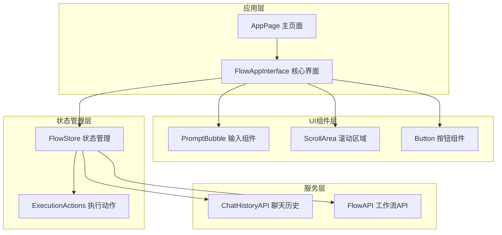
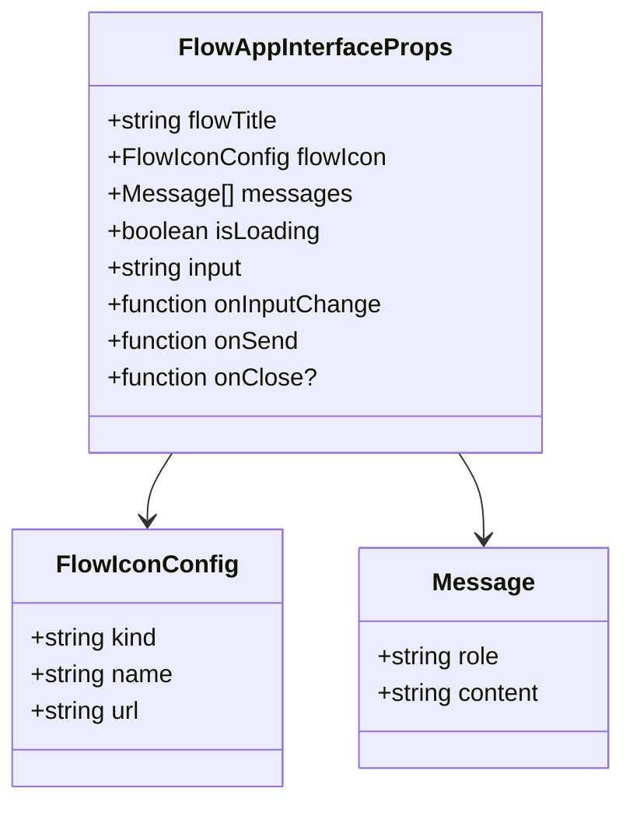
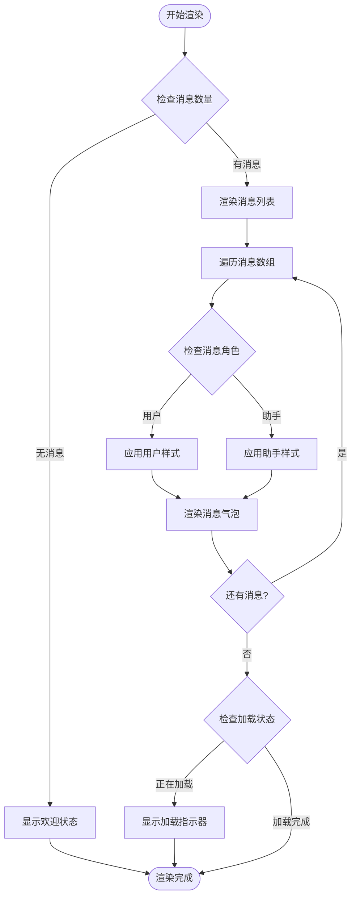
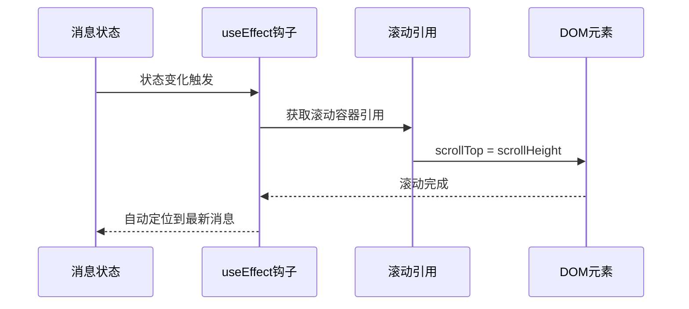
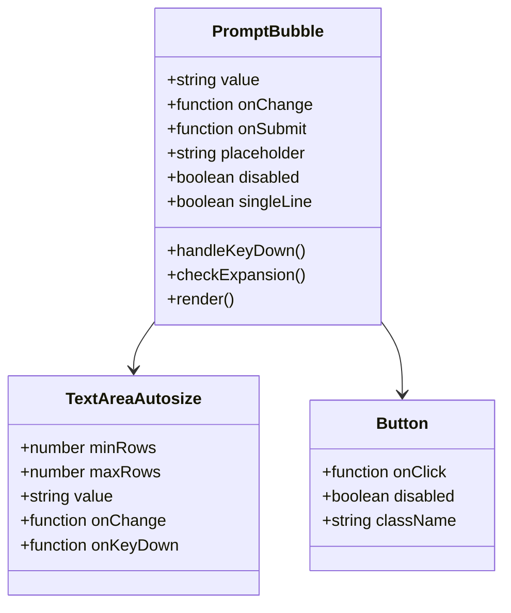
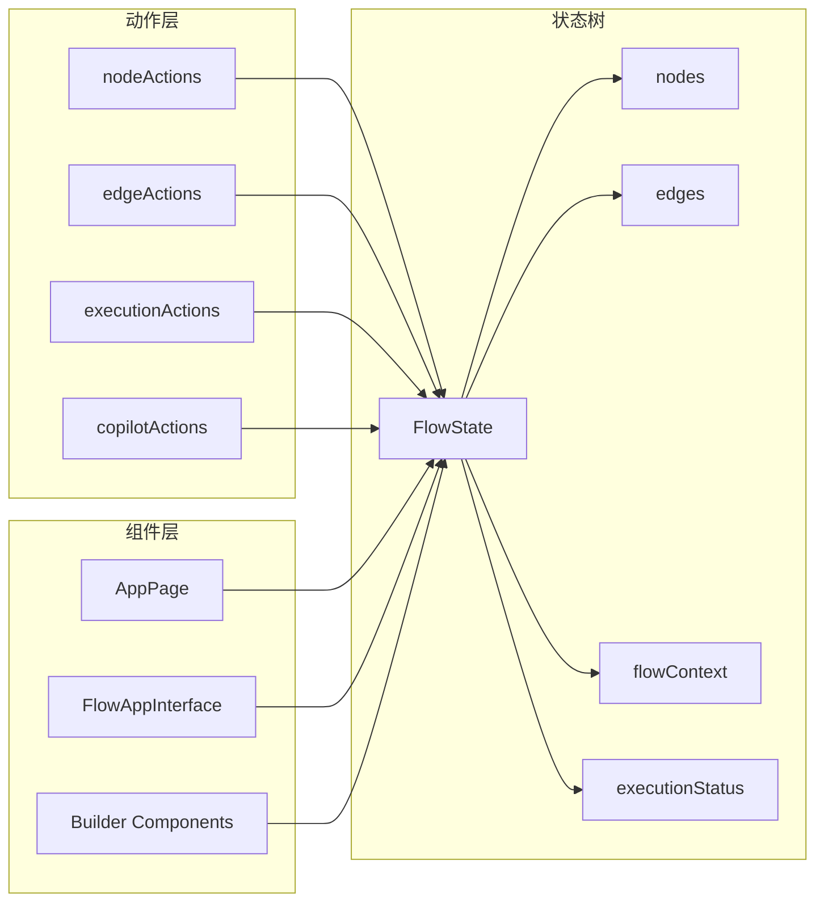
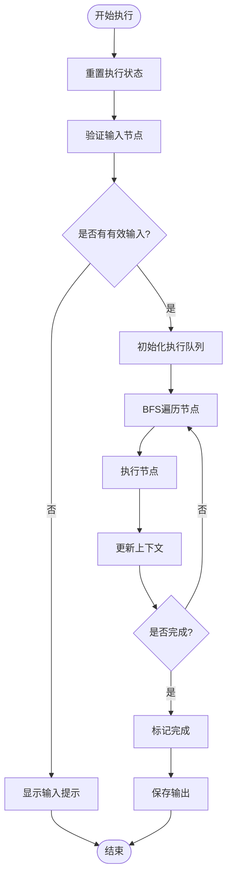
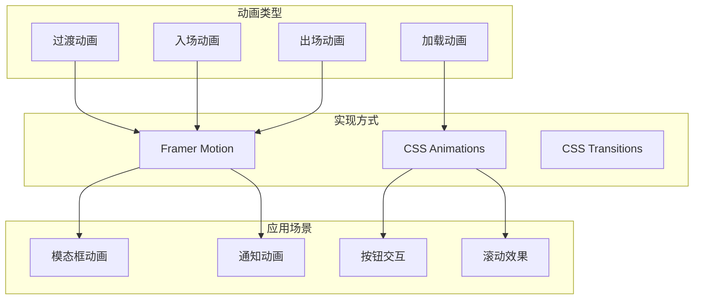
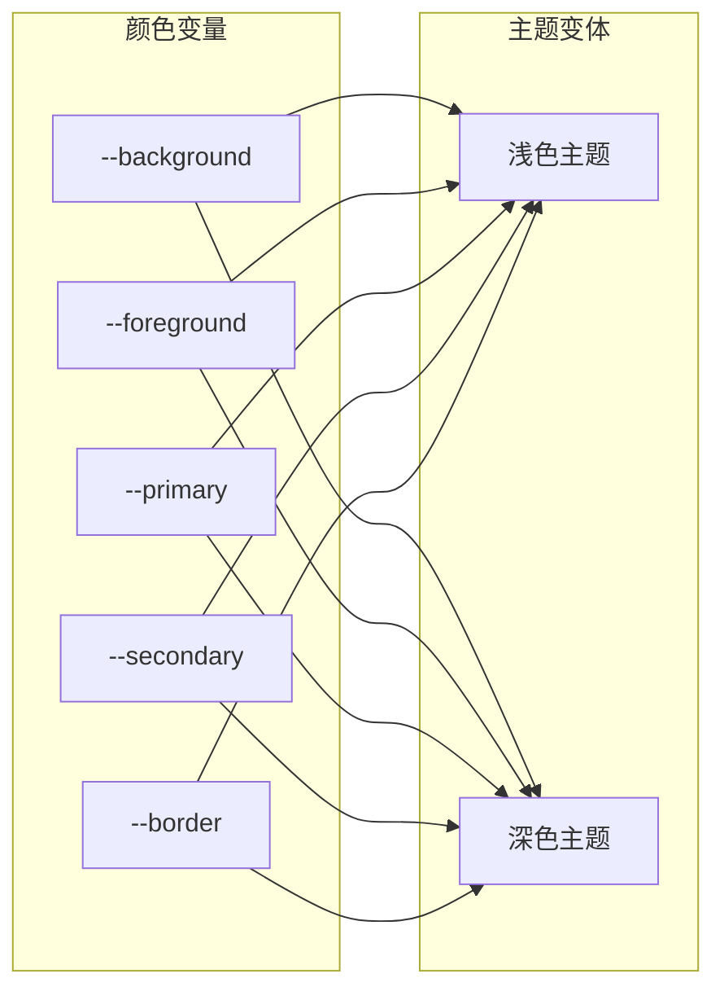

# 应用界面实现

<cite>
**本文档中引用的文件**
- [FlowAppInterface.tsx](file://src/components/apps/FlowAppInterface.tsx)
- [scroll-area.tsx](file://src/components/ui/scroll-area.tsx)
- [input.tsx](file://src/components/ui/input.tsx)
- [prompt-bubble.tsx](file://src/components/ui/prompt-bubble.tsx)
- [chatHistoryAPI.ts](file://src/services/chatHistoryAPI.ts)
- [page.tsx](file://src/app/app/page.tsx)
- [flowStore.ts](file://src/store/flowStore.ts)
- [executionActions.ts](file://src/store/actions/executionActions.ts)
- [globals.css](file://src/app/globals.css)
- [tailwind.config.ts](file://tailwind.config.ts)
- [zIndex.ts](file://src/lib/zIndex.ts)
</cite>

## 目录
1. [项目概述](#项目概述)
2. [核心组件架构](#核心组件架构)
3. [FlowAppInterface组件详解](#flowappinterface组件详解)
4. [消息列表渲染机制](#消息列表渲染机制)
5. [自动滚动与加载状态](#自动滚动与加载状态)
6. [输入框组件集成](#输入框组件集成)
7. [数据流与状态管理](#数据流与状态管理)
8. [响应式布局与UI动效](#响应式布局与ui动效)
9. [界面定制化配置](#界面定制化配置)
10. [性能优化策略](#性能优化策略)
11. [扩展建议](#扩展建议)

## 项目概述

Flash Flow是一个基于React和Next.js构建的类聊天应用界面系统，采用现代化的前端技术栈，提供了流畅的对话式交互体验。该系统的核心特色在于将工作流执行结果转化为直观的对话式界面，支持实时消息渲染、自动滚动、加载状态显示等丰富的交互功能。

### 技术架构特点

- **组件化设计**：采用模块化的组件架构，每个功能模块独立封装
- **状态管理**：使用Zustand进行全局状态管理，确保数据流的可预测性
- **响应式设计**：基于Tailwind CSS的响应式布局系统
- **动画效果**：利用Framer Motion实现平滑的过渡动画
- **TypeScript支持**：完整的类型定义确保代码质量和开发效率

## 核心组件架构

**图表来源**
- [FlowAppInterface.tsx](file://src/components/apps/FlowAppInterface.tsx#L1-L137)
- [page.tsx](file://src/app/app/page.tsx#L1-L167)
- [flowStore.ts](file://src/store/flowStore.ts#L1-L131)

## FlowAppInterface组件详解

FlowAppInterface是整个应用界面的核心组件，负责渲染完整的聊天界面，包括头部、消息区域和输入区域。

### 组件Props设计

**图表来源**
- [FlowAppInterface.tsx](file://src/components/apps/FlowAppInterface.tsx#L7-L20)

### 头部区域实现

头部区域包含以下元素：
- **流程图标**：支持多种图标类型（emoji、Lucide图标、自定义图片）
- **流程标题**：显示当前工作流的名称
- **关闭按钮**：可选的关闭功能

### 消息区域布局

消息区域采用Flexbox布局，支持：
- **用户消息**：右对齐，黑色背景
- **助手消息**：左对齐，白色背景
- **加载指示器**：气泡状加载动画
- **空状态提示**：首次访问时的欢迎信息

**章节来源**
- [FlowAppInterface.tsx](file://src/components/apps/FlowAppInterface.tsx#L22-L137)

## 消息列表渲染机制

### 渲染策略

消息列表采用高效的虚拟化渲染策略，通过React的key属性确保列表更新的性能：

**图表来源**
- [FlowAppInterface.tsx](file://src/components/apps/FlowAppInterface.tsx#L82-L120)

### 消息样式系统

每条消息都具有独特的样式特征：
- **头像标识**：用户和助手分别使用不同的图标
- **气泡形状**：根据消息角色调整圆角和阴影
- **颜色主题**：深色和浅色模式下的视觉差异
- **文本格式**：支持换行和特殊字符处理

**章节来源**
- [FlowAppInterface.tsx](file://src/components/apps/FlowAppInterface.tsx#L92-L104)

## 自动滚动与加载状态

### 自动滚动机制

自动滚动功能通过useEffect钩子实现，确保新消息添加后界面能够自动滚动到底部：

**图表来源**
- [FlowAppInterface.tsx](file://src/components/apps/FlowAppInterface.tsx#L34-L39)

### 加载状态管理

加载状态通过isLoading布尔值控制，配合聊天历史API实现：

1. **发送消息阶段**：设置isLoading=true，禁用输入
2. **执行工作流阶段**：保持加载状态直到执行完成
3. **接收响应阶段**：更新消息列表，设置isLoading=false
4. **错误处理阶段**：显示错误消息，恢复加载状态

**章节来源**
- [page.tsx](file://src/app/app/page.tsx#L118-L145)
- [chatHistoryAPI.ts](file://src/services/chatHistoryAPI.ts#L1-L95)

## 输入框组件集成

### PromptBubble组件特性

PromptBubble是专门设计的输入组件，具有以下特性：

**图表来源**
- [prompt-bubble.tsx](file://src/components/ui/prompt-bubble.tsx#L8-L16)

### 输入处理逻辑

输入框支持多种交互模式：
- **单行输入**：初始状态下为圆形输入框
- **多行扩展**：内容超出单行高度时自动扩展
- **快捷键支持**：Enter发送，Shift+Enter换行
- **状态反馈**：根据输入内容动态调整外观

### 发送逻辑集成

发送逻辑通过onSend回调函数与父组件FlowAppInterface集成：

1. **输入验证**：检查输入内容是否为空
2. **状态切换**：设置加载状态，禁用输入
3. **消息保存**：调用聊天历史API保存用户消息
4. **工作流触发**：更新输入节点数据并执行工作流

**章节来源**
- [prompt-bubble.tsx](file://src/components/ui/prompt-bubble.tsx#L31-L40)
- [FlowAppInterface.tsx](file://src/components/apps/FlowAppInterface.tsx#L125-L131)

## 数据流与状态管理

### Zustand状态架构

系统采用Zustand作为状态管理解决方案，实现了清晰的数据流向：

**图表来源**
- [flowStore.ts](file://src/store/flowStore.ts#L17-L75)

### 工作流执行流程

工作流执行通过executionActions模块管理：

**图表来源**
- [executionActions.ts](file://src/store/actions/executionActions.ts#L23-L180)

**章节来源**
- [flowStore.ts](file://src/store/flowStore.ts#L1-L131)
- [executionActions.ts](file://src/store/actions/executionActions.ts#L1-L207)

## 响应式布局与UI动效

### Tailwind CSS响应式设计

系统采用Tailwind CSS的响应式设计原则，确保在不同设备上的良好体验：

| 断点 | 屏幕尺寸 | 布局特征 |
|------|----------|----------|
| 默认 | < 640px | 单列布局，全宽显示 |
| sm | ≥ 640px | 小屏设备适配 |
| md | ≥ 768px | 中等屏幕优化 |
| lg | ≥ 1024px | 大屏设备布局 |
| xl | ≥ 1280px | 超大屏幕适配 |

### 动画系统

系统集成了多种动画效果：

**图表来源**
- [tailwind.config.ts](file://tailwind.config.ts#L24-L32)
- [zIndex.ts](file://src/lib/zIndex.ts#L6-L21)

### UI动效实现

主要的动效包括：
- **按钮悬停效果**：平滑的颜色过渡
- **模态框入场**：从底部滑入的动画
- **消息气泡**：渐显的出现效果
- **加载指示器**：同步的跳动动画

**章节来源**
- [globals.css](file://src/app/globals.css#L137-L201)
- [tailwind.config.ts](file://tailwind.config.ts#L1-L39)

## 界面定制化配置

### 主题系统

系统支持深色和浅色两种主题模式：

**图表来源**
- [globals.css](file://src/app/globals.css#L46-L113)

### 图标系统

支持多种图标类型的灵活配置：
- **Emoji图标**：直接使用Unicode字符
- **Lucide图标**：基于SVG的图标库
- **自定义图片**：支持外部图片URL

### 布局定制

通过CSS变量和Tailwind类名实现布局的灵活定制：
- **间距系统**：基于rem的统一间距标准
- **圆角系统**：预定义的圆角大小
- **阴影系统**：分层的阴影效果

**章节来源**
- [globals.css](file://src/app/globals.css#L1-L201)

## 性能优化策略

### 渲染优化

1. **虚拟滚动**：对于大量消息的场景，考虑实现虚拟滚动
2. **组件记忆化**：使用React.memo避免不必要的重新渲染
3. **懒加载**：对非关键资源实施懒加载策略
4. **代码分割**：按需加载大型组件和依赖库

### 状态管理优化

1. **状态分离**：将频繁更新的状态与稳定状态分离
2. **批量更新**：合并多个状态更新操作
3. **持久化缓存**：对计算密集型数据实施缓存
4. **内存管理**：及时清理不再使用的状态数据

### 网络请求优化

1. **请求去重**：避免重复的API请求
2. **缓存策略**：合理设置缓存过期时间
3. **并发控制**：限制同时进行的网络请求数量
4. **错误重试**：实现智能的错误重试机制

## 扩展建议

### 功能扩展方向

1. **多媒体支持**：添加图片、视频等多媒体内容的支持
2. **文件上传**：实现文件拖拽和上传功能
3. **实时协作**：支持多人实时协作编辑
4. **语音输入**：集成语音识别和语音合成功能

### 用户体验改进

1. **无障碍支持**：增强键盘导航和屏幕阅读器支持
2. **离线模式**：实现基本的离线功能
3. **个性化设置**：允许用户自定义界面主题和布局
4. **快捷键系统**：提供丰富的键盘快捷键操作

### 技术架构演进

1. **微前端架构**：考虑将大型组件拆分为独立的微前端模块
2. **服务端渲染**：对SEO友好的页面实施SSR
3. **Web Workers**：将计算密集型任务移至Web Worker
4. **PWA支持**：实现渐进式Web应用功能

### 安全性增强

1. **输入验证**：加强用户输入的安全验证
2. **权限控制**：细化用户权限管理系统
3. **数据加密**：对敏感数据实施加密存储
4. **审计日志**：记录关键操作的审计信息

通过以上实现方案，Flash Flow提供了一个功能完整、性能优异、用户体验良好的类聊天应用界面系统。该系统不仅满足了当前的功能需求，还具备良好的扩展性和维护性，为未来的功能迭代奠定了坚实的基础。