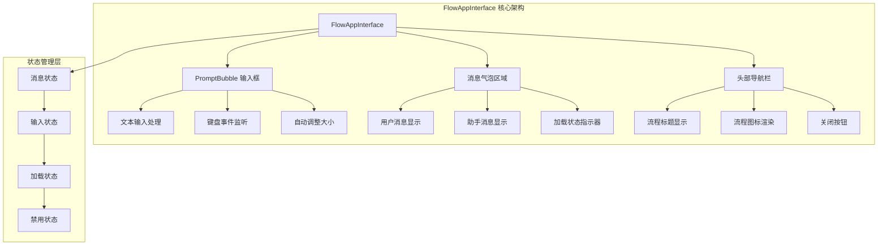
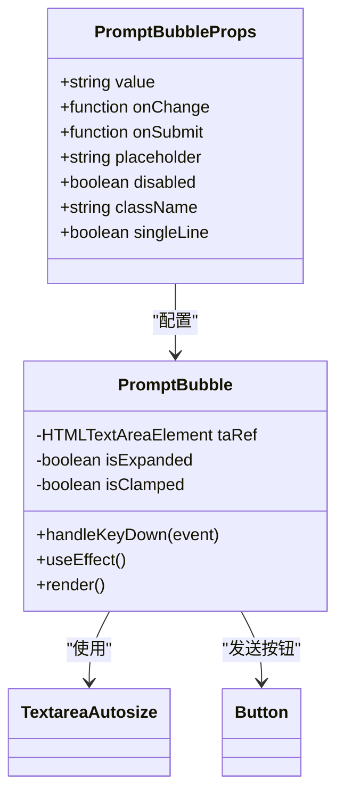
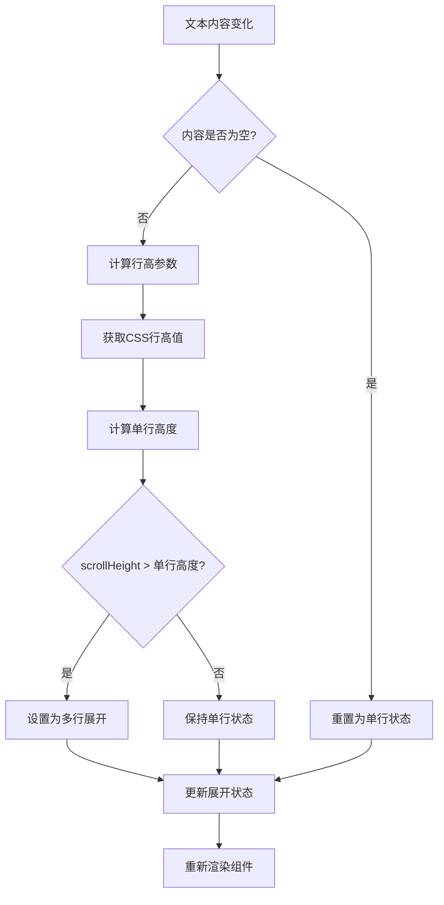
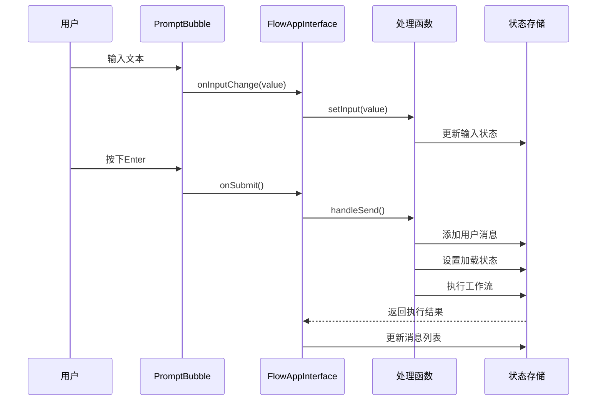
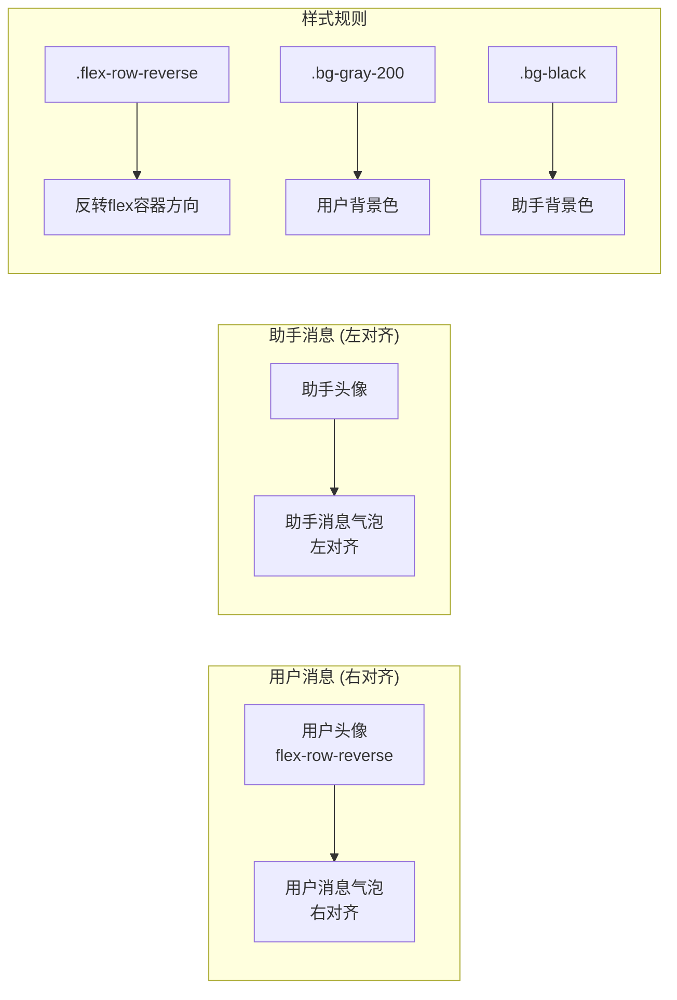
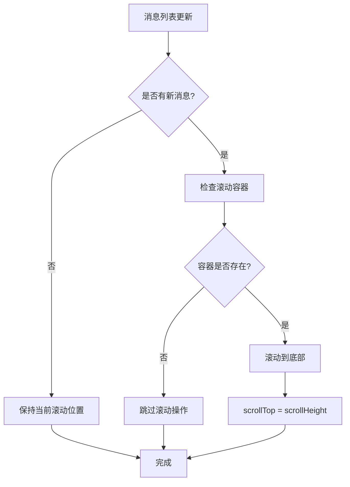
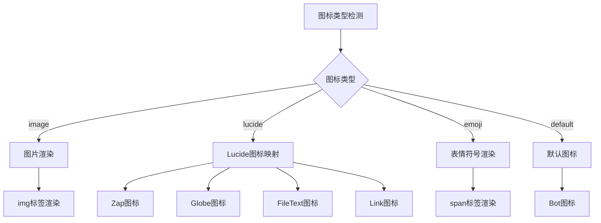
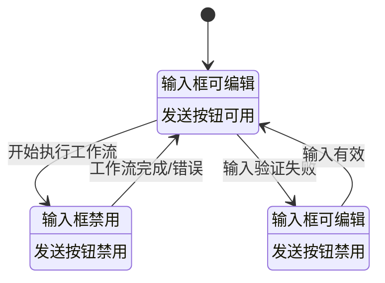

# 核心交互组件

<cite>
**本文档中引用的文件**
- [FlowAppInterface.tsx](file://src/components/apps/FlowAppInterface.tsx)
- [prompt-bubble.tsx](file://src/components/ui/prompt-bubble.tsx)
- [page.tsx](file://src/app/app/page.tsx)
- [AppModeOverlay.tsx](file://src/components/builder/AppModeOverlay.tsx)
- [FlowCard.tsx](file://src/components/flows/FlowCard.tsx)
- [flow.ts](file://src/types/flow.ts)
- [utils.ts](file://src/lib/utils.ts)
- [globals.css](file://src/app/globals.css)
</cite>

## 目录
1. [项目概述](#项目概述)
2. [架构概览](#架构概览)
3. [PromptBubble输入框组件深度分析](#promptbubble输入框组件深度分析)
4. [数据流传递机制](#数据流传递机制)
5. [消息气泡布局策略](#消息气泡布局策略)
6. [图标系统动态渲染](#图标系统动态渲染)
7. [状态管理与联动控制](#状态管理与联动控制)
8. [扩展与自定义方案](#扩展与自定义方案)
9. [性能优化考虑](#性能优化考虑)
10. [总结](#总结)

## 项目概述

FlowAppInterface是Flash Flow SaaS平台的核心交互界面组件，负责构建智能工作流应用的聊天界面体验。该组件集成了先进的PromptBubble输入框组件，提供了流畅的消息交互体验，支持用户与AI助手之间的自然对话。

### 核心特性
- **智能输入框**：基于PromptBubble的自适应输入体验
- **双向消息流**：用户消息与助手回复的清晰区分
- **实时状态同步**：输入状态与加载状态的完美联动
- **丰富的图标系统**：Lucide图标与自定义图标的统一渲染
- **响应式布局**：适配不同屏幕尺寸的现代化设计

## 架构概览

FlowAppInterface采用模块化架构设计，通过清晰的组件边界实现功能分离：



**图表来源**
- [FlowAppInterface.tsx](file://src/components/apps/FlowAppInterface.tsx#L22-L132)
- [prompt-bubble.tsx](file://src/components/ui/prompt-bubble.tsx#L18-L113)

## PromptBubble输入框组件深度分析

### 组件结构与接口设计

PromptBubble组件采用了简洁而强大的接口设计，通过TypeScript确保类型安全：



**图表来源**
- [prompt-bubble.tsx](file://src/components/ui/prompt-bubble.tsx#L8-L16)
- [prompt-bubble.tsx](file://src/components/ui/prompt-bubble.tsx#L18-L113)

### 自动调整大小机制

PromptBubble实现了智能的文本区域大小调整算法：



**图表来源**
- [prompt-bubble.tsx](file://src/components/ui/prompt-bubble.tsx#L42-L67)

### 键盘事件处理

组件实现了精确的键盘事件处理逻辑，支持多种输入场景：

| 按键组合 | 功能描述 | 触发条件 |
|---------|---------|---------|
| Enter | 发送消息 | 非Shift键按下且输入不为空 |
| Shift+Enter | 新行插入 | Shift键按下时按Enter |
| Composition | 中文输入法 | 输入法组合过程中忽略 |
| 其他按键 | 文本输入 | 默认文本输入处理 |

**节段来源**
- [prompt-bubble.tsx](file://src/components/ui/prompt-bubble.tsx#L31-L39)

## 数据流传递机制

### 回调函数链路分析

FlowAppInterface建立了完整的数据流传递链路：



**图表来源**
- [FlowAppInterface.tsx](file://src/components/apps/FlowAppInterface.tsx#L28-L29)
- [page.tsx](file://src/app/app/page.tsx#L118-L145)

### 状态同步机制

组件间的状态同步通过以下机制实现：

1. **单向数据流**：从父组件流向子组件的不可变数据传递
2. **回调驱动**：子组件通过回调函数通知父组件状态变更
3. **状态提升**：复杂状态管理在最高层级进行统一处理
4. **副作用处理**：通过React hooks管理组件生命周期

**节段来源**
- [page.tsx](file://src/app/app/page.tsx#L118-L145)
- [AppModeOverlay.tsx](file://src/components/builder/AppModeOverlay.tsx#L58-L74)

## 消息气泡布局策略

### 左右对齐实现原理

消息气泡的左右对齐通过Flexbox布局实现：



**图表来源**
- [FlowAppInterface.tsx](file://src/components/apps/FlowAppInterface.tsx#L92-L100)

### 布局关键属性

| 属性 | 用户消息 | 助手消息 | 说明 |
|-----|---------|---------|------|
| flex-direction | row-reverse | row | 控制头像与消息的排列顺序 |
| background-color | gray-200 | black | 区分用户和助手的身份 |
| text-color | gray-600 | white | 对比度优化的文字颜色 |
| border | 无 | gray-200 | 助手消息的边框样式 |

**节段来源**
- [FlowAppInterface.tsx](file://src/components/apps/FlowAppInterface.tsx#L93-L99)

### 自动滚动机制

组件实现了智能的自动滚动功能：



**图表来源**
- [FlowAppInterface.tsx](file://src/components/apps/FlowAppInterface.tsx#L34-L39)

## 图标系统动态渲染

### Lucide图标映射机制

FlowAppInterface实现了灵活的图标系统，支持多种图标类型的动态渲染：



**图表来源**
- [FlowAppInterface.tsx](file://src/components/apps/FlowAppInterface.tsx#L46-L64)
- [FlowCard.tsx](file://src/components/flows/FlowCard.tsx#L77-L92)

### 图标渲染优先级

图标系统按照以下优先级选择渲染方式：

1. **图片图标**：最高优先级，支持自定义图片
2. **Lucide图标**：预定义的矢量图标集合
3. **表情符号**：Unicode字符，简单直观
4. **默认图标**：系统提供的备用图标

**节段来源**
- [FlowAppInterface.tsx](file://src/components/apps/FlowAppInterface.tsx#L46-L64)
- [FlowCard.tsx](file://src/components/flows/FlowCard.tsx#L77-L92)

### 动态图标映射表

| 图标名称 | Lucide组件 | 显示效果 |
|---------|-----------|---------|
| zap | Zap | 闪电符号，表示快速操作 |
| globe | Globe | 地球符号，表示网络相关 |
| doc | FileText | 文档符号，表示文件处理 |
| link | Link | 链接符号，表示外部链接 |

**节段来源**
- [FlowCard.tsx](file://src/components/flows/FlowCard.tsx#L81-L85)

## 状态管理与联动控制

### 禁用状态与加载状态联动

组件实现了精密的状态联动机制：



**图表来源**
- [FlowAppInterface.tsx](file://src/components/apps/FlowAppInterface.tsx#L126-L127)
- [prompt-bubble.tsx](file://src/components/ui/prompt-bubble.tsx#L101-L105)

### 状态同步策略

| 状态类型 | 影响范围 | 同步时机 | 依赖关系 |
|---------|---------|---------|---------|
| 输入状态 | PromptBubble | 实时同步 | 双向绑定 |
| 加载状态 | 整个界面 | 异步更新 | 条件触发 |
| 禁用状态 | 输入框组件 | 延迟生效 | 条件判断 |
| 消息状态 | 聊天区域 | 批量更新 | 事件驱动 |

**节段来源**
- [FlowAppInterface.tsx](file://src/components/apps/FlowAppInterface.tsx#L26-L27)
- [page.tsx](file://src/app/app/page.tsx#L118-L145)

## 扩展与自定义方案

### UI组件扩展指南

为了支持更复杂的交互需求，可以采用以下扩展方案：

#### 1. 自定义输入框组件

```typescript
// 扩展示例：添加文件上传功能
interface ExtendedPromptBubbleProps extends PromptBubbleProps {
    onFileUpload?: (file: File) => void;
    showFileUpload?: boolean;
}

const ExtendedPromptBubble: React.FC<ExtendedPromptBubbleProps> = ({
    onFileUpload,
    showFileUpload,
    ...props
}) => {
    // 实现文件上传逻辑
    return (
        <PromptBubble {...props}>
            {showFileUpload && (
                <FileUploadButton onUpload={onFileUpload} />
            )}
        </PromptBubble>
    );
};
```

#### 2. 消息气泡定制

```typescript
// 扩展示例：支持富文本消息
interface RichMessageBubbleProps {
    content: string;
    messageType: 'text' | 'code' | 'image' | 'file';
}

const RichMessageBubble: React.FC<RichMessageBubbleProps> = ({ 
    content, 
    messageType 
}) => {
    switch (messageType) {
        case 'code':
            return <CodeBlock code={content} />;
        case 'image':
            return <ImagePreview src={content} />;
        case 'file':
            return <FileDownloadLink url={content} />;
        default:
            return <MarkdownRenderer content={content} />;
    }
};
```

### 主题系统集成

组件支持通过Tailwind CSS类名进行主题定制：

```typescript
// 主题配置示例
const themeConfig = {
    light: {
        backgroundColor: 'bg-white',
        textColor: 'text-gray-900',
        inputBorder: 'border-gray-200',
        bubbleShadow: 'shadow-sm'
    },
    dark: {
        backgroundColor: 'bg-gray-900',
        textColor: 'text-white',
        inputBorder: 'border-gray-700',
        bubbleShadow: 'shadow-lg'
    }
};
```

**节段来源**
- [utils.ts](file://src/lib/utils.ts#L4-L6)
- [globals.css](file://src/app/globals.css#L115-L186)

## 性能优化考虑

### 渲染性能优化

1. **虚拟滚动**：对于大量消息的历史记录，建议实现虚拟滚动
2. **防抖处理**：输入框的实时更新可以通过防抖减少不必要的渲染
3. **记忆化**：使用React.memo包装消息组件避免重复渲染
4. **懒加载**：图标和媒体内容采用懒加载策略

### 内存管理

1. **事件清理**：及时清理键盘事件监听器
2. **引用管理**：合理使用useRef避免内存泄漏
3. **状态优化**：避免在状态中存储大型对象

## 总结

FlowAppInterface中的交互组件展现了现代Web应用开发的最佳实践：

### 核心优势

1. **用户体验优先**：PromptBubble的智能输入体验提升了用户满意度
2. **架构清晰**：模块化的组件设计便于维护和扩展
3. **类型安全**：TypeScript的完整类型定义确保了代码质量
4. **状态管理**：合理的状态管理模式保证了数据一致性
5. **视觉设计**：现代化的UI设计提供了优秀的视觉体验

### 技术亮点

- **智能输入框**：自适应大小调整和精确的键盘事件处理
- **响应式布局**：Flexbox实现的灵活消息气泡对齐
- **图标系统**：统一的图标渲染机制支持多种图标类型
- **状态联动**：精密的状态同步确保了用户体验的一致性

### 扩展潜力

该组件架构为未来的功能扩展提供了良好的基础，无论是添加多媒体支持、增强的富文本编辑，还是集成更多的AI功能，都可以在现有架构上进行平滑扩展。

通过深入理解这些核心组件的设计理念和实现细节，开发者可以更好地利用这个框架构建出功能丰富、用户体验优秀的智能工作流应用。