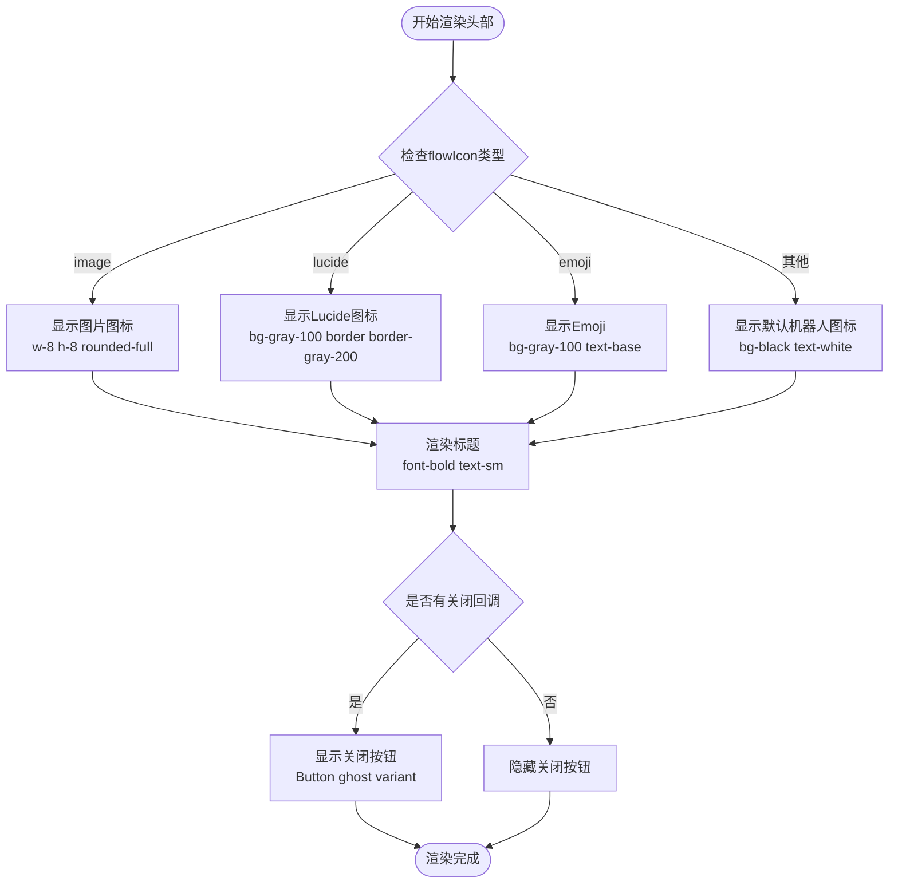
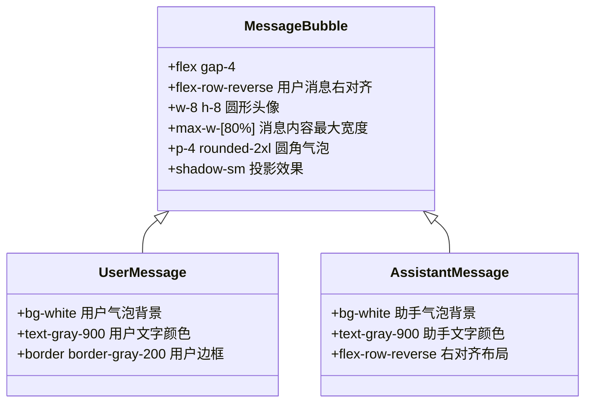
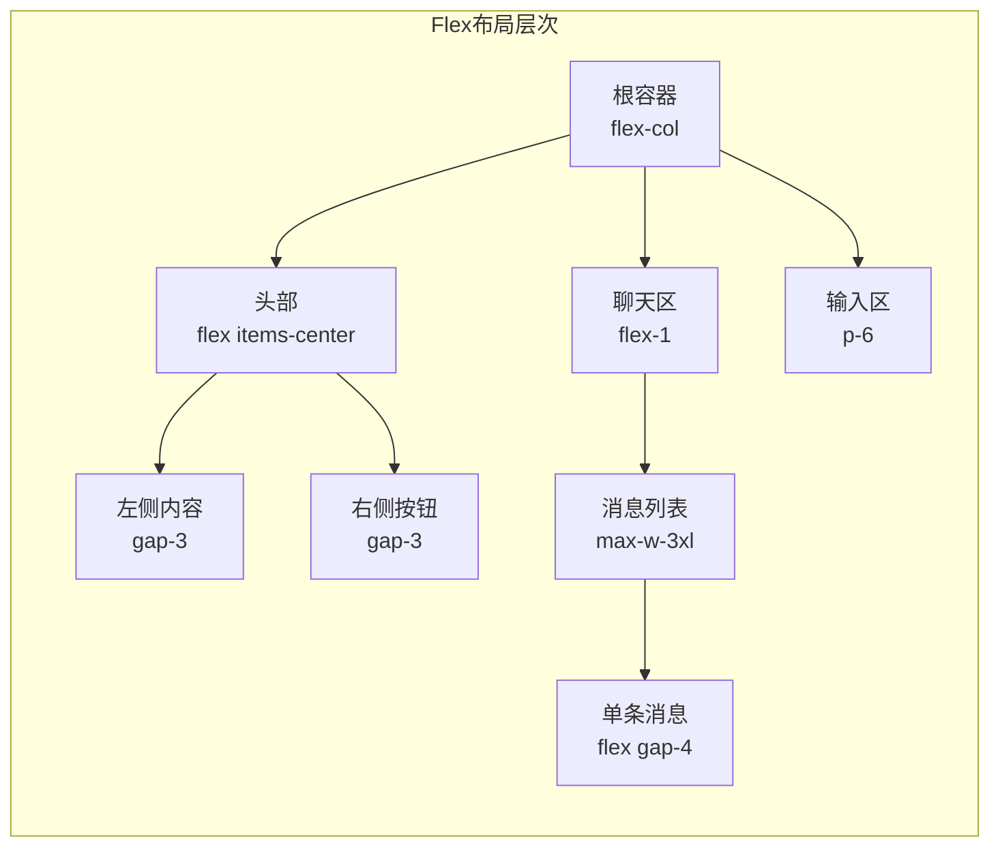
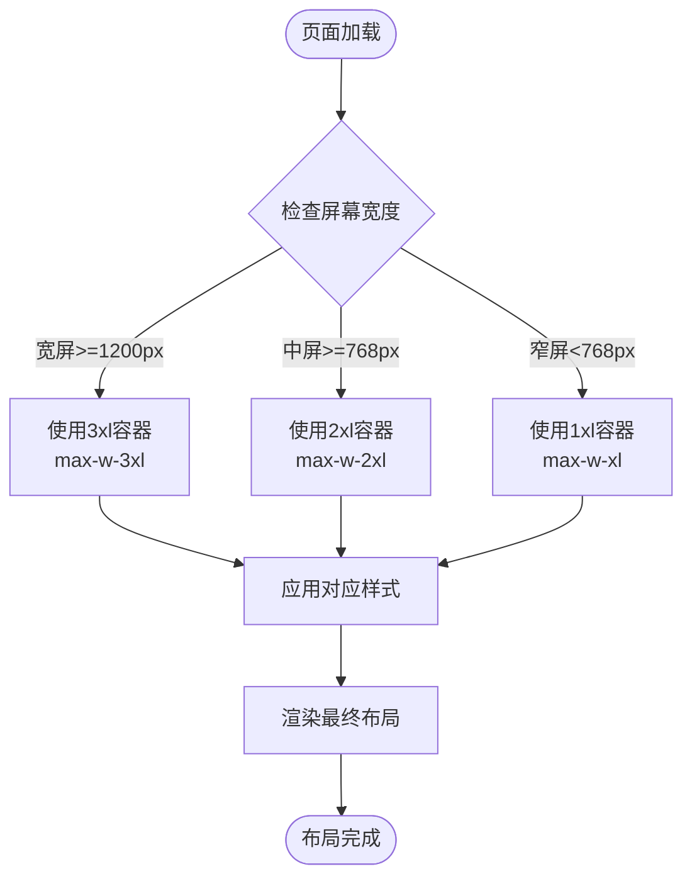
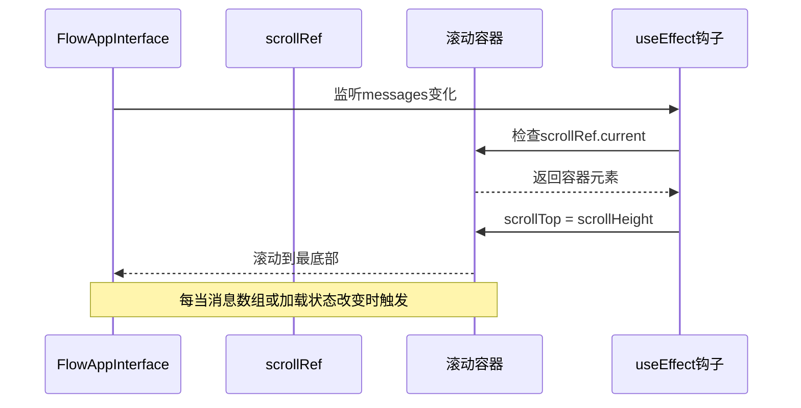
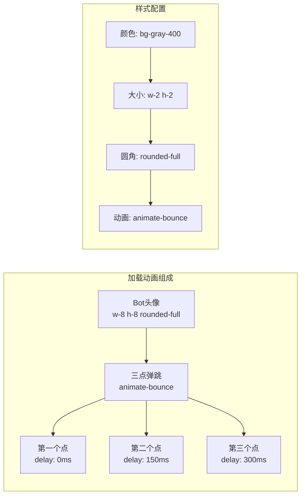
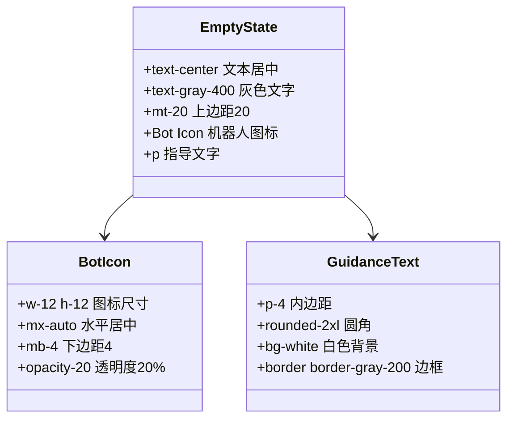
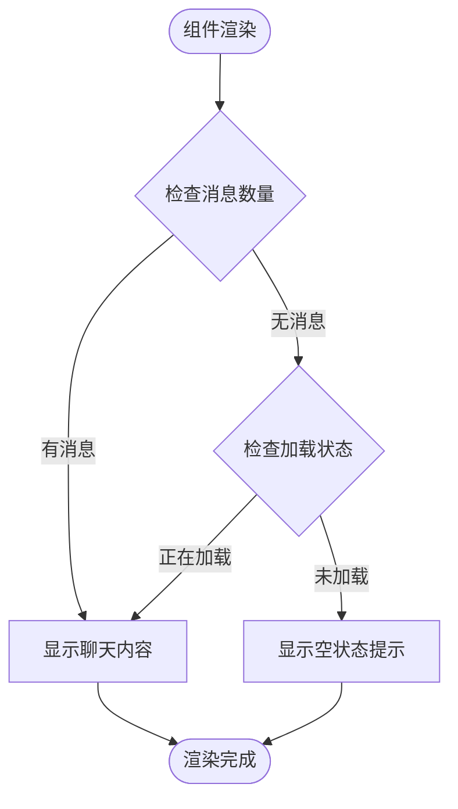

# FlowAppInterface 组件界面结构详细解析

<cite>
**本文档中引用的文件**
- [FlowAppInterface.tsx](file://src/components/apps/FlowAppInterface.tsx)
- [globals.css](file://src/app/globals.css)
- [tailwind.config.ts](file://tailwind.config.ts)
- [prompt-bubble.tsx](file://src/components/ui/prompt-bubble.tsx)
- [scroll-area.tsx](file://src/components/ui/scroll-area.tsx)
- [button.tsx](file://src/components/ui/button.tsx)
</cite>

## 目录
1. [概述](#概述)
2. [整体布局架构](#整体布局架构)
3. [头部区域设计](#头部区域设计)
4. [聊天区域布局](#聊天区域布局)
5. [输入区域实现](#输入区域实现)
6. [CSS类名组织策略](#css类名组织策略)
7. [Flex布局与响应式设计](#flex布局与响应式设计)
8. [自动滚动机制](#自动滚动机制)
9. [加载状态视觉呈现](#加载状态视觉呈现)
10. [空状态提示系统](#空状态提示系统)
11. [定制化建议](#定制化建议)
12. [总结](#总结)

## 概述

FlowAppInterface 是一个采用三段式布局设计的聊天界面组件，专为智能助手应用场景而构建。该组件通过清晰的层次结构和现代化的UI设计，提供了流畅的用户交互体验。整体布局采用Flexbox布局系统，结合Tailwind CSS工具类，实现了响应式设计和良好的可维护性。

## 整体布局架构

FlowAppInterface 采用了经典的三段式布局模式，将界面划分为头部导航区、聊天内容区和输入控制区三个主要部分。

```mermaid
graph TB
subgraph "FlowAppInterface 布局结构"
A[根容器<br/>flex flex-col flex-1 w-full h-full] --> B[头部区域<br/>h-16 border-b border-gray-100]
A --> C[聊天区域<br/>flex-1 overflow-y-auto]
A --> D[输入区域<br/>p-6 bg-gray-50]
B --> E[标题栏<br/>flex items-center justify-between]
B --> F[关闭按钮<br/>Button variant="ghost"]
C --> G[消息列表<br/>max-w-3xl mx-auto]
C --> H[空状态提示<br/>text-center text-gray-400]
C --> I[消息气泡<br/>flex gap-4]
C --> J[加载动画<br/>animate-bounce]
D --> K[PromptBubble<br/>输入框组件]
end
```

**图表来源**
- [FlowAppInterface.tsx](file://src/components/apps/FlowAppInterface.tsx#L42-L133)

**章节来源**
- [FlowAppInterface.tsx](file://src/components/apps/FlowAppInterface.tsx#L42-L133)

## 头部区域设计

头部区域作为界面的导航核心，采用了固定定位和透明背景效果，确保在滚动时保持可见性。

### 样式特征

- **高度设置**: `h-16` 固定高度为64px
- **边框样式**: `border-b border-gray-100` 下边框为浅灰色分隔线
- **布局方式**: `flex items-center justify-between px-6` 水平居中对齐，左右间距6
- **背景效果**: `bg-white/80 backdrop-blur-md` 半透明白色背景配合模糊效果
- **定位属性**: `sticky top-0 z-10` 固定定位，层级为10

### 流程图：头部渲染逻辑



**图表来源**
- [FlowAppInterface.tsx](file://src/components/apps/FlowAppInterface.tsx#L44-L79)

**章节来源**
- [FlowAppInterface.tsx](file://src/components/apps/FlowAppInterface.tsx#L44-L79)

## 聊天区域布局

聊天区域是整个组件的核心内容区，负责展示对话历史和处理用户交互。

### 核心特性

- **弹性布局**: `flex-1` 占据剩余所有空间
- **溢出处理**: `overflow-y-auto` 支持垂直方向滚动
- **内边距**: `p-6` 全方位6px内边距
- **背景色**: `bg-gray-50` 浅灰色背景

### 消息容器设计

聊天区域内部使用了一个最大宽度限制的容器：

- **宽度约束**: `max-w-3xl mx-auto` 最大宽度为3xl，水平居中
- **间距管理**: `space-y-6` 纵向间距6px

### 消息气泡布局

每条消息采用flex布局进行排列：



**图表来源**
- [FlowAppInterface.tsx](file://src/components/apps/FlowAppInterface.tsx#L92-L101)

**章节来源**
- [FlowAppInterface.tsx](file://src/components/apps/FlowAppInterface.tsx#L82-L119)

## 输入区域实现

输入区域位于界面底部，集成了PromptBubble组件提供富文本输入功能。

### 布局配置

- **内边距**: `p-6` 顶部和底部6px内边距
- **背景色**: `bg-gray-50` 浅灰色背景
- **边框**: `border-t border-gray-100` 上边框分隔线

### 容器约束

输入区域同样使用了最大宽度限制：
- **宽度约束**: `max-w-2xl mx-auto` 最大宽度为2xl，水平居中
- **间距管理**: `gap-4` 内部间距4px

### PromptBubble组件集成

PromptBubble组件提供了以下核心功能：
- 自动高度调整
- Enter键发送功能
- Shift+Enter换行支持
- 实时内容验证

**章节来源**
- [FlowAppInterface.tsx](file://src/components/apps/FlowAppInterface.tsx#L118-L133)
- [prompt-bubble.tsx](file://src/components/ui/prompt-bubble.tsx#L1-113)

## CSS类名组织策略

FlowAppInterface 严格遵循Tailwind CSS的实用优先原则，采用语义化的类名组织策略。

### 命名规范

1. **尺寸类**: `h-16`, `w-8`, `p-6`, `px-6`
2. **颜色类**: `bg-white`, `bg-gray-50`, `text-gray-900`
3. **布局类**: `flex`, `flex-col`, `items-center`, `justify-between`
4. **间距类**: `gap-3`, `space-y-6`, `mx-auto`
5. **状态类**: `disabled`, `hover:bg-gray-100`, `active:bg-black`

### Tailwind配置优化

项目使用了自定义的Tailwind配置，重点优化了以下方面：

- **圆角半径**: `borderRadius: { xl: "0.75rem" }`
- **容器配置**: 居中对齐，2rem内边距，最大1400px宽度
- **动画效果**: 自定义弹跳动画 `animate-bounce`

**章节来源**
- [tailwind.config.ts](file://tailwind.config.ts#L1-39)
- [globals.css](file://src/app/globals.css#L1-201)

## Flex布局与响应式设计

### Flex布局策略

FlowAppInterface 充分利用了Flexbox的强大功能：



**图表来源**
- [FlowAppInterface.tsx](file://src/components/apps/FlowAppInterface.tsx#L42-L133)

### 响应式设计实现

1. **容器约束**: 使用 `max-w-3xl mx-auto` 实现内容居中和宽度限制
2. **弹性扩展**: `flex-1` 让聊天区域自动填充可用空间
3. **滚动处理**: `overflow-y-auto` 确保内容超出时可滚动
4. **间距适配**: `gap-3` 和 `space-y-6` 提供一致的间距体验

### 响应式流程图



**章节来源**
- [FlowAppInterface.tsx](file://src/components/apps/FlowAppInterface.tsx#L83-L133)

## 自动滚动机制

FlowAppInterface 实现了智能的消息区域自动滚动功能，确保新消息始终可见。

### 实现原理



**图表来源**
- [FlowAppInterface.tsx](file://src/components/apps/FlowAppInterface.tsx#L34-L39)

### 技术细节

1. **引用管理**: 使用 `useRef<HTMLDivElement>(null)` 创建滚动容器引用
2. **依赖监听**: `useEffect` 监听 `[messages, isLoading]` 变化
3. **滚动计算**: `scrollTop = scrollHeight` 确保滚动到底部
4. **条件检查**: 只有在 `scrollRef.current` 存在时才执行滚动操作

### 性能优化

- **条件判断**: 避免在不存在滚动容器时执行无效操作
- **依赖优化**: 只在关键状态变化时触发滚动
- **内存安全**: 确保引用的正确性和安全性

**章节来源**
- [FlowAppInterface.tsx](file://src/components/apps/FlowAppInterface.tsx#L32-L39)

## 加载状态视觉呈现

加载状态通过创新的三点弹跳动画来表示AI正在思考的过程。

### 动画设计



**图表来源**
- [FlowAppInterface.tsx](file://src/components/apps/FlowAppInterface.tsx#L107-L117)

### 视觉层次

1. **头像标识**: 黑色背景的机器人图标，明确身份
2. **气泡容器**: 白色背景，带灰色边框，简洁专业
3. **动画效果**: 三个小圆点依次弹跳，营造动态感
4. **颜色搭配**: 灰色系，保持整体风格统一

### 动画实现机制

- **基础样式**: `animate-bounce` 启用弹跳动画
- **延迟配置**: 通过 `style={{ animationDelay: "xxxms" }}` 实现错位效果
- **尺寸控制**: `w-2 h-2` 小巧的点状元素
- **颜色选择**: `bg-gray-400` 中性灰色，不抢眼但足够明显

**章节来源**
- [FlowAppInterface.tsx](file://src/components/apps/FlowAppInterface.tsx#L107-L117)

## 空状态提示系统

当没有对话历史时，组件会显示友好的空状态提示，引导用户开始对话。

### 提示内容设计



**图表来源**
- [FlowAppInterface.tsx](file://src/components/apps/FlowAppInterface.tsx#L85-L89)

### 触发条件

空状态提示仅在以下条件下显示：
- `messages.length === 0` 对话历史为空
- 且没有正在进行的加载状态

### 设计理念

1. **友好引导**: 使用"我是您的智能助手，请告诉我您的需求"作为欢迎语
2. **视觉平衡**: 机器人图标采用半透明效果，避免过于突兀
3. **位置安排**: `mt-20` 提供充足的上边距，使提示位于视觉中心
4. **交互友好**: 明确的行动指引，降低用户使用门槛

### 显示时机



**图表来源**
- [FlowAppInterface.tsx](file://src/components/apps/FlowAppInterface.tsx#L85-L89)

**章节来源**
- [FlowAppInterface.tsx](file://src/components/apps/FlowAppInterface.tsx#L85-L89)

## 定制化建议

基于对FlowAppInterface组件的深入分析，以下是针对不同使用场景的定制化建议：

### 主题定制

1. **颜色方案调整**:
   - 修改 `--color-primary` 变量定义品牌主色调
   - 调整 `bg-white/80` 的透明度值
   - 更新 `backdrop-blur-md` 的模糊强度

2. **字体系统优化**:
   - 在 `tailwind.config.ts` 中扩展字体族配置
   - 调整 `text-sm` 和 `text-base` 的字体大小
   - 添加自定义字体变体

### 布局优化

1. **容器宽度调整**:
   ```typescript
   // 修改容器宽度配置
   const containerConfig = {
     maxWidth: "1600px", // 从1400px增加到1600px
     padding: "3rem",    // 从2rem增加到3rem
   }
   ```

2. **间距系统优化**:
   - 增加 `gap-4` 到 `gap-6` 以获得更开阔的布局
   - 调整 `space-y-6` 到 `space-y-8` 改善垂直间距

### 交互增强

1. **滚动行为改进**:
   ```typescript
   // 添加平滑滚动效果
   useEffect(() => {
     if (scrollRef.current) {
       scrollRef.current.scrollTo({
         top: scrollRef.current.scrollHeight,
         behavior: "smooth"
       });
     }
   }, [messages, isLoading]);
   ```

2. **加载动画定制**:
   - 添加自定义动画序列
   - 调整弹跳频率和幅度
   - 增加加载进度指示器

### 响应式优化

1. **移动端适配**:
   - 调整 `max-w-3xl` 为 `max-w-full` 或 `max-w-screen-md`
   - 增加触摸友好的点击区域
   - 优化滚动性能

2. **高DPI设备支持**:
   - 添加高分辨率图标资源
   - 优化模糊效果的性能
   - 调整动画帧率

### 性能优化建议

1. **虚拟滚动**:
   - 对于大量消息，考虑实现虚拟滚动
   - 使用 `react-window` 或 `react-virtualized` 库

2. **懒加载**:
   - 对于图片类型的flowIcon，实现懒加载
   - 优化初始渲染时间

3. **记忆化处理**:
   - 使用 `React.memo` 包装组件
   - 实现 `useCallback` 缓存函数引用

## 总结

FlowAppInterface 组件展现了现代Web应用界面设计的最佳实践。通过三段式布局、Flexbox弹性布局、Tailwind CSS工具类系统，以及精心设计的交互反馈机制，该组件成功地平衡了功能性、美观性和用户体验。

### 核心优势

1. **清晰的层次结构**: 三段式布局提供了直观的信息架构
2. **优秀的响应式设计**: Flexbox布局确保在各种设备上的良好表现
3. **流畅的交互体验**: 自动滚动和加载动画提升了用户满意度
4. **可维护的代码结构**: Tailwind CSS的实用优先原则简化了样式管理

### 技术亮点

- **智能自动滚动**: 基于消息状态变化的自动化滚动机制
- **创新加载动画**: 三点弹跳动画有效传达AI思考过程
- **优雅的空状态**: 友好的初始体验引导用户开始对话
- **灵活的图标系统**: 支持多种图标类型的动态渲染

该组件为智能助手应用提供了一个坚实的基础界面，其设计理念和实现方式值得在类似项目中借鉴和应用。