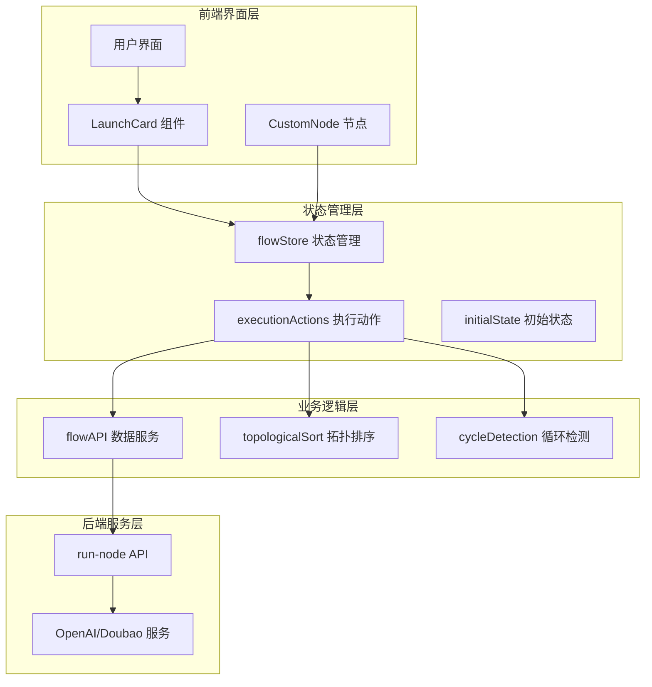
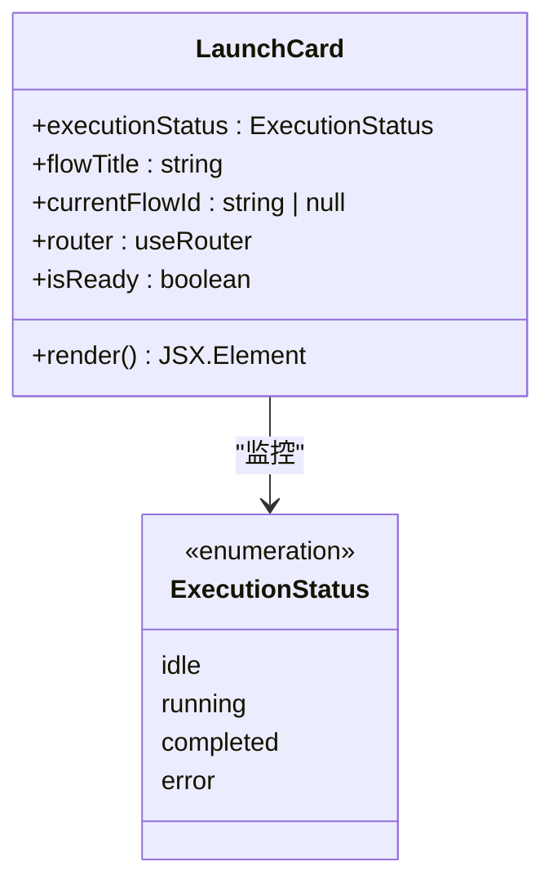
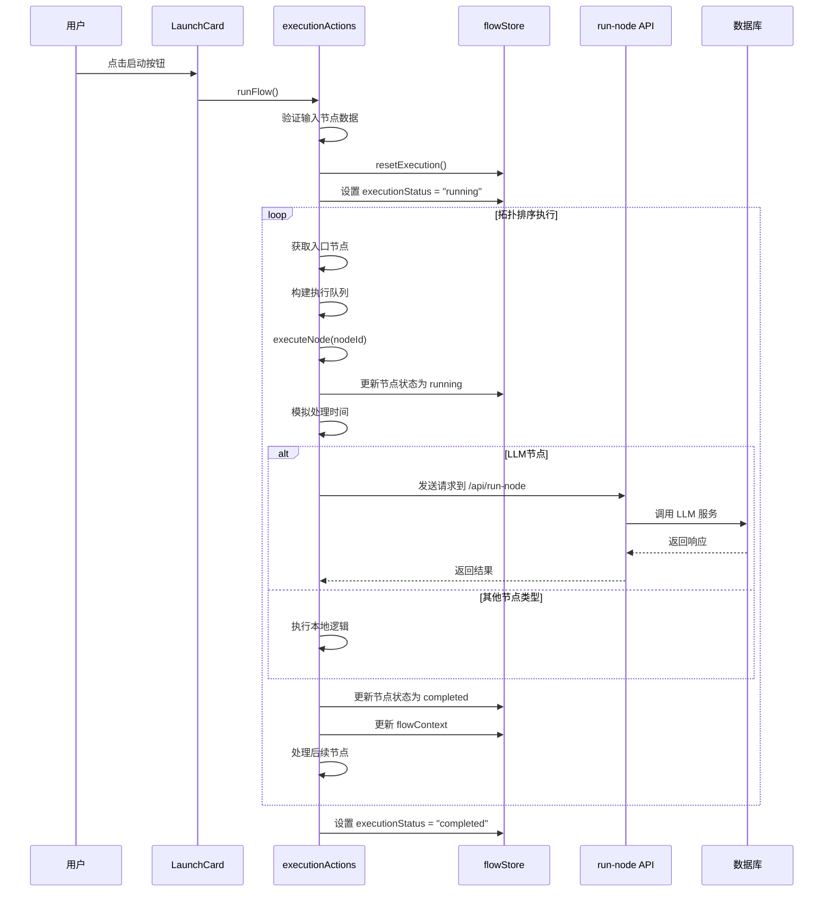
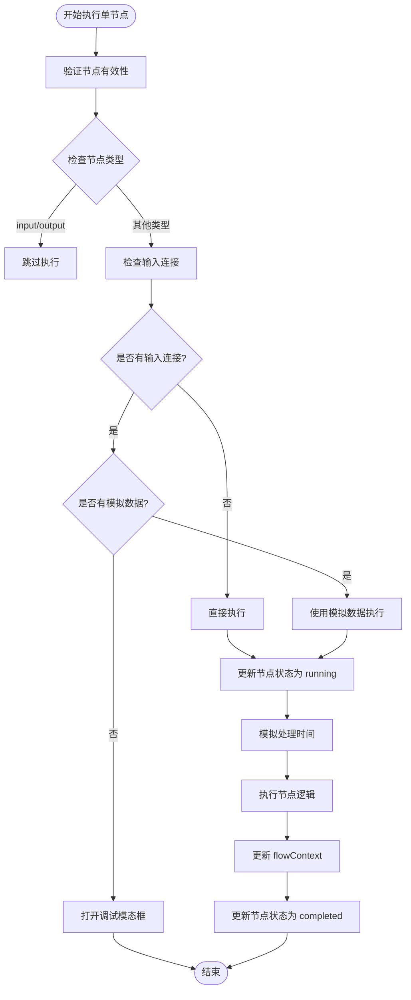
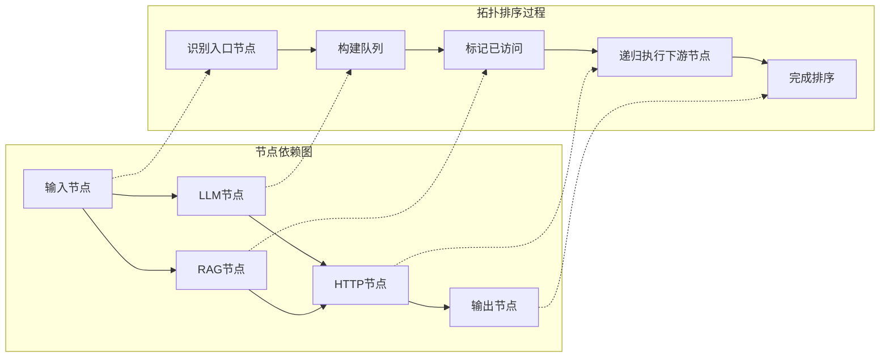
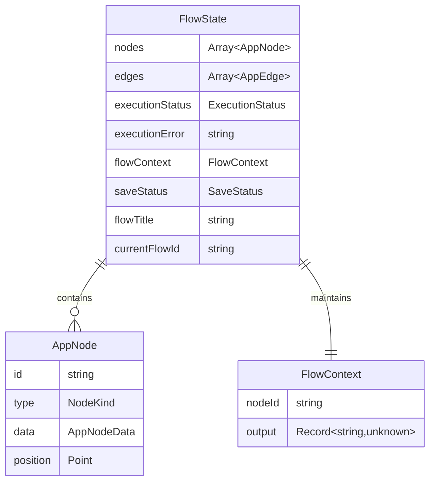
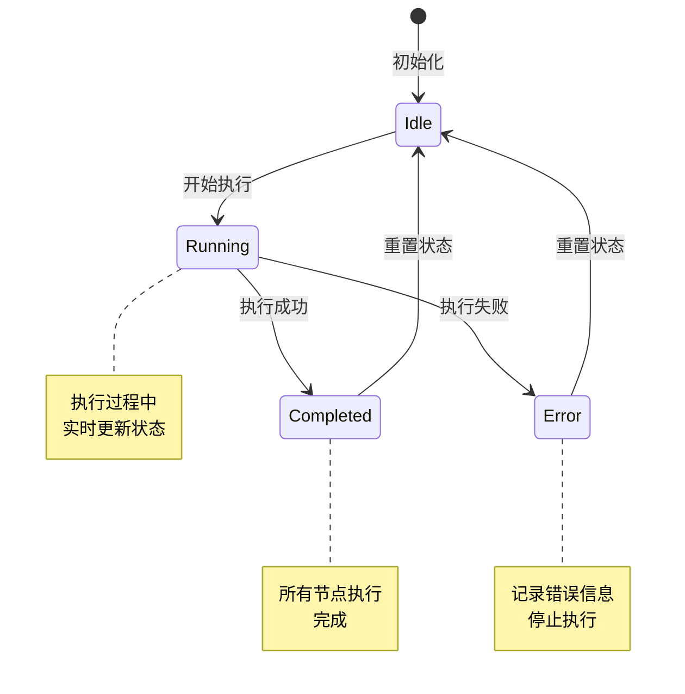
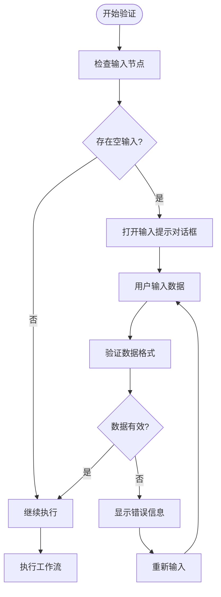
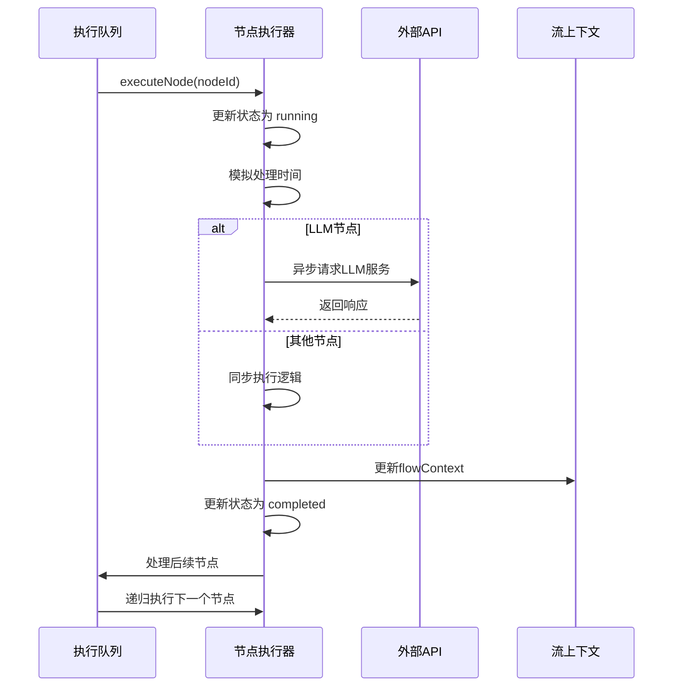

# 执行控制机制

<cite>
**本文档引用的文件**
- [LaunchCard.tsx](file://src/components/builder/LaunchCard.tsx)
- [executionActions.ts](file://src/store/actions/executionActions.ts)
- [flowStore.ts](file://src/store/flowStore.ts)
- [flowAPI.ts](file://src/services/flowAPI.ts)
- [route.ts](file://src/app/api/run-node/route.ts)
- [flow.ts](file://src/types/flow.ts)
- [validation.ts](file://src/utils/validation.ts)
- [cycleDetection.ts](file://src/store/utils/cycleDetection.ts)
- [layoutAlgorithm.ts](file://src/store/utils/layoutAlgorithm.ts)
- [initialState.ts](file://src/store/constants/initialState.ts)
- [CustomNode.tsx](file://src/components/flow/CustomNode.tsx)
</cite>

## 目录
1. [概述](#概述)
2. [系统架构](#系统架构)
3. [核心组件分析](#核心组件分析)
4. [执行控制流程](#执行控制流程)
5. [拓扑排序算法](#拓扑排序算法)
6. [状态管理系统](#状态管理系统)
7. [错误处理机制](#错误处理机制)
8. [异步执行实现](#异步执行实现)
9. [实际代码示例](#实际代码示例)
10. [性能优化策略](#性能优化策略)
11. [总结](#总结)

## 概述

Flash Flow的执行控制机制是一个基于React和Zustand的状态管理系统，负责协调工作流的启动、执行和状态跟踪。该系统通过LaunchCard组件触发执行流程，利用拓扑排序算法构建执行队列，并通过状态管理器控制整个执行过程。

核心功能包括：
- 工作流启动和初始化
- 节点依赖关系解析
- 异步执行控制
- 实时状态更新
- 错误处理和恢复
- 输入验证和预处理

## 系统架构



**图表来源**
- [flowStore.ts](file://src/store/flowStore.ts#L17-L127)
- [executionActions.ts](file://src/store/actions/executionActions.ts#L4-L291)
- [flowAPI.ts](file://src/services/flowAPI.ts#L10-L240)

## 核心组件分析

### LaunchCard 组件

LaunchCard是工作流执行的入口点，负责监控执行状态并在工作流准备就绪时显示启动按钮。



**图表来源**
- [LaunchCard.tsx](file://src/components/builder/LaunchCard.tsx#L8-L56)
- [flow.ts](file://src/types/flow.ts#L11-L11)

### 执行动作处理器

执行动作处理器包含两个核心方法：`runFlow`和`runNode`，它们分别处理完整工作流执行和单个节点调试执行。

```mermaid
classDiagram
class ExecutionActions {
+resetExecution() void
+runFlow() Promise~void~
+runNode(nodeId, mockInputData?) Promise~void~
}
class FlowContext {
+[nodeId : string] : Record~string, unknown~
}
class AppNode {
+id : string
+type : NodeKind
+data : AppNodeData
+position : {x : number, y : number}
}
ExecutionActions --> FlowContext : "维护"
ExecutionActions --> AppNode : "操作"
```

**图表来源**
- [executionActions.ts](file://src/store/actions/executionActions.ts#L4-L291)
- [flow.ts](file://src/types/flow.ts#L46-L51)

**章节来源**
- [LaunchCard.tsx](file://src/components/builder/LaunchCard.tsx#L1-L56)
- [executionActions.ts](file://src/store/actions/executionActions.ts#L1-L291)

## 执行控制流程

### runFlow 方法实现原理

`runFlow`方法是整个执行系统的核心，它实现了完整的拓扑排序和异步执行流程。



**图表来源**
- [executionActions.ts](file://src/store/actions/executionActions.ts#L23-L180)
- [route.ts](file://src/app/api/run-node/route.ts#L4-L66)

### runNode 方法实现原理

`runNode`方法用于调试模式下的单节点执行，提供了更灵活的测试能力。



**图表来源**
- [executionActions.ts](file://src/store/actions/executionActions.ts#L185-L291)

**章节来源**
- [executionActions.ts](file://src/store/actions/executionActions.ts#L23-L180)
- [executionActions.ts](file://src/store/actions/executionActions.ts#L185-L291)

## 拓扑排序算法

### 执行队列构建

系统使用拓扑排序算法确保节点按照正确的依赖顺序执行。算法的核心步骤包括：

1. **入口节点识别**：找到没有输入边的节点作为执行起点
2. **依赖关系解析**：确定每个节点的前置依赖
3. **执行顺序确定**：构建符合依赖关系的执行队列
4. **循环检测**：验证图中不存在循环依赖



**图表来源**
- [executionActions.ts](file://src/store/actions/executionActions.ts#L44-L45)
- [cycleDetection.ts](file://src/store/utils/cycleDetection.ts#L13-L33)

### 依赖关系处理

系统通过以下机制处理节点间的依赖关系：

| 依赖类型 | 处理方式 | 示例 |
|---------|---------|------|
| 直接依赖 | 前置节点完成后执行 | LLM → HTTP |
| 并行依赖 | 多个上游节点同时满足 | Input → LLM, RAG |
| 条件依赖 | 基于上游节点状态决定 | Output → 上游任意节点 |
| 循环检测 | 防止无限循环执行 | 检测 A→B→A 的循环 |

**章节来源**
- [executionActions.ts](file://src/store/actions/executionActions.ts#L44-L170)
- [cycleDetection.ts](file://src/store/utils/cycleDetection.ts#L1-L34)

## 状态管理系统

### 状态结构设计

系统采用分层状态管理模式，包含多个独立的状态子集：



**图表来源**
- [flow.ts](file://src/types/flow.ts#L83-L153)
- [initialState.ts](file://src/store/constants/initialState.ts#L9-L31)

### 状态变更流程

状态变更遵循严格的单向流动原则：



**图表来源**
- [executionActions.ts](file://src/store/actions/executionActions.ts#L8-L18)
- [flow.ts](file://src/types/flow.ts#L11-L11)

**章节来源**
- [flow.ts](file://src/types/flow.ts#L83-L153)
- [initialState.ts](file://src/store/constants/initialState.ts#L1-L32)

## 错误处理机制

### 输入验证

系统在执行前进行多层输入验证：



**图表来源**
- [executionActions.ts](file://src/store/actions/executionActions.ts#L26-L37)

### 异常捕获和恢复

系统实现了全面的异常处理机制：

| 异常类型 | 处理策略 | 恢复方式 |
|---------|---------|---------|
| 输入验证失败 | 显示错误提示 | 用户修正输入 |
| 网络请求失败 | 记录错误日志 | 重试或降级处理 |
| LLM服务超时 | 设置默认响应 | 使用缓存或默认值 |
| 循环依赖检测 | 阻止执行 | 提示用户修复依赖 |
| 内存溢出 | 清理临时数据 | 分批处理数据 |

**章节来源**
- [executionActions.ts](file://src/store/actions/executionActions.ts#L173-L179)
- [route.ts](file://src/app/api/run-node/route.ts#L60-L66)

## 异步执行实现

### Promise 链式调用

系统使用Promise链式调用来确保节点按顺序执行：



**图表来源**
- [executionActions.ts](file://src/store/actions/executionActions.ts#L49-L165)

### 并发控制

虽然系统主要采用串行执行模式，但在以下场景支持并发：

- 多个独立的入口节点可以并行执行
- 同一节点的不同实例可以并行处理
- 网络请求采用异步非阻塞模式

**章节来源**
- [executionActions.ts](file://src/store/actions/executionActions.ts#L49-L165)
- [route.ts](file://src/app/api/run-node/route.ts#L4-L66)

## 实际代码示例

### 完整执行流程示例

以下展示了从LaunchCard触发到状态更新的完整流程：

**触发启动**：[LaunchCard.tsx](file://src/components/builder/LaunchCard.tsx#L38-L45)

**执行初始化**：[executionActions.ts](file://src/store/actions/executionActions.ts#L39-L40)

**拓扑排序构建**：[executionActions.ts](file://src/store/actions/executionActions.ts#L44-L45)

**节点状态更新**：[executionActions.ts](file://src/store/actions/executionActions.ts#L53-L58)

**上下文维护**：[executionActions.ts](file://src/store/actions/executionActions.ts#L137-L138)

**最终状态完成**：[executionActions.ts](file://src/store/actions/executionActions.ts#L172)

### 单节点调试示例

**节点执行触发**：[CustomNode.tsx](file://src/components/flow/CustomNode.tsx#L84-L104)

**调试模态框打开**：[flowStore.ts](file://src/store/flowStore.ts#L78-L96)

**模拟数据执行**：[executionActions.ts](file://src/store/actions/executionActions.ts#L209-L210)

**状态同步更新**：[executionActions.ts](file://src/store/actions/executionActions.ts#L276-L288)

**章节来源**
- [LaunchCard.tsx](file://src/components/builder/LaunchCard.tsx#L38-L45)
- [executionActions.ts](file://src/store/actions/executionActions.ts#L39-L172)
- [CustomNode.tsx](file://src/components/flow/CustomNode.tsx#L84-L104)

## 性能优化策略

### 渲染优化

系统采用多种渲染优化技术：

- **React.memo**：防止不必要的节点重渲染
- **状态分离**：将执行状态与UI状态分离
- **批量更新**：使用Zustand的批量更新机制

### 内存管理

- **上下文清理**：定期清理已完成节点的上下文数据
- **引用管理**：避免循环引用导致的内存泄漏
- **懒加载**：按需加载大型数据结构

### 执行优化

- **并行处理**：支持独立节点的并行执行
- **缓存机制**：缓存LLM响应结果
- **超时控制**：设置合理的执行超时时间

**章节来源**
- [CustomNode.tsx](file://src/components/flow/CustomNode.tsx#L28-L29)
- [executionActions.ts](file://src/store/actions/executionActions.ts#L49-L165)

## 总结

Flash Flow的执行控制机制是一个设计精良的异步状态管理系统，具有以下特点：

1. **模块化设计**：清晰的组件分离和职责划分
2. **强类型支持**：完整的TypeScript类型定义
3. **完善的错误处理**：多层次的异常捕获和恢复机制
4. **高效的拓扑排序**：确保节点按正确顺序执行
5. **灵活的调试支持**：单节点调试和模拟数据测试
6. **优秀的用户体验**：实时状态反馈和流畅的交互体验

该系统为复杂工作流的执行提供了可靠、高效的技术基础，支持从简单到复杂的各种应用场景。通过合理的架构设计和性能优化，确保了系统的可扩展性和稳定性。