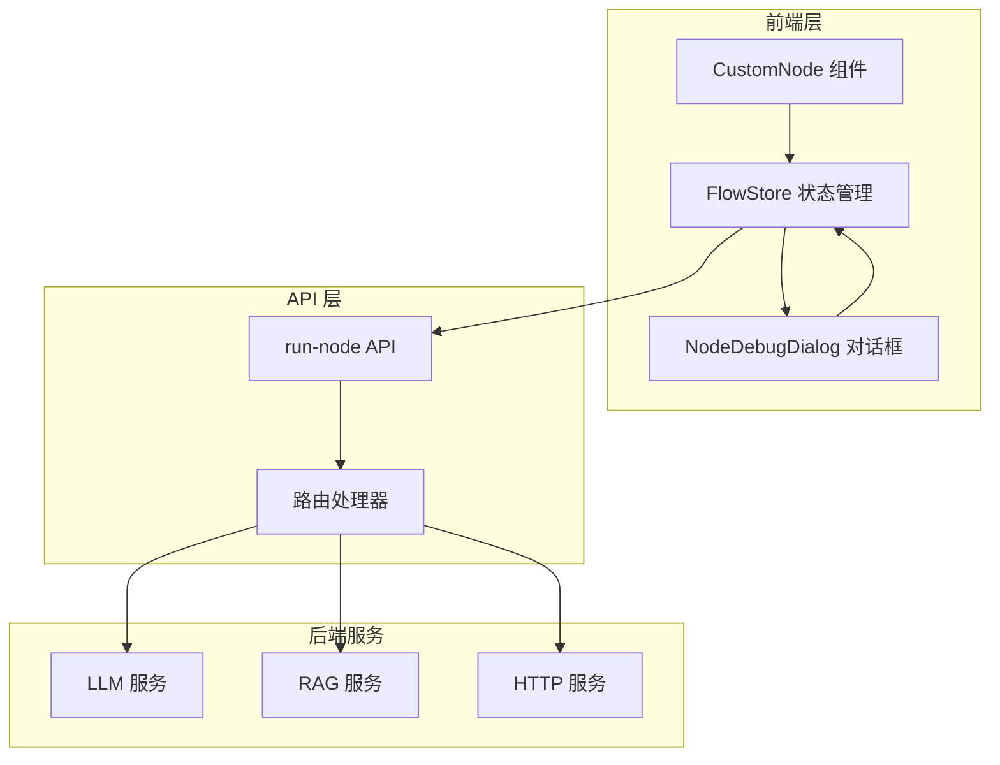
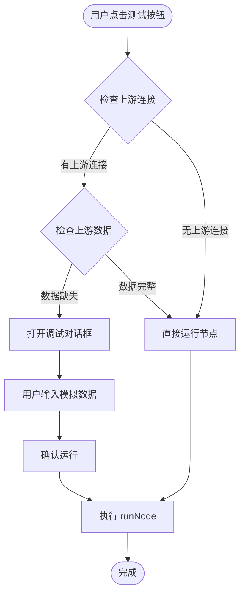
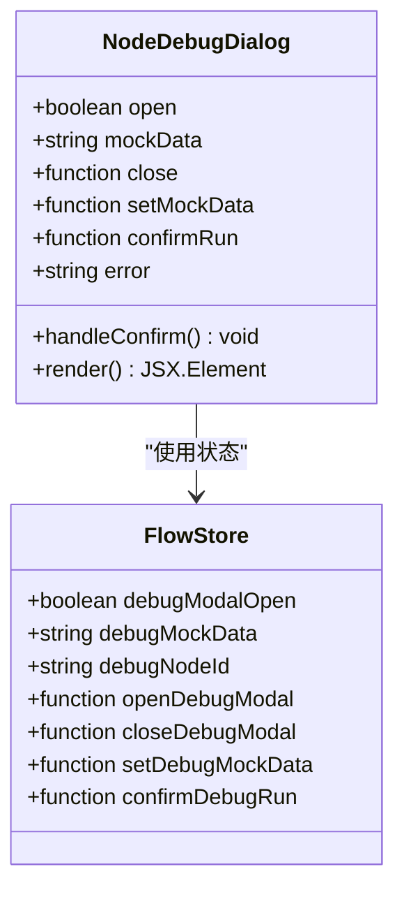
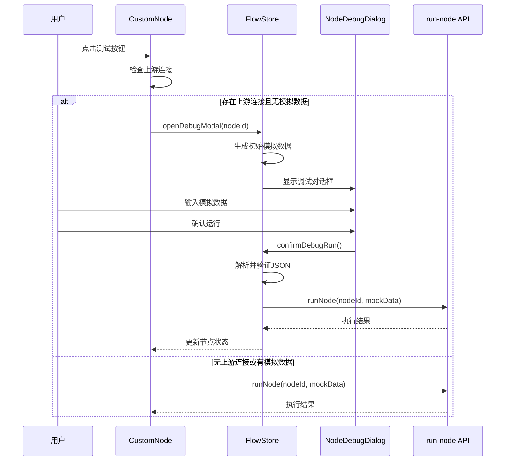
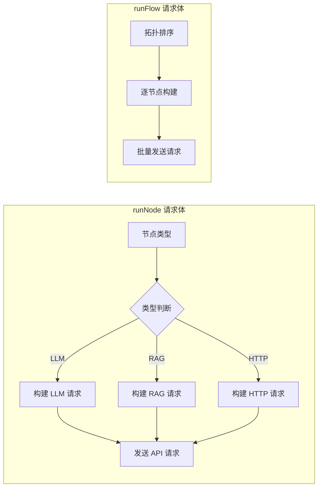
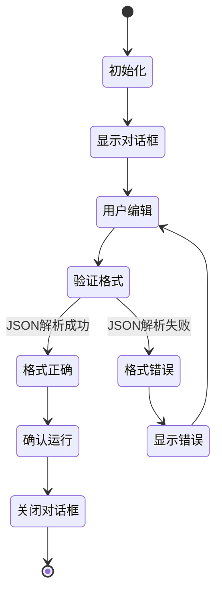
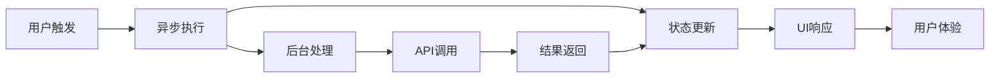

# 单节点调试执行机制

<cite>
**本文档中引用的文件**
- [route.ts](file://src/app/api/run-node/route.ts)
- [CustomNode.tsx](file://src/components/flow/CustomNode.tsx)
- [NodeDebugDialog.tsx](file://src/components/flow/NodeDebugDialog.tsx)
- [flowStore.ts](file://src/store/flowStore.ts)
- [executionActions.ts](file://src/store/actions/executionActions.ts)
- [flow.ts](file://src/types/flow.ts)
- [initialState.ts](file://src/store/constants/initialState.ts)
</cite>

## 目录
1. [概述](#概述)
2. [系统架构](#系统架构)
3. [核心组件分析](#核心组件分析)
4. [调试流程设计](#调试流程设计)
5. [数据流机制](#数据流机制)
6. [安全控制措施](#安全控制措施)
7. [性能考虑](#性能考虑)
8. [故障排除指南](#故障排除指南)
9. [总结](#总结)

## 概述

单节点调试执行机制是Flash Flow SaaS平台中一个重要的开发辅助功能，专门用于在复杂工作流环境中隔离和测试各个节点的功能。该机制允许开发者在不执行整个工作流的情况下，单独调试特定节点，特别适用于处理具有上游连接关系的孤立节点测试场景。

### 设计目的

该功能的主要设计目的是：
- **隔离测试**：允许开发者独立测试每个节点的功能，而不受其他节点状态的影响
- **上游依赖处理**：智能检测节点的上游连接关系，并在必要时提供模拟输入数据
- **开发效率提升**：减少调试整个工作流的时间成本，提高开发效率
- **错误定位**：快速定位节点级别的问题，支持精确的错误诊断

## 系统架构

**图表来源**
- [CustomNode.tsx](file://src/components/flow/CustomNode.tsx#L27-L187)
- [NodeDebugDialog.tsx](file://src/components/flow/NodeDebugDialog.tsx#L9-L69)
- [flowStore.ts](file://src/store/flowStore.ts#L17-L127)
- [route.ts](file://src/app/api/run-node/route.ts#L4-L66)

## 核心组件分析

### CustomNode 组件 - 调试触发器

CustomNode 组件作为调试功能的入口点，实现了智能的节点测试逻辑：

**图表来源**
- [CustomNode.tsx](file://src/components/flow/CustomNode.tsx#L84-L105)

**节来源**
- [CustomNode.tsx](file://src/components/flow/CustomNode.tsx#L84-L105)

### NodeDebugDialog 对话框 - 用户交互界面

NodeDebugDialog 提供了直观的用户界面来输入和验证模拟数据：

**图表来源**
- [NodeDebugDialog.tsx](file://src/components/flow/NodeDebugDialog.tsx#L9-L69)
- [flowStore.ts](file://src/store/flowStore.ts#L103-L114)

**节来源**
- [NodeDebugDialog.tsx](file://src/components/flow/NodeDebugDialog.tsx#L9-L69)

### FlowStore 状态管理 - 调试状态协调

FlowStore 中的调试相关状态和方法构成了整个调试机制的核心：

| 方法名 | 功能描述 | 参数 | 返回值 |
|--------|----------|------|--------|
| `openDebugModal` | 打开调试对话框 | `nodeId: string` | `void` |
| `closeDebugModal` | 关闭调试对话框 | 无 | `void` |
| `setDebugMockData` | 设置模拟数据 | `data: string` | `void` |
| `confirmDebugRun` | 确认并执行调试 | 无 | `Promise<void>` |

**节来源**
- [flowStore.ts](file://src/store/flowStore.ts#L77-L114)

## 调试流程设计

### 自动弹出调试对话框机制

当节点存在上游连接边且未提供 `mockInputData` 时，系统会自动弹出调试输入框：

**图表来源**
- [CustomNode.tsx](file://src/components/flow/CustomNode.tsx#L84-L105)
- [flowStore.ts](file://src/store/flowStore.ts#L77-L114)
- [executionActions.ts](file://src/store/actions/executionActions.ts#L185-L290)

### mockInputData 参数作用机制

`mockInputData` 参数在调试过程中起到关键作用：

1. **绕过正常数据流**：当提供 `mockInputData` 时，节点跳过上游数据检查，直接使用提供的模拟数据
2. **孤立节点测试**：对于没有上游连接的节点，`mockInputData` 可以模拟输入数据
3. **调试专用**：该参数仅在调试模式下有效，确保生产环境的安全性

**节来源**
- [executionActions.ts](file://src/store/actions/executionActions.ts#L185-L290)

## 数据流机制

### runNode 与 runFlow 的 API 调用对比

两个函数都调用 `/api/run-node` API，但在请求体构造和错误处理方面存在差异：

| 特征 | runNode | runFlow |
|------|---------|---------|
| 请求体构造 | 基于节点类型动态构建 | 基于拓扑排序顺序构建 |
| 错误处理 | 单节点错误隔离 | 整个工作流错误传播 |
| 上游数据检查 | 智能检测并提示 | 全局输入节点检查 |
| 并发控制 | 单节点执行 | 节点间串行执行 |

### 请求体构造机制

**图表来源**
- [executionActions.ts](file://src/store/actions/executionActions.ts#L252-L273)
- [route.ts](file://src/app/api/run-node/route.ts#L16-L26)

**节来源**
- [executionActions.ts](file://src/store/actions/executionActions.ts#L252-L273)
- [route.ts](file://src/app/api/run-node/route.ts#L16-L26)

### NodeDebugDialog 数据序列化

NodeDebugDialog 实现了完整的输入数据序列化流程：

**图表来源**
- [NodeDebugDialog.tsx](file://src/components/flow/NodeDebugDialog.tsx#L20-L28)

**节来源**
- [NodeDebugDialog.tsx](file://src/components/flow/NodeDebugDialog.tsx#L20-L28)

## 安全控制措施

### 调试功能限制

为了确保系统的安全性，调试功能实施了以下控制措施：

1. **功能范围限制**：调试功能仅限于开发阶段使用，生产环境中不可用
2. **输入验证**：所有模拟数据必须通过严格的JSON格式验证
3. **状态隔离**：调试过程中的状态变更不会影响生产环境的工作流状态
4. **错误隔离**：单个节点的调试错误不会影响其他节点的正常执行

### 初始模拟数据生成

系统根据节点类型自动生成合理的初始模拟数据：

| 节点类型 | 初始模拟数据示例 |
|----------|------------------|
| LLM | `{ "input": "Sample input for LLM" }` |
| RAG | `{ "query": "Sample query for RAG" }` |
| HTTP | `{ "payload": "Sample HTTP payload" }` |

**节来源**
- [flowStore.ts](file://src/store/flowStore.ts#L77-L96)

## 性能考虑

### 异步执行机制

调试功能采用异步执行模式，避免阻塞用户界面：

### 执行时间模拟

不同类型的节点采用不同的执行时间模拟策略：

- **LLM节点**：1500ms延迟，模拟真实的大语言模型处理时间
- **其他节点**：800ms延迟，模拟一般计算任务的处理时间

**节来源**
- [executionActions.ts](file://src/store/actions/executionActions.ts#L204-L205)

## 故障排除指南

### 常见问题及解决方案

| 问题类型 | 症状描述 | 解决方案 |
|----------|----------|----------|
| JSON格式错误 | 调试对话框显示红色错误提示 | 检查输入的JSON格式，确保语法正确 |
| 模拟数据不匹配 | 节点执行结果不符合预期 | 根据节点类型调整模拟数据结构 |
| 上游数据缺失 | 调试对话框频繁弹出 | 检查上游节点是否正确配置和执行 |
| API调用失败 | 节点状态卡在"运行中" | 检查网络连接和API服务状态 |

### 调试最佳实践

1. **从简单开始**：先测试简单的节点，逐步增加复杂度
2. **验证数据结构**：确保模拟数据与节点期望的数据结构匹配
3. **监控执行状态**：观察节点的状态变化，及时发现异常
4. **清理调试状态**：完成调试后，重置节点状态以便继续开发

**节来源**
- [NodeDebugDialog.tsx](file://src/components/flow/NodeDebugDialog.tsx#L20-L28)
- [executionActions.ts](file://src/store/actions/executionActions.ts#L185-L290)

## 总结

单节点调试执行机制是Flash Flow SaaS平台中一个精心设计的开发辅助功能。它通过智能的上游数据检测、直观的用户界面和严格的安全控制，为开发者提供了强大而易用的节点调试能力。

### 主要优势

1. **智能检测**：自动识别节点的上游依赖关系，智能提示需要的调试操作
2. **用户友好**：提供直观的对话框界面，简化模拟数据的输入过程
3. **类型安全**：基于节点类型生成合适的初始模拟数据，减少配置错误
4. **安全可靠**：严格的输入验证和状态隔离，确保生产环境的安全性

### 应用场景

- **节点功能验证**：单独测试每个节点的核心功能
- **错误定位**：快速识别和定位节点级别的问题
- **开发调试**：在复杂工作流开发过程中的快速迭代
- **学习测试**：帮助新用户理解各节点的工作原理

该机制的成功实现体现了现代Web应用中用户体验与功能性平衡的设计理念，为开发者提供了高效、可靠的调试工具，显著提升了开发效率和工作质量。