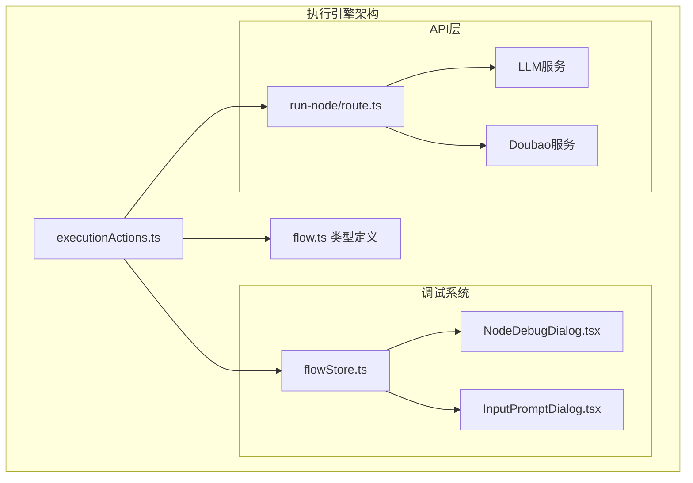
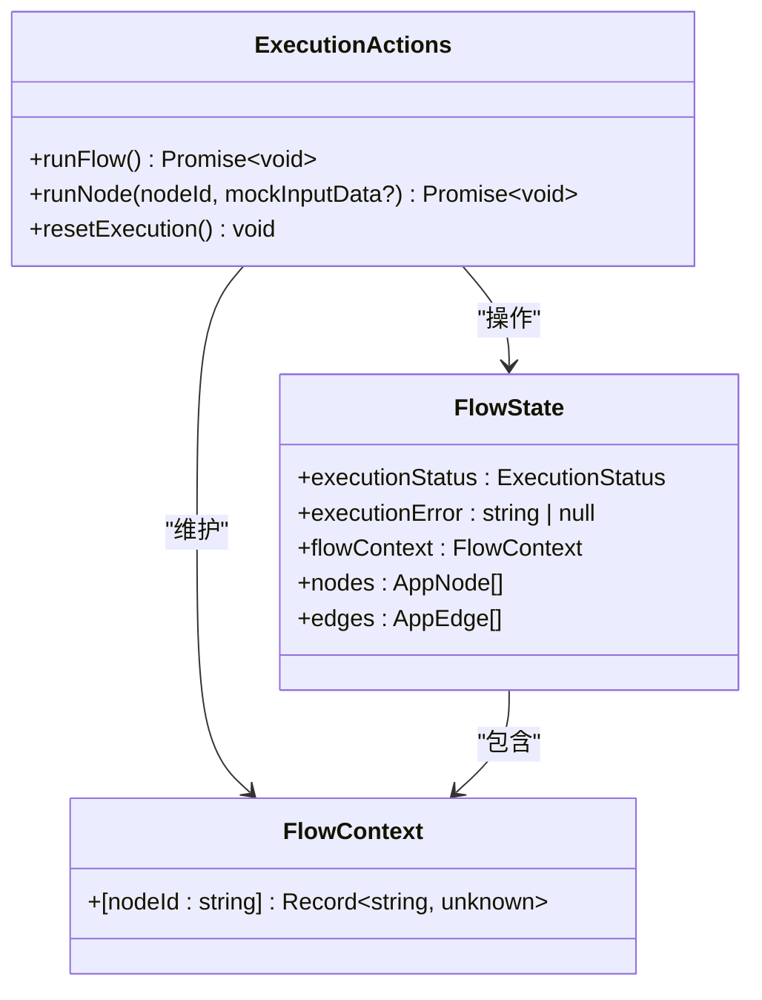
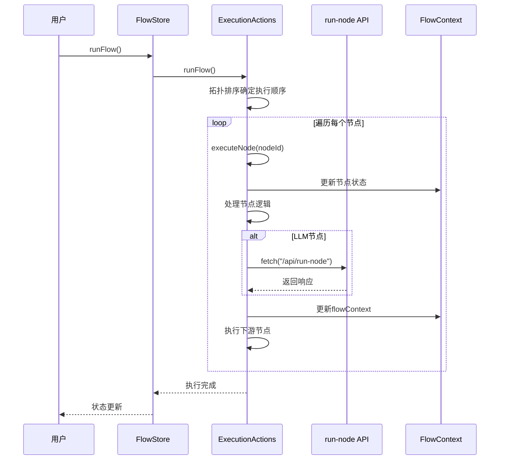
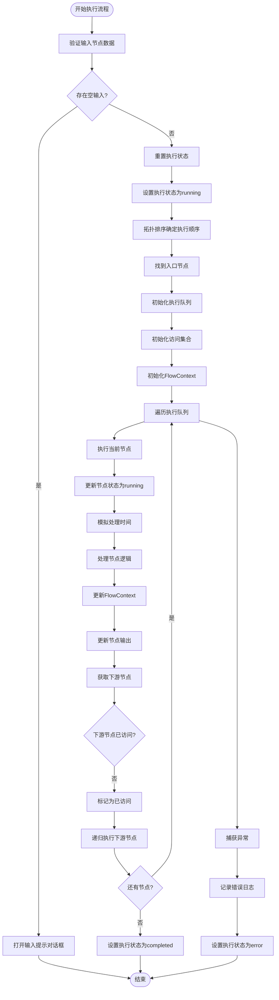
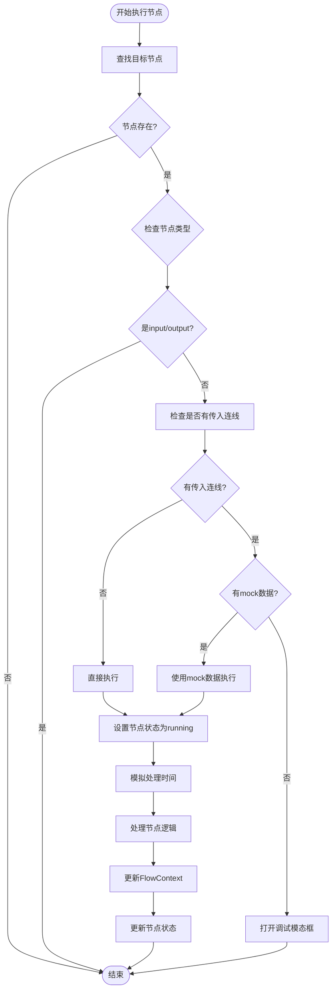
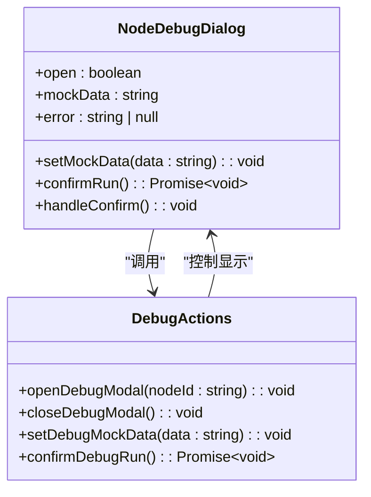
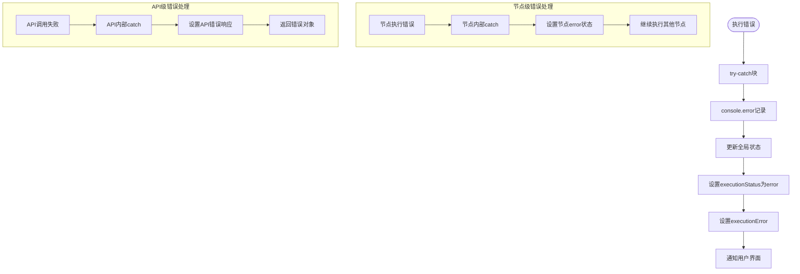

# 执行核心逻辑管理

<cite>
**本文档引用的文件**
- [executionActions.ts](file://src/store/actions/executionActions.ts)
- [route.ts](file://src/app/api/run-node/route.ts)
- [flow.ts](file://src/types/flow.ts)
- [flowStore.ts](file://src/store/flowStore.ts)
- [NodeDebugDialog.tsx](file://src/components/flow/NodeDebugDialog.tsx)
- [InputPromptDialog.tsx](file://src/components/flow/InputPromptDialog.tsx)
</cite>

## 目录
1. [简介](#简介)
2. [项目结构概览](#项目结构概览)
3. [核心组件分析](#核心组件分析)
4. [架构概览](#架构概览)
5. [runFlow方法深度分析](#runflow方法深度分析)
6. [runNode方法深度分析](#runnode方法深度分析)
7. [调试系统集成](#调试系统集成)
8. [错误处理与状态管理](#错误处理与状态管理)
9. [性能优化考虑](#性能优化考虑)
10. [最佳实践总结](#最佳实践总结)

## 简介

executionActions模块是Flash Flow应用的核心执行引擎，负责管理整个工作流的执行生命周期。该模块实现了基于拓扑排序的节点执行算法，支持复杂的依赖关系处理，并提供了强大的调试功能。通过runFlow和runNode两个核心方法，系统能够高效地执行预定义的工作流，同时确保类型安全和良好的用户体验。

## 项目结构概览



**图表来源**
- [executionActions.ts](file://src/store/actions/executionActions.ts#L1-L291)
- [flowStore.ts](file://src/store/flowStore.ts#L1-L131)

**章节来源**
- [executionActions.ts](file://src/store/actions/executionActions.ts#L1-L291)
- [flow.ts](file://src/types/flow.ts#L1-L153)

## 核心组件分析

### 执行状态管理

系统使用FlowContext作为全局执行上下文，维护每个节点的输出结果：



**图表来源**
- [flow.ts](file://src/types/flow.ts#L79-L81)
- [executionActions.ts](file://src/store/actions/executionActions.ts#L4-L291)

### 节点类型支持

系统支持多种节点类型的执行逻辑：

| 节点类型 | 处理方式 | 输入来源 | 输出格式 |
|---------|---------|---------|---------|
| input | 直接使用文本数据 | 用户输入 | {query: string, timestamp: string} |
| llm | API调用 | 上游节点输出或默认值 | {response: string \| error: string} |
| rag | 文档检索模拟 | mockInputData或上游数据 | {foundDocs: string[], input?: any} |
| http | HTTP请求模拟 | mockInputData或上游数据 | {status: number, data: any} |
| output | 数据提取 | 上游节点输出 | {text: string} |

**章节来源**
- [executionActions.ts](file://src/store/actions/executionActions.ts#L67-L134)

## 架构概览



**图表来源**
- [executionActions.ts](file://src/store/actions/executionActions.ts#L23-L179)
- [route.ts](file://src/app/api/run-node/route.ts#L4-L66)

## runFlow方法深度分析

### 拓扑排序算法实现

runFlow方法的核心是基于拓扑排序的节点执行算法：



**图表来源**
- [executionActions.ts](file://src/store/actions/executionActions.ts#L23-L179)

### 关键实现细节

#### 1. 入口节点识别

系统通过检查没有入边的节点来确定入口节点：

```typescript
// 查找没有入边的节点作为入口节点
const entryNodes = nodes.filter((n: AppNode) => !edges.some((e: AppEdge) => e.target === n.id));
```

#### 2. 递归异步执行

executeNode函数实现了递归异步执行逻辑：

```typescript
const executeNode = async (nodeId: string) => {
    const node = get().nodes.find((n: AppNode) => n.id === nodeId);
    if (!node) return;
    
    // 更新状态为 running
    set((state: any) => ({
        nodes: state.nodes.map((n: AppNode) =>
            n.id === nodeId ? { ...n, data: { ...n.data, status: "running" } } : n
        )
    }));
    
    // 执行节点逻辑...
    
    // 执行后续节点
    const currentState = get();
    const outgoers = getOutgoers(node, currentState.nodes, currentState.edges);
    for (const outgoer of outgoers) {
        if (!visited.has(outgoer.id)) {
            visited.add(outgoer.id);
            await executeNode(outgoer.id);
        }
    }
};
```

#### 3. 异步控制流

系统使用Promise和setTimeout来模拟不同节点类型的处理时间：

```typescript
// 模拟处理时间
const startTime = Date.now();
await new Promise(resolve => setTimeout(resolve, node.type === 'llm' ? 2000 : 1000));
const endTime = Date.now();
```

**章节来源**
- [executionActions.ts](file://src/store/actions/executionActions.ts#L43-L170)

## runNode方法深度分析

### 单节点执行逻辑

runNode方法专门用于调试环境中的单节点执行：



**图表来源**
- [executionActions.ts](file://src/store/actions/executionActions.ts#L185-L288)

### 调试模式特殊处理

#### 1. mockInputData注入机制

当提供mockInputData时，系统会直接使用这些数据进行执行：

```typescript
if (mockInputData) {
    if (node.type === "llm") {
        // 使用mock数据调用LLM API
        const resp = await fetch("/api/run-node", {
            method: "POST",
            headers: { "Content-Type": "application/json" },
            body: JSON.stringify({
                model: llmData.model || "doubao-seed-1-6-flash-250828",
                systemPrompt: llmData.systemPrompt || "你是AI助手",
                temperature: llmData.temperature ?? 0.7,
                input: mockInputData  // 直接使用mock数据
            }),
        });
    }
}
```

#### 2. 调试弹窗触发条件

当节点有传入连线但没有提供mock数据时，系统会自动打开调试模态框：

```typescript
const incomingEdges = get().edges.filter((e: AppEdge) => e.target === nodeId);
if (incomingEdges.length > 0 && !mockInputData) {
    get().openDebugModal(nodeId);
    return;
}
```

**章节来源**
- [executionActions.ts](file://src/store/actions/executionActions.ts#L185-L288)

## 调试系统集成

### NodeDebugDialog组件

调试对话框提供了完整的mock数据编辑和验证功能：



**图表来源**
- [NodeDebugDialog.tsx](file://src/components/flow/NodeDebugDialog.tsx#L1-L69)
- [flowStore.ts](file://src/store/flowStore.ts#L78-L114)

### 输入验证机制

调试对话框实现了严格的JSON格式验证：

```typescript
const handleConfirm = () => {
    try {
        JSON.parse(mockData);
        setError(null);
        confirmRun();
    } catch {
        setError("Invalid JSON format");
    }
};
```

**章节来源**
- [NodeDebugDialog.tsx](file://src/components/flow/NodeDebugDialog.tsx#L20-L28)

## 错误处理与状态管理

### 统一错误处理策略

系统在多个层面实现了错误处理：



**图表来源**
- [executionActions.ts](file://src/store/actions/executionActions.ts#L173-L179)
- [route.ts](file://src/app/api/run-node/route.ts#L61-L64)

### 状态更新机制

系统使用Zustand的状态更新模式，确保状态变更的原子性：

```typescript
// 节点状态更新
set((state: any) => ({
    nodes: state.nodes.map((n: AppNode) =>
        n.id === nodeId ? { ...n, data: { ...n.data, status: "running" } } : n
    )
}));

// FlowContext更新
set({ flowContext: { ...context } });

// 执行状态更新
set({
    executionStatus: "error" as ExecutionStatus,
    executionError: error instanceof Error ? error.message : "Unknown error occurred"
});
```

**章节来源**
- [executionActions.ts](file://src/store/actions/executionActions.ts#L54-L179)

## 性能优化考虑

### 异步执行优化

1. **并发执行控制**：通过递归调用确保节点按依赖顺序执行
2. **状态更新优化**：使用批量状态更新减少不必要的重新渲染
3. **内存管理**：及时清理不再需要的上下文数据

### 执行时间模拟

系统为不同类型节点设置了不同的处理时间：

```typescript
// LLM节点较长的处理时间
await new Promise(resolve => setTimeout(resolve, node.type === 'llm' ? 2000 : 1000));

// 调试模式下的较短处理时间
await new Promise((resolve) => setTimeout(resolve, node.type === "llm" ? 1500 : 800));
```

## 最佳实践总结

### 1. 类型安全处理

系统在整个执行过程中严格使用类型定义：

```typescript
// 使用具体类型而非any
const inputData = node.data as InputNodeData;
const llmData = node.data as LLMNodeData;

// 类型守卫确保安全访问
if (prevOut && typeof prevOut === 'object') {
    const prevObj = prevOut as Record<string, unknown>;
    // 安全访问属性
}
```

### 2. 异步控制流管理

```typescript
// 使用async/await确保正确的执行顺序
for (const node of queue) {
    visited.add(node.id);
    await executeNode(node.id);
}

// 递归异步执行下游节点
for (const outgoer of outgoers) {
    if (!visited.has(outgoer.id)) {
        visited.add(outgoer.id);
        await executeNode(outgoer.id);
    }
}
```

### 3. 错误边界设计

```typescript
try {
    // 主要业务逻辑
} catch (error) {
    console.error('Flow execution failed:', error);
    set({
        executionStatus: "error" as ExecutionStatus,
        executionError: error instanceof Error ? error.message : "Unknown error occurred"
    });
}
```

### 4. 调试友好性

```typescript
// 提供mock数据支持调试
runNode: async (nodeId: string, mockInputData?: Record<string, unknown>) => {
    // 支持传入mock数据进行测试
    if (mockInputData) {
        // 使用mock数据执行
    } else {
        // 正常执行逻辑
    }
}
```

**章节来源**
- [executionActions.ts](file://src/store/actions/executionActions.ts#L1-L291)

## 结论

executionActions模块展现了现代React应用中复杂状态管理和异步执行的最佳实践。通过拓扑排序算法确保节点按正确顺序执行，通过FlowContext维护全局状态，通过完善的错误处理机制保证系统的稳定性。调试系统的集成使得开发者能够轻松地测试和验证工作流的各个部分，而类型安全的设计则确保了代码的可靠性和可维护性。

这个模块的设计充分体现了函数式编程思想和响应式状态管理的优势，为构建复杂的可视化工作流编辑器提供了坚实的基础。