# 整体流程执行引擎

<cite>
**本文档引用的文件**
- [executionActions.ts](file://src/store/actions/executionActions.ts)
- [flowStore.ts](file://src/store/flowStore.ts)
- [ControlDock.tsx](file://src/components/builder/ControlDock.tsx)
- [AppModeOverlay.tsx](file://src/components/builder/AppModeOverlay.tsx)
- [InputPromptDialog.tsx](file://src/components/flow/InputPromptDialog.tsx)
- [FlowErrorBoundary.tsx](file://src/components/FlowErrorBoundary.tsx)
- [flow.ts](file://src/types/flow.ts)
- [initialState.ts](file://src/store/constants/initialState.ts)
- [RunInputs.tsx](file://src/components/run/RunInputs.tsx)
- [RunOutputs.tsx](file://src/components/run/RunOutputs.tsx)
</cite>

## 目录
1. [简介](#简介)
2. [项目结构概览](#项目结构概览)
3. [核心组件分析](#核心组件分析)
4. [架构概览](#架构概览)
5. [详细组件分析](#详细组件分析)
6. [依赖关系分析](#依赖关系分析)
7. [性能考虑](#性能考虑)
8. [故障排除指南](#故障排除指南)
9. [结论](#结论)

## 简介

Flash Flow 是一个基于 React 和 Zustand 的可视化工作流编辑器，其核心执行引擎通过 `runFlow` 方法实现了完整的流程执行能力。该系统采用拓扑排序算法确定无依赖节点作为入口点，使用递归异步函数遍历整个流程图，支持多种节点类型的执行，并提供了完善的错误处理和状态管理机制。

## 项目结构概览

Flash Flow 采用模块化架构设计，主要分为以下几个层次：

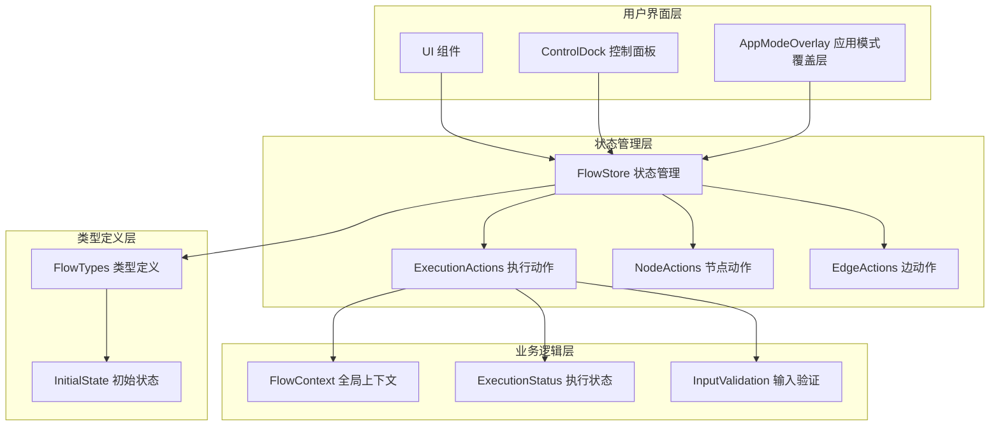

**图表来源**
- [flowStore.ts](file://src/store/flowStore.ts#L17-L127)
- [executionActions.ts](file://src/store/actions/executionActions.ts#L4-L289)

**章节来源**
- [flowStore.ts](file://src/store/flowStore.ts#L1-L131)
- [executionActions.ts](file://src/store/actions/executionActions.ts#L1-L289)

## 核心组件分析

### 执行状态管理

系统通过 `ExecutionStatus` 枚举管理执行状态，包含以下四种状态：
- `"idle"`：空闲状态，初始状态
- `"running"`：正在执行
- `"completed"`：执行完成
- `"error"`：执行出错

### 全局上下文系统

`FlowContext` 是一个键值对结构，用于存储每个节点的执行结果：
```typescript
interface FlowContext {
  [nodeId: string]: Record<string, unknown>;
}
```

### 输入验证机制

系统在执行前会检查所有输入节点的内容，确保没有空值：

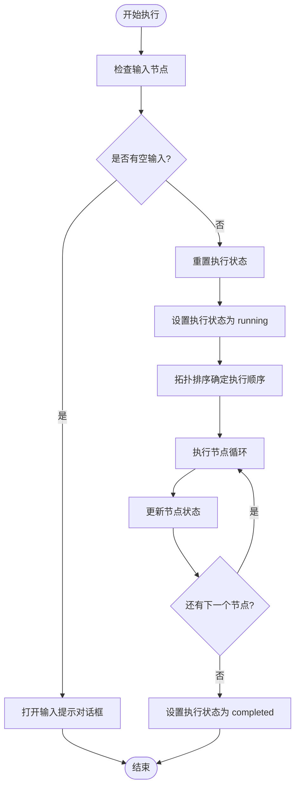

**图表来源**
- [executionActions.ts](file://src/store/actions/executionActions.ts#L23-L179)

**章节来源**
- [executionActions.ts](file://src/store/actions/executionActions.ts#L23-L179)
- [flow.ts](file://src/types/flow.ts#L10-L11)
- [flow.ts](file://src/types/flow.ts#L78-L80)

## 架构概览

### 系统架构图

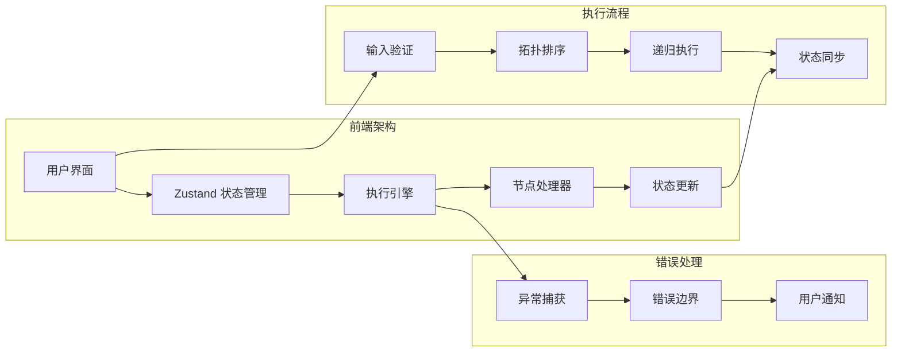

**图表来源**
- [executionActions.ts](file://src/store/actions/executionActions.ts#L23-L179)
- [FlowErrorBoundary.tsx](file://src/components/FlowErrorBoundary.tsx#L15-L64)

## 详细组件分析

### runFlow 方法核心实现

`runFlow` 方法是整个执行引擎的核心，其实现包含以下关键步骤：

#### 1. 输入验证阶段

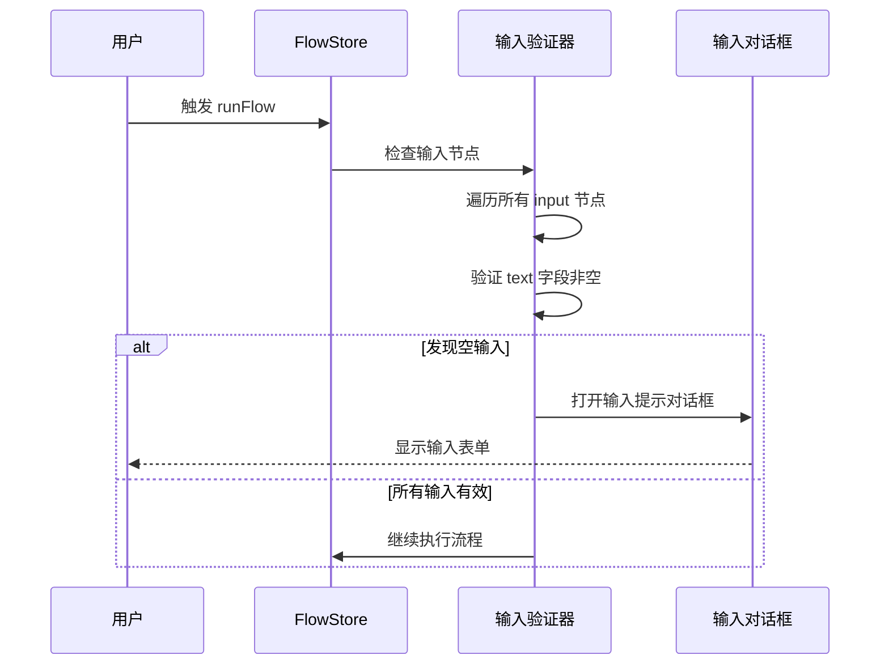

**图表来源**
- [executionActions.ts](file://src/store/actions/executionActions.ts#L26-L37)
- [InputPromptDialog.tsx](file://src/components/flow/InputPromptDialog.tsx#L19-L31)

#### 2. 执行状态初始化

系统首先重置所有节点状态，然后设置全局执行状态：

```typescript
// 重置执行状态
resetExecution();

// 设置执行状态为 running
set({ executionStatus: "running", executionError: null });
```

#### 3. 拓扑排序算法

系统使用拓扑排序确定执行顺序：

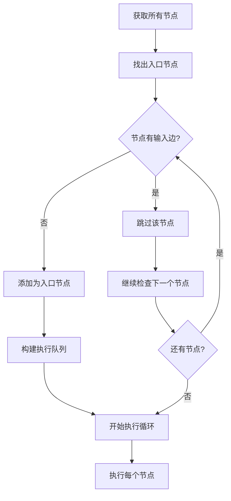

**图表来源**
- [executionActions.ts](file://src/store/actions/executionActions.ts#L43-L46)

#### 4. 递归异步执行

核心的 `executeNode` 函数实现了递归异步执行：

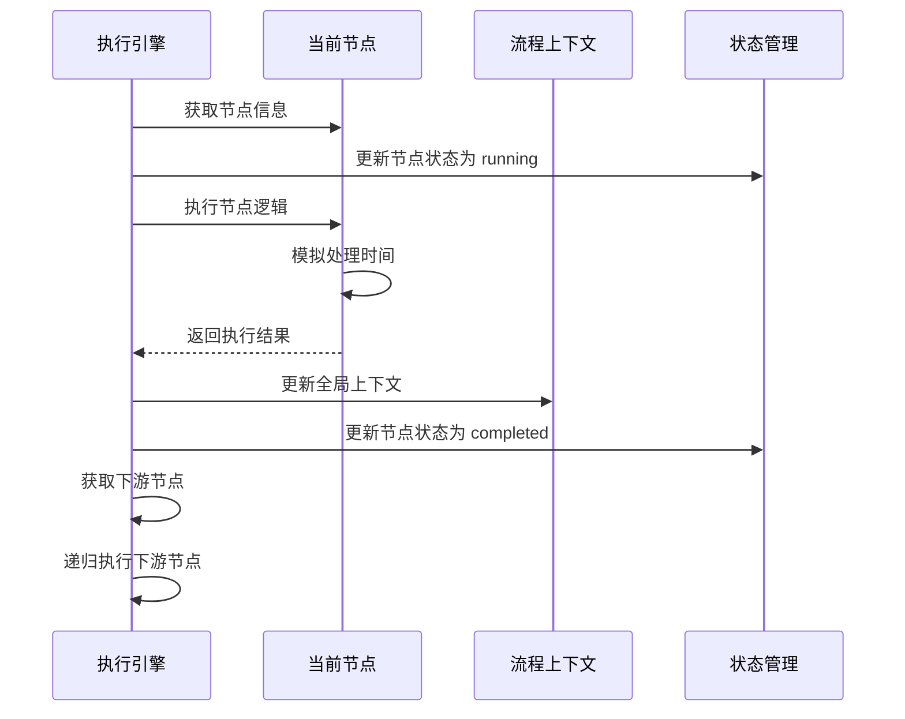

**图表来源**
- [executionActions.ts](file://src/store/actions/executionActions.ts#L49-L165)

#### 5. 节点状态更新机制

每个节点的状态更新遵循以下模式：

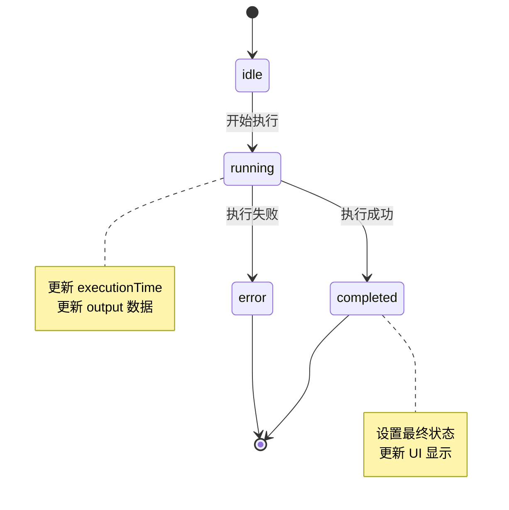

**图表来源**
- [executionActions.ts](file://src/store/actions/executionActions.ts#L53-L154)

**章节来源**
- [executionActions.ts](file://src/store/actions/executionActions.ts#L23-L179)

### 错误边界处理策略

系统实现了多层次的错误处理机制：

#### 1. 异常捕获层

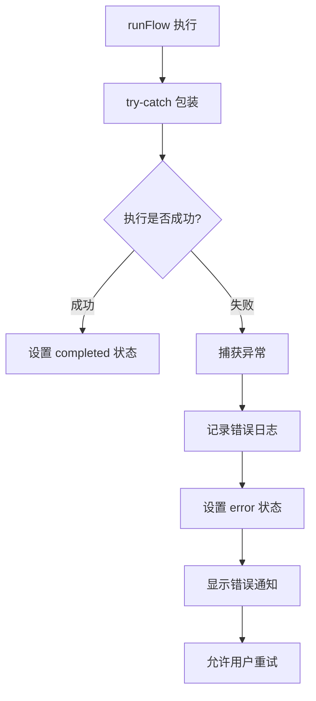

**图表来源**
- [executionActions.ts](file://src/store/actions/executionActions.ts#L173-L178)

#### 2. 用户界面错误处理

控制面板实现了专门的错误处理逻辑：

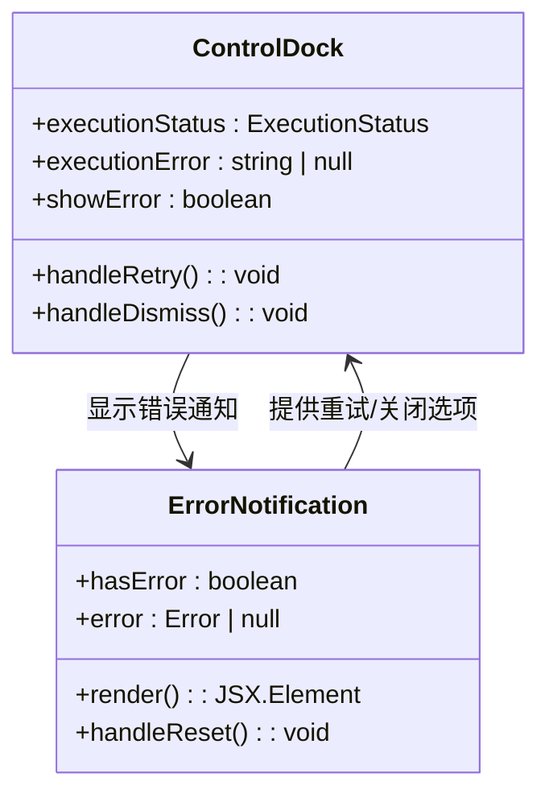

**图表来源**
- [ControlDock.tsx](file://src/components/builder/ControlDock.tsx#L35-L51)
- [FlowErrorBoundary.tsx](file://src/components/FlowErrorBoundary.tsx#L15-L64)

**章节来源**
- [ControlDock.tsx](file://src/components/builder/ControlDock.tsx#L35-L51)
- [FlowErrorBoundary.tsx](file://src/components/FlowErrorBoundary.tsx#L15-L64)

### UI 层调用示例

#### ControlDock 组件中的按钮触发逻辑

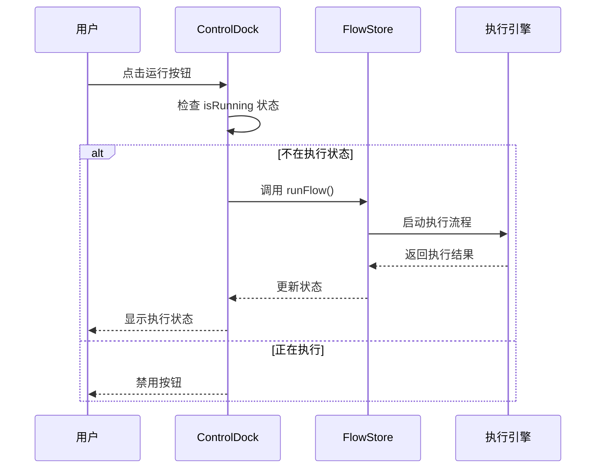

**图表来源**
- [ControlDock.tsx](file://src/components/builder/ControlDock.tsx#L166-L169)

#### AppModeOverlay 中的应用模式触发

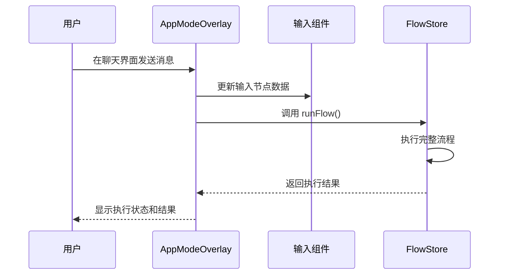

**图表来源**
- [AppModeOverlay.tsx](file://src/components/builder/AppModeOverlay.tsx#L57-L73)

**章节来源**
- [ControlDock.tsx](file://src/components/builder/ControlDock.tsx#L166-L169)
- [AppModeOverlay.tsx](file://src/components/builder/AppModeOverlay.tsx#L57-L73)

## 依赖关系分析

### 核心依赖图

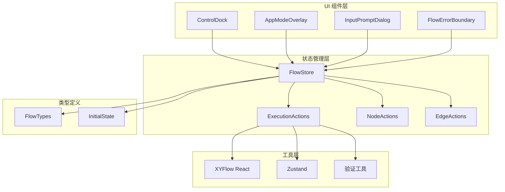

**图表来源**
- [flowStore.ts](file://src/store/flowStore.ts#L17-L127)
- [executionActions.ts](file://src/store/actions/executionActions.ts#L1-L2)

### 外部依赖

系统依赖以下关键外部库：
- **Zustand**：轻量级状态管理库
- **XYFlow React**：可视化流程图组件库
- **React**：用户界面框架
- **TypeScript**：类型安全的 JavaScript

**章节来源**
- [flowStore.ts](file://src/store/flowStore.ts#L1-L131)
- [executionActions.ts](file://src/store/actions/executionActions.ts#L1-L2)

## 性能考虑

### 批处理状态更新

系统使用 Zustand 的批处理机制优化状态更新：

```typescript
// 单次状态更新包含多个字段
set((state: any) => ({
    nodes: state.nodes.map((n: AppNode) =>
        n.id === nodeId ? { ...n, data: { ...n.data, status: "running" } } : n
    ),
    // 其他状态更新...
}));
```

### 异步执行优化

- 使用 `setTimeout` 模拟异步操作
- 支持不同节点类型的差异化处理时间
- 实现了节点级别的并发执行（通过拓扑排序保证正确性）

### 内存管理

- 及时清理执行上下文
- 避免循环引用
- 合理的错误恢复机制

## 故障排除指南

### 常见问题及解决方案

#### 1. 输入验证失败

**问题描述**：执行前发现输入节点为空

**解决方案**：
- 使用 `InputPromptDialog` 组件收集用户输入
- 确保所有必需输入都已填写
- 检查输入格式是否符合要求

#### 2. 执行超时或卡死

**问题描述**：流程执行过程中出现长时间无响应

**解决方案**：
- 检查节点间的循环依赖
- 验证节点逻辑是否存在死循环
- 监控网络请求超时情况

#### 3. 状态不一致

**问题描述**：UI 状态与实际执行状态不匹配

**解决方案**：
- 检查 Zustand 状态更新时机
- 确保异步操作的正确处理
- 验证错误边界处理逻辑

**章节来源**
- [executionActions.ts](file://src/store/actions/executionActions.ts#L26-L37)
- [ControlDock.tsx](file://src/components/builder/ControlDock.tsx#L42-L51)

## 结论

Flash Flow 的整体流程执行引擎通过精心设计的架构实现了高效、可靠的流程执行能力。系统的核心优势包括：

1. **完善的错误处理机制**：多层次的错误捕获和用户反馈
2. **灵活的状态管理**：基于 Zustand 的响应式状态更新
3. **直观的用户界面**：清晰的执行状态指示和交互反馈
4. **可扩展的架构设计**：支持多种节点类型和自定义扩展

该系统为开发者提供了一个强大而易用的工作流执行平台，能够满足复杂业务场景的需求。通过合理的模块化设计和清晰的职责分离，系统具备良好的可维护性和可扩展性。