# 执行触发UI机制

<cite>
**本文档中引用的文件**
- [LaunchCard.tsx](file://src/components/builder/LaunchCard.tsx)
- [flowStore.ts](file://src/store/flowStore.ts)
- [executionActions.ts](file://src/store/actions/executionActions.ts)
- [flow.ts](file://src/types/flow.ts)
- [zIndex.ts](file://src/lib/zIndex.ts)
- [page.tsx](file://src/app/page.tsx)
- [ControlDock.tsx](file://src/components/builder/ControlDock.tsx)
- [AppModeOverlay.tsx](file://src/components/builder/AppModeOverlay.tsx)
</cite>

## 目录
1. [简介](#简介)
2. [项目结构概览](#项目结构概览)
3. [LaunchCard组件核心功能](#launchcard组件核心功能)
4. [状态管理系统](#状态管理系统)
5. [动画效果与用户体验](#动画效果与用户体验)
6. [页面导航机制](#页面导航机制)
7. [界面层级管理](#界面层级管理)
8. [响应式设计模式](#响应式设计模式)
9. [故障排除指南](#故障排除指南)
10. [总结](#总结)

## 简介

LaunchCard组件是Flash Flow SaaS平台中工作流执行控制的核心UI组件，负责在工作流执行完成后向用户展示"应用已就绪"的状态提示，并提供一键跳转到应用模式的功能。该组件通过集成状态订阅、动画效果、路由导航等技术，实现了流畅的用户体验和响应式的界面交互。

## 项目结构概览

Flash Flow采用现代化的React + Next.js架构，主要分为以下几个层次：

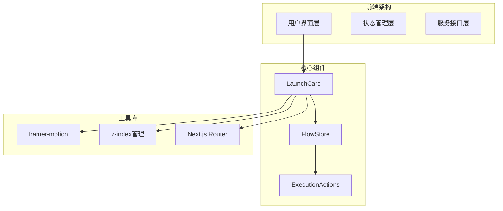

**图表来源**
- [LaunchCard.tsx](file://src/components/builder/LaunchCard.tsx#L1-L56)
- [flowStore.ts](file://src/store/flowStore.ts#L1-L131)

**章节来源**
- [LaunchCard.tsx](file://src/components/builder/LaunchCard.tsx#L1-L56)
- [flowStore.ts](file://src/store/flowStore.ts#L1-L131)

## LaunchCard组件核心功能

### 组件架构设计

LaunchCard组件采用了函数式组件的设计模式，充分利用了React Hooks和状态管理模式：

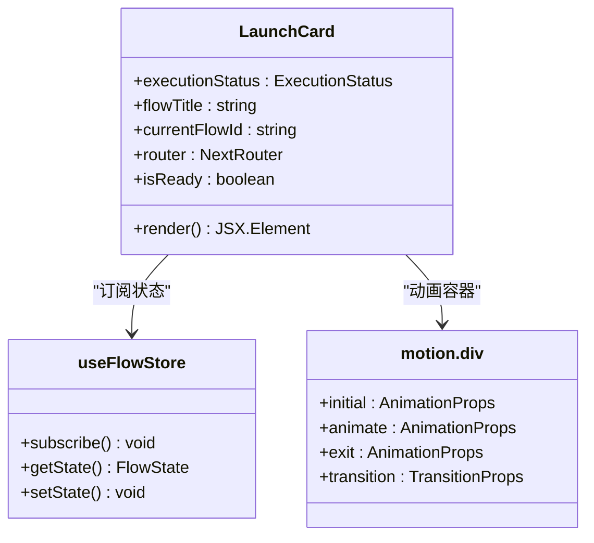

**图表来源**
- [LaunchCard.tsx](file://src/components/builder/LaunchCard.tsx#L8-L55)

### 状态订阅机制

组件通过`useFlowStore` Hook订阅全局状态变化，特别是`executionStatus`字段：

| 状态字段 | 类型 | 描述 | 触发条件 |
|---------|------|------|----------|
| executionStatus | ExecutionStatus | 工作流执行状态 | 运行中、完成、错误、空闲 |
| flowTitle | string | 流程标题 | 用户自定义或系统生成 |
| currentFlowId | string \| null | 当前流程ID | 流程创建或加载时设置 |

**章节来源**
- [LaunchCard.tsx](file://src/components/builder/LaunchCard.tsx#L9-L10)
- [flow.ts](file://src/types/flow.ts#L11)

### 显示逻辑控制

组件实现了基于状态的条件渲染逻辑：

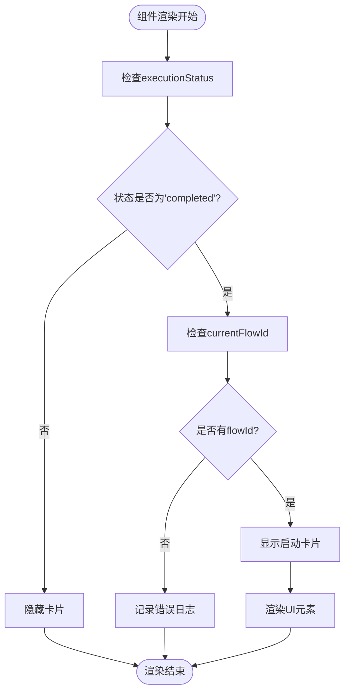

**图表来源**
- [LaunchCard.tsx](file://src/components/builder/LaunchCard.tsx#L14-L16)
- [executionActions.ts](file://src/store/actions/executionActions.ts#L23-L172)

**章节来源**
- [LaunchCard.tsx](file://src/components/builder/LaunchCard.tsx#L14-L16)
- [executionActions.ts](file://src/store/actions/executionActions.ts#L23-L172)

## 状态管理系统

### Zustand状态架构

Flash Flow采用Zustand作为状态管理解决方案，提供了类型安全和高性能的状态管理：

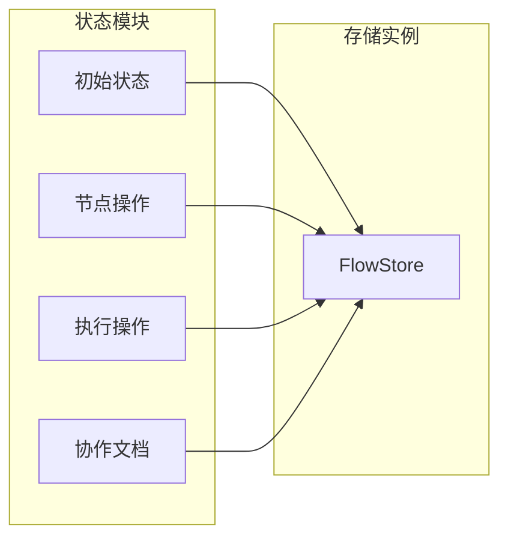

**图表来源**
- [flowStore.ts](file://src/store/flowStore.ts#L17-L127)

### 执行状态生命周期

工作流执行过程中的状态转换遵循严格的生命周期管理：

| 初始状态 | 转换条件 | 目标状态 | 处理逻辑 |
|---------|----------|----------|----------|
| idle | 开始执行 | running | 重置状态，设置运行标志 |
| running | 执行完成 | completed | 更新节点状态，设置最终状态 |
| running | 执行出错 | error | 记录错误信息，停止执行 |
| completed | 重置执行 | idle | 清空上下文，恢复初始状态 |

**章节来源**
- [executionActions.ts](file://src/store/actions/executionActions.ts#L8-L179)
- [flow.ts](file://src/types/flow.ts#L11)

### 状态更新机制

状态更新通过异步执行链实现，确保数据的一致性和可追踪性：

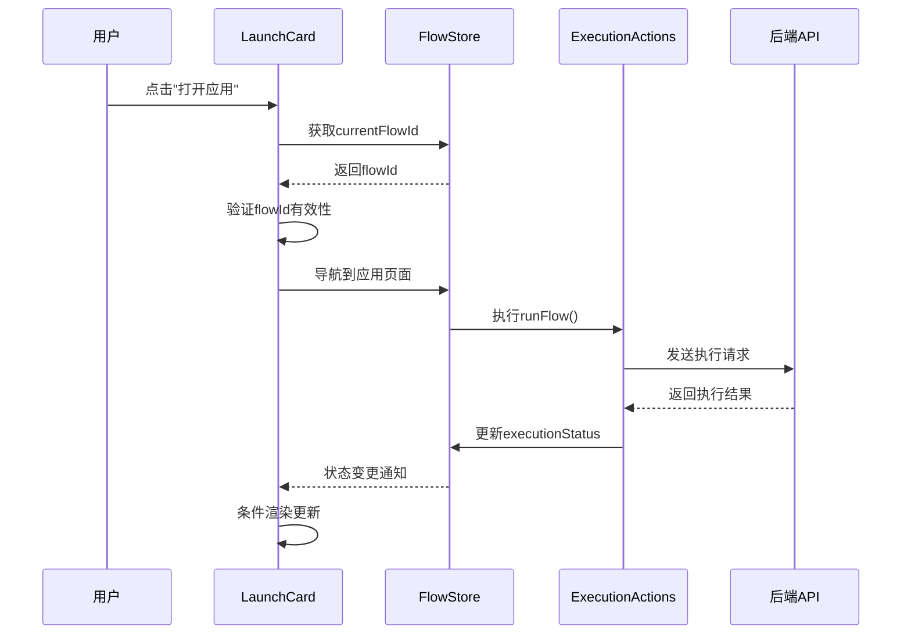

**图表来源**
- [LaunchCard.tsx](file://src/components/builder/LaunchCard.tsx#L39-L44)
- [executionActions.ts](file://src/store/actions/executionActions.ts#L23-L179)

**章节来源**
- [executionActions.ts](file://src/store/actions/executionActions.ts#L23-L179)

## 动画效果与用户体验

### Framer Motion动画实现

LaunchCard使用framer-motion库实现平滑的进入和退出动画效果：

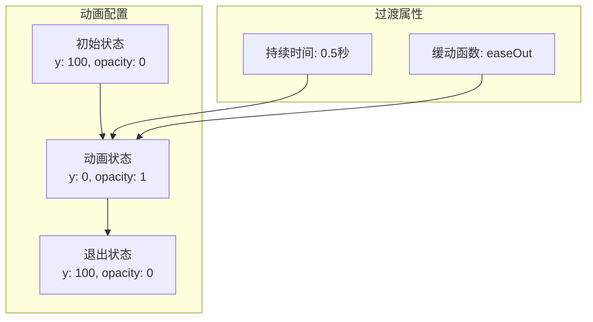

**图表来源**
- [LaunchCard.tsx](file://src/components/builder/LaunchCard.tsx#L21-L24)

### 动画触发机制

动画效果通过`AnimatePresence`组件实现，支持组件的挂载和卸载动画：

| 动画阶段 | 触发条件 | 动画属性 | 持续时间 |
|---------|----------|----------|----------|
| 入场动画 | isReady=true且组件首次渲染 | y: 100→0, opacity: 0→1 | 0.5秒 |
| 出场动画 | isReady=false且组件即将移除 | y: 0→100, opacity: 1→0 | 0.5秒 |
| 缓动函数 | 平滑过渡效果 | easeOut | 标准缓动 |

### 用户体验价值

动画效果为用户提供了以下体验价值：

1. **视觉反馈**：清晰的状态变化指示
2. **流畅过渡**：避免界面突变带来的不适感
3. **品牌一致性**：统一的动画风格提升产品质感
4. **信息层次**：通过动画突出重要信息

**章节来源**
- [LaunchCard.tsx](file://src/components/builder/LaunchCard.tsx#L18-L52)

## 页面导航机制

### Next.js路由集成

LaunchCard集成了Next.js的客户端路由功能，实现无刷新页面跳转：

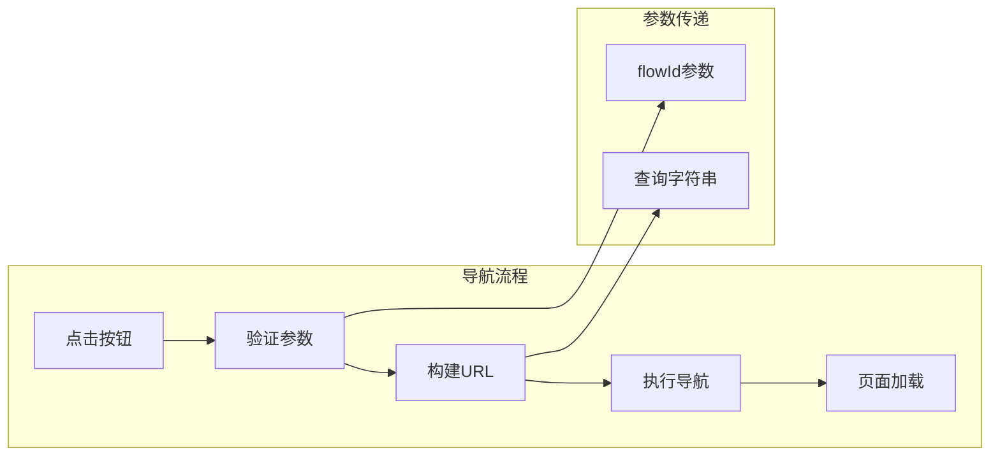

**图表来源**
- [LaunchCard.tsx](file://src/components/builder/LaunchCard.tsx#L40-L41)

### 路由参数处理

导航过程中涉及的关键参数和处理逻辑：

| 参数名称 | 类型 | 必需性 | 描述 | 处理方式 |
|---------|------|--------|------|----------|
| flowId | string | 必需 | 当前工作流标识符 | URL编码后附加到查询字符串 |
| initialPrompt | string | 可选 | 初始提示语 | 用于引导新流程创建 |

### 导航安全性

组件实现了多层安全检查以确保导航的可靠性：

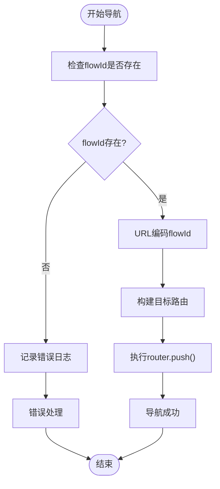

**图表来源**
- [LaunchCard.tsx](file://src/components/builder/LaunchCard.tsx#L40-L44)

**章节来源**
- [LaunchCard.tsx](file://src/components/builder/LaunchCard.tsx#L39-L44)
- [page.tsx](file://src/app/page.tsx#L14-L17)

## 界面层级管理

### Z-Index层级体系

Flash Flow采用集中化的z-index管理策略，确保界面元素的正确堆叠顺序：

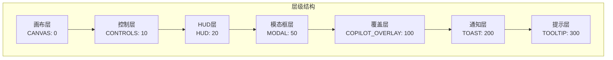

**图表来源**
- [zIndex.ts](file://src/lib/zIndex.ts#L6-L23)

### 固定定位策略

LaunchCard使用CSS固定定位实现悬浮卡片效果：

| 定位属性 | 值 | 作用 | 优势 |
|---------|-----|------|------|
| position | fixed | 相对于视口定位 | 不受滚动影响 |
| bottom | 8px | 距离底部8像素 | 避免遮挡主要内容 |
| right | 8px | 距离右侧8像素 | 便于用户操作 |
| z-index | 10 | 层级优先级 | 确保可见性 |

### 响应式适配

固定定位配合适当的内边距和尺寸设置，确保在不同屏幕尺寸下的可用性：

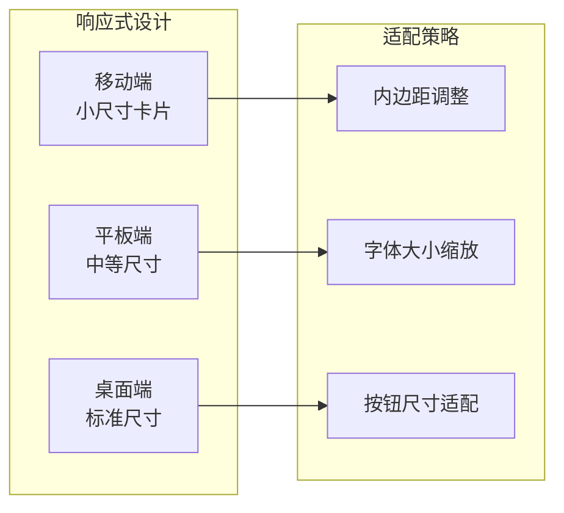

**章节来源**
- [zIndex.ts](file://src/lib/zIndex.ts#L6-L23)
- [LaunchCard.tsx](file://src/components/builder/LaunchCard.tsx#L25)

## 响应式设计模式

### 状态驱动UI更新

LaunchCard展示了现代React应用中典型的响应式设计模式：

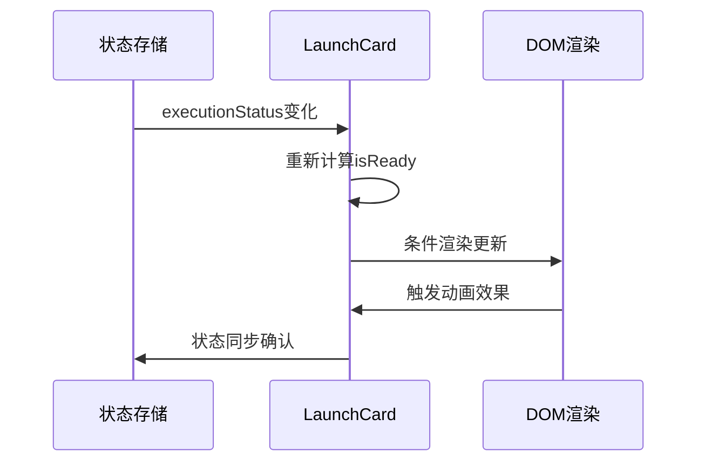

**图表来源**
- [LaunchCard.tsx](file://src/components/builder/LaunchCard.tsx#L9-L16)

### 数据流架构

组件遵循单向数据流原则，确保状态管理的可预测性：

| 数据流向 | 方向 | 组件 | 说明 |
|---------|------|------|------|
| 状态读取 | Store → Component | useFlowStore | 订阅状态变化 |
| 事件处理 | Component → Store | onClick回调 | 触发状态更新 |
| 视图渲染 | Store → DOM | React渲染器 | 自动更新UI |
| 用户交互 | DOM → Component | 事件监听 | 响应用户操作 |

### 性能优化策略

组件实现了多项性能优化措施：

1. **状态选择性订阅**：只订阅必要的状态字段
2. **条件渲染**：避免不必要的DOM更新
3. **动画优化**：使用CSS变换而非重排
4. **内存管理**：及时清理副作用

**章节来源**
- [LaunchCard.tsx](file://src/components/builder/LaunchCard.tsx#L9-L16)
- [flowStore.ts](file://src/store/flowStore.ts#L17-L127)

## 故障排除指南

### 常见问题诊断

| 问题症状 | 可能原因 | 解决方案 | 预防措施 |
|---------|----------|----------|----------|
| 卡片不显示 | executionStatus不是"completed" | 检查工作流执行状态 | 确保执行流程正常完成 |
| 导航失败 | currentFlowId为空 | 验证流程ID有效性 | 添加参数校验逻辑 |
| 动画异常 | framer-motion版本冲突 | 更新依赖包 | 使用兼容版本 |
| 层级问题 | z-index值冲突 | 调整层级顺序 | 使用预定义层级常量 |

### 调试技巧

1. **状态监控**：使用浏览器开发者工具检查状态变化
2. **网络检查**：验证API调用和路由导航
3. **动画调试**：启用framer-motion的调试模式
4. **性能分析**：监控组件渲染性能

### 错误处理机制

组件实现了多层次的错误处理：

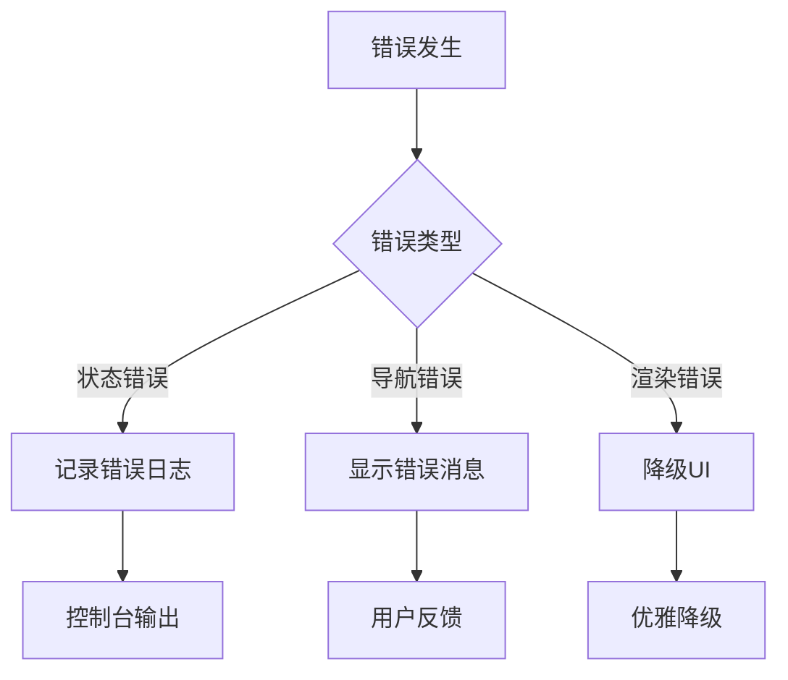

**章节来源**
- [LaunchCard.tsx](file://src/components/builder/LaunchCard.tsx#L43-L44)
- [executionActions.ts](file://src/store/actions/executionActions.ts#L173-L178)

## 总结

LaunchCard组件作为Flash Flow工作流执行控制的核心UI元素，展现了现代React应用开发的最佳实践。通过集成状态管理、动画效果、路由导航和层级管理等技术，实现了流畅的用户体验和可靠的系统行为。

### 关键技术亮点

1. **状态驱动架构**：基于Zustand的状态管理提供了类型安全和高性能
2. **动画用户体验**：framer-motion的应用提升了界面的交互质感
3. **响应式设计**：固定定位和层级管理确保了跨设备的可用性
4. **错误处理机制**：多层次的错误处理保证了系统的稳定性

### 架构设计优势

- **模块化设计**：清晰的职责分离便于维护和扩展
- **类型安全**：完整的TypeScript类型定义减少了运行时错误
- **性能优化**：合理的渲染策略和状态管理避免了性能瓶颈
- **可测试性**：独立的组件设计便于单元测试和集成测试

LaunchCard组件的成功实现为整个Flash Flow平台的用户体验奠定了坚实的基础，展示了如何在复杂的业务场景中构建高质量的前端组件。