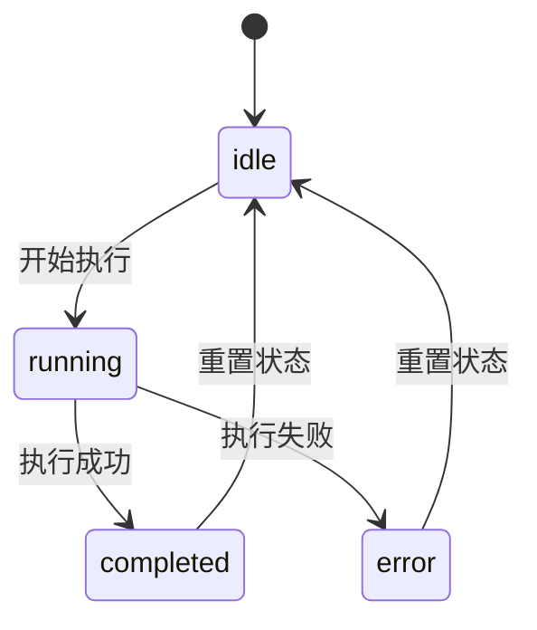
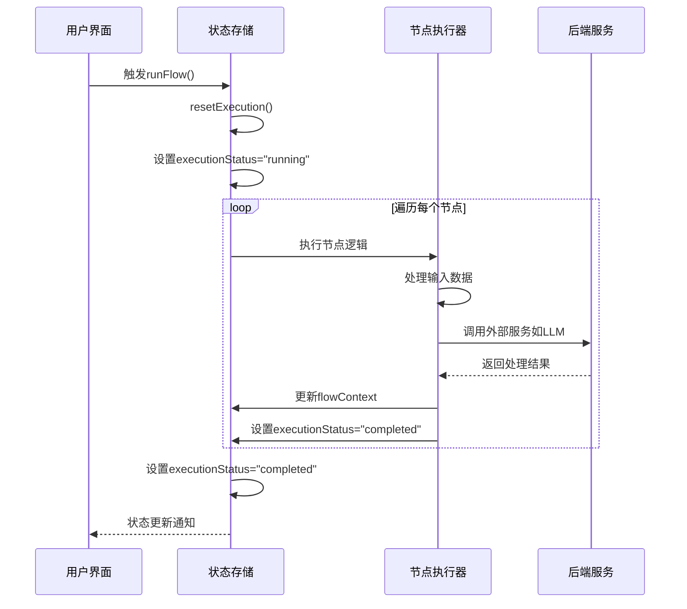
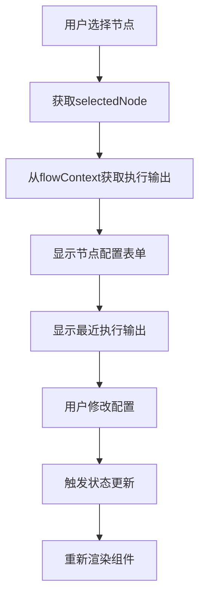
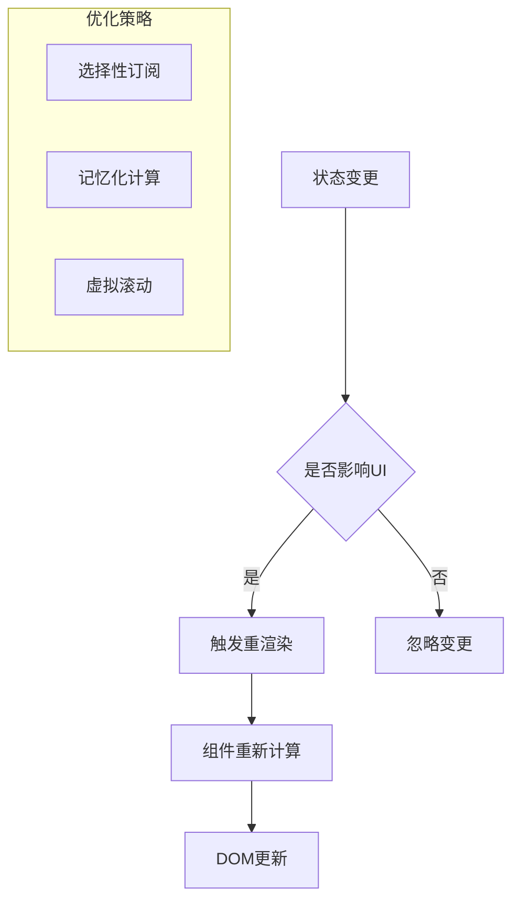
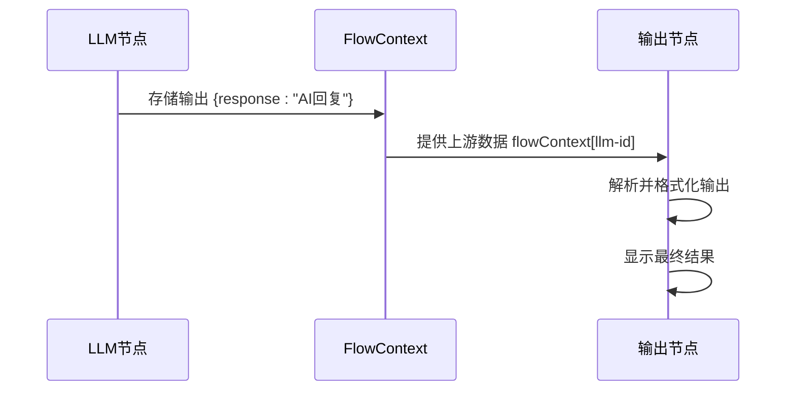

# 执行状态数据模型

<cite>
**本文档中引用的文件**
- [src/types/flow.ts](file://src/types/flow.ts)
- [src/store/constants/initialState.ts](file://src/store/constants/initialState.ts)
- [src/store/flowStore.ts](file://src/store/flowStore.ts)
- [src/store/actions/executionActions.ts](file://src/store/actions/executionActions.ts)
- [src/components/run/RunOutputs.tsx](file://src/components/run/RunOutputs.tsx)
- [src/components/builder/ContextHUD.tsx](file://src/components/builder/ContextHUD.tsx)
- [src/components/builder/AppModeOverlay.tsx](file://src/components/builder/AppModeOverlay.tsx)
</cite>

## 目录
1. [简介](#简介)
2. [核心数据结构](#核心数据结构)
3. [执行状态管理](#执行状态管理)
4. [FlowContext上下文机制](#flowcontext上下文机制)
5. [状态初始化配置](#状态初始化配置)
6. [UI层状态消费](#ui层状态消费)
7. [性能优化策略](#性能优化策略)
8. [实际应用示例](#实际应用示例)
9. [总结](#总结)

## 简介

Flash Flow SaaS平台的工作流执行状态数据模型是一个精心设计的状态管理系统，它通过FlowState接口统一管理整个工作流的执行状态、错误信息和节点上下文数据。该系统采用React状态管理模式，结合Zustand状态库，实现了高效的状态更新和UI响应机制。

核心设计理念包括：
- **类型安全**：通过TypeScript确保所有状态字段的类型正确性
- **状态隔离**：每个节点的执行状态独立管理
- **上下文传递**：通过FlowContext实现节点间的数据共享
- **性能优化**：支持选择性订阅提升渲染性能

## 核心数据结构

### ExecutionStatus联合类型

ExecutionStatus是工作流执行状态的核心枚举类型，定义了节点执行的三种基本状态：



**图表来源**
- [src/types/flow.ts](file://src/types/flow.ts#L11)

### FlowState接口结构

FlowState接口包含了工作流的所有状态信息，其中executionStatus、executionError和flowContext是最核心的三个字段：

| 字段名 | 类型 | 初始值 | 描述 |
|--------|------|--------|------|
| executionStatus | ExecutionStatus | "idle" | 当前执行状态（idle/running/completed/error） |
| executionError | string \| null | null | 执行过程中产生的错误信息 |
| flowContext | FlowContext | {} | 节点输出结果的键值对存储 |

**节来源**
- [src/types/flow.ts](file://src/types/flow.ts#L83-L106)
- [src/store/constants/initialState.ts](file://src/store/constants/initialState.ts#L19-L21)

### FlowContext索引签名

FlowContext采用索引签名设计，以节点ID作为键，存储该节点的输出结果：

```typescript
export interface FlowContext {
  [nodeId: string]: Record<string, unknown>;
}
```

这种设计的优势：
- **类型安全**：确保每个节点都有对应的输出对象
- **灵活扩展**：支持任意类型的输出数据
- **快速查找**：通过节点ID实现O(1)时间复杂度的访问

**节来源**
- [src/types/flow.ts](file://src/types/flow.ts#L79-L81)

## 执行状态管理

### 状态转换机制

工作流执行过程中的状态转换遵循严格的时序控制：



**图表来源**
- [src/store/actions/executionActions.ts](file://src/store/actions/executionActions.ts#L23-L179)

### 错误处理机制

系统提供了完善的错误处理机制，当执行过程中出现异常时：

1. **错误捕获**：在runFlow函数中使用try-catch块捕获异常
2. **状态更新**：将executionStatus设置为"error"
3. **错误信息存储**：将错误消息存储在executionError字段
4. **状态重置**：提供resetExecution方法重置所有状态

**节来源**
- [src/store/actions/executionActions.ts](file://src/store/actions/executionActions.ts#L173-L178)

## FlowContext上下文机制

### 节点间数据传递

FlowContext通过键值对的形式实现节点间的无缝数据传递：

```mermaid
graph LR
A[输入节点] --> |flowContext[input-id]| B[LLM节点]
B --> |flowContext[llm-id]| C[RAG节点]
C --> |flowContext[rag-id]| D[HTTP节点]
D --> |flowContext[http-id]| E[输出节点]
subgraph "FlowContext存储"
F["{nodeId: {outputData}}"]
end
```

**图表来源**
- [src/store/actions/executionActions.ts](file://src/store/actions/executionActions.ts#L47-L138)

### 输出数据标准化

不同类型的节点会生成标准化的输出格式：

| 节点类型 | 输出格式 | 示例 |
|----------|----------|------|
| Input | `{query: string, timestamp: string}` | `{query: "用户问题", timestamp: "2024-01-01T00:00:00Z"}` |
| LLM | `{response: string}` | `{response: "AI回复内容"}` |
| RAG | `{foundDocs: string[], input: object}` | `{foundDocs: ["文档1", "文档2"], input: {...}}` |
| HTTP | `{status: number, data: object}` | `{status: 200, data: {success: true}}` |
| Output | `{text: string}` | `{text: "最终输出内容"}` |

**节来源**
- [src/store/actions/executionActions.ts](file://src/store/actions/executionActions.ts#L67-L133)

### 上下文数据访问模式

UI组件通过以下模式访问FlowContext中的数据：

```typescript
// 在ContextHUD中访问节点执行输出
const executionOutput = flowContext[selectedNode.id];

// 在RunOutputs中显示输出节点数据
const outputData = flowContext[node.id];
```

**节来源**
- [src/components/builder/ContextHUD.tsx](file://src/components/builder/ContextHUD.tsx#L84)
- [src/components/run/RunOutputs.tsx](file://src/components/run/RunOutputs.tsx#L9)

## 状态初始化配置

### 初始状态设计原则

initialState.ts文件定义了工作流的初始状态，遵循以下设计原则：

1. **最小化原则**：只包含必要的初始状态
2. **一致性原则**：确保所有字段都有明确的初始值
3. **可扩展性原则**：为未来功能扩展预留空间

### 关键初始化字段

| 字段 | 初始值 | 说明 |
|------|--------|------|
| executionStatus | "idle" | 工作流处于空闲状态 |
| executionError | null | 初始无错误状态 |
| flowContext | {} | 空的上下文对象 |
| saveStatus | "saved" | 初始保存状态为已保存 |
| flowTitle | "Untitled Flow" | 默认的未命名工作流标题 |

**节来源**
- [src/store/constants/initialState.ts](file://src/store/constants/initialState.ts#L9-L31)

### 状态重置机制

resetExecution函数提供了完整的状态重置功能：

```typescript
resetExecution: () => {
    set((state: any) => ({
        executionStatus: "idle",
        executionError: null,
        flowContext: {},
        nodes: state.nodes.map((n: AppNode) => ({
            ...n,
            data: { ...n.data, status: "idle", executionTime: undefined, output: undefined }
        })),
    }));
},
```

**节来源**
- [src/store/actions/executionActions.ts](file://src/store/actions/executionActions.ts#L8-L17)

## UI层状态消费

### ContextHUD组件中的状态使用

ContextHUD组件展示了如何在UI中消费FlowContext和执行状态：



**图表来源**
- [src/components/builder/ContextHUD.tsx](file://src/components/builder/ContextHUD.tsx#L81-L108)

### RunOutputs组件的数据展示

RunOutputs组件负责展示工作流的输出结果：

```typescript
// 遍历所有输出节点
{outputNodes.map((node) => {
    const outputData = flowContext[node.id];
    const textData = (node.data as OutputNodeData).text;
    return (
        <div key={node.id}>
            {/* 显示输出内容 */}
            {textData ? textData : outputData ? JSON.stringify(outputData, null, 2) : "处理完成。"}
        </div>
    );
})}
```

**节来源**
- [src/components/run/RunOutputs.tsx](file://src/components/run/RunOutputs.tsx#L5-L24)

### 状态订阅模式

虽然当前代码没有显式使用选择性订阅，但系统架构支持通过Zustand的选择性订阅来优化性能：

```typescript
// 推荐的性能优化模式
const executionStatus = useFlowStore(state => state.executionStatus);
const flowContext = useFlowStore(state => state.flowContext);
```

## 性能优化策略

### 状态更新优化

1. **批量更新**：使用Zustand的批量更新机制减少不必要的重渲染
2. **浅比较**：利用Zustand的浅比较算法优化状态变化检测
3. **选择性订阅**：UI组件只订阅需要的状态字段

### 渲染性能优化



### 内存管理

1. **及时清理**：执行完成后及时清理flowContext中的历史数据
2. **状态压缩**：对于大型输出数据，考虑进行适当的压缩
3. **缓存策略**：合理使用缓存避免重复计算

## 实际应用示例

### 完整的工作流执行流程

以下是一个典型的工作流执行场景：

1. **准备阶段**：
   - 检查输入节点是否有有效数据
   - 如果有空输入节点，打开输入提示对话框

2. **执行阶段**：
   - 将executionStatus设置为"running"
   - 按拓扑顺序执行各个节点
   - 每个节点执行完成后更新flowContext

3. **完成阶段**：
   - 将executionStatus设置为"completed"
   - 在UI中显示最终的输出结果
   - 提供重置按钮让用户重新开始

### 错误处理示例

当执行过程中发生错误时：

```typescript
// 错误处理逻辑
catch (error) {
    console.error('Flow execution failed:', error);
    set({
        executionStatus: "error" as ExecutionStatus,
        executionError: error instanceof Error ? error.message : "Unknown error occurred"
    });
}
```

**节来源**
- [src/store/actions/executionActions.ts](file://src/store/actions/executionActions.ts#L173-L178)

### 节点间数据传递示例

以LLM节点到输出节点的数据传递为例：



**图表来源**
- [src/store/actions/executionActions.ts](file://src/store/actions/executionActions.ts#L110-L133)

## 总结

Flash Flow SaaS平台的工作流执行状态数据模型展现了现代前端应用中状态管理的最佳实践：

### 核心优势

1. **类型安全**：通过TypeScript确保类型正确性，减少运行时错误
2. **状态隔离**：每个节点的执行状态独立管理，避免状态污染
3. **高效传递**：FlowContext提供高效的节点间数据传递机制
4. **易于扩展**：模块化的设计便于添加新的节点类型和功能

### 设计亮点

- **ExecutionStatus枚举**：清晰定义了执行状态的转换规则
- **FlowContext索引签名**：灵活且类型安全的数据存储方案
- **Zustand集成**：轻量级状态管理，支持高性能的选择性订阅
- **错误处理机制**：完善的错误捕获和恢复机制

### 应用价值

该数据模型不仅支撑了Flash Flow平台的核心功能，也为类似的工作流系统提供了可参考的设计模式。通过合理的状态设计和性能优化，实现了既功能强大又用户体验良好的工作流编辑和执行系统。