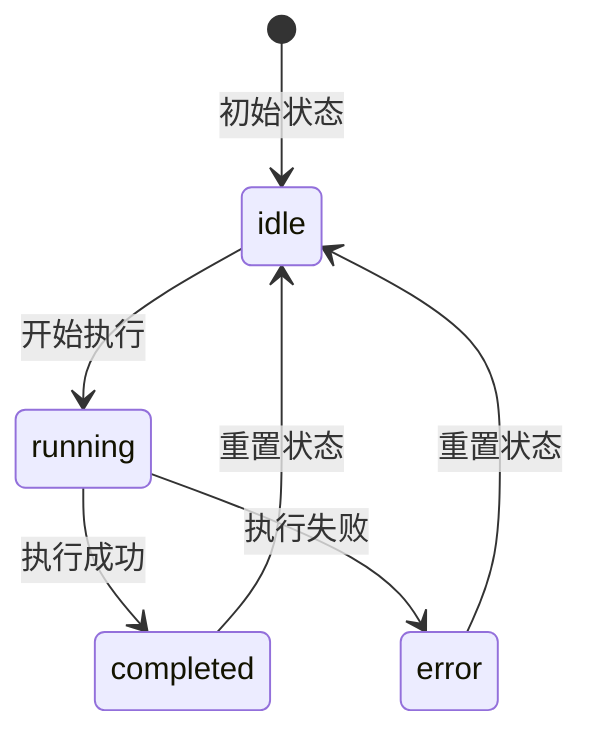
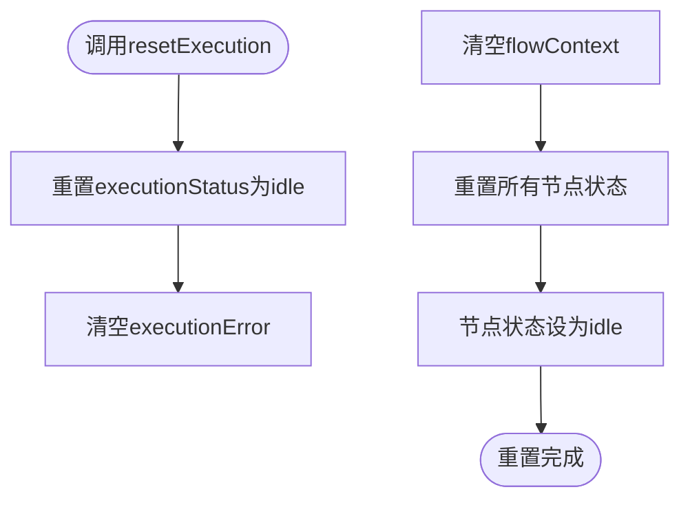
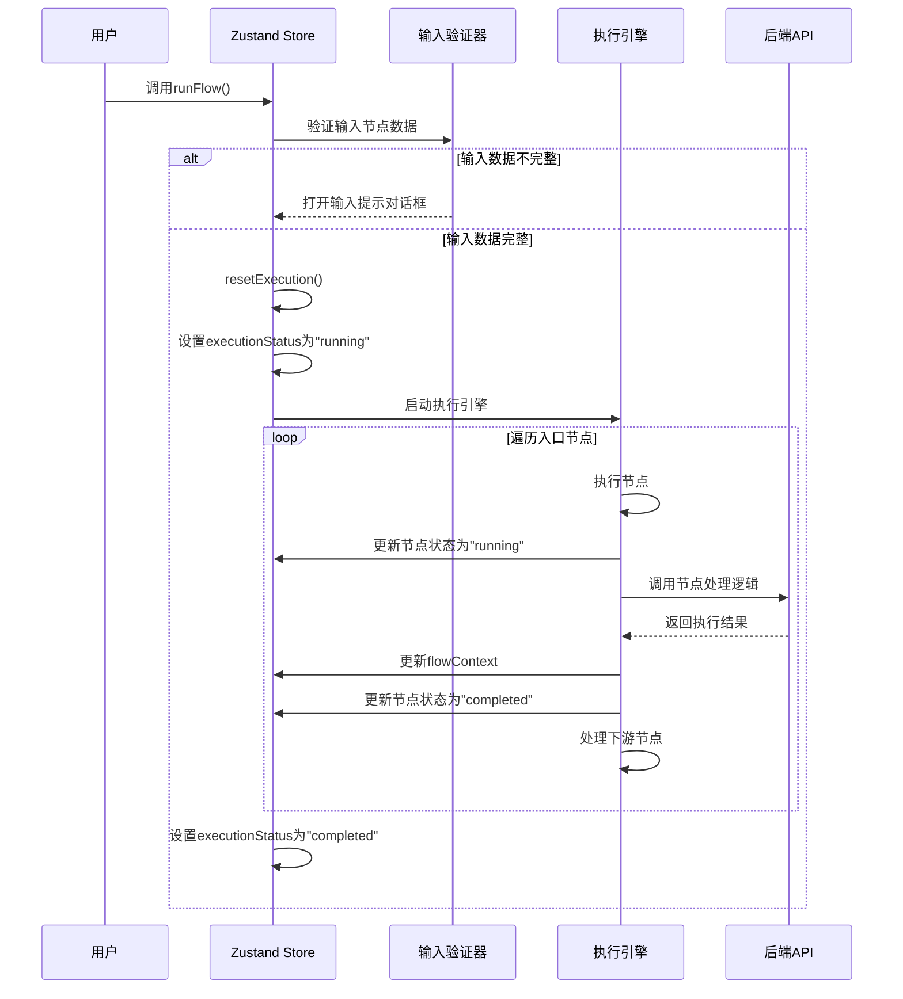
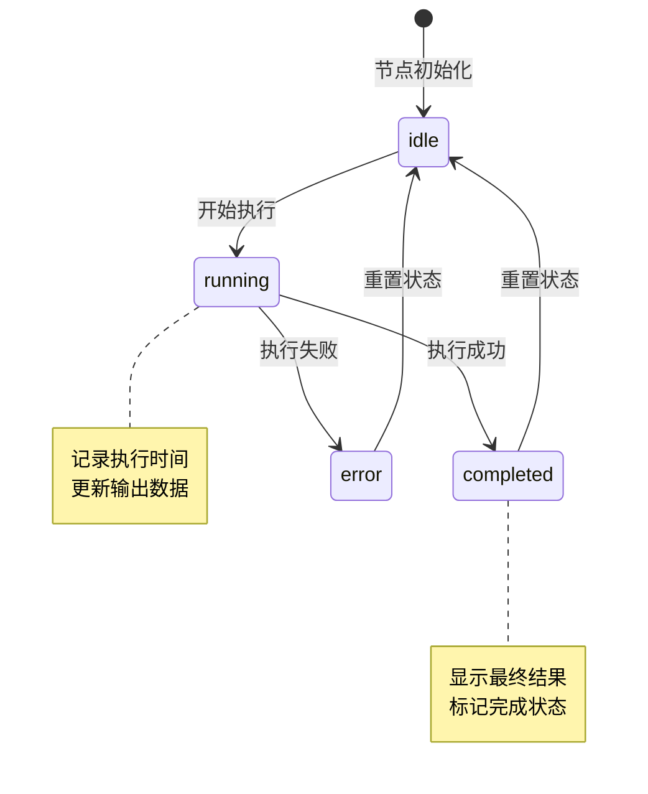
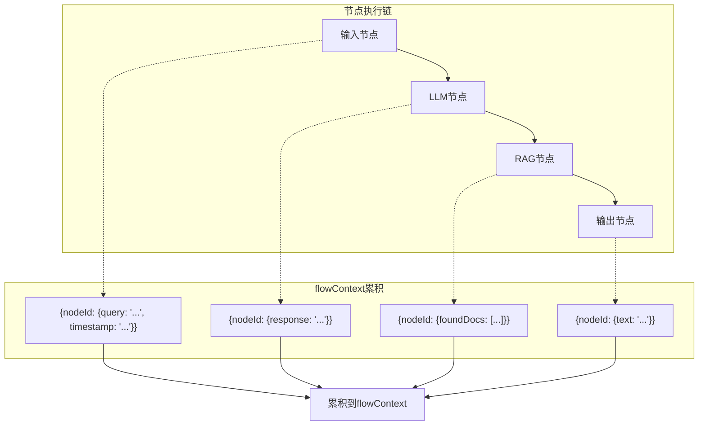
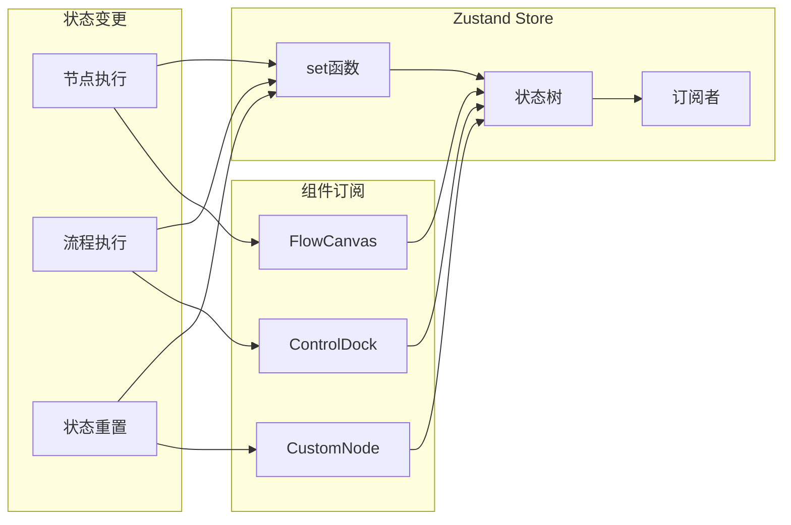
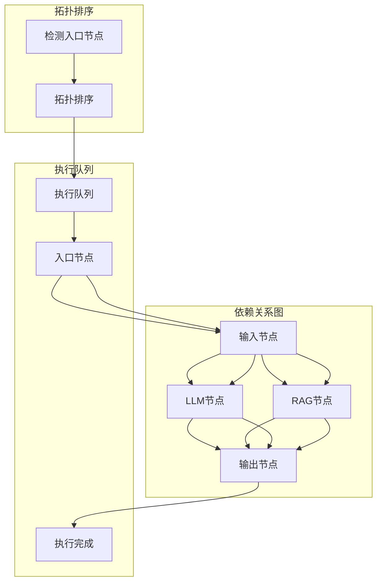
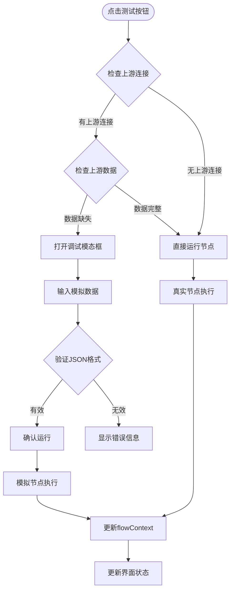
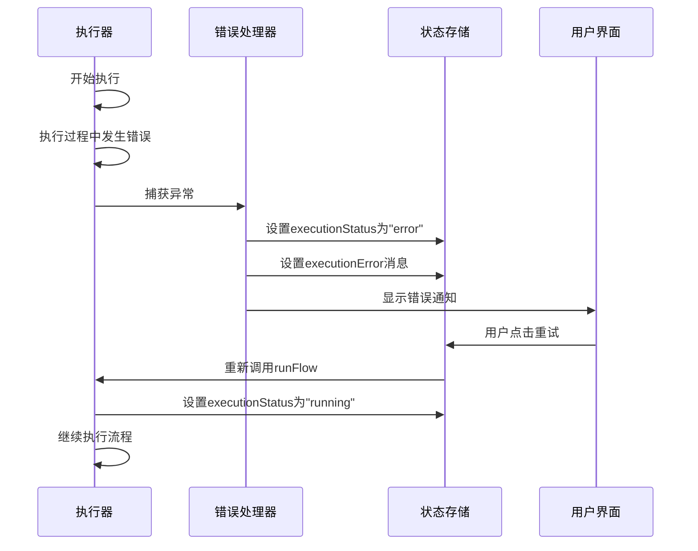

# 执行状态生命周期管理

<cite>
**本文档中引用的文件**
- [executionActions.ts](file://src/store/actions/executionActions.ts)
- [flow.ts](file://src/types/flow.ts)
- [flowStore.ts](file://src/store/flowStore.ts)
- [initialState.ts](file://src/store/constants/initialState.ts)
- [route.ts](file://src/app/api/run-node/route.ts)
- [NodeDebugDialog.tsx](file://src/components/flow/NodeDebugDialog.tsx)
- [ControlDock.tsx](file://src/components/builder/ControlDock.tsx)
- [CustomNode.tsx](file://src/components/flow/CustomNode.tsx)
</cite>

## 目录
1. [概述](#概述)
2. [执行状态类型定义](#执行状态类型定义)
3. [状态重置机制](#状态重置机制)
4. [流程执行核心逻辑](#流程执行核心逻辑)
5. [节点执行状态管理](#节点执行状态管理)
6. [flowContext上下文管理](#flowcontext上下文管理)
7. [Zustand响应式更新机制](#zustand响应式更新机制)
8. [异步执行队列与拓扑排序](#异步执行队列与拓扑排序)
9. [调试模式下的状态流转](#调试模式下的状态流转)
10. [错误处理与状态恢复](#错误处理与状态恢复)
11. [总结](#总结)

## 概述

Flash Flow SaaS系统采用基于Zustand的状态管理方案，实现了复杂的工作流执行状态生命周期管理。系统通过精心设计的状态流转机制，确保工作流从启动到完成的每个阶段都能得到准确跟踪和响应式更新。

执行状态管理系统的核心特点包括：
- **状态类型安全**：使用TypeScript确保状态类型的正确性
- **响应式更新**：基于Zustand的set机制实现组件级响应式更新
- **异步执行控制**：支持复杂的异步执行队列和拓扑排序
- **调试友好**：提供完整的调试模式支持
- **错误恢复**：完善的错误处理和状态恢复机制

## 执行状态类型定义

系统定义了四种核心执行状态，每种状态都有明确的语义和转换规则：

**图表来源**
- [flow.ts](file://src/types/flow.ts#L11)

### 状态类型详解

| 状态 | 类型 | 描述 | 触发条件 |
|------|------|------|----------|
| `idle` | `"idle"` | 空闲状态，初始状态 | 应用启动或执行完成后 |
| `running` | `"running"` | 正在执行状态 | 开始执行工作流时 |
| `completed` | `"completed"` | 执行完成状态 | 工作流成功执行完毕 |
| `error` | `"error"` | 错误状态 | 执行过程中发生异常 |

**章节来源**
- [flow.ts](file://src/types/flow.ts#L11)

## 状态重置机制

resetExecution函数是整个执行状态管理的基础，它负责将所有相关状态重置到初始状态：

**图表来源**
- [executionActions.ts](file://src/store/actions/executionActions.ts#L8-L17)

### 重置过程详解

resetExecution函数通过Zustand的set机制实现批量状态重置：

1. **全局状态重置**：将executionStatus设为"idle"，清空executionError
2. **上下文清理**：清空flowContext对象，移除所有历史执行数据
3. **节点状态重置**：遍历所有节点，将其状态重置为"idle"，清除执行时间和输出结果

这种设计确保了每次新的执行开始前，系统都处于干净的初始状态。

**章节来源**
- [executionActions.ts](file://src/store/actions/executionActions.ts#L8-L17)

## 流程执行核心逻辑

runFlow函数是工作流执行的核心入口，它实现了完整的执行流程控制：

**图表来源**
- [executionActions.ts](file://src/store/actions/executionActions.ts#L23-L179)

### 输入验证机制

系统在执行前会进行严格的输入验证：

1. **输入节点识别**：过滤出所有类型为"input"的节点
2. **数据完整性检查**：验证每个输入节点的text字段是否为空
3. **交互式处理**：当发现空输入时，自动打开输入提示对话框

这种设计避免了因缺少必要输入而导致的执行失败。

**章节来源**
- [executionActions.ts](file://src/store/actions/executionActions.ts#L23-L37)

## 节点执行状态管理

每个节点在执行过程中都会经历状态变化，系统通过精确的状态管理确保执行的可追踪性：

**图表来源**
- [executionActions.ts](file://src/store/actions/executionActions.ts#L53-L154)

### 节点状态更新机制

节点状态更新通过以下步骤实现：

1. **状态变更**：在executeNode函数中，首先将节点状态更新为"running"
2. **执行模拟**：根据节点类型模拟不同的执行时间
3. **结果处理**：根据节点类型执行相应的业务逻辑
4. **状态持久化**：将最终状态更新为"completed"，包含执行时间和输出结果

**章节来源**
- [executionActions.ts](file://src/store/actions/executionActions.ts#L49-L170)

## flowContext上下文管理

flowContext是系统的核心上下文管理机制，它动态累积各节点的执行输出：

**图表来源**
- [executionActions.ts](file://src/store/actions/executionActions.ts#L47-L138)

### 上下文累积策略

flowContext采用键值对结构存储节点输出：

| 节点类型 | 输出格式 | 示例 |
|----------|----------|------|
| `input` | `{query: string, timestamp: string}` | `{query: "用户查询", timestamp: "2024-01-01T00:00:00Z"}` |
| `llm` | `{response: string}` | `{response: "AI回复内容"}` |
| `rag` | `{foundDocs: string[], input?: unknown}` | `{foundDocs: ["文档1", "文档2"]}` |
| `http` | `{status: number, data: object}` | `{status: 200, data: {success: true}}` |
| `output` | `{text: string}` | `{text: "最终输出文本"}` |

**章节来源**
- [executionActions.ts](file://src/store/actions/executionActions.ts#L65-L138)

## Zustand响应式更新机制

系统基于Zustand的set机制实现跨组件的响应式状态更新：

**图表来源**
- [flowStore.ts](file://src/store/flowStore.ts#L17-L29)

### 响应式更新策略

1. **细粒度更新**：只更新发生变化的部分，避免不必要的重新渲染
2. **批量操作**：在复杂操作中使用函数式更新减少更新次数
3. **异步更新**：配合异步执行流程，确保状态更新时机正确

**章节来源**
- [executionActions.ts](file://src/store/actions/executionActions.ts#L53-L154)

## 异步执行队列与拓扑排序

系统采用拓扑排序算法确保节点按正确的依赖顺序执行：

**图表来源**
- [executionActions.ts](file://src/store/actions/executionActions.ts#L43-L170)

### 执行队列管理

1. **入口节点识别**：通过反向查找确定没有输入边的节点作为入口
2. **访问标记**：使用visited集合防止重复执行
3. **递归执行**：执行完当前节点后，递归处理其所有下游节点

**章节来源**
- [executionActions.ts](file://src/store/actions/executionActions.ts#L43-L170)

## 调试模式下的状态流转

系统提供了强大的调试功能，允许开发者在隔离环境中测试单个节点：

**图表来源**
- [executionActions.ts](file://src/store/actions/executionActions.ts#L185-L289)
- [NodeDebugDialog.tsx](file://src/components/flow/NodeDebugDialog.tsx#L20-L28)

### 调试模式特性

1. **智能检测**：自动检测节点是否有上游依赖
2. **数据验证**：严格验证模拟数据的JSON格式
3. **隔离执行**：调试模式不影响主执行流程
4. **实时反馈**：提供即时的错误提示和成功确认

**章节来源**
- [executionActions.ts](file://src/store/actions/executionActions.ts#L185-L289)
- [NodeDebugDialog.tsx](file://src/components/flow/NodeDebugDialog.tsx#L1-L69)

## 错误处理与状态恢复

系统实现了完善的错误处理机制，确保执行失败时能够正确恢复：

**图表来源**
- [executionActions.ts](file://src/store/actions/executionActions.ts#L173-L179)
- [ControlDock.tsx](file://src/components/builder/ControlDock.tsx#L35-L51)

### 错误处理策略

1. **异常捕获**：在runFlow函数的try-catch块中捕获所有异常
2. **状态标记**：将executionStatus设为"error"，记录错误信息
3. **用户通知**：通过UI组件显示错误信息和重试选项
4. **优雅恢复**：提供重置和重试机制，让用户可以重新开始执行

**章节来源**
- [executionActions.ts](file://src/store/actions/executionActions.ts#L173-L179)
- [ControlDock.tsx](file://src/components/builder/ControlDock.tsx#L35-L51)

## 总结

Flash Flow SaaS的执行状态生命周期管理是一个精心设计的系统，具有以下核心优势：

### 技术架构优势

1. **类型安全**：完整的TypeScript类型定义确保状态操作的安全性
2. **响应式设计**：基于Zustand的高效状态管理，实现组件级的精确更新
3. **异步支持**：完善的异步执行队列和拓扑排序算法
4. **调试友好**：内置的调试模式支持开发和测试需求

### 可维护性特点

1. **模块化设计**：执行动作独立封装，便于维护和扩展
2. **清晰的职责分离**：状态管理、业务逻辑、UI交互各司其职
3. **完善的错误处理**：多层次的错误捕获和恢复机制

### 用户体验优化

1. **直观的状态反馈**：实时的状态变化反映执行进度
2. **智能的输入验证**：提前发现并解决输入问题
3. **灵活的调试工具**：支持单节点调试和模拟数据输入

这套执行状态生命周期管理系统为Flash Flow SaaS提供了稳定可靠的工作流执行能力，是整个应用架构的重要基石。