# 执行状态管理

<cite>
**本文档引用的文件**
- [flowStore.ts](file://src/store/flowStore.ts)
- [flow.ts](file://src/types/flow.ts)
- [initialState.ts](file://src/store/constants/initialState.ts)
- [executionActions.ts](file://src/store/actions/executionActions.ts)
- [CustomNode.tsx](file://src/components/flow/CustomNode.tsx)
- [ControlDock.tsx](file://src/components/builder/ControlDock.tsx)
- [ContextHUD.tsx](file://src/components/builder/ContextHUD.tsx)
- [NodeDebugDialog.tsx](file://src/components/flow/NodeDebugDialog.tsx)
- [RunOutputs.tsx](file://src/components/run/RunOutputs.tsx)
- [AppModeOverlay.tsx](file://src/components/builder/AppModeOverlay.tsx)
</cite>

## 目录
1. [概述](#概述)
2. [核心状态结构](#核心状态结构)
3. [执行状态生命周期](#执行状态生命周期)
4. [Zustand状态管理架构](#zustand状态管理架构)
5. [节点状态管理](#节点状态管理)
6. [flowContext数据传递机制](#flowcontext数据传递机制)
7. [错误处理与调试](#错误处理与调试)
8. [状态同步与UI更新](#状态同步与ui更新)
9. [实际应用场景](#实际应用场景)
10. [总结](#总结)

## 概述

Flash Flow的工作流执行状态管理系统是一个基于Zustand的状态管理解决方案，负责协调整个工作流的执行过程。该系统通过FlowState接口定义了核心状态结构，包括executionStatus、executionError、flowContext等关键字段，实现了从节点创建到执行完成的全生命周期状态管理。

系统采用事件驱动的方式，通过拓扑排序算法确保节点按照正确的依赖关系顺序执行，并通过Zustand store实现跨组件的状态同步。flowContext作为数据传递的核心机制，存储每个节点的输出结果，支持复杂的数据流转和依赖关系管理。

## 核心状态结构

### FlowState接口设计

FlowState是整个状态管理系统的根接口，定义了工作流应用的所有核心状态字段：

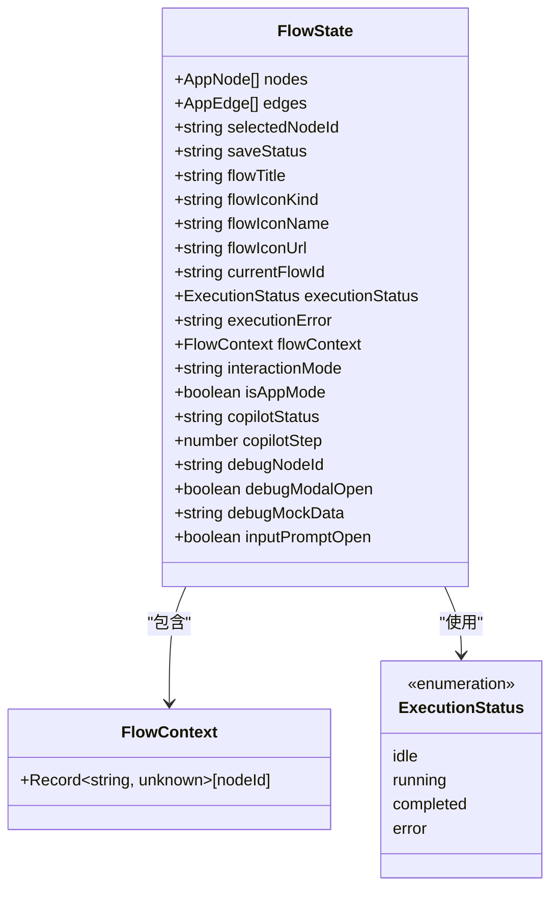

**图表来源**
- [flow.ts](file://src/types/flow.ts#L83-L107)
- [flow.ts](file://src/types/flow.ts#L79-L81)

### 关键状态字段详解

#### executionStatus字段
executionStatus是工作流执行状态的核心标识，具有以下四种状态：

| 状态值 | 描述 | 触发条件 |
|--------|------|----------|
| idle | 空闲状态 | 工作流未开始执行或已重置 |
| running | 运行中 | 开始执行工作流时设置 |
| completed | 执行完成 | 所有节点成功执行完毕 |
| error | 执行出错 | 执行过程中发生异常 |

#### executionError字段
executionError用于存储执行过程中的错误信息，当executionStatus为"error"时有效：

```typescript
// 错误信息格式化示例
interface ExecutionError {
    timestamp: number;
    message: string;
    nodeId?: string;
    stackTrace?: string;
}
```

#### flowContext字段
flowContext是一个映射表，存储每个节点的执行输出结果：

```typescript
interface FlowContext {
    [nodeId: string]: Record<string, unknown>;
}
```

**节来源**
- [flow.ts](file://src/types/flow.ts#L83-L107)
- [initialState.ts](file://src/store/constants/initialState.ts#L19-L21)

## 执行状态生命周期

### 工作流执行流程

工作流的执行遵循严格的生命周期管理，通过拓扑排序确保节点按正确顺序执行：

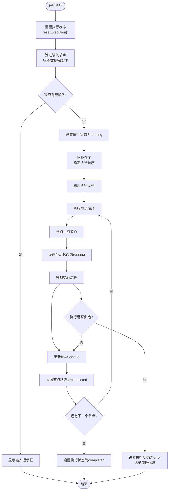

**图表来源**
- [executionActions.ts](file://src/store/actions/executionActions.ts#L23-L170)

### 节点执行状态转换

每个节点在其生命周期内会经历以下状态转换：

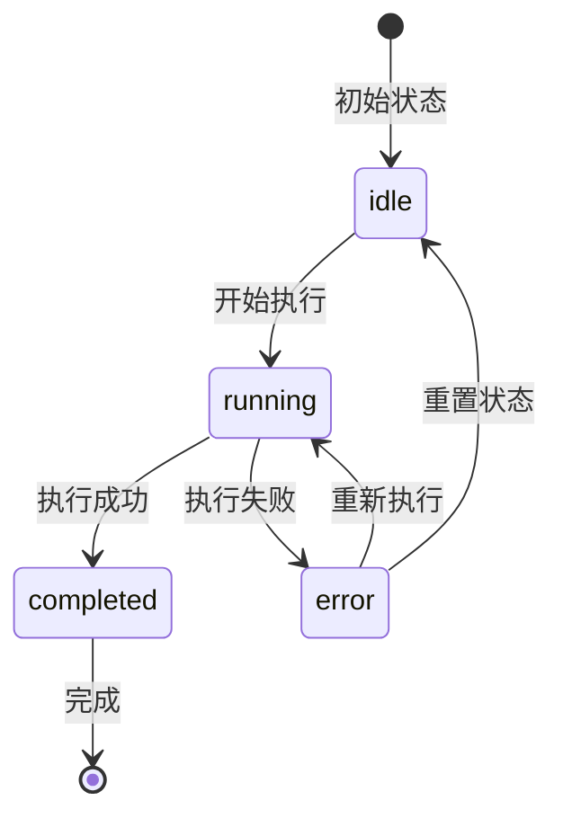

**图表来源**
- [executionActions.ts](file://src/store/actions/executionActions.ts#L49-L170)

**节来源**
- [executionActions.ts](file://src/store/actions/executionActions.ts#L23-L170)

## Zustand状态管理架构

### Store初始化与结构

Zustand store通过create函数创建，集成了所有必要的状态管理功能：

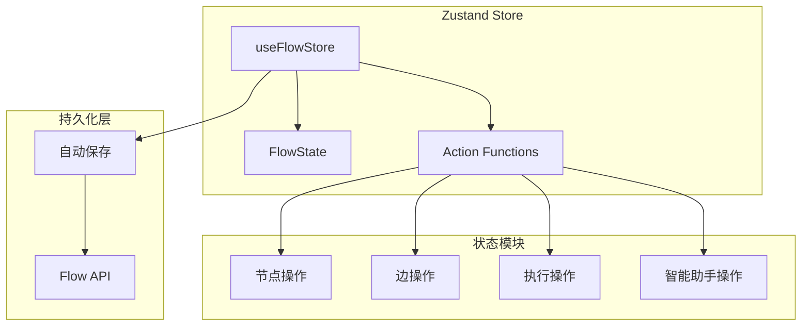

**图表来源**
- [flowStore.ts](file://src/store/flowStore.ts#L17-L127)

### 状态更新机制

Zustand采用不可变更新模式，通过set函数批量更新状态：

```typescript
// 状态更新示例
set((state: any) => ({
    executionStatus: "running",
    executionError: null,
    nodes: state.nodes.map((n: AppNode) => 
        n.id === nodeId ? { ...n, data: { ...n.data, status: "running" } } : n
    )
}));
```

**节来源**
- [flowStore.ts](file://src/store/flowStore.ts#L17-L127)

## 节点状态管理

### 节点状态渲染系统

系统通过CustomNode组件实现节点状态的可视化展示：

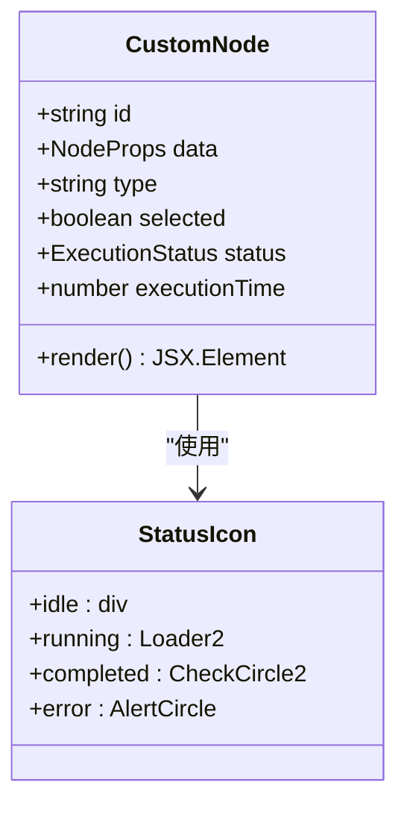

**图表来源**
- [CustomNode.tsx](file://src/components/flow/CustomNode.tsx#L20-L25)

### 状态图标映射

不同执行状态对应不同的视觉图标：

| 状态 | 图标 | 颜色 | 动画效果 |
|------|------|------|----------|
| idle | 圆点 | 灰色 | 无 |
| running | 加载动画 | 蓝色 | 旋转 |
| completed | 对勾 | 绿色 | 静态 |
| error | 警告 | 红色 | 静态 |

### 节点交互逻辑

节点提供了智能的测试功能，根据上游数据可用性决定执行方式：

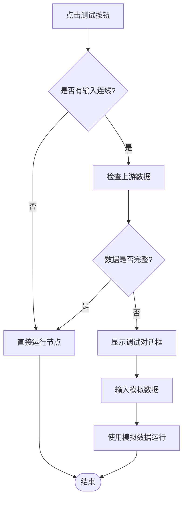

**图表来源**
- [CustomNode.tsx](file://src/components/flow/CustomNode.tsx#L84-L104)

**节来源**
- [CustomNode.tsx](file://src/components/flow/CustomNode.tsx#L20-L25)
- [CustomNode.tsx](file://src/components/flow/CustomNode.tsx#L84-L104)

## flowContext数据传递机制

### 数据存储结构

flowContext采用节点ID到输出数据的映射结构，支持任意类型的数据存储：

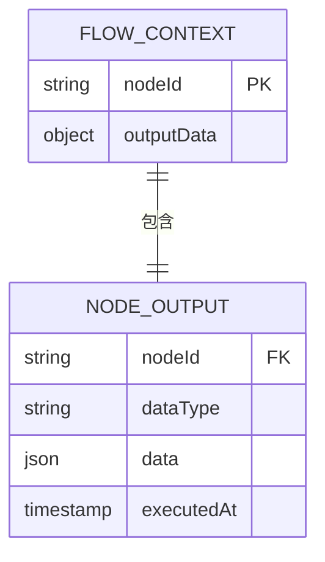

**图表来源**
- [flow.ts](file://src/types/flow.ts#L79-L81)

### 数据流向管理

系统通过拓扑排序确保数据按依赖关系正确传递：

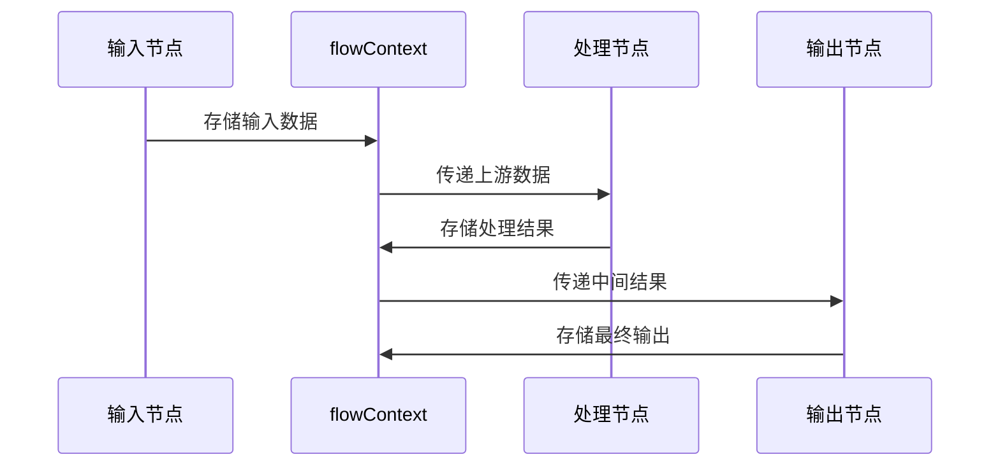

**图表来源**
- [executionActions.ts](file://src/store/actions/executionActions.ts#L136-L138)

### 输出节点数据处理

输出节点特殊处理来自上游的数据，优先提取有意义的字段：

```typescript
// 输出节点数据提取逻辑
if (typeof prevOut === 'string') {
    text = prevOut as string;
} else if (prevOut && typeof prevOut === 'object') {
    const prevObj = prevOut as Record<string, unknown>;
    const response = prevObj['response'];
    const textField = prevObj['text'];
    const queryField = prevObj['query'];
    const maybeText = typeof response === 'string'
        ? response
        : typeof textField === 'string'
            ? textField
            : typeof queryField === 'string'
                ? queryField
                : undefined;
    text = typeof maybeText === 'string' ? maybeText : JSON.stringify(prevObj);
}
```

**节来源**
- [executionActions.ts](file://src/store/actions/executionActions.ts#L110-L134)
- [RunOutputs.tsx](file://src/components/run/RunOutputs.tsx#L8-L25)

## 错误处理与调试

### 错误检测机制

系统在多个层面实现错误检测和处理：

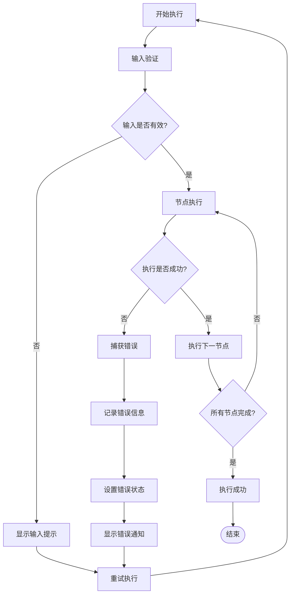

**图表来源**
- [executionActions.ts](file://src/store/actions/executionActions.ts#L173-L178)
- [ControlDock.tsx](file://src/components/builder/ControlDock.tsx#L35-L51)

### 调试模态框系统

当节点依赖缺失时，系统自动弹出调试对话框：

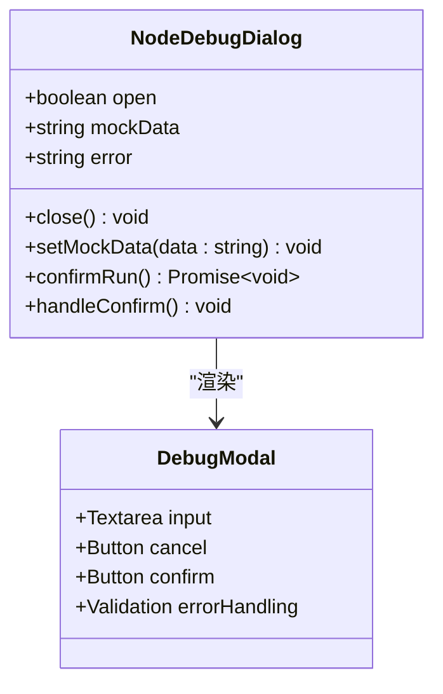

**图表来源**
- [NodeDebugDialog.tsx](file://src/components/flow/NodeDebugDialog.tsx#L9-L68)

### 错误恢复策略

系统提供多种错误恢复机制：

| 错误类型 | 恢复策略 | 用户操作 |
|----------|----------|----------|
| 输入缺失 | 显示输入提示框 | 填写必要输入 |
| 数据格式错误 | 显示调试对话框 | 提供模拟数据 |
| 执行超时 | 自动重试机制 | 等待或手动重试 |
| 系统错误 | 显示错误通知 | 查看错误详情 |

**节来源**
- [executionActions.ts](file://src/store/actions/executionActions.ts#L173-L178)
- [ControlDock.tsx](file://src/components/builder/ControlDock.tsx#L35-L51)
- [NodeDebugDialog.tsx](file://src/components/flow/NodeDebugDialog.tsx#L9-L68)

## 状态同步与UI更新

### 实时状态监听

系统通过React hooks实现状态变化的实时响应：

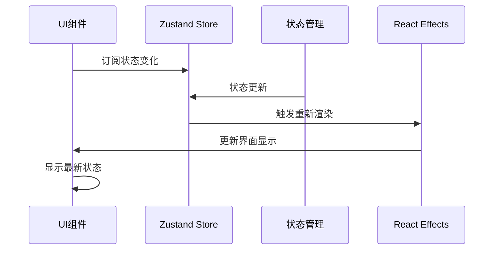

**图表来源**
- [ControlDock.tsx](file://src/components/builder/ControlDock.tsx#L35-L40)

### 状态变化响应

关键状态变化触发相应的UI更新：

```typescript
// 执行状态变化监听
useEffect(() => {
    if (executionStatus === "error" && executionError) {
        setShowError(true);
    }
}, [executionStatus, executionError]);

// 节点状态变化监听
useEffect(() => {
    if (executionStatus === "completed" && isLoading) {
        setIsLoading(false);
        // 更新输出显示
    }
}, [executionStatus, flowContext, nodes, isLoading]);
```

### 性能优化策略

系统采用多种性能优化技术：

1. **React.memo优化**：防止不必要的重新渲染
2. **状态分片**：只订阅需要的状态部分
3. **批量更新**：减少状态更新频率
4. **防抖处理**：避免频繁的自动保存

**节来源**
- [ControlDock.tsx](file://src/components/builder/ControlDock.tsx#L35-L51)
- [AppModeOverlay.tsx](file://src/components/builder/AppModeOverlay.tsx#L25-L48)

## 实际应用场景

### 工作流执行场景

#### 场景一：简单文本处理流程
1. **输入节点**接收用户文本
2. **LLM节点**进行文本分析
3. **输出节点**展示处理结果

#### 场景二：复杂数据分析流程
1. **输入节点**加载数据源
2. **RAG节点**检索相关信息
3. **HTTP节点**调用外部API
4. **LLM节点**生成分析报告
5. **输出节点**展示最终结果

#### 场景三：错误处理与调试
1. **节点依赖检查**发现上游数据缺失
2. **调试对话框**提供模拟数据输入
3. **模拟执行**验证节点逻辑
4. **错误修复**完成后正常执行

### 数据流转示例

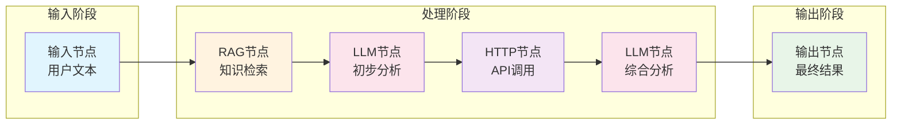

### 状态监控面板

系统提供详细的执行状态监控：

| 监控指标 | 显示位置 | 更新频率 |
|----------|----------|----------|
| 全局执行状态 | 控制面板 | 实时 |
| 当前执行节点 | 节点状态栏 | 实时 |
| 执行时间统计 | 节点卡片 | 实时 |
| 错误信息 | 错误通知 | 实时 |
| 上下文数据 | 右侧面板 | 实时 |

**节来源**
- [ContextHUD.tsx](file://src/components/builder/ContextHUD.tsx#L81-L128)
- [ControlDock.tsx](file://src/components/builder/ControlDock.tsx#L24-L51)

## 总结

Flash Flow的工作流执行状态管理系统通过精心设计的架构实现了高效、可靠的状态管理。系统的核心优势包括：

### 技术特点
1. **类型安全**：完整的TypeScript类型定义确保类型安全
2. **状态隔离**：清晰的状态边界和职责分离
3. **性能优化**：React.memo和状态分片优化渲染性能
4. **错误处理**：多层次的错误检测和恢复机制

### 架构优势
1. **可扩展性**：模块化的状态管理便于功能扩展
2. **可维护性**：清晰的代码结构和注释便于维护
3. **用户体验**：实时的状态反馈和直观的错误提示
4. **调试友好**：完善的调试工具和模拟数据支持

### 应用价值
该状态管理系统不仅支撑了Flash Flow的核心功能，还为类似的工作流平台提供了优秀的参考架构。通过Zustand的轻量级设计和React Hooks的声明式编程范式，系统实现了复杂状态管理的简化和优化。

这种设计模式特别适用于需要实时状态同步、复杂数据流转和强大错误处理能力的应用场景，为现代Web应用的状态管理提供了宝贵的实践经验。