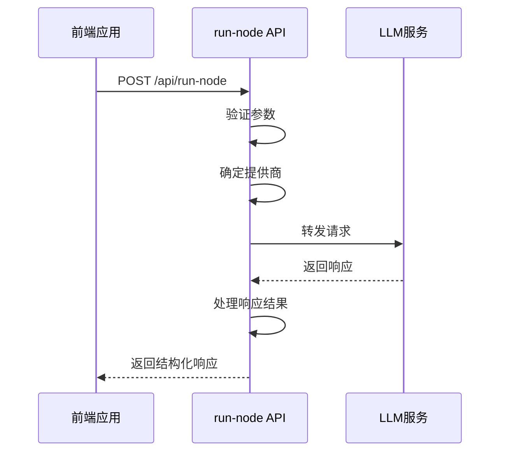
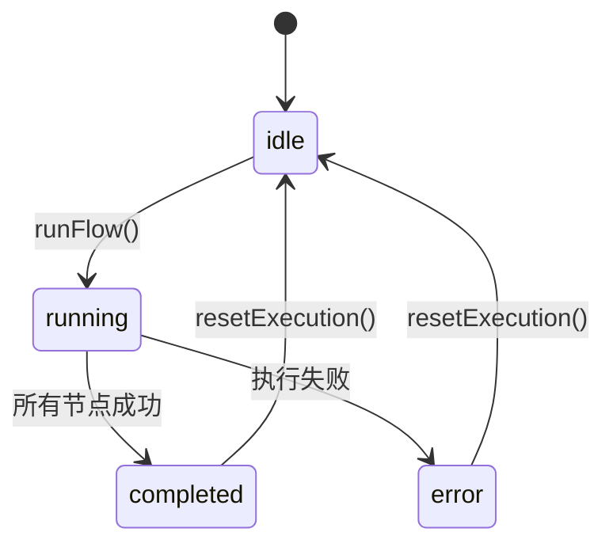
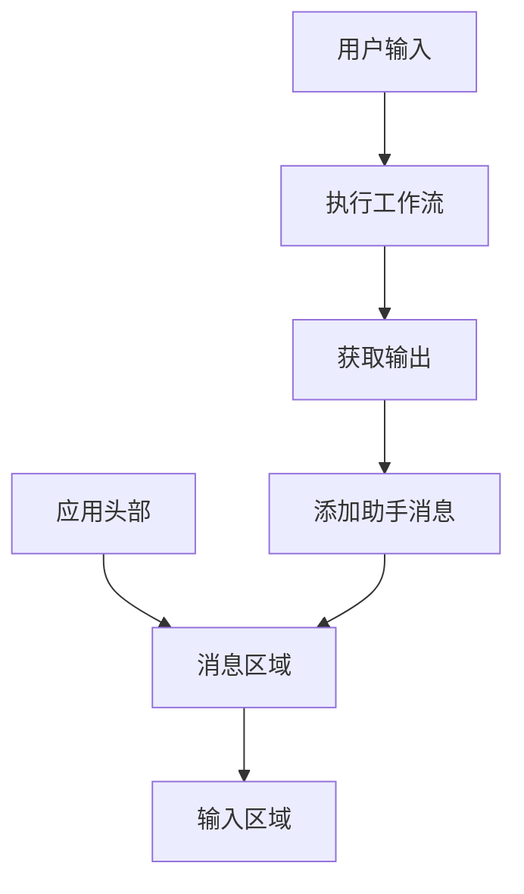

# 流程执行与启动

<cite>
**本文档引用的文件**   
- [run-node/route.ts](file://src/app/api/run-node/route.ts)
- [FlowAppInterface.tsx](file://src/components/apps/FlowAppInterface.tsx)
- [LaunchCard.tsx](file://src/components/builder/LaunchCard.tsx)
- [executionActions.ts](file://src/store/actions/executionActions.ts)
- [flowStore.ts](file://src/store/flowStore.ts)
- [flow.ts](file://src/types/flow.ts)
- [app/page.tsx](file://src/app/app/page.tsx)
- [CustomNode.tsx](file://src/components/flow/CustomNode.tsx)
</cite>

## 目录
1. [工作流执行机制](#工作流执行机制)
2. [Run-Node API调用协议](#run-node-api调用协议)
3. [执行状态生命周期管理](#执行状态生命周期管理)
4. [FlowAppInterface应用界面](#flowappinterface应用界面)
5. [运维功能指南](#运维功能指南)

## 工作流执行机制

工作流的执行机制从`LaunchCard`组件的启动触发开始，通过状态管理实现完整的执行链路。系统采用基于Zustand的状态管理方案，通过`flowStore`集中管理工作流的执行状态、节点数据和上下文信息。

执行流程始于用户在构建器界面完成工作流设计后，系统通过`executionActions`中的`runFlow`方法启动执行。该方法首先检查输入节点是否包含有效数据，若为空则触发输入提示对话框。执行引擎采用拓扑排序算法确定节点执行顺序，从无入边的入口节点开始，通过广度优先遍历确保依赖关系的正确处理。

执行过程中，系统维护一个`flowContext`对象，用于存储每个节点的输出结果，实现执行上下文的传递。当节点执行完成时，其输出结果被存入上下文，并触发后续节点的执行。这种机制确保了数据在节点间的有序流动和状态的正确传递。

**Section sources**
- [LaunchCard.tsx](file://src/components/builder/LaunchCard.tsx#L8-L56)
- [executionActions.ts](file://src/store/actions/executionActions.ts#L23-L180)
- [flowStore.ts](file://src/store/flowStore.ts#L28)

## Run-Node API调用协议

`run-node` API是工作流执行的核心后端接口，负责处理LLM节点的推理请求。该API采用RESTful设计，通过POST方法接收执行参数，并根据配置的LLM提供商进行请求转发。

API接收以下参数：
- `model`：指定使用的模型名称
- `systemPrompt`：系统提示词
- `input`：用户输入内容
- `temperature`：模型温度参数

API根据环境变量`LLM_PROVIDER`决定请求的目标服务，支持OpenAI和Doubao两种提供商。对于Doubao提供商，API会将通用模型名称映射到具体的Doubao端点。请求通过fetch API发送到相应的LLM服务，响应结果经过处理后返回给前端。

参数传递采用JSON格式，确保数据结构的完整性和可扩展性。执行上下文通过`flowContext`在前端维护，并在调用API时作为输入参数传递，实现了执行状态的连续性。

**Diagram sources**
- [run-node/route.ts](file://src/app/api/run-node/route.ts#L4-L65)
- [executionActions.ts](file://src/store/actions/executionActions.ts#L91-L102)

## 执行状态生命周期管理

系统实现了完整的执行状态生命周期管理，包含`pending`、`completed`和`failed`三种主要状态。状态管理通过`executionStatus`字段在`flowStore`中集中维护，确保状态的一致性和可追踪性。

执行状态的转换遵循严格的生命周期：
1. **初始化**：通过`resetExecution`方法将状态重置为"idle"
2. **执行中**：调用`runFlow`时状态变为"running"
3. **完成**：所有节点执行成功后状态变为"completed"
4. **失败**：执行过程中发生错误时状态变为"error"

每个节点也维护独立的执行状态，包括"running"、"completed"和"error"等。节点状态的更新通过`updateNodeData`方法实现，同时记录执行时间和输出结果。这种细粒度的状态管理使得用户可以直观地了解每个节点的执行情况。

状态变更通过React的useEffect Hook进行监听，实现UI的自动更新。例如，当执行状态变为"completed"时，`LaunchCard`组件会显示"应用已就绪"的提示，允许用户启动应用。

**Diagram sources**
- [flow.ts](file://src/types/flow.ts#L11-L11)
- [executionActions.ts](file://src/store/actions/executionActions.ts#L8-L180)
- [flowStore.ts](file://src/store/flowStore.ts#L95)

## FlowAppInterface应用界面

`FlowAppInterface`组件实现了类聊天交互的应用界面，将工作流执行结果以对话形式呈现给用户。该组件采用现代化的UI设计，包含消息区域、输入区域和应用头部。

界面通过`messages`数组维护对话历史，每条消息包含角色("user"或"assistant")和内容。当用户输入查询时，系统将其作为工作流的输入，执行完成后将输出结果作为助手回复展示。这种设计实现了自然的对话式交互体验。

组件通过`isLoading`状态显示加载动画，提升用户体验。当执行进行时，界面显示三个跳动的圆点，表示系统正在处理请求。消息区域支持自动滚动，确保最新消息始终可见。

应用头部显示工作流标题和图标，增强品牌识别。输入区域采用`PromptBubble`组件，提供友好的输入体验。整个界面设计简洁直观，降低了用户使用门槛。

**Diagram sources**
- [FlowAppInterface.tsx](file://src/components/apps/FlowAppInterface.tsx#L7-L133)
- [app/page.tsx](file://src/app/app/page.tsx#L31-L116)

## 运维功能指南

系统提供了一系列运维功能，包括执行日志查看、错误诊断和重试机制，帮助用户监控和调试工作流执行。

### 执行日志查看
执行日志通过`flowContext`对象维护，记录每个节点的输入、输出和执行时间。用户可以通过`CustomNode`组件查看节点的详细执行信息，包括模型参数、执行耗时等。对于LLM节点，还可以查看具体的提示词和响应内容。

### 错误诊断
当执行失败时，系统会捕获错误信息并显示在`executionError`字段中。`NodeDebugDialog`组件提供了详细的错误诊断功能，允许用户查看错误堆栈和上下文信息。对于有依赖的节点，系统会提示用户输入模拟数据进行调试。

### 重试机制
系统实现了智能重试机制。当节点执行失败时，用户可以通过点击"测试节点"按钮重新执行。对于需要上游数据的节点，系统会检查依赖节点的执行状态，必要时提示用户输入模拟数据。`confirmDebugRun`方法处理调试运行的逻辑，支持自定义输入数据。

### 节点调试
`CustomNode`组件集成了调试功能，通过"测试节点"按钮可以单独执行任意节点。对于有入边的节点，系统会检查上游节点的执行结果，若数据缺失则打开调试模态框，允许用户输入模拟数据。这种设计使得节点调试更加灵活和高效。

**Section sources**
- [CustomNode.tsx](file://src/components/flow/CustomNode.tsx#L85-L105)
- [flowStore.ts](file://src/store/flowStore.ts#L103-L114)
- [executionActions.ts](file://src/store/actions/executionActions.ts#L185-L289)