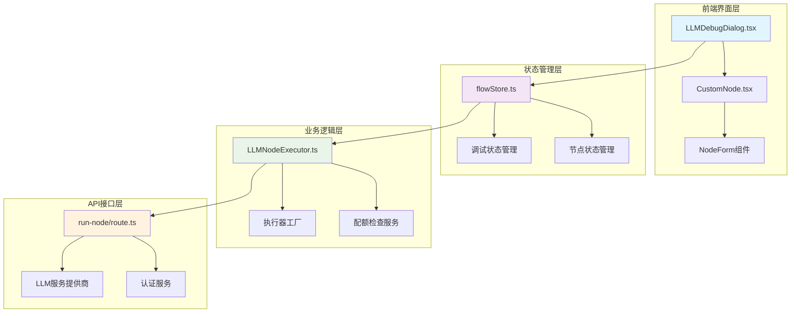
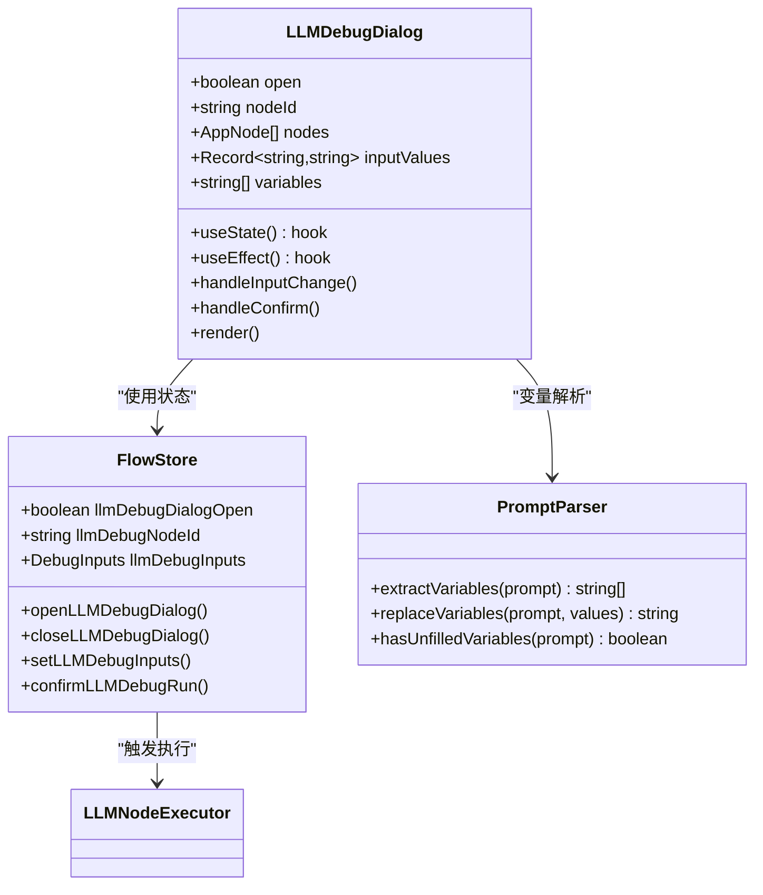
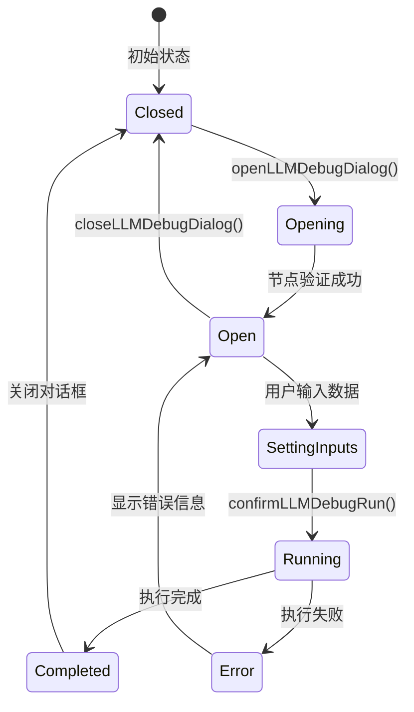
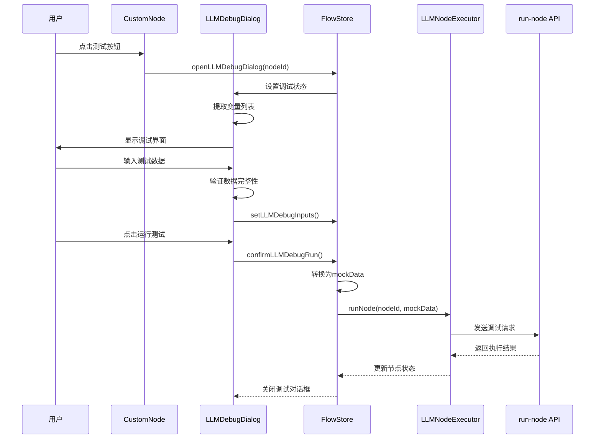
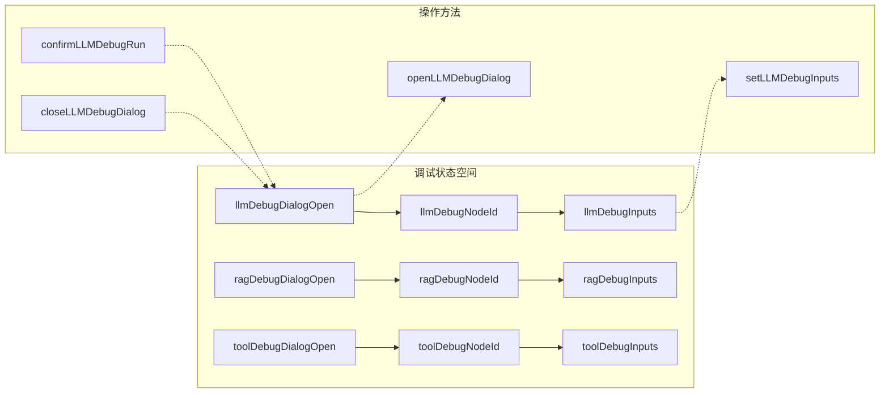
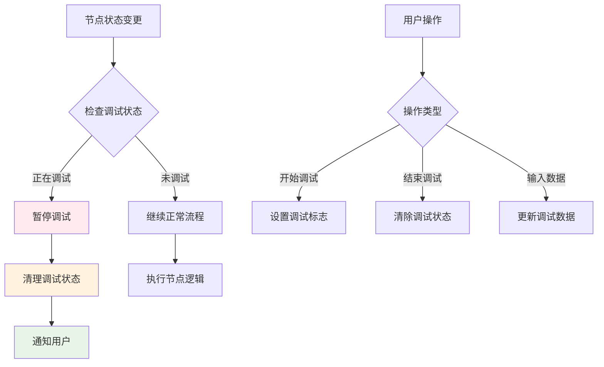
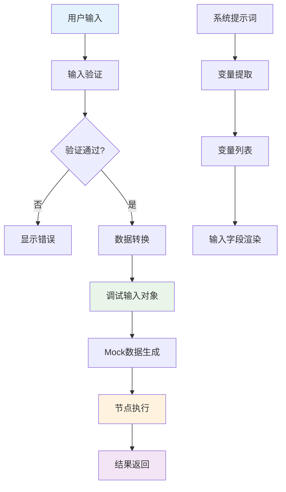
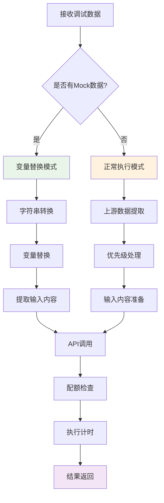
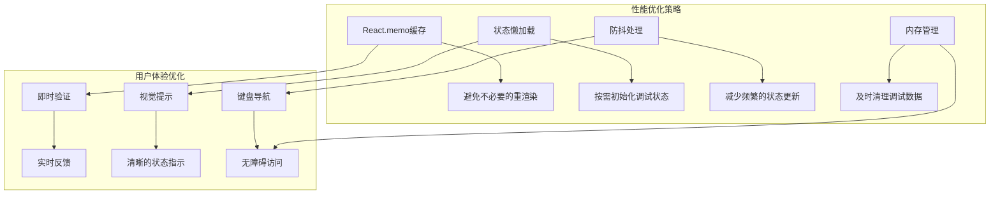

# LLM节点调试对话框

<cite>
**本文档引用的文件**
- [LLMDebugDialog.tsx](file://src/components/flow/LLMDebugDialog.tsx)
- [LLMNodeExecutor.ts](file://src/store/executors/LLMNodeExecutor.ts)
- [LLMNodeForm.tsx](file://src/components/builder/node-forms/LLMNodeForm.tsx)
- [flowStore.ts](file://src/store/flowStore.ts)
- [promptParser.ts](file://src/lib/promptParser.ts)
- [llmModelsAPI.ts](file://src/services/llmModelsAPI.ts)
- [route.ts](file://src/app/api/run-node/route.ts)
- [CustomNode.tsx](file://src/components/flow/CustomNode.tsx)
- [dialog.tsx](file://src/components/ui/dialog.tsx)
- [flow.ts](file://src/types/flow.ts)
</cite>

## 目录
1. [简介](#简介)
2. [项目架构概览](#项目架构概览)
3. [核心组件分析](#核心组件分析)
4. [调试流程详解](#调试流程详解)
5. [状态管理机制](#状态管理机制)
6. [数据流分析](#数据流分析)
7. [错误处理与优化](#错误处理与优化)
8. [性能考虑](#性能考虑)
9. [故障排除指南](#故障排除指南)
10. [总结](#总结)

## 简介

LLM节点调试对话框是Flash Flow SaaS平台中一个关键的开发调试工具，专门用于测试和验证LLM（大型语言模型）节点的功能。该系统通过智能变量提取、模拟数据输入和实时调试反馈，帮助开发者快速定位和解决LLM节点配置问题。

### 主要功能特性

- **智能变量识别**：自动从系统提示词中提取变量模板
- **交互式调试界面**：提供直观的测试数据输入界面
- **实时验证反馈**：即时显示变量填写状态和错误提示
- **模拟执行环境**：支持离线调试和快速迭代
- **状态持久化**：保持调试会话状态和历史记录

## 项目架构概览

LLM调试系统采用分层架构设计，包含前端UI层、状态管理层、业务逻辑层和API接口层。



**图表来源**
- [LLMDebugDialog.tsx](file://src/components/flow/LLMDebugDialog.tsx#L1-L152)
- [flowStore.ts](file://src/store/flowStore.ts#L1-L263)
- [LLMNodeExecutor.ts](file://src/store/executors/LLMNodeExecutor.ts#L1-L172)

## 核心组件分析

### LLM调试对话框组件

LLM调试对话框是一个独立的React组件，负责处理用户交互和数据验证。



**图表来源**
- [LLMDebugDialog.tsx](file://src/components/flow/LLMDebugDialog.tsx#L12-L152)
- [flowStore.ts](file://src/store/flowStore.ts#L150-L182)
- [promptParser.ts](file://src/lib/promptParser.ts#L1-L74)

**章节来源**
- [LLMDebugDialog.tsx](file://src/components/flow/LLMDebugDialog.tsx#L1-L152)
- [flowStore.ts](file://src/store/flowStore.ts#L150-L182)

### 状态管理架构

调试系统的状态管理采用Zustand状态库，实现了集中式的调试状态控制。



**图表来源**
- [flowStore.ts](file://src/store/flowStore.ts#L150-L182)

**章节来源**
- [flowStore.ts](file://src/store/flowStore.ts#L150-L182)

### 变量提取引擎

系统内置了强大的变量提取引擎，能够智能识别和处理各种变量格式。

```mermaid
flowchart TD
A[系统提示词] --> B{变量格式检测}
B --> |{{variable}}| C[提取变量名]
B --> |其他格式| D[忽略]
C --> E[去重处理]
E --> F[返回变量列表]
D --> F
G[变量验证] --> H{是否全部填写}
H --> |是| I[允许提交]
H --> |否| J[显示错误提示]
style A fill:#e3f2fd
style F fill:#e8f5e8
style I fill:#fff3e0
style J fill:#ffebee
```

**图表来源**
- [promptParser.ts](file://src/lib/promptParser.ts#L17-L33)

**章节来源**
- [promptParser.ts](file://src/lib/promptParser.ts#L1-L74)

## 调试流程详解

### 完整调试工作流程

LLM调试对话框遵循严格的流程控制，确保调试过程的可靠性和用户体验。



**图表来源**
- [CustomNode.tsx](file://src/components/flow/CustomNode.tsx#L77-L94)
- [LLMDebugDialog.tsx](file://src/components/flow/LLMDebugDialog.tsx#L58-L78)
- [flowStore.ts](file://src/store/flowStore.ts#L166-L179)

**章节来源**
- [CustomNode.tsx](file://src/components/flow/CustomNode.tsx#L77-L94)
- [LLMDebugDialog.tsx](file://src/components/flow/LLMDebugDialog.tsx#L58-L78)
- [flowStore.ts](file://src/store/flowStore.ts#L166-L179)

### 变量处理机制

系统实现了复杂的变量处理机制，支持多种变量格式和嵌套结构。

| 处理阶段 | 功能描述 | 实现位置 | 错误处理 |
|---------|---------|---------|---------|
| 变量提取 | 从系统提示词中识别{{variable}}格式 | promptParser.ts | 忽略无效格式 |
| 数据绑定 | 将变量映射到输入字段 | LLMDebugDialog.tsx | 空值安全处理 |
| 类型转换 | 将调试输入转换为执行数据 | flowStore.ts | 类型验证 |
| 变量替换 | 在执行时替换实际值 | LLMNodeExecutor.ts | 默认值处理 |

**章节来源**
- [promptParser.ts](file://src/lib/promptParser.ts#L17-L33)
- [LLMDebugDialog.tsx](file://src/components/flow/LLMDebugDialog.tsx#L67-L74)
- [flowStore.ts](file://src/store/flowStore.ts#L171-L175)
- [LLMNodeExecutor.ts](file://src/store/executors/LLMNodeExecutor.ts#L66-L78)

## 状态管理机制

### 流状态架构

LLM调试系统采用了模块化的状态管理架构，每个调试类型都有独立的状态空间。



**图表来源**
- [flow.ts](file://src/types/flow.ts#L131-L145)

**章节来源**
- [flow.ts](file://src/types/flow.ts#L131-L145)
- [flowStore.ts](file://src/store/flowStore.ts#L150-L182)

### 状态同步机制

系统确保调试状态与节点状态的同步，避免状态不一致问题。



**图表来源**
- [flowStore.ts](file://src/store/flowStore.ts#L159-L162)

**章节来源**
- [flowStore.ts](file://src/store/flowStore.ts#L159-L162)

## 数据流分析

### 调试数据流向

LLM调试系统的数据流经过多个层次的转换和验证，确保数据的完整性和一致性。



**图表来源**
- [LLMDebugDialog.tsx](file://src/components/flow/LLMDebugDialog.tsx#L58-L78)
- [flowStore.ts](file://src/store/flowStore.ts#L171-L175)

**章节来源**
- [LLMDebugDialog.tsx](file://src/components/flow/LLMDebugDialog.tsx#L58-L78)
- [flowStore.ts](file://src/store/flowStore.ts#L171-L175)

### 执行器集成

LLMNodeExecutor作为核心执行器，负责处理调试模式下的特殊逻辑。



**图表来源**
- [LLMNodeExecutor.ts](file://src/store/executors/LLMNodeExecutor.ts#L65-L81)

**章节来源**
- [LLMNodeExecutor.ts](file://src/store/executors/LLMNodeExecutor.ts#L65-L81)

## 错误处理与优化

### 错误处理策略

系统实现了多层次的错误处理机制，确保调试过程的稳定性。

| 错误类型 | 处理策略 | 用户反馈 | 恢复机制 |
|---------|---------|---------|---------|
| 变量未填写 | 实时验证提示 | 红色边框+必填标记 | 继续编辑 |
| API调用失败 | 降级处理 | 错误消息显示 | 重试机制 |
| 配额超限 | 权限检查 | 配额不足提示 | 跳转配额页面 |
| 节点不存在 | 状态验证 | 节点已删除提示 | 关闭对话框 |

**章节来源**
- [LLMDebugDialog.tsx](file://src/components/flow/LLMDebugDialog.tsx#L59-L65)
- [LLMNodeExecutor.ts](file://src/store/executors/LLMNodeExecutor.ts#L20-L56)

### 性能优化措施

系统采用了多种性能优化技术，提升调试体验。



**图表来源**
- [CustomNode.tsx](file://src/components/flow/CustomNode.tsx#L182-L184)

**章节来源**
- [CustomNode.tsx](file://src/components/flow/CustomNode.tsx#L182-L184)

## 性能考虑

### 内存管理

调试系统实现了智能的内存管理策略，避免长期占用过多资源。

- **状态清理**：对话框关闭时自动清理调试状态
- **数据压缩**：对大型调试数据进行压缩存储
- **垃圾回收**：定期清理过期的调试历史

### 并发控制

系统采用了严格的并发控制机制，确保调试操作的一致性。

- **互斥锁**：防止同时进行多个调试操作
- **状态同步**：确保状态变更的原子性
- **竞态防护**：避免状态竞争条件

## 故障排除指南

### 常见问题诊断

| 问题症状 | 可能原因 | 解决方案 | 预防措施 |
|---------|---------|---------|---------|
| 对话框无法打开 | 节点类型错误 | 检查节点类型是否为llm | 添加类型验证 |
| 变量未识别 | 提示词格式错误 | 使用标准{{variable}}格式 | 提供格式示例 |
| 调试无响应 | API调用失败 | 检查网络连接和API配置 | 添加重试机制 |
| 数据丢失 | 状态同步问题 | 重新打开调试对话框 | 实现状态持久化 |

### 调试技巧

1. **变量命名规范**：使用有意义的变量名称便于调试
2. **分步验证**：逐步添加变量，便于定位问题
3. **边界测试**：测试空值、特殊字符等边界情况
4. **日志追踪**：启用详细日志记录问题

**章节来源**
- [LLMDebugDialog.tsx](file://src/components/flow/LLMDebugDialog.tsx#L98-L103)
- [LLMNodeExecutor.ts](file://src/store/executors/LLMNodeExecutor.ts#L20-L56)

## 总结

LLM节点调试对话框是Flash Flow SaaS平台的核心调试工具，通过智能化的设计和完善的架构，为开发者提供了强大而易用的调试能力。系统的主要优势包括：

### 技术亮点

- **智能变量识别**：基于正则表达式的变量提取算法
- **实时验证反馈**：即时的用户输入验证和错误提示
- **模块化架构**：清晰的分层设计便于维护和扩展
- **性能优化**：多重缓存和防抖机制确保流畅体验

### 应用价值

- **开发效率**：显著提升LLM节点的开发和调试效率
- **质量保证**：通过全面的测试覆盖确保节点质量
- **用户体验**：直观的界面设计降低学习成本
- **可扩展性**：模块化设计支持功能扩展和定制

该系统不仅解决了当前的调试需求，还为未来的功能扩展奠定了坚实的基础，是现代低代码平台不可或缺的重要组成部分。