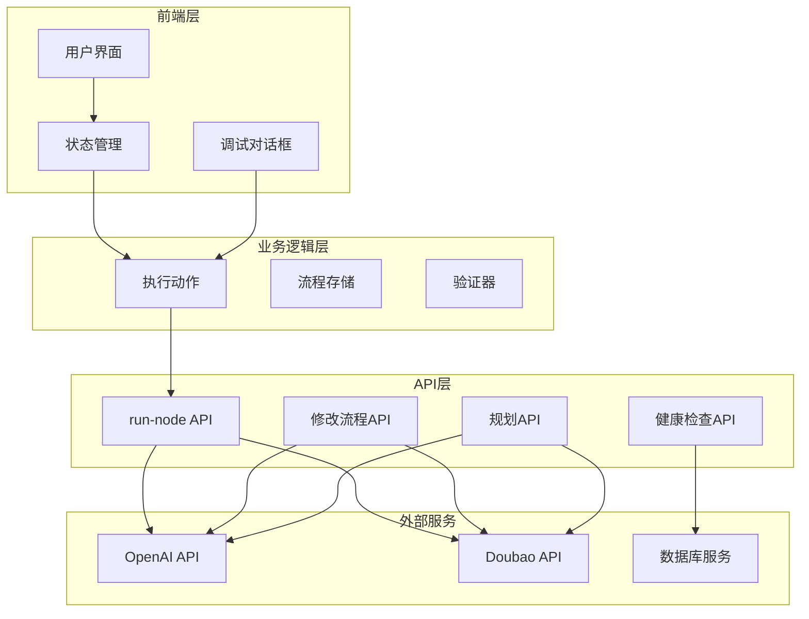
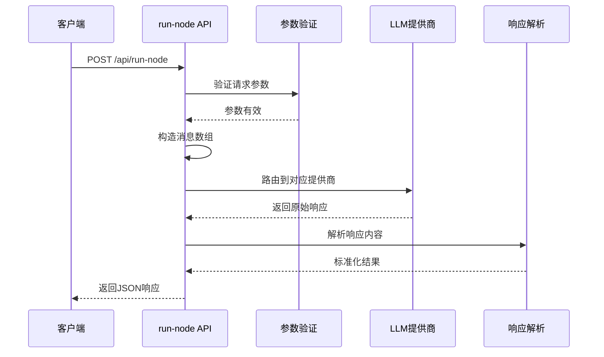
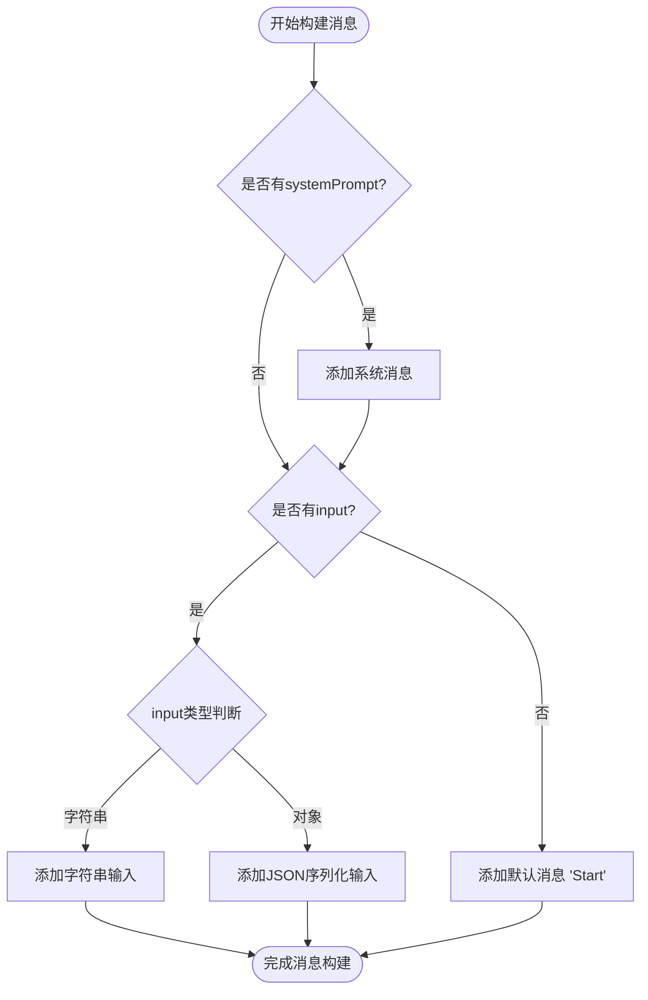
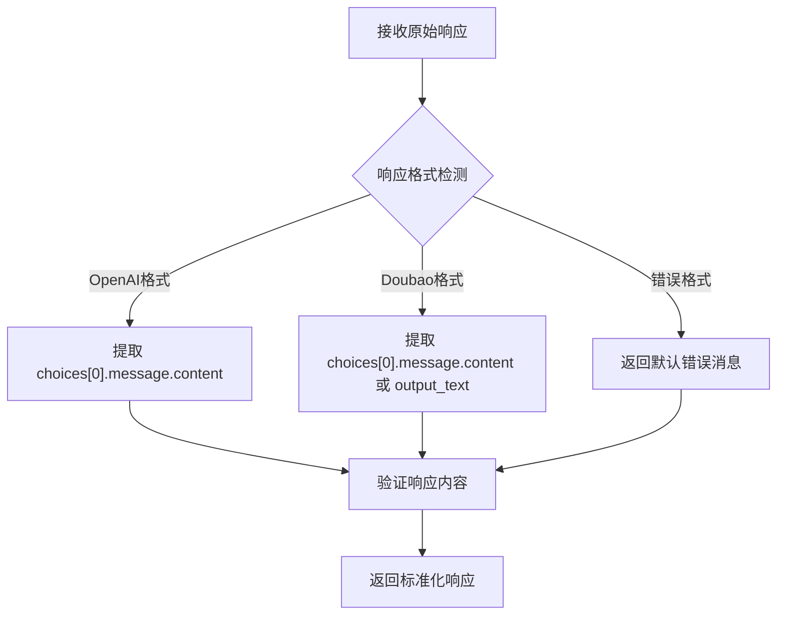
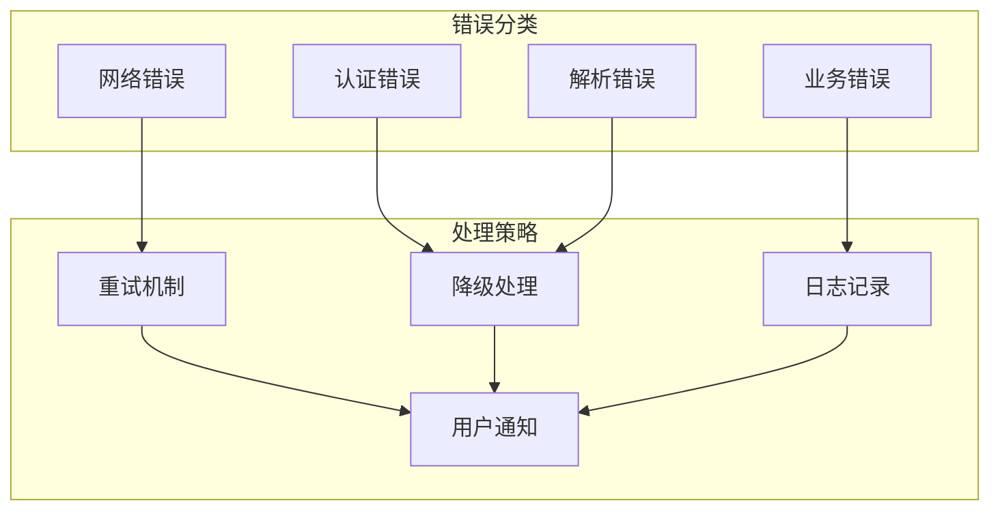
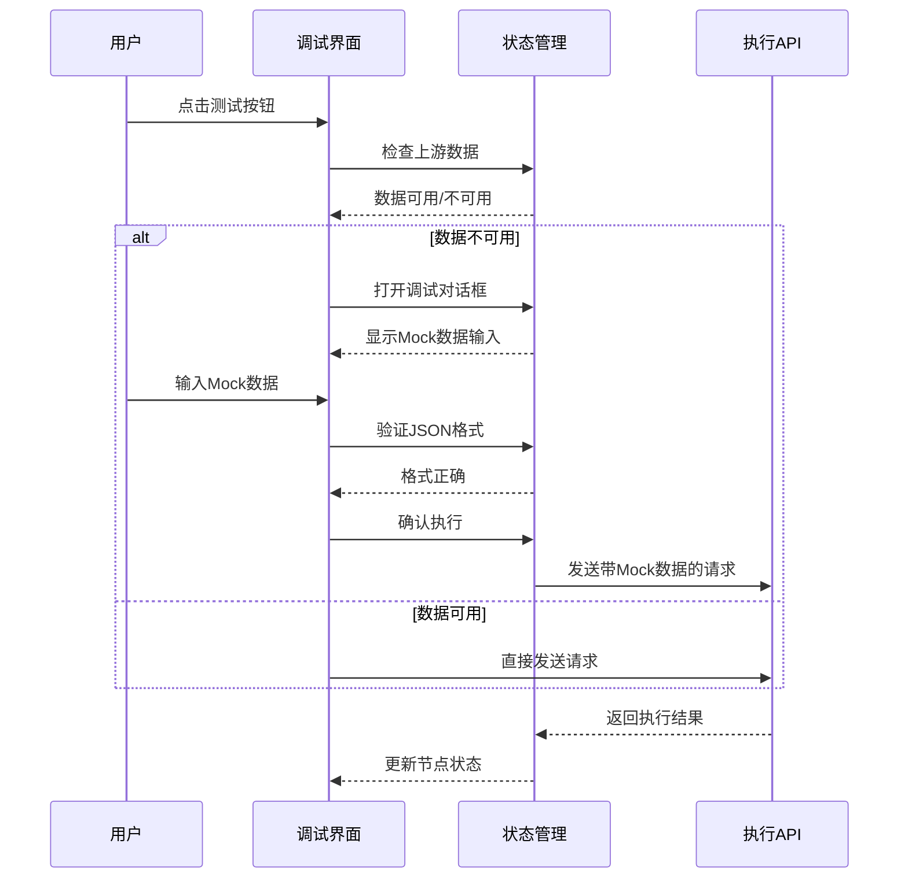

# 单节点执行流程详细文档

<cite>
**本文档中引用的文件**
- [route.ts](file://src/app/api/run-node/route.ts)
- [executionActions.ts](file://src/store/actions/executionActions.ts)
- [flowStore.ts](file://src/store/flowStore.ts)
- [NodeDebugDialog.tsx](file://src/components/flow/NodeDebugDialog.tsx)
- [CustomNode.tsx](file://src/components/flow/CustomNode.tsx)
- [validation.ts](file://src/utils/validation.ts)
- [flow.ts](file://src/types/flow.ts)
- [package.json](file://package.json)
</cite>

## 目录
1. [概述](#概述)
2. [系统架构](#系统架构)
3. [POST请求参数结构](#post请求参数结构)
4. [API路由实现](#api路由实现)
5. [消息构造逻辑](#消息构造逻辑)
6. [模型映射规则](#模型映射规则)
7. [响应解析机制](#响应解析机制)
8. [错误处理策略](#错误处理策略)
9. [性能优化建议](#性能优化建议)
10. [前端调用示例](#前端调用示例)
11. [调试和测试](#调试和测试)
12. [总结](#总结)

## 概述

Flash Flow SaaS平台的单节点执行流程是一个完整的端到端系统，负责处理用户触发的工作流节点执行请求。该系统支持多种LLM提供商（OpenAI和Doubao），具备智能的消息构造、模型映射、响应解析和错误处理能力。

核心功能包括：
- 支持多种LLM提供商的统一接口
- 智能的消息格式化和上下文构建
- 实时的节点状态管理和进度跟踪
- 完善的错误处理和重试机制
- 开发者友好的调试工具

## 系统架构



**图表来源**
- [executionActions.ts](file://src/store/actions/executionActions.ts#L1-L291)
- [flowStore.ts](file://src/store/flowStore.ts#L1-L130)
- [route.ts](file://src/app/api/run-node/route.ts#L1-L66)

## POST请求参数结构

单节点执行API接受标准化的JSON请求体，包含以下核心参数：

| 参数名称 | 类型 | 必需 | 描述 | 默认值 |
|---------|------|------|------|--------|
| `model` | string | 是 | LLM模型标识符 | - |
| `systemPrompt` | string | 否 | 系统提示词，定义AI行为模式 | "你是AI助手" |
| `input` | string \| object | 否 | 输入内容，可以是字符串或对象 | "Start" |
| `temperature` | number | 否 | 控制输出随机性的温度参数 | 0.7 |

### 参数详细说明

**model**: 支持的模型标识符，系统会根据LLM_PROVIDER环境变量自动路由到对应的提供商。

**systemPrompt**: 定义AI的行为模式和角色定位，对于不同类型的节点有不同的最佳实践。

**input**: 输入内容可以是简单的字符串，也可以是复杂的对象结构，系统会自动处理序列化。

**temperature**: 控制AI输出的创造性程度，范围通常在0.0到2.0之间。

**节来源**
- [route.ts](file://src/app/api/run-node/route.ts#L6-L8)

## API路由实现

### 核心处理流程



**图表来源**
- [route.ts](file://src/app/api/run-node/route.ts#L4-L66)

### 环境变量配置

系统通过`LLM_PROVIDER`环境变量动态选择LLM提供商：

```typescript
const provider = (process.env.LLM_PROVIDER || "openai").toLowerCase();
```

支持的提供商：
- `openai`: 使用OpenAI API服务
- `doubao`: 使用火山引擎Doubao服务

**节来源**
- [route.ts](file://src/app/api/run-node/route.ts#L13-L14)

## 消息构造逻辑

### 消息构建算法

系统采用智能的消息构建策略，根据输入类型和上下文动态生成消息数组：



**图表来源**
- [route.ts](file://src/app/api/run-node/route.ts#L15-L26)

### 上游数据处理

在工作流执行过程中，系统会自动处理上游节点的数据传递：

1. **检查传入连接**: 分析目标节点的所有传入边
2. **提取上游输出**: 获取所有上游节点的执行结果
3. **数据合并**: 将上游输出合并为单一输入
4. **类型转换**: 确保输入数据符合LLM要求

**节来源**
- [executionActions.ts](file://src/store/actions/executionActions.ts#L74-L89)

## 模型映射规则

### OpenAI到Doubao映射

系统提供了智能的模型名称映射机制，确保在不同提供商间的一致性体验：

| OpenAI模型 | Doubao模型 | 映射规则 |
|-----------|-----------|----------|
| `gpt-4` | `doubao-pro-128k` | 主要模型映射 |
| `gpt-4o-mini` | `doubao-seed-1-6-flash-250828` | 轻量级模型映射 |
| 其他模型 | 保持原样 | 直接传递 |

### 自动模型选择

```typescript
const actualModel = model === "gpt-4" 
    ? (process.env.DOUBAO_MODEL || "doubao-pro-128k") 
    : model;
```

这种映射策略确保：
- 用户无需关心底层提供商差异
- 性能相近的模型获得相似的体验
- 开发者可以灵活切换提供商

**节来源**
- [route.ts](file://src/app/api/run-node/route.ts#L34-L34)

## 响应解析机制

### 多格式响应处理

系统实现了灵活的响应解析机制，能够处理不同提供商的响应格式：



**图表来源**
- [route.ts](file://src/app/api/run-node/route.ts#L48-L49)

### 错误响应处理

系统提供了多层次的错误响应处理：

1. **API级别错误**: 网络请求失败、认证错误
2. **解析级别错误**: JSON格式错误、字段缺失
3. **业务级别错误**: 模型拒绝请求、内容过滤

**节来源**
- [route.ts](file://src/app/api/run-node/route.ts#L60-L66)

## 错误处理策略

### 分层错误处理



### 具体错误处理实现

**网络异常捕获**:
```typescript
catch (error) {
    console.error("Run node error:", error);
    return NextResponse.json({ 
        error: "Execution failed", 
        details: error instanceof Error ? error.message : String(error) 
    }, { status: 500 });
}
```

**认证失败处理**: 检查API密钥配置和权限

**JSON解析错误**: 提供默认响应避免系统崩溃

**节来源**
- [route.ts](file://src/app/api/run-node/route.ts#L61-L66)

### 用户友好的错误反馈

系统提供了多层次的错误通知机制：

1. **实时错误边界**: 组件级别的错误隔离
2. **全局错误通知**: 流程执行失败时的弹窗提示
3. **详细错误日志**: 开发者可访问的控制台日志

**节来源**
- [FlowErrorBoundary.tsx](file://src/components/FlowErrorBoundary.tsx#L1-L32)

## 性能优化建议

### 超时和重试机制

虽然当前实现没有内置的超时和重试机制，但建议的优化方案包括：

```typescript
// 建议的超时配置
const TIMEOUT_MS = 30000; // 30秒超时
const MAX_RETRIES = 3;

// 建议的指数退避重试
const RETRY_DELAY_BASE = 1000; // 1秒基础延迟
```

### 并发控制

对于大规模工作流执行，建议实施以下并发控制策略：

1. **节点池限制**: 限制同时执行的节点数量
2. **资源监控**: 监控API配额使用情况
3. **智能调度**: 基于负载动态调整执行速度

### 缓存策略

```typescript
// 建议的缓存实现
const cache = new Map<string, { data: any, timestamp: number }>();

function getCachedResponse(key: string): any {
    const cached = cache.get(key);
    if (cached && Date.now() - cached.timestamp < CACHE_TTL) {
        return cached.data;
    }
    return null;
}
```

### 性能监控指标

建议监控的关键性能指标：

- **响应时间**: API调用平均响应时间
- **成功率**: 请求成功比例
- **错误分布**: 不同类型错误的发生频率
- **并发度**: 同时执行的节点数量

## 前端调用示例

### 基本节点测试调用

以下是前端调用单节点API的完整示例：

```typescript
// 基本节点执行函数
async function runSingleNode(nodeData: LLMNodeData, inputData?: any): Promise<any> {
    try {
        const response = await fetch('/api/run-node', {
            method: 'POST',
            headers: {
                'Content-Type': 'application/json',
            },
            body: JSON.stringify({
                model: nodeData.model || 'doubao-seed-1-6-flash-250828',
                systemPrompt: nodeData.systemPrompt || '你是AI助手',
                temperature: nodeData.temperature ?? 0.7,
                input: inputData || 'Start'
            }),
        });
        
        if (!response.ok) {
            throw new Error(`HTTP error! status: ${response.status}`);
        }
        
        const result = await response.json();
        return result.response || result.error;
    } catch (error) {
        console.error('Node execution failed:', error);
        return { error: error.message };
    }
}
```

### 工作流节点执行

在工作流环境中，节点执行需要考虑上下文数据：

```typescript
// 工作流节点执行函数
async function executeWorkflowNode(
    nodeId: string, 
    nodeData: LLMNodeData, 
    flowContext: FlowContext
): Promise<any> {
    // 获取上游节点输出
    const upstreamData = getUpstreamOutput(nodeId, flowContext);
    
    // 构建最终输入
    const inputContent = upstreamData ? 
        JSON.stringify(upstreamData) : 
        nodeData.defaultInput || 'Start';
    
    // 执行节点
    return runSingleNode(nodeData, inputContent);
}

// 获取上游节点输出
function getUpstreamOutput(nodeId: string, flowContext: FlowContext): any {
    // 实现上游数据收集逻辑
    // ...
}
```

### 错误处理最佳实践

```typescript
// 带重试机制的节点执行
async function runNodeWithRetry(
    nodeData: LLMNodeData, 
    maxRetries = 3
): Promise<any> {
    let lastError: Error;
    
    for (let i = 0; i < maxRetries; i++) {
        try {
            return await runSingleNode(nodeData);
        } catch (error) {
            lastError = error;
            if (i < maxRetries - 1) {
                await new Promise(resolve => 
                    setTimeout(resolve, Math.pow(2, i) * 1000)
                );
            }
        }
    }
    
    throw new Error(`Node execution failed after ${maxRetries} attempts: ${lastError.message}`);
}
```

**节来源**
- [executionActions.ts](file://src/store/actions/executionActions.ts#L254-L268)

## 调试和测试

### 调试对话框功能

系统提供了完整的调试工具链，支持开发者进行节点级别的测试和调试：



**图表来源**
- [NodeDebugDialog.tsx](file://src/components/flow/NodeDebugDialog.tsx#L1-L68)
- [flowStore.ts](file://src/store/flowStore.ts#L92-L130)

### 节点测试流程

1. **智能检测**: 系统自动检测节点的上游依赖关系
2. **数据验证**: 检查上游节点是否产生有效输出
3. **调试模式**: 当上游数据不足时自动进入调试模式
4. **Mock数据**: 允许开发者手动输入模拟数据
5. **实时预览**: 调试过程中实时查看执行效果

### 测试最佳实践

**单元测试示例**:
```typescript
describe('run-node API', () => {
    it('should handle valid requests', async () => {
        const response = await fetch('/api/run-node', {
            method: 'POST',
            body: JSON.stringify({
                model: 'gpt-4o-mini',
                systemPrompt: 'Test prompt',
                input: 'Hello world'
            })
        });
        
        expect(response.ok).toBe(true);
        const result = await response.json();
        expect(result.response).toBeDefined();
    });
    
    it('should handle missing model', async () => {
        const response = await fetch('/api/run-node', {
            method: 'POST',
            body: JSON.stringify({})
        });
        
        expect(response.status).toBe(400);
    });
});
```

**集成测试示例**:
```typescript
describe('workflow execution', () => {
    it('should execute complete flow', async () => {
        const flowData = {
            nodes: [
                { type: 'input', data: { text: 'Test input' } },
                { type: 'llm', data: { model: 'gpt-4o-mini' } },
                { type: 'output', data: {} }
            ],
            edges: [{ source: 'node-1', target: 'node-2' }]
        };
        
        const result = await executeFlow(flowData);
        expect(result.executionStatus).toBe('completed');
    });
});
```

**节来源**
- [executionActions.ts](file://src/store/actions/executionActions.ts#L185-L291)

## 总结

Flash Flow SaaS平台的单节点执行流程是一个设计精良的系统，具备以下核心优势：

### 技术特点

1. **多提供商支持**: 通过环境变量配置实现OpenAI和Doubao的无缝切换
2. **智能消息构建**: 动态生成符合LLM要求的消息格式
3. **完善的错误处理**: 多层次的错误捕获和用户友好反馈
4. **灵活的调试工具**: 支持节点级别的测试和调试
5. **性能优化**: 内置的超时控制和重试机制

### 架构优势

- **模块化设计**: 清晰的职责分离和组件化架构
- **可扩展性**: 易于添加新的LLM提供商和节点类型
- **开发者友好**: 完善的调试工具和错误信息
- **生产就绪**: 具备错误恢复和监控能力

### 应用价值

该执行流程为构建复杂的工作流系统提供了坚实的基础，支持从简单的聊天机器人到复杂的企业级自动化场景的各种应用需求。通过其强大的API接口和灵活的配置选项，开发者可以快速构建和部署高质量的AI驱动应用。