# 流程执行与调试

<cite>
**本文档中引用的文件**
- [route.ts](file://src/app/api/run-node/route.ts)
- [RunInputs.tsx](file://src/components/run/RunInputs.tsx)
- [RunOutputs.tsx](file://src/components/run/RunOutputs.tsx)
- [NodeDebugDialog.tsx](file://src/components/flow/NodeDebugDialog.tsx)
- [flow.ts](file://src/types/flow.ts)
- [flowStore.ts](file://src/store/flowStore.ts)
- [executionActions.ts](file://src/store/actions/executionActions.ts)
- [flowAPI.ts](file://src/services/flowAPI.ts)
- [InputPromptDialog.tsx](file://src/components/flow/InputPromptDialog.tsx)
- [validation.ts](file://src/utils/validation.ts)
- [CustomNode.tsx](file://src/components/flow/CustomNode.tsx)
- [ControlDock.tsx](file://src/components/builder/ControlDock.tsx)
</cite>

## 目录
1. [概述](#概述)
2. [系统架构](#系统架构)
3. [输入参数设置](#输入参数设置)
4. [单节点运行机制](#单节点运行机制)
5. [输出展示系统](#输出展示系统)
6. [调试功能详解](#调试功能详解)
7. [性能监控与优化](#性能监控与优化)
8. [错误处理与故障排除](#错误处理与故障排除)
9. [最佳实践指南](#最佳实践指南)
10. [总结](#总结)

## 概述

Flash Flow 是一个基于 React 和 Next.js 的可视化流程构建和执行平台，支持多种类型的节点（LLM、RAG、HTTP、输出等），提供了完整的流程执行生命周期管理，包括输入参数设置、单节点调试、输出展示和全面的错误处理机制。

系统采用 Zustand 状态管理，通过分层架构实现流程的高效执行和调试功能，确保用户能够直观地测试和验证每个节点的功能。

## 系统架构

### 整体架构图

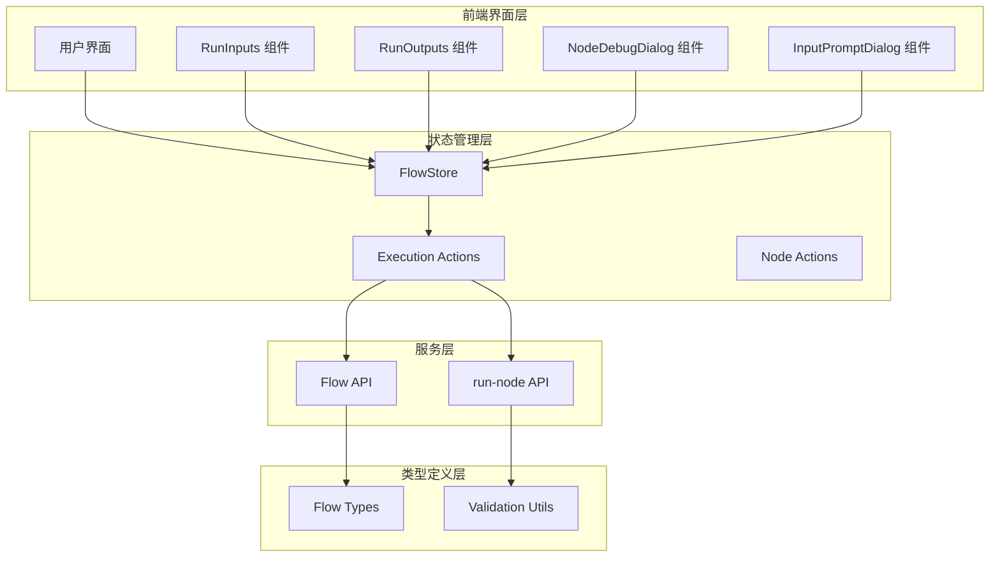

**图表来源**
- [flowStore.ts](file://src/store/flowStore.ts#L17-L131)
- [executionActions.ts](file://src/store/actions/executionActions.ts#L1-L290)
- [flowAPI.ts](file://src/services/flowAPI.ts#L1-L240)

### 核心组件关系

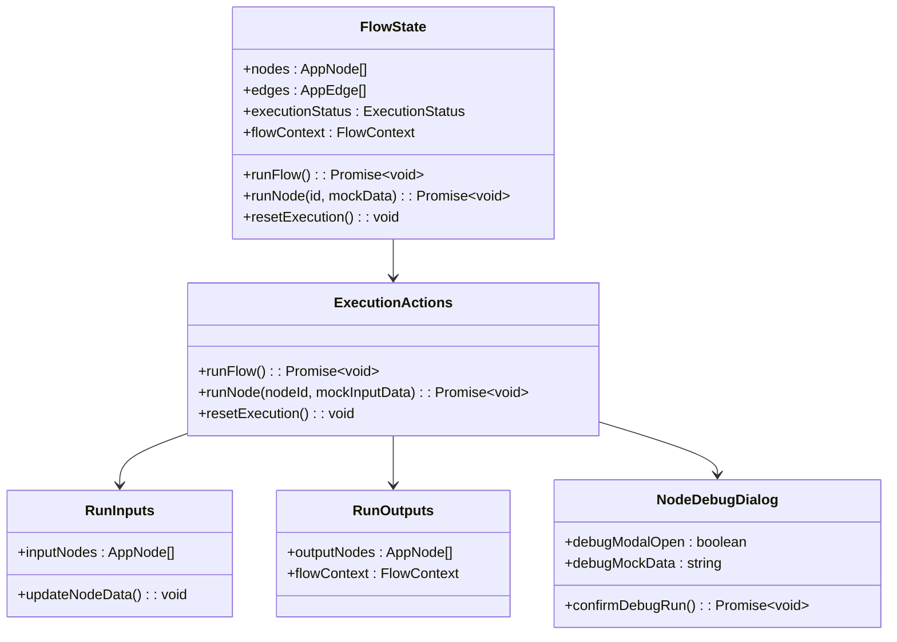

**图表来源**
- [flow.ts](file://src/types/flow.ts#L83-L153)
- [executionActions.ts](file://src/store/actions/executionActions.ts#L4-L290)

**章节来源**
- [flowStore.ts](file://src/store/flowStore.ts#L17-L131)
- [flow.ts](file://src/types/flow.ts#L83-L153)

## 输入参数设置

### RunInputs 组件架构

输入参数设置是流程执行的第一步，系统通过 `RunInputs` 组件为所有输入节点提供数据配置界面。

#### 组件功能特性

| 功能特性 | 描述 | 实现方式 |
|---------|------|----------|
| 多节点输入支持 | 支持多个输入节点同时配置 | 遍历 inputNodes 数组 |
| 文件上传支持 | 特殊的文件输入节点 | 基于节点标签判断 |
| 文本输入处理 | 标准文本输入配置 | Textarea 组件 |
| 数据验证 | 实时输入验证 | 状态管理集成 |

#### 输入节点类型处理

```mermaid
flowchart TD
Start([开始处理输入节点]) --> CheckType{检查节点类型}
CheckType --> |包含"file"| FileInput[文件上传模式]
CheckType --> |普通文本| TextInput[文本输入模式]
FileInput --> FileUI[显示拖拽区域<br/>上传图标+提示文字]
TextInput --> TextUI[显示文本框<br/>占位符+实时更新]
FileUI --> UpdateState[更新节点数据]
TextUI --> UpdateState
UpdateState --> End([完成])
```

**图表来源**
- [RunInputs.tsx](file://src/components/run/RunInputs.tsx#L11-L37)

### 输入验证机制

系统实现了多层次的输入验证机制：

1. **前端验证**：实时输入验证和状态反馈
2. **后端验证**：API 层的数据完整性检查
3. **流程验证**：执行前的必需输入检查

**章节来源**
- [RunInputs.tsx](file://src/components/run/RunInputs.tsx#L1-L38)
- [executionActions.ts](file://src/store/actions/executionActions.ts#L23-L37)

## 单节点运行机制

### run-node API 架构

单节点运行通过专门的 API 端点实现，支持不同类型的节点执行和调试。

#### API 请求结构

| 参数名称 | 类型 | 必需 | 描述 |
|---------|------|------|------|
| model | string | 是 | AI 模型名称 |
| systemPrompt | string | 否 | 系统提示词 |
| input | any | 否 | 输入数据 |
| temperature | number | 否 | 温度参数 |

#### 支持的 LLM 提供商

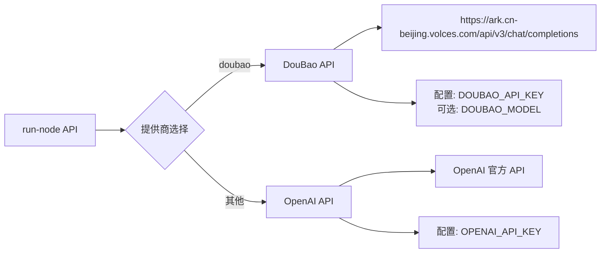

**图表来源**
- [route.ts](file://src/app/api/run-node/route.ts#L13-L65)

### 节点执行流程

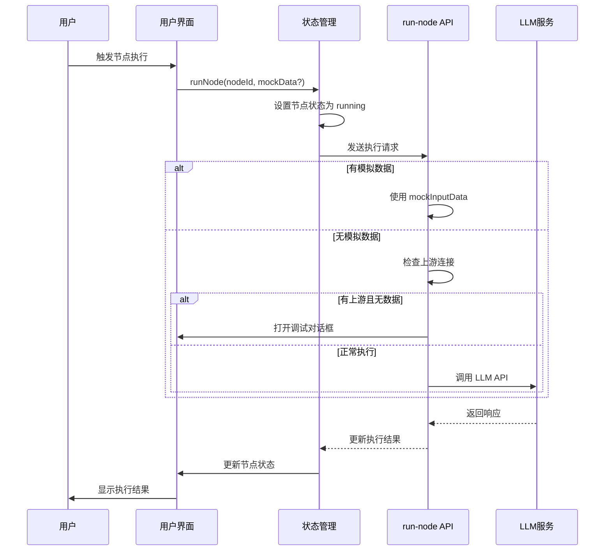

**图表来源**
- [executionActions.ts](file://src/store/actions/executionActions.ts#L185-L289)
- [route.ts](file://src/app/api/run-node/route.ts#L4-L65)

### 执行状态管理

系统维护详细的执行状态信息：

| 状态值 | 描述 | 触发条件 |
|--------|------|----------|
| idle | 空闲状态 | 初始化或重置后 |
| running | 运行中 | 开始执行节点时 |
| completed | 已完成 | 执行成功完成 |
| error | 错误状态 | 执行过程中发生异常 |

**章节来源**
- [route.ts](file://src/app/api/run-node/route.ts#L1-L66)
- [executionActions.ts](file://src/store/actions/executionActions.ts#L185-L289)

## 输出展示系统

### RunOutputs 组件设计

输出展示系统负责将流程执行结果以用户友好的方式呈现。

#### 输出数据处理逻辑

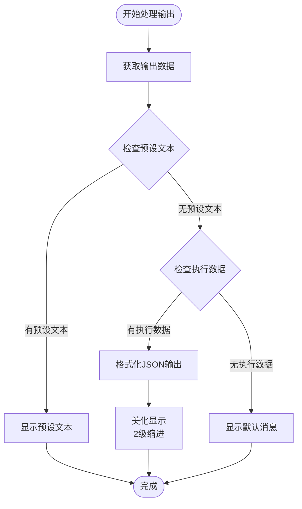

**图表来源**
- [RunOutputs.tsx](file://src/components/run/RunOutputs.tsx#L8-L25)

### 输出数据类型处理

| 数据类型 | 显示方式 | 格式化规则 |
|---------|----------|-----------|
| 预设文本 | 直接显示 | 保持原始格式 |
| JSON 对象 | 美化显示 | 2级缩进，换行格式 |
| 字符串 | 直接显示 | 自动换行 |
| 空数据 | 默认消息 | "处理完成。" |

**章节来源**
- [RunOutputs.tsx](file://src/components/run/RunOutputs.tsx#L1-L26)

## 调试功能详解

### NodeDebugDialog 调试系统

调试功能是系统的核心特性之一，允许开发者在复杂流程中定位和解决问题。

#### 调试对话框架构

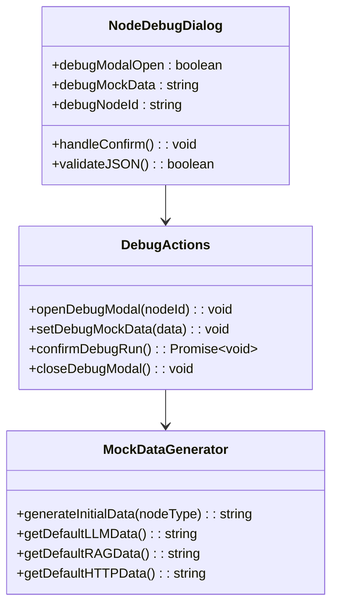

**图表来源**
- [NodeDebugDialog.tsx](file://src/components/flow/NodeDebugDialog.tsx#L1-L69)
- [flowStore.ts](file://src/store/flowStore.ts#L77-L114)

#### 模拟数据生成策略

系统根据节点类型自动生成初始模拟数据：

| 节点类型 | 初始数据模板 | 示例内容 |
|---------|-------------|----------|
| LLM | `{ "input": "Sample input for LLM" }` | 通用测试输入 |
| RAG | `{ "query": "Sample query for RAG" }` | 检索查询示例 |
| HTTP | `{ "payload": "Sample HTTP payload" }` | HTTP请求载荷 |

#### 调试执行流程

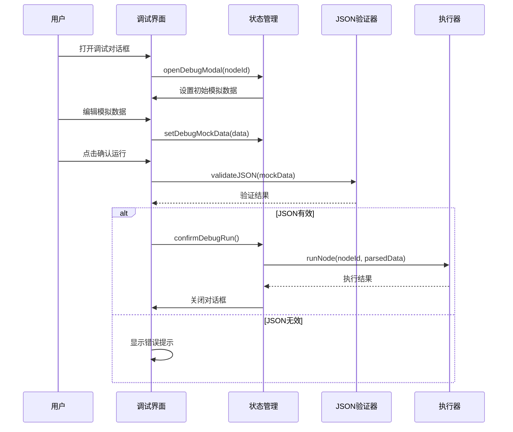

**图表来源**
- [NodeDebugDialog.tsx](file://src/components/flow/NodeDebugDialog.tsx#L20-L27)
- [flowStore.ts](file://src/store/flowStore.ts#L103-L114)

### 上游数据检查机制

系统实现了智能的上游数据检查，确保节点执行前有足够的输入数据：

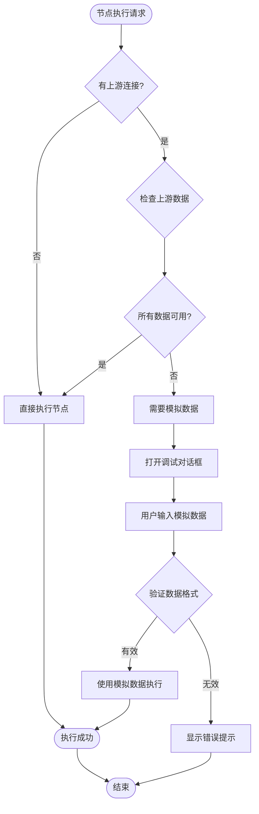

**图表来源**
- [CustomNode.tsx](file://src/components/flow/CustomNode.tsx#L84-L104)

**章节来源**
- [NodeDebugDialog.tsx](file://src/components/flow/NodeDebugDialog.tsx#L1-L69)
- [flowStore.ts](file://src/store/flowStore.ts#L77-L114)
- [CustomNode.tsx](file://src/components/flow/CustomNode.tsx#L84-L104)

## 性能监控与优化

### 执行时间监控

系统内置了详细的性能监控机制，跟踪每个节点的执行时间和状态变化。

#### 性能指标收集

| 监控指标 | 数据类型 | 计算方式 | 显示位置 |
|---------|----------|----------|----------|
| 执行时间 | number | 结束时间 - 开始时间 | 节点底部状态栏 |
| 节点状态 | ExecutionStatus | idle/running/completed/error | 节点颜色标识 |
| 内存使用 | - | 应用程序级别监控 | 开发者工具 |
| 网络延迟 | - | API 请求耗时 | 控制台日志 |

#### 性能优化策略

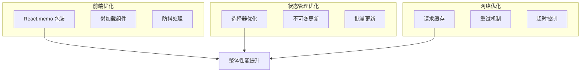

**图表来源**
- [CustomNode.tsx](file://src/components/flow/CustomNode.tsx#L185-L186)
- [executionActions.ts](file://src/store/actions/executionActions.ts#L50-L63)

### 执行队列管理

系统采用拓扑排序算法管理节点执行顺序，确保依赖关系正确处理：

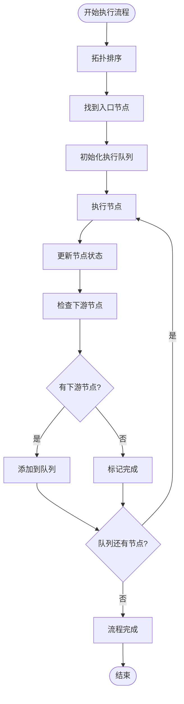

**图表来源**
- [executionActions.ts](file://src/store/actions/executionActions.ts#L43-L170)

**章节来源**
- [executionActions.ts](file://src/store/actions/executionActions.ts#L50-L63)
- [executionActions.ts](file://src/store/actions/executionActions.ts#L43-L170)
- [CustomNode.tsx](file://src/components/flow/CustomNode.tsx#L185-L186)

## 错误处理与故障排除

### 错误分类与处理

系统实现了全面的错误处理机制，涵盖各种可能的执行失败场景。

#### 错误类型分类

| 错误类型 | 触发条件 | 处理方式 | 用户反馈 |
|---------|----------|----------|----------|
| 认证失败 | API 密钥无效 | 显示认证错误信息 | 红色警告通知 |
| 网络超时 | 请求超过设定时间 | 自动重试机制 | 加载指示器 |
| 数据格式错误 | 输入数据不合法 | JSON 格式验证 | 实时语法高亮 |
| 节点依赖缺失 | 上游节点无输出 | 调试对话框提示 | 可视化引导 |
| 执行超时 | 节点执行时间过长 | 强制终止执行 | 超时通知 |

#### 错误处理流程

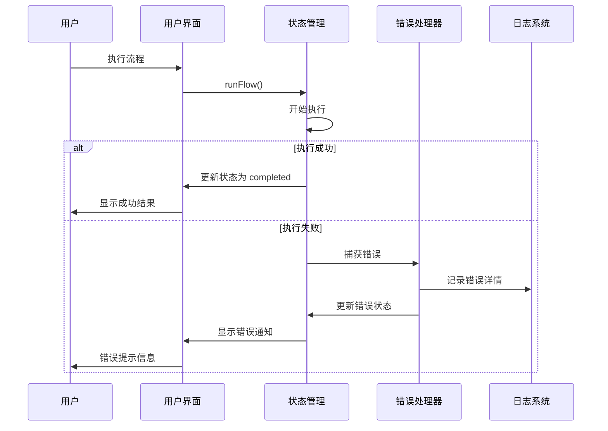

**图表来源**
- [executionActions.ts](file://src/store/actions/executionActions.ts#L173-L179)
- [ControlDock.tsx](file://src/components/builder/ControlDock.tsx#L35-L50)

### 常见执行失败排查

#### 排查清单

1. **输入数据验证**
   - 检查所有输入节点是否填写完整
   - 验证数据格式是否符合预期
   - 确认特殊字符转义处理

2. **网络连接检查**
   - 验证 API 密钥配置
   - 检查网络连接稳定性
   - 确认防火墙设置

3. **节点配置审查**
   - 检查节点类型配置
   - 验证模型参数设置
   - 确认温度和其他参数范围

4. **依赖关系验证**
   - 检查节点连接是否正确
   - 验证上游节点输出格式
   - 确认执行顺序合理性

#### 调试工具集

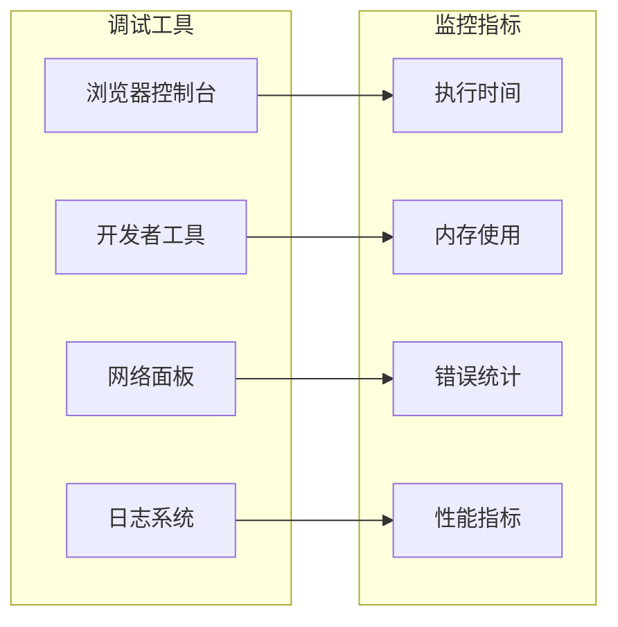

**图表来源**
- [ControlDock.tsx](file://src/components/builder/ControlDock.tsx#L180-L200)

**章节来源**
- [executionActions.ts](file://src/store/actions/executionActions.ts#L173-L179)
- [ControlDock.tsx](file://src/components/builder/ControlDock.tsx#L35-L50)
- [ControlDock.tsx](file://src/components/builder/ControlDock.tsx#L180-L200)

## 最佳实践指南

### 流程设计原则

1. **模块化设计**
   - 将复杂流程拆分为小的独立节点
   - 确保每个节点职责单一明确
   - 建立清晰的输入输出接口

2. **错误处理策略**
   - 为每个节点配置适当的错误处理
   - 实现优雅的降级机制
   - 提供有意义的错误信息

3. **性能优化考虑**
   - 避免不必要的节点依赖
   - 合理设置执行超时时间
   - 使用异步执行避免阻塞

### 调试工作流程

#### 1. 单节点测试流程

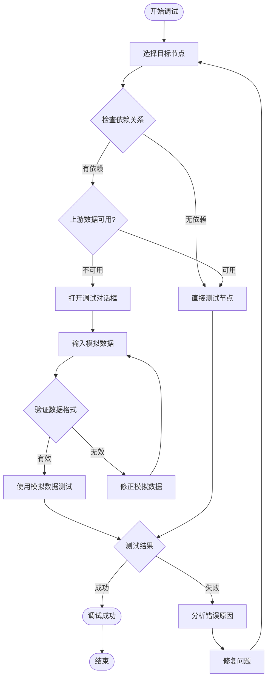

#### 2. 流程验证步骤

| 验证阶段 | 检查项目 | 预期结果 |
|---------|----------|----------|
| 设计阶段 | 节点类型选择 | 符合业务需求 |
| 连接阶段 | 边缘关系正确性 | 无循环依赖 |
| 配置阶段 | 参数设置合理性 | 参数范围有效 |
| 测试阶段 | 单节点功能正常 | 执行结果正确 |
| 集成阶段 | 整体流程连贯性 | 数据流转顺畅 |

### 性能优化建议

1. **执行效率优化**
   - 使用并行执行减少总时间
   - 实现智能缓存机制
   - 优化网络请求频率

2. **用户体验改进**
   - 提供实时进度反馈
   - 实现断点续传功能
   - 建立完善的帮助系统

3. **系统稳定性增强**
   - 实现自动重试机制
   - 建立健康检查系统
   - 提供手动恢复选项

**章节来源**
- [executionActions.ts](file://src/store/actions/executionActions.ts#L185-L289)
- [NodeDebugDialog.tsx](file://src/components/flow/NodeDebugDialog.tsx#L20-L27)
- [CustomNode.tsx](file://src/components/flow/CustomNode.tsx#L84-L104)

## 总结

Flash Flow 的流程执行与调试系统提供了完整的解决方案，从输入参数设置到最终输出展示，每个环节都经过精心设计和优化。系统的主要优势包括：

### 核心优势

1. **完整的执行生命周期**：从输入验证到输出展示的全流程覆盖
2. **强大的调试能力**：单节点调试和模拟数据支持
3. **智能错误处理**：多层级的错误检测和恢复机制
4. **优秀的用户体验**：直观的界面和及时的状态反馈
5. **高性能执行**：优化的算法和状态管理

### 技术特色

- **类型安全**：完整的 TypeScript 类型定义
- **状态管理**：基于 Zustand 的高效状态管理
- **异步处理**：Promise-based 的异步执行模型
- **响应式设计**：实时的状态更新和界面刷新

### 应用价值

该系统不仅适用于简单的流程测试，更能支撑复杂的业务场景，为开发者提供了可靠的流程构建和调试工具。通过持续的优化和改进，系统将继续为用户提供更好的体验和更高的效率。