# 调试对话框

<cite>
**本文档引用文件**   
- [LLMDebugDialog.tsx](file://src/components/flow/LLMDebugDialog.tsx)
- [RAGDebugDialog.tsx](file://src/components/flow/RAGDebugDialog.tsx)
- [ToolDebugDialog.tsx](file://src/components/flow/ToolDebugDialog.tsx)
- [InputPromptDialog.tsx](file://src/components/flow/InputPromptDialog.tsx)
- [debugActions.ts](file://src/store/actions/debugActions.ts)
- [executionActions.ts](file://src/store/actions/executionActions.ts)
- [flowStore.ts](file://src/store/flowStore.ts)
- [flow.ts](file://src/types/flow.ts)
- [debugDialogUtils.ts](file://src/store/utils/debugDialogUtils.ts)
</cite>

## 目录
1. [简介](#简介)
2. [核心组件分析](#核心组件分析)
3. [调试对话框架构](#调试对话框架构)
4. [状态管理机制](#状态管理机制)
5. [执行流程分析](#执行流程分析)
6. [用户交互流程](#用户交互流程)
7. [调试数据处理](#调试数据处理)
8. [错误处理与验证](#错误处理与验证)
9. [总结](#总结)

## 简介
调试对话框系统是工作流开发环境中的关键功能，为开发者提供了在复杂流程中定位和解决问题的能力。该系统通过一系列专用对话框，允许用户为特定节点输入模拟数据并进行独立测试，从而实现精准的调试和验证。

**Section sources**
- [LLMDebugDialog.tsx](file://src/components/flow/LLMDebugDialog.tsx#L1-L150)
- [RAGDebugDialog.tsx](file://src/components/flow/RAGDebugDialog.tsx#L1-L150)

## 核心组件分析

### LLM调试对话框
LLM调试对话框专为大语言模型节点设计，提供变量测试功能。当用户尝试执行带有上游依赖的LLM节点时，系统会自动弹出此对话框，提示用户为检测到的变量填写测试值。

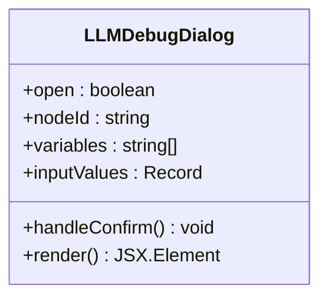

**Diagram sources**
- [LLMDebugDialog.tsx](file://src/components/flow/LLMDebugDialog.tsx#L1-L150)

### RAG调试对话框
RAG（检索增强生成）调试对话框为文档检索节点提供测试界面。与LLM对话框类似，它允许用户输入查询参数来测试检索功能，确保文档检索逻辑正确。

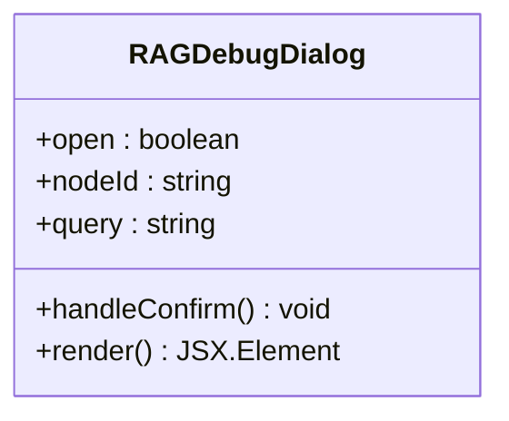

**Diagram sources**
- [RAGDebugDialog.tsx](file://src/components/flow/RAGDebugDialog.tsx#L1-L150)

### 工具调试对话框
工具调试对话框为工具节点提供JSON格式的输入测试功能。用户可以输入JSON格式的模拟数据，系统会验证其格式正确性后用于节点执行。

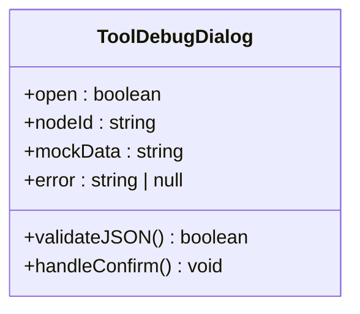

**Diagram sources**
- [ToolDebugDialog.tsx](file://src/components/flow/ToolDebugDialog.tsx#L1-L150)

### 输入提示对话框
输入提示对话框在流程执行时检测到输入节点缺少必要数据时弹出，提示用户补充输入内容，确保流程能够顺利执行。

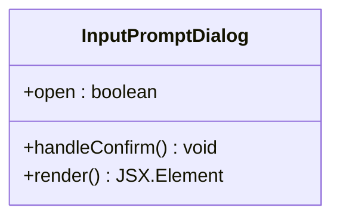

**Diagram sources**
- [InputPromptDialog.tsx](file://src/components/flow/InputPromptDialog.tsx#L1-L150)

## 调试对话框架构

### 组件层次结构
调试对话框系统采用分层架构设计，各组件协同工作：

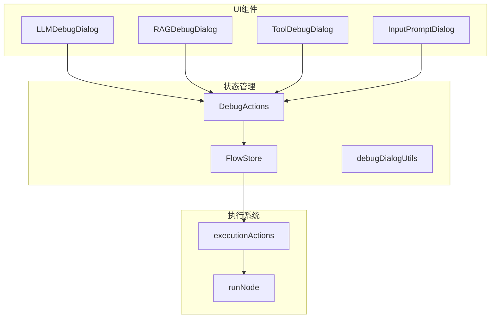

**Diagram sources**
- [debugActions.ts](file://src/store/actions/debugActions.ts#L1-L93)
- [flowStore.ts](file://src/store/flowStore.ts#L1-L49)

### 通用调试对话框工厂
系统通过工厂函数减少重复代码，为不同类型的调试对话框提供统一的创建机制：

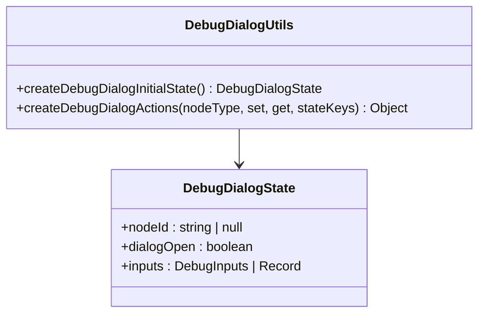

**Diagram sources**
- [debugDialogUtils.ts](file://src/store/utils/debugDialogUtils.ts#L1-L106)

## 状态管理机制

### 全局状态结构
调试相关状态在全局store中统一管理，确保数据一致性：

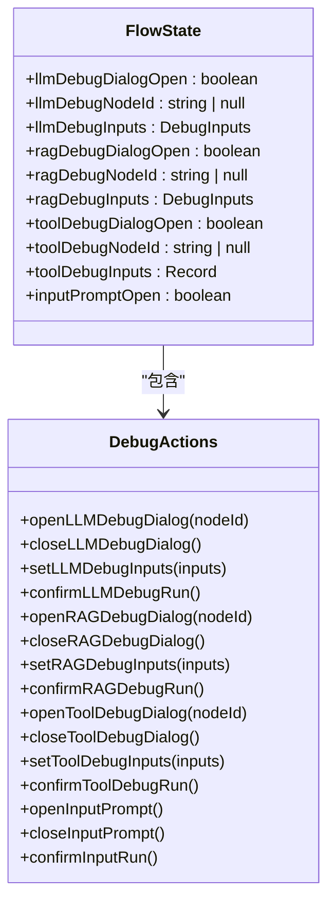

**Diagram sources**
- [flow.ts](file://src/types/flow.ts#L225-L239)
- [debugActions.ts](file://src/store/actions/debugActions.ts#L4-L27)

### 初始状态配置
系统定义了调试对话框的初始状态，确保组件在未激活时处于一致的默认状态：

```mermaid
stateDiagram-v2
[*] --> Idle
Idle --> LLMDialog : openLLMDebugDialog
Idle --> RAGDialog : openRAGDebugDialog
Idle --> ToolDialog : openToolDebugDialog
Idle --> InputPrompt : openInputPrompt
LLMDialog --> Idle : closeLLMDebugDialog
RAGDialog --> Idle : closeRAGDebugDialog
ToolDialog --> Idle : closeToolDebugDialog
InputPrompt --> Idle : closeInputPrompt
classDef default fill : #f9f9f9,stroke : #333,stroke-width : 1px;
class Idle,LMD,RAGD,TD,IP default
```

**Diagram sources**
- [initialState.ts](file://src/store/constants/initialState.ts#L28-L43)

## 执行流程分析

### 单节点调试执行机制
当用户尝试执行单个节点时，系统根据节点类型和连接情况决定是否显示调试对话框：

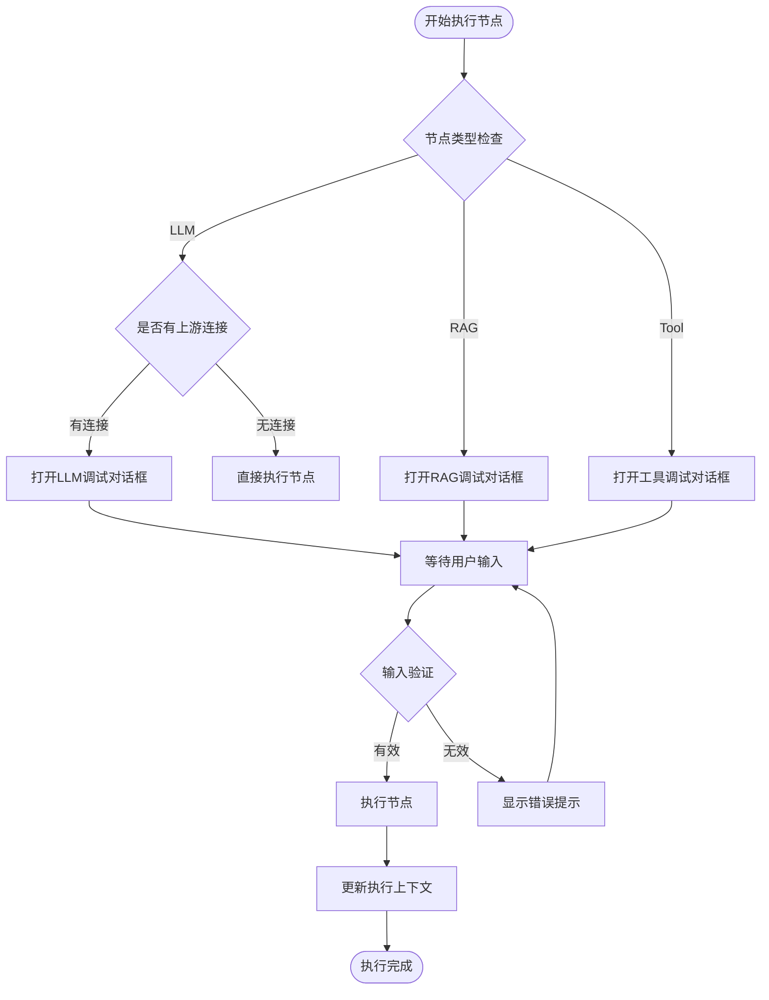

**Diagram sources**
- [executionActions.ts](file://src/store/actions/executionActions.ts#L244-L274)

### 调试执行核心流程
调试执行的核心流程涉及多个状态的协调和数据转换：

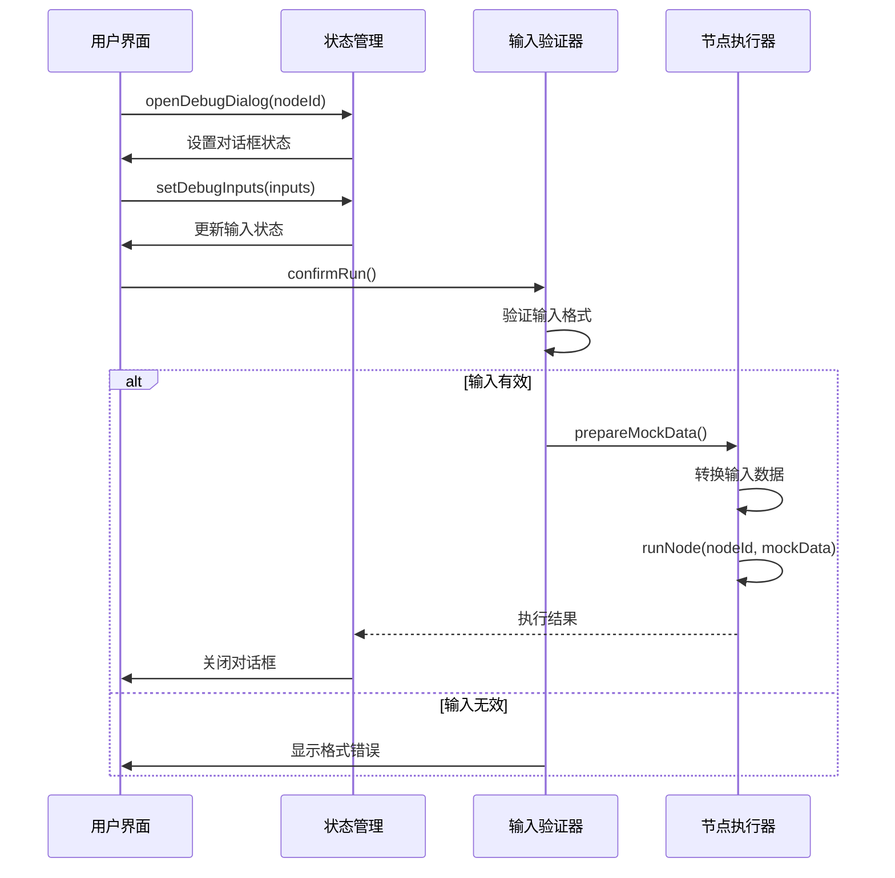

**Diagram sources**
- [executionActions.ts](file://src/store/actions/executionActions.ts#L264-L270)
- [debugDialogUtils.ts](file://src/store/utils/debugDialogUtils.ts#L79-L101)

## 用户交互流程

### 调试对话框交互流程
用户与调试对话框的完整交互过程如下：

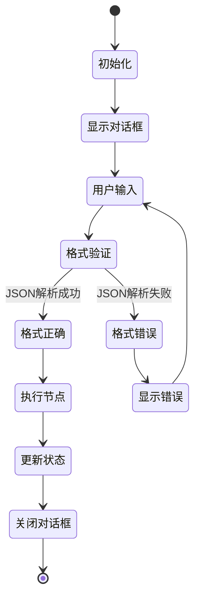

**Diagram sources**
- [ToolDebugDialog.tsx](file://src/components/flow/ToolDebugDialog.tsx#L20-L28)
- [debugDialogUtils.ts](file://src/store/utils/debugDialogUtils.ts#L79-L101)

### 节点测试触发机制
节点测试功能通过画布上的测试按钮触发：

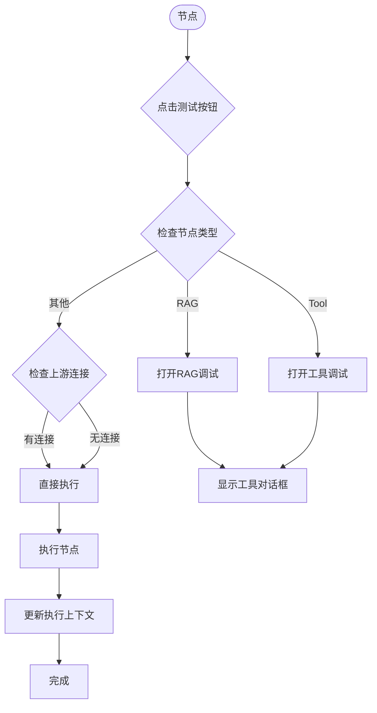

**Section sources**
- [CustomNode.tsx](file://src/components/flow/CustomNode.tsx#L214-L236)

## 调试数据处理

### 数据格式转换
系统在调试过程中需要对输入数据进行格式转换：

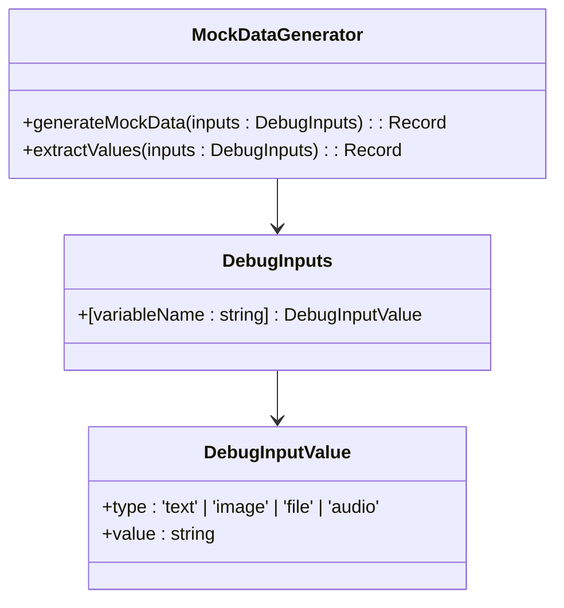

**Diagram sources**
- [flow.ts](file://src/types/flow.ts#L187-L194)
- [debugDialogUtils.ts](file://src/store/utils/debugDialogUtils.ts#L88-L97)

### 模拟数据生成策略
系统根据节点类型采用不同的模拟数据生成策略：

| 节点类型 | 输入格式 | 数据处理方式 | 示例 |
|---------|---------|-------------|------|
| LLM | DebugInputs | 提取value字段 | `{ "input": "测试内容" }` |
| RAG | DebugInputs | 提取value字段 | `{ "query": "检索查询" }` |
| Tool | Record<string, unknown> | 直接使用 | `{ "param": "值" }` |
| 其他 | Record<string, unknown> | 直接使用 | `{ "data": "模拟数据" }` |

**Section sources**
- [debugDialogUtils.ts](file://src/store/utils/debugDialogUtils.ts#L88-L97)
- [executionActions.ts](file://src/store/actions/executionActions.ts#L264-L270)

## 错误处理与验证

### JSON格式验证机制
工具调试对话框实现了实时JSON格式验证：

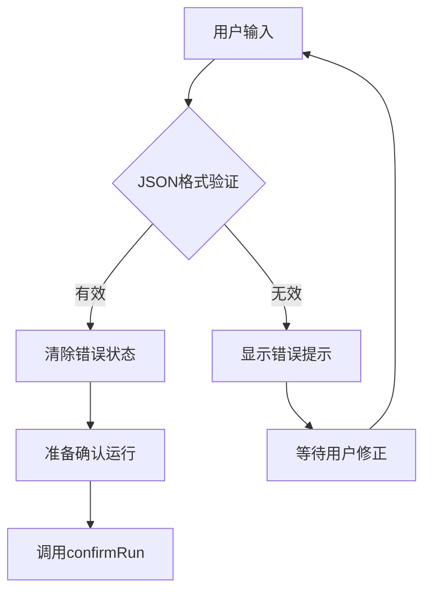

**Diagram sources**
- [NodeDebugDialog.tsx](file://src/components/flow/NodeDebugDialog.tsx#L20-L27)

### 错误处理流程
系统在调试执行过程中实现了完善的错误处理机制：

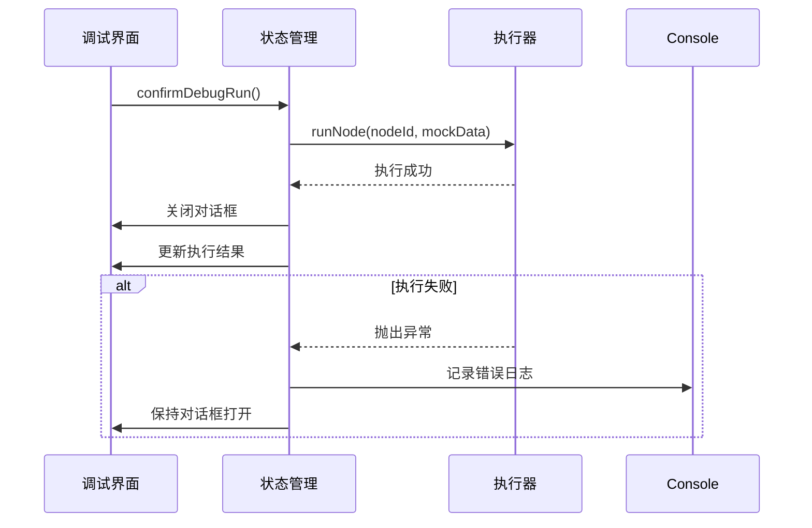

**Section sources**
- [debugActions.ts](file://src/store/actions/debugActions.ts#L51-L67)
- [executionActions.ts](file://src/store/actions/executionActions.ts#L271-L273)

## 总结
调试对话框系统为工作流开发提供了强大的调试能力，通过统一的架构设计和灵活的状态管理，实现了对不同类型节点的精准测试。系统采用工厂模式减少代码重复，通过Zustand状态管理确保数据一致性，并实现了完整的错误处理和输入验证机制，为开发者提供了高效、可靠的调试体验。

**Section sources**
- [flowStore.ts](file://src/store/flowStore.ts#L40-L41)
- [debugActions.ts](file://src/store/actions/debugActions.ts#L29-L93)