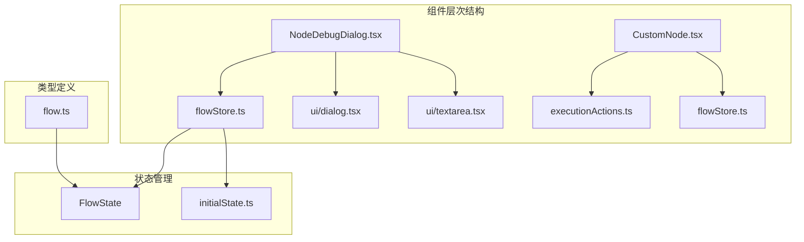
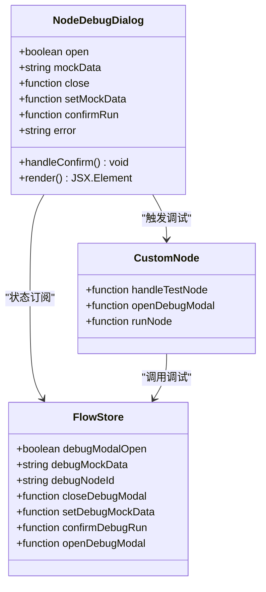
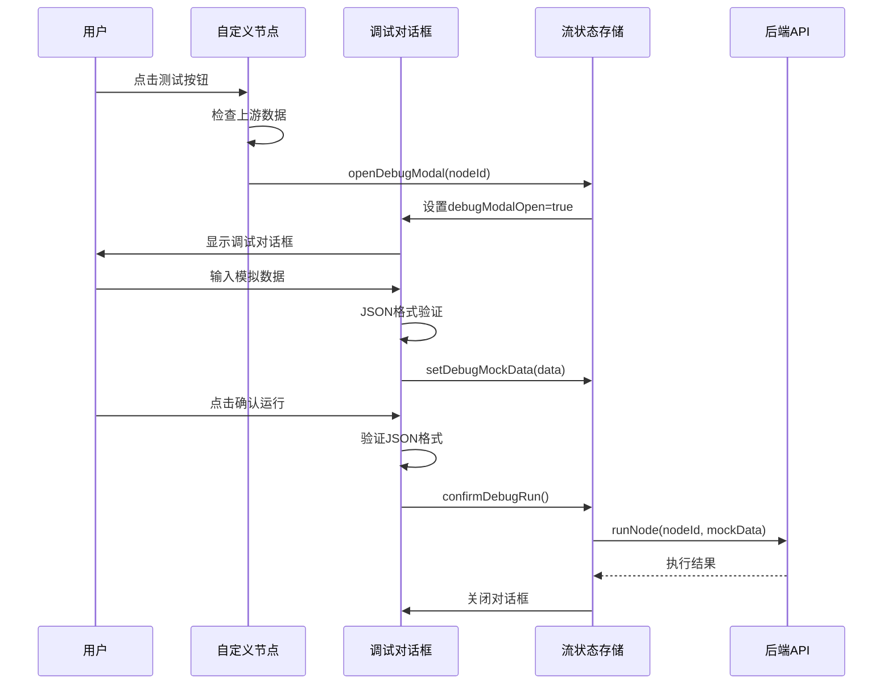
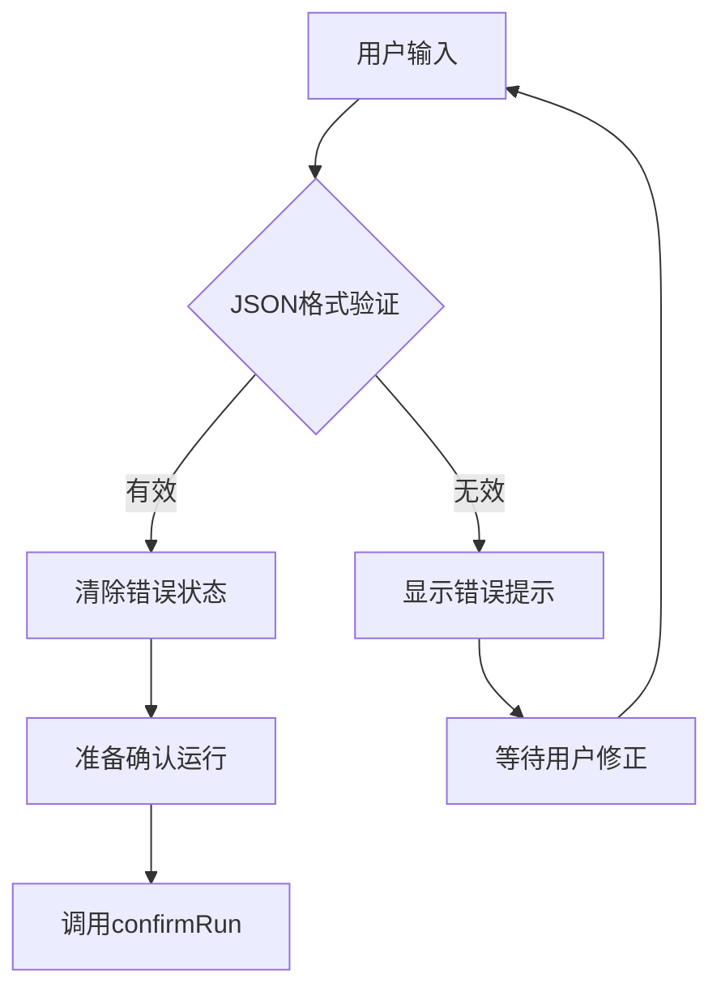
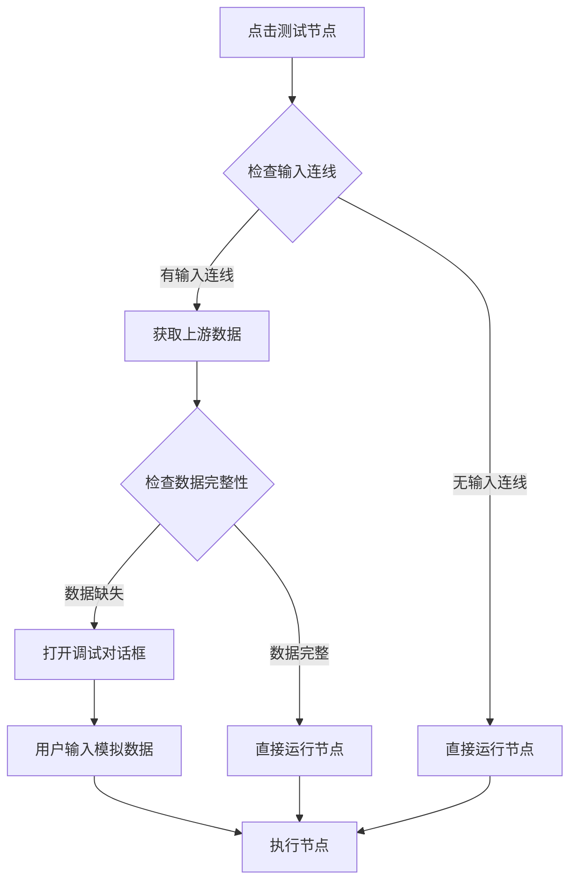
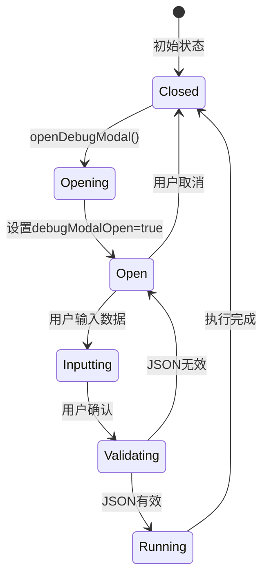
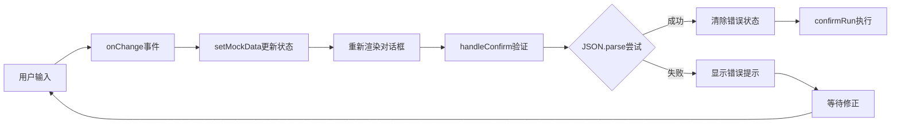

# 调试工具

<cite>
**本文档中引用的文件**
- [NodeDebugDialog.tsx](file://src/components/flow/NodeDebugDialog.tsx)
- [flowStore.ts](file://src/store/flowStore.ts)
- [flow.ts](file://src/types/flow.ts)
- [CustomNode.tsx](file://src/components/flow/CustomNode.tsx)
- [executionActions.ts](file://src/store/actions/executionActions.ts)
- [dialog.tsx](file://src/components/ui/dialog.tsx)
- [textarea.tsx](file://src/components/ui/textarea.tsx)
- [initialState.ts](file://src/store/constants/initialState.ts)
</cite>

## 目录
1. [简介](#简介)
2. [项目结构](#项目结构)
3. [核心组件](#核心组件)
4. [架构概览](#架构概览)
5. [详细组件分析](#详细组件分析)
6. [状态管理](#状态管理)
7. [JSON格式校验机制](#json格式校验机制)
8. [使用场景示例](#使用场景示例)
9. [用户体验优化](#用户体验优化)
10. [故障排除指南](#故障排除指南)
11. [总结](#总结)

## 简介

NodeDebugDialog是一个专门用于调试具有上游依赖节点的对话框组件，它允许开发者在运行时为节点提供模拟数据（mockData），以便在没有实际上游数据的情况下测试节点功能。该组件是Flash Flow SaaS平台调试系统的核心组成部分，提供了实时JSON格式校验、状态管理和用户交互优化等功能。

## 项目结构

NodeDebugDialog位于项目的flow组件目录中，与其他调试相关组件协同工作：



**图表来源**
- [NodeDebugDialog.tsx](file://src/components/flow/NodeDebugDialog.tsx#L1-L69)
- [flowStore.ts](file://src/store/flowStore.ts#L1-L131)

**章节来源**
- [NodeDebugDialog.tsx](file://src/components/flow/NodeDebugDialog.tsx#L1-L69)
- [flowStore.ts](file://src/store/flowStore.ts#L1-L131)

## 核心组件

NodeDebugDialog组件采用函数式React设计，集成了状态管理、UI组件和业务逻辑：

### 主要功能特性

1. **实时JSON格式校验** - 用户输入时即时验证JSON格式
2. **状态同步** - 与flowStore保持状态同步
3. **用户友好界面** - 提供清晰的错误提示和操作反馈
4. **智能初始化** - 根据节点类型预填充合适的模拟数据

### 组件架构



**图表来源**
- [NodeDebugDialog.tsx](file://src/components/flow/NodeDebugDialog.tsx#L9-L68)
- [flowStore.ts](file://src/store/flowStore.ts#L77-L114)

**章节来源**
- [NodeDebugDialog.tsx](file://src/components/flow/NodeDebugDialog.tsx#L9-L68)
- [flowStore.ts](file://src/store/flowStore.ts#L77-L114)

## 架构概览

NodeDebugDialog在整个应用架构中的位置和作用：



**图表来源**
- [CustomNode.tsx](file://src/components/flow/CustomNode.tsx#L84-L104)
- [NodeDebugDialog.tsx](file://src/components/flow/NodeDebugDialog.tsx#L20-L27)
- [flowStore.ts](file://src/store/flowStore.ts#L103-L114)

## 详细组件分析

### NodeDebugDialog组件实现

NodeDebugDialog组件实现了完整的调试对话框功能：

#### 状态管理集成

组件通过useFlowStore钩子访问全局状态：
- `debugModalOpen` - 控制对话框显示状态
- `debugMockData` - 存储用户输入的模拟数据
- `closeDebugModal` - 关闭对话框的回调函数
- `setDebugMockData` - 更新模拟数据的回调函数
- `confirmDebugRun` - 确认运行的回调函数

#### 用户界面设计

对话框采用简洁的设计模式：
- **标题栏**：显示"调试配置"标题
- **描述文本**：说明节点有上游依赖
- **文本区域**：用于输入JSON格式的模拟数据
- **错误提示**：格式错误时显示红色警告
- **操作按钮**：取消和确认运行两个按钮

#### 实时验证机制



**图表来源**
- [NodeDebugDialog.tsx](file://src/components/flow/NodeDebugDialog.tsx#L20-L27)

**章节来源**
- [NodeDebugDialog.tsx](file://src/components/flow/NodeDebugDialog.tsx#L9-L68)

### CustomNode智能测试逻辑

CustomNode组件实现了智能的节点测试逻辑：

#### 上游数据检查机制



**图表来源**
- [CustomNode.tsx](file://src/components/flow/CustomNode.tsx#L84-L104)

**章节来源**
- [CustomNode.tsx](file://src/components/flow/CustomNode.tsx#L84-L104)

## 状态管理

### FlowStore状态结构

flowStore维护了调试相关的状态：

| 状态字段 | 类型 | 默认值 | 描述 |
|---------|------|--------|------|
| debugModalOpen | boolean | false | 调试对话框是否打开 |
| debugMockData | string | "{}" | 当前模拟数据（JSON字符串） |
| debugNodeId | string \| null | null | 当前调试的节点ID |

### 状态更新流程



**图表来源**
- [flowStore.ts](file://src/store/flowStore.ts#L77-L114)

**章节来源**
- [flowStore.ts](file://src/store/flowStore.ts#L77-L114)
- [initialState.ts](file://src/store/constants/initialState.ts#L27-L29)

## JSON格式校验机制

### 实时验证实现

NodeDebugDialog实现了严格的JSON格式验证：

#### 验证逻辑

1. **用户输入监听** - 通过onChange事件监听用户输入
2. **即时解析尝试** - 使用JSON.parse()尝试解析输入内容
3. **错误捕获** - 捕获解析异常并显示错误提示
4. **状态同步** - 将验证结果同步到组件状态

#### 错误处理策略

- **格式错误**：显示"Invalid JSON format"警告
- **空输入**：允许空对象"{}"作为默认值
- **部分输入**：支持不完整的JSON结构（待完善时）

### 数据流图



**图表来源**
- [NodeDebugDialog.tsx](file://src/components/flow/NodeDebugDialog.tsx#L20-L27)

**章节来源**
- [NodeDebugDialog.tsx](file://src/components/flow/NodeDebugDialog.tsx#L20-L27)

## 使用场景示例

### 场景一：调试LLM节点

当需要调试一个等待上游API返回数据的LLM节点时：

#### 模拟数据构造

```typescript
// 假设LLM节点需要以下格式的输入
{
  "input": "Sample input for LLM",
  "context": {
    "previous_conversation": [
      {"role": "user", "content": "Hello"},
      {"role": "assistant", "content": "Hi there!"}
    ],
    "user_preferences": {
      "tone": "professional",
      "length": "medium"
    }
  }
}
```

#### 使用步骤

1. 在flowStore中打开调试对话框
2. 输入上述JSON格式的模拟数据
3. 点击确认运行开始调试
4. 观察LLM节点的响应输出

### 场景二：调试RAG节点

对于需要检索文档的RAG节点：

#### 模拟查询数据

```typescript
{
  "query": "如何设置密码？",
  "filters": {
    "category": "security",
    "priority": "high"
  },
  "metadata": {
    "timestamp": "2024-01-15T10:30:00Z",
    "user_id": "user123"
  }
}
```

### 场景三：调试HTTP节点

对于需要发送请求的HTTP节点：

#### 模拟请求数据

```typescript
{
  "endpoint": "/api/v1/users",
  "method": "POST",
  "headers": {
    "Authorization": "Bearer token123",
    "Content-Type": "application/json"
  },
  "body": {
    "username": "testuser",
    "email": "test@example.com"
  }
}
```

**章节来源**
- [flowStore.ts](file://src/store/flowStore.ts#L77-L96)

## 用户体验优化

### 界面设计优化建议

#### 1. JSON语法高亮

```typescript
// 建议实现的语法高亮功能
interface SyntaxHighlighterProps {
  value: string;
  language?: string;
  theme?: string;
}

// 可选的高亮方案
const highlightThemes = {
  monokai: "monokai-theme",
  github: "github-theme",
  vs: "vs-theme"
};
```

#### 2. 自动格式化功能

```typescript
// 自动格式化函数
const autoFormatJSON = (input: string): string => {
  try {
    const parsed = JSON.parse(input);
    return JSON.stringify(parsed, null, 2);
  } catch {
    return input; // 格式化失败时保持原样
  }
};
```

#### 3. 错误提示增强

```typescript
// 改进后的错误提示
const getValidationError = (error: Error): string => {
  const errorMessage = error.message.toLowerCase();
  
  if (errorMessage.includes("unexpected token")) {
    return "JSON语法错误：检查括号、引号匹配";
  } else if (errorMessage.includes("parse")) {
    return "JSON解析失败，请检查语法";
  }
  
  return "Invalid JSON format";
};
```

### 交互优化

#### 4. 快捷键支持

```typescript
// 键盘快捷键支持
const handleKeyDown = (event: KeyboardEvent) => {
  if (event.key === 'Enter' && event.ctrlKey) {
    handleConfirm();
  } else if (event.key === 'Escape') {
    close();
  }
};
```

#### 5. 预设模板功能

```typescript
// 预设模板集合
const presetTemplates = {
  llm: {
    input: "Sample input for LLM",
    context: {}
  },
  rag: {
    query: "Sample query for RAG",
    filters: {}
  },
  http: {
    endpoint: "",
    method: "GET",
    headers: {},
    body: {}
  }
};
```

### 性能优化

#### 6. 输入防抖处理

```typescript
// 防抖处理防止频繁验证
const debouncedSetMockData = useCallback(
  debounce((value: string) => setMockData(value), 300),
  []
);
```

#### 7. 大数据量处理

```typescript
// 大JSON数据的处理优化
const handleLargeJSON = (value: string): string => {
  if (value.length > 10000) {
    // 截断过长的JSON并显示警告
    return value.slice(0, 10000) + "...[截断]";
  }
  return value;
};
```

## 故障排除指南

### 常见问题及解决方案

#### 1. JSON格式错误

**问题症状**：输入有效JSON但仍然显示"Invalid JSON format"

**可能原因**：
- 包含不可见字符（BOM标记）
- 字符编码问题
- 特殊字符未转义

**解决方案**：
```typescript
// 清理输入数据
const cleanJSONInput = (input: string): string => {
  return input
    .replace(/^\uFEFF/, '') // 移除BOM标记
    .replace(/[\u0000-\u001F\u007F]/g, ''); // 移除控制字符
};
```

#### 2. 对话框无法关闭

**问题症状**：点击关闭按钮后对话框仍然显示

**解决方案**：
检查onOpenChange回调的正确实现：
```typescript
<Dialog 
  open={open} 
  onOpenChange={(val) => { 
    if (!val) { 
      setError(null); 
      close(); 
    } 
  }}
>
```

#### 3. 模拟数据未生效

**问题症状**：输入模拟数据后节点仍然报错

**排查步骤**：
1. 检查JSON格式是否正确
2. 确认节点类型匹配
3. 验证数据结构符合预期

**章节来源**
- [NodeDebugDialog.tsx](file://src/components/flow/NodeDebugDialog.tsx#L30-L31)
- [flowStore.ts](file://src/store/flowStore.ts#L103-L114)

## 总结

NodeDebugDialog是一个功能完善且设计精良的调试工具，它解决了在复杂工作流中调试具有上游依赖节点的核心问题。通过实时JSON格式校验、智能状态管理和用户友好的界面设计，该组件为开发者提供了强大的调试能力。

### 主要优势

1. **实时验证** - 用户输入时即时反馈JSON格式问题
2. **智能初始化** - 根据节点类型预填充合适的模拟数据
3. **状态同步** - 与全局状态保持完美同步
4. **用户体验** - 清晰的错误提示和直观的操作界面

### 技术特点

1. **函数式组件** - 使用React Hooks实现状态管理
2. **类型安全** - 完整的TypeScript类型定义
3. **性能优化** - 合理的状态更新和渲染优化
4. **可扩展性** - 易于添加新的节点类型支持

### 应用价值

NodeDebugDialog不仅提高了开发效率，还降低了调试成本，使开发者能够更快速地定位和解决问题，是现代可视化编程平台不可或缺的重要组件。