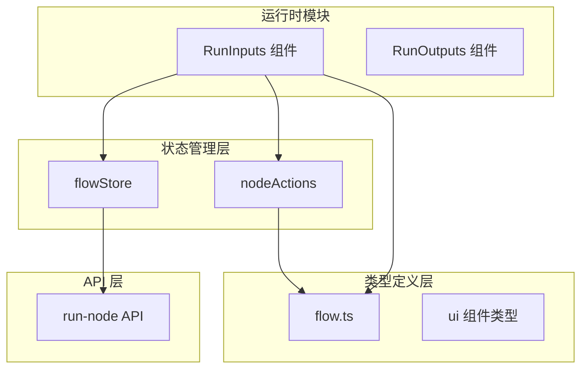
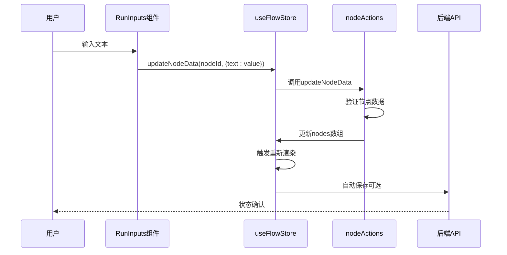
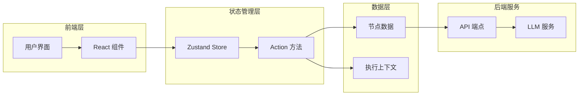
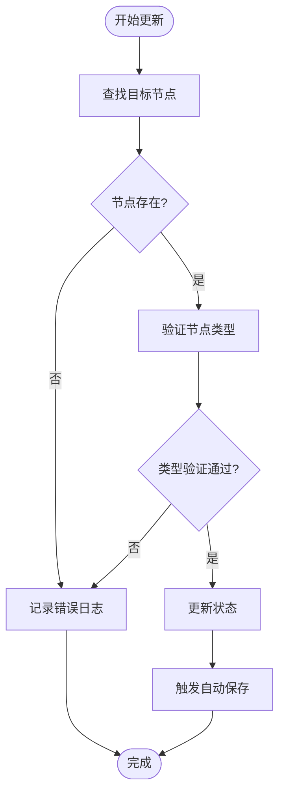
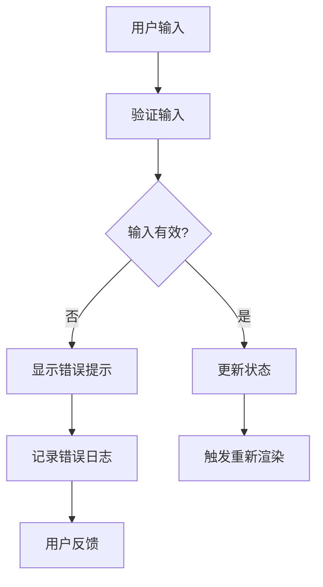
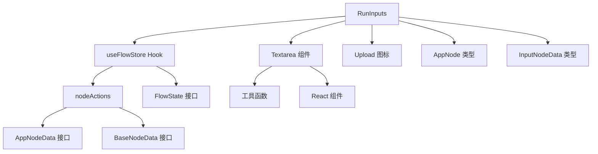

# 输入管理

<cite>
**本文档中引用的文件**
- [RunInputs.tsx](file://src/components/run/RunInputs.tsx)
- [flowStore.ts](file://src/store/flowStore.ts)
- [nodeActions.ts](file://src/store/actions/nodeActions.ts)
- [flow.ts](file://src/types/flow.ts)
- [textarea.tsx](file://src/components/ui/textarea.tsx)
- [InputPromptDialog.tsx](file://src/components/flow/InputPromptDialog.tsx)
- [executionActions.ts](file://src/store/actions/executionActions.ts)
- [route.ts](file://src/app/api/run-node/route.ts)
</cite>

## 目录
1. [简介](#简介)
2. [项目结构](#项目结构)
3. [核心组件](#核心组件)
4. [架构概览](#架构概览)
5. [详细组件分析](#详细组件分析)
6. [依赖关系分析](#依赖关系分析)
7. [性能考虑](#性能考虑)
8. [故障排除指南](#故障排除指南)
9. [结论](#结论)

## 简介

RunInputs组件是Flash Flow系统中负责处理用户输入的核心组件，它根据节点的label字段动态判断输入类型（文本或文件），并通过useFlowStore的updateNodeData方法实现Textarea的受控行为。该组件采用智能的UI切换机制，通过toLowerCase().includes('file')逻辑自动识别文件类型的输入节点，并提供相应的用户界面。

## 项目结构

RunInputs组件位于系统的运行时模块中，与状态管理、类型定义和UI组件紧密集成：



**图表来源**
- [RunInputs.tsx](file://src/components/run/RunInputs.tsx#L1-L38)
- [flowStore.ts](file://src/store/flowStore.ts#L1-L131)
- [nodeActions.ts](file://src/store/actions/nodeActions.ts#L1-L93)

**章节来源**
- [RunInputs.tsx](file://src/components/run/RunInputs.tsx#L1-L38)
- [flowStore.ts](file://src/store/flowStore.ts#L1-L131)

## 核心组件

### RunInputs 组件架构

RunInputs组件采用函数式组件设计，接收inputNodes作为prop参数，通过map方法遍历所有输入节点并渲染相应的UI元素。

#### 主要特性：
- **动态类型检测**：基于节点label字段的智能判断
- **受控组件模式**：通过useFlowStore实现全局状态同步
- **条件渲染**：根据输入类型显示不同的UI组件
- **实时状态更新**：用户输入即时反映到全局状态

#### 数据流架构：



**图表来源**
- [RunInputs.tsx](file://src/components/run/RunInputs.tsx#L26-L27)
- [nodeActions.ts](file://src/store/actions/nodeActions.ts#L25-L67)
- [flowStore.ts](file://src/store/flowStore.ts#L49-L75)

**章节来源**
- [RunInputs.tsx](file://src/components/run/RunInputs.tsx#L1-L38)
- [nodeActions.ts](file://src/store/actions/nodeActions.ts#L25-L67)

## 架构概览

### 系统架构图



**图表来源**
- [flowStore.ts](file://src/store/flowStore.ts#L17-L126)
- [executionActions.ts](file://src/store/actions/executionActions.ts#L1-L207)

## 详细组件分析

### RunInputs 组件实现机制

#### 动态类型判断逻辑

组件使用智能的字符串匹配算法来判断输入类型：

```typescript
(String(node.data.label || "")).toLowerCase().includes("file")
```

这个逻辑的工作原理：
1. **类型安全转换**：将node.data.label转换为字符串
2. **统一大小写**：使用toLowerCase()确保匹配不区分大小写
3. **包含性检查**：通过includes('file')检测是否包含文件相关关键词

#### 受控组件实现

Textarea组件采用受控组件模式，通过以下方式实现：

```typescript
<Textarea
  placeholder={val ? undefined : "输入文本…"}
  value={val}
  onChange={(e) => updateNodeData(node.id, { text: e.target.value })}
  className="min-h-[100px] resize-none bg-gray-50 border-gray-200 focus:border-black focus:ring-black/5"
/>
```

关键特性：
- **双向绑定**：value属性绑定到节点数据
- **实时更新**：onChange事件触发状态更新
- **样式控制**：自定义CSS类实现一致的视觉效果

#### 文件输入处理

对于文件类型的输入节点，组件渲染专门的文件上传界面：

```typescript
<div className="border-2 border-dashed border-gray-200 rounded-xl p-8 flex flex-col items-center justify-center gap-2 text-gray-400 hover:border-black/20 hover:bg-gray-50 transition-colors cursor-pointer">
  <Upload className="w-6 h-6" />
  <span className="text-xs">拖拽文件到此或点击上传</span>
</div>
```

这种设计的优势：
- **直观的用户界面**：明确的文件上传指示器
- **响应式交互**：hover状态提供视觉反馈
- **无障碍设计**：支持键盘导航和屏幕阅读器

**章节来源**
- [RunInputs.tsx](file://src/components/run/RunInputs.tsx#L14-L31)
- [textarea.tsx](file://src/components/ui/textarea.tsx#L1-L19)

### 状态管理机制

#### useFlowStore集成

组件通过useFlowStore钩子访问全局状态：

```typescript
const updateNodeData = useFlowStore((s) => s.updateNodeData);
```

这种方式的优势：
- **单一状态源**：所有节点数据集中管理
- **响应式更新**：状态变化自动触发重新渲染
- **时间旅行调试**：支持状态历史追踪

#### updateNodeData方法详解

nodeActions中的updateNodeData方法实现了复杂的状态更新逻辑：



**图表来源**
- [nodeActions.ts](file://src/store/actions/nodeActions.ts#L25-L67)

**章节来源**
- [nodeActions.ts](file://src/store/actions/nodeActions.ts#L25-L67)
- [flowStore.ts](file://src/store/flowStore.ts#L17-L126)

### 输入验证与错误处理

#### 类型验证机制

系统在多个层面实施输入验证：

1. **节点类型验证**：针对不同节点类型验证特定字段
2. **数据格式验证**：确保数据符合预期格式
3. **边界条件检查**：处理空值和无效输入

#### 错误处理策略



**图表来源**
- [nodeActions.ts](file://src/store/actions/nodeActions.ts#L32-L58)

**章节来源**
- [nodeActions.ts](file://src/store/actions/nodeActions.ts#L32-L58)

## 依赖关系分析

### 组件间依赖关系



**图表来源**
- [RunInputs.tsx](file://src/components/run/RunInputs.tsx#L1-L6)
- [flowStore.ts](file://src/store/flowStore.ts#L17-L126)
- [nodeActions.ts](file://src/store/actions/nodeActions.ts#L1-L93)

### 外部依赖

主要外部依赖包括：
- **Zustand**：轻量级状态管理库
- **Lucide React**：图标库
- **Next.js**：React框架
- **TypeScript**：类型安全

**章节来源**
- [RunInputs.tsx](file://src/components/run/RunInputs.tsx#L1-L6)
- [flowStore.ts](file://src/store/flowStore.ts#L1-L131)

## 性能考虑

### 渲染优化策略

1. **条件渲染**：只渲染必要的UI元素
2. **状态分片**：避免不必要的重新渲染
3. **记忆化**：缓存计算结果

### 内存管理

- **及时清理**：组件卸载时清理事件监听器
- **弱引用**：避免循环引用导致的内存泄漏
- **懒加载**：按需加载非关键资源

### 网络优化

- **防抖处理**：自动保存操作使用防抖技术
- **批量更新**：合并多个状态变更请求
- **缓存策略**：合理利用浏览器缓存

## 故障排除指南

### 常见问题及解决方案

#### 输入未保存问题

**症状**：用户输入后刷新页面发现数据丢失

**原因分析**：
- 自动保存功能未正确触发
- 网络连接中断导致保存失败
- 浏览器缓存问题

**解决方案**：
1. 检查网络连接状态
2. 验证自动保存定时器设置
3. 查看浏览器控制台错误日志
4. 手动触发保存操作

#### 状态不同步问题

**症状**：UI显示与实际状态不一致

**诊断步骤**：
1. 使用React DevTools检查组件状态
2. 验证useFlowStore的订阅机制
3. 检查updateNodeData调用链
4. 确认节点ID的唯一性

**解决方法**：
- 强制重新渲染相关组件
- 重置状态并重新加载
- 检查节点数据的序列化/反序列化

#### 文件上传失败

**症状**：文件上传界面无法正常工作

**排查清单**：
- 检查文件类型限制
- 验证文件大小限制
- 确认文件读取权限
- 检查网络代理设置

### 调试技巧

#### 开发者工具使用

1. **Redux DevTools**：监控状态变化
2. **React Profiler**：分析渲染性能
3. **Network Tab**：检查API请求
4. **Console Logs**：跟踪执行流程

#### 日志记录最佳实践

```typescript
// 在关键位置添加日志
console.log('Updating node data:', { nodeId, newData });
console.error('Node not found:', nodeId);
```

**章节来源**
- [nodeActions.ts](file://src/store/actions/nodeActions.ts#L26-L30)
- [flowStore.ts](file://src/store/flowStore.ts#L49-L75)

## 结论

RunInputs组件展现了现代React应用中状态管理和用户界面设计的最佳实践。通过智能的类型检测、受控组件模式和响应式状态管理，该组件成功地实现了灵活且用户友好的输入处理机制。

### 关键优势

1. **智能识别**：基于标签的自动化类型判断
2. **实时同步**：受控组件确保状态一致性
3. **用户体验**：直观的文件上传界面
4. **可扩展性**：清晰的架构便于功能扩展

### 改进建议

1. **类型安全**：进一步强化TypeScript类型定义
2. **性能优化**：实施更精细的渲染控制
3. **错误处理**：增强用户友好的错误提示
4. **测试覆盖**：增加单元测试和集成测试

该组件为Flash Flow系统提供了坚实的基础，支持复杂的流程编排和执行需求，是整个系统架构中的重要组成部分。