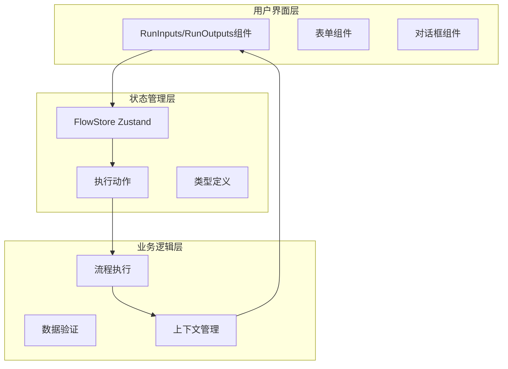
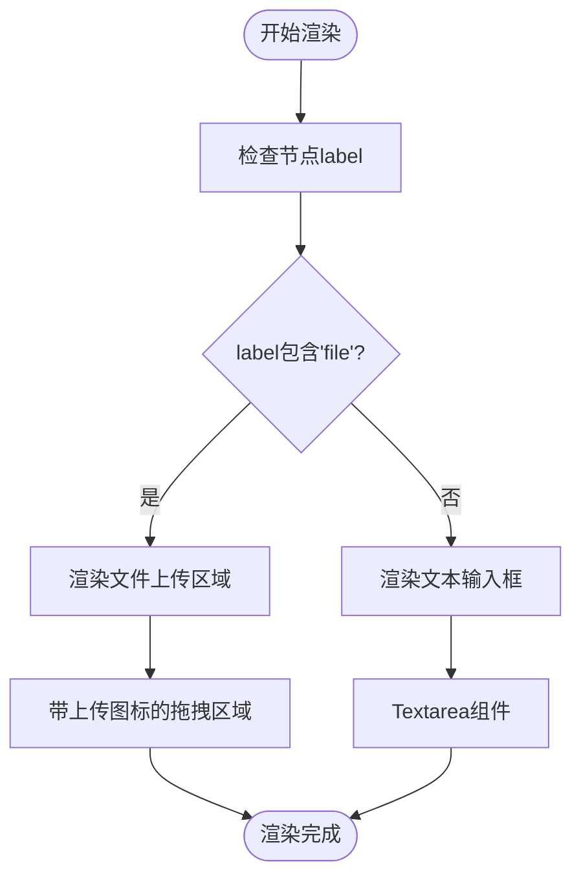
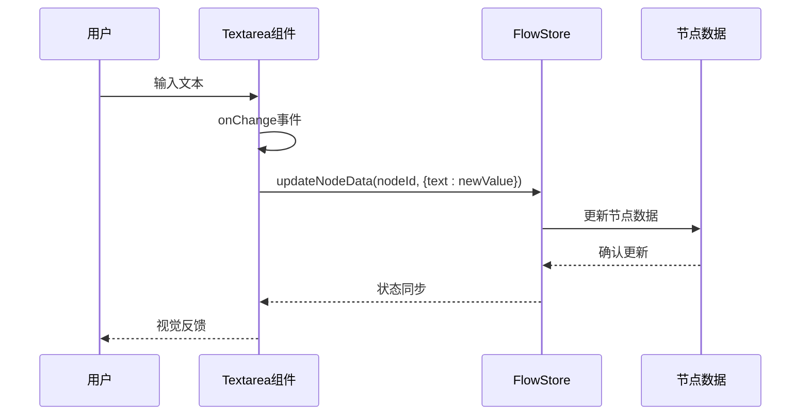
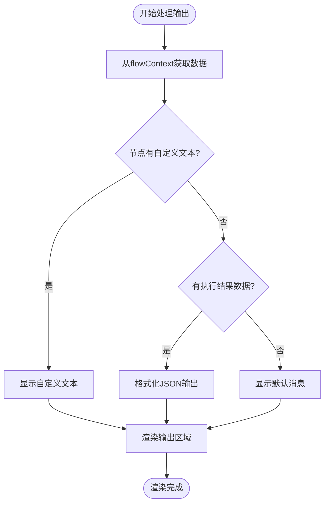
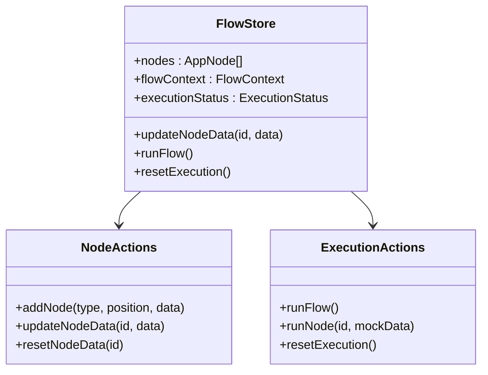
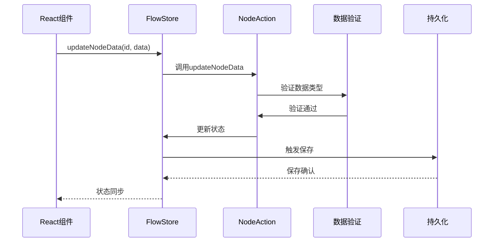
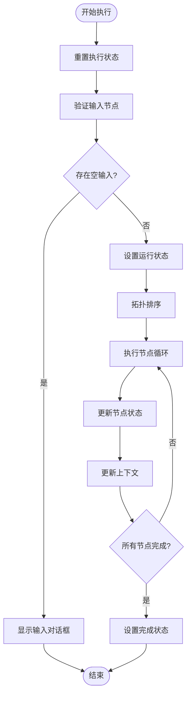
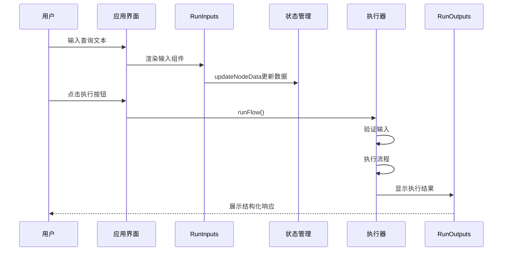
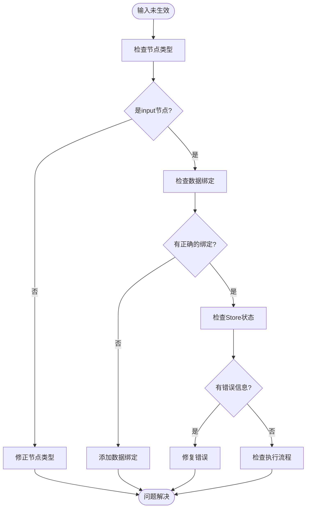

# 输入输出管理

<cite>
**本文档中引用的文件**
- [RunInputs.tsx](file://src/components/run/RunInputs.tsx)
- [RunOutputs.tsx](file://src/components/run/RunOutputs.tsx)
- [flowStore.ts](file://src/store/flowStore.ts)
- [executionActions.ts](file://src/store/actions/executionActions.ts)
- [nodeActions.ts](file://src/store/actions/nodeActions.ts)
- [flow.ts](file://src/types/flow.ts)
- [textarea.tsx](file://src/components/ui/textarea.tsx)
- [page.tsx](file://src/app/app/page.tsx)
- [InputPromptDialog.tsx](file://src/components/flow/InputPromptDialog.tsx)
</cite>

## 目录
1. [简介](#简介)
2. [项目架构概览](#项目架构概览)
3. [RunInputs组件详解](#runinputs组件详解)
4. [RunOutputs组件详解](#runoutputs组件详解)
5. [状态管理机制](#状态管理机制)
6. [流程执行机制](#流程执行机制)
7. [实际使用示例](#实际使用示例)
8. [常见问题排查](#常见问题排查)
9. [总结](#总结)

## 简介

Flash Flow是一个基于React和Next.js构建的可视化流程设计器，提供了完整的输入输出管理机制。该系统通过RunInputs和RunOutputs两个核心组件，实现了灵活的节点数据输入和输出展示功能，支持文本输入、文件上传、结构化数据处理等多种场景。

## 项目架构概览

系统采用分层架构设计，主要包含以下核心模块：

**图表来源**
- [RunInputs.tsx](file://src/components/run/RunInputs.tsx#L1-L38)
- [RunOutputs.tsx](file://src/components/run/RunOutputs.tsx#L1-L26)
- [flowStore.ts](file://src/store/flowStore.ts#L17-L131)

## RunInputs组件详解

### 组件功能概述

RunInputs组件负责渲染流程中的输入节点，根据节点类型动态决定是显示文本输入框还是文件上传区域。

### 核心实现机制

#### 节点类型判断与UI渲染

组件通过检查节点的`label`字段来判断是否为文件输入：

**图表来源**
- [RunInputs.tsx](file://src/components/run/RunInputs.tsx#L14-L32)

#### 受控组件实现

文本输入框采用受控组件模式，通过`updateNodeData`方法实时更新节点数据：

**图表来源**
- [RunInputs.tsx](file://src/components/run/RunInputs.tsx#L26-L27)
- [nodeActions.ts](file://src/store/actions/nodeActions.ts#L25-L67)

### 文件上传功能

对于标记为文件的输入节点，组件提供拖拽式文件上传功能：

- **视觉提示**：显示上传图标和文字说明
- **交互行为**：支持鼠标悬停效果和点击上传
- **样式设计**：采用虚线边框和居中布局

**章节来源**
- [RunInputs.tsx](file://src/components/run/RunInputs.tsx#L14-L19)

## RunOutputs组件详解

### 组件功能概述

RunOutputs组件负责展示流程执行后的输出结果，支持纯文本和JSON格式化两种展示模式。

### 输出数据处理机制

#### 数据获取与展示策略

**图表来源**
- [RunOutputs.tsx](file://src/components/run/RunOutputs.tsx#L8-L21)

#### 多格式输出支持

组件根据不同的数据类型提供相应的展示方式：

| 数据类型 | 展示方式 | 格式化选项 |
|---------|---------|-----------|
| 自定义文本 | 直接显示 | 无 |
| 对象数据 | JSON格式化 | 缩进2字符 |
| 数组数据 | JSON格式化 | 缩进2字符 |
| 字符串数据 | 原始字符串 | 保持原样 |
| 未定义数据 | 默认消息 | "处理完成。" |

### 样式与交互设计

输出区域采用卡片式设计，包含：
- **标题栏**：显示节点标签和文件图标
- **内容区**：支持换行和预格式化文本
- **边框样式**：灰色边框和圆角设计
- **字体设置**：小号字体和灰色文字

**章节来源**
- [RunOutputs.tsx](file://src/components/run/RunOutputs.tsx#L12-L21)

## 状态管理机制

### Zustand Store架构

系统使用Zustand作为状态管理解决方案，提供全局状态管理和动作分发：

**图表来源**
- [flowStore.ts](file://src/store/flowStore.ts#L17-L131)
- [nodeActions.ts](file://src/store/actions/nodeActions.ts#L5-L92)

### 数据流管理

#### 节点数据更新流程

**图表来源**
- [nodeActions.ts](file://src/store/actions/nodeActions.ts#L25-L67)
- [flowStore.ts](file://src/store/flowStore.ts#L50-L75)

### 上下文数据管理

FlowContext作为流程执行过程中的全局上下文，存储各节点的执行结果：

- **键值对结构**：以节点ID为键，执行结果为值
- **类型安全**：使用Record<string, unknown>确保类型安全
- **实时更新**：每次节点执行完成后自动更新

**章节来源**
- [flow.ts](file://src/types/flow.ts#L79-L81)

## 流程执行机制

### 执行流程控制

系统采用拓扑排序算法确保节点按正确顺序执行：

**图表来源**
- [executionActions.ts](file://src/store/actions/executionActions.ts#L23-L180)

### 节点类型处理

不同类型的节点采用不同的处理策略：

| 节点类型 | 处理方式 | 输出格式 |
|---------|---------|---------|
| input | 使用用户输入 | 文本对象 |
| llm | 调用API | 响应对象 |
| rag | 模拟检索 | 文档列表 |
| http | 模拟请求 | 响应对象 |
| output | 提取上游数据 | 文本或JSON |

### 错误处理机制

系统提供完善的错误处理和恢复机制：

- **输入验证**：检查必填字段和数据格式
- **执行监控**：跟踪每个节点的执行状态
- **异常捕获**：捕获并记录执行过程中的错误
- **状态回滚**：失败时恢复到初始状态

**章节来源**
- [executionActions.ts](file://src/store/actions/executionActions.ts#L26-L37)
- [executionActions.ts](file://src/store/actions/executionActions.ts#L173-L179)

## 实际使用示例

### 用户输入查询场景

以下是一个典型的用户输入查询流程：

**图表来源**
- [page.tsx](file://src/app/app/page.tsx#L118-L144)
- [InputPromptDialog.tsx](file://src/components/flow/InputPromptDialog.tsx#L19-L31)

### 文件上传处理示例

对于文件上传节点，系统提供完整的文件处理流程：

1. **文件选择**：用户通过拖拽或点击选择文件
2. **数据转换**：将文件转换为节点可识别的数据格式
3. **状态更新**：更新节点状态并触发重新渲染
4. **流程传递**：将文件数据传递给下游节点

### 结构化响应展示

系统能够优雅地处理各种类型的输出数据：

- **简单文本**：直接显示用户友好的消息
- **复杂对象**：使用JSON格式化显示详细信息
- **数组数据**：逐项展示列表内容
- **错误信息**：提供清晰的错误描述

**章节来源**
- [page.tsx](file://src/app/app/page.tsx#L70-L116)

## 常见问题排查

### 输入未生效问题

#### 问题表现
- 用户输入后看不到预期的效果
- 节点数据没有更新
- 执行时使用默认值而非用户输入

#### 排查步骤

#### 解决方案

1. **验证节点类型**：确保节点类型为`input`
2. **检查数据绑定**：确认`updateNodeData`调用正确
3. **调试状态变化**：使用浏览器开发者工具检查状态更新
4. **验证输入格式**：确保输入数据符合预期格式

### 输出显示undefined问题

#### 问题表现
- 输出区域显示"undefined"或空白
- JSON格式化显示"undefined"
- 执行结果显示为空

#### 排查方法

| 检查项目 | 检查方法 | 预期结果 |
|---------|---------|---------|
| 上下文数据 | 检查flowContext | 包含节点输出 |
| 节点连接 | 验证节点间连线 | 正确连接 |
| 输出节点配置 | 检查output节点 | 正确配置 |
| 数据提取逻辑 | 验证数据获取 | 返回有效数据 |

#### 修复建议

1. **验证节点连接**：确保输出节点正确连接到上游节点
2. **检查数据格式**：确认上游节点产生有效的输出数据
3. **调试数据流**：使用console.log跟踪数据传递过程
4. **验证类型转换**：确保数据能正确转换为字符串

### 性能优化建议

#### 输入响应优化

- **防抖处理**：对频繁的输入操作使用防抖
- **增量更新**：只更新变化的部分
- **虚拟化**：大量输入时使用虚拟滚动

#### 输出渲染优化

- **懒加载**：大数据量输出采用懒加载
- **缓存机制**：缓存计算结果避免重复计算
- **分页显示**：大量数据采用分页展示

**章节来源**
- [executionActions.ts](file://src/store/actions/executionActions.ts#L26-L37)
- [RunOutputs.tsx](file://src/components/run/RunOutputs.tsx#L17-L18)

## 总结

Flash Flow的输入输出管理系统通过精心设计的组件架构和状态管理模式，提供了强大而灵活的数据处理能力。RunInputs组件通过智能的UI渲染和受控组件实现，支持多种输入场景；RunOutputs组件则通过灵活的数据处理和格式化机制，确保输出结果的可读性和实用性。

系统的模块化设计使得各个组件职责明确，易于维护和扩展。Zustand状态管理提供了高效的状态同步机制，而完善的错误处理和验证机制确保了系统的稳定性和可靠性。

通过本文档的详细说明，开发者可以深入理解系统的运作原理，并能够有效地使用和扩展输入输出管理功能，为用户提供优秀的流程设计和执行体验。