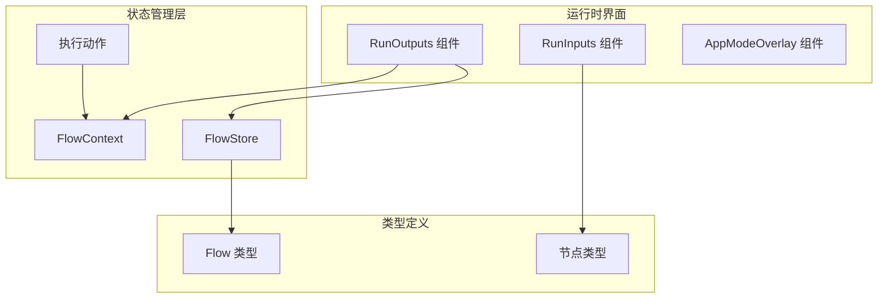
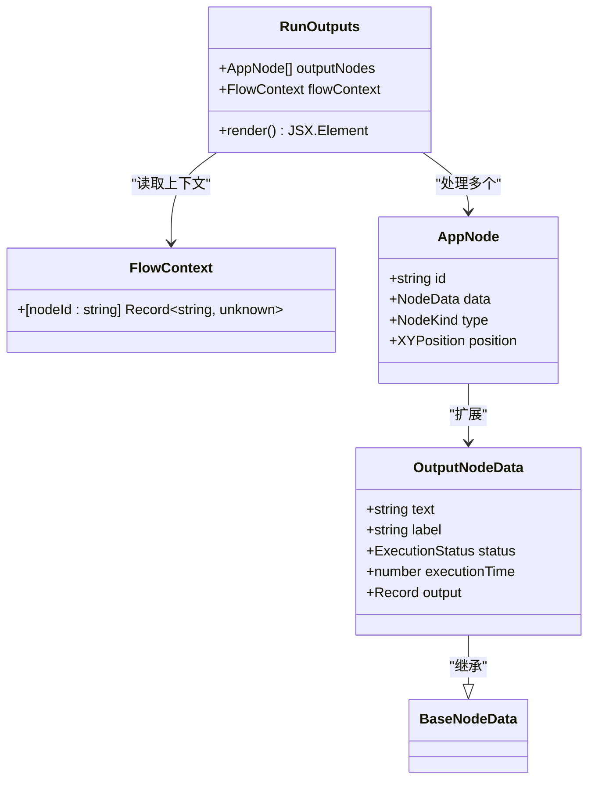
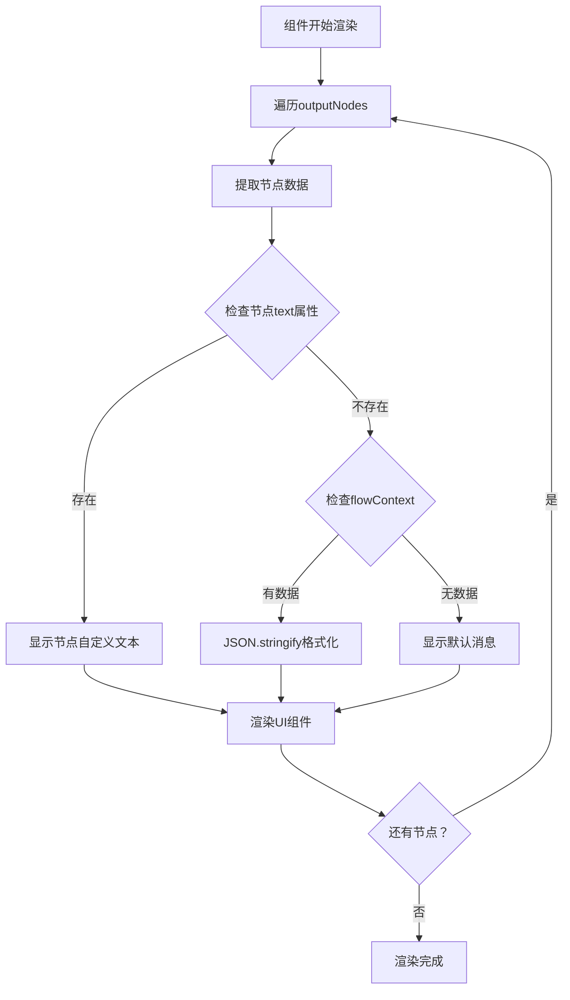
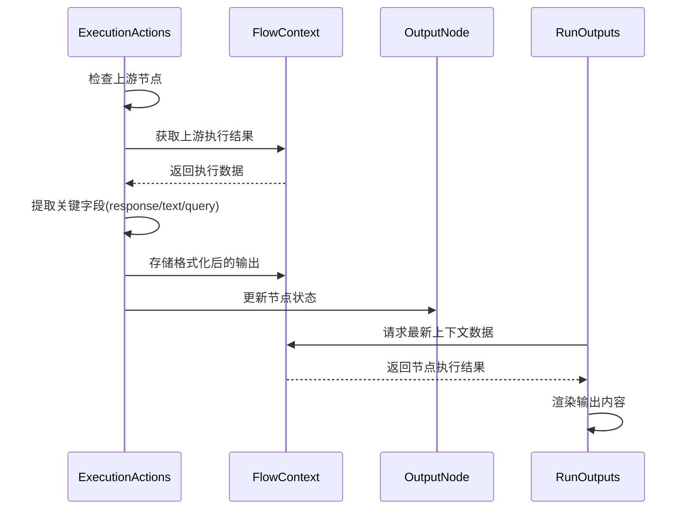
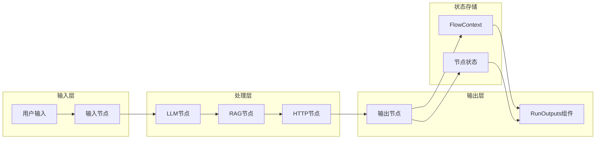
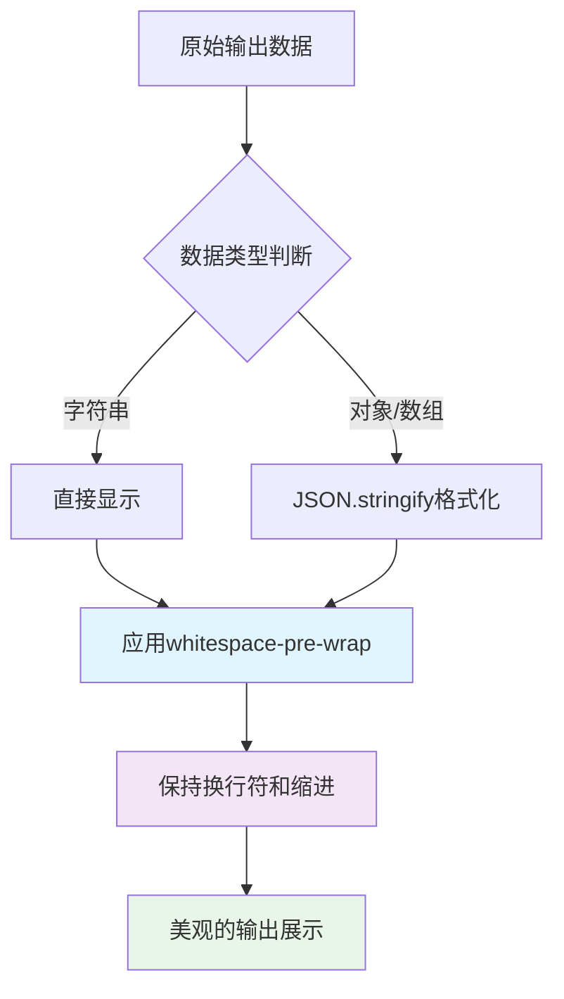
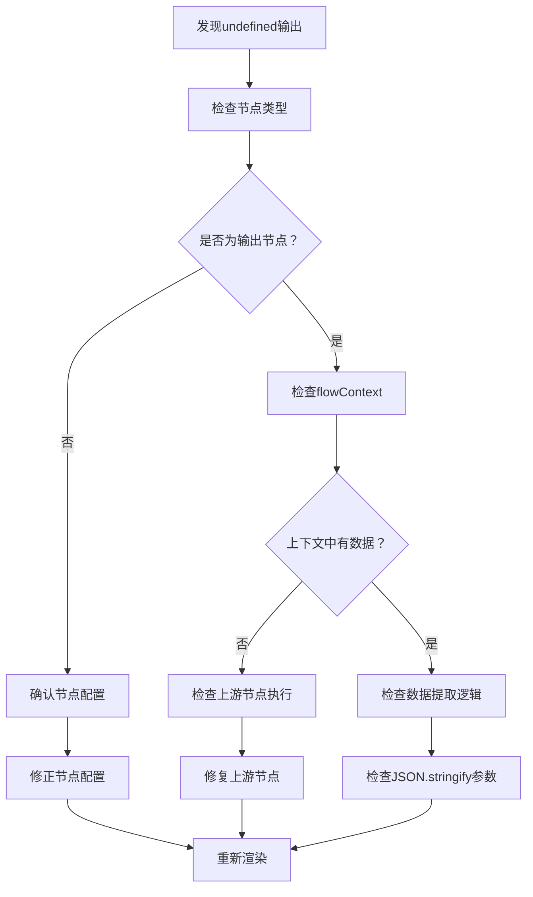

# 输出管理

<cite>
**本文档中引用的文件**
- [RunOutputs.tsx](file://src/components/run/RunOutputs.tsx)
- [flow.ts](file://src/types/flow.ts)
- [executionActions.ts](file://src/store/actions/executionActions.ts)
- [AppModeOverlay.tsx](file://src/components/builder/AppModeOverlay.tsx)
- [globals.css](file://src/app/globals.css)
- [CustomNode.tsx](file://src/components/flow/CustomNode.tsx)
- [ContextHUD.tsx](file://src/components/builder/ContextHUD.tsx)
</cite>

## 目录
1. [简介](#简介)
2. [项目结构概览](#项目结构概览)
3. [核心组件分析](#核心组件分析)
4. [架构设计](#架构设计)
5. [详细组件分析](#详细组件分析)
6. [数据流分析](#数据流分析)
7. [样式系统](#样式系统)
8. [使用场景与最佳实践](#使用场景与最佳实践)
9. [故障排除指南](#故障排除指南)
10. [性能优化建议](#性能优化建议)
11. [总结](#总结)

## 简介

RunOutputs组件是Flash Flow平台中负责展示流程执行结果的核心组件。它从flowContext中按节点ID提取执行结果，并根据节点类型和数据特性智能地渲染输出内容。该组件采用优先显示节点自身text数据的策略，当节点未设置自定义文本时，自动格式化展示flowContext中对应的执行结果。

## 项目结构概览

Flash Flow项目采用模块化的架构设计，RunOutputs组件位于运行时界面的核心位置：



**图表来源**
- [RunOutputs.tsx](file://src/components/run/RunOutputs.tsx#L1-L26)
- [flow.ts](file://src/types/flow.ts#L78-L81)

## 核心组件分析

### RunOutputs组件架构

RunOutputs组件是一个简洁而高效的输出展示组件，其核心功能包括：

- **节点映射渲染**：遍历outputNodes数组，为每个输出节点创建独立的展示区域
- **数据优先级处理**：优先使用节点自身的text属性，回退到flowContext中的执行结果
- **智能格式化**：对复杂数据结构使用JSON.stringify进行美观的格式化展示
- **样式一致性**：统一的UI样式和布局规范

**章节来源**
- [RunOutputs.tsx](file://src/components/run/RunOutputs.tsx#L5-L24)

## 架构设计

### 组件层次结构



**图表来源**
- [RunOutputs.tsx](file://src/components/run/RunOutputs.tsx#L3-L4)
- [flow.ts](file://src/types/flow.ts#L34-L37)
- [flow.ts](file://src/types/flow.ts#L78-L81)

## 详细组件分析

### 数据提取与渲染逻辑

RunOutputs组件采用了智能的数据提取和渲染策略：



**图表来源**
- [RunOutputs.tsx](file://src/components/run/RunOutputs.tsx#L8-L19)

### 执行动作中的输出处理

在执行过程中，系统通过executionActions处理输出节点的数据：



**图表来源**
- [executionActions.ts](file://src/store/actions/executionActions.ts#L110-L134)

**章节来源**
- [executionActions.ts](file://src/store/actions/executionActions.ts#L110-L134)

## 数据流分析

### 输出数据流向

输出数据在系统中的流转遵循清晰的路径：



**图表来源**
- [executionActions.ts](file://src/store/actions/executionActions.ts#L67-L134)

### 上下文数据结构

FlowContext采用键值对结构存储各节点的执行结果：

| 属性 | 类型 | 描述 |
|------|------|------|
| nodeId | string | 节点唯一标识符 |
| value | Record<string, unknown> | 节点执行结果对象 |

这种设计允许：
- 快速按节点ID检索执行结果
- 支持任意复杂的数据结构存储
- 维护节点间的执行依赖关系

**章节来源**
- [flow.ts](file://src/types/flow.ts#L78-L81)

## 样式系统

### whitespace-pre-wrap样式的作用

whitespace-pre-wrap样式在输出显示中发挥关键作用：



**图表来源**
- [RunOutputs.tsx](file://src/components/run/RunOutputs.tsx#L17)

### CSS样式配置

组件使用Tailwind CSS类名确保一致的视觉体验：

| 类名 | 用途 | 效果 |
|------|------|------|
| bg-gray-50 | 背景颜色 | 浅灰色背景 |
| rounded-xl | 圆角 | 大圆角边框 |
| p-4 | 内边距 | 16px内边距 |
| border border-gray-200 | 边框 | 浅灰色边框 |
| space-y-2 | 间距 | 纵向间距8px |

**章节来源**
- [RunOutputs.tsx](file://src/components/run/RunOutputs.tsx#L11-L20)
- [globals.css](file://src/app/globals.css#L1-L201)

## 使用场景与最佳实践

### LLM节点JSON响应美化示例

当LLM节点返回JSON格式的响应时，RunOutputs组件能够提供出色的美化效果：

**输入数据结构：**
```typescript
{
  "response": {
    "status": "success",
    "data": {
      "items": [
        { "id": 1, "name": "Item 1", "price": 100 },
        { "id": 2, "name": "Item 2", "price": 200 }
      ]
    },
    "metadata": {
      "timestamp": "2024-01-01T00:00:00Z",
      "version": "1.0"
    }
  }
}
```

**输出效果：**
- 自动检测JSON结构
- 应用2字符缩进格式化
- 保持原始数据完整性
- 支持嵌套对象和数组的层级展示

### 实际应用场景

1. **聊天机器人对话记录**
   - 显示AI生成的完整对话历史
   - 支持多轮对话的结构化展示

2. **API调用结果**
   - 格式化REST API响应
   - 显示错误详情和状态码

3. **数据处理结果**
   - 展示ETL流程的中间结果
   - 显示数据分析的最终报告

## 故障排除指南

### 常见问题及解决方案

#### 1. 输出显示undefined的问题

**问题症状：**
- 输出区域显示"undefined"文本
- 节点没有正确显示执行结果

**排查步骤：**


**解决方案：**
- 验证节点是否正确配置为输出类型
- 检查上游节点是否成功执行并产生输出
- 确认flowContext中是否存在对应节点的数据

#### 2. 空值处理逻辑

当flowContext中对应节点没有数据时，组件会优雅地处理：

```typescript
// 空值处理逻辑
{textData ? textData : outputData ? JSON.stringify(outputData, null, 2) : "处理完成。"}
```

**处理策略：**
- 优先显示节点自定义文本
- 回退到格式化显示执行结果
- 最终显示默认完成消息

#### 3. JSON格式化异常

**问题：** 对于循环引用的对象无法正确格式化

**解决方案：**
- 在数据准备阶段移除循环引用
- 使用自定义replacer函数处理特殊对象
- 提供错误边界防止应用崩溃

**章节来源**
- [RunOutputs.tsx](file://src/components/run/RunOutputs.tsx#L17)

## 性能优化建议

### 输出预览功能增强

为了提升用户体验，可以考虑以下增强功能：

#### 1. Markdown渲染支持

```typescript
// 增强版输出组件示例
const EnhancedRunOutputs = ({ outputNodes, flowContext }: Props) => {
  const renderContent = (content: any) => {
    if (typeof content === 'string' && content.startsWith('```')) {
      // 支持Markdown代码块
      return <MarkdownRenderer content={content} />;
    }
    return <pre>{JSON.stringify(content, null, 2)}</pre>;
  };
};
```

#### 2. 日志分级显示

```typescript
// 日志级别分类
const LOG_LEVELS = {
  ERROR: 'error',
  WARN: 'warn',
  INFO: 'info',
  DEBUG: 'debug'
};

const categorizeOutput = (data: any) => {
  if (data.level === LOG_LEVELS.ERROR) {
    return { className: 'text-red-600', icon: '❌' };
  }
  if (data.level === LOG_LEVELS.WARN) {
    return { className: 'text-yellow-600', icon: '⚠️' };
  }
  return { className: 'text-gray-600', icon: 'ℹ️' };
};
```

#### 3. 大数据量优化

对于大型数据结构，建议实现虚拟滚动：

```typescript
// 虚拟滚动实现
const VirtualizedRunOutputs = ({ outputNodes, flowContext }: Props) => {
  const renderItem = useCallback((item: any) => {
    // 只渲染可见区域的内容
    return <OutputItem data={item} />;
  }, []);

  return (
    <VirtualList
      items={outputNodes}
      renderItem={renderItem}
      overscan={5}
    />
  );
};
```

### 渲染性能优化

1. **记忆化处理**：使用React.memo避免不必要的重新渲染
2. **分批渲染**：大量输出节点时采用分批加载
3. **懒加载**：延迟渲染非关键输出内容

## 总结

RunOutputs组件作为Flash Flow平台的核心输出展示组件，展现了优秀的架构设计和用户体验。其主要特点包括：

### 核心优势

1. **智能数据优先级**：优先显示节点自定义文本，提供灵活的输出控制
2. **优雅的格式化**：自动识别数据类型并应用适当的展示方式
3. **一致的样式体系**：基于Tailwind CSS的现代化UI设计
4. **健壮的错误处理**：完善的空值和异常情况处理机制

### 技术亮点

- **类型安全**：完整的TypeScript类型定义确保开发时的安全性
- **可扩展性**：模块化设计支持功能扩展和定制
- **性能优化**：合理的渲染策略保证良好的用户体验

### 应用价值

RunOutputs组件不仅是一个简单的输出展示工具，更是整个流程执行系统的窗口，为用户提供直观、准确的执行结果反馈。通过其精心设计的架构和丰富的功能特性，有效提升了用户的操作体验和系统的可用性。