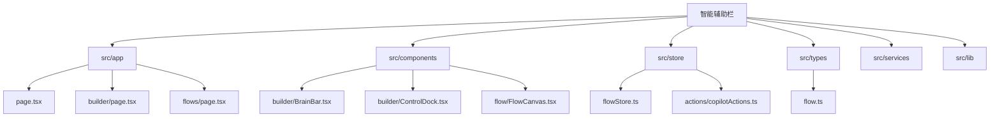
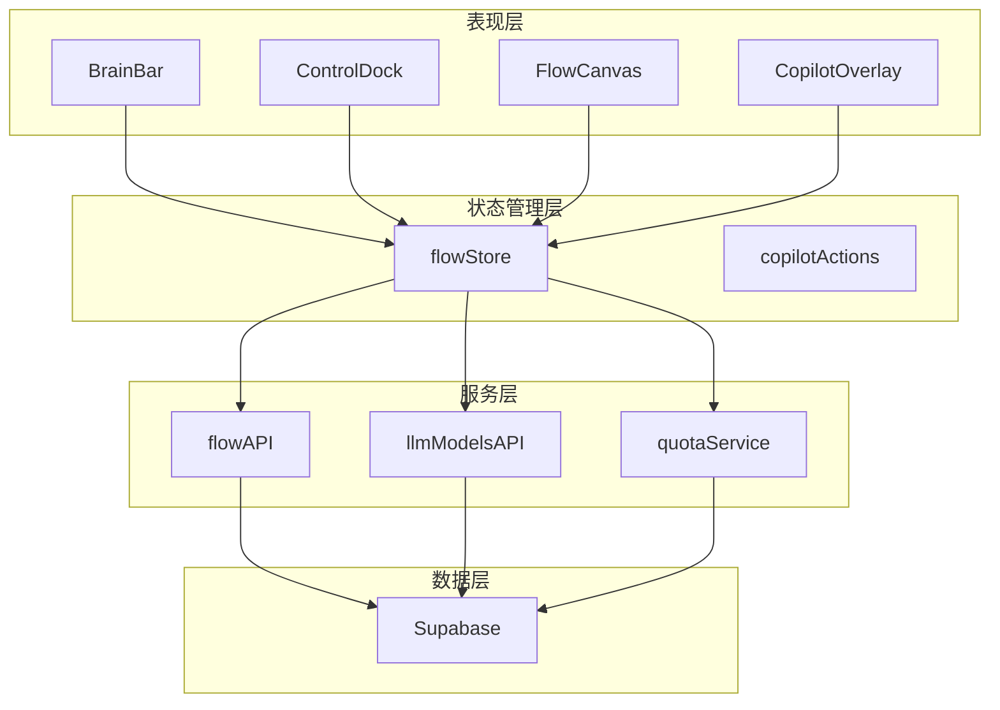
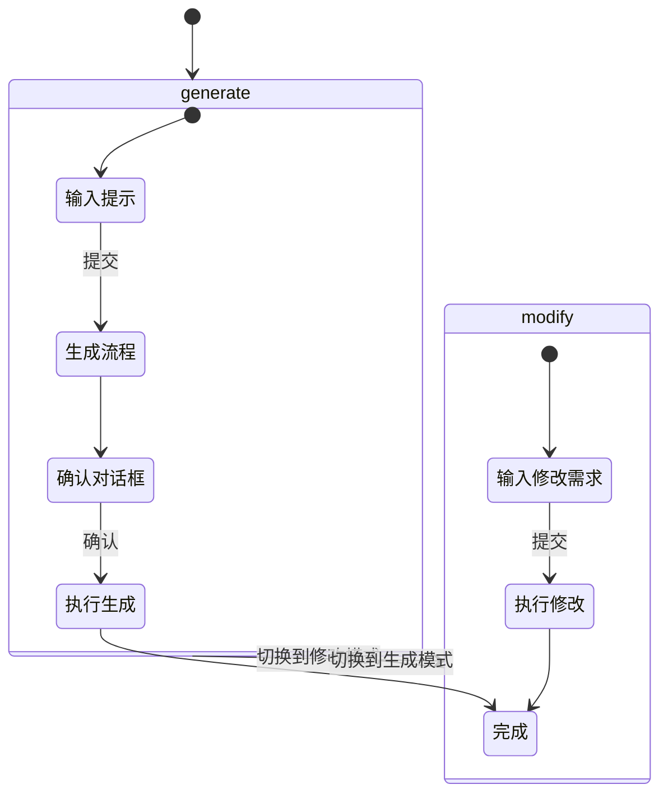
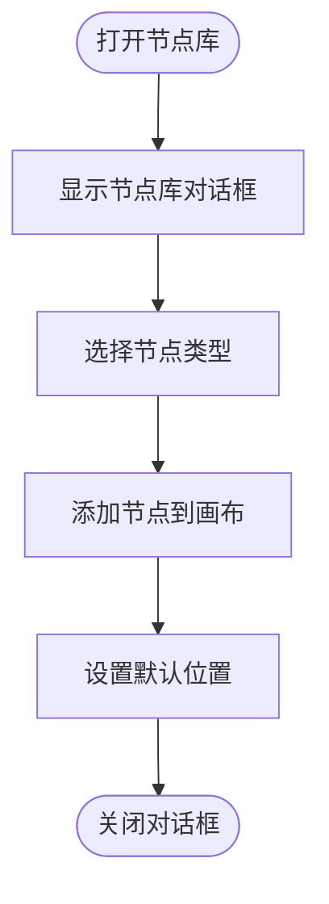
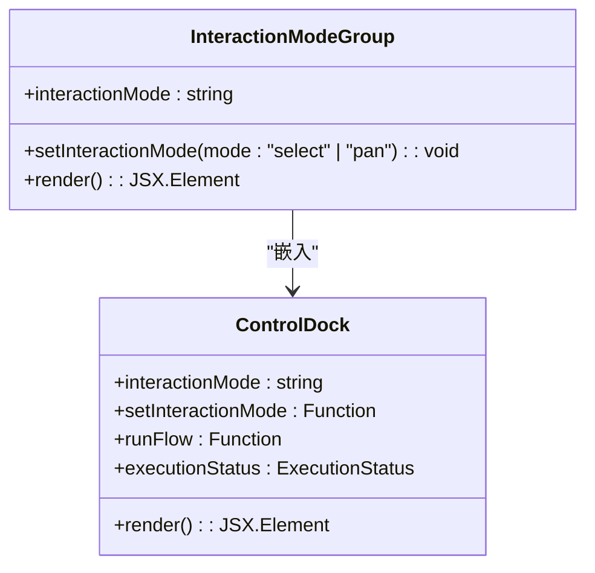
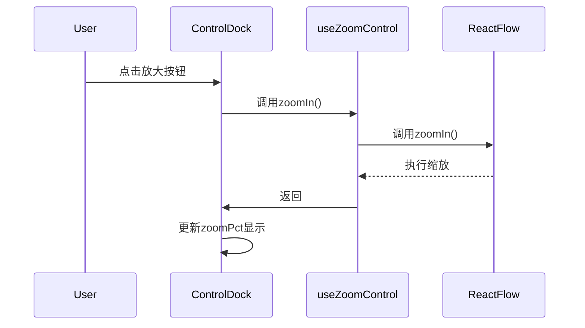
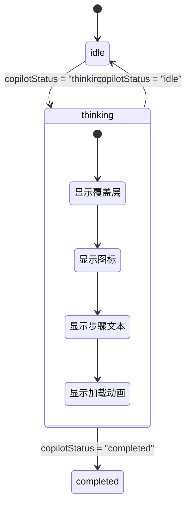
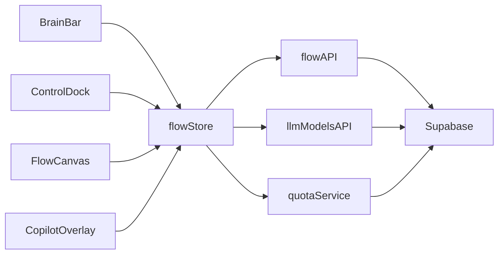

# 智能辅助栏

<cite>
**本文档中引用的文件**   
- [page.tsx](file://src/app/page.tsx)
- [layout.tsx](file://src/app/layout.tsx)
- [BrainBar.tsx](file://src/components/builder/BrainBar.tsx)
- [ControlDock.tsx](file://src/components/builder/ControlDock.tsx)
- [flowStore.ts](file://src/store/flowStore.ts)
- [CopilotOverlay.tsx](file://src/components/flow/CopilotOverlay.tsx)
- [useZoomControl.ts](file://src/components/builder/hooks/useZoomControl.ts)
- [flow.ts](file://src/types/flow.ts)
- [copilotActions.ts](file://src/store/actions/copilotActions.ts)
- [builder/page.tsx](file://src/app/builder/page.tsx)
- [InputNodeForm.tsx](file://src/components/builder/node-forms/InputNodeForm.tsx)
- [LLMNodeForm.tsx](file://src/components/builder/node-forms/LLMNodeForm.tsx)
- [OutputNodeForm.tsx](file://src/components/builder/node-forms/OutputNodeForm.tsx)
- [FlowCanvas.tsx](file://src/components/flow/FlowCanvas.tsx)
</cite>

## 目录
1. [简介](#简介)
2. [项目结构](#项目结构)
3. [核心组件](#核心组件)
4. [架构概述](#架构概述)
5. [详细组件分析](#详细组件分析)
6. [依赖分析](#依赖分析)
7. [性能考虑](#性能考虑)
8. [故障排除指南](#故障排除指南)
9. [结论](#结论)

## 简介
智能辅助栏是一个基于AI的流程构建工具，允许用户通过自然语言描述来生成和修改工作流。系统采用现代化的前端架构，结合React Flow进行可视化编排，支持多种节点类型（输入、LLM、RAG、输出、工具），并提供直观的交互界面。

该系统通过智能辅助（Copilot）功能实现全量生成和局部修改两种模式，用户可以通过简单的文本提示创建复杂的工作流。系统还集成了配额管理、状态持久化、错误处理等企业级功能，确保用户体验的完整性和可靠性。

## 项目结构
项目采用Next.js作为基础框架，遵循模块化设计原则，文件组织清晰。主要目录包括：

- `src/app/`：应用路由和页面
- `src/components/`：可复用UI组件
- `src/store/`：状态管理
- `src/types/`：类型定义
- `src/services/`：API服务
- `src/lib/`：工具库

**图表来源**
- [page.tsx](file://src/app/page.tsx)
- [BrainBar.tsx](file://src/components/builder/BrainBar.tsx)
- [flowStore.ts](file://src/store/flowStore.ts)

**章节来源**
- [page.tsx](file://src/app/page.tsx#L1-L96)
- [layout.tsx](file://src/app/layout.tsx#L1-L31)

## 核心组件
智能辅助栏的核心功能由多个关键组件构成，包括BrainBar（智能辅助栏）、ControlDock（控制面板）、FlowCanvas（画布）和CopilotOverlay（智能辅助覆盖层）。这些组件协同工作，提供完整的流程构建体验。

BrainBar组件提供主要的交互入口，支持全量生成和局部修改两种模式。ControlDock提供画布控制功能，包括缩放、平移和运行。FlowCanvas基于React Flow实现可视化编排，而CopilotOverlay则在AI处理时提供视觉反馈。

**章节来源**
- [BrainBar.tsx](file://src/components/builder/BrainBar.tsx#L1-L278)
- [ControlDock.tsx](file://src/components/builder/ControlDock.tsx#L1-L250)
- [FlowCanvas.tsx](file://src/components/flow/FlowCanvas.tsx#L1-L119)

## 架构概述
系统采用分层架构设计，前端基于React和Next.js，状态管理使用Zustand，可视化引擎采用React Flow。整体架构分为表现层、状态管理层、服务层和数据层。

**图表来源**
- [flowStore.ts](file://src/store/flowStore.ts#L1-L263)
- [copilotActions.ts](file://src/store/actions/copilotActions.ts#L1-L150)
- [flow.ts](file://src/types/flow.ts#L1-L209)

## 详细组件分析

### BrainBar 分析
BrainBar是智能辅助栏的核心交互组件，提供全量生成和局部修改两种模式。用户可以通过文本输入描述需求，系统将自动生成或修改工作流。

#### 模式切换功能

**图表来源**
- [BrainBar.tsx](file://src/components/builder/BrainBar.tsx#L48-L77)
- [copilotActions.ts](file://src/store/actions/copilotActions.ts#L6-L150)

#### 节点库功能

**图表来源**
- [BrainBar.tsx](file://src/components/builder/BrainBar.tsx#L79-L113)
- [flowStore.ts](file://src/store/flowStore.ts#L150-L153)

**章节来源**
- [BrainBar.tsx](file://src/components/builder/BrainBar.tsx#L1-L278)
- [flowStore.ts](file://src/store/flowStore.ts#L1-L263)

### ControlDock 分析
ControlDock组件提供画布控制功能，包括交互模式切换、缩放控制和流程运行。

#### 交互模式控制

**图表来源**
- [ControlDock.tsx](file://src/components/builder/ControlDock.tsx#L34-L76)
- [flowStore.ts](file://src/store/flowStore.ts#L177-L178)

#### 缩放控制功能

**图表来源**
- [ControlDock.tsx](file://src/components/builder/ControlDock.tsx#L81-L168)
- [useZoomControl.ts](file://src/components/builder/hooks/useZoomControl.ts#L23-L87)

**章节来源**
- [ControlDock.tsx](file://src/components/builder/ControlDock.tsx#L1-L250)
- [useZoomControl.ts](file://src/components/builder/hooks/useZoomControl.ts#L1-L87)

### CopilotOverlay 分析
CopilotOverlay组件在AI处理时提供视觉反馈，显示处理进度和状态。

**图表来源**
- [CopilotOverlay.tsx](file://src/components/flow/CopilotOverlay.tsx#L1-L64)
- [flowStore.ts](file://src/store/flowStore.ts#L127-L129)

**章节来源**
- [CopilotOverlay.tsx](file://src/components/flow/CopilotOverlay.tsx#L1-L64)
- [flowStore.ts](file://src/store/flowStore.ts#L1-L263)

## 依赖分析
系统依赖关系清晰，采用单向数据流设计原则。主要依赖关系如下：

**图表来源**
- [go.mod](file://go.mod#L1-L20)
- [package.json](file://package.json#L1-L50)

**章节来源**
- [flowStore.ts](file://src/store/flowStore.ts#L3-L10)
- [copilotActions.ts](file://src/store/actions/copilotActions.ts#L3-L5)

## 性能考虑
系统在性能方面进行了多项优化：

1. **组件记忆化**：FlowCanvas使用React.memo避免不必要的重新渲染
2. **状态优化**：nodeTypes常量移出组件外部，防止每次渲染都重新创建
3. **防抖保存**：scheduleSave方法使用800ms防抖，减少频繁保存
4. **即时保存**：flushSave方法用于关键操作，确保数据立即持久化
5. **资源预加载**：模型列表在组件挂载时异步加载，不影响初始渲染

这些优化确保了60fps的流畅拖拽性能和良好的用户体验。

## 故障排除指南
常见问题及解决方案：

1. **流程生成失败**：检查用户是否登录，配额是否充足
2. **画布拖拽卡顿**：确保nodeTypes和defaultEdgeOptions正确记忆化
3. **URL同步问题**：检查currentFlowId状态订阅是否正确
4. **刷新后状态丢失**：验证sessionStorage中的copilot-operation标志
5. **模型加载失败**：检查llmModelsAPI服务是否正常工作

**章节来源**
- [builder/page.tsx](file://src/app/builder/page.tsx#L34-L140)
- [copilotActions.ts](file://src/store/actions/copilotActions.ts#L20-L58)

## 结论
智能辅助栏是一个功能完整、架构清晰的AI驱动流程构建工具。系统通过创新的自然语言交互方式，降低了工作流创建的门槛。采用现代化的技术栈和良好的架构设计，确保了系统的可维护性和扩展性。

核心优势包括直观的用户界面、强大的AI辅助功能、完善的状态管理和优秀的性能表现。通过配额管理、错误处理和状态持久化等企业级功能，为用户提供可靠的服务体验。