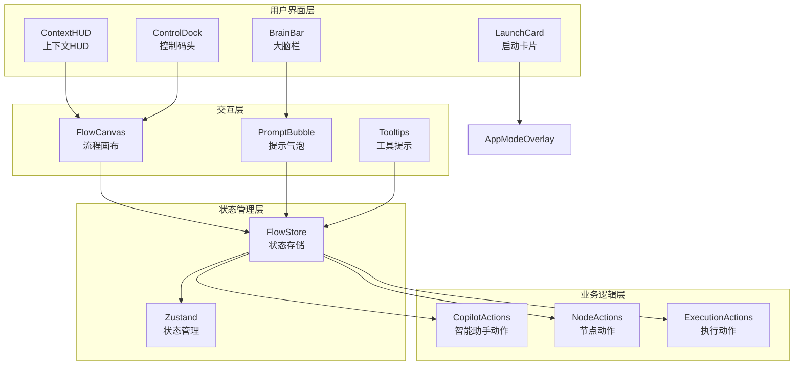
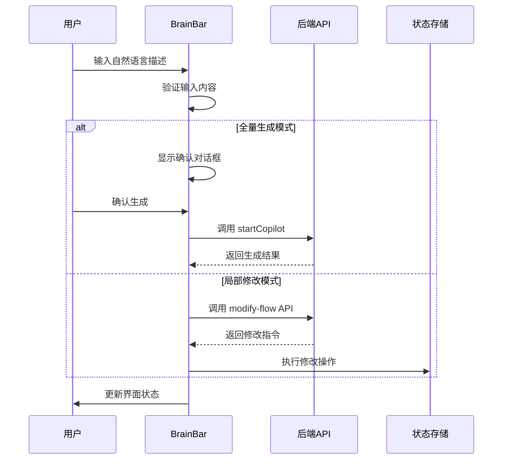
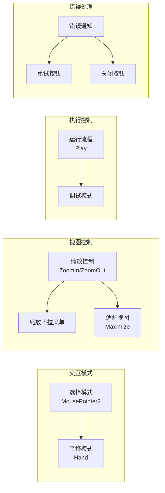
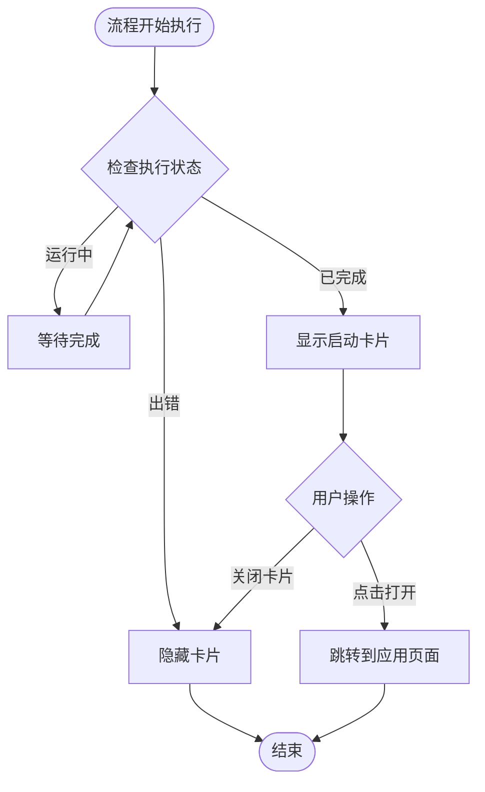
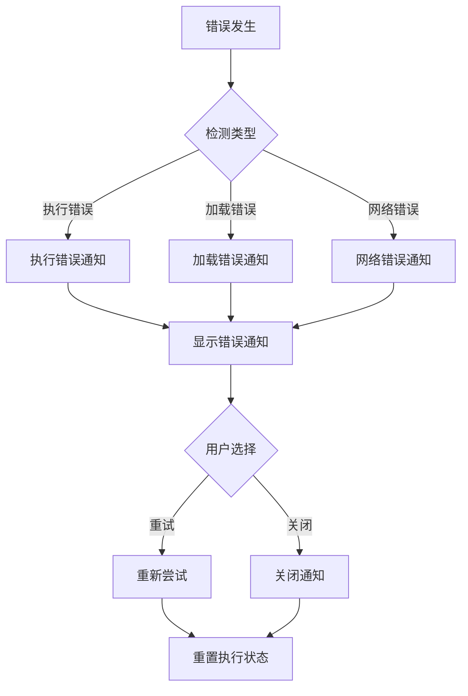
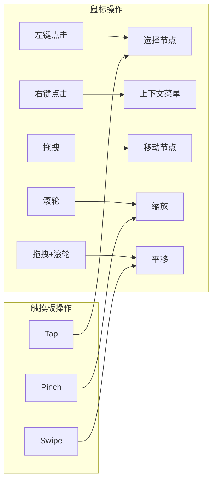
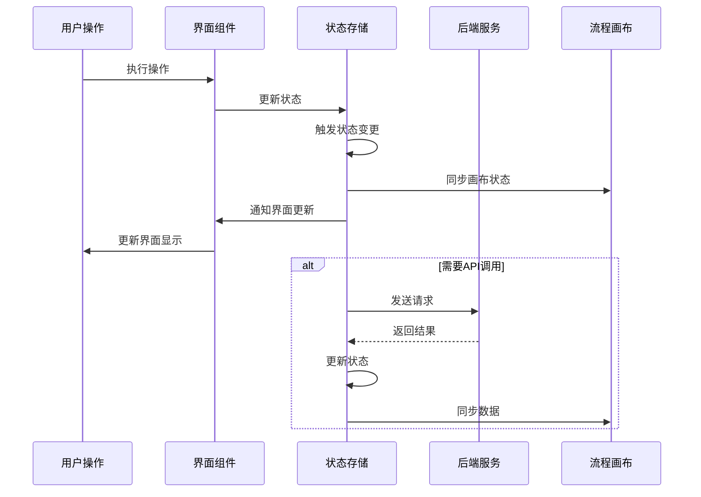

# 流程构建器界面

<cite>
**本文档中引用的文件**
- [BrainBar.tsx](file://src/components/builder/BrainBar.tsx)
- [ContextHUD.tsx](file://src/components/builder/ContextHUD.tsx)
- [ControlDock.tsx](file://src/components/builder/ControlDock.tsx)
- [AppModeOverlay.tsx](file://src/components/builder/AppModeOverlay.tsx)
- [LaunchCard.tsx](file://src/components/builder/LaunchCard.tsx)
- [prompt-bubble.tsx](file://src/components/ui/prompt-bubble.tsx)
- [tooltip.tsx](file://src/components/ui/tooltip.tsx)
- [FlowCanvas.tsx](file://src/components/flow/FlowCanvas.tsx)
- [FlowAppInterface.tsx](file://src/components/apps/FlowAppInterface.tsx)
- [flowStore.ts](file://src/store/flowStore.ts)
- [flow.ts](file://src/types/flow.ts)
- [CopilotOverlay.tsx](file://src/components/flow/CopilotOverlay.tsx)
- [FlowErrorBoundary.tsx](file://src/components/FlowErrorBoundary.tsx)
</cite>

## 目录
1. [简介](#简介)
2. [系统架构概览](#系统架构概览)
3. [核心界面组件](#核心界面组件)
4. [交互逻辑详解](#交互逻辑详解)
5. [用户反馈机制](#用户反馈机制)
6. [键盘快捷键与鼠标操作](#键盘快捷键与鼠标操作)
7. [组件协同工作机制](#组件协同工作机制)
8. [性能优化考虑](#性能优化考虑)
9. [故障排除指南](#故障排除指南)
10. [总结](#总结)

## 简介

Flash Flow 流程构建器提供了一个现代化、直观的可视化编程界面，通过四个核心界面组件——BrainBar（大脑栏）、ContextHUD（上下文HUD）、ControlDock（控制码头）和LaunchCard（启动卡片）——为用户提供强大的流程设计能力。该系统采用上下文感知的设计理念，结合实时反馈机制，显著提升了用户的构建效率和体验质量。

## 系统架构概览

流程构建器采用分层架构设计，将界面组件分为多个独立但相互协作的功能模块：

**图表来源**
- [BrainBar.tsx](file://src/components/builder/BrainBar.tsx#L1-L281)
- [ContextHUD.tsx](file://src/components/builder/ContextHUD.tsx#L1-L317)
- [ControlDock.tsx](file://src/components/builder/ControlDock.tsx#L1-L228)
- [flowStore.ts](file://src/store/flowStore.ts#L1-L131)

## 核心界面组件

### BrainBar - 上下文感知建议系统

BrainBar 是流程构建器的核心智能交互组件，提供全量生成和局部修改两种模式的上下文感知建议功能。

#### 主要特性

| 特性 | 描述 | 实现方式 |
|------|------|----------|
| 双模式操作 | 支持"全量生成"和"局部修改"两种工作模式 | 通过 `mode` 状态切换按钮实现 |
| AI驱动生成 | 基于自然语言描述自动生成流程结构 | 集成 `/api/modify-flow` 接口 |
| 节点库访问 | 提供预定义节点模板快速添加功能 | 通过 `libraryOpen` 对话框实现 |
| 实时反馈 | 在生成过程中提供视觉反馈和状态指示 | 使用 `isGenerating` 状态和动画效果 |

#### 工作流程

**图表来源**
- [BrainBar.tsx](file://src/components/builder/BrainBar.tsx#L29-L62)
- [BrainBar.tsx](file://src/components/builder/BrainBar.tsx#L159-L180)

**章节来源**
- [BrainBar.tsx](file://src/components/builder/BrainBar.tsx#L1-L281)

### ContextHUD - 节点信息显示面板

ContextHUD 提供实时的节点配置界面和执行状态监控，支持所有节点类型的参数调整和调试。

#### 支持的节点类型配置

| 节点类型 | 配置选项 | 功能描述 |
|----------|----------|----------|
| LLM节点 | 模型选择、温度设置、系统提示词 | 控制大语言模型的行为参数 |
| 输入节点 | 文本内容编辑 | 设置用户输入的初始文本 |
| HTTP节点 | 请求方法、URL地址 | 配置外部API调用参数 |
| RAG节点 | 文件上传、知识库管理 | 管理检索增强生成的知识源 |
| 输出节点 | 文本内容编辑 | 定义流程最终输出格式 |

#### 执行状态监控

ContextHUD 还提供节点执行历史记录的查看功能，包括：
- 最近一次执行的输出结果
- 执行时间统计
- 错误信息展示
- 性能指标监控

**章节来源**
- [ContextHUD.tsx](file://src/components/builder/ContextHUD.tsx#L1-L317)

### ControlDock - 操作控制中心

ControlDock 集成了流程画布的所有基本操作控制，提供直观的交互模式切换和视图导航功能。

#### 核心控制功能

**图表来源**
- [ControlDock.tsx](file://src/components/builder/ControlDock.tsx#L55-L177)

#### 视图控制特性

| 控制项 | 快捷操作 | 功能描述 |
|--------|----------|----------|
| 缩放级别 | +/- 键 | 快速放大缩小 |
| 缩放下拉菜单 | 点击百分比显示 | 选择固定缩放比例 |
| 适配视图 | Maximize 图标 | 自动调整视图适应画布内容 |
| 交互模式 | 切换按钮 | 在选择模式和平移模式间切换 |

**章节来源**
- [ControlDock.tsx](file://src/components/builder/ControlDock.tsx#L1-L228)

### LaunchCard - 应用就绪提示

LaunchCard 在流程执行完成后自动显示，提供应用打开入口和状态提示。

#### 显示条件与触发机制

**图表来源**
- [LaunchCard.tsx](file://src/components/builder/LaunchCard.tsx#L14-L16)

**章节来源**
- [LaunchCard.tsx](file://src/components/builder/LaunchCard.tsx#L1-L56)

## 交互逻辑详解

### 脑海栏交互流程

BrainBar 的交互逻辑体现了现代AI辅助设计的理念：

#### 1. 输入处理与验证
- 支持单行和多行文本输入
- Enter键发送消息，Shift+Enter换行
- 实时内容检测和状态反馈

#### 2. 模式切换机制
- 通过标签页形式在"全量生成"和"局部修改"间切换
- 每种模式对应不同的API调用路径
- 提供清晰的视觉反馈指示当前模式

#### 3. AI生成流程
- 全量生成：基于自然语言描述生成完整流程
- 局部修改：对现有流程进行精确调整
- 生成过程中的进度指示和状态更新

**章节来源**
- [BrainBar.tsx](file://src/components/builder/BrainBar.tsx#L160-L217)

### 上下文HUD交互

ContextHUD 采用响应式设计，根据选中的节点类型动态调整配置界面：

#### 1. 动态表单生成
- 基于节点类型自动加载对应的配置字段
- 实时验证和错误提示
- 表单变更的即时保存机制

#### 2. 执行状态集成
- 显示节点执行历史和结果
- 支持执行状态的实时监控
- 错误信息的详细展示

**章节来源**
- [ContextHUD.tsx](file://src/components/builder/ContextHUD.tsx#L41-L81)

### 控制码头交互

ControlDock 提供了丰富的交互控制选项：

#### 1. 交互模式切换
- 触摸板模式：适用于触摸设备的选择和拖拽
- 鼠标模式：传统的鼠标交互方式
- 模式切换的平滑过渡动画

#### 2. 视图导航控制
- 实时缩放百分比显示
- 平滑的缩放动画效果
- 自动刷新机制确保状态同步

**章节来源**
- [ControlDock.tsx](file://src/components/builder/ControlDock.tsx#L55-L177)

## 用户反馈机制

系统提供了多层次的用户反馈机制，确保用户能够及时了解系统状态和操作结果：

### 加载状态反馈

#### Copilot加载动画
- 多阶段进度指示器
- 渐进式状态更新
- 背景遮罩效果区分不同状态

#### 流程执行状态
- 实时执行进度显示
- 执行时间统计
- 结果状态指示

### 错误处理与通知

#### 错误通知系统

**图表来源**
- [ControlDock.tsx](file://src/components/builder/ControlDock.tsx#L180-L224)
- [FlowErrorBoundary.tsx](file://src/components/FlowErrorBoundary.tsx#L15-L64)

#### 错误恢复机制
- 自动重试功能
- 错误状态的自动清除
- 用户友好的错误信息展示

### 成功状态反馈

#### 流程完成通知
- 自动化的成功状态检测
- 应用就绪状态提示
- 一键跳转到应用界面

**章节来源**
- [ControlDock.tsx](file://src/components/builder/ControlDock.tsx#L35-L51)
- [LaunchCard.tsx](file://src/components/builder/LaunchCard.tsx#L14-L16)

## 键盘快捷键与鼠标操作

### 键盘快捷键系统

#### BrainBar 输入快捷键
| 快捷键组合 | 功能描述 | 实现位置 |
|------------|----------|----------|
| Enter | 发送当前输入内容 | PromptBubble 组件 |
| Shift+Enter | 新起一行（多行输入） | PromptBubble 组件 |
| Tab | 自动补全（待实现） | 待扩展功能 |

#### 全局快捷键支持
- **Ctrl+S**：保存当前流程（通过状态自动保存）
- **Ctrl+Z**：撤销操作（通过状态管理）
- **Ctrl+Y**：重做操作（通过状态管理）

### 鼠标操作指南

#### 1. 画布操作

**图表来源**
- [FlowCanvas.tsx](file://src/components/flow/FlowCanvas.tsx#L23-L37)

#### 2. 控制码头操作
| 操作类型 | 鼠标行为 | 功能描述 |
|----------|----------|----------|
| 缩放控制 | 左键点击 | 放大/缩小视图 |
| 缩放下拉 | 点击百分比 | 选择固定缩放级别 |
| 交互模式 | 切换按钮 | 在选择/平移模式间切换 |
| 执行控制 | 点击播放按钮 | 开始/暂停流程执行 |

#### 3. ContextHUD 操作
- **滚动操作**：在配置面板中使用滚轮浏览长列表
- **拖拽操作**：某些配置项支持拖拽调整数值
- **焦点操作**：Tab键在表单字段间导航

**章节来源**
- [ControlDock.tsx](file://src/components/builder/ControlDock.tsx#L55-L177)
- [FlowCanvas.tsx](file://src/components/flow/FlowCanvas.tsx#L40-L82)

## 组件协同工作机制

### 状态同步机制

各界面组件通过统一的状态管理系统实现高效协同：

**图表来源**
- [flowStore.ts](file://src/store/flowStore.ts#L17-L131)

### 数据流管理

#### 1. 单向数据流
- 状态变更通过Actions触发
- 组件订阅特定状态变化
- 避免直接状态修改

#### 2. 异步操作处理
- 流程执行的异步状态管理
- API调用的加载状态跟踪
- 错误状态的统一处理

#### 3. 实时同步机制
- 节点选择状态的实时同步
- 画布视图状态的自动更新
- 执行状态的实时反馈

**章节来源**
- [flowStore.ts](file://src/store/flowStore.ts#L17-L131)

### 组件间通信

#### 1. 父子组件通信
- 通过Props传递基础数据
- 通过回调函数处理事件
- 使用Context提供共享状态

#### 2. 兄弟组件通信
- 通过状态存储共享数据
- 通过事件总线传递消息
- 通过回调链传递状态变更

#### 3. 跨层级通信
- 使用全局状态管理
- 通过事件监听器
- 通过发布订阅模式

## 性能优化考虑

### 渲染性能优化

#### 1. 组件懒加载
- 非关键组件按需加载
- 大型组件的虚拟化处理
- 图片和资源的延迟加载

#### 2. 状态更新优化
- 避免不必要的状态更新
- 使用防抖和节流技术
- 批量更新策略

#### 3. DOM操作优化
- 减少DOM节点数量
- 使用CSS动画替代JavaScript动画
- 优化重排和重绘

### 交互性能优化

#### 1. 响应速度优化
- 本地状态缓存
- 预加载常用资源
- 优化网络请求时机

#### 2. 动画性能
- 使用CSS transform代替布局属性
- 避免复杂的动画组合
- 合理使用requestAnimationFrame

#### 3. 内存管理
- 及时清理事件监听器
- 避免内存泄漏
- 优化大型数据结构的使用

## 故障排除指南

### 常见问题与解决方案

#### 1. BrainBar 无响应
**症状**：输入框无法接收输入或提交无效
**可能原因**：
- 网络连接问题
- API服务不可用
- 浏览器兼容性问题

**解决步骤**：
1. 检查网络连接状态
2. 查看浏览器开发者工具中的错误日志
3. 尝试清除浏览器缓存
4. 刷新页面重新加载

#### 2. ContextHUD 配置不生效
**症状**：修改节点配置后未反映到画布上
**可能原因**：
- 状态同步问题
- 表单验证失败
- 数据格式不匹配

**解决步骤**：
1. 检查表单验证规则
2. 查看控制台错误信息
3. 重启流程执行
4. 检查节点数据结构

#### 3. ControlDock 控制失效
**症状**：缩放、平移等控制功能不工作
**可能原因**：
- 交互模式设置错误
- 画布状态异常
- 浏览器手势冲突

**解决步骤**：
1. 切换交互模式
2. 重置画布视图
3. 检查浏览器手势设置
4. 尝试禁用其他扩展程序

### 调试工具与技巧

#### 1. 开发者工具使用
- 使用React DevTools检查组件状态
- 通过Redux DevTools调试状态变化
- 使用Performance面板分析性能瓶颈

#### 2. 日志记录
- 启用详细的控制台日志
- 记录用户操作序列
- 监控API调用状态

#### 3. 状态检查
- 检查FlowStore中的状态值
- 验证节点和边的数据完整性
- 确认执行状态的一致性

**章节来源**
- [FlowErrorBoundary.tsx](file://src/components/FlowErrorBoundary.tsx#L1-L64)

## 总结

Flash Flow 流程构建器通过精心设计的四个核心界面组件，为用户提供了强大而直观的流程设计体验。BrainBar的上下文感知建议、ContextHUD的实时配置管理、ControlDock的便捷操作控制以及LaunchCard的应用就绪提示，共同构成了一个完整的可视化编程生态系统。

### 核心优势

1. **智能化辅助**：AI驱动的流程生成和修改功能
2. **实时反馈**：多层次的用户状态反馈机制
3. **直观操作**：符合人体工程学的交互设计
4. **高效协同**：组件间的无缝状态同步
5. **容错性强**：完善的错误处理和恢复机制

### 技术特色

- **响应式设计**：适应不同屏幕尺寸和设备类型
- **性能优化**：高效的渲染和状态管理
- **可扩展性**：模块化的组件架构便于功能扩展
- **用户体验**：流畅的动画和直观的操作反馈

这套界面系统不仅提升了流程构建的效率，更为用户创造了一个友好、智能的开发环境，是现代可视化编程工具的优秀实践案例。