# 状态动作系统

<cite>
**本文档中引用的文件**
- [copilotActions.ts](file://src/store/actions/copilotActions.ts)
- [edgeActions.ts](file://src/store/actions/edgeActions.ts)
- [executionActions.ts](file://src/store/actions/executionActions.ts)
- [nodeActions.ts](file://src/store/actions/nodeActions.ts)
- [flowStore.ts](file://src/store/flowStore.ts)
- [flow.ts](file://src/types/flow.ts)
- [layoutAlgorithm.ts](file://src/store/utils/layoutAlgorithm.ts)
- [cycleDetection.ts](file://src/store/utils/cycleDetection.ts)
- [initialState.ts](file://src/store/constants/initialState.ts)
- [nodeDefaults.ts](file://src/store/utils/nodeDefaults.ts)
- [flowAPI.ts](file://src/services/flowAPI.ts)
</cite>

## 目录
1. [简介](#简介)
2. [架构概览](#架构概览)
3. [核心动作模块详解](#核心动作模块详解)
4. [状态管理机制](#状态管理机制)
5. [动作协作关系](#动作协作关系)
6. [错误处理策略](#错误处理策略)
7. [性能优化考虑](#性能优化考虑)
8. [调试与监控](#调试与监控)
9. [最佳实践建议](#最佳实践建议)
10. [总结](#总结)

## 简介

Flash Flow 的状态动作系统是一个基于 Zustand 构建的复杂状态管理解决方案，专门设计用于处理可视化流程编辑器的状态变更。该系统通过四个核心动作模块（copilotActions、edgeActions、executionActions 和 nodeActions）实现了对流程状态的精细化控制，包括节点管理、边连接、执行控制和 Copilot 交互等功能。

系统的核心设计理念是将复杂的业务逻辑封装在独立的动作模块中，通过统一的接口暴露给组件层，确保状态变更的一致性和可预测性。每个动作模块都专注于特定的功能领域，并与其他模块保持松耦合的关系。

## 架构概览

状态动作系统采用模块化架构设计，通过组合式的方式将各个功能模块集成到主状态存储中：

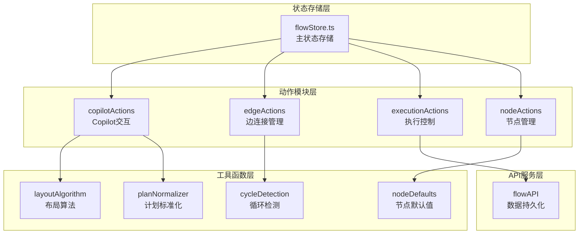

**图表来源**
- [flowStore.ts](file://src/store/flowStore.ts#L17-L31)
- [copilotActions.ts](file://src/store/actions/copilotActions.ts#L4-L59)
- [edgeActions.ts](file://src/store/actions/edgeActions.ts#L12-L80)
- [executionActions.ts](file://src/store/actions/executionActions.ts#L4-L291)
- [nodeActions.ts](file://src/store/actions/nodeActions.ts#L5-L93)

**章节来源**
- [flowStore.ts](file://src/store/flowStore.ts#L1-L131)
- [flow.ts](file://src/types/flow.ts#L1-L153)

## 核心动作模块详解

### copilotActions - Copilot交互模块

copilotActions 模块负责处理与 AI Copilot 相关的所有状态变更，包括流程生成、布局优化和界面控制等功能。

#### 主要功能特性

1. **AI流程生成**：通过 `/api/plan` 接口接收 AI 生成的流程计划，并将其转换为可用的节点和边结构
2. **布局优化**：集成 Dagre 布局算法，自动生成美观的节点排列
3. **状态管理**：维护 Copilot 的执行状态（idle、thinking、completed）和步骤进度
4. **错误恢复**：提供完善的错误处理机制，确保系统稳定性

#### 关键实现机制

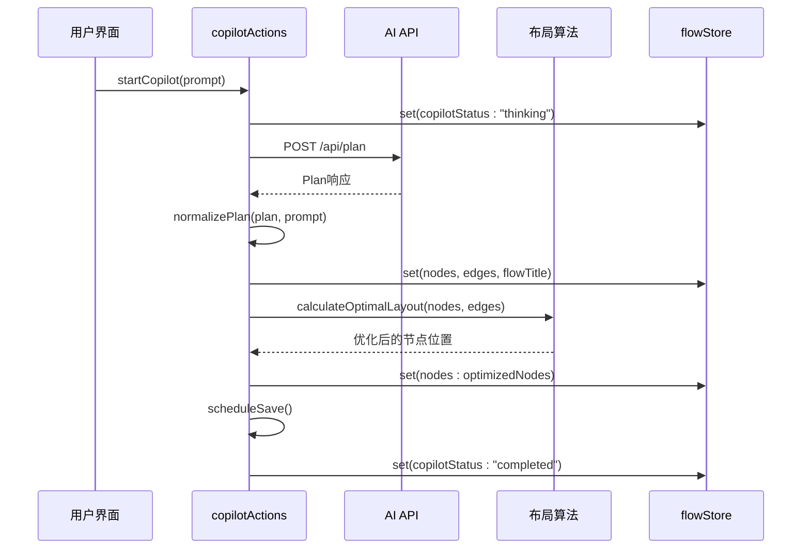

**图表来源**
- [copilotActions.ts](file://src/store/actions/copilotActions.ts#L8-L34)
- [layoutAlgorithm.ts](file://src/store/utils/layoutAlgorithm.ts#L11-L67)

#### 状态变更路径

copilotActions 的主要状态变更包括：

| 状态字段 | 变更时机 | 变更内容 |
|---------|---------|---------|
| copilotStatus | 开始生成时 | 从 "idle" → "thinking" |
| nodes/edges | 生成完成后 | 设置新的节点和边数组 |
| flowTitle | 自动生成时 | 设置标题或使用提示词截取 |
| copilotStatus | 完成时 | 从 "thinking" → "completed" |

**章节来源**
- [copilotActions.ts](file://src/store/actions/copilotActions.ts#L1-L59)

### edgeActions - 边连接管理模块

edgeActions 模块专门处理节点间的连接关系，包括边的创建、删除、更新以及循环检测等复杂逻辑。

#### 核心功能实现

1. **智能边创建**：支持拖拽连接和程序化连接，具备循环检测能力
2. **节点变更处理**：自动清理被删除节点相关的边关系
3. **状态同步**：确保边状态与节点状态保持一致
4. **验证机制**：防止无效连接（自环、循环）

#### 循环检测机制

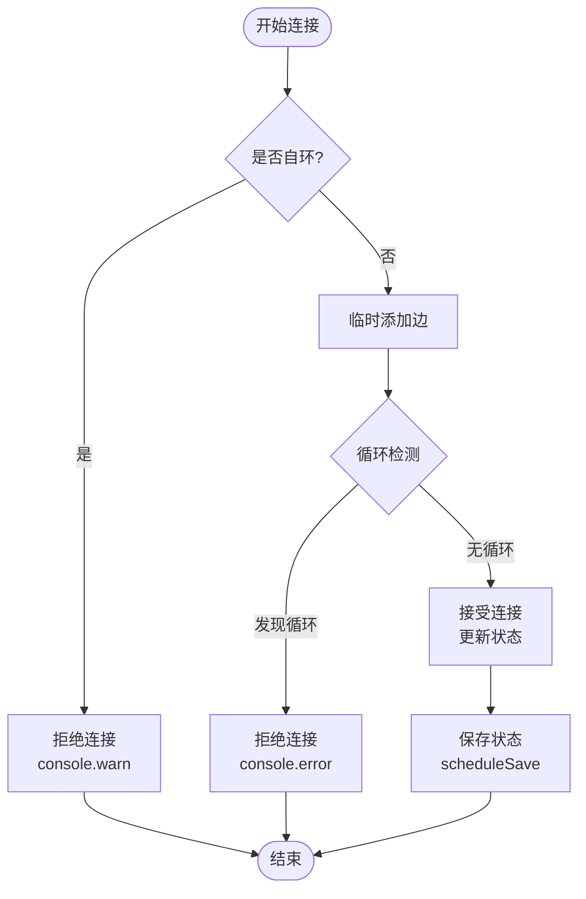

**图表来源**
- [edgeActions.ts](file://src/store/actions/edgeActions.ts#L46-L67)
- [cycleDetection.ts](file://src/store/utils/cycleDetection.ts#L13-L33)

#### 边状态管理

edgeActions 维护以下关键状态：

| 功能 | 方法 | 状态影响 |
|------|------|----------|
| 节点删除清理 | onNodesChange | 自动移除相关边 |
| 边变更处理 | onEdgesChange | 更新边数组 |
| 连接验证 | onConnect | 循环检测、自环检查 |
| 批量设置 | setNodes/setEdges | 直接替换状态 |

**章节来源**
- [edgeActions.ts](file://src/store/actions/edgeActions.ts#L1-L80)

### executionActions - 执行控制模块

executionActions 是系统中最复杂的模块，负责流程的执行调度、状态管理和错误处理。

#### 执行引擎架构

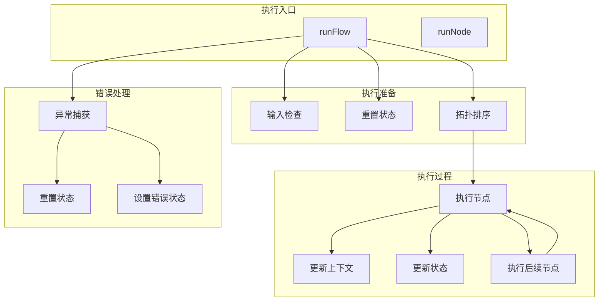

**图表来源**
- [executionActions.ts](file://src/store/actions/executionActions.ts#L23-L180)

#### 节点执行流程

不同类型的节点具有不同的执行逻辑：

| 节点类型 | 执行方式 | 输出格式 | 特殊处理 |
|---------|---------|---------|---------|
| input | 直接文本 | `{query: text}` | 检查输入数据 |
| llm | API调用 | `{response: text}` | 温度参数、超时处理 |
| rag | 文档检索 | `{foundDocs: Array}` | 文件处理 |
| http | HTTP请求 | `{status: number, data: Object}` | URL验证 |
| output | 上游数据 | `{text: string}` | 文本提取 |

#### 执行状态管理

executionActions 维护完整的执行生命周期：

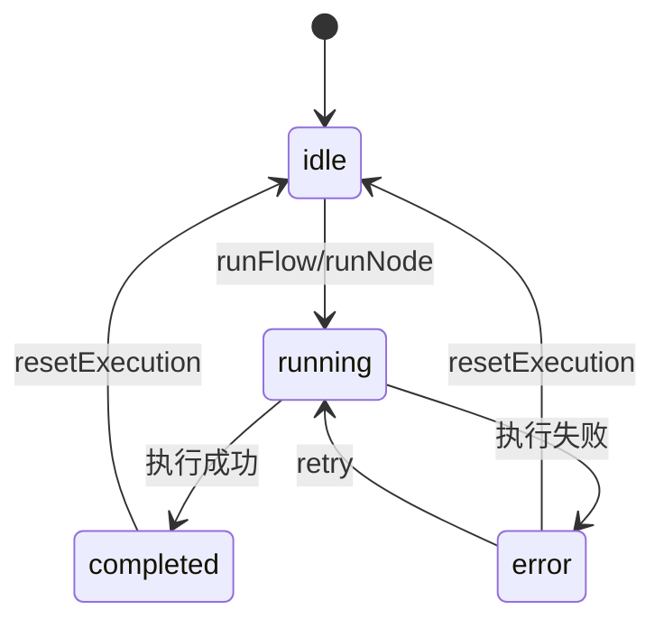

**图表来源**
- [executionActions.ts](file://src/store/actions/executionActions.ts#L8-L18)
- [flow.ts](file://src/types/flow.ts#L11-L12)

**章节来源**
- [executionActions.ts](file://src/store/actions/executionActions.ts#L1-L291)

### nodeActions - 节点管理模块

nodeActions 提供基础的节点操作功能，包括节点创建、更新、删除和验证等。

#### 节点生命周期管理

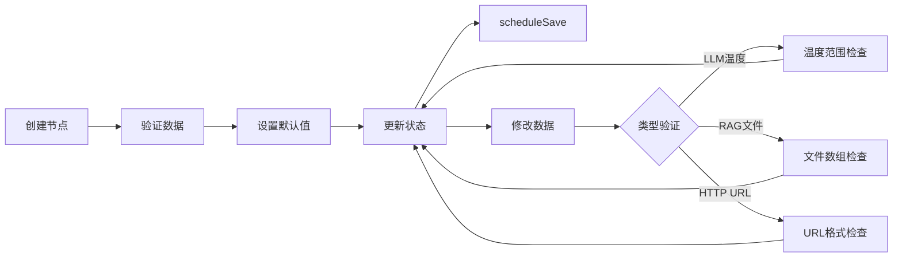

**图表来源**
- [nodeActions.ts](file://src/store/actions/nodeActions.ts#L9-L93)
- [nodeDefaults.ts](file://src/store/utils/nodeDefaults.ts#L6-L16)

#### 节点验证规则

不同节点类型具有特定的验证要求：

| 节点类型 | 验证项目 | 验证规则 | 错误处理 |
|---------|---------|---------|---------|
| LLM | temperature | 0 ≤ 温度 ≤ 1 | console.error |
| RAG | files | 必须是数组 | console.error |
| HTTP | url | 有效URL格式 | console.error |

**章节来源**
- [nodeActions.ts](file://src/store/actions/nodeActions.ts#L1-L93)

## 状态管理机制

### Zustand集成模式

系统采用 Zustand 的函数式状态管理模式，通过 `create` 函数创建包含所有动作的完整状态存储：

```typescript
// 状态存储创建模式
export const useFlowStore = create<FlowState>((set, get) => ({
    // 初始状态
    ...INITIAL_FLOW_STATE,
    
    // 动作模块组合
    ...createNodeActions(set, get),
    ...createEdgeActions(set, get),
    ...createExecutionActions(set, get),
    ...createCopilotActions(set, get),
    
    // 简单状态设置器
    setFlowTitle: (title: string) => {
        set({ flowTitle: title, saveStatus: "saving" });
        get().scheduleSave();
    },
}));
```

### 状态变更传播机制

状态变更通过以下机制确保一致性：

1. **原子性操作**：每个动作都是原子性的，要么完全成功，要么完全回滚
2. **副作用管理**：通过 `scheduleSave` 延迟保存，避免频繁的数据库操作
3. **依赖追踪**：组件通过选择器订阅特定状态，实现精确的重新渲染

### 数据持久化策略

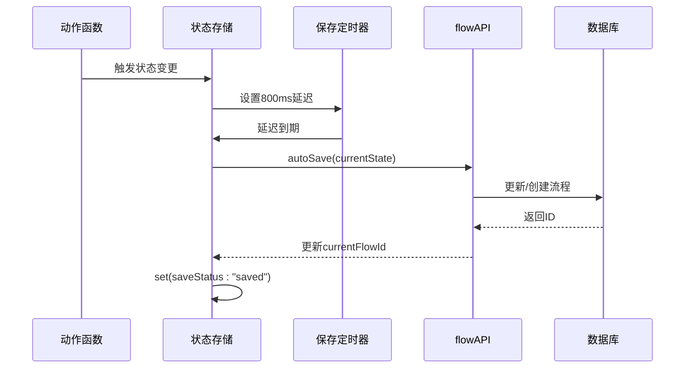

**图表来源**
- [flowStore.ts](file://src/store/flowStore.ts#L50-L74)
- [flowAPI.ts](file://src/services/flowAPI.ts#L211-L224)

**章节来源**
- [flowStore.ts](file://src/store/flowStore.ts#L17-L131)

## 动作协作关系

### 自动布局触发机制

节点状态变更会自动触发布局算法，确保界面美观：

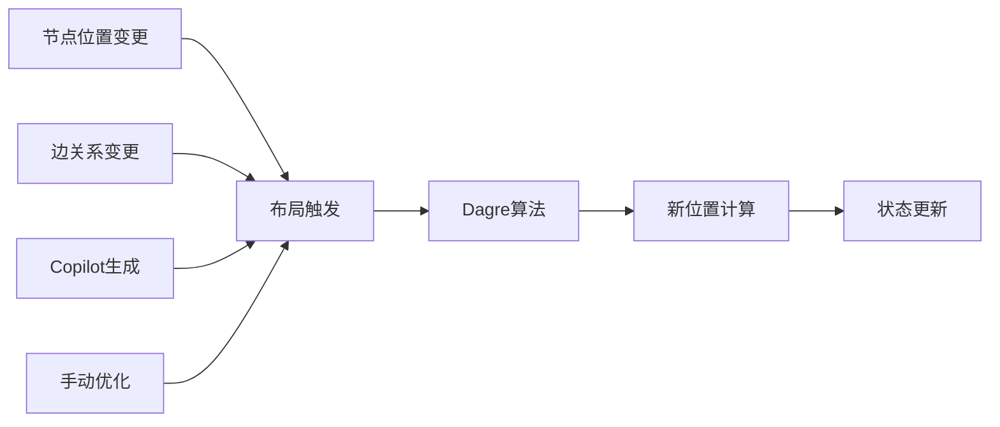

**图表来源**
- [copilotActions.ts](file://src/store/actions/copilotActions.ts#L25-L27)
- [layoutAlgorithm.ts](file://src/store/utils/layoutAlgorithm.ts#L11-L67)

### 循环检测与状态约束

边连接操作受到严格的循环检测约束：

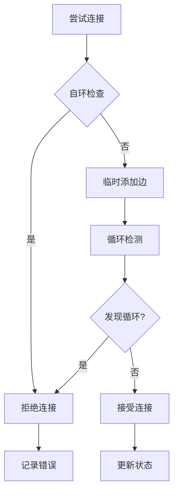

**图表来源**
- [edgeActions.ts](file://src/store/actions/edgeActions.ts#L52-L67)
- [cycleDetection.ts](file://src/store/utils/cycleDetection.ts#L13-L33)

### 执行状态协调

执行动作与其他模块的状态保持协调：

| 执行阶段 | 相关模块 | 状态影响 |
|---------|---------|---------|
| 输入检查 | executionActions | 检查input节点数据 |
| 执行准备 | executionActions | 重置执行状态 |
| 节点执行 | executionActions | 更新节点状态 |
| 上下文传递 | executionActions | 更新flowContext |
| 结果反馈 | executionActions | 显示执行结果 |

**章节来源**
- [executionActions.ts](file://src/store/actions/executionActions.ts#L23-L180)
- [edgeActions.ts](file://src/store/actions/edgeActions.ts#L46-L67)

## 错误处理策略

### 分层错误处理

系统采用分层的错误处理策略，确保错误不会导致系统崩溃：

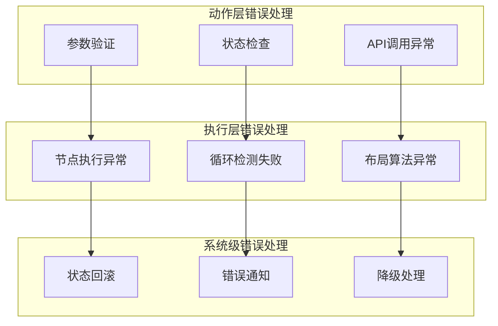

### 具体错误处理案例

#### Copilot生成错误处理

```typescript
try {
    const plan = await resp.json() as Plan;
    const { nodes, edges } = normalizePlan(plan, prompt);
    set({ nodes, edges, flowTitle: title });
    const optimizedNodes = calculateOptimalLayout(nodes, edges);
    set({ nodes: optimizedNodes });
    await get().scheduleSave();
    set({ copilotStatus: "completed" });
} catch (error) {
    console.error('Copilot generation failed:', error);
    set({ copilotStatus: "idle" });
}
```

#### 执行过程错误处理

```typescript
try {
    // 执行逻辑
    set({ executionStatus: "running" });
    await executeNode(nodeId);
    set({ executionStatus: "completed" });
} catch (error) {
    console.error('Flow execution failed:', error);
    set({
        executionStatus: "error" as ExecutionStatus,
        executionError: error instanceof Error ? error.message : "Unknown error occurred"
    });
}
```

### 错误恢复机制

系统提供多种错误恢复策略：

1. **状态重置**：执行失败时自动重置到初始状态
2. **数据验证**：在状态变更前进行严格的数据验证
3. **降级处理**：API调用失败时提供默认行为
4. **用户反馈**：通过UI组件向用户显示错误信息

**章节来源**
- [copilotActions.ts](file://src/store/actions/copilotActions.ts#L31-L34)
- [executionActions.ts](file://src/store/actions/executionActions.ts#L173-L179)

## 性能优化考虑

### 状态更新优化

系统采用多种策略优化状态更新性能：

1. **批量更新**：通过对象合并减少状态更新次数
2. **选择性订阅**：组件只订阅必要的状态部分
3. **防抖处理**：保存操作采用防抖机制
4. **增量计算**：只重新计算受影响的部分

### 内存管理

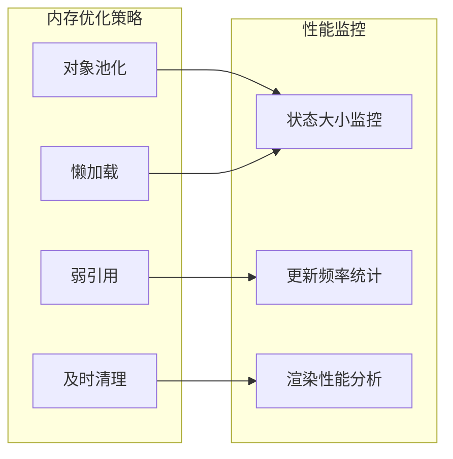

### 布局算法优化

Dagre 布局算法经过优化，支持：

- **增量布局**：只重新计算变化的节点
- **缓存机制**：缓存布局结果避免重复计算
- **并发处理**：利用Web Workers处理大型流程

**章节来源**
- [layoutAlgorithm.ts](file://src/store/utils/layoutAlgorithm.ts#L11-L120)

## 调试与监控

### 调试工具集成

系统提供了丰富的调试功能：

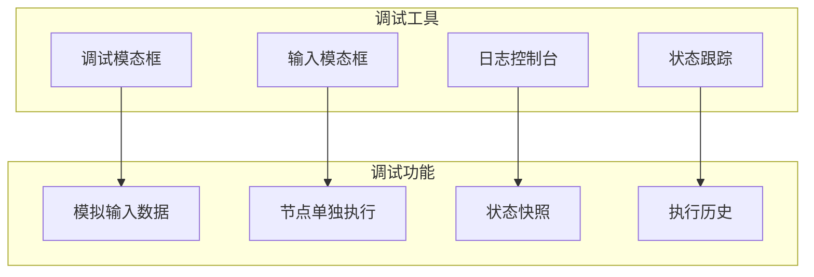

### 状态监控机制

系统内置状态监控功能：

| 监控项目 | 实现方式 | 用途 |
|---------|---------|------|
| 状态变更 | 时间戳记录 | 跟踪状态变化轨迹 |
| 性能指标 | 执行时间统计 | 识别性能瓶颈 |
| 错误日志 | 异常捕获 | 故障诊断 |
| 用户行为 | 操作序列记录 | 产品优化 |

### 调试最佳实践

1. **使用调试模态框**：通过 `openDebugModal` 查看和修改节点输入
2. **检查状态快照**：定期保存和比较状态变化
3. **监控执行流程**：观察节点执行顺序和状态转换
4. **验证数据完整性**：确保节点和边数据的一致性

**章节来源**
- [flowStore.ts](file://src/store/flowStore.ts#L77-L126)

## 最佳实践建议

### 动作函数设计原则

1. **单一职责**：每个动作函数只负责一个明确的功能
2. **幂等性**：相同输入应该产生相同的结果
3. **原子性**：动作应该是不可分割的操作单元
4. **可测试性**：设计时考虑单元测试的便利性

### 状态设计规范

```typescript
// 推荐的状态结构
interface FlowState {
    // 基础状态
    nodes: AppNode[];
    edges: AppEdge[];
    selectedNodeId: string | null;
    
    // 执行状态
    executionStatus: ExecutionStatus;
    executionError: string | null;
    flowContext: FlowContext;
    
    // Copilot状态
    copilotStatus: "idle" | "thinking" | "completed";
    copilotStep: number;
    
    // 保存状态
    saveStatus: "saved" | "saving";
}
```

### 错误处理最佳实践

1. **渐进式错误处理**：从底层到顶层逐步处理错误
2. **用户友好的错误信息**：避免技术术语，提供解决建议
3. **错误边界**：使用React错误边界隔离组件错误
4. **日志记录**：记录详细的错误上下文用于调试

### 性能优化建议

1. **状态扁平化**：避免深层嵌套的状态结构
2. **选择性更新**：只更新真正发生变化的状态
3. **组件优化**：使用React.memo和useSelector优化组件渲染
4. **异步处理**：将耗时操作放在Web Workers中执行

## 总结

Flash Flow 的状态动作系统是一个设计精良的状态管理解决方案，通过模块化的架构设计实现了复杂业务逻辑的有效封装。四个核心动作模块（copilotActions、edgeActions、executionActions 和 nodeActions）各司其职，既保持了功能的独立性，又通过统一的接口实现了良好的协作关系。

系统的主要优势包括：

1. **模块化设计**：清晰的职责分离使得系统易于理解和维护
2. **强类型支持**：完整的TypeScript类型定义确保了类型安全
3. **完善的错误处理**：多层次的错误处理机制保证了系统的稳定性
4. **性能优化**：通过防抖、缓存和增量计算等策略优化了性能表现
5. **调试友好**：丰富的调试工具和监控功能便于问题排查

该系统为可视化流程编辑器提供了坚实的状态管理基础，支持复杂的用户交互和业务逻辑，同时保持了良好的扩展性和可维护性。对于类似的复杂状态管理需求，这套设计模式和实现策略具有很好的参考价值。