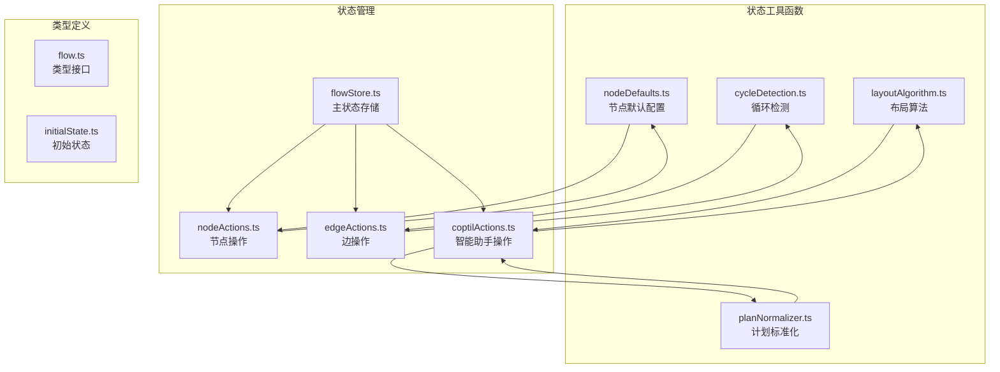
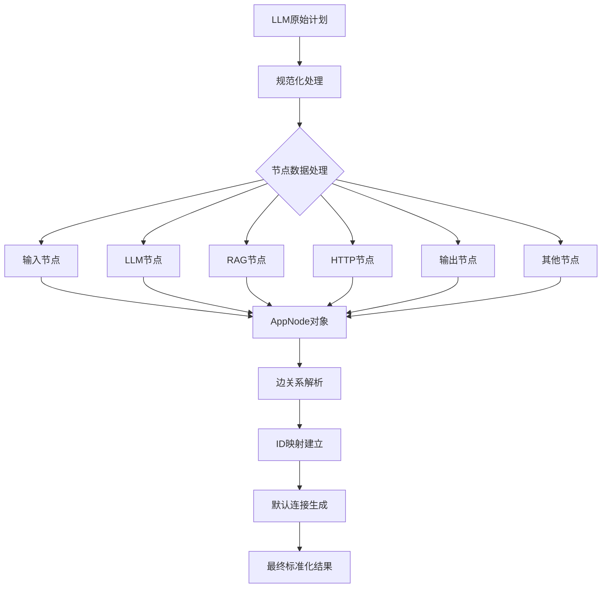
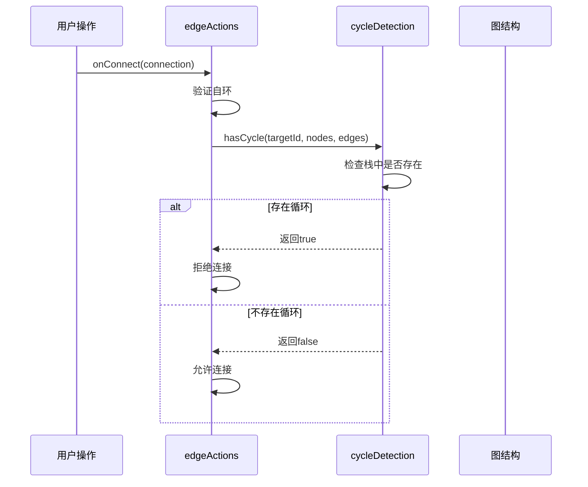
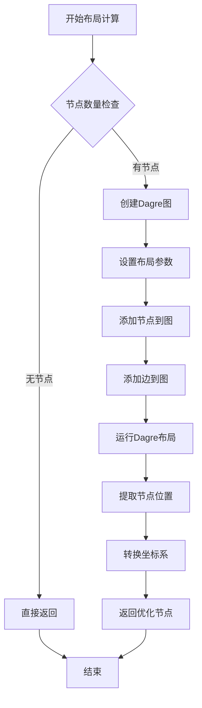
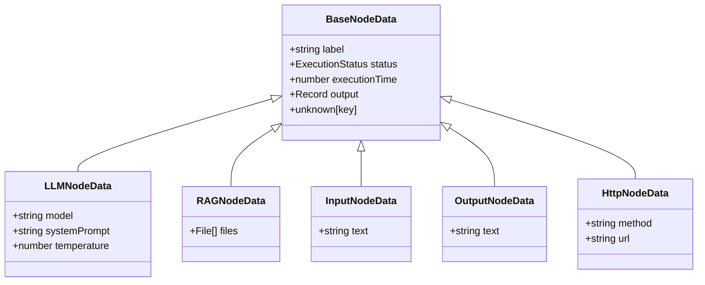
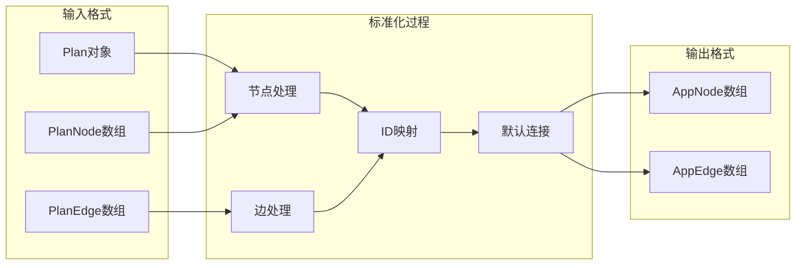
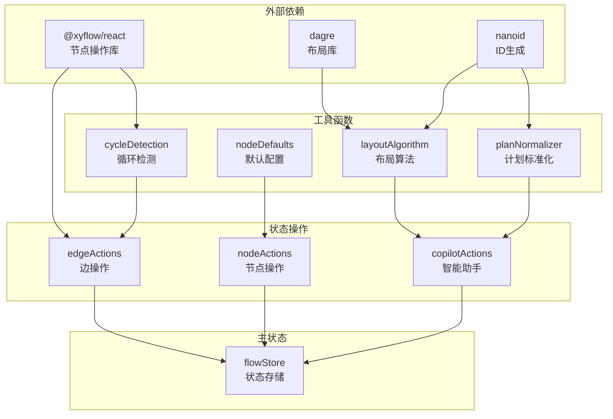

# 状态工具函数

<cite>
**本文档中引用的文件**
- [cycleDetection.ts](file://src/store/utils/cycleDetection.ts)
- [layoutAlgorithm.ts](file://src/store/utils/layoutAlgorithm.ts)
- [nodeDefaults.ts](file://src/store/utils/nodeDefaults.ts)
- [planNormalizer.ts](file://src/store/utils/planNormalizer.ts)
- [flowStore.ts](file://src/store/flowStore.ts)
- [nodeActions.ts](file://src/store/actions/nodeActions.ts)
- [edgeActions.ts](file://src/store/actions/edgeActions.ts)
- [copilotActions.ts](file://src/store/actions/copilotActions.ts)
- [flow.ts](file://src/types/flow.ts)
- [initialState.ts](file://src/store/constants/initialState.ts)
</cite>

## 目录
1. [简介](#简介)
2. [项目结构](#项目结构)
3. [核心工具函数](#核心工具函数)
4. [架构概览](#架构概览)
5. [详细组件分析](#详细组件分析)
6. [依赖关系分析](#依赖关系分析)
7. [性能考量](#性能考量)
8. [故障排除指南](#故障排除指南)
9. [结论](#结论)

## 简介

Flash Flow 是一个基于 React 和 Zustand 的状态管理应用程序，专门用于构建和管理工作流节点图。该系统包含四个核心状态工具函数，它们在防止循环依赖、优化布局、提供节点默认配置和标准化流程计划数据方面发挥关键作用。这些工具函数深度集成到状态管理系统中，确保系统的稳定性和用户体验。

## 项目结构

状态工具函数位于 `src/store/utils/` 目录下，每个文件都专注于特定的功能领域：



**图表来源**
- [cycleDetection.ts](file://src/store/utils/cycleDetection.ts#L1-L34)
- [layoutAlgorithm.ts](file://src/store/utils/layoutAlgorithm.ts#L1-L120)
- [nodeDefaults.ts](file://src/store/utils/nodeDefaults.ts#L1-L17)
- [planNormalizer.ts](file://src/store/utils/planNormalizer.ts#L1-L130)

**章节来源**
- [flowStore.ts](file://src/store/flowStore.ts#L1-L131)
- [flow.ts](file://src/types/flow.ts#L1-L153)

## 核心工具函数

### 循环检测工具 (cycleDetection)

循环检测工具负责识别和防止节点图中的循环依赖，这是确保工作流能够正确执行的关键机制。

#### 主要功能
- **递归遍历检测**：使用深度优先搜索算法检测循环
- **路径跟踪**：通过栈结构跟踪当前遍历路径
- **状态管理**：维护访问状态集合避免重复处理

#### 输入输出规范

| 参数 | 类型 | 描述 |
|------|------|------|
| nodeId | string | 起始节点ID |
| nodes | AppNode[] | 所有节点数组 |
| edges | AppEdge[] | 所有边数组 |
| visited | Set<string> | 已访问节点集合（可选） |
| stack | Set<string> | 当前路径栈（可选） |

| 返回值 | 类型 | 描述 |
|--------|------|------|
| hasCycle | boolean | 是否存在循环依赖 |

#### 调用时机
- **边连接时**：在 `onConnect` 操作中检测新连接是否产生循环
- **节点删除时**：清理相关边时验证剩余图结构
- **手动验证**：通过 `hasCycle` 函数进行显式检测

### 布局算法工具 (layoutAlgorithm)

布局算法工具基于 Dagre 库实现智能的节点布局优化，提升可视化效果和用户体验。

#### 主要功能
- **Dagre集成**：利用专业有向图布局库
- **多方向支持**：支持水平和垂直布局
- **自动避让**：避免节点重叠和边交叉
- **参数优化**：可配置的间距和对齐参数

#### 输入输出规范

| 参数 | 类型 | 描述 |
|------|------|------|
| nodes | AppNode[] | 节点数组 |
| edges | AppEdge[] | 边数组 |

| 返回值 | 类型 | 描述 |
|--------|------|------|
| optimizedNodes | AppNode[] | 具有优化位置的新节点数组 |

#### 布局配置参数

| 参数 | 默认值 | 描述 |
|------|--------|------|
| rankdir | 'LR' | 排序方向（LR: 左到右, TB: 上到下） |
| nodesep | 80 | 同层节点间距 |
| edgesep | 40 | 边间距 |
| ranksep | 200/150 | 层间间距 |
| marginx/y | 50 | 边距 |

#### 调用时机
- **Copilot生成后**：AI生成流程后的自动布局优化
- **手动触发**：用户主动请求布局优化
- **初始化时**：新节点添加后的自动调整

### 节点默认配置工具 (nodeDefaults)

节点默认配置工具为不同类型的节点提供预设的默认数据配置。

#### 支持的节点类型

| 节点类型 | 默认配置 |
|----------|----------|
| input | label: "输入", text: "", status: "idle" |
| llm | label: "LLM", model: "doubao-seed-1-6-flash-250828", temperature: 0.7, systemPrompt: "", status: "idle" |
| rag | label: "RAG", files: [], status: "idle" |
| output | label: "输出", text: "", status: "idle" |
| branch | label: "分支", status: "idle" |
| http | label: "HTTP", method: "GET", url: "https://api.example.com", status: "idle" |

#### 调用时机
- **节点重置时**：调用 `resetNodeData` 时恢复默认配置
- **动态创建时**：新节点创建时提供基础配置
- **数据验证**：确保节点数据符合预期格式

### 计划标准化工具 (planNormalizer)

计划标准化工具负责将 LLM 返回的非结构化计划数据转换为标准的工作流格式。

#### 数据转换流程



**图表来源**
- [planNormalizer.ts](file://src/store/utils/planNormalizer.ts#L45-L128)

#### 输入输出规范

| 参数 | 类型 | 描述 |
|------|------|------|
| plan | Plan | LLM返回的计划对象 |
| prompt | string | 用户提示语 |

| 返回值 | 类型 | 描述 |
|--------|------|------|
| nodes | AppNode[] | 标准化的节点数组 |
| edges | AppEdge[] | 标准化的边数组 |

#### 调用时机
- **Copilot生成时**：AI生成流程后的数据标准化
- **外部导入**：从其他系统导入的流程数据
- **数据迁移**：历史数据的格式转换

**章节来源**
- [cycleDetection.ts](file://src/store/utils/cycleDetection.ts#L1-L34)
- [layoutAlgorithm.ts](file://src/store/utils/layoutAlgorithm.ts#L1-L120)
- [nodeDefaults.ts](file://src/store/utils/nodeDefaults.ts#L1-L17)
- [planNormalizer.ts](file://src/store/utils/planNormalizer.ts#L1-L130)

## 架构概览

状态工具函数与状态管理系统的集成采用模块化设计，每个工具函数都有明确的职责边界和调用接口。

```mermaid
graph TB
subgraph "状态管理层"
FS[flowStore<br/>主状态存储]
NA[nodeActions<br/>节点操作]
EA[edgeActions<br/>边操作]
CA[coptilActions<br/>智能助手操作]
end
subgraph "工具函数层"
CD[cycleDetection<br/>循环检测]
LA[layoutAlgorithm<br/>布局算法]
ND[nodeDefaults<br/>节点默认配置]
PN[planNormalizer<br/>计划标准化]
end
subgraph "类型系统"
FT[flow.ts<br/>类型定义]
IS[initialState.ts<br/>初始状态]
end
subgraph "外部依赖"
XYF[@xyflow/react<br/>React节点库]
DAG[dagre<br/>布局库]
NAN[nanoid<br/>ID生成器]
end
FS --> NA
FS --> EA
FS --> CA
NA --> ND
EA --> CD
CA --> LA
CA --> PN
CD --> XYF
LA --> DAG
PN --> NAN
FS --> FT
FS --> IS
```

**图表来源**
- [flowStore.ts](file://src/store/flowStore.ts#L1-L131)
- [nodeActions.ts](file://src/store/actions/nodeActions.ts#L1-L93)
- [edgeActions.ts](file://src/store/actions/edgeActions.ts#L1-L80)
- [copilotActions.ts](file://src/store/actions/copilotActions.ts#L1-L59)

## 详细组件分析

### 循环检测组件分析

循环检测是防止工作流死循环的关键安全机制。

#### 实现原理



**图表来源**
- [edgeActions.ts](file://src/store/actions/edgeActions.ts#L46-L67)
- [cycleDetection.ts](file://src/store/utils/cycleDetection.ts#L13-L33)

#### 性能特征
- **时间复杂度**：O(V + E)，其中 V 是节点数，E 是边数
- **空间复杂度**：O(V)，用于存储访问状态和路径栈
- **优化策略**：使用 Set 结构实现 O(1) 查找效率

### 布局算法组件分析

布局算法通过 Dagre 库实现专业的图形布局优化。

#### 算法流程



**图表来源**
- [layoutAlgorithm.ts](file://src/store/utils/layoutAlgorithm.ts#L11-L67)

#### 坐标转换机制
Dagre 返回的是节点中心点坐标，需要转换为左上角坐标：
- **X坐标**：centerX - width/2
- **Y坐标**：centerY - height/2

### 节点默认配置组件分析

节点默认配置提供了类型安全的配置管理。

#### 配置继承机制



**图表来源**
- [flow.ts](file://src/types/flow.ts#L13-L44)

### 计划标准化组件分析

计划标准化是连接 AI 功能和工作流系统的核心桥梁。

#### 数据映射规则



**图表来源**
- [planNormalizer.ts](file://src/store/utils/planNormalizer.ts#L45-L128)

#### 默认连接生成逻辑
当没有边关系时，系统按照以下顺序生成默认连接：
1. 输入节点 → RAG节点
2. RAG节点 → HTTP节点  
3. HTTP节点 → LLM节点
4. LLM节点 → 输出节点

**章节来源**
- [cycleDetection.ts](file://src/store/utils/cycleDetection.ts#L13-L33)
- [layoutAlgorithm.ts](file://src/store/utils/layoutAlgorithm.ts#L11-L67)
- [nodeDefaults.ts](file://src/store/utils/nodeDefaults.ts#L6-L16)
- [planNormalizer.ts](file://src/store/utils/planNormalizer.ts#L45-L128)

## 依赖关系分析

状态工具函数之间存在清晰的依赖层次结构，形成了一个稳定的生态系统。



**图表来源**
- [edgeActions.ts](file://src/store/actions/edgeActions.ts#L1-L10)
- [copilotActions.ts](file://src/store/actions/copilotActions.ts#L1-L2)
- [layoutAlgorithm.ts](file://src/store/utils/layoutAlgorithm.ts#L1-L2)
- [planNormalizer.ts](file://src/store/utils/planNormalizer.ts#L1-L2)

### 关键依赖关系

1. **edgeActions → cycleDetection**：循环检测作为边操作的安全屏障
2. **nodeActions → nodeDefaults**：节点配置的标准化管理
3. **copilotActions → layoutAlgorithm + planNormalizer**：AI生成流程的完整处理链
4. **flowStore → 所有工具函数**：统一的状态管理入口

**章节来源**
- [edgeActions.ts](file://src/store/actions/edgeActions.ts#L1-L80)
- [nodeActions.ts](file://src/store/actions/nodeActions.ts#L1-L93)
- [copilotActions.ts](file://src/store/actions/copilotActions.ts#L1-L59)
- [flowStore.ts](file://src/store/flowStore.ts#L1-L131)

## 性能考量

### 时间复杂度分析

| 工具函数 | 最坏情况时间复杂度 | 平均情况时间复杂度 | 空间复杂度 |
|----------|-------------------|-------------------|------------|
| cycleDetection | O(V + E) | O(V + E) | O(V) |
| layoutAlgorithm | O(V log V) | O(V log V) | O(V + E) |
| nodeDefaults | O(1) | O(1) | O(1) |
| planNormalizer | O(N + M) | O(N + M) | O(N + M) |

### 优化策略

1. **循环检测优化**
   - 使用 Set 结构实现快速查找
   - 及时清理栈状态避免内存泄漏
   - 最小化递归深度

2. **布局算法优化**
   - 缓存布局结果避免重复计算
   - 批量处理节点更新
   - 智能重绘策略

3. **计划标准化优化**
   - 延迟加载大型文件列表
   - 批量ID映射建立
   - 智能默认连接生成

### 内存使用模式

- **循环检测**：主要消耗在递归调用栈和状态集合
- **布局算法**：Dagre库的内部图结构占用额外内存
- **节点默认配置**：常量映射表，内存开销极小
- **计划标准化**：临时对象创建较多，但生命周期短

## 故障排除指南

### 常见问题及解决方案

#### 循环检测问题

**问题**：连接失败但未明确提示原因
**解决方案**：
1. 检查控制台错误日志
2. 验证节点和边的数据完整性
3. 使用 `hasCycle` 函数进行显式测试

**问题**：大量节点时检测缓慢
**解决方案**：
1. 实施节点数量限制
2. 使用增量检测策略
3. 优化图结构表示

#### 布局算法问题

**问题**：布局结果不理想
**解决方案**：
1. 调整布局参数配置
2. 检查节点尺寸设置
3. 验证边的方向性

**问题**：垂直布局显示异常
**解决方案**：
1. 确认 `rankdir` 参数设置
2. 检查节点高度计算
3. 验证边的源目标关系

#### 节点默认配置问题

**问题**：重置节点失败
**解决方案**：
1. 验证节点类型有效性
2. 检查默认配置映射
3. 确认节点ID存在性

#### 计划标准化问题

**问题**：AI生成的流程无法正常显示
**解决方案**：
1. 验证输入数据格式
2. 检查类型转换逻辑
3. 确认ID生成唯一性

### 调试技巧

1. **启用详细日志**：在开发环境中增加调试信息
2. **单元测试覆盖**：为每个工具函数编写测试用例
3. **性能监控**：监控关键操作的执行时间
4. **状态快照**：保存关键状态以便问题重现

**章节来源**
- [cycleDetection.ts](file://src/store/utils/cycleDetection.ts#L13-L33)
- [layoutAlgorithm.ts](file://src/store/utils/layoutAlgorithm.ts#L11-L67)
- [planNormalizer.ts](file://src/store/utils/planNormalizer.ts#L45-L128)

## 结论

Flash Flow 的状态工具函数系统展现了现代前端应用中状态管理的最佳实践。通过精心设计的模块化架构，这些工具函数不仅实现了各自的核心功能，还形成了一个协调一致的整体生态系统。

### 关键优势

1. **功能专一性**：每个工具函数都有明确的职责边界
2. **类型安全性**：完整的 TypeScript 类型定义确保编译时检查
3. **性能优化**：针对不同场景的算法选择和优化策略
4. **可扩展性**：清晰的接口设计支持未来的功能扩展

### 设计亮点

- **循环检测**：采用经典的深度优先搜索算法，确保工作流的可执行性
- **布局算法**：集成专业图形库，提供高质量的可视化效果
- **配置管理**：类型安全的默认配置系统，简化开发者体验
- **数据标准化**：灵活的转换机制，支持多种数据源

### 扩展建议

对于希望扩展这些工具函数的开发者，建议：

1. **保持单一职责**：新功能应遵循现有工具函数的设计原则
2. **完善类型定义**：确保新增功能具有完整的 TypeScript 支持
3. **编写测试用例**：为新功能提供充分的单元测试覆盖
4. **考虑性能影响**：评估新功能对整体性能的影响

这套状态工具函数系统为 Flash Flow 提供了坚实的技术基础，使其能够在复杂的图形编辑场景中保持高性能和稳定性。随着应用的发展，这些工具函数将继续发挥重要作用，支撑更多创新功能的实现。