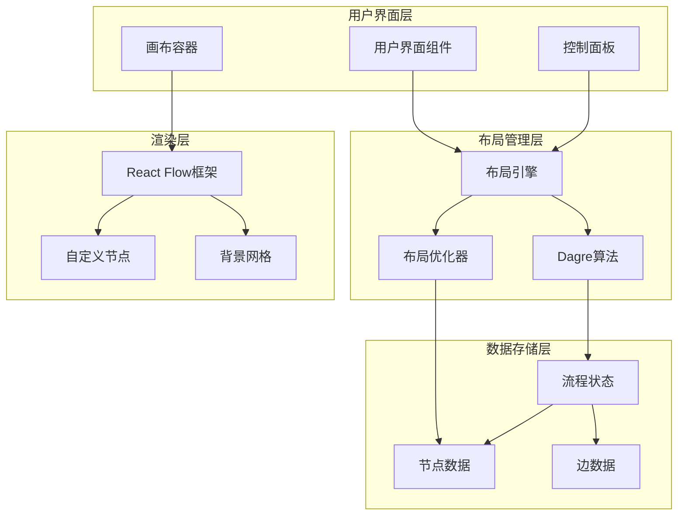
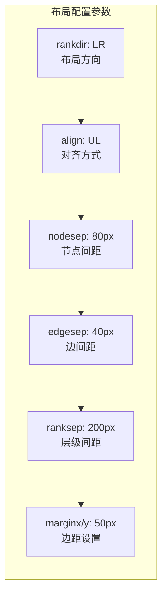
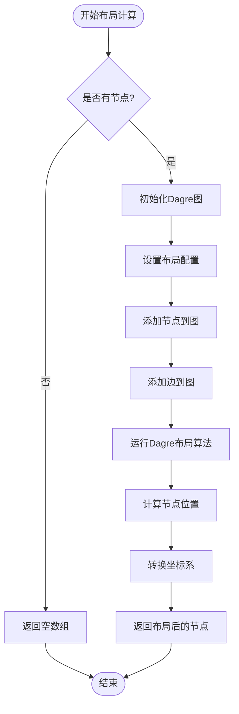
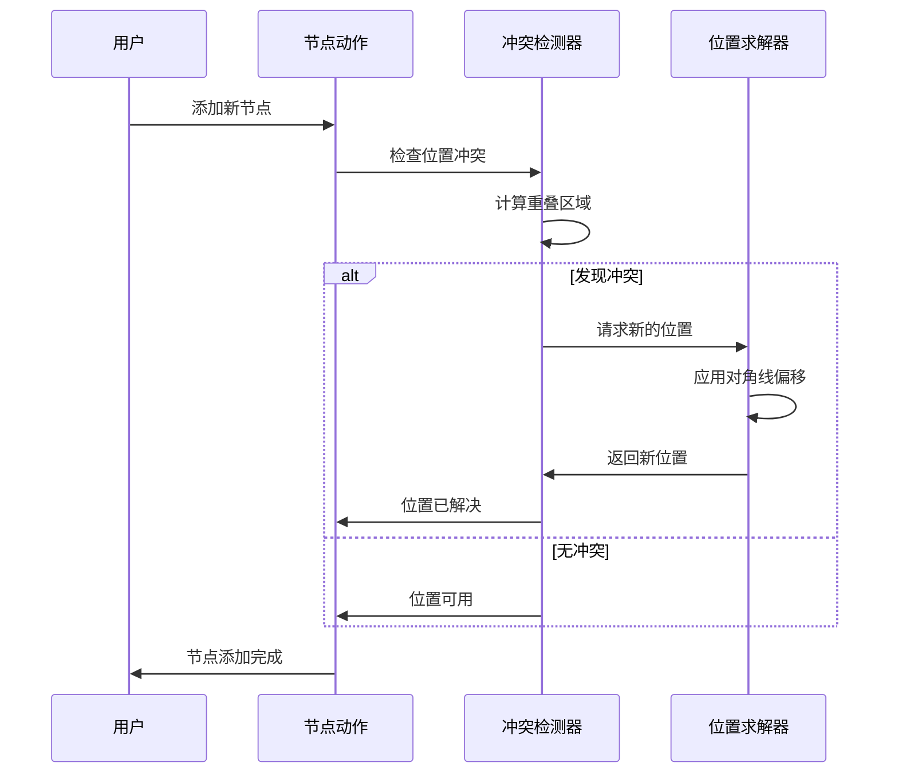
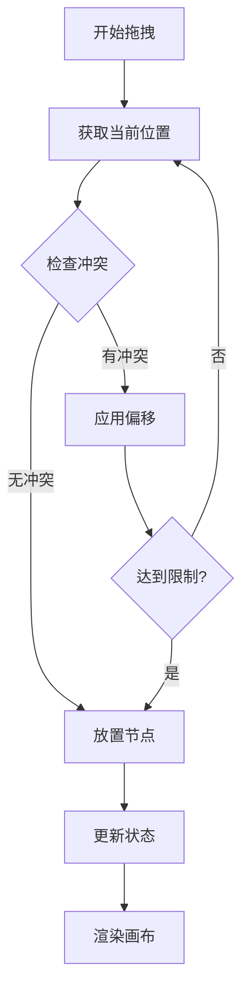
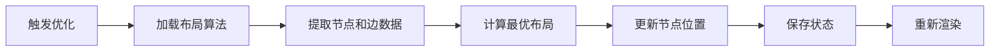
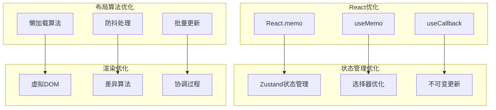
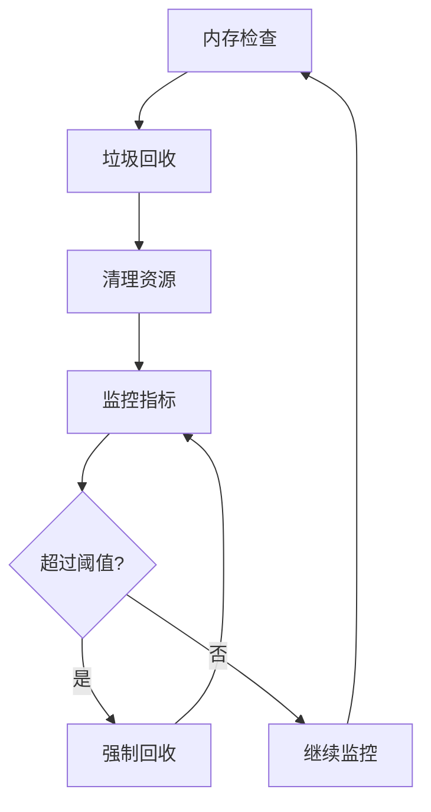
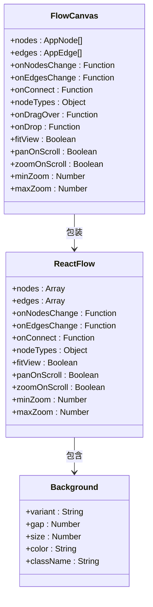
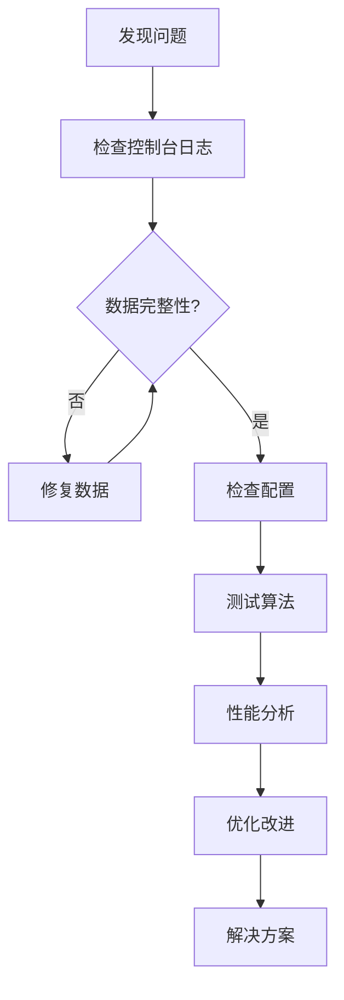

# 自动布局算法

<cite>
**本文档引用的文件**
- [layoutAlgorithm.ts](file://src/store/utils/layoutAlgorithm.ts)
- [nodeActions.ts](file://src/store/actions/nodeActions.ts)
- [flowStore.ts](file://src/store/flowStore.ts)
- [FlowCanvas.tsx](file://src/components/flow/FlowCanvas.tsx)
- [CustomNode.tsx](file://src/components/flow/CustomNode.tsx)
- [useZoomControl.ts](file://src/components/builder/hooks/useZoomControl.ts)
- [ControlDock.tsx](file://src/components/builder/ControlDock.tsx)
- [flow.ts](file://src/types/flow.ts)
- [initialState.ts](file://src/store/constants/initialState.ts)
</cite>

## 目录
1. [简介](#简介)
2. [系统架构概览](#系统架构概览)
3. [核心布局算法](#核心布局算法)
4. [节点定位策略](#节点定位策略)
5. [交互式布局管理](#交互式布局管理)
6. [性能优化机制](#性能优化机制)
7. [用户界面集成](#用户界面集成)
8. [故障排除指南](#故障排除指南)
9. [总结](#总结)

## 简介

Flash Flow 是一个基于 React 的可视化流程构建平台，其核心功能之一是提供智能的自动布局算法。该系统通过结合多种布局策略，为用户提供直观、高效的流程设计体验。自动布局算法不仅能够智能地安排节点位置，还能处理复杂的图形关系，确保流程图的可读性和美观性。

## 系统架构概览

Flash Flow 的布局系统采用分层架构设计，主要包含以下几个层次：

**图表来源**
- [FlowCanvas.tsx](file://src/components/flow/FlowCanvas.tsx#L1-L119)
- [layoutAlgorithm.ts](file://src/store/utils/layoutAlgorithm.ts#L1-L120)
- [flowStore.ts](file://src/store/flowStore.ts#L1-L263)

**章节来源**
- [FlowCanvas.tsx](file://src/components/flow/FlowCanvas.tsx#L1-L119)
- [layoutAlgorithm.ts](file://src/store/utils/layoutAlgorithm.ts#L1-L120)
- [flowStore.ts](file://src/store/flowStore.ts#L1-L263)

## 核心布局算法

### Dagre 布局算法

系统的核心布局算法基于 Dagre.js 库，这是一个专业级的有向图布局库，能够智能地计算节点的最佳位置。

#### 算法特性

| 特性 | 描述 | 配置参数 |
|------|------|----------|
| 节点重叠避免 | 自动检测并避免节点重叠 | `nodesep: 80px`, `edgesep: 40px` |
| 边路径优化 | 减少边的交叉和优化路径 | `ranksep: 200px` |
| 布局方向支持 | 支持水平和垂直布局 | `rankdir: 'LR'/'TB'` |
| 对齐方式 | 提供多种对齐选项 | `align: 'UL'` |

#### 布局配置详解

**图表来源**
- [layoutAlgorithm.ts](file://src/store/utils/layoutAlgorithm.ts#L19-L27)

#### 算法实现流程

**图表来源**
- [layoutAlgorithm.ts](file://src/store/utils/layoutAlgorithm.ts#L11-L67)

**章节来源**
- [layoutAlgorithm.ts](file://src/store/utils/layoutAlgorithm.ts#L1-L120)

### 垂直布局算法

除了标准的水平布局外，系统还提供了垂直布局算法，适用于特定的展示需求。

#### 垂直布局特点

| 参数 | 水平布局 | 垂直布局 | 说明 |
|------|----------|----------|------|
| rankdir | 'LR' | 'TB' | 布局方向不同 |
| ranksep | 200px | 150px | 层级间距调整 |
| 节点排列 | 左到右 | 上到下 | 排列方向相反 |

**章节来源**
- [layoutAlgorithm.ts](file://src/store/utils/layoutAlgorithm.ts#L74-L119)

## 节点定位策略

### 冲突检测与解决

系统实现了智能的节点冲突检测机制，确保新添加的节点不会与现有节点重叠。

#### 定位算法流程

**图表来源**
- [nodeActions.ts](file://src/store/actions/nodeActions.ts#L10-L34)

#### 冲突检测参数

| 参数 | 默认值 | 说明 |
|------|--------|------|
| OFFSET | 20px | 对角线偏移量 |
| MAX_ITERATIONS | 20 | 最大迭代次数 |
| OVERLAP_THRESHOLD | 10px | 重叠阈值 |

**章节来源**
- [nodeActions.ts](file://src/store/actions/nodeActions.ts#L1-L34)

### 动态节点放置

系统支持动态节点放置，能够在用户拖拽过程中实时计算最佳位置。

#### 放置策略

**图表来源**
- [nodeActions.ts](file://src/store/actions/nodeActions.ts#L15-L34)

## 交互式布局管理

### 布局优化功能

系统提供了多种布局优化功能，帮助用户快速整理复杂的流程图。

#### 优化功能列表

| 功能 | 触发方式 | 效果 |
|------|----------|------|
| 自动布局 | 点击按钮或快捷键 | 应用Dagre算法重新布局 |
| 适配视图 | 双击画布空白处 | 调整缩放和位置以适应画布 |
| 缩放控制 | 控制面板 | 支持50%-200%的缩放范围 |
| 平移导航 | 鼠标滚轮+Ctrl | 实现平移浏览 |

#### 布局优化流程

**图表来源**
- [flowStore.ts](file://src/store/flowStore.ts#L49-L57)

**章节来源**
- [flowStore.ts](file://src/store/flowStore.ts#L49-L57)
- [ControlDock.tsx](file://src/components/builder/ControlDock.tsx#L78-L135)

### 缩放控制系统

系统实现了精细的缩放控制系统，支持多种缩放模式和动画效果。

#### 缩放参数配置

| 参数 | 值 | 说明 |
|------|-----|------|
| ZOOM_LEVELS | [50, 75, 100, 125, 150, 200] | 预设缩放级别 |
| ZOOM_TIMING | 150ms | 缩放状态刷新间隔 |
| ZOOM_ANIMATION_DURATION | 200ms | 动画持续时间 |

**章节来源**
- [useZoomControl.ts](file://src/components/builder/hooks/useZoomControl.ts#L1-L86)

## 性能优化机制

### 渲染性能优化

系统采用了多层次的性能优化策略，确保流畅的用户体验。

#### 优化技术栈

**图表来源**
- [FlowCanvas.tsx](file://src/components/flow/FlowCanvas.tsx#L24-L69)
- [flowStore.ts](file://src/store/flowStore.ts#L1-L263)

#### 性能优化措施

| 优化项 | 实现方式 | 性能提升 |
|--------|----------|----------|
| 节点组件缓存 | React.memo包装 | 避免不必要的重渲染 |
| 边配置缓存 | useMemo缓存 | 减少对象创建开销 |
| 布局算法懒加载 | 动态导入 | 减少初始包大小 |
| 状态更新防抖 | 800ms防抖 | 减少频繁保存操作 |

**章节来源**
- [FlowCanvas.tsx](file://src/components/flow/FlowCanvas.tsx#L24-L119)
- [flowStore.ts](file://src/store/flowStore.ts#L52-L57)

### 内存管理

系统实现了智能的内存管理机制，防止内存泄漏和过度消耗。

#### 内存优化策略

## 用户界面集成

### 画布组件架构

FlowCanvas 组件作为布局系统的核心容器，集成了所有布局相关的功能。

#### 组件结构

**图表来源**
- [FlowCanvas.tsx](file://src/components/flow/FlowCanvas.tsx#L33-L118)

**章节来源**
- [FlowCanvas.tsx](file://src/components/flow/FlowCanvas.tsx#L1-L119)

### 节点样式系统

系统提供了丰富的节点样式定制能力，支持多种视觉效果。

#### 节点样式配置

| 样式属性 | 默认值 | 说明 |
|----------|--------|------|
| min-width | 240px | 节点最小宽度 |
| border | 1px solid | 边框样式 |
| shadow | 0 4px 6px | 阴影效果 |
| transition | 200ms | 过渡动画 |
| selected | ring-2 ring-black | 选中状态样式 |

**章节来源**
- [CustomNode.tsx](file://src/components/flow/CustomNode.tsx#L115-L184)

## 故障排除指南

### 常见问题及解决方案

#### 布局异常问题

| 问题描述 | 可能原因 | 解决方案 |
|----------|----------|----------|
| 节点重叠严重 | 布局算法参数不当 | 调整 `nodesep` 和 `ranksep` 参数 |
| 边路径混乱 | 图结构复杂度过高 | 优化节点连接关系 |
| 性能下降 | 节点数量过多 | 启用虚拟化或分批加载 |
| 缩放异常 | 浏览器兼容性问题 | 检查 WebGL 支持 |

#### 调试技巧

### 性能监控

系统内置了性能监控机制，帮助开发者识别和解决性能瓶颈。

#### 监控指标

| 指标 | 正常范围 | 警告阈值 | 处理建议 |
|------|----------|----------|----------|
| 布局计算时间 | < 100ms | > 500ms | 优化算法或减少节点数 |
| 渲染帧率 | > 60fps | < 30fps | 启用虚拟化或减少复杂度 |
| 内存使用 | < 100MB | > 500MB | 检查内存泄漏 |
| 缩放响应时间 | < 100ms | > 300ms | 优化事件处理 |

## 总结

Flash Flow 的自动布局算法系统是一个功能完整、性能优异的解决方案。它通过以下关键特性为用户提供了卓越的体验：

### 核心优势

1. **智能布局算法**：基于 Dagre.js 的专业布局算法，能够自动避免节点重叠和优化边路径
2. **灵活的配置选项**：支持多种布局方向、对齐方式和间距设置
3. **高性能实现**：采用多层次优化策略，确保流畅的用户体验
4. **用户友好的交互**：提供直观的控制面板和实时预览功能
5. **可扩展架构**：模块化的设计便于功能扩展和维护

### 技术亮点

- **懒加载机制**：布局算法按需加载，减少初始包大小
- **防抖优化**：状态更新采用防抖机制，避免频繁保存操作
- **缓存策略**：关键计算结果被智能缓存，提高响应速度
- **错误处理**：完善的错误边界和降级机制

### 应用价值

该布局算法系统不仅提升了用户体验，还为后续的功能扩展奠定了坚实的基础。通过持续的优化和改进，系统能够适应更复杂的业务场景和更高的性能要求。