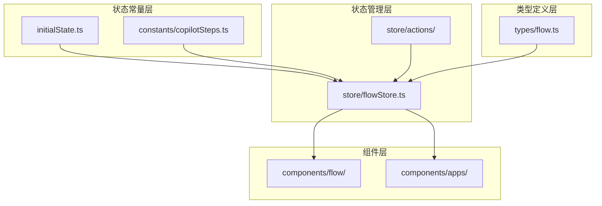
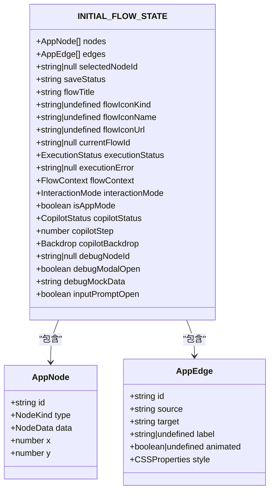
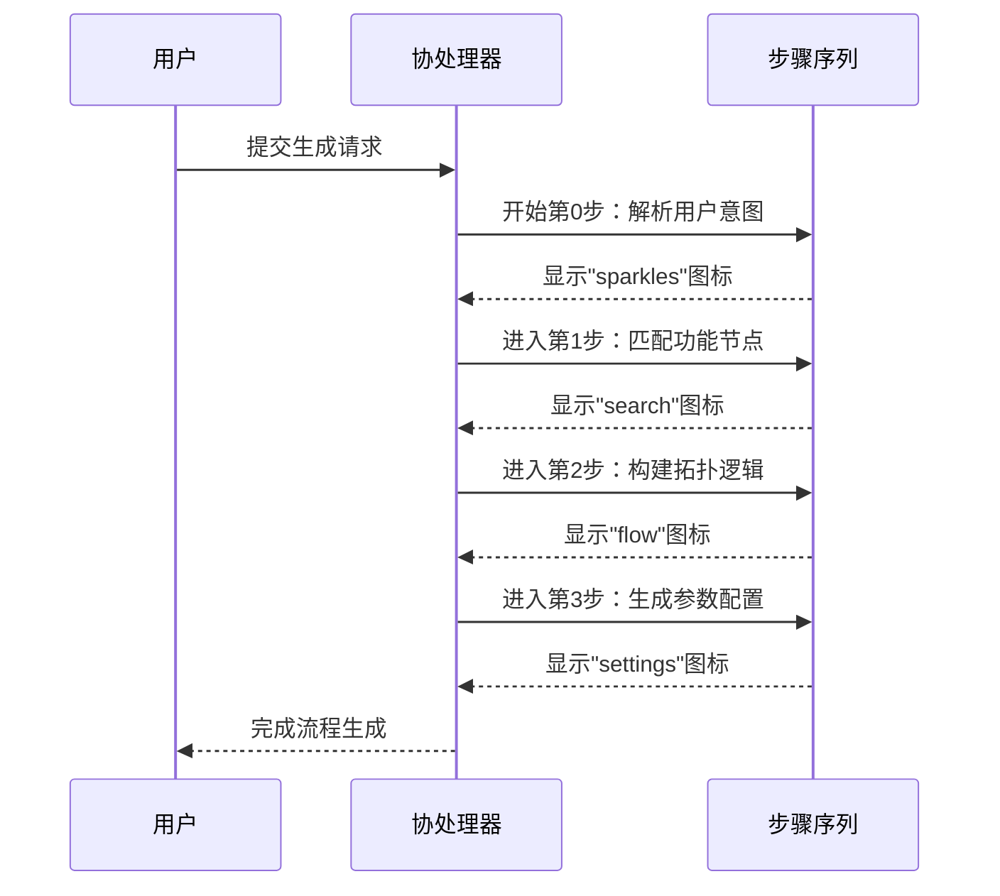
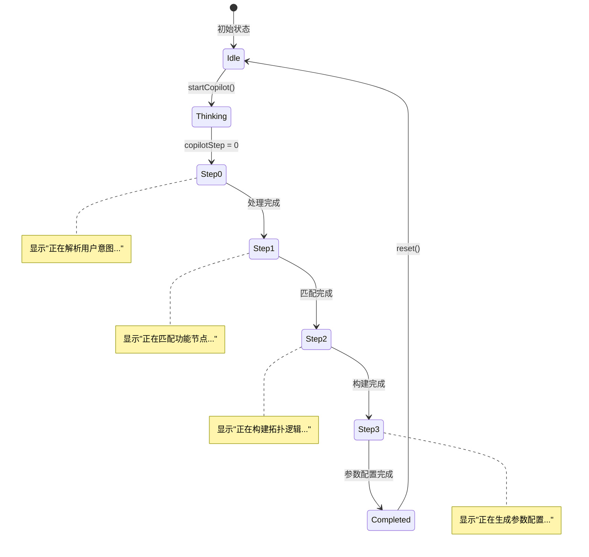
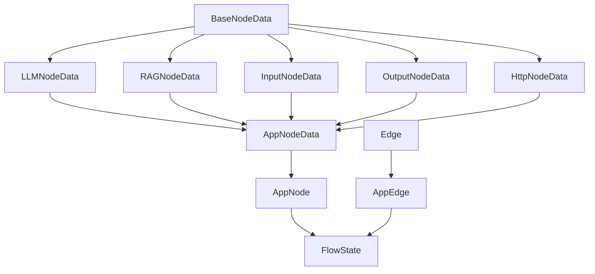
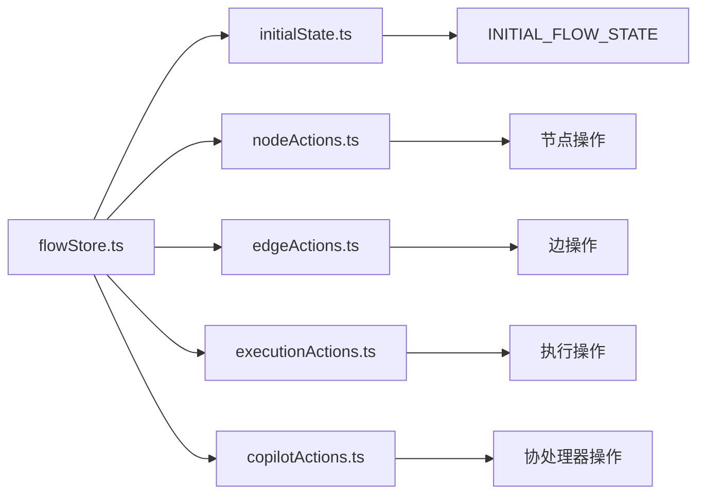
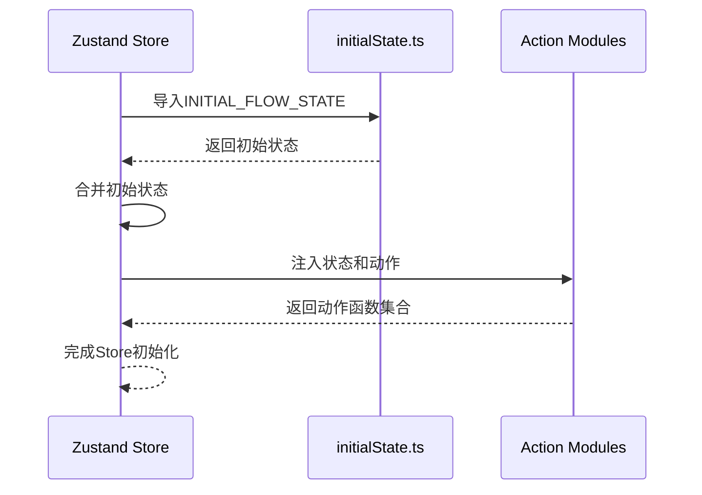

# 状态常量与初始状态

<cite>
**本文档引用的文件**
- [initialState.ts](file://src/store/constants/initialState.ts)
- [copilotSteps.ts](file://src/store/constants/copilotSteps.ts)
- [flow.ts](file://src/types/flow.ts)
- [flowStore.ts](file://src/store/flowStore.ts)
- [copilotActions.ts](file://src/store/actions/copilotActions.ts)
- [CopilotOverlay.tsx](file://src/components/flow/CopilotOverlay.tsx)
</cite>

## 目录
1. [简介](#简介)
2. [项目结构概览](#项目结构概览)
3. [初始状态常量系统](#初始状态常量系统)
4. [引导式交互步骤常量](#引导式交互步骤常量)
5. [TypeScript类型系统集成](#typescript类型系统集成)
6. [状态管理架构](#状态管理架构)
7. [实际应用场景](#实际应用场景)
8. [扩展与修改指南](#扩展与修改指南)
9. [最佳实践建议](#最佳实践建议)
10. [总结](#总结)

## 简介

Flash Flow SaaS是一个基于React和TypeScript的状态管理系统，采用了精心设计的常量定义和初始状态配置方案。该系统通过明确的常量定义和严格的类型约束，确保了代码的可维护性、类型安全性和用户体验的一致性。本文档详细分析了状态管理系统中的常量定义与初始状态配置，包括`initialState.ts`中定义的FlowState初始结构和`copilotSteps.ts`中定义的引导式交互步骤序列。

## 项目结构概览

状态管理系统的核心文件组织如下：



**图表来源**
- [initialState.ts](file://src/store/constants/initialState.ts#L1-L32)
- [copilotSteps.ts](file://src/store/constants/copilotSteps.ts#L1-L7)
- [flowStore.ts](file://src/store/flowStore.ts#L1-L131)

## 初始状态常量系统

### FlowState初始结构设计

`initialState.ts`文件定义了整个应用的初始状态结构，采用模块化的设计原则，将不同类型的属性分组管理：



**图表来源**
- [initialState.ts](file://src/store/constants/initialState.ts#L8-L30)
- [flow.ts](file://src/types/flow.ts#L45-L51)

### 核心字段设计意图

#### 基础画布状态
- **nodes**: 初始化为空数组，表示从空白画布开始，用户可以选择AI生成或手动添加节点
- **edges**: 初始化为空数组，确保没有预设的连接关系
- **selectedNodeId**: 设置为null，避免预选节点导致的意外操作

#### 流程元数据
- **flowTitle**: 默认设置为"Untitled Flow"，提供通用的标题占位符
- **flowIconKind/Name/Url**: 可选的图标配置，支持多种图标类型
- **currentFlowId**: 初始化为null，表示未保存的流程

#### 执行状态管理
- **executionStatus**: 初始设置为"idle"，表示空闲状态
- **executionError**: 初始化为null，错误状态需要显式设置
- **flowContext**: 空对象，用于存储各节点的执行上下文

#### 用户交互控制
- **interactionMode**: 默认为"select"模式，允许用户选择和编辑节点
- **isAppMode**: 标识应用模式状态
- **copilotStatus**: 初始设置为"idle"，表示协处理器处于空闲状态

**章节来源**
- [initialState.ts](file://src/store/constants/initialState.ts#L1-L32)

### 类型安全设计

系统通过TypeScript的类型系统确保状态的一致性：

| 字段名称 | 类型定义 | 设计考虑 |
|---------|---------|---------|
| `nodes` | `AppNode[]` | 强类型节点数组，支持所有节点类型 |
| `edges` | `AppEdge[]` | 强类型边数组，包含额外的视觉属性 |
| `executionStatus` | `"idle" \| "running" \| "completed" \| "error"` | 枚举类型，限制执行状态范围 |
| `interactionMode` | `"select" \| "pan"` | 互斥的交互模式 |
| `copilotStatus` | `"idle" \| "thinking" \| "completed"` | 协处理器状态枚举 |

## 引导式交互步骤常量

### COPILOT_STEPS设计

`copilotSteps.ts`定义了AI协处理器的引导式交互步骤序列，每个步骤包含文本描述和对应的图标：



**图表来源**
- [copilotSteps.ts](file://src/store/constants/copilotSteps.ts#L1-L7)
- [CopilotOverlay.tsx](file://src/components/flow/CopilotOverlay.tsx#L1-L64)

### 步骤序列详解

| 步骤索引 | 文本描述 | 图标类型 | 功能含义 |
|---------|---------|---------|---------|
| 0 | "正在解析用户意图..." | sparkles | 分析用户输入，理解需求 |
| 1 | "正在匹配功能节点 (RAG, LLM)..." | search | 搜索合适的节点类型 |
| 2 | "正在构建拓扑逻辑..." | flow | 设计节点间的连接关系 |
| 3 | "正在生成参数配置..." | settings | 配置节点的具体参数 |

### 状态机作用

COPILOT_STEPS在用户引导流程中扮演着状态机的角色：



**图表来源**
- [copilotActions.ts](file://src/store/actions/copilotActions.ts#L8-L34)

**章节来源**
- [copilotSteps.ts](file://src/store/constants/copilotSteps.ts#L1-L7)

## TypeScript类型系统集成

### 类型定义层次

系统采用了分层的类型定义策略：



**图表来源**
- [flow.ts](file://src/types/flow.ts#L13-L44)

### 类型安全特性

#### 字面量类型约束
系统广泛使用字面量类型确保状态值的有效性：

```typescript
// 执行状态约束
export type ExecutionStatus = "idle" | "running" | "completed" | "error";

// 交互模式约束  
export type InteractionMode = "select" | "pan";

// 协处理器状态约束
export type CopilotStatus = "idle" | "thinking" | "completed";
```

#### 泛型约束
通过泛型确保数据的一致性：

```typescript
export interface FlowContext {
  [nodeId: string]: Record<string, unknown>;
}

export type FlowState = {
  nodes: AppNode[];
  edges: AppEdge[];
  flowContext: FlowContext;
  // ... 其他字段
};
```

**章节来源**
- [flow.ts](file://src/types/flow.ts#L1-L153)

## 状态管理架构

### Zustand Store集成

系统采用Zustand作为状态管理库，通过模块化的方式组织状态和动作：



**图表来源**
- [flowStore.ts](file://src/store/flowStore.ts#L1-L131)

### 状态初始化流程



**图表来源**
- [flowStore.ts](file://src/store/flowStore.ts#L17-L31)

**章节来源**
- [flowStore.ts](file://src/store/flowStore.ts#L1-L131)

## 实际应用场景

### CopilotOverlay组件集成

CopilotOverlay组件展示了常量在实际UI中的应用：

```mermaid
flowchart TD
A[CopilotOverlay] --> B{copilotStatus检查}
B --> |idle| C[返回null]
B --> |thinking| D[显示覆盖层]
D --> E[获取copilotStep]
E --> F[映射到ICON数组]
F --> G[显示当前步骤文本]
G --> H[显示进度动画]
H --> I[COPILOT_STEPS[copilotStep].text]
I --> J[动态更新显示内容]
```

**图表来源**
- [CopilotOverlay.tsx](file://src/components/flow/CopilotOverlay.tsx#L9-L63)

### 状态同步机制

系统通过以下机制确保状态的一致性：

| 组件 | 监听状态 | 更新方式 | 触发条件 |
|------|---------|---------|---------|
| CopilotOverlay | copilotStatus, copilotStep | 状态订阅 | 状态变化时自动更新 |
| FlowCanvas | nodes, edges | 动作触发 | 用户操作或API调用 |
| ExecutionMonitor | executionStatus, executionError | 状态监听 | 执行状态变化 |

**章节来源**
- [CopilotOverlay.tsx](file://src/components/flow/CopilotOverlay.tsx#L1-L64)

## 扩展与修改指南

### 修改初始状态

要修改初始状态，需要遵循以下步骤：

#### 1. 更新initialState.ts

```typescript
// 添加新的状态字段
export const INITIAL_FLOW_STATE = {
  // ... 现有字段
  newFeatureFlag: false,           // 新增布尔标志
  newConfigValue: "default",       // 新增字符串配置
  newTimeoutDuration: 3000,        // 新增数值配置
};

// 更新FlowState类型定义
export type FlowState = {
  // ... 现有类型
  newFeatureFlag: boolean;
  newConfigValue: string;
  newTimeoutDuration: number;
};
```

#### 2. 更新类型定义

确保新的状态字段在FlowState类型中正确定义：

```typescript
// 在flow.ts中添加新字段类型
export type FlowState = {
  // ... 现有字段
  newFeatureFlag: boolean;
  newConfigValue: string;
  newTimeoutDuration: number;
};
```

#### 3. 添加相应的动作函数

```typescript
// 在flowStore.ts中添加setter
setNewFeatureFlag: (value: boolean) => set({ newFeatureFlag: value }),
setNewConfigValue: (value: string) => set({ newConfigValue: value }),
```

### 扩展引导步骤

要扩展COPILOT_STEPS，可以按照以下方式：

```typescript
export const COPILOT_STEPS = [
  // ... 现有步骤
  { text: "正在进行性能优化...", icon: "zap" },  // 新增步骤
  { text: "正在生成部署配置...", icon: "cloud" }, // 新增步骤
];
```

### 最佳实践

#### 1. 常量命名规范
- 使用UPPER_SNAKE_CASE命名常量
- 保持语义清晰的命名
- 避免魔法数字和字符串

#### 2. 类型安全原则
- 优先使用枚举类型而非字符串字面量
- 利用TypeScript的类型推断
- 保持类型定义的一致性

#### 3. 状态设计原则
- 避免冗余状态
- 保持状态的最小化
- 确保状态的不可变性

## 最佳实践建议

### 代码组织原则

1. **单一职责**: 每个常量文件专注于特定的功能领域
2. **类型驱动**: 从类型定义开始设计状态结构
3. **向后兼容**: 修改状态时考虑现有代码的兼容性

### 性能优化建议

1. **懒加载**: 对于大型状态结构，考虑使用懒加载
2. **状态分割**: 将不相关的状态分割到不同的模块
3. **缓存策略**: 对计算密集型状态使用缓存

### 调试友好性

1. **状态快照**: 提供状态的序列化和反序列化能力
2. **时间旅行**: 支持状态的历史记录和回滚
3. **开发者工具**: 集成Redux DevTools或其他调试工具

## 总结

Flash Flow SaaS的状态管理系统通过精心设计的常量定义和初始状态配置，实现了高度的可维护性和类型安全性。系统的核心优势包括：

1. **模块化设计**: 将不同类型的状态分离到独立的常量文件中
2. **类型安全**: 通过TypeScript确保状态的一致性和有效性
3. **状态机模式**: 使用引导步骤实现复杂的用户交互流程
4. **可扩展性**: 提供清晰的扩展路径和修改指南
5. **用户体验**: 通过精确的状态控制提供流畅的用户界面

这种设计模式不仅提高了代码的质量和可维护性，还为未来的功能扩展奠定了坚实的基础。开发者可以通过遵循本文档提供的指南，安全地修改初始状态或扩展步骤序列，同时保持系统的整体稳定性和一致性。